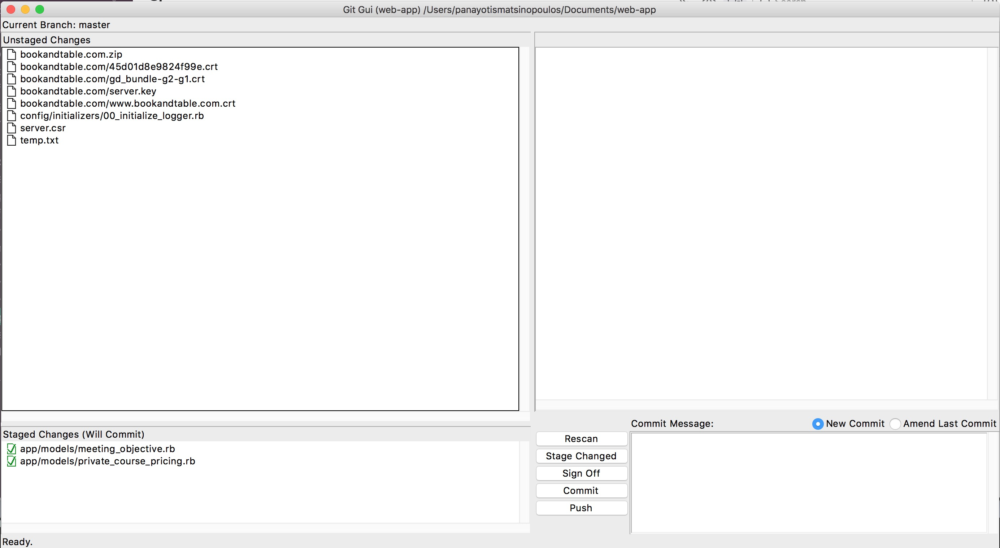

## Question #1 - Which GUI command we can use to see the current state of our project?
     
*Fill In The Blanks*
     
``` bash
_________________________________________
```

## Question #2 - Assuming that you have the following picture, can you tell how many files exist in the staging area?


*Multiple Choice*

1. 0
2. 2
3. 8
4. 10

## Question #3 - Does the `git gui` command allow me to create commits?

*Multiple Choice*

1. Yes
2. No

## Question #4 - The `git gui` command does not allow me to change the commit message of the last commit.

*True/False*

1. True
2. False

## Question #5 - `git gui` allows me to commit parts of the changes that I have done on a file and not necessarily all of them at once.

*True/False*

1. True
2. False

## Question #6 - How do we call the different parts of the file that include changes that we have done?

*Fill In the Blanks*

``` bash
_________________________________________________
```

## Question #7 - What is the GUI tool that gives you the commit history of your project?

*Fill In The Blanks*

``` bash
_________________________________________________
```

## Question #8 - The `gitk` tool allows you to create commits

*True/False*

1. True
2. False

## Question #9 - In `gitk`, what does the red circle / node represent?

*Multiple Choice*

1. It contains the untracked files.
2. It contains the untracked modified files.
3. It contains the staged modified files.
4. It contains the tracked unstaged modified files.

## Question #10 - In `gitk`, what does the green circle / node represent?

*Multiple Choice*

1. It represents a commit. 
2. It represents the staged changes, i.e. the changes that are ready to be committed. 
3. It represents the diff between commit and stage.
4. It represents the untracked files.

## Question #11 - RubyMine, unfortunately, does not offer `git` integration.

*True/False*

1. True
2. False
