Let's inspect, one more time, the current status of our project using `gitk`. 

This is the picture that you should get:

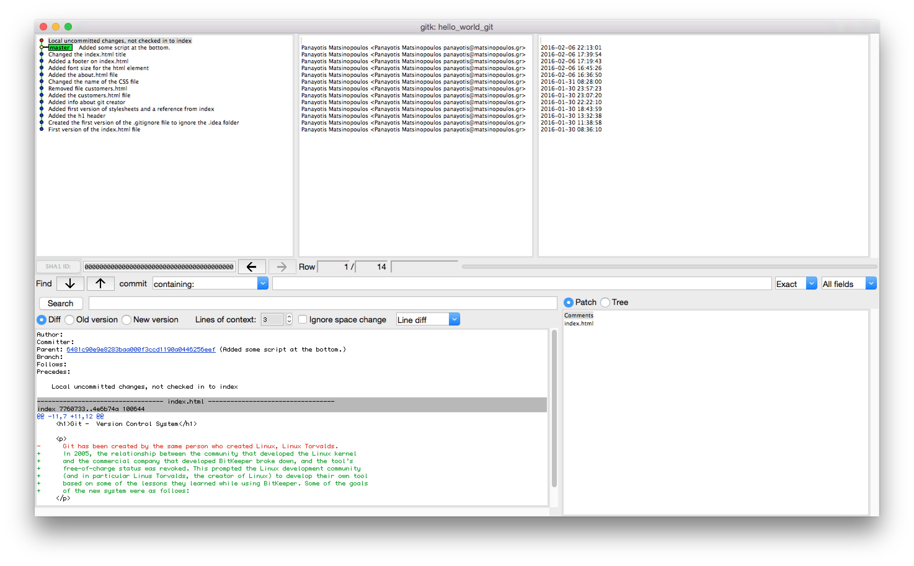

Let's very quickly do the commit for this change:

```
git commit -am "Added some extra comment about git history in the index.html paragraph"
```

and let's reload the `gitk` content:

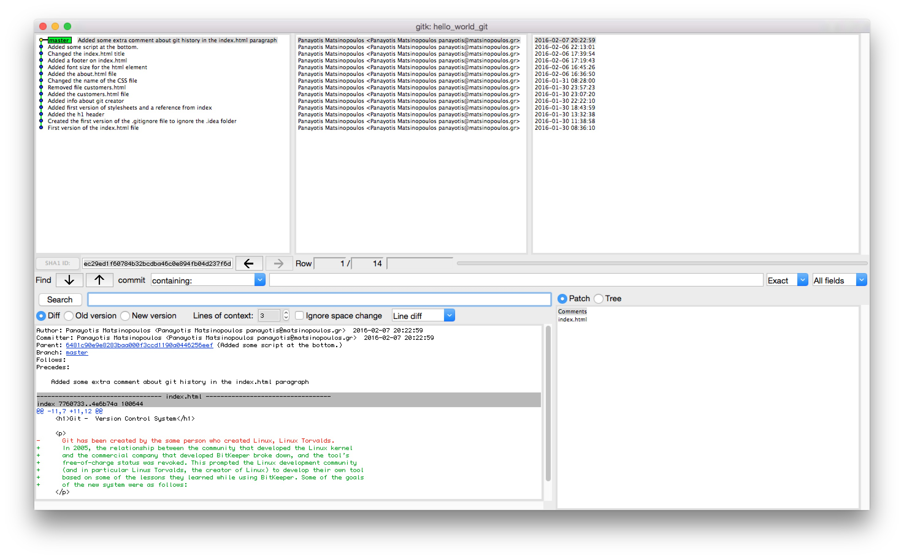

Now, we do not have any pending changes. Everything is committed.

### `master` branch

As you can see, at the top of the `gitk` picture, the last commit is flagged with the label `master`. The `master`, is the name of the **branch** the particular commit belongs to. 
A project that is being tracked by `git` may have many branches. The branches are different chains of changes. These branches are here to help us organize our development work and accommodate 
the need for parallel feature (or other type of change) development. 

We will explain here what we mean.

Let's suppose that a developer gets the requirements to develop a new feature, named "Low Stock Email Notification". And let's suppose that the current status of the project is the 
one that we saw above. The `master` commit is on production and is serving customers. What the developer should do, is to not touch the `master` branch. He should start working on another
branch, branching from the `master` commit:

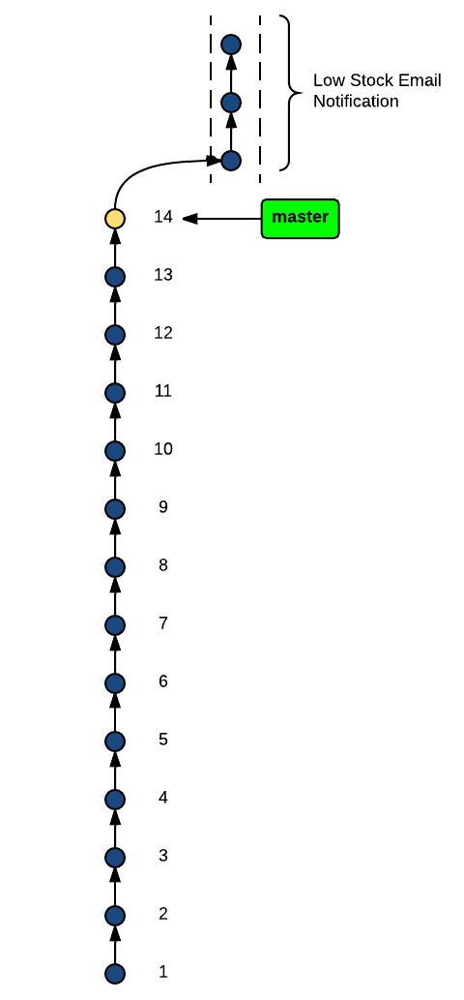

Why is that? Why the developer needs to start working on another branch? This is because the feature might take quite a lot of time, even days, to finish. Till it is finished and ready for
production, being composed of many little commits, a need to fix something urgent on production system might arise. In that case, the developer should stop working on that (unfinished) feature
and switch back his working directory to the version of the project that corresponds to production. The version that corresponds to production is the one that is pointed to
by the `master` branch. That's why this branch should be clean from new commits. It should not have anything that might not be ready to be pushed to production. And the developer
should be able to switch back to that, in order to quickly fix any production, urgent, bug.


Having said the above, we need to learn:

1. How git allows us to create a branch, branching out from an existing one.
2. How git allows us to switch from one branch back to another.

### `git checkout`

Let's go and create a new branch for the feature "Low Stock Email Notification". We are suggesting that you name your branches in a consistent way. For example, the 
feature branches, name them with the prefix `feature-`. Hence, we are going to name our new branch `feature-low-stock-email-notification`.

Run the following command:

```
git checkout -b feature-low-stock-email-notification
```

The output you will get is this:

```
Switched to a new branch 'feature-low-stock-email-notification'
```

This command that we used 

1. creates the new branch (named: `feature-low-stock-email-notification`), and
2. switches our working directory to this new branch, which means that any new commit that we will do, will belong to this new branch, and not to `master` branch.

Let's reload the `gitk` content. What you will see is this:

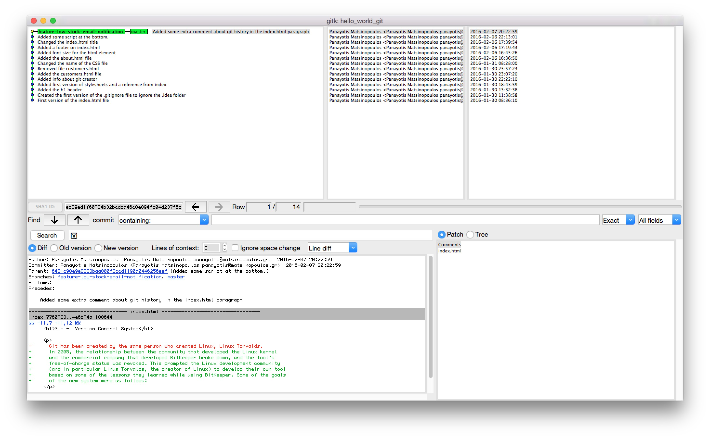

You now see that the last commit has been flagged with 2 branch icons. Besides the `master` flag, there is also the new flag `feature-low-stock-email-notification` that 
corresponds to the new branch that we have just created. Do you see any difference between the two branch icons? The `feature-low-stock-email-notification` is with bold label,
whereas the `master` is with normal label. When a branch label is bold, this means that this is the **current branch**, i.e. the branch that we are working on. Every new commit
that we will do, will affect the current branch. Not other.


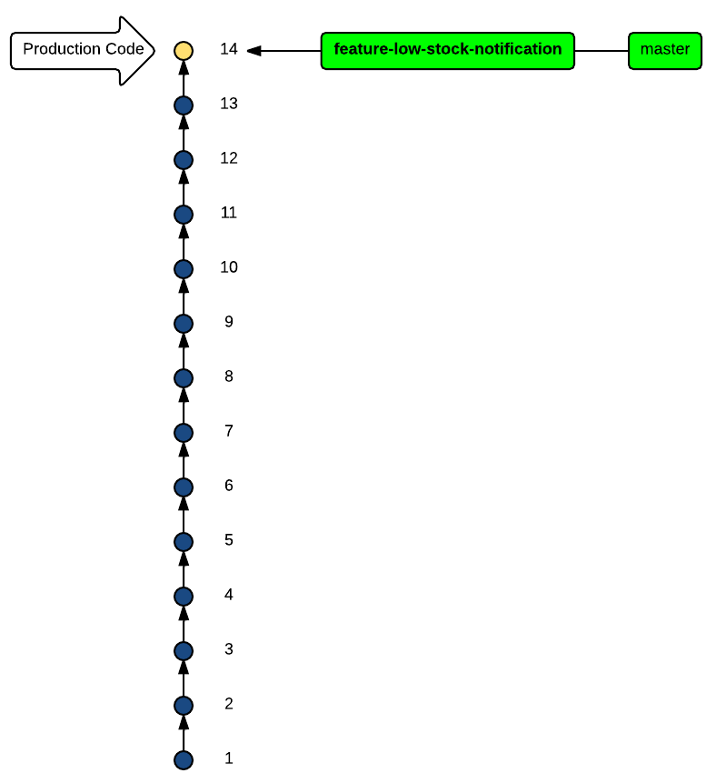

> *Hint:* Don't get confused if you now see both branches being on the same commit. They are different branches and we are on branch `feature-low-stock-email-notification`. They
point to the same version of the project, 15th commit, but this is only because we have not yet added any new commit to the new feature.

Now, let's change the current branch back to `master`. This can be done, again, with the `git checkout` command, but without the `-b` switch. Give the following command:

```
git checkout master
```

What you now see with `gitk` is the following:


The bold label is on `master` branch. This is because, this is, now, the current branch.

Note that whenever you execute the command `git status`, you always get the current branch at the top of the output. I.e. `git status` tells you which is the current branch. Run
`git status` to see that:

```
On branch master
nothing to commit, working directory clean
```

Do you see the `On branch master`? This is how `git status` tells you which is the current branch.

### `git branch`

You can, however, get the list of branches and the current branch, with the command `git branch`. Try that:

```
git branch
```

What you will get is this:

```
  feature-low-stock-email-notification
* master
```

This is the list of the branches of the project. And the current branch is clearly indicated with a `*` in front of its name.

### Enhancing the prompt to include the branch

Sometimes it is quite useful to have the command line prompt include the name of the branch that you are working on. You should set the PS1 environment variable so that it
displays the current branch. 

If you are using `bash` and your terminals load the `.bash_profile` file, you can add the following lines:

``` bash
# Git branch in prompt.

parse_git_branch() {

    git branch 2> /dev/null | sed -e '/^[^*]/d' -e 's/* \(.*\)/ (\1)/'

}

export PS1="\u@\w\[\033[32m\]\$(parse_git_branch)\[\033[00m\] $ "
```
The above `export` will set your command line prompt so that it includes the username of the currently logged in user, the present working directory and the branch name
if the current folder is tracked by git.


### Adding commits to new branch

Now switch back to the new branch, `feature-low-stock-email-notification`:

```
git checkout feature-low-stock-email-notification
```

You should see the following:

```
Switched to branch 'feature-low-stock-email-notification'
panayotismatsinopoulos@~/Documents/hello_world_git (feature-low-stock-email-notification) $ 
```
The command line prompt now displays the name of the current branch. Hence, you will not have to use the `git branch` command to verify that.

Let's add some content to the project, while we are on `feature-low-stock-email-notifications`. We will add the file `email_notifications.html`, with the following content:
 
``` html
<!DOCTYPE html>
<html>
  <head>
    <meta charset="utf-8">
    <meta name="viewport" content="width=device-width, initial-scale=1">
    <title>Email Notifications</title>
  </head>
  <body>
    <h1>Email Notifications</h1>
  </body>
</html>
```
 
Now, the git status will return this:

```
On branch feature-low-stock-email-notification
Untracked files:
  (use "git add <file>..." to include in what will be committed)

        email_notifications.html

nothing added to commit but untracked files present (use "git add" to track)
```

As it is mentioned above, we have one untracked file to branch `feature-low-stock-email-notification`. Let's commit the change:

```
git add .
git commit -m "Added first version of email notifications"
```

You will get something like this:

```
[feature-low-stock-email-notification 4d6c56d] Added first version of email notifications
 1 file changed, 11 insertions(+)
 create mode 100644 email_notifications.html
```
which verifies that we have just created a new commit (hash: `4d6c56d`) on branch `feature-low-stock-email-notification`.

Let's see now the image that `gitk` gives:

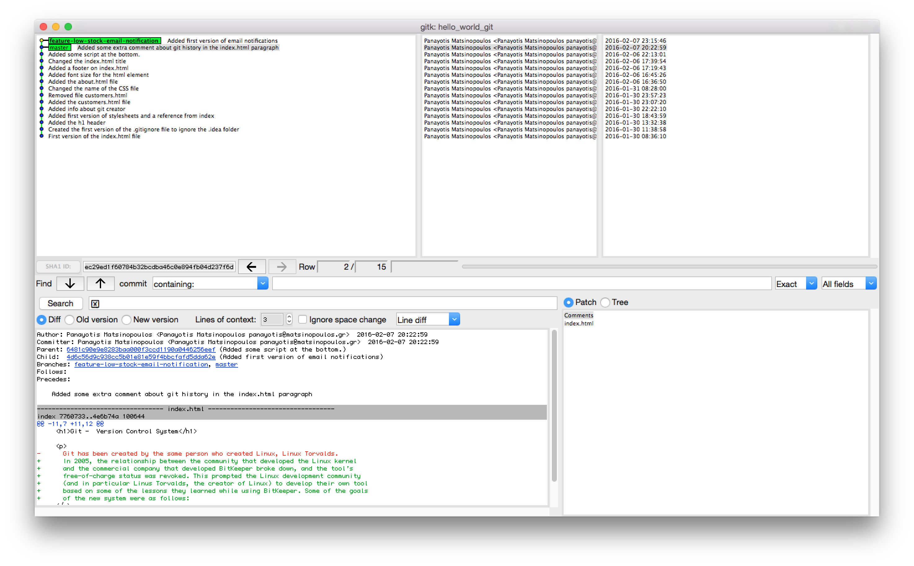

Or another view here:

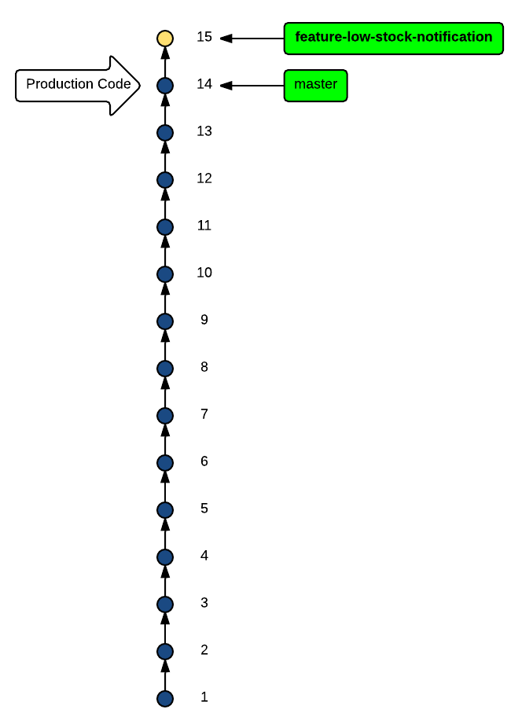

As you can see above, the feature branch now starts to be extended out from the master branch. It has a new commit that the master branch does not have. Let's create one more 
change and commit that too.

Make sure that the `email_notifications.html` file has the following content:

``` html
<!DOCTYPE html>
<html>
  <head>
    <meta charset="utf-8">
    <meta name="viewport" content="width=device-width, initial-scale=1">
    <title>Email Notifications</title>
  </head>
  <body>
    <h1>Email Notifications</h1>

    <p>
      You will be notified in the following cases:
    </p>
  </body>
</html>
```

We have added a new `p` element in the file. Let's commit that:

``` 
git commit -am "Added a p to email_notifications.html"
```

The successful commit will print something like this:

```
[feature-low-stock-email-notification b8024f3] Added a p to email_notifications.html
 1 file changed, 4 insertions(+)
panayotismatsinopoulos@~/Documents/hello_world_git (feature-low-stock-email-notification) $
```

Now let's reload the `gitk` picture. You will see this:

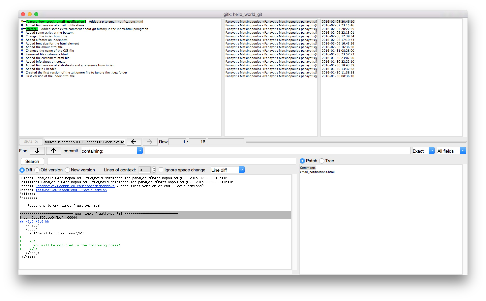

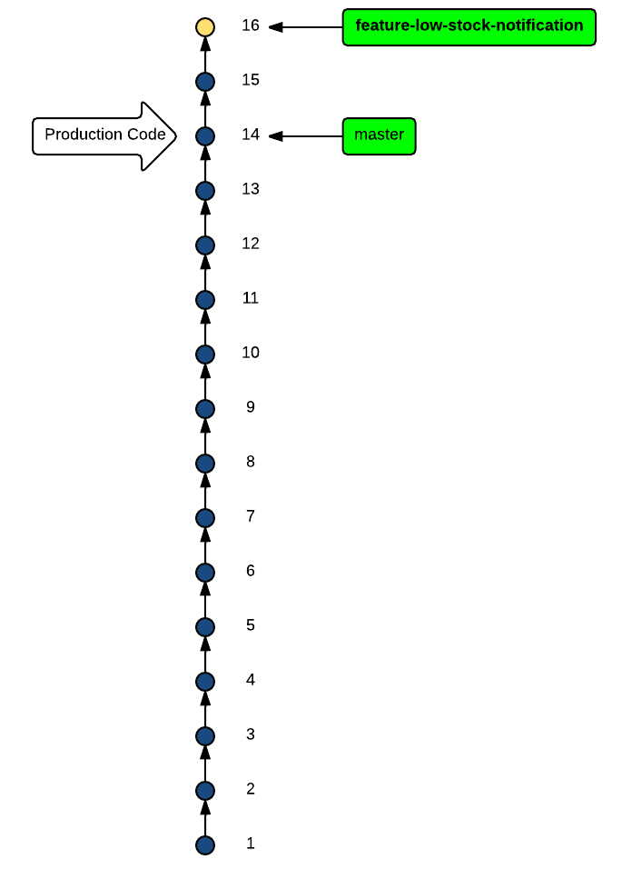

Two more commits away. The feature branch has two extra commits, if compared to the commits of `master` branch. 

### Merging feature branch work

Assuming that we have finished our work on the feature branch, we would like, then, to merge our work to the master branch work. Let's do it. Run the following commands:

1) We need to switch to the merge destination branch. 

The merge destination branch is now considered to be the `master` branch. So, we have to switch to that branch first:

```
git checkout master
```

2) We then need to merge our work from the feature branch.

The merge source, `feature-low-stock-email-notification` feature branch needs to be merged to the merge destination, the `master` branch. This is done with the `git merge` command,
which takes as argument the merge source branch name. Run the following command:

```
git merge feature-low-stock-email-notification
```

You will get the following output:

```
Updating ec29ed1..b8024f3
Fast-forward
 email_notifications.html | 15 +++++++++++++++
 1 file changed, 15 insertions(+)
 create mode 100644 email_notifications.html
```

The merge has been successful. Watch out the `fast-forward` property of the merge that has been reported by the merge command. We will explain, later on, what a `fast-forward` merge
is. For now, let's think about what do we expect by the merge that we just did. We expect the 2 commits that existed only on `feature-low-stock-email-notification` branch to now
exist on `master` branch too.

This is what we expect the current status to be:

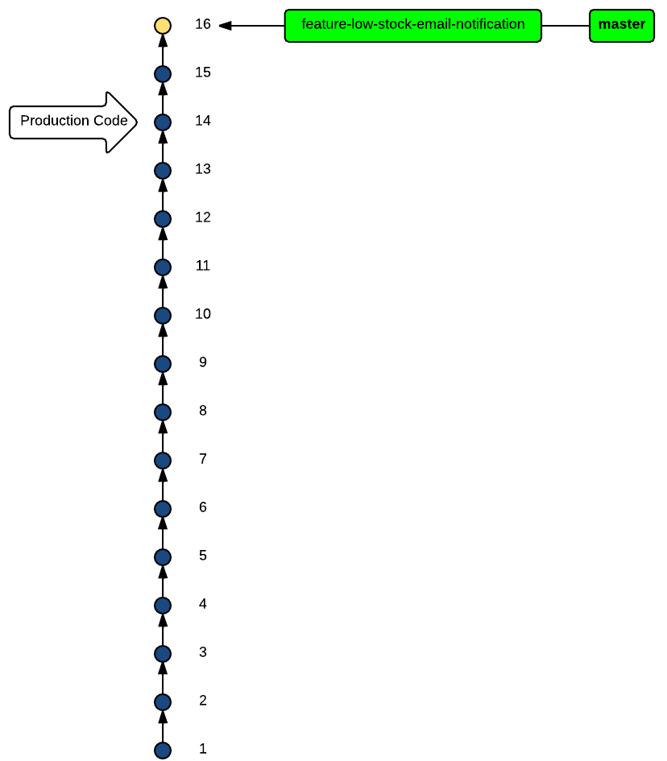

In other words, as you can see above, we expect the master branch label to now point where the feature branch label is, to the same commit. Let's verify that with `gitk`. Reload
`gitk` picture:

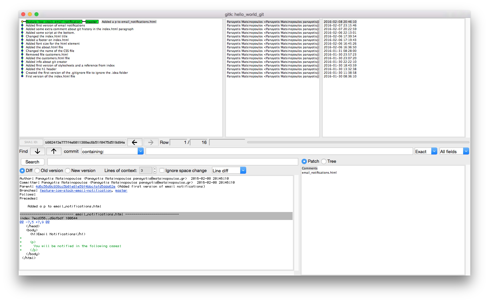

Perfect! `gitk` verifies what we expected. The `master` branch label is on the same commit like the feature branch label. Also, the `master` branch label is bold, because this is the
current branch.

### No fast-forward Merging

Everything has gone according to plan, but there is a small problem that you might want to avoid in the future. If one looks at the commit tree, does not know which commits
have contributed to the development of the feature branch. This is a knowledge that you would like to have. Especially when you look at the tree quite some time after the
finish of the feature development. You want to know what pieces of the source code have contributed to the feature. Maybe while investigating a bug, or while you want to do
a retrospection and see how long and how difficult was that feature to develop. Having done the merge the way we did it, does not keep this history. There are some other
means that you can identify the commits of features, like for example good commit messages, but still, the easiest way would have been to have a way to quickly tell,
without looking at the messages, which are the commits of the feature.

Let's create another feature branch:

```
git checkout -b feature-invoicing
```

This is the output that we get:

```
Switched to a new branch 'feature-invoicing'
panayotismatsinopoulos@~/Documents/hello_world_git (feature-invoicing) $
```

and the current branch now is `feature-invoicing`. The current picture of the tree is this:

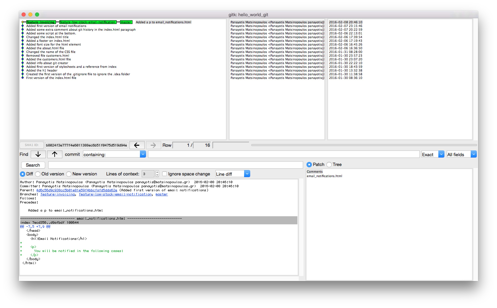

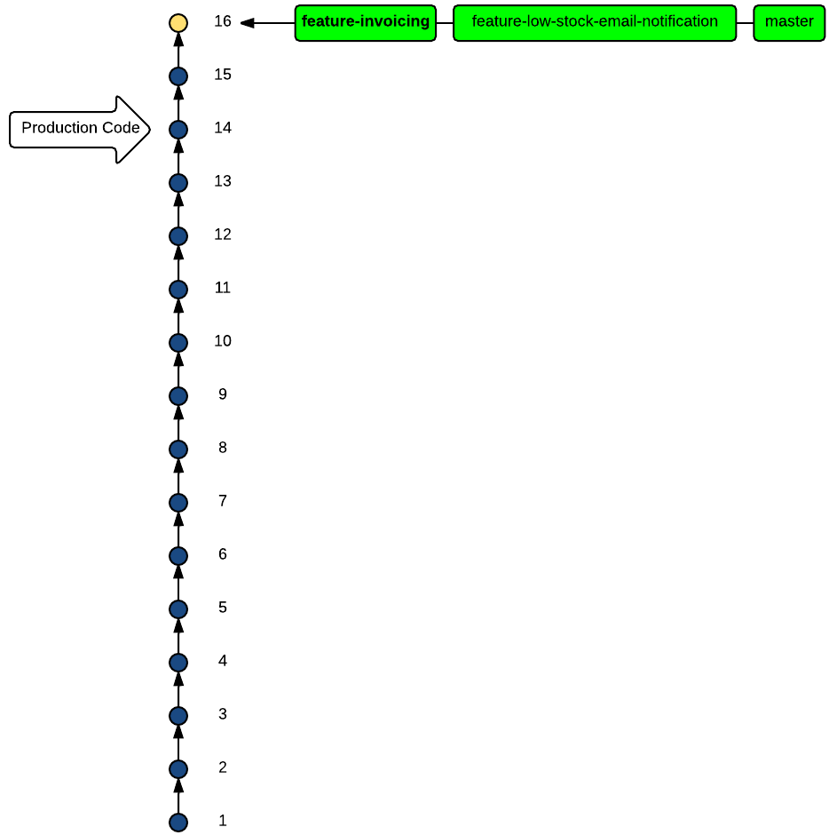

Let's introduce a new change in the source tree. We will add the file `invoicing.html` with the following content:

``` html
<!DOCTYPE html>
<html>
  <head>
    <meta charset="utf-8">
    <meta name="viewport" content="width=device-width, initial-scale=1">
    <title>Invoicing</title>
  </head>
  <body>
    <h1>Invoicing</h1>
  </body>
</html>
```

And let's run the following commands to create the first commit. Note that since this is a new untracked file, issuing `git commit -am` will not work. Run the following commands:

```
git add .
git commit -m "Added the invoicing.html file"
```

After this successful commit, let's see the tree with the `gitk`:

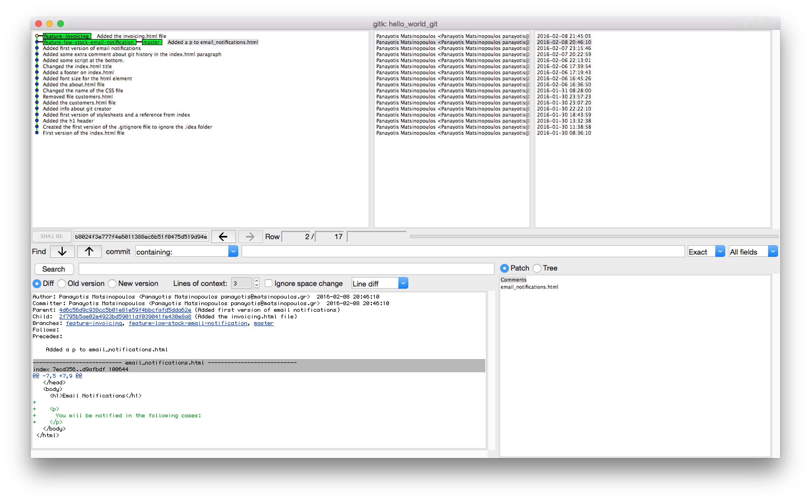

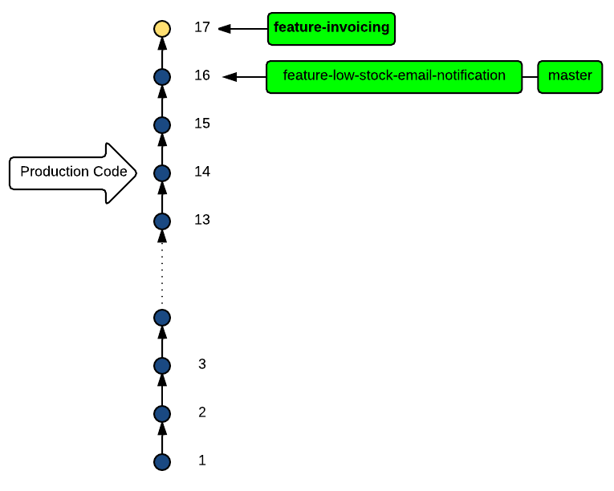

Now, let's do one more change. Make sure that the following is the content of the `invoicing.html` file:

``` html
<!DOCTYPE html>
<html>
  <head>
    <meta charset="utf-8">
    <meta name="viewport" content="width=device-width, initial-scale=1">
    <title>Invoicing</title>
  </head>
  <body>
    <h1>Invoicing</h1>

    <p>
      Invoicing Date: DD/MM/YYYY
    </p>
  </body>
</html>
```

And let's run the following command to commit the change to the tree:

```
git commit -am "Added a paragraph on invoicing.html file"
```

Let's see how the `gitk` now presents the second commit to our `feature-invoicing` branch:

)
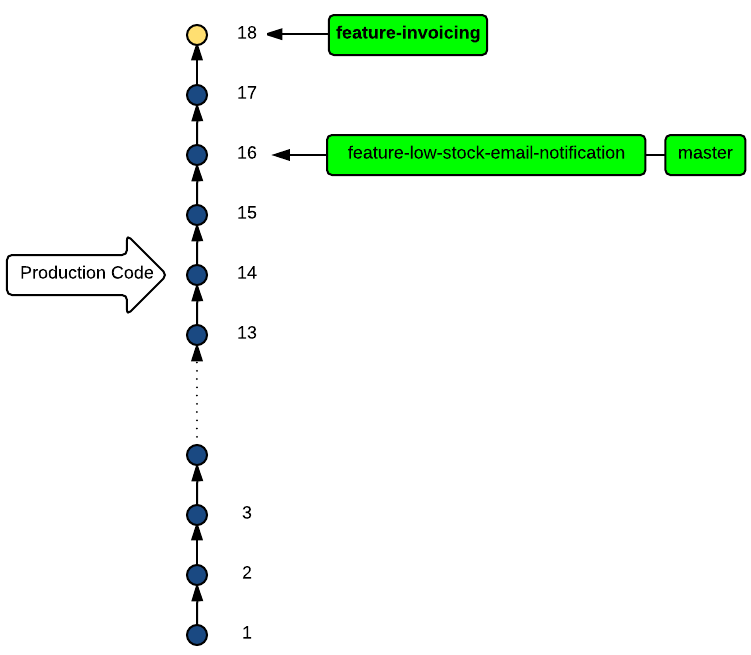

There is nothing new until now. 

Let's suppose that we have now finished with the new feature on invoicing and that we want to merge our work back to the master branch so that it goes for production. This time,
we do not want to lose the visual history of the commits that are part of the invoicing feature. How can we do the merge? We need to do a **non-fast-forward** merge. This is how
it is done:

```
git checkout master
```

in order to switch to the merge destination branch. And then:

```
git merge --no-ff feature-invoicing
```

The non-fast-forward merge is actually a new commit created in the commit tree of the project. This does not happen on fast-forward merges that take place with 
simple `git merge` commands. For that reason, the `git merge --no-ff` command will open an editor that will allow you to change the default commit message (`Merge branch 'feature-invoicing'`). 
Usually, we leave that message as is, or at least, if we change it, we make sure that it refers to a merge of a branch, so that we can remember.

So, leave the default message as is, close the editor and the commit will automatically be created. 

Let's load the new commit tree in `gitk`:


And another view here:

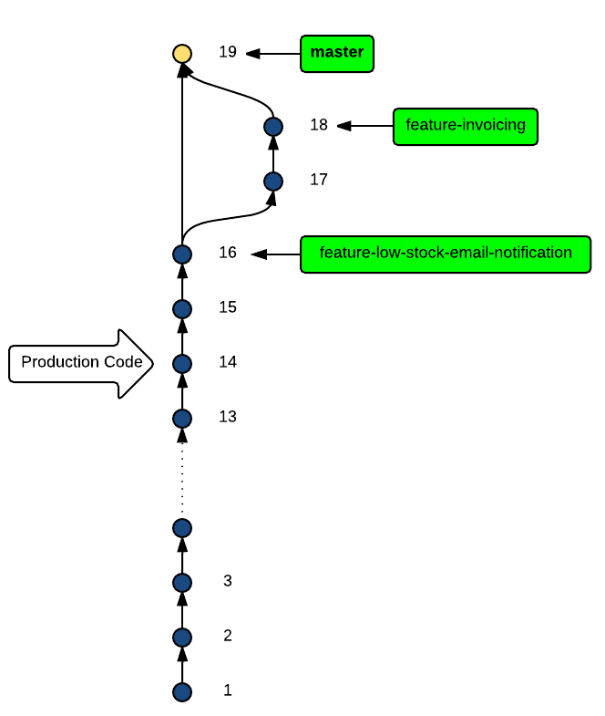

As you can see, in both last two views, one can easily tell which commits are part of the branch `feature-invoicing`. Compare that with the `feature-low-stock-email-notification`, on which
you cannot tell the commits.

Do you now understand the difference between fast-forward and non-fast-forward merges? So, next time you are merging a branch to another, think about whether you want to do non-fast-forward
merge. If you want non-fast-forward merge, you will need to use the "--no-ff" switch. Otherwise, git will try to do a fast-forward merge. We are saying here that git `will try`, because there
are cases in which the fast-forward merge is not always possible and git falls back to non-fast-forward merge.

### Tagging commits with user friendly names

Ok, now we are happy with the two new features that we have developed and merged to the master branch. The code is tested and ready to be deployed to production.
Let's assume that we, indeed, deploy the last master commit to production. Then, after the successful deployment to production, if we decide to introduce further
changes, new commits, we will not know which commit corresponds to the production code. Because the `master` branch will be pointing to new commits introduced
after the deployment to production:


As it is depicted in the above hypothetical picture, we did a production release of the code while on commit 19, but further commits have moved the `master` branch label, away from the commit
19. So, we do not have an easy way to remember that on commit 19 we did a production release.

`git` offers us the tool of `tags` in order to mark specific commits with a name. These tags are attached to a commit and you can refer to that commit by name.

Let's proceed by executing the following command:

```
git tag production-release-201602082308
```
If everything goes well, you will not see any output. What we just did, was that we gave a name to the current commit. The name was `production-release-201602082308`. It can be
anything you like, but it has to be unique among the list of tags. You can get the list of all the tags with the following command:
 
```
git tag --list
```

Let's see how the `gitk` picture has changed now that we have named the last commit with a tag:

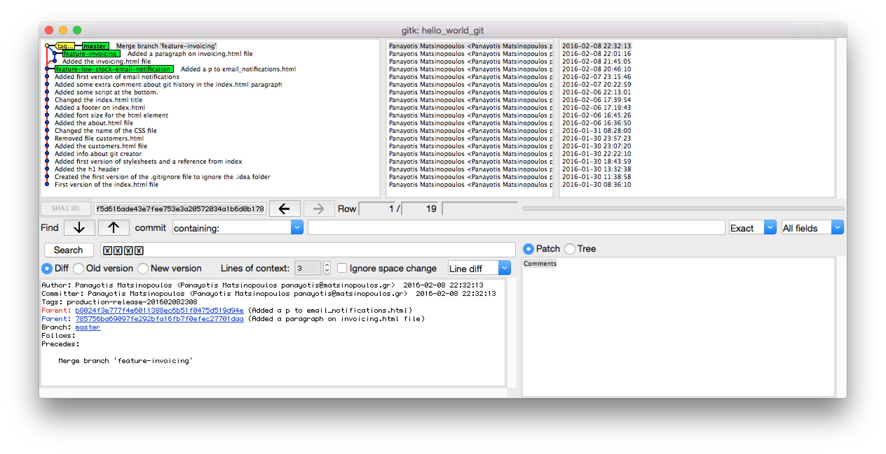

And another view is this:

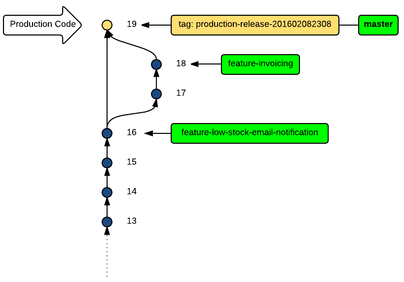

As you can see above, there is a new label attached to the last commit, with yellow color. It is the tag that we just created. This label, will not be moving like the branch labels.
It will stay attached to this commit forever (until we delete it, if we want, but something one does not have real business reason to do).

Now that we will create more changes in the project and new commits, you will see how this tag remains on the same 19th commit.

### Incorporating Master Changes

Let's suppose that we now start to work on another, new feature, the SMS Notification Feature. As usual, we create a new branch to work on that:

```
git checkout -b feature-sms-notification
```

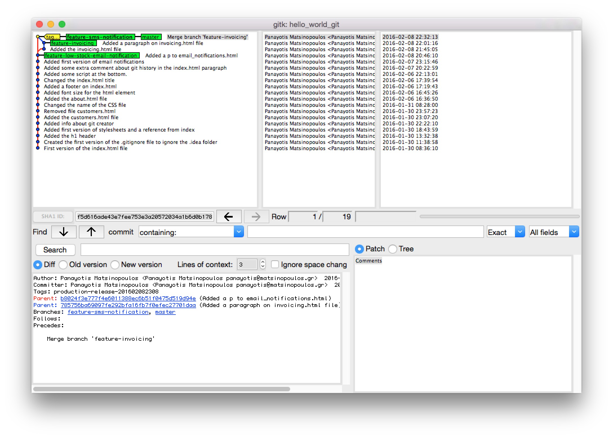

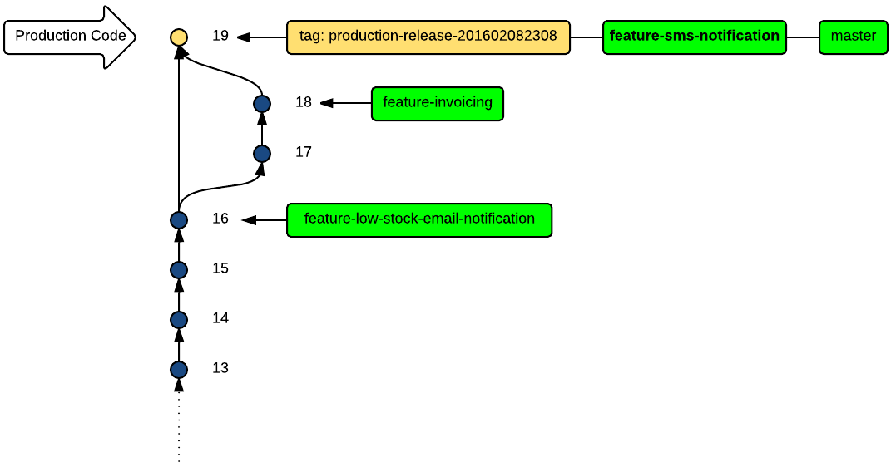

Let's add the page of the feature. Create the page `sms_notifications.html` with the following content:

``` html
<!DOCTYPE html>
<html>
  <head>
    <meta charset="utf-8">
    <meta name="viewport" content="width=device-width, initial-scale=1">
    <title>SMS Notifications</title>
  </head>
  <body>
  
  </body>
</html>  
```

We commit this change with the following commands:

```
git add .
git commit -m "Added page for sms notifications"
```

Let's create one more commit. We change the content of the file `sms_notifications.html` so that it now has a header `h1` inside the body:
 
``` html
<!DOCTYPE html>
<html>
  <head>
    <meta charset="utf-8">
    <meta name="viewport" content="width=device-width, initial-scale=1">
    <title>SMS Notifications</title>
  </head>
  <body>
    <h1>SMS Notifications</h1>
  </body>
</html>
```

We execute the following command to commit this new change:

```
git commit -am "Added h1 header inside body of sms_notifications.html file"
```

We have done two commits to the new branch. Let's see the `gitk` picture:

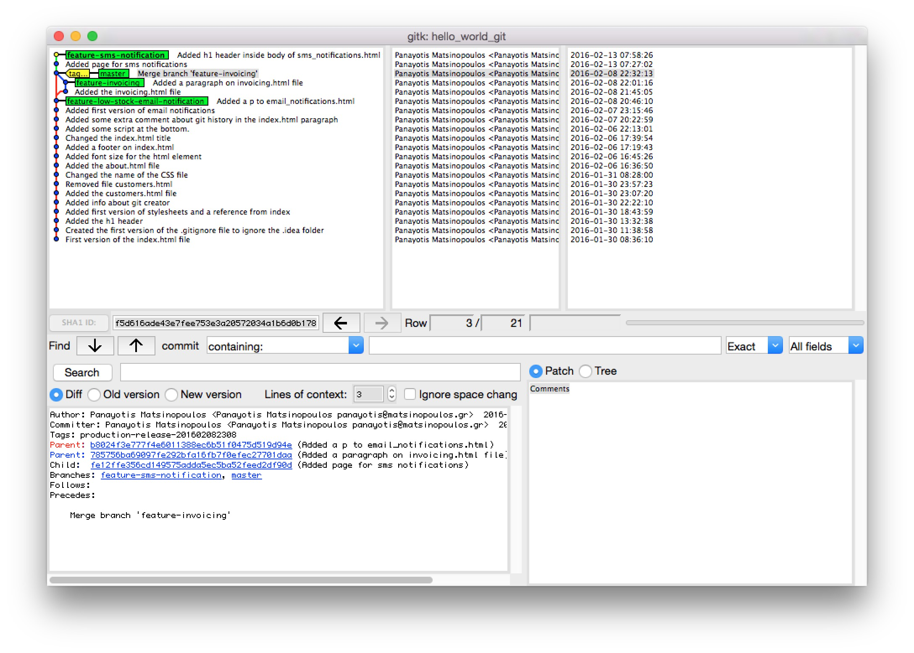

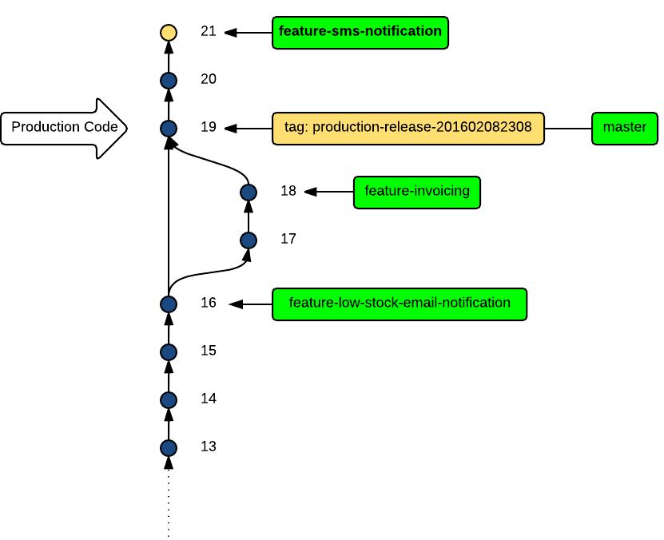

Let's suppose that SMS Notification feature is not yet finished, but we are called to urgently fix a bug on master branch which is on production. What do we do? 

We switch to master branch, first.

``` 
git checkout master
```
Do the fix. Let's assume that the fix is on the file `email_notifications.html` and that the new content is as follows:

``` html
<!DOCTYPE html>
<html>
  <head>
    <meta charset="utf-8">
    <meta name="viewport" content="width=device-width, initial-scale=1">
    <title>Email Notifications</title>
  </head>
  <body>
    <h1>Email Notifications</h1>

    <p>
      You will be notified in the following cases:
    </p>

    <ul>
      <li>Invoice Generation</li>
      <li>Payment Received</li>
    </ul>
  </body>
</html>
```
which adds the `ul` element before the end of the `body` of the page.

We commit the fix:

```
git commit -am "Added the notification cases inside email_notifications.html"
```

and the picture of your commit history now has as follows:

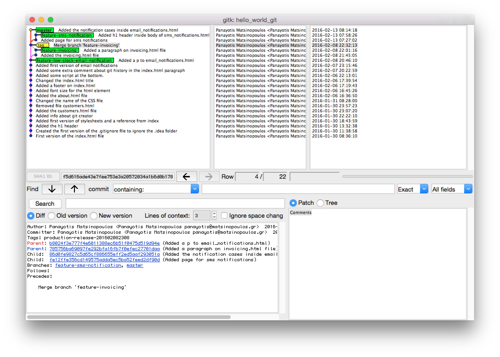

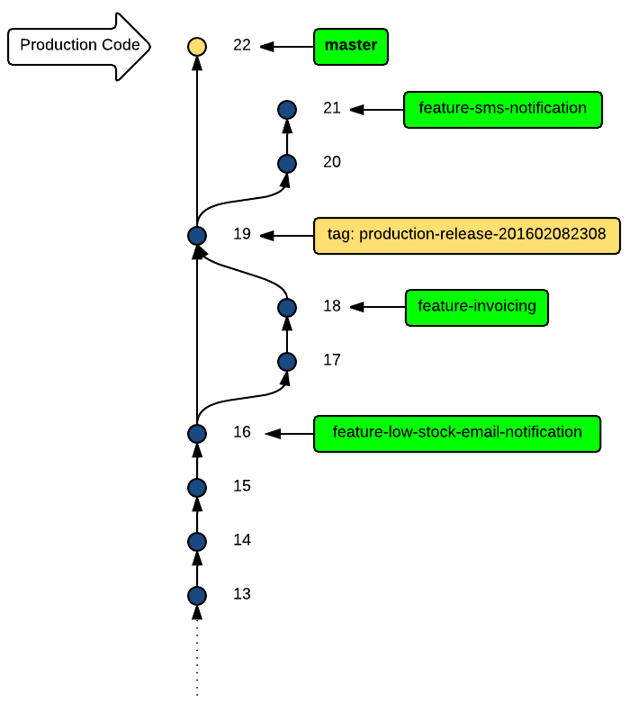

You can clearly see that we have 2 branches, the `master` and the `feature-sms-notification` branch. And there is some work, 1 commit, on one branch that does not exist on the other. The last
commit on the `master` branch does not exist on the `feature-sms-notification` branch. 

Now you are ready to switch back to the `feature-sms-notification` branch to continue your work.

```
git checkout feature-sms-notification
```

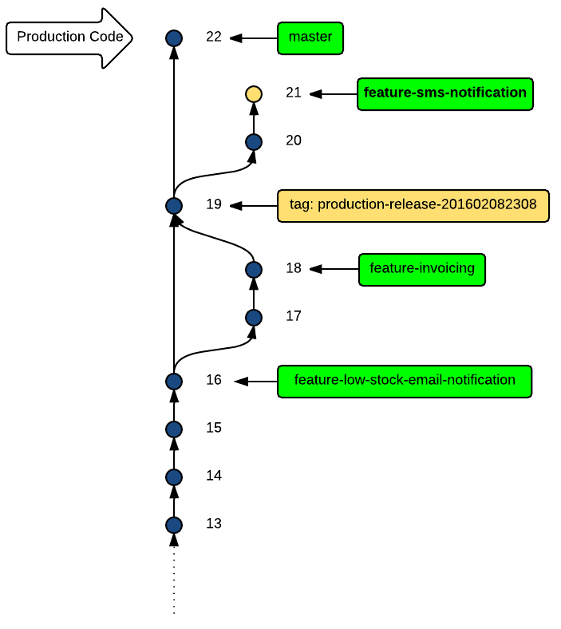

The point now here is that, usually, while we are doing the development of a long feature, any fixes that occur on `master` branch, we usually want them on our feature branch too, in order
to continue the development of the feature with the fix included. This fix might affect our work and, in that case, we want it in our branch.

How can we bring the `master` changes into our `feature-sms-notification` working branch? We can do a `git merge master` command. 

Let's do that:

```
git merge master
```

If you do that, `git` will create a new commit, a merge commit, because it cannot do a fast forward merge. You will be asked to confirm the merge commit message and after that,
the commit will be created. The `gitk` picture will be this:

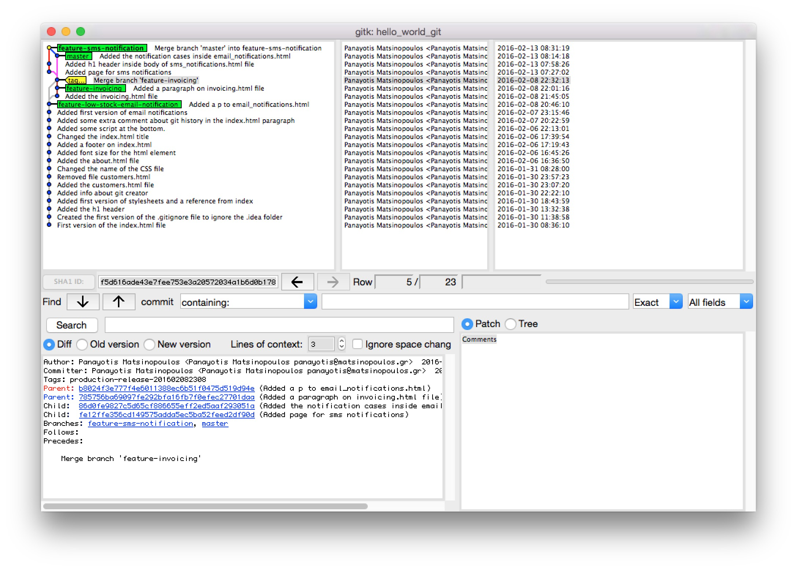

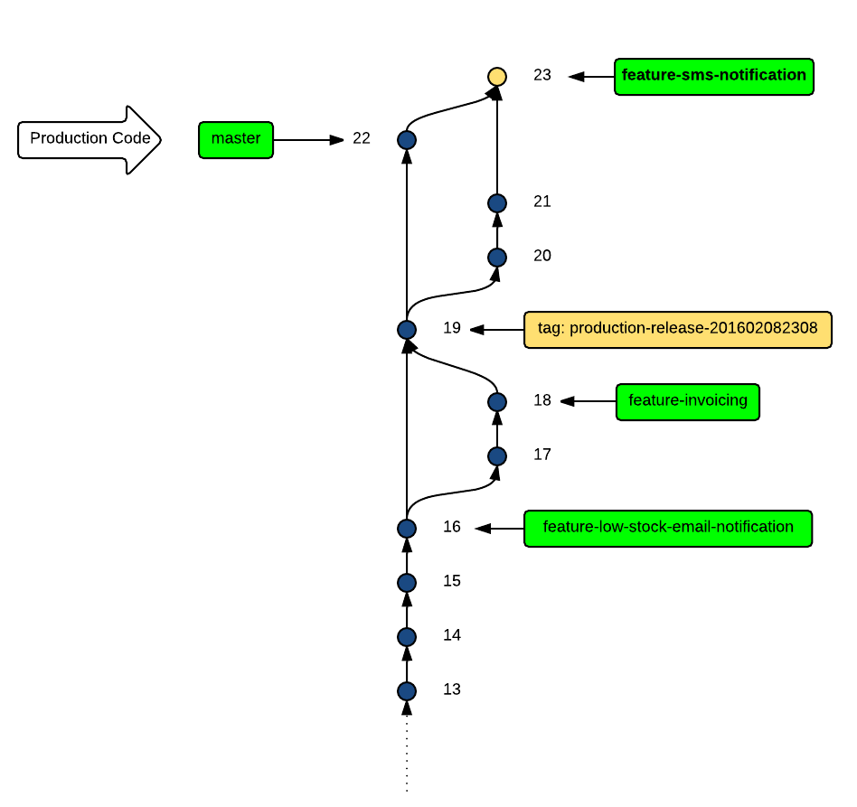

Nice. We have incorporated the `master` branch fix to our working feature branch.

### Merge Conflicts

We have not finished with the SMS Notification Feature yet. But, again, we are being asked to start a new feature. The Incoming Call feature. Maybe the feature for SMS notifications is 
waiting some input from the product management team. We are also expecting that the new feature will be easy to develop and will need to be put on production before the SMS notification
feature. What do we do?

Since it is a new feature, we have to create a new branch to work on that. Is it going to be a branch that will be based on the work that have already been done for SMS notification feature?
Not of course. It will be a work that will be based on the `master` branch. When it will be ready, it will be merged back to `master` branch and put on production.

So, **before** creating the new branch, we need to make sure that we are on the `master` branch.

```
git checkout master
```
And from there, we create our new branch to work on:

```
git checkout -b feature-incoming-call
```

If you reload the `gitk` picture, you will see this:

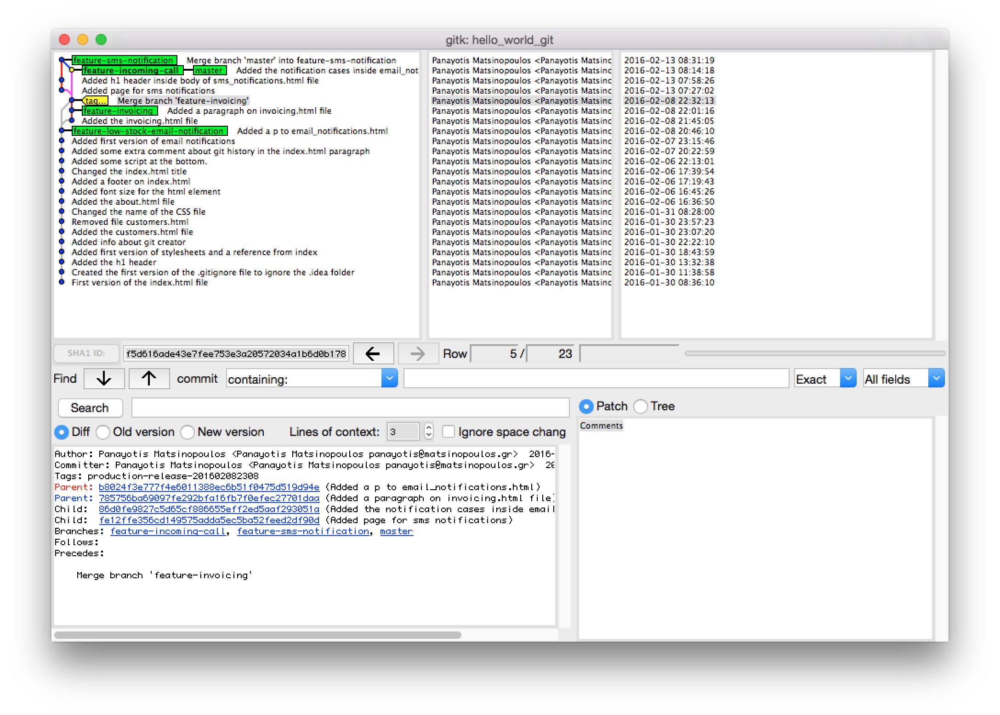

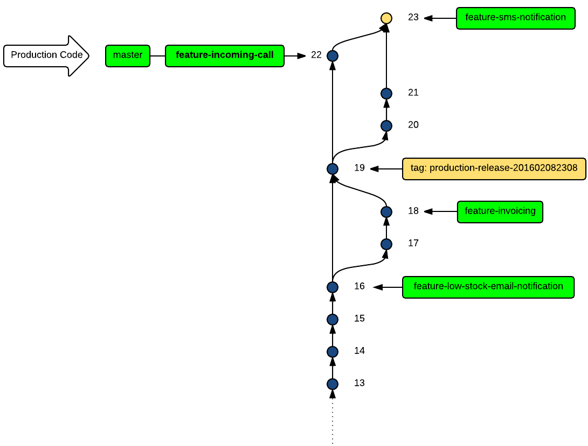

That's a known picture. The new branch, displayed with bold label, is now the branch with name `feature-incoming-call`, and, currently, does not have any new commits. Let's create one.
We will add the page `incoming_calls.html` with the following content:

``` html
<!DOCTYPE html>
<html>
  <head>
    <meta charset="utf-8">
    <meta name="viewport" content="width=device-width, initial-scale=1">
    <title>Incoming Calls</title>
  </head>
  <body>
  </body>
</html>
```
Let's create the commit with the following commands:

```
git add .
git commit -m "Added the page incoming_calls.html"
```
Let's do one more change. We update the `index.html` file to be as follows:
```
<!DOCTYPE html>
<html>
  <head>
    <meta charset="utf-8">
    <meta name="viewport" content="width=device-width, initial-scale=1.0">
    <link rel="stylesheet" href="stylesheets/index.css" type="text/css">
    <title>Git - Version Control System</title>
  </head>

  <body>
    <h1>Git -  Version Control System</h1>

    <p>
      In 2005, the relationship between the community that developed the Linux kernel
      and the commercial company that developed BitKeeper broke down, and the tool’s
      free-of-charge status was revoked. This prompted the Linux development community
      (and in particular Linus Torvalds, the creator of Linux) to develop their own tool
      based on some of the lessons they learned while using BitKeeper. Some of the goals
      of the new system were as follows:
    </p>

    <p>
      <strong>Features</strong>: 1) Incoming calls
    </p>
    
    <footer>
      Copyright &copy; Tech Career Booster
    </footer>

    <script>

    </script>
  </body>
</html>
```

We have added the `p` element above the footer. Let's save and commit the change:

```
git commit -am "Added the p element with features above the footer on index.html page"
```

Now, the gitk picture is the following:

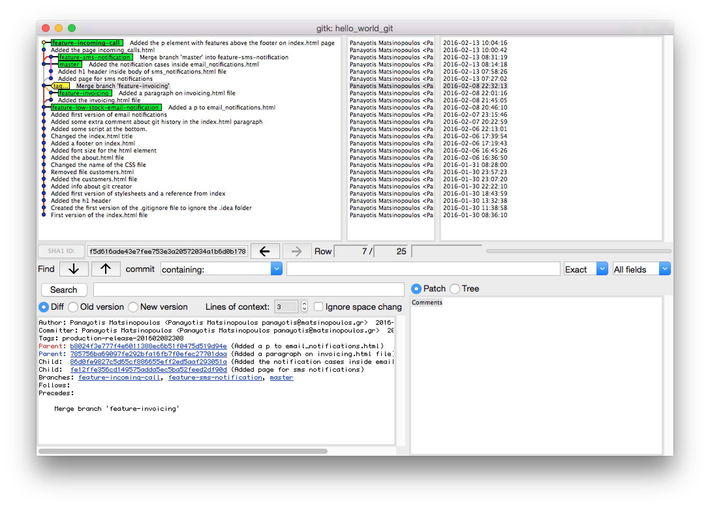

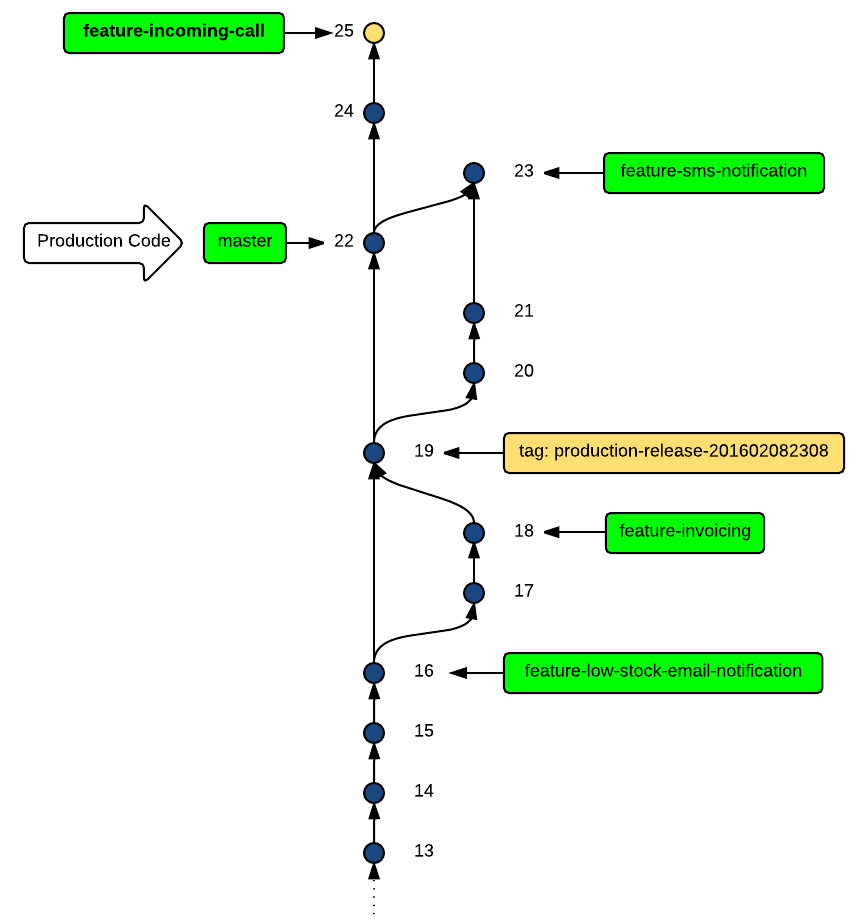

Great. We have the 2 feature branches and the 1 master branch. We have now finished with the Incoming Calls feature and we are ready to put that to production. The process now is known:

```
git checkout master
```

```
git merge --no-ff feature-incoming-call
```

and we push the master branch to production.

The new commit tree picture is the following:

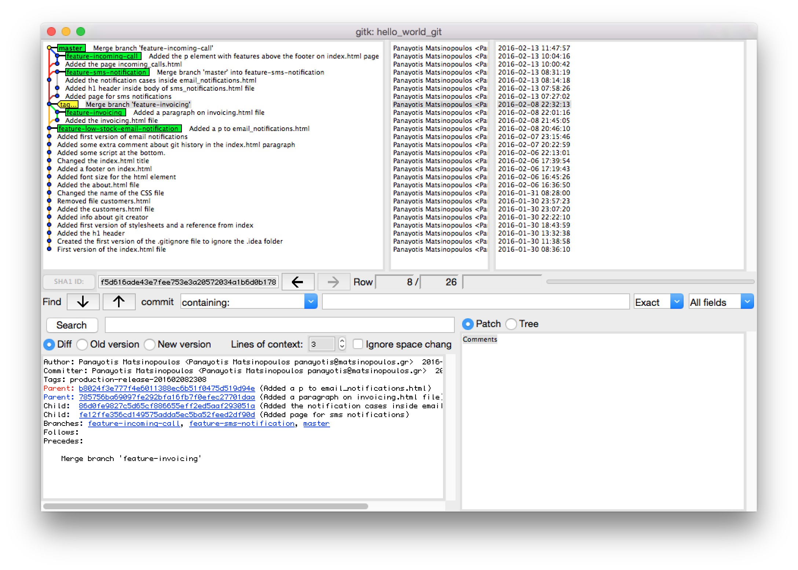

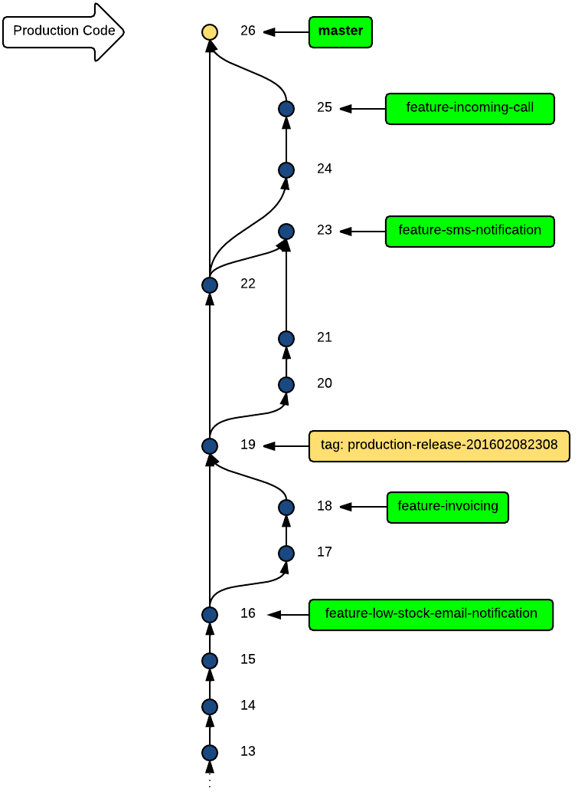

We continue now our work on the old feature branch, the `feature-sms-notification` branch. We have finally got the final requirements and we are ready to do the last change on this feature.
Here it is:

```
git checkout feature-sms-notification
```

Change the content of the `index.html` file to be:

``` html
<!DOCTYPE html>
<html>
  <head>
    <meta charset="utf-8">
    <meta name="viewport" content="width=device-width, initial-scale=1.0">
    <link rel="stylesheet" href="stylesheets/index.css" type="text/css">
    <title>Git - Version Control System</title>
  </head>

  <body>
    <h1>Git -  Version Control System</h1>

    <p>
      In 2005, the relationship between the community that developed the Linux kernel
      and the commercial company that developed BitKeeper broke down, and the tool’s
      free-of-charge status was revoked. This prompted the Linux development community
      (and in particular Linus Torvalds, the creator of Linux) to develop their own tool
      based on some of the lessons they learned while using BitKeeper. Some of the goals
      of the new system were as follows:
    </p>

    <p>
      <strong>Features</strong>: 1) SMS Notifications
    </p>
    
    <footer>
      Copyright &copy; Tech Career Booster
    </footer>

    <script>

    </script>
  </body>
</html>
```

Being on `feature-sms-notification`, we added the `p` above the `footer`. Please, note that we did something similar while we were on `feature-incoming-call`, but, that change,
is not visible here, while we are on `feature-sms-notification` branch.

Let's commit this change on `feature-sms-notification` branch.

```
git commit -am "Added a p before footer with the features list"
```
Now the picture that gitk gives us about the commit tree is the following:

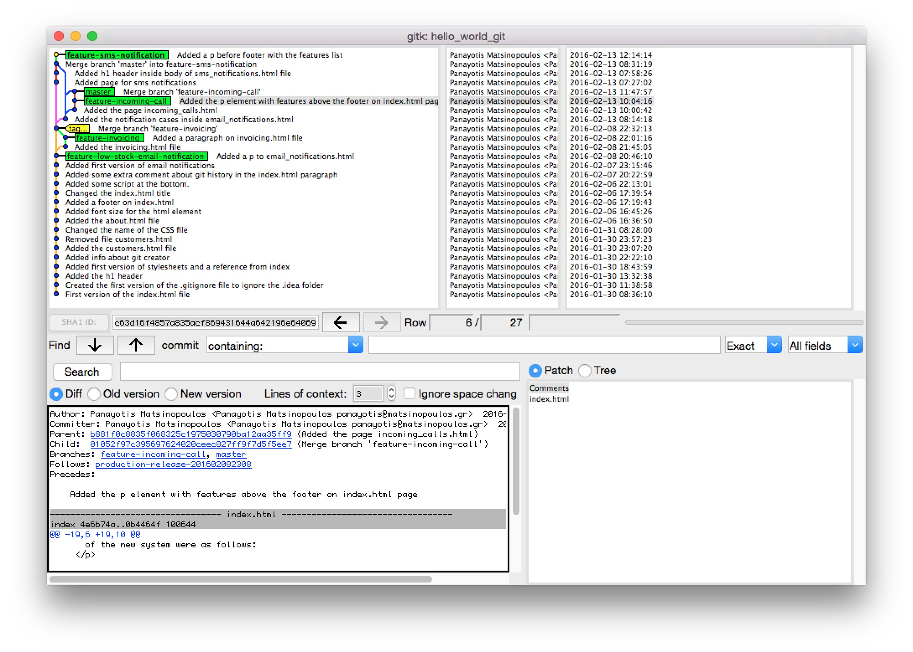

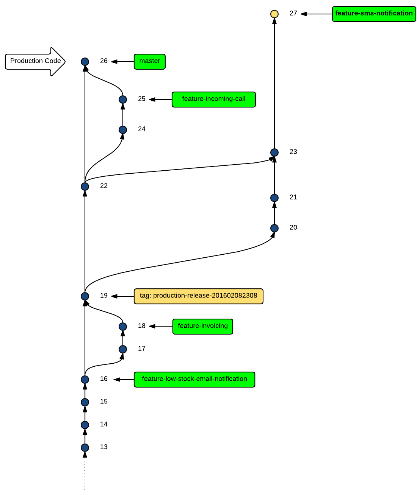

As it can be clearly understood from the pictures above, the SMS Notification feature does not contain the commits 24, 25, 26, that belong to master branch.

Now, assume that SMS Notification feature is finished and it is ready for production. We need to merge its work with the master branch work. The commands for this are already known. Let's try.

First we need to switch to the merge destination branch, i.e. to `master` branch.

```
git checkout master
```

Then we need to merge the SMS Notification feature. We will do that with the switch `--no-ff` enabled, so that we do not loose any history about the commits of the feature that is merged to master.
Execute the following command:

```
git merge --no-ff feature-sms-notification
```
You will get the following output:

```
Auto-merging index.html
CONFLICT (content): Merge conflict in index.html
Automatic merge failed; fix conflicts and then commit the result.
```

As you can read from the output, the merge has failed. (`Automatic merge failed`). `git` has tried to merge the changes of the `feature-sms-notification` branch to `master` branch, but
there were lines in the source files that were conflicting. Changes in `feature-sms-notification` branch were conflicting with content on `master` branch. 

The output above also tells you what you have to do. You have to `fix conflicts and then commit the result`.

Do we know which were the conflicts? On which files? Yes, we do. It is reported on the above output. It says `CONFLICT (content): Merge conflict in index.html`. It clearly tells you 
that the conflict was on `index.html` file. 

You can also look at the `gitk` output too:

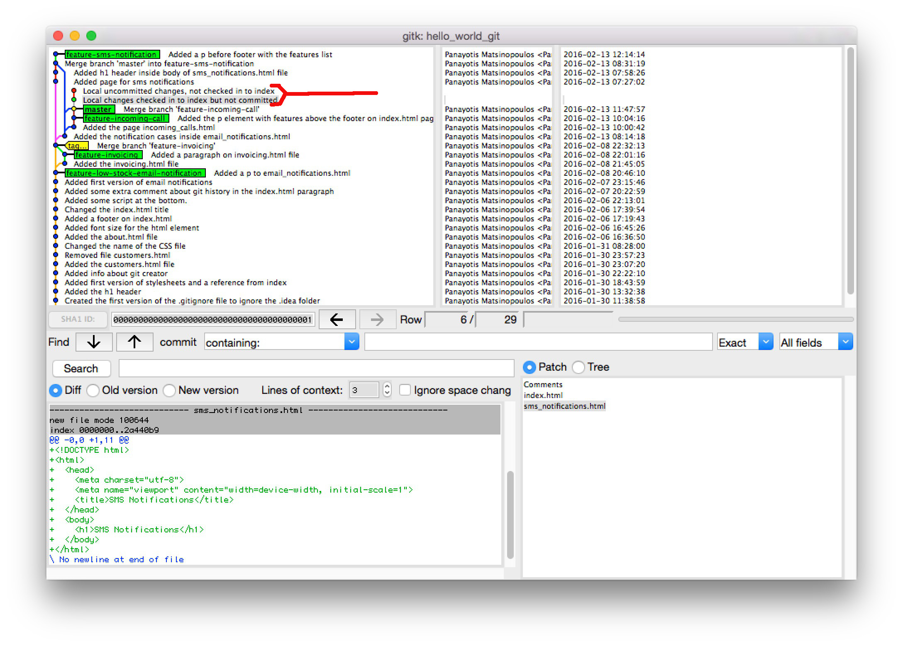

There are 2 circles above the master yellow commit. The green circle is whatever it is inside the staging area. It is the part of the merge that has been merged without problem. The red circle
is whatever is inside the unstaged modified bucket and contains the conflicts, the part of the merge that failed to be accomplished.

In order to resolve the conflict, you need to open the file that has the conflicts and edit it so that it has the correct content and remove the conflict indicators.

If you open the `index.html` file you will see this:

``` html
<!DOCTYPE html>
<html>
  <head>
    <meta charset="utf-8">
    <meta name="viewport" content="width=device-width, initial-scale=1.0">
    <link rel="stylesheet" href="stylesheets/index.css" type="text/css">
    <title>Git - Version Control System</title>
  </head>

  <body>
    <h1>Git -  Version Control System</h1>

    <p>
      In 2005, the relationship between the community that developed the Linux kernel
      and the commercial company that developed BitKeeper broke down, and the tool’s
      free-of-charge status was revoked. This prompted the Linux development community
      (and in particular Linus Torvalds, the creator of Linux) to develop their own tool
      based on some of the lessons they learned while using BitKeeper. Some of the goals
      of the new system were as follows:
    </p>

    <p>
<<<<<<< HEAD
      <strong>Features</strong>: 1) Incoming calls
=======
      <strong>Features</strong>: 1) SMS Notifications
>>>>>>> feature-sms-notification
    </p>

    <footer>
      Copyright &copy; Tech Career Booster
    </footer>

    <script>

    </script>
  </body>
</html>
```

The parts of the source code that conflicts have been encountered are marked with special characters. They start with:

```
<<<<<<<
```

and end with:

```
>>>>>>>
```

The 1st part is what the merge destination file had. The 2nd part is what the merge source file had. The first part is marked with `HEAD` because it refers to the current
branch, `master`, in our case. The second part is marked with `feature-sms-notification`, because that part is the source of merge.

This is how RubyMine shows the conflict:


So, we are using our editor, in RubyMine (or other editor that you are using to edit your source files) and we make sure that the content of the `index.html` file is what we want.
On this particular case, we want to keep both changes, the one that exists in the master (`HEAD`) and the one that comes from the feature branch (`feature-sms-notification`). Hence,
we edit the `index.html` file to be like that:

``` html
<!DOCTYPE html>
<html>
  <head>
    <meta charset="utf-8">
    <meta name="viewport" content="width=device-width, initial-scale=1.0">
    <link rel="stylesheet" href="stylesheets/index.css" type="text/css">
    <title>Git - Version Control System</title>
  </head>

  <body>
    <h1>Git -  Version Control System</h1>

    <p>
      In 2005, the relationship between the community that developed the Linux kernel
      and the commercial company that developed BitKeeper broke down, and the tool’s
      free-of-charge status was revoked. This prompted the Linux development community
      (and in particular Linus Torvalds, the creator of Linux) to develop their own tool
      based on some of the lessons they learned while using BitKeeper. Some of the goals
      of the new system were as follows:
    </p>

    <p>
      <strong>Features:</strong>
    </p>
    <ul>
      <li>Incoming calls</li>
      <li>SMS Notifications</li>
    </ul>
    
    <footer>
      Copyright &copy; Tech Career Booster
    </footer>

    <script>

    </script>
  </body>
</html>
```

This is how the change looks like now on RubyMine:

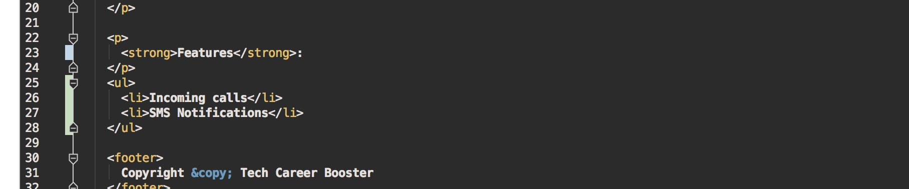

Having resolved the content conflict does not finish the manual work that we have to do in order to finish the merge of the feature branch to master branch. We need to
commit the final content:

With 

```
git add index.html
```

we put the final content to staging area.

Then give:

```
git commit
```

without any message. `git` will try to resume the last commit it was trying to create with the merge. Hence, it will suggest the default merge commit message. You can confirm, or change that,
and then save. The commit will finish successfully.

Now, if you reload the `gitk` picture you will see this:

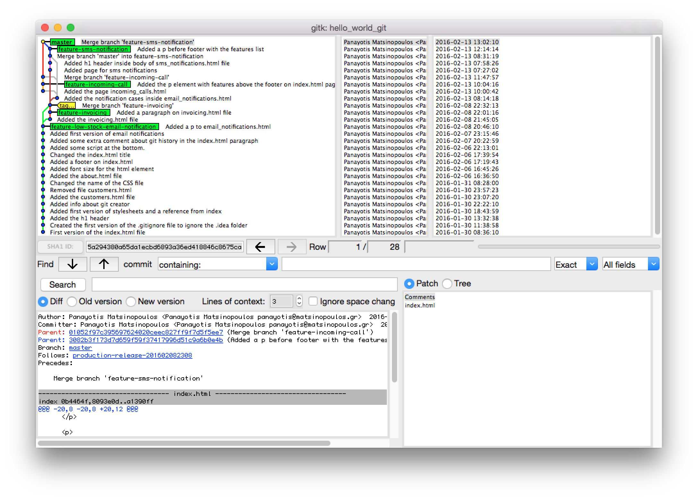


Perfect! We have managed to have all features inside the `master` branch and on production serving our customer.

### Switching to another branch When Dirty Working Folder

Finally, we will say something that we have already taught you about, but we want to make sure that you understand that very well. Suppose now, that we want to proceed to the creation of
another new feature, Contact Search Feature. We are creating the new branch and we are switching to it:

```
git checkout -b feature-contact-search
```
Now, let's do a change while we are on this branch. We update the `index.html` page content to be as follows:

``` index.html
<!DOCTYPE html>
<html>
  <head>
    <meta charset="utf-8">
    <meta name="viewport" content="width=device-width, initial-scale=1.0">
    <link rel="stylesheet" href="stylesheets/index.css" type="text/css">
    <title>Git - Version Control System</title>
  </head>

  <body>
    <h1>Git -  Version Control System</h1>

    <p>
      In 2005, the relationship between the community that developed the Linux kernel
      and the commercial company that developed BitKeeper broke down, and the tool’s
      free-of-charge status was revoked. This prompted the Linux development community
      (and in particular Linus Torvalds, the creator of Linux) to develop their own tool
      based on some of the lessons they learned while using BitKeeper. Some of the goals
      of the new system were as follows:
    </p>

    <p>
      <strong>Features:</strong>
    </p>
    <ul>
      <li>Incoming calls</li>
      <li>SMS Notifications</li>
      <li>Contact Search</li>
    </ul>

    <footer>
      Copyright &copy; Tech Career Booster
    </footer>

    <script>

    </script>
  </body>
</html>
```

We have only added one more `li` element in the list of features.

Imagine now that we are not ready to commit, yet, the first change on this new feature, but, we are getting a request to fix a bug on `master` branch. 

What do you do? You have dirty working folder. With uncommitted changes. You want to switch to `master`, but you do not want to lose your changes on
feature branch, neither transfer them on `master` branch. 

You have the following options (don't take any of them for now):

Option A:

1. Stash them with `git stash save -u "WIP for feature for contact search"`, and then
2. `git checkout master` to switch to master branch
3. ...do your changes on master branch and commit the quick fix...
4. `git checkout feature-contact-search` to return back to your work, on the feature.
5. `git merge master` to get the fixes of the master to your feature working branch.
6. `git stash pop` to bring your stash saved work back in your working folder.

Option B: Instead of working with stash, create a temporary commit that you will later destroy:

1. `git add .` to stage your changes.
2. `git commit -m "WIP for feature contact search - will discard that"` to commit your changes in the git database.
3. `git checkout master` to switch to master branch
4. ...do your changes on master branch and commit the quick fix...
5. `git checkout feature-contact-search` to return back to your work, on the feature.
6. `git reset HEAD^1` to discard the last commit on this branch but not the changes it contains.
7. `git merge master` to get the fixes of the master to your feature working branch.
 
Personally, I would prefer option A, because it is less error prone. The problem with option B is that if you do the step (7)
before doing step (6) then you will not be able to, easily, discard the temporary commit that you did on step (2).

Otherwise, if you follow both options precisely, then everything will be ok.

We will not follow this process now, so let's get rid of the changes that we just did:

```
git checkout -- index.html
```

Now `index.html` file is exactly how it was before we do the change. 

### Renaming a branch

Currently we are on branch `feature-contact-search`. There are sometimes that you want to rename a branch. This is very easy. Run the following command:

```
git branch -m feature-contact-free-search
```
This will rename the current branch to `feature-contact-free-search`. 

### Deleting a branch

Finally, let's delete this last feature branch. We do not really need it.

```
git branch -d feature-contact-free-search
```

you will get the error:

```
error: Cannot delete the branch 'feature-contact-free-search' which you are currently on.
```

which is pretty clear. Let's switch to `master` branch then, so that we can delete the `feature-contact-free-search` branch after that.

```
git checkout master
```

Then we can delete the `feature-contact-free-search` branch, with the following command:

```
git branch -d feature-contact-free-search
```

This will give you a deletion success message:

```
Deleted branch feature-contact-free-search (was 5a29438).
```

### Closing note

`git` is extremely powerful tool. This chapter gave you a close look, but still introductory, on how you can work with branches. 
