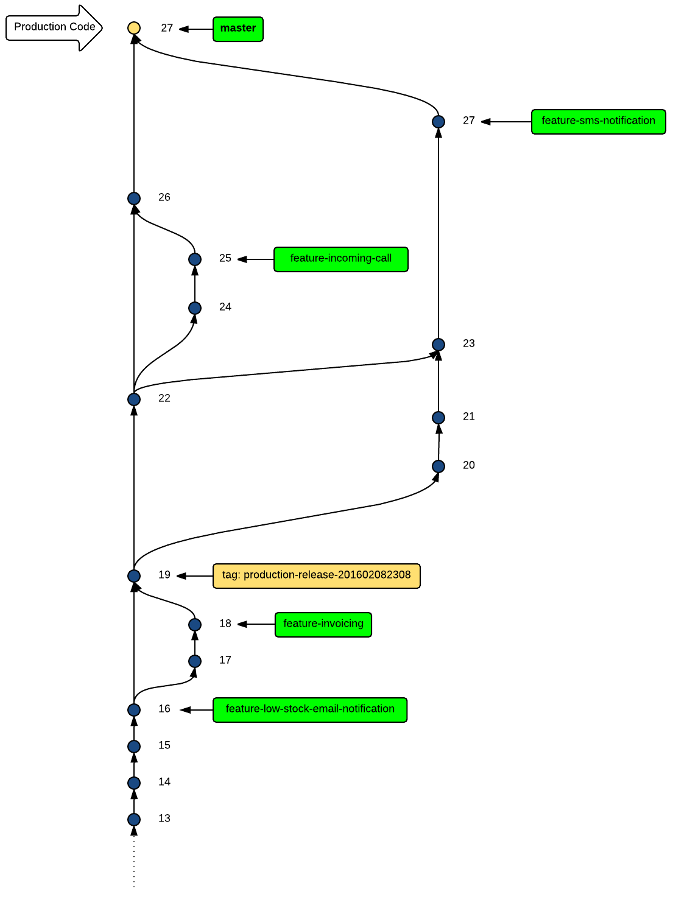

When we work on a project and we commit our work, little by little, we need to be careful with what goes to
production and what stays for further development and testing. There will be times, more than often, that we will have
to do parallel development, on more than one features and or bug fixes. Feature might last long, days, or even weeks
to be developed. Fixes might be introduced to production within hours. How can we make sure that we do not create
a mess in our code and keep our workflow well organized? How can we make sure that we do not mix the code that's on
production with the code that it is still under development and not tested yet?

The tool that will help us do that is called branching. `git` offers a very powerful branching system and this is the
main subject of this chapter.

You will understand how the `master` branch is used for production ready code, and how we usually branch out of it in
order to develop our features and fixes.

You will be in position to understand the `gitk` picture of a commit tree, like this:

You will understand how branches and tags are being represented with labels and be able to follow the commit trees like this:

You will also be in position to resolve merge conflicts like this:

