In this chapter we are going to learn what is a computer program. Let's start.

### Computer and CPU

Most of the people today they know very well what a computer is.

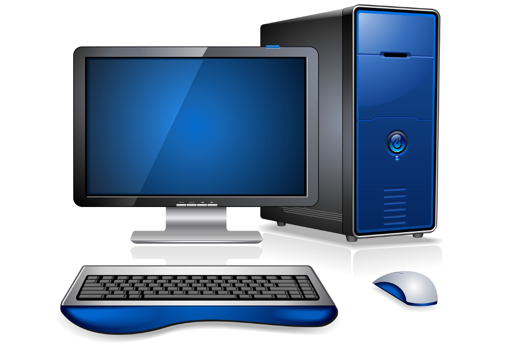

The computer is a machine that is given detailed instructions and executes them with amazing speed. Something that the
humans cannot do. That's why, today, many of the tasks that used to be done by humans, are now being carried out by
computers. Computers are much faster than humans and, if programmed correctly, they are less prone to error.

But, if brain is the human body part that is responsible for humans to think and act, what is the equivalent component in a computer,
that allows it to execute instructions and think so fast?

It is the CPU, the Central Processing Unit. 

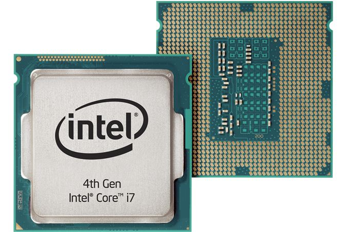


The CPU is an electronic chip and it is usually located inside the computer chassis, plugged on the computer motherboard. 

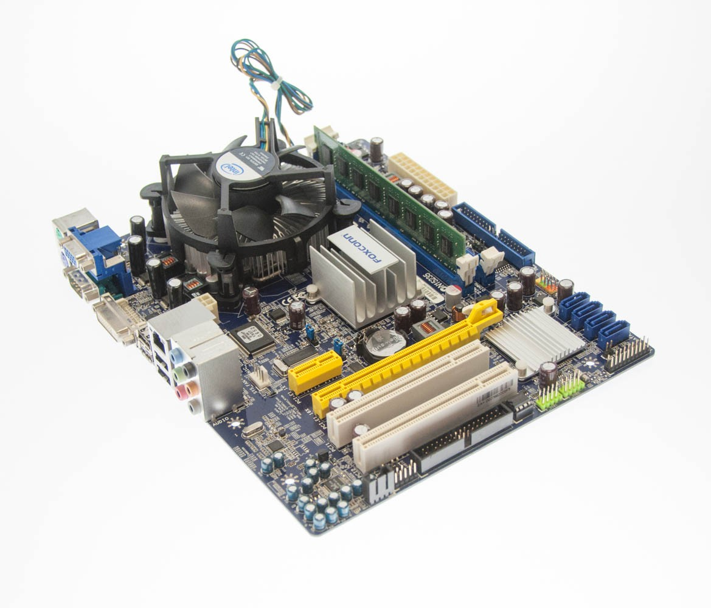

The computer motherboard is a big square electronic board that integrates various electronic chips, one of which is the CPU. The other 
important stuff that integrates is the RAM (Random Access Memory). More about this in a while.


As you can see in the previous picture, the CPU is actually covered with a big fan that is always trying to keep the CPU chip cool. The RAM is another set of chips that is usually
vertically positioned on the motherboard. We will talk about RAM later on.

The CPU, is the chip that executes all the instructions. Inside it, among others, there are a series of registers. The registers are part of the CPU local data storage.
 
Hence, we have
 
* the CPU
* the RAM and 
* the Registers inside CPU.

### Program

Given that we have a CPU, how can we ask it to execute operations? We need to

1. Prepare our data
2. Send data to CPU and
3. Ask CPU to execute operations on these data

Formally, this is a program. The program does exactly that. Prepares data and then asks CPU to execute operations on these data.
In other words, a program has data and instructions.

### RAM

RAM, for Random Access Memory, is the electronic bank of chips that holds our program data. 

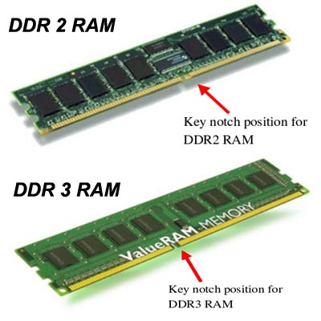

The RAM is divided in positions. Let's assume that each position has a size of 1 Byte. A RAM with 1024 Bytes size has 1024 different positions in order to store a piece
of information. Each position is of limited size. Let's assume that it is 8 bits. 1 Byte is equal to 8 bits, and we can tell that each address position is of size 8 bits.

Look at the following picture. It shows a table of 1024 positions. The table corresponds to a RAM of size 1024Bytes. Note that each byte holds 8 bits.

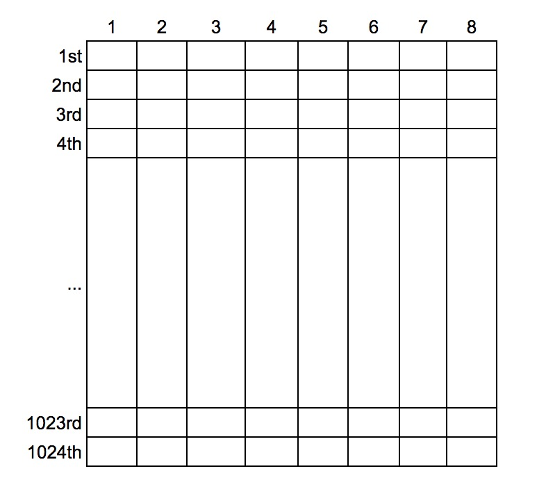

#### ./images/RAM Addresses

In order for CPU to be able to carry out operations on the data, we need to have a way to tell CPU which positions of the RAM space are occupied by our data.
To help out this process RAM positions are given a distinct identification number. It is the number 0 for the 1st position, the number 1 for the 2nd position, the number 2 for the
third position e.t.c. Hence, the distinct identification number for the RAM 1000 position is 999, i.e. the index of the position - 1. Since these numbers are used to
reference a specific position inside the available set of RAM positions, we use the term "address" to name this number.

Hence, the address of the first RAM position is 0, the address of the second RAM position is 1, the address of the third RAM position is 2, e.t.c.

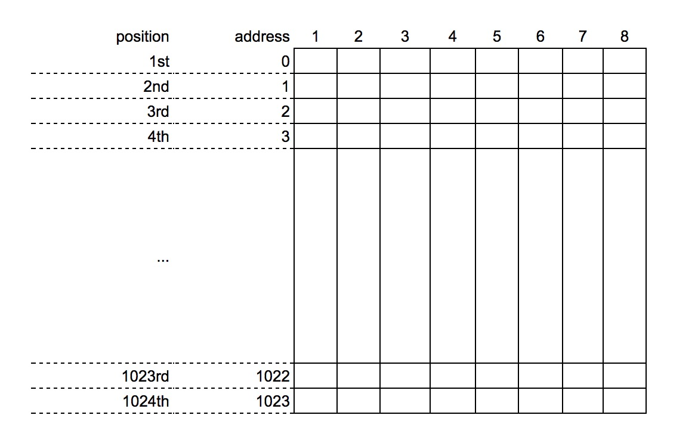

From now on, we will be refering to RAM positions by their address number.
 
Besides numbering the RAM positions with an integer number starting from 0, we use the same scheme to number bit positions inside a specific RAM position. We address them
with an integer starting from 0, up to 7, since we have 8 bits inside each position. Moreover, usually, the addressing starts from the right hand side.

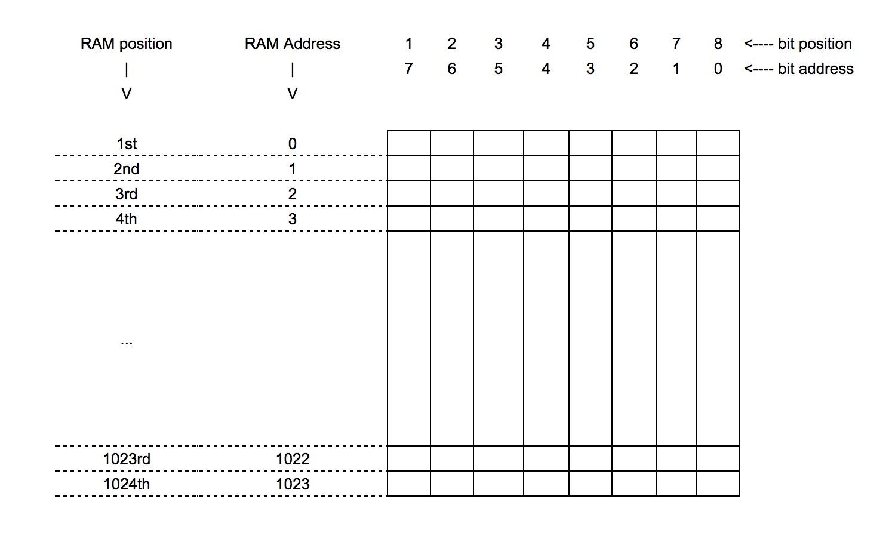

#### RAM content

RAM is useful because it allows us to store our data inside. In the following example, you can see that we have stored the word "HELLO". Each letter occupies 1 RAM
position. And the addresses that our data occupy are 4, 5, 6, 7, 8.

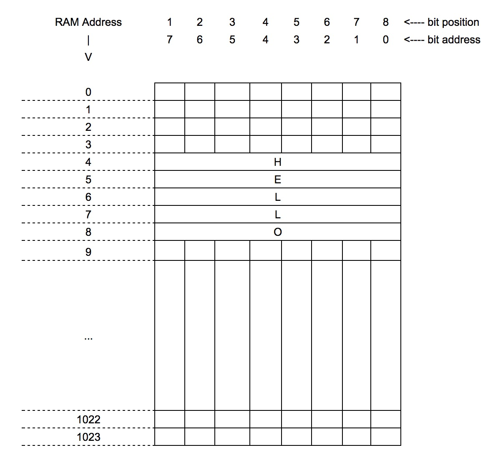

The above picture shows that, for the example, the letter `H` is stored inside the RAM position 4. However, you need to know that the actual information stored inside the
RAM position is a series of zeros (0) and ones (1). In other words, the computer knows how to convert the `H` letter into a very specific sequence of 0s and 1s and store
that inside the RAM position.

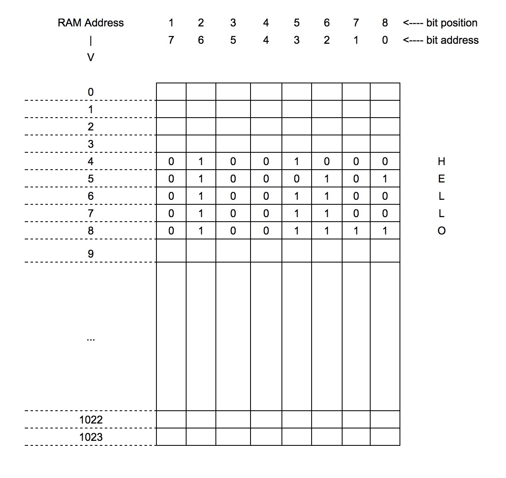

We will not delve into how characters are being converted to 0s and 1s. For the interested reader, take a look at the ASCII table.
 
In summary,
 
* RAM is the area we store our data.
* Each position in RAM is referenced by its address.
* Each position holds a series of 0s and 1s that correspond to some actual real piece of information.
 
> Note: Converting a piece of information to a series of 0s and 1s is a process which is called encoding. Turning 0s and 1s back to the useful piece of information
is a process which is called decoding.
 
### Numbering Systems
 
We all know how to count and how to represent quantities with numbers. On a daily basis and for any common calculations, humans, are using numbers that are composed by
the digits `0, 1, 2, 3, 4, 5, 6, 7, 8, 9`. These digits are part of the numbering system that we use, and in particular of the `decimal` numbering system, or the numbering
system which has as base the number `10`.
 
However, in Computer Science, the most popular numbering system is the `binary` numbering system. Also, computer programming, besides the `binary` numbering system, usually
deals with `octal` and with `hexadecimal` numbering system.

Hence, the popular numbering systems in the world of computers and programming are:

1. `binary`, which uses 2 digits: `0` and `1`
2. `octal`, which uses 8 digits: `0`, `1`, `2`, `3`, `4`, `5`, `6`, `7`
3. `decimal`, which uses 10 digits: `0`, `1`, `2`, `3`, `4`, `5`, `6`, `7`, `8`, `9`
4. `hexadecimal`, which uses 16 digits: `0`, `1`, `2`, `3`, `4`, `5`, `6`, `7`, `8`, `9`, `A`, `B`, `C`, `E`, `F`

We will not spend more on numbering systems in this chapter. We will do it in a later chapter. 

> *Information:* The decimal numbering system became so popular in the human world, because it is based on the number 10, which equals the number of fingers that humans have
on their hands. Humans were always using their fingers to count small quantities and execute simple calculations.

### Assembly

At the outset of the computer programming era, developers had to use a very difficult programming language, which was called `assembly`. Actually, assembly is still needed
in some cases, even today. 

The following picture is how an assembly program looks like. 

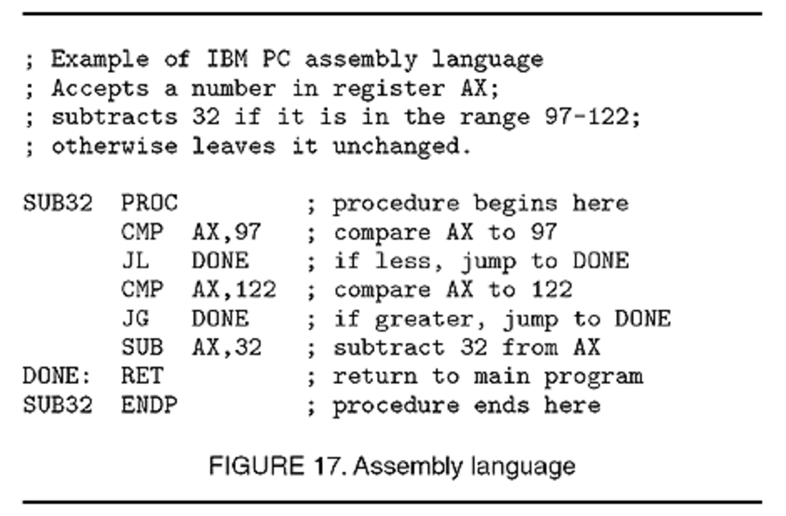

Actually, this is not a full program. It is a very tiny program unit, called procedure that takes some input and does an action on it.

1. Takes as input a number
2. If the number is less than 97 or greater than 122 it does nothing.
3. If the number is in the range 97 - 122, subtracts the number 32 from this input number.

> *Side Note:* The input is stored inside the register `AX`. The content of `AX` is then compared to the number 97 (`CMP AX,97`). If it is less (`JL` - `J`ump if `L`ess), 
> control flow jumps to `DONE` point where it returns (`RET`), which means that it essentially finishes. If it is not less, the content of `AX` is then compared to the 
> number 122 (`CMP AX,122`). If it is greater (`JG` - `J`ump if `G`reater), control flow jumps to `DONE`. If it is not greater, we subtract `32` (`SUB AX,32`) and the
> procedure returns having stored in `AX` the result of the subtraction.
>
> You do not have to understand assembly or being able to write assembly in order to become a Web developer. That was only an example to get an idea how assembly looks like.

As you can see, the program is difficult to read and it is also very verbose, even if does a very simple thing.

### High Level Programming Languages

Nowadays, most of the developers are using high level programming languages. 

In the following picture, you can see the same comparison procedure, that we saw earlier return in assembly language, now written in a high level programming language:

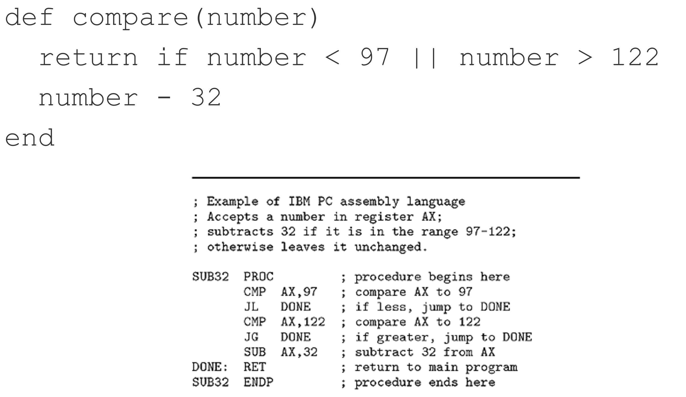

As you can see, the high level programming language version is much easier to read:

1. `return if number < 97 || number > 122`. It reads: return if number given is less than 97 or greater than 122. 
2. Otherwise the command `number - 32` is executed.

In this course we are going to learn 2 high level programming languages:

1. JavaScript
2. Ruby

### Statically Typed Compiled Languages

There is a big family of programming languages that includes the statically typed compiled languages. For example:

1. C
2. C++
3. Java

They are `statically typed` because the developer needs to declare the type of the data a RAM position is allowed to hold. For example, whether the position is going to hold a number
or a character. Don't worry if you that does n't make too much sense to you right now. We will explain that later. 

Also, they are `compiled` languages because the program that a developer writes (called `source code`) goes through a process, which is called compilation and linking, and which 
generates the final program deliverable, in binary machine executable format, that is shipped or deployed to the computer machine that will execute it. 
So, the actual source code is never delivered and it is not necessary for the program to run. Developer keeps the source code on its development machine (or other backup storage), 
and usually is kept private.

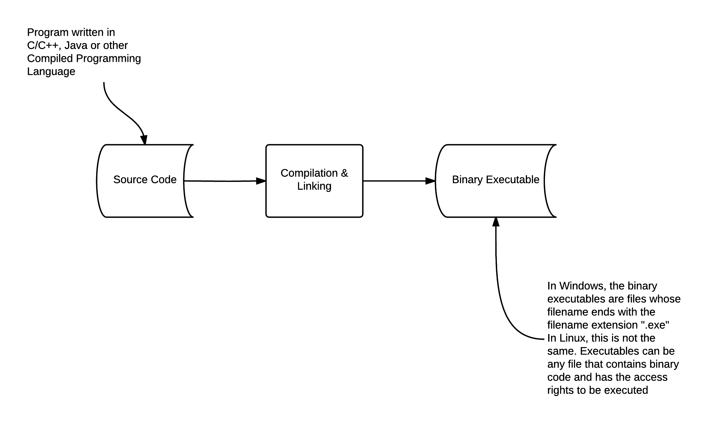

#### Advantages

Statically typed and compiled languages have a lot of advantages:

1. They produce programs that are very fast and optimized.
2. They catch a lot of programming errors at compilation time. So, they protect the developer from introducing bugs at run-time. However, this is true only for the programming errors that
can be detected by the compilation and linking phase. Not errors and bugs that have to do with program logic.
3. The source code is more descriptive with regards to the signature of the methods, functions and procedures.
4. They protect the source code from becoming open and public, since source code does not need to be delivered / deployed on the computer machine.

#### Disadvantages

As always, there are some disadvantages too:

1. The programs are quite verbose. Even for simple things, might need to write a lot of code.
2. Requires that developers know in advance about the requirements of the type of the data. Sometimes this is not feasible and definitely is restrictive when requirements change.

#### Example source code

Below, you can see same comparison program that we start with this chapter, written in Java:

``` java
int compare(int number) {
  if (number < 97 || number > 122) {
    return;
  }
  else {
    return number - 32;
  }
}
```

As you can see above, we need to tell that our `number` variable is going to be an integer (see: `int`).

### Dynamically Typed Script Languages

Another very popular family of programming languages is the dynamically typed script languages. Like:

1. Python
2. Ruby
3. JavaScript
4. PHP

They are dynamically typed because the developer does not have to specify the type of the RAM positions that will be holding program data.

They are script languages because they require another program, the interpreter, that would take the source code line-by-line, and execute each statement, one-by-one.

When we deploy a program written using a script language, we have to deploy the source code as well and make sure that the correct interpreter is already installed
on the machine we are going to do the deployment. The source code does not go through any compilation & linking phase. It is immediately fed to the 
language interpreter which parses the program line-by-line. For each line, it converts it to machine executable code and executes it, before doing the same for the
next line.

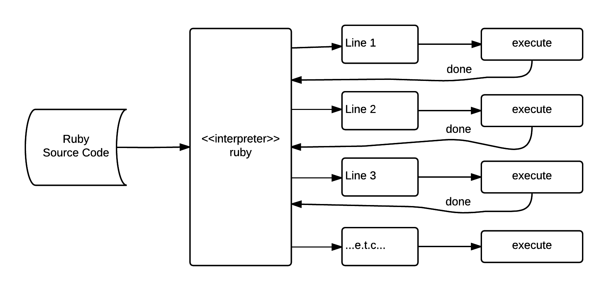

#### Advantages

Dynamically typed script languages have a lot of advantages:

1. They do not require the developer to specify the type of the RAM positions in advance. The language interpreter itself identifies internally what
is the correct type of data to attach to each value stored in a RAM position. 
2. You can easily read the source code and change the program to fix any bugs or enhance it with new features. And in extreme cases, you can even do that
on the computer that runs the application.
3. The source code size is much smaller than the one written with a statically typed compiled language. This means that for the same behaviour the developer
writes much less code.
4. They are very easy and handy to quickly build a prototype.
5. They are usually open source and have huge community support for free.

#### Disadvantages

But still, there are some disadvantages too:

1. The programs are generally much slower than the programs generated by the compiled programming languages.
2. The developers need to disclose their source code. This is because the actual source code needs to be deployed on the computer machine the application is going to run.
3. It is more difficult to build programmer-friendly IDEs (Integrated Development Environments like RubyMine).
4. The fact that there is no type checking at development time, might hide errors that will only appear while the program will run.

#### Example source code

Below, you can see same comparison program that we start with this chapter, written in Ruby:

``` ruby
def compare(number)
  return if number < 97 || number > 122
  number - 32
end
```

If you compare that version to the one with Java language you get a first impression of what writing less mean.
