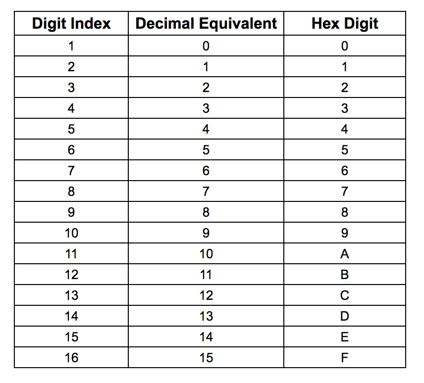
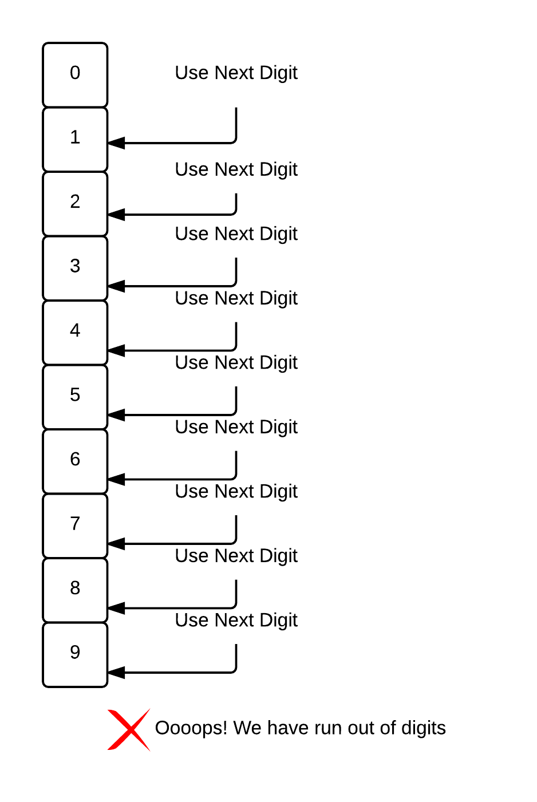
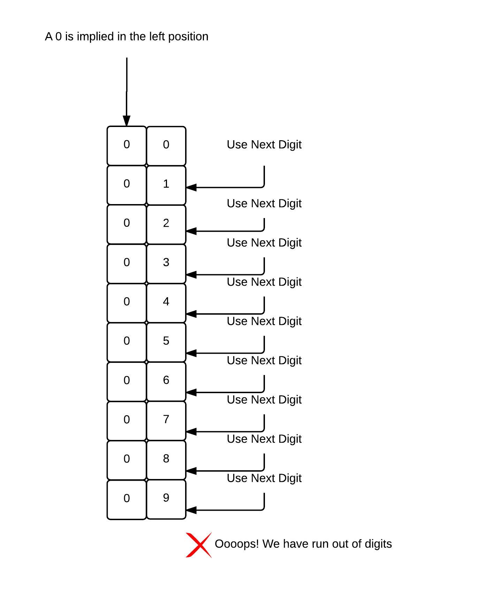
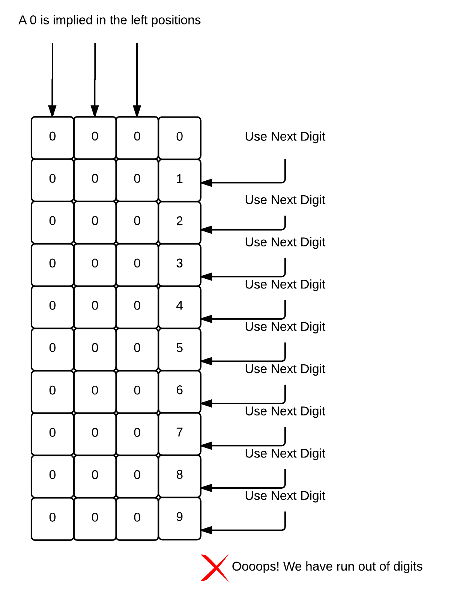
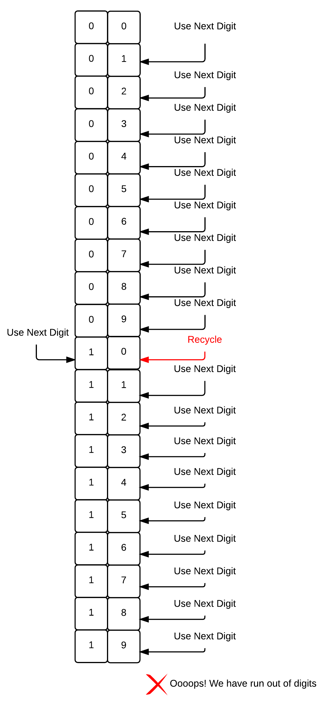
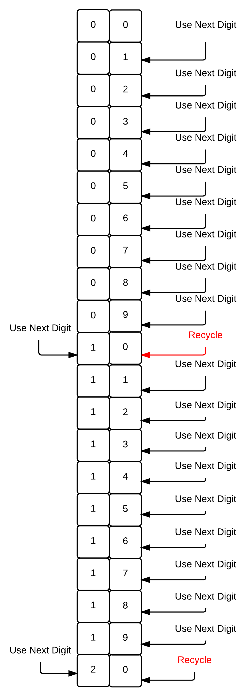
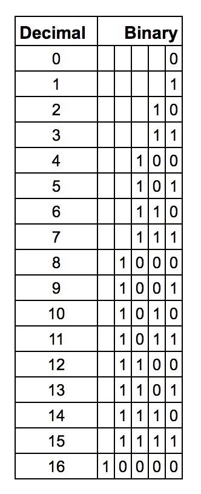
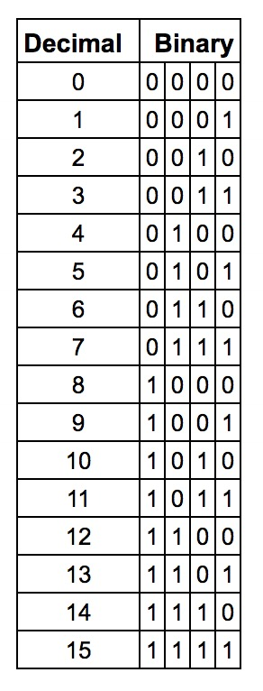
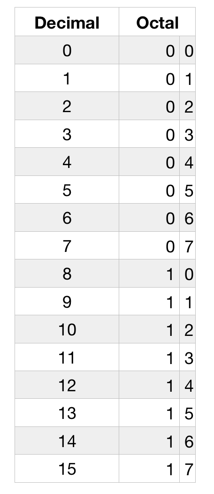
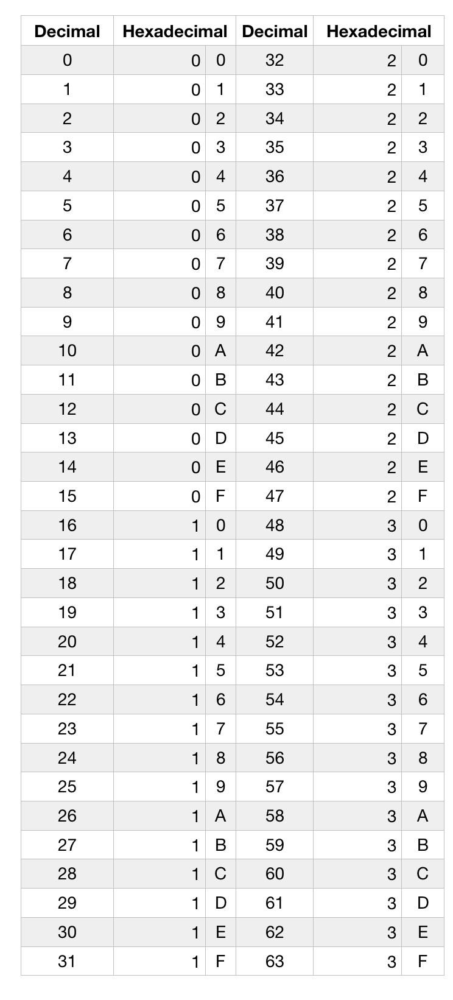

In this chapter, we are going to elaborate more on Numbering Systems.

The most popular numbering system in the computer world are:

* Decimal
* Binary
* Octal
* Hexadecimal

### Decimal Numbering System

All numbering system has a **base**, which equals to the number of digits that are used to build up numbers in this system. 

The decimal numbering system has base equal to 10. This means that has 10 digits. It is very popular in the human world, because its base is equal to the
number of fingers that humans have. Fingers have always been used to carry out calculations.

When we know the base of a numbering system, we can immediately tell which digits are part of this particular numbering system. It is all the digits that start
from 0 up to the digit that is equal to base minus 1 (base - 1). 

Hence, the decimal numbering system, which has base equal to 10, has all the digits from `0` up to `9`, since `9` is the result of `base - 1`, a.k.a. `10 - 1`.

Decimal Numbering System Digits: `0`, `1`, `2`, `3`, `4`, `5`, `6`, `7`, `8`, `9`.

### Binary Numbering System

Binary is very popular numbering system in the digital world, the world of computers and digital devices.
 
Binary numbering system base is 2. This means that it has 2 digits: `0`, `1` (since `1` is the result of `base - 1`, a.k.a. `2 - 1`).
 
### Octal Numbering System
 
There are cases in which the octal numbering system is useful in the computers and programming world. 
 
Octal numbering system has base equal to 8. This means that it has 8 digits.
 
Octal Numbering System Digits: `0`, `1`, `2`, `3`, `4`, `5`, `6`, `7`.
 
We start again from `0` and we go up to the `base - 1`, a.k.a. `8 - 1`, `7`.
  
### Hexadecimal Numbering System
  
This is another popular numbering system in the programming world. It has base 16. This means that it has 16 digits (`base -1`).
  
First digit is `0`, second digit is `1`, and so on up until 10th digit which is `9`. After that, the 11th digit is represented with the letter `A`,
the 12th digit with the letter `B`, the 13th digit with the letter `C`, the 14th digit with the letter `D`, the 15th digit with the letter `E` and the
16th digit with the letter `F`. We decided to use the first letters for the English alphabet for the 11th digit and above (for the digit that represents
the number 10 essentially and above) because we wanted a single symbol for number. This is the full list of digits again:



As you can see we start from `0` and we end up to `15` decimal which we decide to symbolize with `F`.

### Counting

We all know how to count using the decimal numbering system. But how do we count using other numbering systems?

We count using the same logic.

#### Counting on Decimal Numbering System

Let's refresh our memory about how we count using the decimal numbering system.

1. We start from 0.
2. We then use the next digit. Which is 1. 
3. We then use the next digit. Which is 2.
4. We then use the next digit. Which is 3.
5. We then use the next digit. Which is 4.
6. We then use the next digit. Which is 5.
7. We then use the next digit. Which is 6.
8. We then use the next digit. Which is 7.
9. We then use the next digit. Which is 8.
10. We then use the next digit. Which is 9.
11. We then use the next digit. Ooooop!. There is no next digit to use. In decimal numbering system, the last, maximum digit, is 9. 

 <div id="media-container-image-Counting Up to 9 - We run out of digits">
     <div id="media-title-image-Counting Up to 9 - We run out of digits">Counting Up to 9 - We run out of digits</div>
     </img>
 </div>
 
12. Now that we have run out of digits on the current position, we recycle the right most digit and we use the next digit for its left position digit. Note that when we work to increase the digit on one position,
the left position may be blank, but in fact, it holds the digit `0`. So, we have to increase it by 1. From `0` to `1`. We will try to explain that using the following pictures. Firstly, you
see that the digit `0` is implied on the left-to-the-current position.
 
 <div id="media-container-image-Digit 0 Is Implied On The Left Position">
     <div id="media-title-image-Digit 0 Is Implied On The Left Position">Digit 0 Is Implied On The Left Position</div>
     </img>
 </div>
Actually, all the left positions are supposed to have `0`. Think about it in another way. `2` is equal to `02` and to `002` and to `0002` and so on.

 <div id="media-container-image-Left Positions Are Supposed To Be Holding 0s">
     <div id="media-title-image-Left Positions Are Supposed To Be Holding 0s">Left Positions Are Supposed To Be Holding 0s</div>
     </img>
 </div>
Now that we have run out of digits on the current column, we need to start using the left column. What we do, is that we recycle the current column back to `0` and we use the next digit available
from the left column. Hence, we have the number `10`. 
 
 <div id="media-container-image-Recycle Right Most Position to 0 and Take Next Digit on Left Position">
     <div id="media-title-image-Recycle Right Most Position to 0 and Take Next Digit on Left Position">Recycle Right Most Position to 0 and Take Next Digit on Left Position</div>
     </img>
 </div>
 
13. We then use the next digit. Which gives `11`.
14. We then use the next digit. Which gives `12`.
15. ...and so on...until `19`.
16. At this point, we again run out of digits on the right most position.

 <div id="media-container-image-On 19 We Run Out Of Digits">
     <div id="media-title-image-On 19 We Run Out Of Digits">On 19 We Run Out Of Digits</div>
     </img>
 </div>

17. But we deal with that as we did earlier. We will recycle the right position back to `0` and we will take the next digit on the left position, a.k.a, from `1` to `2`, having `20` as result.

 <div id="media-container-image-Recycle Right Position to 0 and Take Next Digit On Left Position">
     <div id="media-title-image-Recycle Right Position to 0 and Take Next Digit On Left Position">Recycle Right Position to 0 and Take Next Digit On Left Position</div>
     </img>
 </div>

18. We then take the next digit available on the right position. We have `21`.
19. We then take the next digit available on the right position. We have `22`.
20. And the same goes on until `29`. 
21. On `29` we have run out of digits on right position. We do what we did in similar cases earlier. We recycle `9` back to `0` and we take the next digit on the left position. Hence we have
`30`. 
23. We continue with `31`.
24. Then `32`. 
25. We follow the same "take next digit and, if run out of digits, recycle" approach up until `99`. In that case we have run out of digits on both positions. We recycle both of them to `0` and we take
the next digit on one more position to the left. Hence we have `100`.
25. Then `101`. E.t.c.

It seems that we have found the pattern on how we count from 0 up to whatever number in the decimal numbering system. This pattern is enough to tell us which is the number that follows this:

```
1838472874091238099999
```
Spend some time to do this exercise on your own. You should be able to use the above pattern and find out that the next number is:
```
1838472874091238100000
```

#### Counting on Binary Numbering System

The way we count on binary numbering system is exactly the same like we count on decimal numbering system. We use the same pattern, the same algorithm.

1. We start from 0.
2. We take the next digit. We have 1.
3. We have run out of digits. Remember that binary numbering system only has 2 digits. 0 and 1. Hence, we recycle right position to `0` and we take the next digit on the left position. 
Hence, we get the number 10. 
4. We take the next digit on the right most position. We have 11.
5. We have run out of digits on the right most position. We have also run out of digits on the left position too. So, we recycle them both to `0` and we take the next digit on the left
most position, the third position. Hence we have the number 100.
6. We take the next digit on the right most position. We have 101.
7. We have run out of digits and we recycle to `0` taking the next available digit on the left. Hence, we have 110.
8. We take the next digit on the right most position. We have 111.

The next table displays the first 17 binary numbers, counting from `0`.



Usually, when we display a table of binary numbers, we fill in the left positions with 0s, when 0 is implied. Here is the table of first 16 binary numbers filled in that way.



If you look more carefully on how this table is constructed, you will see the following pattern:

1. The first column is composed of consecutive `01` chunks.
2. The second column is composed of consecutive `0011` chunks.
3. The third column is composed of consecutive `00001111` chunks.
4. The fourth column is composed of consecutive `0000000011111111` chunks.

This is a nice mnemonic trick that would allow you to either build this table quickly or even then verify its correctness. Watch the following video to see how we construct this table 
very quickly using this technique.

<div id="media-title-video-producing-first-16-binary-numbers.mp4">How title tag affects the name of the tab of the page</div>
<a href="https://player.vimeo.com/video/194306934"></a>
           
And here is a colour map that highlights again this pattern.


That was a good start on understanding how we count in binary system. And of course, we now know what is the next number of a given binary number. For example, try
to find the next number of the following binary number:

```
1010010001001001111
```

Think about that the way we did that earlier. Try to find whether you can increase the right most digit. If not, then recycle it to 0 and increase the left one. If you follow the pattern
and the logic to increase a binary number, you will see that the next one is:

```
1010010001001010000
```

#### Counting on Octal Numbering System

Octal numbering system has 8 digits, starting from `0` up to `7`. Counting follows the same logic. Spend some time to study the following table. It has the first 16 numbers in the 
octal numbering system. Practice yourself to be in position to quickly draw this table. The counting follows the same pattern as we did for decimal and binary numbering system.



#### Counting on Hexadecimal Numbering System

Hexadecimal numbering system has 16 digits. `0`, `1`,..., `9`, `A`, `B`, `C`, `D`, `E`, `F`. We follow the same pattern to count from `0` and increase one by one. Here is the table
with the first 64 hexadecimal numbers:



Pay attention how the next number following `29`, for example, is not `30`, but, instead, it is `2A`, since, being on `29` we have not run out of digits yet. After `9` we still have `A`.

Practice with the following. What is the next number following this?

```
38A3892BD482DF
```

If you think about that and you understand what we have done so far, the next number is:

```
38A3892BD482E0
```

### Closing

It is not difficult to count in non-decimal numbering systems, as long as you understand what is the logic behind. Besides, that, you now know that if somebody asks you which number is this?
 
```
10
```

you should be clever enough to tell: "it depends on the numbering system"

Because, according to the numbering system, this number is different.

1. On decimal numbering system, this number is the number ten.
2. On binary numbering system, this number is the number two.
3. On octal numbering system, this number is the number eight.
4. On hexadecimal numbering system, this number is the number sixteen.


