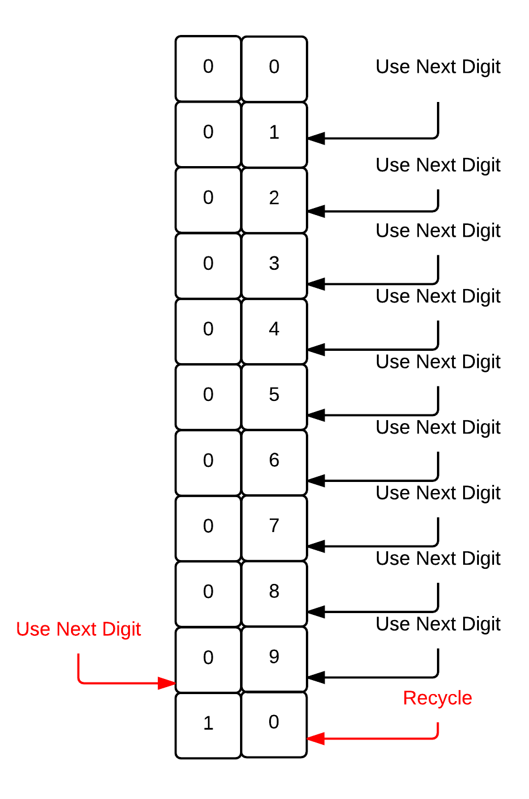
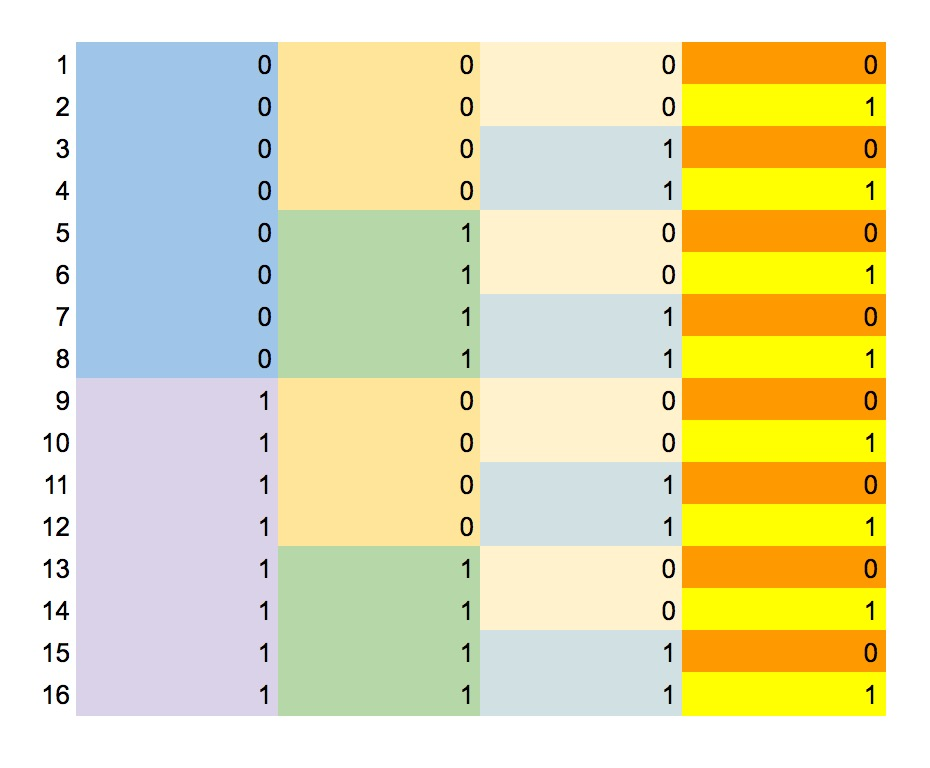

In this chapter we take a deeper dive into numbering systems. We study the

* Decimal,
* Binary,
* Octal, and
* Hexadecimal 

numbering systems.

We explain in detail how the number of available digits is calculated. Also,
we explain the logic behind counting and how we can use an algorithm to count
on any numbering system.

We also explain how you can quickly draw the table with the first 16 numbers of the binary system, and the pattern behind it.

Finally, we teach you why the number `10` is not always the number ten.
