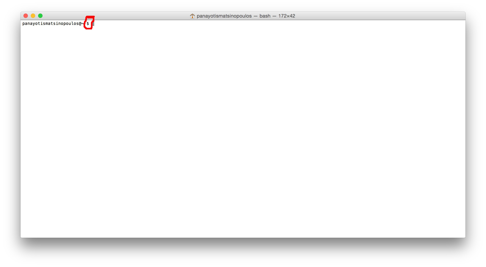
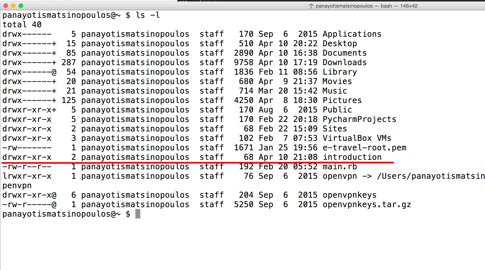
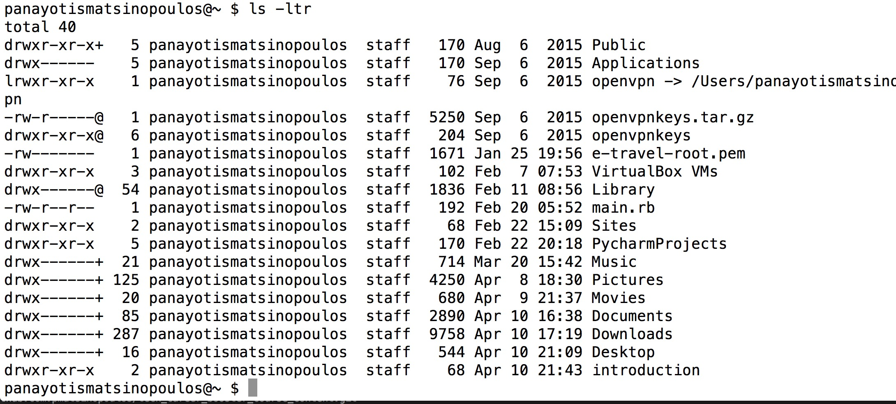
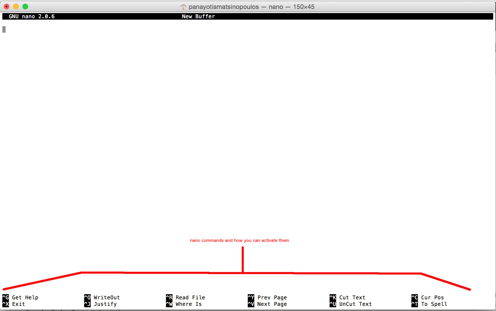
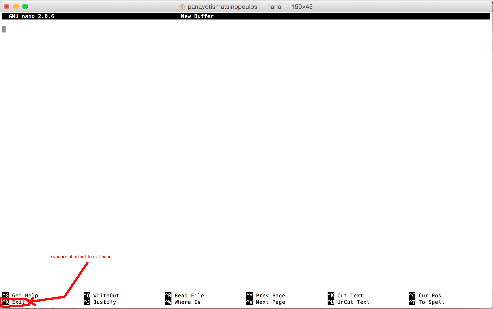
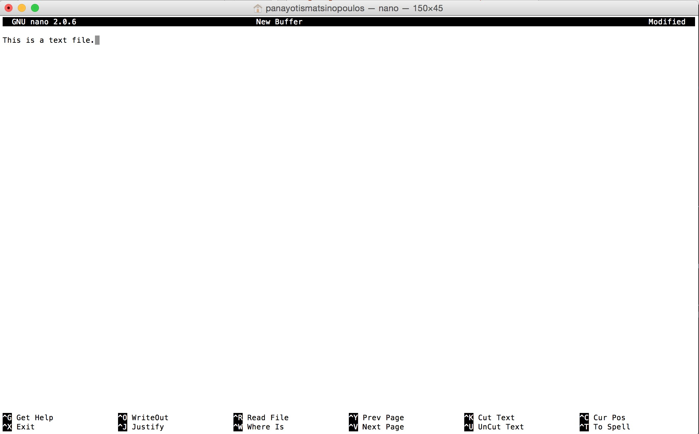
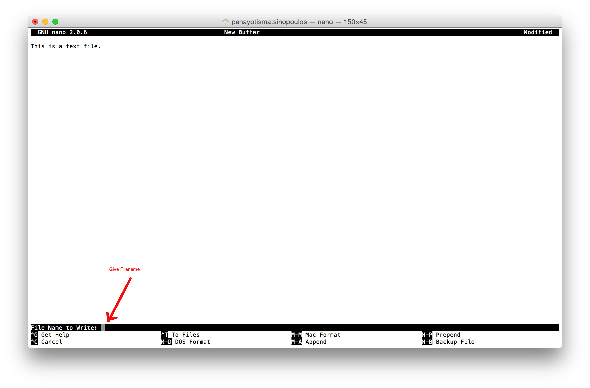

Let's start with some basic Linux commands that need to be given from the terminal. But first, open a terminal session:

### Starting Terminal


On the previous screenshot, you can see a new terminal session started on Mac. Find a way to start the program "Terminal". This will open a window like that and 
a prompt for you to type in Linux commands.



Usually, the `$` symbol is the prompt symbol used to prompt the user enter Linux commands.

So, the Linux operating system is waiting for the user to input a command. We give the command by typing the command and then pressing the key `Return` or `Enter`.

### Some useful commands

#### `pwd` - Present Working Directory

The command `pwd` prints the Present Working Directory. Let's try that. Give the command:

``` bash
pwd
```
You will get something like that:
```
panayotismatsinopoulos@~ $ pwd
/Users/panayotismatsinopoulos
panayotismatsinopoulos@~ $ 
```
which means that the command will return something like `/Users/panayotismatsinopoulos` and then, the operating system, will prompt you to give the next command.

This command shows that the current logged in user, the one that gives the commands, has a terminal open at the particular branch of the folders tree. The name of the current folder
is `panayotismatsinopoulos`, which is a child folder of the parent folder `Users`. The full path, `/Users/panayotismatsinopoulos` uses `/` to separate one part of the branch
from the next.

A directory, like `Users`, can have many child directories. But, on the other hand, a child directory, like `panayotismatsinopoulos`, can only have 1 parent directory. This does
not exclude the fact that any folder can be both a child and a parent. Only the root of the folders tree does not have any parent. The root is represented by the starting `/`.

Hence, in order to be more specific, the full path `/Users/panayotismatsinopoulos` denotes that `Users` is a child folder belonging to the root folder `/`. Also, it denotes
that `panayotismatsinopoulos` is one of the children of the `Users` folder. 

#### `ls` - List command

A directory can contain other directories or files. If we want to see the content of the present working directory, or in other words, if we want to see a *list* of the contents
of the present working directory, we type in the command `ls`. Try it. Give the following command on your command prompt:

``` bash
ls
```
This is what I get on my computer:

``` bash
panayotismatsinopoulos@~ $ ls
Applications		Downloads		Music			PycharmProjects		e-travel-root.pem	openvpnkeys
Desktop			Library			Pictures		Sites			main.rb			openvpnkeys.tar.gz
Documents		Movies			Public			VirtualBox VMs		openvpn
panayotismatsinopoulos@~ $ 
```
This is the list of the contents inside the current directory. This is a compact version of the list. You can get a long list if you use the command switch `-l`. Let's try that:

``` bash
ls -l
```

On my terminal, this returns this one:

``` bash
panayotismatsinopoulos@~ $ ls -l
total 40
drwx------    5 panayotismatsinopoulos  staff   170 Sep  6  2015 Applications
drwx------+  15 panayotismatsinopoulos  staff   510 Apr 10 20:22 Desktop
drwx------+  85 panayotismatsinopoulos  staff  2890 Apr 10 16:38 Documents
drwx------+ 287 panayotismatsinopoulos  staff  9758 Apr 10 17:19 Downloads
drwx------@  54 panayotismatsinopoulos  staff  1836 Feb 11 08:56 Library
drwx------+  20 panayotismatsinopoulos  staff   680 Apr  9 21:37 Movies
drwx------+  21 panayotismatsinopoulos  staff   714 Mar 20 15:42 Music
drwx------+ 125 panayotismatsinopoulos  staff  4250 Apr  8 18:30 Pictures
drwxr-xr-x+   5 panayotismatsinopoulos  staff   170 Aug  6  2015 Public
drwxr-xr-x    5 panayotismatsinopoulos  staff   170 Feb 22 20:18 PycharmProjects
drwxr-xr-x    2 panayotismatsinopoulos  staff    68 Feb 22 15:09 Sites
drwxr-xr-x    3 panayotismatsinopoulos  staff   102 Feb  7 07:53 VirtualBox VMs
-rw-------    1 panayotismatsinopoulos  staff  1671 Jan 25 19:56 e-travel-root.pem
-rw-r--r--    1 panayotismatsinopoulos  staff   192 Feb 20 05:52 main.rb
lrwxr-xr-x    1 panayotismatsinopoulos  staff    76 Sep  6  2015 openvpn -> /Users/panayotismatsinopoulos/Applications/openvpn-2.3.8/src/openvpn/openvpn
drwxr-xr-x@   6 panayotismatsinopoulos  staff   204 Sep  6  2015 openvpnkeys
-rw-r-----@   1 panayotismatsinopoulos  staff  5250 Sep  6  2015 openvpnkeys.tar.gz
panayotismatsinopoulos@~ $ 
```
This is very useful because it does not only print the contents, but for each item in the list it gives you a lot of extra useful information. For example, you can see
a `d` as the first character in some entries. This indicates that the corresponding entry is a directory and not a file. The files have the first character being a dash `-`.
You can also see the size of each entry in bytes. For example, the size of file `main.rb` in the above entry is `192` bytes.

#### `clear`

If you want to clear the contents of the terminal, you can issue the command `clear`. Try that, give the following command on your terminal:

``` bash
clear
```

You will see that the contents of the terminal disappear and you are back on top line:


#### `mkdir` - Make Directory

If you want to create a new directory inside the current working directory, you need to use the command `mkdir`, which stands for `MaKe DIRectory`. Let's try that. Give the following command
on your command prompt:

``` bash
mkdir introduction
```

You will get back something like that:

``` bash
panayotismatsinopoulos@~ $ mkdir introduction
panayotismatsinopoulos@~ $ 
```
If everything goes well, you will just be prompted for the next command. In order to double check whether the directory has been created or not, you will have to list the contents
of the current directory and see whether `introduction` is part of the list. Let's do that:

``` bash
ls -l
```

If you do that, you will get a long list with the entries of the current directory, like this:



One of the entries is the directory entry `introduction`.

Alternatively, you can list for the particular entry. Try this command:

``` bash
ls -ld introduction
```

This will give you the following:

``` bash
panayotismatsinopoulos@~ $ ls -ld introduction
drwxr-xr-x  2 panayotismatsinopoulos  staff  68 Apr 10 21:08 introduction
panayotismatsinopoulos@~ $
```

which basically verifies that the `introduction` has been successfully created.

Note that the `ls -l introduction` will list the contents of the `introduction` directory. If you want to get information about an entry in the list of entries of the current 
directory, and that entry is a directory, then you have to use the switch `-d` (alongside the `-l` if you want a long list). If you ommit that switch (`-d`) you will get the
contents of the directory itself, rather than the details of this directory as child of the current working directory.

Try that:

``` bash
ls -l introduction
```

You will see that it does not return anything:

``` bash
panayotismatsinopoulos@~ $ ls -l introduction
panayotismatsinopoulos@~ $
```

This is because the `introduction` directory has just been created and hence does not have any entries.

#### `ls -ltr` - List - Long Time Ordered, Reverse

There is a very useful variation of `ls`. It is the `ls -ltr`. This give a long list output but with contents ordered by time created in reverse order. This means that it will
print the most recent ones last, hence at the bottom of the list, exactly above your next command prompt.

Try that:

``` bash
ls -ltr
```

This will give the following:



As you can see the most recent item, the newly created `introduction` folder is at the bottom of the list, and hence it can be easily located.

#### `cd` - Change Directory

Now, we are in the current directory `/Users/panayotismatsinopoulos` and there is a directory, a child directory, with name `introduction`, which has just been created. What if we
want to go into the `introduction` directory. This is a Change Directory action that we want to do and it is accomplished with the command `cd` (from `C`hange `D`irectory).

Let's do that. Give the following command:

``` bash
cd introduction
```

What you will get is this:

``` bash
panayotismatsinopoulos@~ $ cd introduction
panayotismatsinopoulos@~/introduction $
```
As you can see the prompt has changed to include the name `introduction` just before the `$` sign which denotes the command prompt. 

Give the command `pwd`:

``` bash
pwd
```

This will output the full path to the present working directory:

``` bash
panayotismatsinopoulos@~/introduction $ pwd
/Users/panayotismatsinopoulos/introduction
panayotismatsinopoulos@~/introduction $
```

which proves that we are now living inside the `introduction` directory (which is child of `/Users/panayotismatsinopoulos`).
 
#### `~` - Home Directory
 
As you can see in the prompt above, there is the symbol `~` as part of the prompt, and actually, it seems to be part of a path specification. It is indeed. The `~/introduction` is
equivalent to `/Users/panayotismatsinopoulos/introduction`. The `~` is a shorthand to refer to the home directory of the currently logged in user. 

Hence, `~` is equal to `/Users/panayotismatsinopoulos` (or whatever is your home directory) and they can be used interchangeably.

For example, type the following command:

``` bash
cd ~
```

This will change your current working directory to be the home directory of the currently logged in user. In my case `/Users/panayotismatsinopoulos`.

``` bash
panayotismatsinopoulos@~/introduction $ cd ~
panayotismatsinopoulos@~ $ 
```

If I do now `pwd` I will see this:

``` bash
panayotismatsinopoulos@~ $ pwd
/Users/panayotismatsinopoulos
panayotismatsinopoulos@~ $
```

which means that I am no longer inside the `introduction` directory. I have been moved to my home directory.

> *Note:* The symbol `~` is called `tilde`.

### Navigating Through Directories
    
Now, let's move back to the `introduction` directory:

``` bash
cd introduction
```

And let's create another directory, this time, as child of the `introduction` directory. Execute the following command:

``` bash
mkdir chapter1
```

The above command creates the directory `chapter1` inside the `introduction` directory. Let's confirm that with the following command:

``` bash
ls -l
```

This will give the following output:

``` bash
panayotismatsinopoulos@~/introduction $ ls -l
total 0
drwxr-xr-x  2 panayotismatsinopoulos  staff  68 Apr 10 22:03 chapter1
```
which proves that the directory `chapter1` has been successfully created.

Let's move now into the `chapter1` directory:

``` bash
cd chapter1
```

We get the following output:

``` bash
panayotismatsinopoulos@~/introduction $ cd chapter1
panayotismatsinopoulos@~/introduction/chapter1 $
```

As you can see the prompt has now changed in order to indicate that we are inside the `~/introduction/chapter1` folder.

I can go back again to the home directory using the tilde:

``` bash
cd ~
```

You will see that the new prompt shows that I am on the home directory:

``` bash
panayotismatsinopoulos@~/introduction/chapter1 $ cd ~
panayotismatsinopoulos@~ $
```

Now, I can go back to the `chapter1` directory with a single `cd` command that would combine the two directories:

``` bash
cd introduction/chapter1
```

and I am back:

``` bash
panayotismatsinopoulos@~ $ cd introduction/chapter1
panayotismatsinopoulos@~/introduction/chapter1 $
```

And if I want to go to the parent directory of `chapter1` without actually specifying its name, I can refer to it with a double full stop notation `..`. Give the
following command:

``` bash
cd ..
```

This changes the current directory to be the parent one.

``` bash
panayotismatsinopoulos@~/introduction/chapter1 $ cd ..
panayotismatsinopoulos@~/introduction $ 
```

In other words, the `..` means the parent directory of the present working directory.

Now, if I give the command:

``` bash
cd ..
```
then the present working directory is going to be `~`, which is the parent directory of `introduction`.

``` bash
panayotismatsinopoulos@~/introduction $ cd ..
panayotismatsinopoulos@~ $
```

### Editing Text Files

All distributions of Linux, Windows and Mac contain a program that will allow you to edit text files. One very popular on Linux and Mac is the `nano` program.

Let's try that. Give the following command on your command prompt:

``` bash
nano
```

This command will start the nano editor which looks like this:


At the bottom of the nano environment, you can see some of the most common nano commands and how you can activate them.



> *Note:* the symbol `^` in the command keyboard shortcuts corresponds to the `Ctrl` key.

Usually the nano commands are activated pressing on the `Ctrl` key and then, without releasing, on the corresponding command key. For example, in order to exit nano, you need to
press on `Ctrl + X`.



Let's type some content inside the nano text editing area:



We typed the text: `This is a text file`.

In order to save the content of this file into disk, you need to use the `WriteOut` command: `Ctrl + O`. You will be prompted to give a name to your first-time saved file:



Let's give the name `sample.txt`. We type that in and we hit the `Enter` key.

So, this file should exist inside the home directory. Let's exit nano (`Ctrl + X`) and execute the following command:

``` bash
ls -ltr
```
You will see that, at the bottom, there is the newly created file `sample.txt`:

``` bash
panayotismatsinopoulos@~ $ ls -ltr
total 48
drwxr-xr-x+   5 panayotismatsinopoulos  staff   170 Aug  6  2015 Public
drwx------    5 panayotismatsinopoulos  staff   170 Sep  6  2015 Applications
lrwxr-xr-x    1 panayotismatsinopoulos  staff    76 Sep  6  2015 openvpn -> /Users/panayotismatsinopoulos/Applications/openvpn-2.3.8/src/openvpn/openvpn
-rw-r-----@   1 panayotismatsinopoulos  staff  5250 Sep  6  2015 openvpnkeys.tar.gz
drwxr-xr-x@   6 panayotismatsinopoulos  staff   204 Sep  6  2015 openvpnkeys
-rw-------    1 panayotismatsinopoulos  staff  1671 Jan 25 19:56 e-travel-root.pem
drwxr-xr-x    3 panayotismatsinopoulos  staff   102 Feb  7 07:53 VirtualBox VMs
drwx------@  54 panayotismatsinopoulos  staff  1836 Feb 11 08:56 Library
-rw-r--r--    1 panayotismatsinopoulos  staff   192 Feb 20 05:52 main.rb
drwxr-xr-x    2 panayotismatsinopoulos  staff    68 Feb 22 15:09 Sites
drwxr-xr-x    5 panayotismatsinopoulos  staff   170 Feb 22 20:18 PycharmProjects
drwx------+  21 panayotismatsinopoulos  staff   714 Mar 20 15:42 Music
drwx------+ 125 panayotismatsinopoulos  staff  4250 Apr  8 18:30 Pictures
drwx------+  20 panayotismatsinopoulos  staff   680 Apr  9 21:37 Movies
drwx------+  85 panayotismatsinopoulos  staff  2890 Apr 10 16:38 Documents
drwx------+ 287 panayotismatsinopoulos  staff  9758 Apr 10 17:19 Downloads
drwxr-xr-x    3 panayotismatsinopoulos  staff   102 Apr 10 22:03 introduction
drwx------+  22 panayotismatsinopoulos  staff   748 Apr 10 22:51 Desktop
-rw-r--r--    1 panayotismatsinopoulos  staff    21 Apr 10 22:54 sample.txt
```

### `cat`

If we want to see the contents of a text file, we can call the `cat` command. Let's do that for the `sample.txt` file:

``` bash
cat sample.txt
```

You will get this:

``` bash
panayotismatsinopoulos@~ $ cat sample.txt
This is a text file.
panayotismatsinopoulos@~ $ 
```

You can see the contents of the file given as input argument to the `cat` command to be printed on the output.

### `rm` - Remove a file

What is the command that we should use, if we want to delete a file. It is the `rm` command. Let's do that. Let's delete the file `sample.txt`. Give the following command:

``` bash
rm sample.txt
```
If you do that, and then you will execute the `ls -ltr` file, you will not see the `sample.txt` file anymore in the list.

### `rm -R` - Remove Directory

Let's now go to the `introduction` directory again:

``` bash
panayotismatsinopoulos@~ $ cd introduction
panayotismatsinopoulos@~/introduction $ 
```

This one has the directory `chapter1` inside. What if we want to remove the directory `chapter1`. Try the following command:

``` bash
rm chapter1
```

You will get an error that `chapter1` is a directory:

``` bash
panayotismatsinopoulos@~/introduction $ rm chapter1
rm: chapter1: is a directory
panayotismatsinopoulos@~/introduction $ 
```
and the directory will not be removed. If you want to remove a directory, you can still use the command `rm`, but you have to do that with the use of the switch `-R`.
Let's do that:

``` bash
rm -R chapter1
```
This will not output anything, if all goes well. You can see that the directory has been removed, if you do `ls -l` and check whether the `chapter1` is returned as
entry in the list.

After having removed the `chapter1` directory, let's go back to the parent directory: 

``` bash
cd ..
```
The situation is now this:

``` bash
panayotismatsinopoulos@~/introduction $ cd ..
panayotismatsinopoulos@~ $
```
Which means that we can now try to remove the `introduction` directory:

``` bash
rm -R introduction
```
This will remove `introduction` directory and it will not appear any more in `ls` commands on the home directory.


