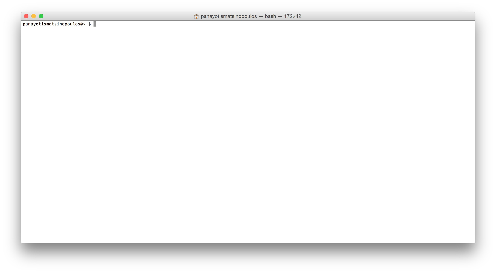
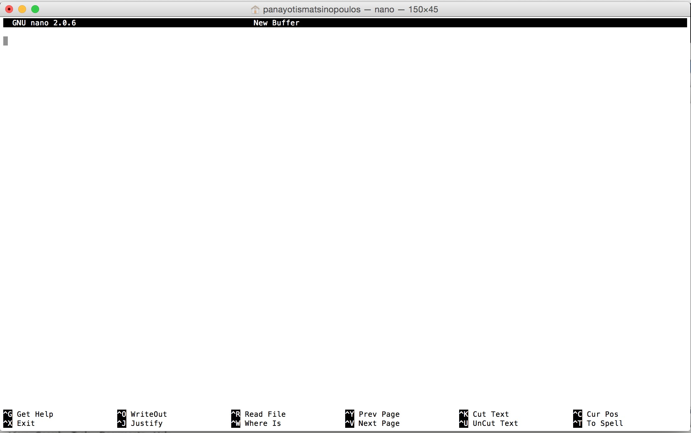

This chapter will give you some basic knowledge on using the terminal commands on Linux.
This knowledge is important for every developer. 

You will learn to work on the terminal:



and you will be able to get a list of the contents of a folder like this:

``` bash
panayotismatsinopoulos@~ $ ls -l
total 40
drwx------    5 panayotismatsinopoulos  staff   170 Sep  6  2015 Applications
drwx------+  15 panayotismatsinopoulos  staff   510 Apr 10 20:22 Desktop
drwx------+  85 panayotismatsinopoulos  staff  2890 Apr 10 16:38 Documents
drwx------+ 287 panayotismatsinopoulos  staff  9758 Apr 10 17:19 Downloads
drwx------@  54 panayotismatsinopoulos  staff  1836 Feb 11 08:56 Library
drwx------+  20 panayotismatsinopoulos  staff   680 Apr  9 21:37 Movies
drwx------+  21 panayotismatsinopoulos  staff   714 Mar 20 15:42 Music
drwx------+ 125 panayotismatsinopoulos  staff  4250 Apr  8 18:30 Pictures
drwxr-xr-x+   5 panayotismatsinopoulos  staff   170 Aug  6  2015 Public
drwxr-xr-x    5 panayotismatsinopoulos  staff   170 Feb 22 20:18 PycharmProjects
drwxr-xr-x    2 panayotismatsinopoulos  staff    68 Feb 22 15:09 Sites
drwxr-xr-x    3 panayotismatsinopoulos  staff   102 Feb  7 07:53 VirtualBox VMs
-rw-------    1 panayotismatsinopoulos  staff  1671 Jan 25 19:56 e-travel-root.pem
-rw-r--r--    1 panayotismatsinopoulos  staff   192 Feb 20 05:52 main.rb
lrwxr-xr-x    1 panayotismatsinopoulos  staff    76 Sep  6  2015 openvpn -> /Users/panayotismatsinopoulos/Applications/openvpn-2.3.8/src/openvpn/openvpn
drwxr-xr-x@   6 panayotismatsinopoulos  staff   204 Sep  6  2015 openvpnkeys
-rw-r-----@   1 panayotismatsinopoulos  staff  5250 Sep  6  2015 openvpnkeys.tar.gz
panayotismatsinopoulos@~ $ 
```

You will also learn various commands like:

`ls`, `cd`, `mkdir`, `rm` and more.

Finally, you will learn about a common text editor in Linux and Mac, the `nano` text editor:




