### Introduction

This is your start to real programming and we will use JavaScript as our programming language. JavaScript is a dynamically typed
script language. It is very popular because it is the language used by all browsers, to run programs on the client side. However, the last
years has also become very popular as a backend language too, due to [Node.js](https://nodejs.org). 

If you want to become a very good Full-Stack Web Developer, you need to learn JavaScript very well. 

### Our JavaScript Testbeds

In order for us to learn JavaScript, we are going to use an environment that will allow to execute our JavaScript code. We will use the
following testbed environments:

1. Google Chrome Developers Console
2. [JS Bin](http://jsbin.com)
3. [Node.js](https://nodejs.org)

### Writing our First Program

Traditionally, when one starts to learn a new programming language, the first program that he writes, is a "Hello World" program.
It is a program in which the phrase "Hello World" is somehow presented to the user of the program.

This is what we are going to do here with JavaScript. 

#### Hello World Program

##### Google Chrome Developers Console

Initially, we will write our hello world program using the Google Chrome Developers Console.

Open your Chrome browser and then start the developer tools.

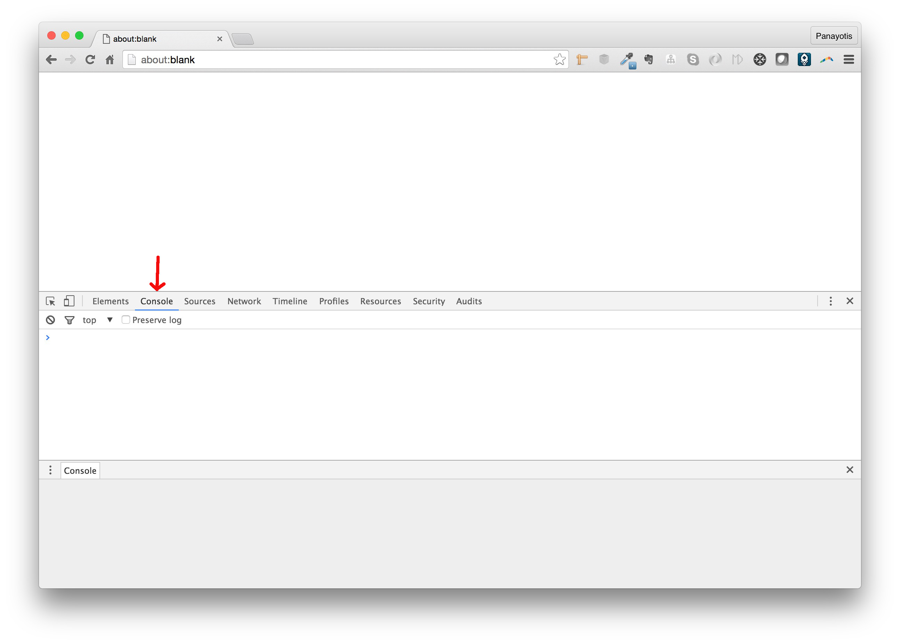

Make sure that the `Console` tab is selected. If not, click on that. You should see the cursor blinking in front of the JavaScript command prompt. If everything is ok,
then write the following JavaScript command and click on the `Return` / `Enter` key on your keyboard (like when you give Operating System commands on the terminal).

``` javascript
alert("Hello World");
```

When you do that, you will see a popup with the "Hello World" phrase printed on it.


Congratulations! You have just written your first computer program. Your first JavaScript statement.

As we said earlier, JavaScript is a script language. This means that the statements are being executed one-by-one. The statement here is `alert("Hello World");` The `;` is 
necessary to denote to JavaScript interpreter the end of the JavaScript statement. When you click on `Enter` key, the JavaScript statement is submitted to the browser JavaScript
execution engine and it is executed immediately. This is how Google Chrome Developers Console works. And then you are being transferred to a new console prompt, and you can
give your next JavaScript command.

Let's do that. Let's give our next JavaScript command:

``` javascript
console.log("Hello World");
```

When you type in the above and you click on `Enter` to submit this JavaScript statement back to the execution engine, then you will see this:

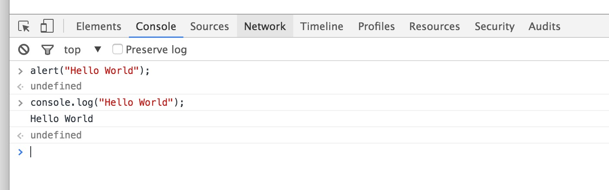

The `console.log(".....");` command outputs its argument to the console. 

Don't worry about the `undefined` that you see, or if you do not really understand how JavaScript works, or how JavaScript commands should be constructed. We will learn that stuff
in the following chapters.

For now, enjoy that you have managed to write your first JavaScript commands.

##### JS Bin

Another very popular JavaScript (and not only) testbed is the [JS Bin](http://jsbin.com). JS Bin allows you to write HTML, CSS and JavaScript. Let's try that. Open your browser
and visit the page [http://jsbin.com](http://jsbin.com).

You will see something like this:

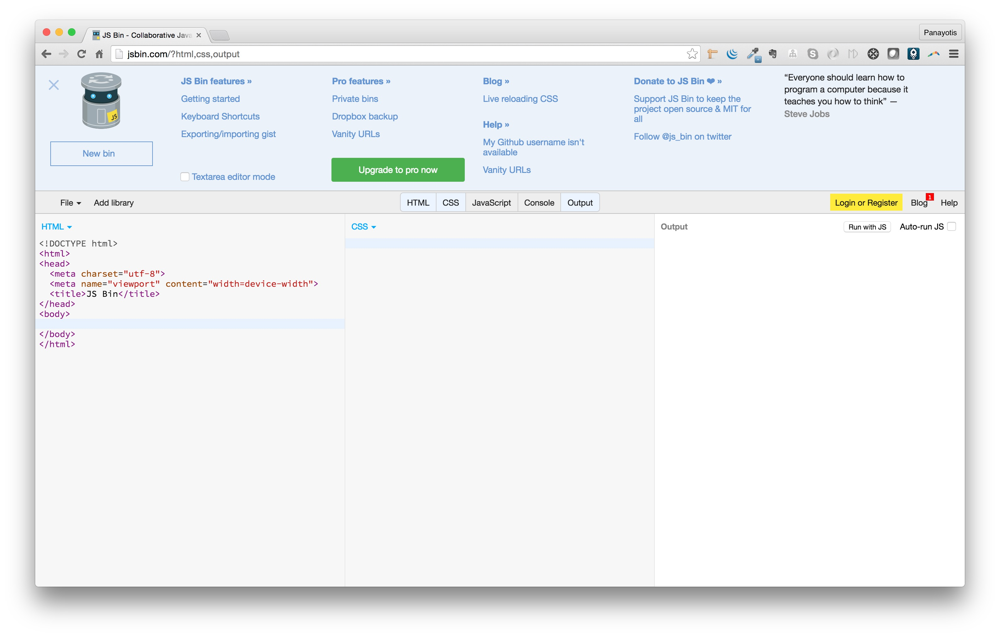

JS Bin offers, as we said earlier, the ability to write HTML, CSS and JavaScript. In the following picture you can see the different tabs that can be switched on and off.


1. HTML. The HTML Tab sits on the left. On the above picture is switched on. It contains a bare minimum of HTML code. This is where you write your HTML code.
2. CSS. The CSS Tab sits second from left. It is where you should be writing your CSS code. It is switched on on the picture above.
3. JavaScript. The JavaScript Tab sits next to CSS. It is where you will be writing your JavaScript code. It is switched off on the picture above. You have to click on the 
tab in order to switch it on.
4. Console. This tab is not for a particular language. It is for the JavaScript console output messages. It is switched off on the picture above. You have to click on the tab
in order to switch it on.
5. Output. This tab is not for a particular language. It is where the combination of HTML, CSS and JavaScript code is rendered by the browser in order to show you the final 
result.

Watch the following video to understand how we are creating a simple HTML content with basic CSS and how it is output on the right hand side tab.

<div id="media-title-video-jsbin-hello-world-html-page.mp4">Creating an HTML Page on JS Bin</div>
<a href="https://player.vimeo.com/video/194306070"></a>
           
Pretty Cool! Isn't it?
           
As you can see, while you are editing the content of your HTML page, or changing the CSS rules, the output is automatically being updated.

You can even include popular CSS and JavaScript libraries. Watch the following one in which we are including Twitter Bootstrap.

<div id="media-title-video-js-bin-twitter-bootstrap-page.mp4">Creating an HTML Page on JS Bin, including Twitter Bootstrap</div>
<a href="https://player.vimeo.com/video/194305042"></a>
           
During the JavaScript section, we will focus on the JavaScript tab of JS Bin. But it is very good if you learned this tool. It comes very handy when you want to 
experiment with front-end technologies.

Now, let's write our hello world statements, like we did with Chrome developer tools.

Make sure that you start a new bin.

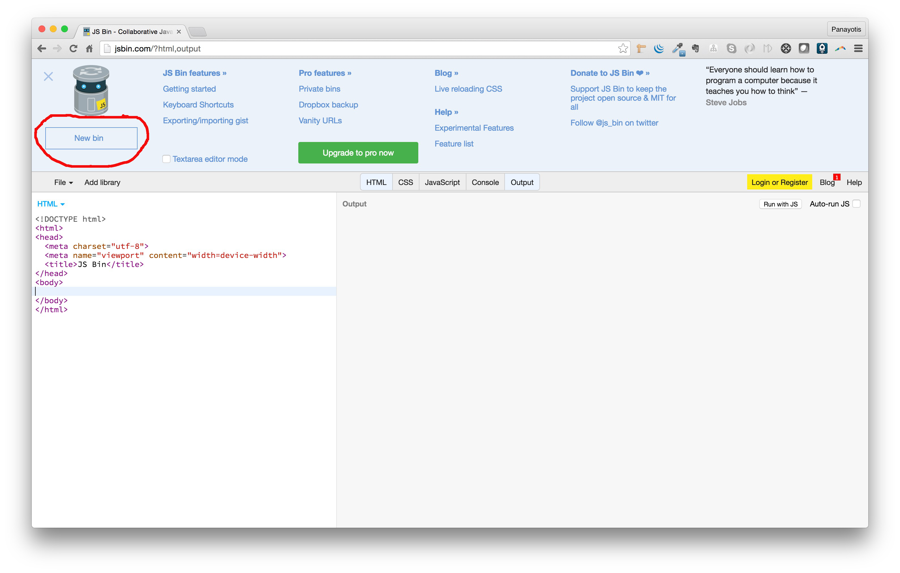

This will make sure that you start from the beginning.

Then switch off HTML and CSS tabs. We will not use them now. Switch on JavaScript tab. This is the tab that we will be using. Also, switch on Console tab. We will need that
in order to see the messages that are printed on the console.

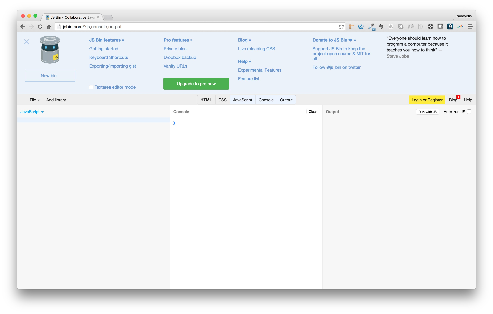

Also, make sure that `Auto-run JS is OFF`. We do not want JS Bin to automatically run the JavaScript commands that we type in the JavaScript tab.

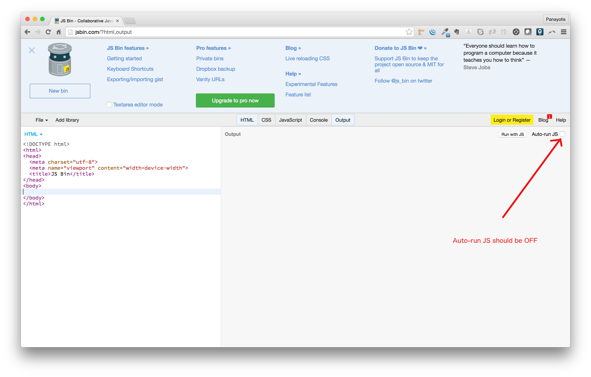

Now, on the JavaScript tab, write the next JavaScript statement:

``` javascript
alert("Hello World");
```

and then click on the button `Run with JS`.

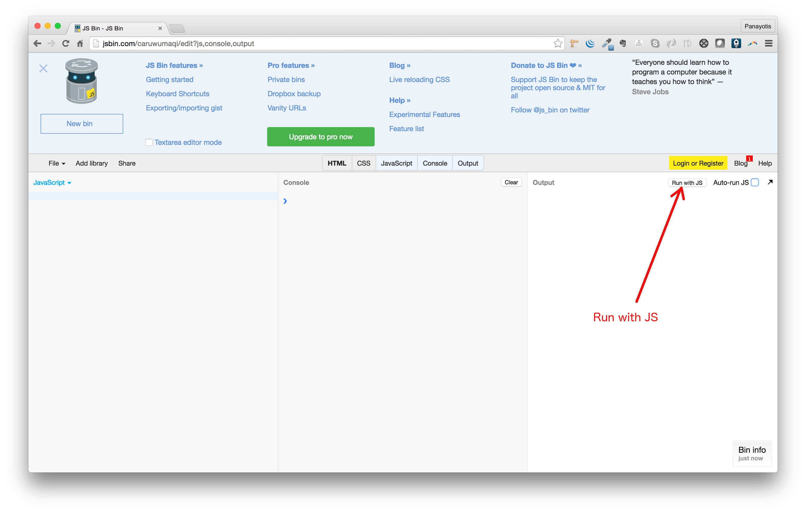

This will trigger the execution of the JavaScript statements inside your JavaScript tab. So, you will see something like this:

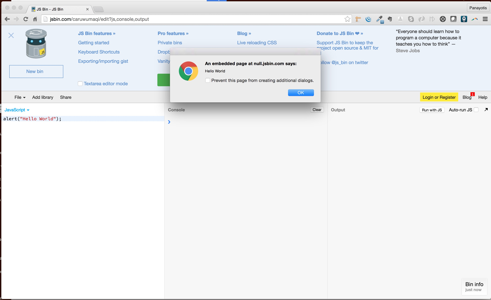

That behaviour is the same like the one we had with the same JavaScript statement on Chrome developer tools.
 
Let's try the other one too. Remove the `alert("Hello World");` statement and write the statement:

``` javascript
console.log("Hello World");
```

Then click the `Run with JS` button. You will see this:

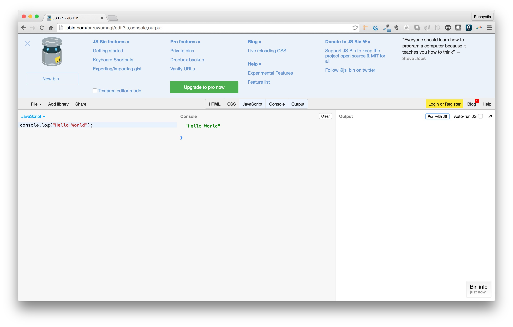

Cool! We have managed to execute both statements in JS Bin, like we did with the Chrome developer tools.

##### `Node.js`

We have managed to implement our "Hello World!" little JavaScript programs in four different ways. Two with Chrome developer tools and two with JS Bin. We will now try to use another 
very popular technology which is called [Node.js](https://nodejs.org). `Node.js` is a JavaScript runtime built on Chrome's V8 JavaScript engine. `Node.js` uses an event-driven, non-blocking I/O model 
that makes it lightweight and efficient. 

Being a `JavaScript runtime engine`, it means that it can take JavaScript code and execute it.

###### Download from [https://nodejs.org/en/download/](https://nodejs.org/en/download/) - Install `Node.js`
 
If you click to download `Node.js` for Mac OS X, you will get a `.pkg` file. Double click that and follow the instructions to install `Node.js`. 

> *Note:* installation will also install the `npm` which is the package manager for `Node.js`. [npm](https://docs.npmjs.com/getting-started/what-is-npm) is used as a program
to organize the `JavaScript` libraries another program is using. 

As soon as you finish the installation, you will see something like that:

``` bash
Node.js was installed at

   /usr/local/bin/node

npm was installed at

   /usr/local/bin/npm

Make sure that /usr/local/bin is in your $PATH.
```

In order to make sure that `/usr/local/bin` is in your path, you can do the following on your terminal:
 
``` bash
echo $PATH
```
 
Make sure that the folder `/usr/local/bin` is one of the folders listed in the output of this command.
 
> *Note:* the `echo $PATH` command will output a long string. This string is a `:` separated list of items
that are folders on your local machine. For example:
```
/opt/local/bin:/opt/local/sbin:/Users/panayotismatsinopoulos/.rvm/gems/ruby-1.9.3-p551/bin:/Users/panayotismatsinopoulos/.rvm/gems/ruby-1.9.3-p551@global/bin:/Users/panayotismatsinopoulos/.rvm/rubies/ruby-1.9.3-p551/bin:/usr/local/bin:/usr/bin:/bin:/usr/sbin:/sbin:/opt/X11/bin:/usr/local/MacGPG2/bin:/Users/panayotismatsinopoulos/.rvm/bin:/Applications/Postgres.app/Contents/Versions/9.4/bin:/usr/local/bin:/usr/local/opt/go/libexec/bin:/usr/local/Cellar/elixir/1.2.3/bin
```
You need to search whether the folder `/usr/local/bin` is one of the items in the list.

If it is not, then you need to edit your `~/.bash_profile` file and add a line like the following:

``` bash
export PATH=$PATH:/usr/local/bin
```
and then close and reopen your terminal.

> *Note:* You can always use `nano` to edit the `~/.bash_profile` file.

###### Hello World

We are ready to use `Node.js` to print our `Hello World!` message. `Node.js`, besides the others, comes with a command line console on its own. 

Open the terminal and give the following command:

``` bash
node
```

You will be presented with the symbol `>` and the cursor blinking next to it. Computer is now waiting for you to give JavaScript commands.

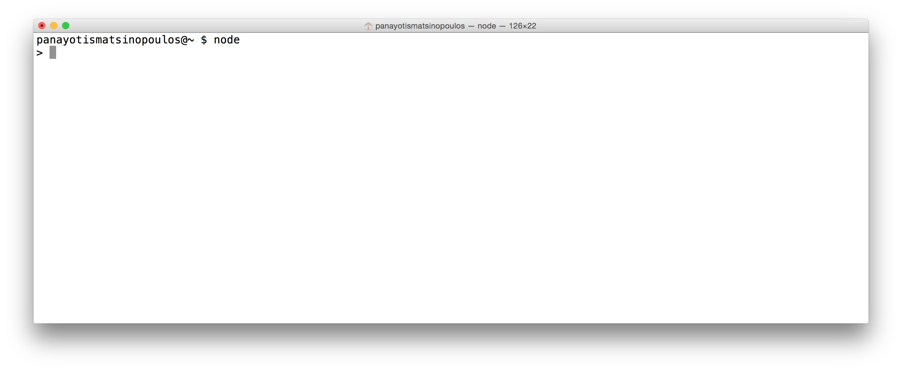

Let's give the following JavaScript command that will print the message "Hello World!". Type the following and press the `Enter` key.

``` javascript
console.log("Hello World!");
```

As soon as you do that, you will see this:


Great! It worked! You asked `Node.js` to print a message for you and it did. 

> *Note:* Don't worry about the `undefined` string that you see below the "Hello World!" phrase. It is something that we will explain later in the JavaScript section.

Now, before you finish, you need to exit the `Node.js` console. In order to do that, you need to issue the following `JavaScript` command:

``` javascript
process.exit();
```

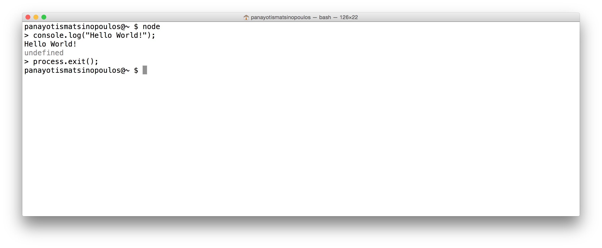

### Closing

Perfect! We have written our first little JavaScript program. A couple of statements actually. In the next chapters, the real programming adventure starts.

