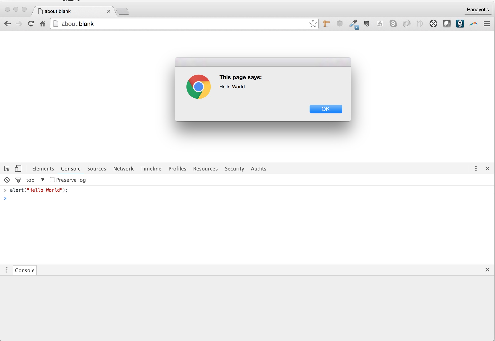
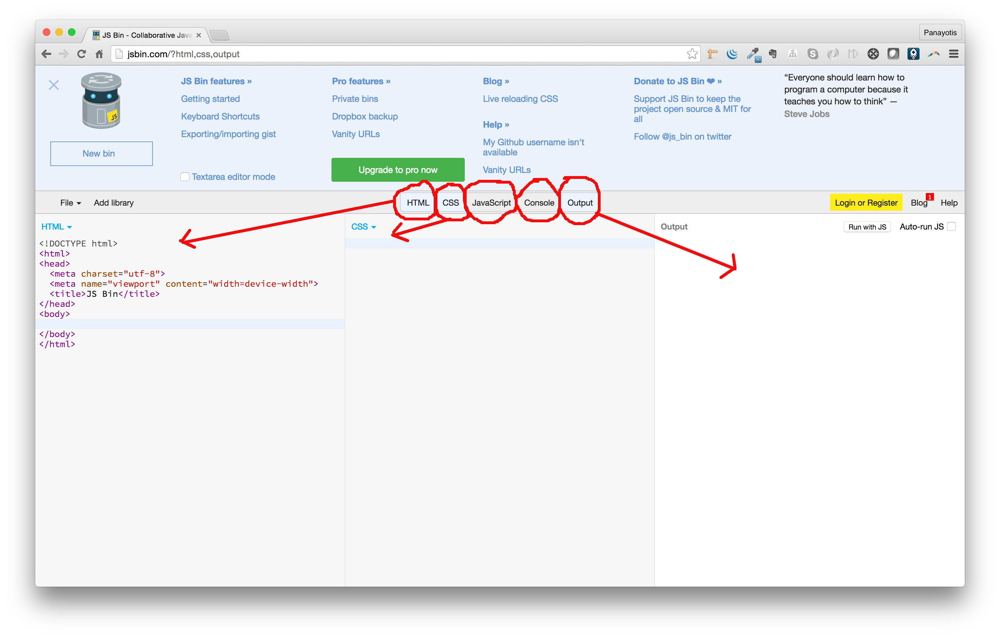
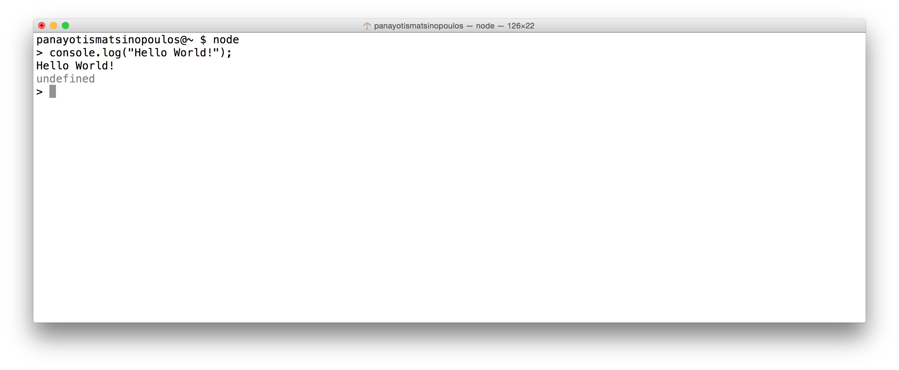

This chapter is your first encounter with JavaScript. JavaScript is the most popular programming language
in the world of browsers and a language that all Full-Stack Web Developers needs to know very well.

In this chapter, you will learn how you can write JavaScript programs inside the Chrome Developer Tools:

Then, you will learn to use JS Bin, which is a fantastic online tool that allows you to write HTML, CSS and JavaScript:

Finally, you will learn how you can install `Node.js` and execute JavaScript statement inside `Node.js` environment.

