Let's start working with data in programs. Data are represented with values taken from a set of
values. This set of values represents the type of the datum. Also, the type defines the kind of
operations that program can carry out with the particular data of that type.
 
### Literals and Variables

We use two methods to tell a program which are our data:
 
1. Literals
2. Variables

The literals, are explicit values like the number `2` or the string `Hello World`. For example,
the following program uses two pieces of data: The number `10` and the string `School`:

``` javascript
console.log(10);
console.log("School");    
```

Literals are very useful but they are not very flexible. By representing, in the program, our value as a literal 
we cannot reuse the same value multiple times. 
 
Variables on the other hand, are named RAM positions. We have already learned that the RAM is a set of positions that
we can store our data in. With variables, we give names to these positions and then we are free to reference that
position by its name (instead of using its decimal address number).

In other words, variables are boxes that we put values inside and a label outside so that we can refer to that box
and distinguish it from another box with other content.

We usually declare variables with the use of the reserved word `var`. For example:

``` javascript
var customer = "Peter";
```

On the example above, we declare a variable by giving its name `customer`. We also put some content inside this
variable, which is a string value `Peter`. 
 
### Assignment Operator

You can declare a variable without actually giving any content to it. Try, for example, the following program on JS Bin

``` javascript
var customer;
console.log(customer);
```
You will get this:

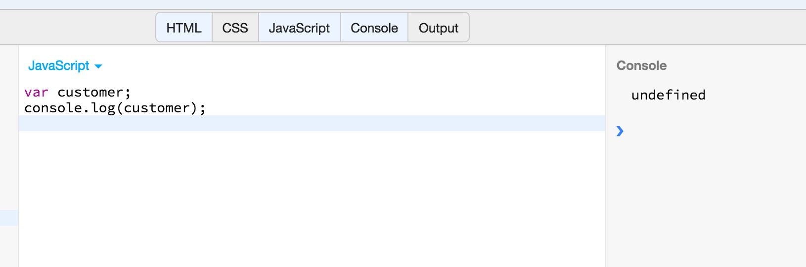

As you can see, the output is `undefined`. This is because the variable does not have actual content;

When you have already defined a variable and you want to assign some content to it, you can do that with the assignment operator: `=`.
Run the following example on JS Bin:

``` javascript
var customer;
customer = "John";
console.log(customer);
```

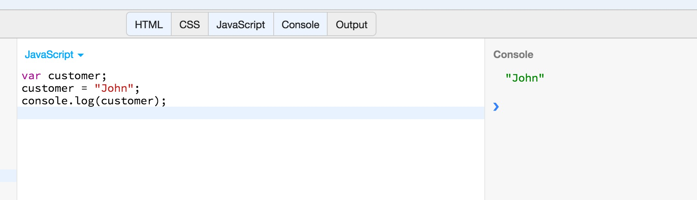

As you can see above, the content of the variable `customer` is no longer undefined. 

But, the assignment operator can be used, not only to give a value to a variable, but also to change its existing value. Try the following program on JS Bin:

``` javascript
var customer;
customer = "John";
console.log(customer);
customer = "Peter";
console.log(customer);
```


As you can see above, we can use the assignment operator to change the value of a variable. This is the reason, also, that variables are 
called like that. Because their content is not fixed.

We have already said that values have a type. The type of a value stored inside a variable determines the type of the variable too.

We continue with studying the various types JavaScript supports.
 
### Numbers

Values in JavaScript can be of type `Number`. JavaScript does not make any distinction between
integers and floating-point numbers. All numbers in JavaScript are floating-point numbers. 
  
#### Integer Literals
  
In JavaScript, an integer is written as a sequence of digits:
  
* `0` is the zero.
* `10` is the number ten.
* `10201` is the number ten thousand two hundred and one.
  
These are all literal integers.

#### Floating-point Literals

Floating-point literals are usually represented by separating the integral part of the number from the fractional part
of the number using a decimal point. 

Here are some examples of valid floating-point literals:

* `3.14`
* `2345.17`
* `.333`. In this case, we omit the integral 0. This is optional. 
* `6.02e23`. This is equal to 6.02 * 10<sup>23</sup>.

#### Arithmetic Operations in JavaScript

In JavaScript, like in many other popular programming languages, you can use the following arithmetic operators to carry
out arithmetic operations:

* `+` for the addition
* `-` for the subtraction
* `/` for the division
* `*` for the multiplication
* `%` for module - a.k.a. the remainder after a division

Let's write a JavaScript program to demonstrate the above. Write the following JavaScript code on JS Bin:

``` javascript
console.log(2 + 2);
console.log(3 - 1);
console.log(10 * 2);
console.log(6 % 2);
console.log(6 % 4);
console.log(6 / 2);
console.log(6.5 * 3);
console.log(6.8 / 2.3);
```
When you run this, you will see the following:


We have used the `console.log()` method to print the result of the output of various arithmetic operations examples. Easy and pretty straightforward.

### Dates and Times

JavaScript uses the object `Date()` to deal with the representation of date and time values. The `Date()` is actually a constructor and you can use
it to create a date or date and time representation.

Here is an example:

``` javascript
new Date(2016, 0, 1);
```
It creates a Date that refers to the 1st day of the 1st month of year 2016. Note that the first month is represented by `0` and not by `1`.

We will learn more about the `Date()` functionality later on in this JavaScript section.

### Text

In JavaScript, text is represented with *String* type values and variables. 

#### Literals

Here is a string literal:

``` javascript
"Hello World!"
```
The string literals are declared using either double quotes (`"`) or single quotes (`'`). When you use double quotes like in the above example,
you can include a single quote as part of the actual value of the string. Look at the following example:

``` javascript
"What's your name?"
```
The opposite goes for single quotes. If you decide to enclose the literal value of a string in single quotes, then you can use a double quote inside
the value itself. Try the following example in JS Bin:

``` javascript
console.log("Hello World! in double quotes");
console.log('Hello World! in single quotes');
console.log("What's your name?");
console.log('Click on the button "Save"');
```

If you run the above JavaScript code in JS Bin, you will get this:

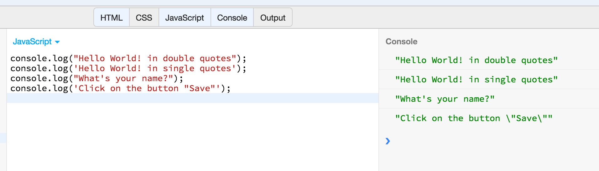

#### Escape Sequences in String Literals

Sometimes, we want to include special characters inside a string literal. One very popular special character is the LINE FEED character. The special characters
are usually represented with a letter of the latin alphabet prefixed with the character backslash `\`. For example, the line feed character is 
represented with the string "\n". The backslash character is necessary to make sure that the "n" is not interpreted as the latin character `n`. Having the
backslash character as a prefix, we tell JavaScript to translate it to the corresponding special character. The special characters are also
called *escape sequences*, and the `\` is called *escape character*.

Let's try the following program on JS Bin:

``` javascript
console.log("This is the world of JavaScript!\nHello JavaScript!");
```
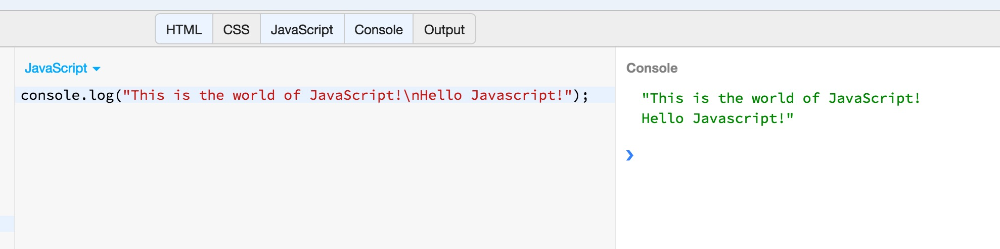

As you can experience, the `\n` escape sequence has split the whole string in 2 parts, separating the second from the first by a new line.

There are some other useful escape sequences:

1. The horizontal tab `\t`.
2. The carriage return `\r`, which is used in the Windows world.
3. The backslash character `\\`, which should be used when we want to literally use the backslash character as is, rather than escape the next one.
4. The double quote inside a string enclosed in double quotes. Example: `"The book title is: \"Of Mice And Men\""`. Useful when you want to always
enclose your string literals in double quotes, but you have a double quote that needs to exist in the value itself.
5. The single quote inside a string enclosed in single quotes. Example: `'The book title is: \'Of Mice And Men\''`. Useful when you want to always
enclose your string literals in single quotes, but you have a single quote that needs to exist in the value itself.  

Try the above in a JS Bin program.

#### Working with Strings

The most basic action one can do with strings is to concatenate them. In order to concatenate two strings, you need to use the `+` operator, like
you do when you want to add two numbers. Try the following on JS Bin:

``` javascript
var firstName = "John";
var lastName  = "Papas";
console.log(firstName + lastName);    
```

If you run the above program, you will get the following:

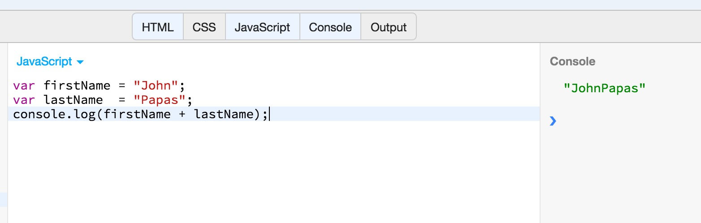

As you can see, the operation `firstName + lastName` results in the concatenation of the two strings. So, maybe, that program could have been even
better if it were:

``` javascript
var firstName = "John";
var lastName  = "Papas";
console.log(firstName + " " + lastName);    
```
In that case, if you ran it on JS Bin, you would get:

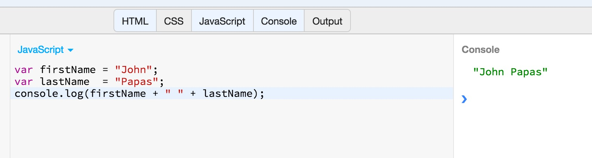

A useful property of the string is the `length` property, which returns, what else?, the length of the string. Try the following program
on JS Bin:

``` javascript
var firstName = "John";
console.log(firstName + " has length: " + firstName.length);
var lastName  = "Papas";
console.log(lastName + " has length: " + lastName.length);
```
If you run that you will see the following:


Pretty easy!

##### String Methods

JavaScript offers a list of string methods that one can invoke on a string and get some useful returned value. Try the following JavaScript program on JS Bin:

``` javascript
var s = "hello, world";

result = s.charAt(0);
console.log(result); // prints "h"

result = s.charAt(s.length-1);
console.log(result); // prints "d"

result = s.substring(1, 4); 
console.log(result); // prints "ell"

result = s.slice(1, 4);
console.log(result); // prints "ell"

result = s.slice(-3);
console.log(result); // prints "rld"

result = s.indexOf("l");
console.log(result); // prints 2

result = s.lastIndexOf("l");
console.log(result); // prints 10

result = s.indexOf("l", 3);
console.log(result); // prints 3

result = s.split(", ");
console.log(result); // prints ["hello", "world"]

result = s.replace("h", "H");
console.log(result); // prints "Hello, world"

result = s.toUpperCase();
console.log(result); // prints "HELLO, WORLD"
```

If you run this program, you will see this:

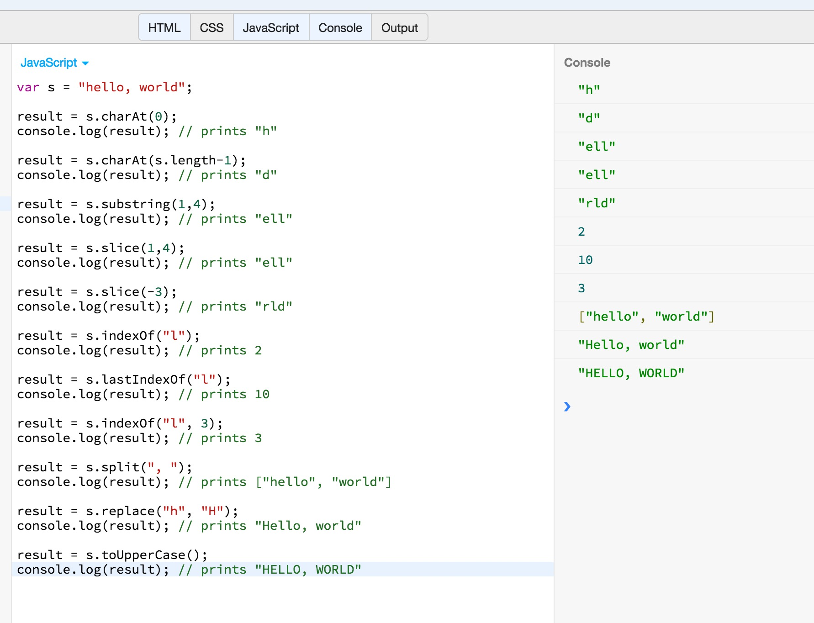

I believe that the majority of the above are self-explanatory, if one also reads the comments next to eash result.

Very briefly:

1. `s.charAt(0)` returns the character at position `0`. Note that string characters are positioned starting from 0, not from 1. Hence a string with 5 characters
has the 1st character at position 0, the 2nd character at position 1, the 3rd at position 2, the 4th at position 3 and the 5th at position 4. 
2. `s.substring(1, 4)` returns the substring starting at position `1` up to but not including position `4`, hence up to and including position `3`.
3. `s.slice(1, 4)` is similar to `substring()`. But if the last argument is missing, goes till the end of the string. Also, if the first argument is negative,
it works from the end character towards the first.
4. `s.indexOf("l")` returns the position of a character `"l"` inside a string. 
5. `s.IndexOf("l", 3)` returns the position of the character `"l"` inside `s`, starting search at position `3`.
6. `s.lastIndexOf("l")` returns the last position of a character `"l"` inside a string.
7. `s.split(", ");` returns an array with the parts of the original string, splitting the original string in parts according to the character sequence `", "`.
8. `s.replace("h", "H")` returns a new string in which the `"h"` have been replaced with `"H"`.
9. `s.toUpperCase()` returns the original string with all characters converted to their uppercase equivalent.

But, as we said, this is not the full list of string methods. Google for `JavaScript string methods reference` to get the full list of string methods offered
by JavaScript.

##### Strings are Immutable

You need to understand that strings are **immutable**. This means that when you call a method on a string, this does not alter the string itself, but
only returns a new value corresponding to the method called. 

In order to understand that, execute the following JavaScript program in JS Bin:

``` javascript
var s = "hello, world";

result = s.toUpperCase();
console.log(result); // prints "HELLO, WORLD"
console.log(s); // prints "hello, world"
```

If you run this program, you will get this:

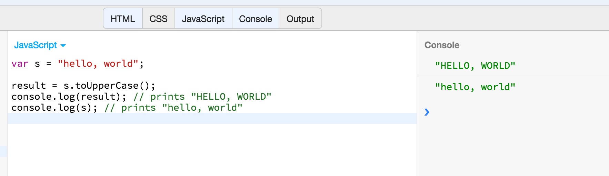

As you can see above, the method call `s.toUpperCase()` didn't alter the `s` string itself. The `s` string still holds the value `hello, world`.
If you wanted to change the value of the string itself, you would have to assign the result to the string itself. Run the following program on JS Bin:

``` javascript
var s = "hello, world";

s = s.toUpperCase();
console.log(s); // prints "HELLO, WORLD"
```
If you run it, you will get this:

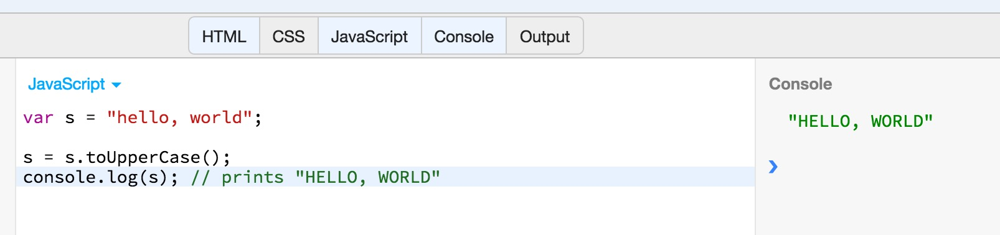

As you can see above, in order to change the value of a string variable, we have to assign the result of the method back to the variable itself.

### Pattern Matching

While working with text, a developer often comes to the situation in which he has to match a string against a text pattern.
For example, assuming that we have the following list of strings:

1. `John`
2. `Mary`
3. `George`
4. `Danny`
5. `Alex`
6. `Paul`

one might want to get the strings that belong to this list and that they have the letter `e` inside. `the letter e inside`, or better put, `includes character e`,
is a text pattern, because it does not only refer to text `e` but also refers to anything that includes `e`, essentially referring to a huge list of texts. 
The strings, of the above list, that match this pattern are strings `George` and `Alex`.

The text patterns are being declared using what we call *regular expressions*. Generally, regular expressions are declared likewise in many programming languages,
with small differences. 

In JavaScript, one can declare a regular expression, by enclosing the text pattern, which needs to follow the regular expression syntax, inside forward slashes `/`. Hence,
the text pattern `includes character e`, is literally defined as `/e/`.

When one assigns a text pattern, a regular expression, to a variable, then that variable becomes a regular expression object (`RegExp` in JavaScript world), that
responds to the method `test`. The method `test` on a regular expression object returns `true` or `false` according to whether its input string matches or does not
match the regular expression.

Let's see an example. Write the following JavaScript program on JS Bin:

``` javascript
var pattern = /e/;
var matches = pattern.test("George");
console.log(matches);

matches = pattern.test("John");
console.log(matches);
```

If you run the above, you will see this:


Which means that the string `"George"` matches the pattern, regular expression, `/e/`, whereas the string `"John"` does not.

> *Note:* The `true` is a boolean literal value. Same goes for `false`. Former represents a TRUE fact, whereas the latter
represents a FALSE fact. We wil talk about boolean values later on in this chapter.

Besides the `test()` method that the regular expression responds to, strings themselves have some methods that can take as input regular expressions.

For example, the `search()` method can take as input a regular expression and return the first position index that matches the text pattern. Write the following program
on JS Bin:

``` javascript
var pattern = /ll/;
var text = "Hello, world!";
var patternPosition = text.search(pattern);
console.log(patternPosition);
```
If you run the above program, you will get this:

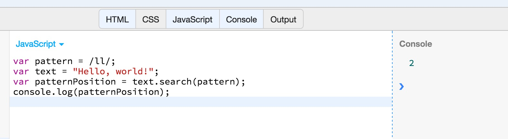

This returns `2` which is the starting position of the pattern `/ll/` inside the string `"Hello, world"`.

Another string function that works, also, with regular expressions is the `match()` method. The `match()` method will return the matching sub-strings of the given string.
Let's write the following program on JS Bin:

``` javascript
var pattern = /[1-9]+/;
var text = "This is 1 a 23 phrase with 32 words and 4423 numbers in between. 3829";
var result = text.match(pattern);
console.log(result);
```
The regular expression `/[1-9]+/` means match any digit in the range 1 up to 9, that appears one or more times consecutively.

If you run the above program, you will get this:

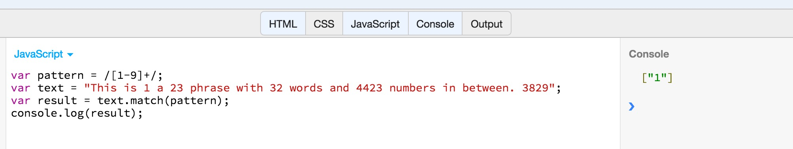

As you can see, the `match()` method returns an array containing all the parts of the string that match the regular expression. The point here is that,
generally, a pattern matching stops at the first match. That's why you only see: `["1"]`. If you want the pattern matching to find all the matches,
then you need to suffix the regular expression literal with the letter `g`, after the closing `/`. Let's see the following program:

``` javascript
var pattern = /[1-9]+/g;
var text = "This is 1 a 23 phrase with 32 words and 4423 numbers in between. 3829";
var result = text.match(pattern);
console.log(result);
```
If you run the above program, you will get this:

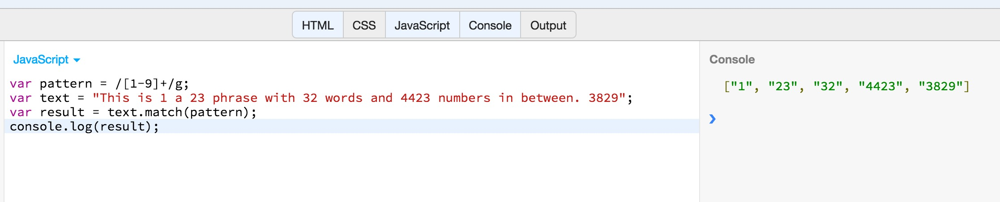

The `g` letter suffix (`g` for global) tells regular expression to work on the entire input string.

Two other popular methods that work with regular expressions are `split()` and `replace()`. The first splits a string into parts and uses as delimiter the regular expression
given as argument. The latter, replaces any text part that matches a regular expression. Let's see an example of `replace()`:

``` javascript
var pattern = /[1-9]+/g;
var text = "This is 1 a 23 phrase with 32 words and 4423 numbers in between. 3829";
var result = text.replace(pattern, "--");
console.log(result);
```

If you run the above program, you will get the following:

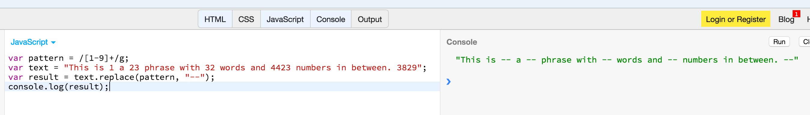

As you can see above, the `replace()` method replaced the numbers with a double dash.

You can use this technique to remove the numbers from the string:

``` javascript
var pattern = /[1-9]+/g;
var text = "This is 1 a 23 phrase with 32 words and 4423 numbers in between. 3829";
var result = text.replace(pattern, "");
console.log(result);
```
Does it work?

We will study regular expressions and how you can define syntactically correct regular expressions in a later chapter.

### Boolean Values

Boolean values represent the truth of falsehood, yes or no, on or off. There are two values that are reserved words and
can be used as boolean literal values: 

1. `true`, which represents the truth.
2. `false`, which represents the falsehood.

Note that besides these two values, all other values can be converted to a boolean value. JavaScript has the following rules:

1. The following values are equivalent to `false`:
    * `undefined`
    * `null`
    * `0`
    * `-0`
    * `NaN`
    * `""` (which is the blank string)
2. All other literal values are equivalent to `true`
3. Also, a variable is equivalent to `false` if its value is equivalent to `false`.
4. And a variable is equivalent to `true` if its value is equivalent to `true`.
     
If you want to check whether a value or variable is `false`, you have to compare it against the `false` value. The comparison operator
is `==` and the result of the comparison is again a boolean value (either `false` or `true`).

> *Note:* We will talk about the comparison operators in a later chapter.

Similarly for the check against `true`. If you want to check whether a value or variable is `true`, you have to compare it against the `true` value.
 
Let's try the following program on JS Bin:
 
``` javascript
var nullValue   = null;
console.log(nullValue == true);
console.log(nullValue == false);

var zeroValue   = 0;
console.log(zeroValue == true);
console.log(zeroValue == false);

var blankString = "";
console.log(blankString == true);
console.log(blankString == false);

var trueValue   = true;
console.log(trueValue == true);
console.log(trueValue == false);

var falseValue  = false;
console.log(falseValue == true);
console.log(falseValue == false);

var aStringValue = "Hello World";
console.log(aStringValue == true);
console.log(aStringValue == false);

var anIntegerValue = 1;
console.log(anIntegerValue == true);
console.log(anIntegerValue == false);
```
If you run this program, you will get the following output:

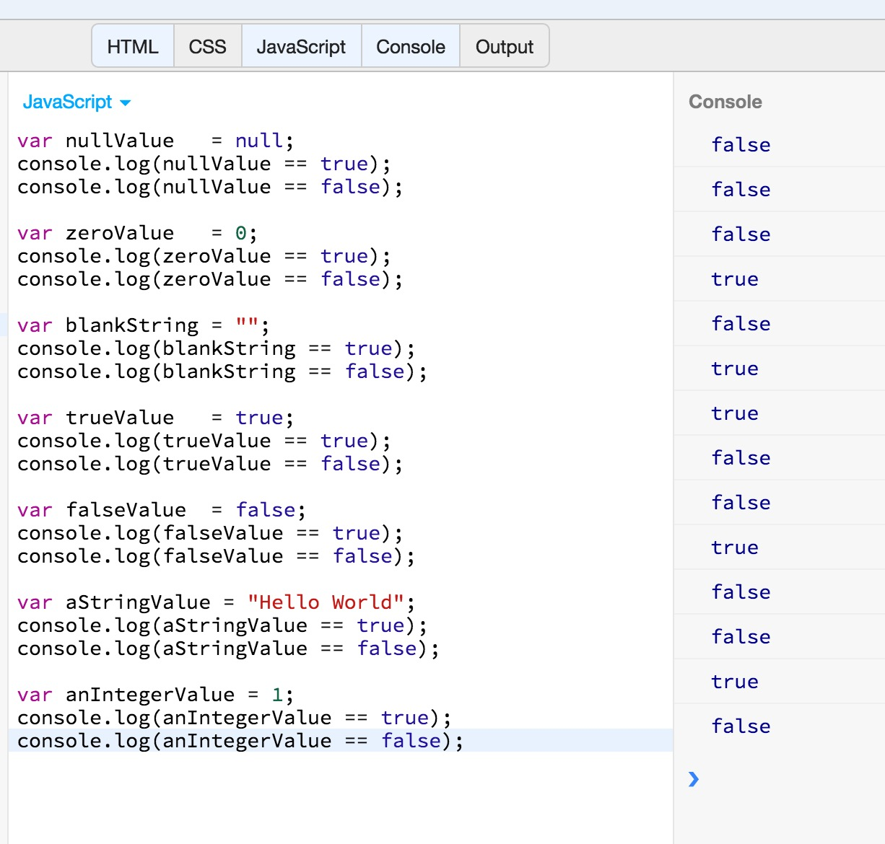

As you can see above, this program shows some examples about our statement on which values are considered `true` and which ones are considered `false`.

Note that all the values and variables that behave like `false`, are called *falsy*, whereas all the values and variables that behave like `true`, are
called `truthy`.

### `null` and `undefined`

The `null` keyword is used to indicate that a variable does not have any value. Same goes for `undefined`. 

If you compare `null` to `undefined` with the comparison operator `==`, then you will get `true`. 
 
However, these two have some subtle differences. For example, the `null` is a keyword, whereas the `undefined` is a global variable with value `undefined`. 
We will learn about those differences later on as we use the language more and more.

Generally, you might consider `undefined` to represent a system-level, unexpected, or error-like absence of value and 
`null` to represent program-level, normal, or expected absence of value. If you need to assign one of these values to a 
variable or property or pass one of these values to a function, `null` is almost always the right choice.
