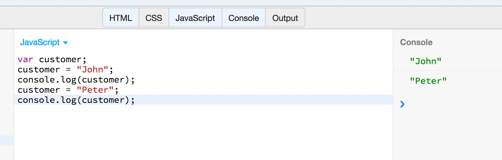
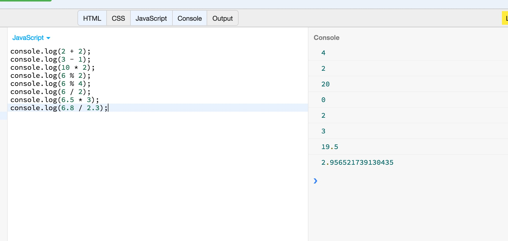
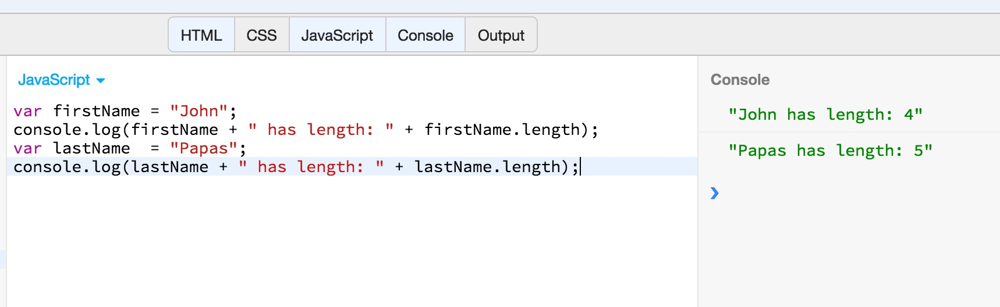
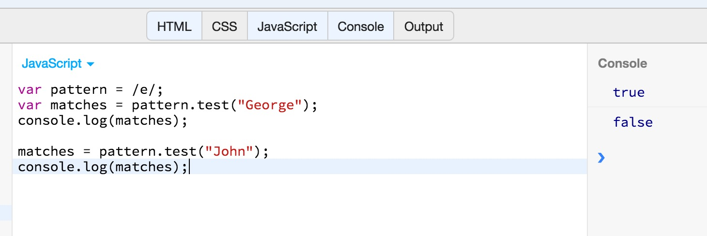

In previous chapters, we have written our *hello world* JavaScript program and we have also learned about the basics
of the JavaScript syntax. In this chapter, we introduce the way we can present our data.

With programs like this:

you start declaring and using variables.
 
And with programs like this:
 

you start using numbers and carry out arithmetic operations.

Besides the numbers, you will learn manipulating strings:

You will also be introduced to regular expressions and pattern matching, one of the most powerful tools in any programming language.

Next, you will start getting acquainted with the boolean values, `true` and `false`.

Finally, you will get a first idea about the `null` and `undefined`.
