An expression is a phrase of JavaScript that a JavaScript interpreter can evaluate to produce a value. 
For example, a constant embedded literally in your program, e.g `"Hello World"`, is a very simple kind of expression. 
A variable name is also a simple expression that evaluates to whatever value has been assigned to that variable.
 
Complex expressions are built from simpler expressions. The most common way to build a complex expression out of simpler expressions 
is with an **operator**. An operator combines the values of its operands (usually two of them) in some way and evaluates to a new value. 

For example, the multiplication operator `*`. The expression 
``` javascript
x * y
```
evaluates to the product of the values of the expressions `x` and `y`. 

For simplicity, we sometimes say that an operator *returns* a value rather than *evaluates to* a value.

Let's see various expressions and operators that JavaScript supports.

## Primary Expressions

The primary expressions are the simplest expressions, the ones that do not include any simpler expression. These
are either constants/literals or certain language reserved words and the variable names/references.

All of the following are examples of primary expressions:

``` javascript
1.23
"hello"
/pattern/
true
false
null
this
customer // where "customer" is a variable name/reference.
```

## Array Initializers

Array initializers are expressions that return a value of an array. An array is a construct that holds a sequence of items.

The following piece of code initializes the variable `customers` to an empty array:

``` javascript
var customers = [];
```

As you can see, the empty array is represented with the square brackets. 

Write the following program on JS Bin:

``` javascript
var customers = [];
console.log(customers);
console.log(customers.length);
```

and then run it. You will get this:

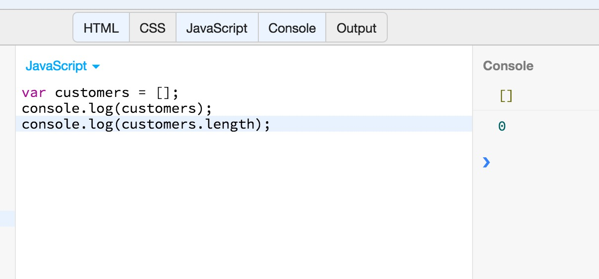

The array objects have the property `length`, like the strings do. And you can see that its value is `0` for arrays initialized with the expression `[]`.

Let's try something more complex:

``` javascript
var customers = ["Peter", "Mary"];
console.log(customers);
console.log(customers.length);
```
If you try this on JS Bin, you will get:

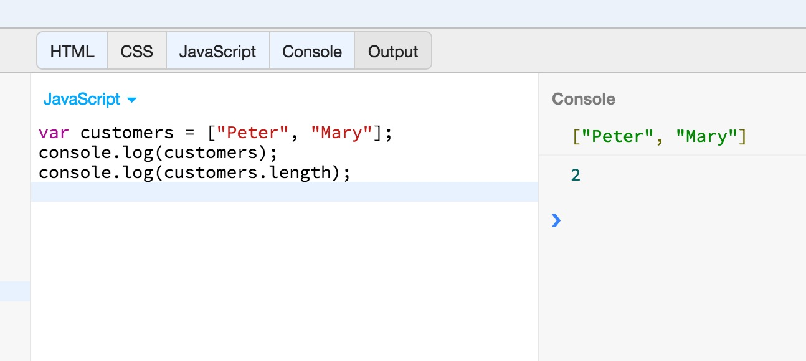

You can even have more complex expressions initializing the items of an Array:

``` javascript
var powersOf2 = [2, 2*2, 2*2*2, 2*2*2*2, 2*2*2*2*2];
console.log(powersOf2);
console.log(powersOf2.length);
```
If you run the above program on JS Bin, you will get this:

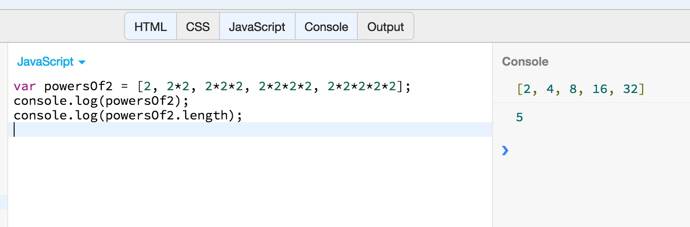

As you can see above, we can initialize the elements of an array, using more complex expressions. On the example above, we initialize the array with the first 5 powers of 2,
using the multiplication operator to build the correct expressions per element.

## Object Initializers

Object initializers are almost similar to array initializers. But we use curly braces instead of square brackets. Also, the Object differs from the array, that it has
properties with values, rather than just values. Let's see an example:

``` javascript
var customer = {name: "Peter", phone: "072667283"};
console.log(customer);
```
If you save the above code and run it on JS Bin, then you will get this:

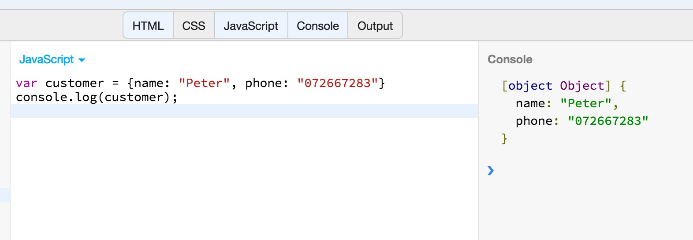

The object that we create on the above example, has two properties, `name` and `phone`. `name` has the value `"Peter"` and `phone` has the value `"072667283"`.

Again, you can initialize an object with no properties at all:

``` javascript
var customer = {};
```

And you can assign properties and values later on, like this:

``` javascript
customer.name = "Peter";
customer.phone = "072667283";
```
Try the following program on JS Bin:

``` javascript
var customer = {};
console.log(customer);

customer.name = "Peter";
customer.phone = "072667283";
console.log(customer);
```
When you run it, you will get this:

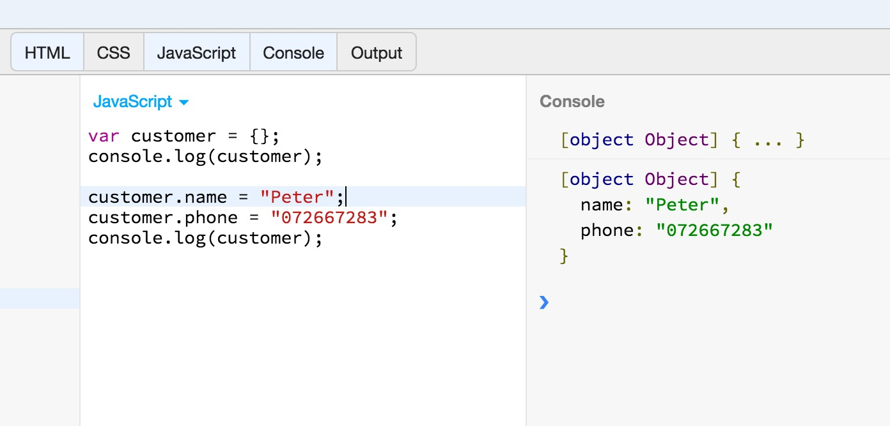

Exactly like for the array, the values that we initialize the properties of an object with, do not have to be primary expressions. They can be complex expressions too.
For example, the following initializes the `customer` object, the property `address` of which is initialized with another object literal.

``` javascript
var customer = {
  name: "Peter",
  phone: "072667283",
  address: {
    street: "Queensway 25-29",
    postCode: "W2 3S",
    city: "London"
  }
};

console.log(customer);
```
If you run the above program, you will get this:

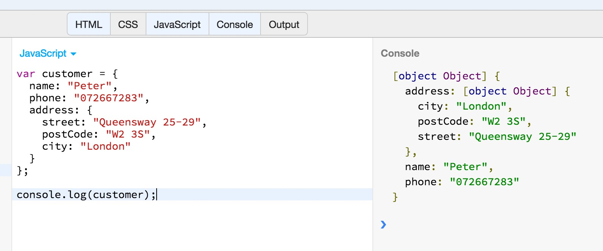

## Function Definition Expressions

We continue with expressions that define the content of a function. A function definition expression typically 
consists of the keyword function followed by a comma-separated list of zero or more identifiers (the parameter names) in parentheses and a block of JavaScript code 
(the function body) in curly braces. For example:

``` javascript
var square = function(x) { return x * x; };
```

defines the function that returns the square of the value given as parameter. Try the following program on JS Bin:

``` javascript
var square = function(x) { return x * x; };
console.log(square);
console.log(square(5));
```
If you run the above program, you will get this:

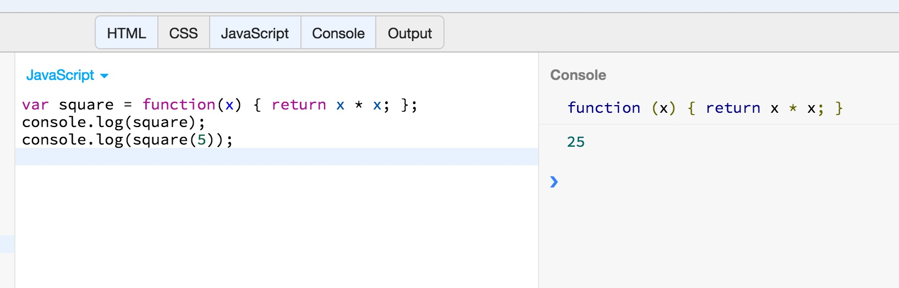

In the above example, we define a function and store its definition to the variable with name `square`. Then we print the definition (2nd line).
On 3rd line, we actually call the function and print its return value.

We will elaborate on functions and how they are defined on a special chapter devoted to this very useful JavaScript tool.

## Operator Overview

Operators are used for JavaScript’s arithmetic expressions, comparison expressions, logical expressions, assignment expressions, and more. The following table
summarizes the operators and serves as a convenient reference:

<table>
    <tr>
        <th>Operator</th><th>Operation</th><th>Number Of Operands</th>
    </tr>
    <tr><td>++</td><td>pre- and post- increment</td><td>1</td></tr>
    <tr><td>--</td><td>pre- and post- decrement</td><td>1</td></tr>
    <tr><td>-</td><td>negate number</td><td>1</td></tr>
    <tr><td>+</td><td>convert to number</td><td>1</td></tr>
    <tr><td>~</td><td>invert bits</td><td>1</td></tr>
    <tr><td>!</td><td>invert boolean value</td><td>1</td></tr>
    <tr><td>delete</td><td>remove a property</td><td>1</td></tr>
    <tr><td>typeof</td><td>determine type of operand</td><td>1</td></tr>
    <tr><td>void</td><td>return undefined value</td><td>1</td></tr>
    <tr><td colspan="3">----------------------------------------------------------------------------------------------------------------</td></tr>
    <tr><td>*, /, %</td><td>multiply, divide, remainder</td><td>2</td></tr>
    <tr><td colspan="3">----------------------------------------------------------------------------------------------------------------</td></tr>
    <tr><td>+, -</td><td>add, subtract</td><td>2</td></tr>
    <tr><td>+</td><td>concatenate strings</td><td>2</td></tr>
    <tr><td colspan="3">----------------------------------------------------------------------------------------------------------------</td></tr>
    <tr><td>&lt;&lt;</td><td>shift left</td><td>2</td></tr>
    <tr><td>&gt;&gt;</td><td>shift right with sign extension</td><td>2</td></tr>
    <tr><td>&gt;&gt;&gt;</td><td>shift right with zero extension</td><td>2</td></tr>
    <tr><td colspan="3">----------------------------------------------------------------------------------------------------------------</td></tr>
    <tr><td>&lt;, &lt;=, &gt;, &gt;=</td><td>compare in numeric or alphabetic order</td><td>2</td></tr>
    <tr><td>instanceof</td><td>checks whether object class matches given argument</td><td>2</td></tr>
    <tr><td>in</td><td>checks whether property exists</td><td>2</td></tr>
    <tr><td colspan="3">----------------------------------------------------------------------------------------------------------------</td></tr>
    <tr><td>==</td><td>test for equality</td><td>2</td></tr>    
    <tr><td>!=</td><td>test for inequality</td><td>2</td></tr>    
    <tr><td>===</td><td>test for strict equality</td><td>2</td></tr>    
    <tr><td>!==</td><td>test for strict inequality</td><td>2</td></tr>    
    <tr><td colspan="3">----------------------------------------------------------------------------------------------------------------</td></tr>
    <tr><td>&amp;</td><td>compute bitwise AND</td><td>2</td></tr>    
    <tr><td colspan="3">----------------------------------------------------------------------------------------------------------------</td></tr>
    <tr><td>^</td><td>compute bitwise XOR</td><td>2</td></tr>    
    <tr><td colspan="3">----------------------------------------------------------------------------------------------------------------</td></tr>
    <tr><td>|</td><td>compute bitwise OR</td><td>2</td></tr>    
    <tr><td colspan="3">----------------------------------------------------------------------------------------------------------------</td></tr>
    <tr><td>&&</td><td>compute logical AND</td><td>2</td></tr>    
    <tr><td colspan="3">----------------------------------------------------------------------------------------------------------------</td></tr>
    <tr><td>||</td><td>compute logical OR</td><td>2</td></tr>    
    <tr><td colspan="3">----------------------------------------------------------------------------------------------------------------</td></tr>
    <tr><td>?:</td><td>choose 2nd or 3rd operand (ternary operator)</td><td>3</td></tr>    
    <tr><td colspan="3">----------------------------------------------------------------------------------------------------------------</td></tr>
    <tr><td>=</td><td>assignment operator</td><td>2</td></tr>    
    <tr><td>*=, /=, %=, +=, -=, <br/> &=, ^=, |=, <br/> &lt;&lt;=, &gt;&gt;=, &gt;&gt;&gt;=</td><td>operate and assign</td><td>2</td></tr>    
    <tr><td colspan="3">----------------------------------------------------------------------------------------------------------------</td></tr>
    <tr><td>,</td><td>discard 1st operand, return 2nd</td><td>2</td></tr>       
</table>

Note that the operators, in the above table, are grouped according to their function. Within each group, there is the concept of precedence. The ones listed first have
higher precedence from the ones listed last. We will explain this with some examples later on.

### Number Of Operands

Operators can be categorized based on the number of operands they expect (their *arity*). 

Most JavaScript operators, like the `*` multiplication operator, 
are *binary operators* that combine two expressions into a single, more complex expression. That is, they expect two operands. 

JavaScript also supports a number of *unary operators*, which convert a single expression into a single, more complex expression. For example, The `−` operator in
the expression `−x` is a unary operator that performs the operation of negation on the operand `x`. 

Finally, JavaScript supports one ternary operator, the conditional operator `?:`, which combines three expressions into a single expression.

### Example Uses of Operators

#### Pre and Post Increment, Pre and Post Decrement

These operators, `++` and `--` are unary operators that operate on a single operand. They increase or decrease the value of the operand. The result
is actually stored back in the operand variable. Hence, they both change the value and they assign the new value back.

Try this program:

``` javascript
var number = 1;
number++;
console.log(number);

number--;
console.log(number);
```
If you run the above program on JS Bin, you will get this:

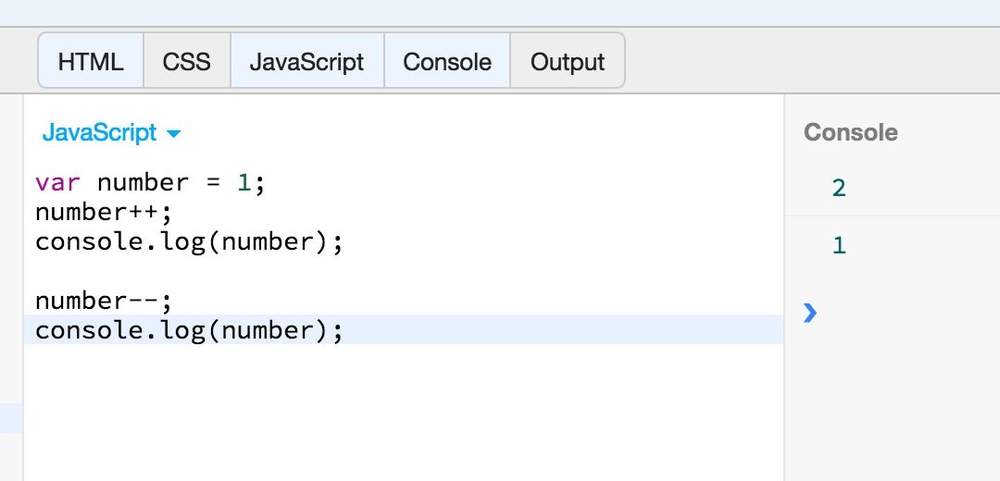

Pretty straightforward. You can see that the `++` increases the value stored in variable `number` by 1. The `--` decreases the value by 1.

There is a gotcha however that has to do with the position you use to apply the increment or decrement operator. If you apply that after the operand (post-), 
then the operand is first used and then incremented (or decremented). If you apply the operator before (pre-) the operand, then the operand is first incremented (or decremented)
and then used. Let's make that clear with the following piece of code:

``` javascript
var n = 1;
console.log(n++); // first used and then incremented (post-increment)
console.log(n);
```
will print `1` and then `2`. Whereas the program:

``` javascript
var n = 1;
console.log(++n); // first incremented and then used (pre-increment)
console.log(n);
```
will print `2` and then `2` again. 

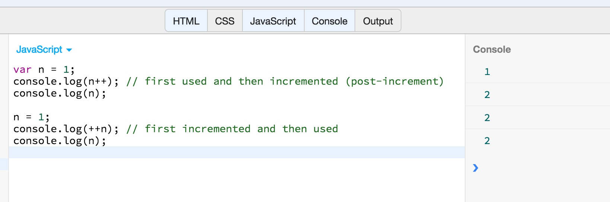

It works the same way for the post-decrement and the pre-decrement cases for operator `--`.

We will learn how other operators are used later on in the following chapters of the JavaScript section.

### Operator Precedence

It is very important to understand the operator precedence, which defines the order in which operators are being evaluated. 

Let's take as an example the following expression:

``` javascript
var result = 5 + 6 * 3 + 2;
```
What do you think is the value of `result`? One might say that it is `35` which is calculated as `5 + 6` which is `11`, then
`11 * 3`, which gives `33` and then plus `2`, which finally gives `35`. This is wrong. In JavaScript, the `*` has higher
precedence than the `+` operator and it's evaluated first. Hence, JavaScript interpreter first evalues the expression `6 * 3`,
which give `18` and then the expression `5 + 18`, which gives `23` and then the expression `23 + 2` which gives `25`.

If you want to change the order in which operators are evaluated in a particular expression, then you need to group the 
expressions in parentheses. For example, if your intention was to first add `5` to `6`, then you should have had that in
parentheses:

``` javascript
var result = (5 + 6) * 3 + 2;
```
So, parentheses, can be used to change the order the operators in an expression are being evaluated.

## Relational Expressions

These expressions use relational operators to test for equality, inequality and other order relations. The operators test whether the operands 
satisfy the relationship or not and return `true` or `false` accordingly.

### Equality and Inequality Operators

There are two equality operators.

1. `==`
2. `===` which is also called strict equality operator or identity operator.

The latter checks whether the two operands are **identical**, whereas the former checks whether its two operands are **equal** in a more relaxed way,
in which conversions of type take place before comparison.

Here is an example. Write the following program on JS Bin:

``` javascript
var a = "1";
var b = 1;

console.log(a == b);
console.log(a === b);
```
and run it. You will get this:

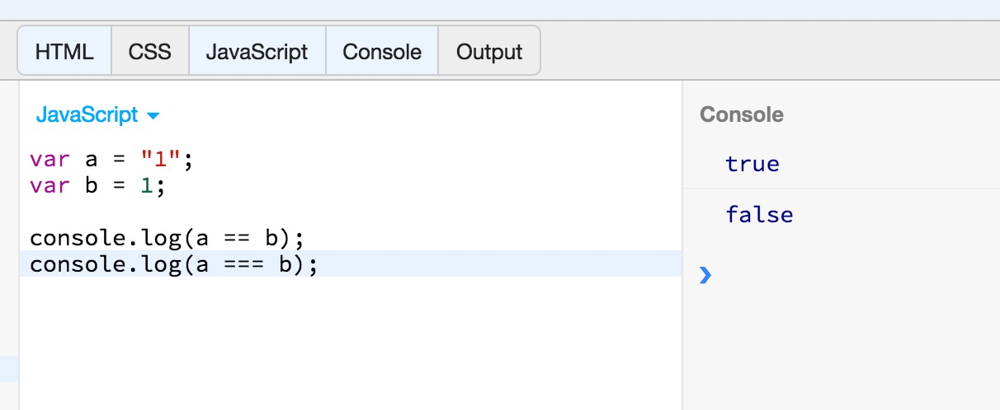

As you can see above, the `==` returns `true` when comparing `"1"` to `1`, whereas, the `===` does not. The former did a type conversion and then compared the two.
The latter didn't do that conversion, hence returned `false` when compared a string to an integer.

To be more specific, the `===` operator evaluates its operands and then does a comparison without any conversion. While comparing, it takes the decision as follows:

* If the two values have different types, they are not equal.
* If both values are `null` or both values are `undefined`, they are equal.
* If both values are the boolean value `true` or both are the boolean value `false`, they are equal.
* If one or both values is `NaN`, they are not equal. The `NaN` value is never equal to any other value, including itself! To check whether a value `x` is `NaN`, use `x !== x`. 
`NaN` is the only value of `x` for which this expression will be `true`.
* If both values are numbers and have the same value, they are equal. If one value is `0` and the other is `-0`, they are also equal.
* If both values are strings and contain exactly the same 16-bit values in the same positions, they are equal. 
If the strings differ in length or content, they are not equal. Two strings may have the same meaning and the same visual appearance, but still be encoded using 
different sequences of 16-bit values. JavaScript performs no Unicode normalization, and a pair of strings like this are not considered equal to the `===` or to the `==` operators. 
* If both values refer to the same object, array, or function, they are equal. If they refer to different objects they are not equal, even if both objects have identical properties.

Obviously, the `==` operator is less strict than the `===` operator:

* If the two values have the same type, test them for strict equality as described above. If they are strictly equal, they are equal. If they are not strictly equal, they are not equal.
* If the two values do not have the same type, the `==` operator may still consider them equal. Use the following rules and type conversions to check for equality:
    * If one value is `null` and the other is `undefined`, they are equal.
    * If one value is a number and the other is a string, convert the string to a number and try the comparison again, using the converted value.
    * If either value is `true`, convert it to `1` and try the comparison again. If either value is `false`, convert it to `0` and try the comparison again.
    * If one value is an object and the other is a number or string, convert the object to a primitive and try the comparison again. An object is converted to a primitive value 
    by either its `toString()` method or its `valueOf()` method. The built-in classes of core JavaScript attempt `valueOf()` conversion before `toString()` conversion, 
    except for the `Date` class, which performs `toString()` conversion. Objects that are not part of core JavaScript may convert themselves to primitive values in an 
    implementation-defined way.
    * Any other combinations of values are not equal.

See another example:

``` javascript
var a = "1";
var b = true;

console.log(a == b);
console.log(a === b);
```
If you run this, you will see that the non-strict equality operator considers equal the `"1"` and the `true`. Whereas the strict equality does not.

You need to be careful which equality operator you are using. Our suggestion is that you use strict equality and only if your program needs to be more relaxed to 
use, at that particular points, the non-strict equality operator.

Note that we also have the `!=` and `!==` operators that test for inequality. Otherwise, they have the same logic and strictness like the `==` and `===` operators.

### The Other Comparison Operators

The other comparison operators test the relative order (numerical or alphabetic) of their two operands.

1. Less than `<`
2. Less than or Equal `<=`
3. Greater than `>`
4. Greater than or Equal `>=`

Let's try an example. Write the following code in JS Bin:

``` javascript
var a = 5;
var b = 8;
console.log(a > b);

var firstCustomer = "John Woo";
var secondCustomer = "Abraham Foo";
console.log(firstCustomer < secondCustomer);
```
If you run the above program you will get this:

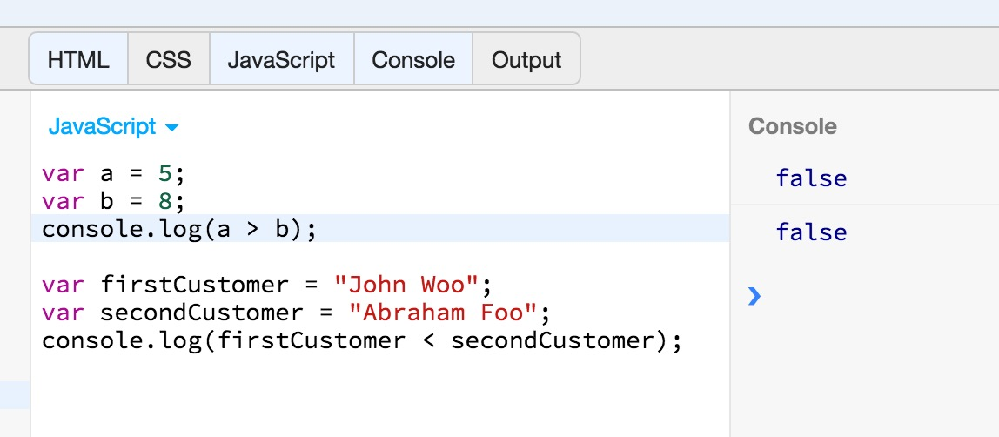

> *Note:* that the uppercase letters are considered less than the lower case letters.

### The `in` Operator

The `in` operator expects a left-side operand that is or can be converted to a string. It expects a right-side operand that is an object. It evaluates to `true`
if the left-side value is the name of a property of the right-side object.

Write the following example on JS Bin:

``` javascript
var customer = {firstName: "Peter", lastName: "Woo"};
console.log("firstName" in customer);
console.log("lastName" in customer);
console.log("address" in customer);
```
If you run the above program, you will get this:

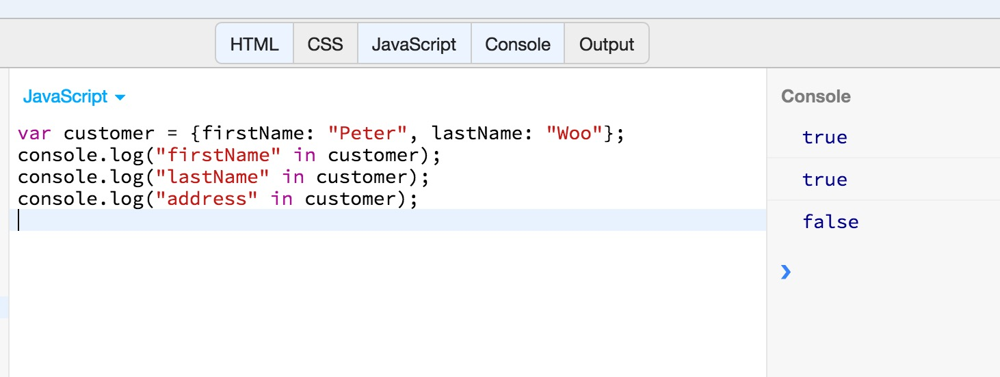

As you can see, the first two comparisons return `true`, because both `"firstName"` and `"lastName"` are properties of the object `customer`. The last one returns false,
because `address` is not property of the object `customer`.

## Logical Expressions

The logical operators `&&`, `||`, and `!` perform Boolean algebra and are often used in conjunction with the relational operators to combine two relational expressions into 
one more complex expression.

* The logical `AND` operator is represented with `&&` in JavaScript. It returns `true` if both operands are truthy.
* The logical `OR` operator is represented with `||` in JavaScript. It returns `true` if either of the operands is truthy.
* The logical `NOT` operator is represented with `!` in JavaScript. It is an unary operator, and returns `true` if its operand is falsy.

Try the following program:

``` javascript
var a = true;
var b = false;
console.log(a && b);
console.log(a || b);
console.log(!a);
console.log(!b);
```
If you run this program on JS Bin, you will get this:

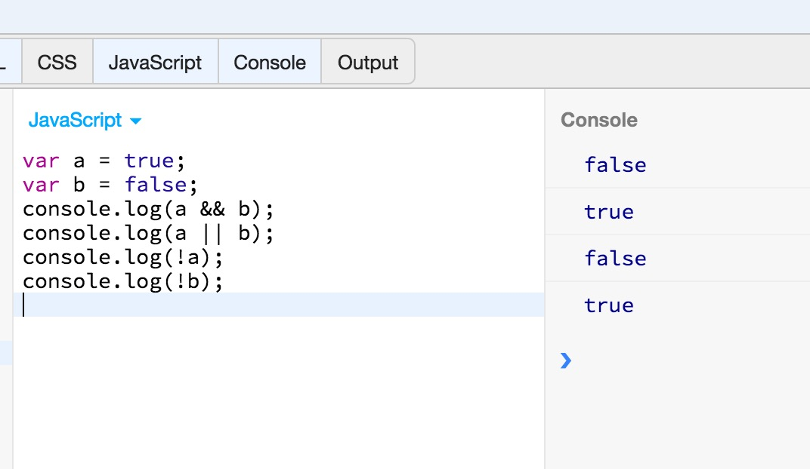

Note that `&&` has higher precedence that the `||` operator. This means that
 
``` javascript
console.log(true || false && false || false);
```
will print `true`, because it first evaluates the `false && false`, which returns `false` and then evaluates `true || false` which returns `true`, and, finally,
it evaluates `true || false`, which returns `true`. We can change the order of evaluation using parentheses. For example, if we want the order to be the order
the expressions are written, then we have to do this:
``` javascript
console.log((true || false) && false || false);
```
In that case, the result printed will be `false`. Try that on JS Bin, and you will see this:

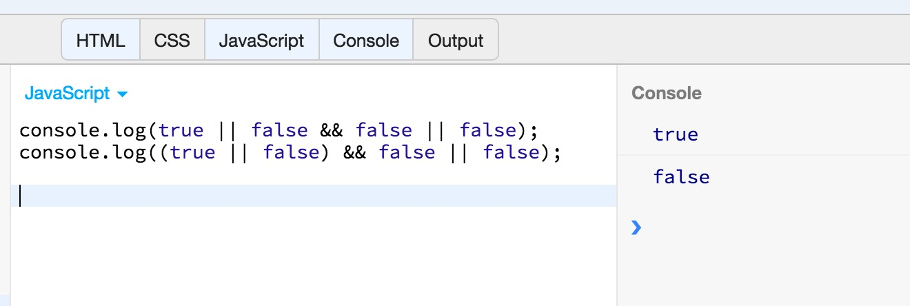

## Assignment With Operation

Besides the normal `=` assignment operator, JavaScript supports a number of other assignment operators that provide shortcuts by combining assignment with some other operation. 
For example, the `+=` operator performs addition and assignment. Try the following example:

``` javascript
var a = 1;
var b = 5;
b += a;

console.log(b);
```
If you run the above on JS Bin, you will see that it prints `6`. This is because the statement `b += a` first adds `a` to `b` and then assigns the new value to `b`. Hence,
the statement `b += a` is equivalent to `b = b + a`. It is considered a shortcut.

Refer to the table with all the operators to read about the rest of the assignment-with-operation operators.


