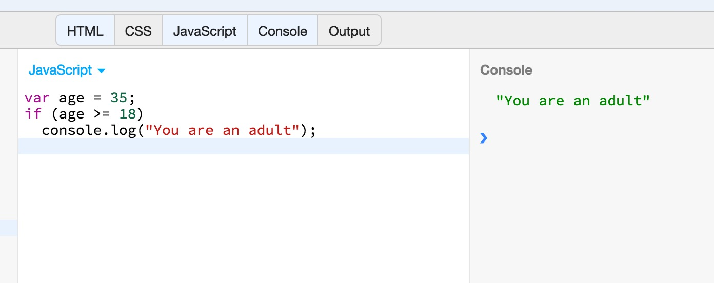
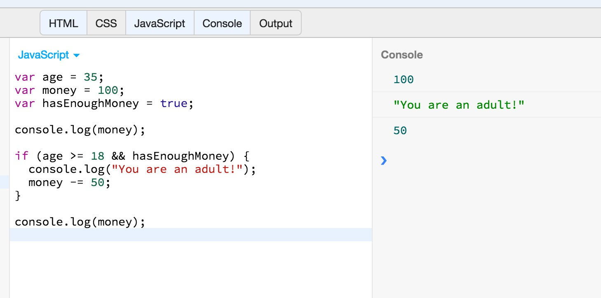
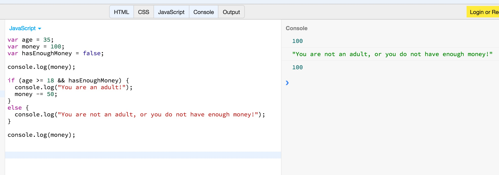
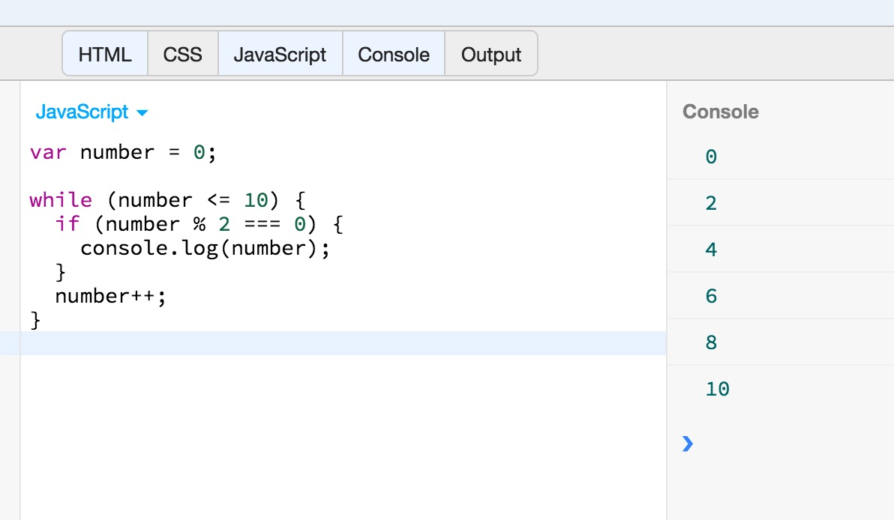
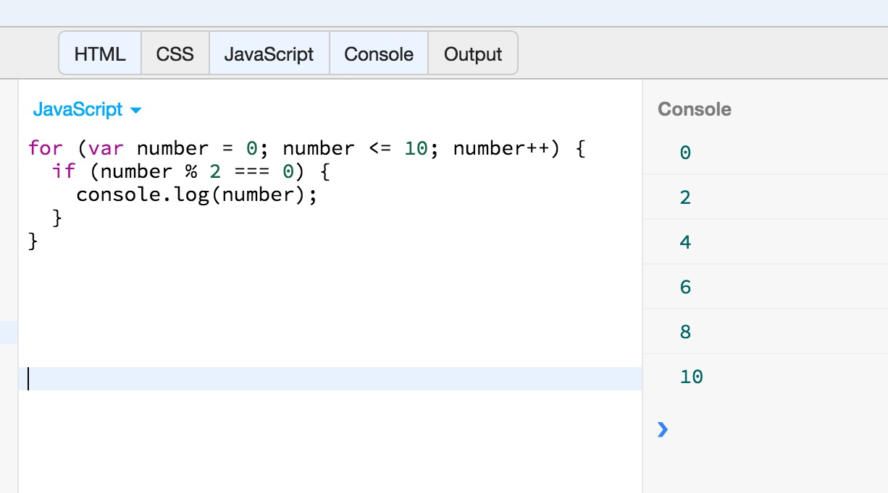
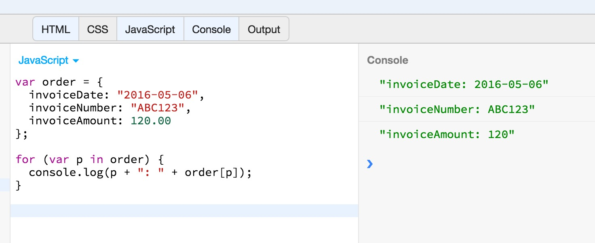

This chapter is going to introduce you to JavaScript statements. Whereas the previous chapter talked about expressions,
this chapter is going to teach you about how you can use expressions to build full-fledged JavaScript statements.

A JavaScript program is simply a sequence of statements, separated from one another with semicolons `;`. So once you are 
familiar with the statements of JavaScript, you can begin writing real JavaScript programs.

Let's start.

## Expression Statements

The simplest kind of statements in JavaScript are expressions that have side effects. Assignment statements are one major category of expression statements. For example:

``` javascript
greeting = "Hello " + name; 
i *= 3;
```
In the above example you can see 2 statements. First statement, `greeting = "Hello " + name;` concatenates 2 strings and assigns the result to the variable `greeting`.
Second statement, multiplies `i` by `3` and saves the result back to `i` itself. 

As you can see, each statement is terminated with a semicolon;

## Compound Statements

You can combine a series of statements into a compound statement using a *statement block*. A statement block is created by enclosing the
statements into curly braces. This is an example of a statement block, which forms a compound statement:

``` javascript
{
    customer = "Peter";
    order = {invoiceDate: '2016-05-16', invoiceNumber: 'ABC123'};
}
```

Note that statement blocks do not end with semicolon. 

You can use a compound statement whenever JavaScript expects to find a statement. We will see more concrete examples of this, later in this chapter.

## Declaration Statements

### The `var` statement

The `var` statement is used to declare variables. One or more. 

The `var` keyword is followed by a comma-separated list of variables to declare. Each variable in the list may optionally have an 
initializer expression that specifies its initial value.
 
Here are some examples of variable declarations:
 
``` javascript
var i;                                // declares a variable without initializing it
var j = 0;                            // declares a variable and initializes it to have the value 0
var p, q;                             // declares two variables. They are separated with a comma. They are not initialized.
var greeting = "Hello" + name;        // declares a variable and uses an expression to initialize it.
var a = 1, b = 2, c = 102, d, e = 30; // declares multiple variables, some of which are initialized too.

```

### `function`

The `function` keyword is used to define functions. We have already seen that:

``` javascript
var square = function(x) { return x * x ; };
```

The above is an expression (`function(x) { return x * x ; }`) assigned to a variable.

However, the `function` keyword may be used to declare a function like this:

``` javascript
function square(x) { return x * x; }
```
As you can see, the `function` declaration has a function name. In this example `square`. Note also that the 
function declaration like that, is not terminated with a semi-colon.

> *Note:* We will delve into functions in a later chapter.

## Conditionals

Conditional statements execute or skip other statements depending on the value of a specified expression. These statements 
are the decision points of your code, and they are also sometimes known as "branches."
 
### `if`

The very basic statement that can be used for branching is the `if` statement. Let's see an example:
 
``` javascript
var age = 35;
if (age >= 18)
  console.log("You are an adult");
```
If you run the above example on JS Bin, you will get this:
  

  
As you can imagine, the JavaScript interpreter, evaluated the condition `age >= 18` and found it to be true (because `age` had the value `35`).
Condition being true, JavaScript interpreter executed the statement that is associated to the `if` block, and printed the message `You are an adult`.
  
The general syntax of the if statement is:
  
``` javascript
if (condition expression)
   statement;
```
Note that, the parentheses that enclose the condition expression are mandatory. The `if` statement is terminated with a semicolon.
   
However, you may want to execute more than 1 statement, should the condition is true. In that case, you create a compound block of statements,
using curly braces. Look at the following example:

``` javascript
var age = 35;
var money = 100;
var hasEnoughMoney = true;

console.log(money);

if (age >= 18 && hasEnoughMoney) {
  console.log("You are an adult!");
  money -= 50;
}

console.log(money);
```   
Run the above in JS Bin. You will get this:



The above example uses a more complex expression for condition, and, should the condition be true, it executes two statements. One that prints a message
on the console and another one that decreases the value of the variable `money`. Note that the compound block of statements is not terminated by
a semicolon.

### `else`

There are times that we want to tell JavaScript interpreter to execute a statement when the condition is true and another statement when the condition is false.

For example, we can always do:

``` javascript
if (age >= 18) {
  console.log("You are an adult!");
}
if (age < 18) {
  console.log("You are not an adult!");
}
```

But this is not efficient. Because we are asking JavaScript interpreter to evaluate two conditions that are mutually exclusive. Instead, you can use the keyword `else`,
which extends the functionality of `if`. To cover for the previous example:

``` javascript
if (age >= 18) {
  console.log("You are an adult!");
}
else {
  console.log("You are not an adult!");
}
```
I guess this is pretty simple and straightforward. Let's see a more complex example:

``` javascript
var age = 35;
var money = 100;
var hasEnoughMoney = false;

console.log(money);

if (age >= 18 && hasEnoughMoney) {
  console.log("You are an adult!");
  money -= 50;
}
else {
  console.log("You are not an adult, or you do not have enough money!");
}

console.log(money);
```
Run the above program on JS Bin. You will get this:



The JavaScript interpreter executes the statement inside the `else` block, because the condition is not true (`hasEnoughMoney` is `false`).

Note that inside the block statements, either in the `if` part or in the `else` part, you can have, almost, any kind of valid JavaScript statement.

### `else if`

Let's take it a little bit further. There are cases in which we want to check more than one condition in order to do what we want to do. Let's see the following example:

``` javascript
var today = "Friday";

if (today === "Monday" || today === "Tuesday") {
  console.log("I will be working from the office");
}
else if (today === "Wednesday" || today == "Thursday" ) {
  console.log("I will be working from home");
}
else if (today === "Friday") {
  console.log("I will be working from the office, but half the day");
}
else {
  console.log("I will not be working on weekends");
}
```
If you run this on JS Bin, you will get this:


The `else if` keywords are used to add extra branching to our logic. The condition on the `else if` will be evaluated only if the previous condition, on previous `if` or `else if` 
is not true.

### `switch`

When the `if-else if` conditional is testing the value of the same variable, like in the previous example in which we test the value of the variable `today`, we might
want to use another version of conditional statement, which is called `switch`.

Let's explain that by writing the previous example using a `switch` statement.

``` javascript
var today = "Friday";

switch (today) {
  case "Monday":
  case "Tuesday":
    console.log("I will be working from the office");
    break;
  case "Wednesday":
  case "Thursday":
    console.log("I will be working from home");
    break;
  case "Friday":
    console.log("I will be working from the office, but half the day");
    break;
  default:
    console.log("I will not be working on weekends");
    break;
}
```

The `switch` statement above, starts with an expression that is enclosed inside parentheses. The expression here is `today` and when evaluated it returns `"Friday"`, 
since this is the value of the variable `today`. Then, `switch` is broken into different blocks. Each block starts with one or more `case` expressions.
The `case` expression is evaluated and it is compared against the `switch` expression. The comparison is done using strict equality `===` operator. So, no conversion
takes place. If the comparison returns `true`, then the block of statements that corresponds to the matching `case` is being executed. All the statements of the
block are executed until the `break` statement which terminates the `switch` execution. On this particular example, since the condition on `switch` evaluates to
`"Friday"`, it is the 5th `case` expression that matches. So, it is its block of statements that are executed. 

If no `case` expression matches the `switch` expression, then all the statements inside the `default` block are executed. However, the `default` block is not
mandatory.

Note that both the `switch` expression and the `case` expressions can be any JavaScript expression that returns a result. They do not have to be simple expressions only.
Also, the `break` statement is necessary to avoid executing statements that belong to the next `case` blocks (`case` blocks that follow the one that matched the
`switch` expression) or to the `default` block. To understand what we mean, remove the `break` statement from the 5th matching `case` and run the program again.
What happens?

## Loops

There are cases in which we want to execute a statement, or a series of statements, multiple times. For example, when we want to 
carry out an action on the elements of an Array. There are special JavaScript statements that allow us to do that.

JavaScript offers the following looping constructs:

1. `while`
2. `do/while`
3. `for`
4. `for/in`

### `while`

The `while` is used to carry out a set of instructions while a condition holds `true`. This is its basic syntax:

``` javascript
while (condition)
  statement;
```
or for many statements:
  
``` javascript
while (condition) {
  statement 1;
  statement 2;
}  
```

The condition that goes with `while` is called a `repeat condition` because it specifies under which conditions the
loop will be repeated.

Let's see the following example:

``` javascript
var number = 0;

while (number <= 10) {
  if (number % 2 === 0) {
    console.log(number);
  }
  number++;
}
```
Write the previous example on JS Bin and run it. You will get this:



The above loop is being executed while the `number` variable is less than or equal to 10. It goes from one number to the next (see: `number++`) and checks, on each repeatition,
whether the number is an even number. If it is, it prints it on the console.

With `while` loop, it is very important to make sure that the loop terminates at some point after some repeatitions (or it never starts at all), in order to avoid infinite loops.
This means that you need to make sure that the repeat condition becomes false, sooner or later. In other words, if we were to remove the line that increases the
variable `number` on the previous example, then `number` would have always been less than `10`, turning this `while` loop into an infinite loop that would never end:

``` javascript
// If you run this on JS Bin, it will never end. JS Bin will force it to quit. Also, it wouldn't test other number than 0.
var number = 0;

while (number <= 10) {
  if (number % 2 === 0) {
    console.log(number);
  }
}
```

By the way, when JavaScript interpreter reaches the line of code on which a `while` statement is defined, and its repeat condition is already `false`, then
it will never execute any of the statements inside the loop.

### `do/while`

The `do/while` loop is like a `while` loop, except that the `loop` condition is tested at the bottom of the loop rather than at the top. 
This means that the body of the loop is always executed at least once. And this is the difference to `while`. If you want your loop to be
executed at least once, then use the `do/while` loop.

Let's write the previous example with a `do/while` block:

``` javascript
var number = 0;

do {
  if (number % 2 === 0) {
    console.log(number);
  }
  number++;
} while (number <= 10);
```
If you run the above program on JS Bin, you will get exactly the same output:
  
)
### `for`

The `for` statement is another very convenient way, and actually more widely used, to write loops in JavaScript.
Its syntax allows to combine the initialization of the variable that counts the loops, the repeat condition and the
update of the condition variable, all at the start of the `for` statement.

Let's write the previous example with the `for` loop version:

``` javascript
for (var number = 0; number <= 10; number++) {
  if (number % 2 === 0) {
    console.log(number);
  }  
}
```
If you run the above on JS Bin, you will get this:



which is exactly the same like we had with the `while` or `do/while` version.

As you can see from the `for` example syntax above, inside the parentheses, we have 3 parts separated using semicolon `;`.

1. The initialization part. On our example it is `var number = 0;`. In the initialization part we can do anything that we want, but we usually
do things that will make the next part, the repeat condition, to be `true`, so that the loop starts and executes at least for once.
2. The repeat condition part. On our example, the repeat condition is `number <= 10;`. The repeat condition is tested exactly before entering the 
loop statements. Like in the `while` case. Hence, if this condition is initially `false`, then `for` loop will never be executed.
3. The update part. This is executed at the end of each execution repeatition. Usually, we update the variable that the condition evaluates, so that
at some point in the future, the condition becomes `false` and the loop terminates. Hence, we avoid infinite loops.
 
One way you could look at the `for` loop, is if you wrote it like that:
 
``` javascript
var number = 0;
for (; number <= 10;) {
  if (number % 2 === 0 ) {
    console.log(number);
  }
  number++;
}
```
  
The above version of `for` loop is similar to the `while` loop and they do exactly the same. But we never write `for` loops like that.
  
### `for/in`
  
The `for/in` construct is used to loop through the properties of an object. Let's see that with an example:
  
``` javascript
var order = {
  invoiceDate: "2016-05-06",
  invoiceNumber: "ABC123",
  invoiceAmount: 120.00
};

for (var p in order) {
  console.log(p + ": " + order[p]);
}
```

If you run this on JS Bin, you will get the following:

  
  
As you can see, on each iteration, the `p` variable holds the name of a property from object `order`. On first iteration, it holds
the value `"invoiceDate"`, on second iteration it holds the value `"invoiceNumber"` and on third iteration it holds the value `"invoiceAmount"`.
 
Note also that calling `order[p]` allows us to get the *value* of the corresponding object property.

## Jump statements
 
### `break` statement

The `break` statement is usually used to prematurely end a loop. Let's see an example:

``` javascript
var number = 0;

while (number <= 1000) {
  if (number % 2 === 0) {
    console.log(number);
  }
  if (number === 10) {
    break;
  }
  number++;
}
```

The above JavaScript code prints all the even numbers from 0 up to 10. It may have a repeat condition that implies that the
loop is executed up to 1000, but this is not the case, due to the `break` statement inside `while` loop. You can see that the
`break` statement is executed if the number that has been processed is equal to 10. This means, in other words, that when the
number reaches 10, loop will be terminated.

### `continue` statement

The `continue` statement is used to ask the loop to move to the next iteration. Let's see the following example.

``` javascript
for (var number = 0; number <= 100; number++) {
  if (number < 90) {
    continue;
  }
  if (number % 2 === 0) {
    console.log(number);
  }
}  
```
What do you think that this program does? It prints all the even numbers starting from 90 and ending to 100. This is 
because the first numbers from 0 up to 89 are skipped, due to the `if (number < 90) { continue; }` statement.
While the number is less than 90, the `continue` statement is executed, which terminates the iteration and goes to
third part of the `for` loop, which is the update part, before going back inside the loop, as long as the repeat
condition is `true` of course.

Hence, `continue` is useful when you want to skip processing specific items, while processing a set of items using a loop.
