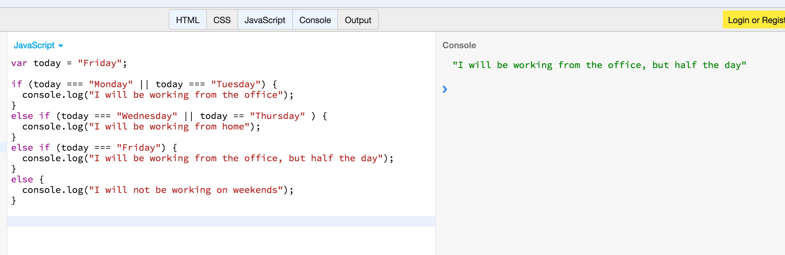
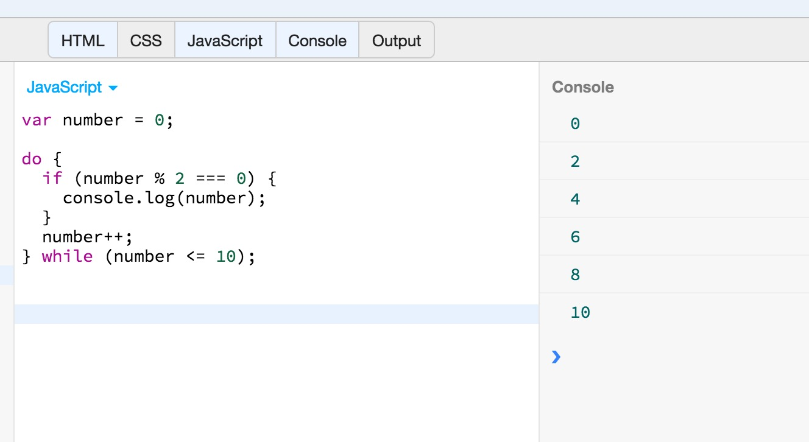

This chapter is going to introduce you to JavaScript statements. Whereas the previous chapter talked about expressions,
this chapter is going to teach you about how you can use expressions to build full-fledged JavaScript statements.

A JavaScript program is simply a sequence of statements, separated from one another with semicolons `;`. So once you are 
familiar with the statements of JavaScript, you can begin writing real JavaScript programs.

You will learn about the compound statements like this:

``` javascript
{
    customer = "Peter";
    order = {invoiceDate: '2016-05-16', invoiceNumber: 'ABC123'};
}
```

You are going to learn about conditional statements that help us build branch logic into our programs.



And you are going to learn about loop constructs that help us execute the same block of statements multiple times.



Finally, you will learn how you can prematurely end a repetition or jump to the next iteration.
