An object is an unordered collection of properties, each of which has a name and a value attribute. Property names are strings, 
so we can say that objects map strings to values. This string-to-value mapping goes by various names: 

* hash
* hashtable
* dictionary
* associative array
 
Any value in JavaScript that is not a string, a number, `true`, `false`, `null`, or `undefined` is an object. And even though strings, 
numbers, and booleans are not objects, they behave like immutable objects.
 
## Creating Objects

Objects can be created with the following methods:

* with object literals
* with the `new` keyword
* with the `Object.create()` function

### Object Literals

The easiest way to create an object is to include an object literal in your JavaScript code. An object literal is a comma-separated list of colon-separated 
name:value pairs, enclosed within curly braces. A property name is a JavaScript identifier or a string literal (the empty string is allowed). 
A property value is any JavaScript expression. The value of the expression (it may be a primitive value or an object value) becomes the value 
of the property. Here are some examples:

``` javascript
var emptyObject = {}; // This is an object without any properties
var point = {x: 0, y: 0}; // Object with two properties
var point2 = {x: point.x, y: point.y + 1}; // Object with two properties with values calculated from other object
var book = {
    title: "Of Mice And Men",
    author: {
      firstname: "John",
      surname: "Steinbeck"
    }
};
```

### `new`

The `new` operator creates and initializes a new JavaScript object. It should be followed by a function invocation.
In that case, the function is called a constructor, and serves to initialize a newly created object. 

Here is an example JavaScript code that demonstrates the function constructors:
 
``` javascript
function Order(invDate, invNumber) {
  this.invoicedate = invDate;
  this.invoiceNumber = invNumber;
}

var order = new Order("2015-05-16", "ABC2341");

console.log(order);
```

If you run the above on JS Bin, you will see this:

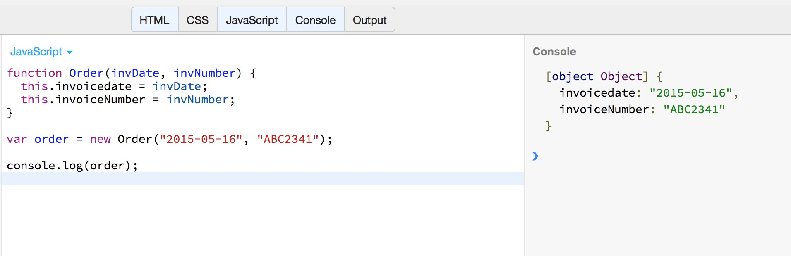

As you can read above, the function `Order` creates an object using an object literal which bases the values of its properties on the values given as arguments when calling
the constructor.

You will learn more about functions in later chapters.

Let's now create two instances of the `Order` type:

``` javascript
function Order(invDate, invNumber) {
  this.invoicedate = invDate;
  this.invoiceNumber = invNumber;
}

var order1 = new Order("2017-05-16", "ABC2341");
var order2 = new Order("2017-08-13", "DEF2409");

console.log(order1);
console.log(order2);
```

If you run the above in JSBin, you will see this:

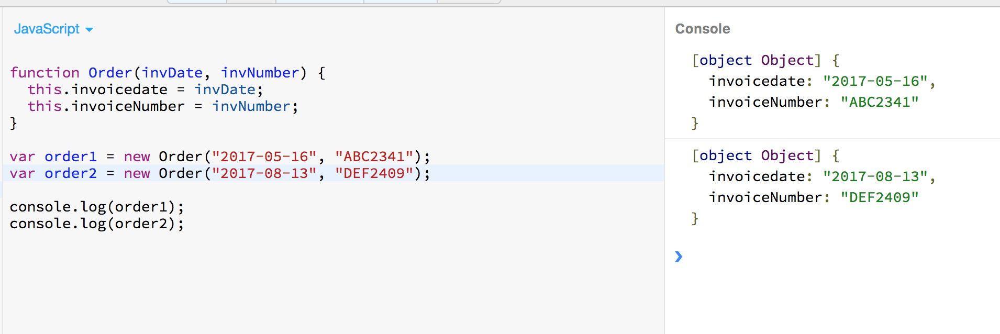

Let's now also attach a behaviour to the object:

``` javascript 
function Order(invDate, invNumber) {
  this.invoiceDate = invDate;
  this.invoiceNumber = invNumber;
  this.generateInvoice = function() {
    console.log("I will generate invoice. Date: " + 
                this.invoiceDate + 
                ", invoiceNumber: " + 
                this.invoiceNumber);
  }
}

var order1 = new Order("2017-05-16", "ABC2341");
var order2 = new Order("2017-08-13", "DEF2409");

console.log(order1);
console.log(order2);

order1.generateInvoice();
order2.generateInvoice();
```

If you run the above in JSBin, you will get this:

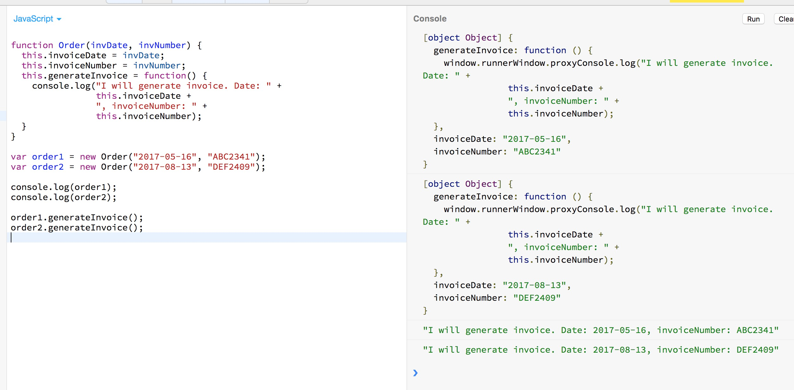

The problem with this method of creating objects, is that each instance has its own copy of the definition of the object, which is not ideal. It may
be useful in some cases, but generally, is not very useful and consumes more memory. 

### Prototypes

Before we can cover the third method of creating objects, we need to talk a little bit about Prototypes.
Every JavaScript object has a second object (or `null`, but this is rare) associated with it. The second object
is known as a *prototype*. The prototype gives its properties to the actual object, or in other words, the object
inherits properties from its prototype.

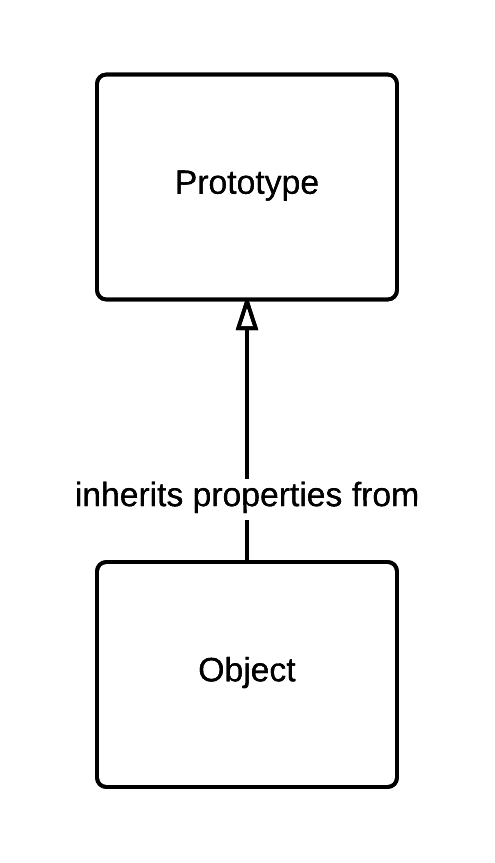

All objects created by object literals have the same prototype object, and we can refer to this prototype object in JavaScript code as `Object.prototype`.

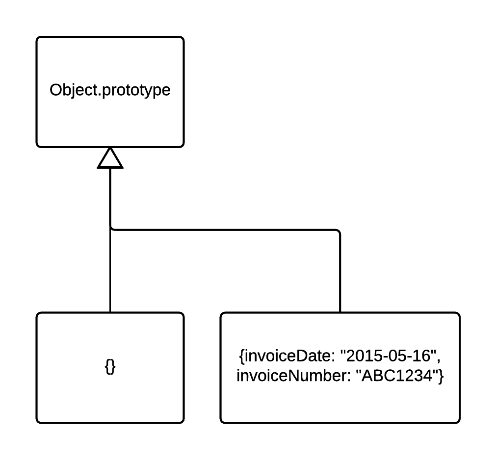

Objects created using the `new` keyword and a constructor invocation use the value of the `prototype` property of the constructor function
as their prototype. So the object created by `new Object()` inherits from `Object.prototype` just as the object created by `{}` does.
Similarly, the object created by `new Array()` uses `Array.prototype` as its prototype, and the object created by `new Date()` uses `Date.prototype`
as its prototype.

The `prototype` property of the constructor function is usually `Object.prototype`. Hence, `new Date()` inherits properties from `Date.prototype` which inherits
properties from `Object.prototype`.


### Creating objects with Object.create()

`Object.create()` creates a new object, using its first argument as the prototype of that object. `Object.create()` also takes an optional second argument
that describes the properties of the new object.

The following creates an object with two properties:

``` javascript
var point = Object.create({x: 0, y: 0});
console.log(point);
```
If you run the above on JS Bin you will see a properly object created:

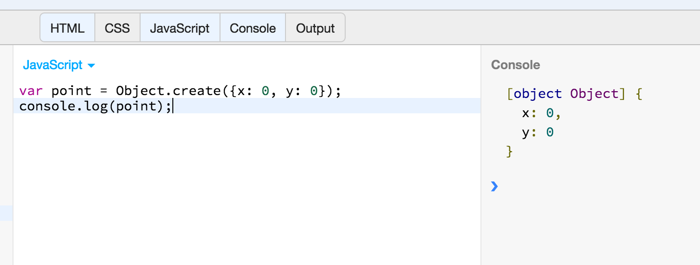

The `{x: 0, y: 0}` is now considered the prototype of the object `point`.

If you want to create an empty object using `Object.create()` you need to give as first argument the `Object.prototype`, the one that is the prototype of objects created with
`{}`.

``` javascript
var x = Object.create(Object.prototype);
console.log(x);
```

If you just call `Object.create()` without giving any prototype, you create an object that does not have the basic properties of an object. For example, it does not respond
to `toString()`. Generally, it is not very useful to do that.

## Querying and Setting Properties

To obtain the value of a property, use the dot `.` or square bracket `[]`. The left-hand side should be an expression whose value is an object.
If using the dot operator, the right-hand must be a simple identifier that names the property. If using square brackets, the value within the brackets
must be an expression that evaluates to a string that contains the desired property name.

Write the following program on JS Bin:

``` javascript
var order = {
  invoiceDate: "2015-05-16",
  invoiceNumber: "ABD38292"
};

console.log(order.invoiceDate);
console.log(order.invoiceNumber);
console.log(order["invoiceDate"]);
console.log(order["invoiceNumber"]);
```

You will see this:

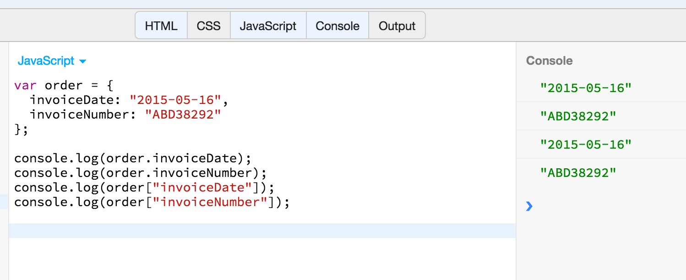

Note that when accessing the value of a property of an object using the square brackets operator `[]`, we are basically accessing the object as if it were a `hash` or
a `hashtable` or a `dictionary` or a `map`. These are commonly used names for accessing a bucket elements using a key. Another name is `associative array`, because the
`[]` is also used to access array elements by their position/index in the array.

Accessing object properties with expressions that return a string, which is the name of the property, is very flexible and can be proven very handy on dynamic
programming. String keys to access object properties are dynamic whereas dot notation uses identifiers that are static. 

With JavaScript you can dynamically add a new property to an object. You only have to assign a new value to it. Let's add the property `customerName` on `order` object:

``` javascript
var order = {
  invoiceDate: "2015-05-16",
  invoiceNumber: "ABD38292"
};

console.log(order.invoiceDate);
console.log(order.invoiceNumber);
console.log(order["invoiceDate"]);
console.log(order["invoiceNumber"]);

order.customerName = "Peter Pan";
console.log(order);
```

We have added two more lines to the previous program. If you run that on JS Bin, you will get this:

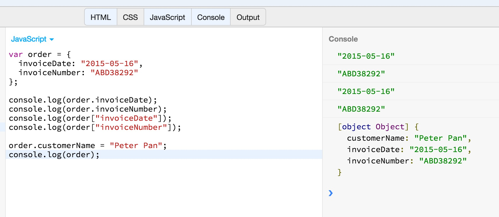

Of course, using the assignment operator, you can always update the value of an existing property.

## Inheritance

We will now talk a little bit about inheritance, i.e. how some properties of an object are inherited from its prototype. Note that there is a difference with regards to
inheritance behaviour when we are querying a property vs when we are setting a property. We will examine this difference here with some examples.

An object has a set of own properties. But, besides the "own" properties, an object inherits properties from its *prototype* object. Let's try to explain that using
some examples:

``` javascript
var o = {};
```

Object `o` does not have any own property. Let's create a property `x` on this object.

``` javascript
var o = {};
o.x = 1;
```

Now , object `o` has one property on its own. Let's create another object that inherits from `o`.

``` javascript
var o = {};
o.x = 1;
var p = Object.create(o);
console.log(p);
```

If you run the above, you will see that object `p` has the property `x` with value `1`. This is because it inherits it
from object `o`.

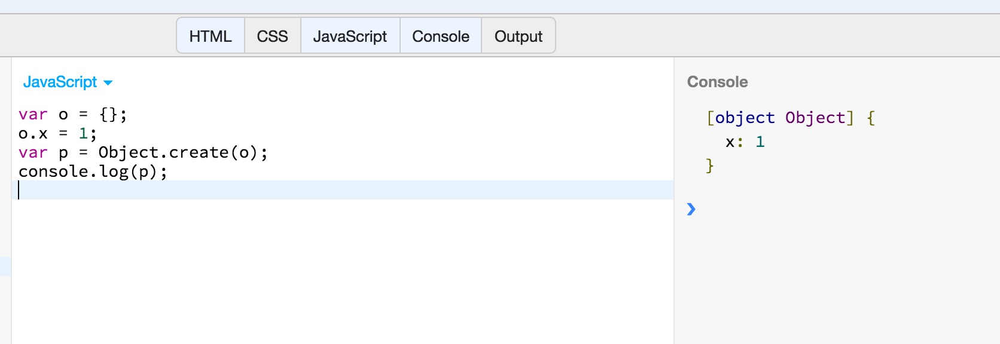

Now, let's set a property on `p` object. And create another object that inherits from `p`. What would that object have as properties? 

``` javascript
var o = {};
o.x = 1;
var p = Object.create(o);
console.log(p);

p.y = 2; 
var q = Object.create(p);
console.log(q);
```

If you run the above on JS Bin, you will see this:

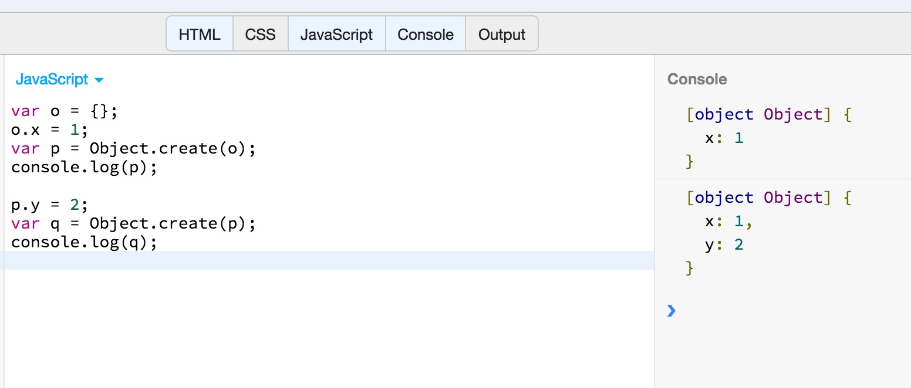

As you can see, the property `x` and the property `y` have been inherited to the object `q`. This is an example of cascading inheritance.

Object `q`, besides the properties that it has inherited from objects `p` and `o`, it has properties from `Object.prototype`. Look at this:
 
``` javascript
var o = {};
o.x = 1;
var p = Object.create(o);
console.log(p);

p.y = 2; 
var q = Object.create(p);
console.log(q);

console.log(q.toString());
```

The last statement, invokes the property `toString()` which has been inherited from `Object.prototype`. This is what it prints at the end:

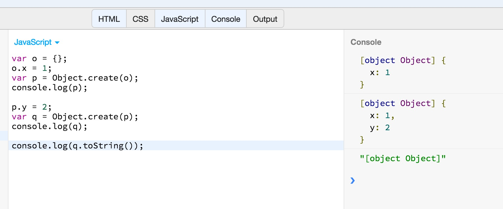

Now, let's set a new value on property `y` on object `q`. Remember, that `q` does now own `y`. It is inherited from `p` object. Will that assignment affect the `y` 
property of `p` object?

``` javascript
var o = {};
o.x = 1;
var p = Object.create(o);
console.log(p);

p.y = 2; 
var q = Object.create(p);
console.log(q);

console.log(q.toString());

q.y = 3;
console.log("p object:");
console.log(p);

console.log("q object:");
console.log(q);
```

If you run the above program on JS Bin, you will see this:

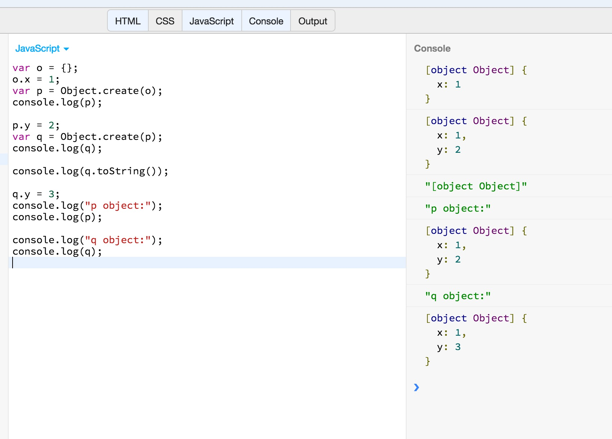

As you can see, setting the property `y` on `q` object does not affect the `y` property on the `p` object. Actually, a new own property for `q` is created that hides the
inherited `y` coming from `p`.

## Methods

Object properties, may have values which are function definitions. In that case, the functions are called methods. Let's see an example:

``` javascript
var dog = {
  breed: "Beagle",
  bark: function() {
    console.log("WavWavWav");
  }
};

console.log(dog);
dog.bark();
```

On the above program, we define the object `dog` and we set two properties. One simple property, named `breed`, with the value `"Beagle"`, and another property,
named `bark` with the value `function() { console.log("WavWavWav"); }` being a function definition. Then we first display the whole object and then
we call the method `bark()` on the object `dog`. The last statement is what we call the behaviour of the object.

Run the above program on JS Bin and you will see this:


Methods usually access the object properties. Let's try another example:

``` javascript
var polynomial = {
  a: 10,
  b: 20,
  result: function() {
    return (this.a * this.a + 2 * this.a + this.b);
  }
};

console.log(polynomial.result());
```

Ths is an object with 3 properties. Its property `result` is a method that calculates the formula <code>a<sup>2</sup> + 2\*a + b</code>. In order for the method to have
access to the properties of the object, we use the keyword `this`.

## Closing Note

That was a very basic introduction to JavaScript objects. Objects in JavaScript have a lot of more powers than the ones presented here. However, our
intention was to give you the foundation so that you can proceed with the rest of the course on front-end Web development. If you really want to master
object oriented programming with JavaScript, you might want to take a JavaScript dedicated course. By the way, you are going to learn lots of
new stuff on object oriented programming while we will be teaching you the `Ruby` language, later on in this course.
