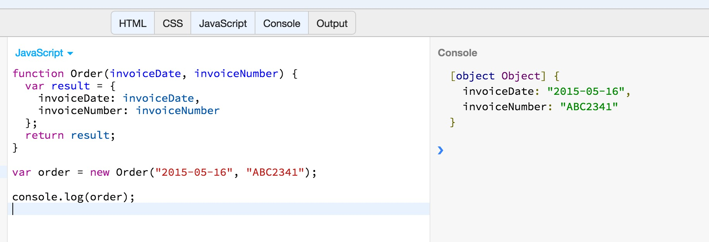
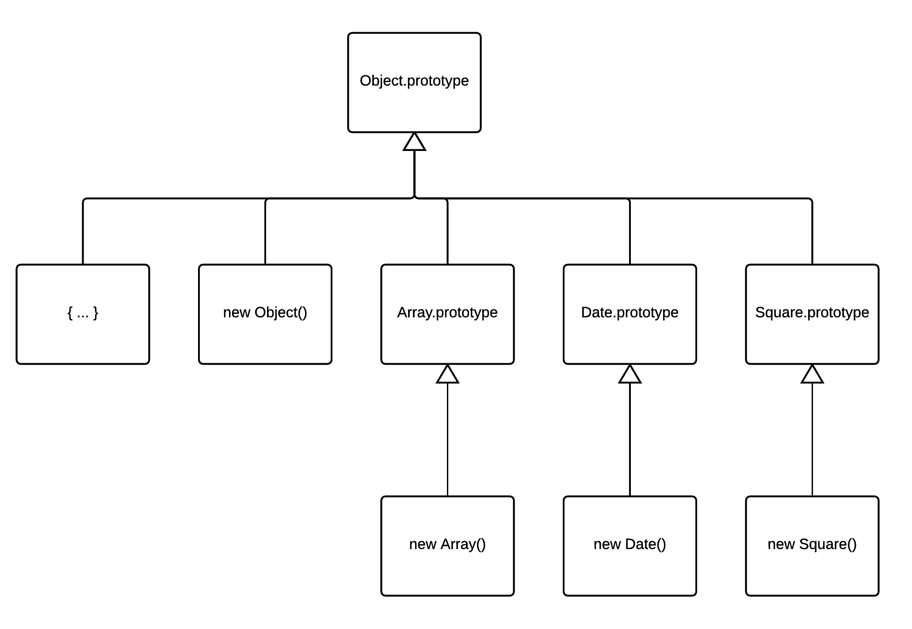
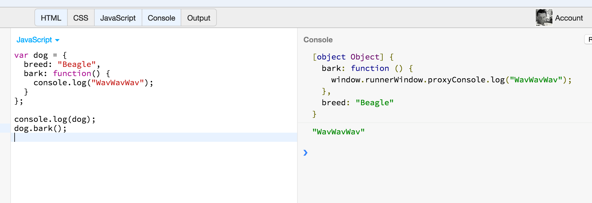

This is going to be a first encounter with objects in JavaScript. You will learn the basics of objects,
how we can create them and how we can reference their properties.

There are many ways you can create an object in JavaScript, and this is only an example:

It is very crucial for you to understand the object inheritance rules:

and how you can create methods and attach them to objects, in order to provide them with behaviour.

