Arrays are one of the most useful structures in any programming language. They are ordered collection of items. In JavaScript, the items
can be of any type. This means that the array can contain either integers, or strings or objects, or functions or any other type. Also, the
items of an array do not have to be of the same type. This makes JavaScript arrays very powerful.

## Creating Arrays

The easiest method to create an array is with array literals. An array literal is a comma separated list of values that will be the items of
the array. This list of values is given enclosed in square brackets.

Let's try some array creation with array literals:

```
var emptyArray = [];
console.log(emptyArray);

var arrayOfIntegers = [3, 2, 5];
console.log(arrayOfIntegers);

var arrayOfStringsAndIntegers = ["Hello", 5, 2, "World"];
console.log(arrayOfStringsAndIntegers);

var arrayOfVariousTypeItems = [1.5, 3, "H", function() {return 2*2;}, {a: "A", b: "B"}];
console.log(arrayOfVariousTypeItems);
```

Type in the above program on JS Bin. When you run it you get something like this:

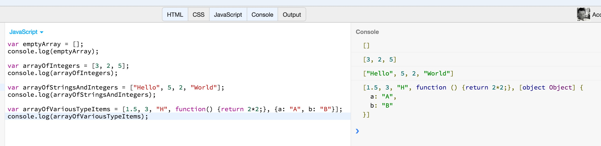

The first line, `var emptyArray = [];` creates an empty array. We are using the square brackets notation, without including any elements inside.

The line `var arrayOfIntegers = [3, 2, 5];` creates an array with 3 elements, 3 integers.
 
The line `var arrayOfStringsAndIntegers = ["Hello", 5, 2, "World"];` creates an array with 4 elements, of different types, 2 strings and 2 integers.
 
The line `var arrayOfVariousTypeItems = [1.5, 3, "H", function() {return 2*2;}, {a: "A", b: "B"}];` creates an array with 5 elements. A number, `1.5`, an integer `3`,
a string `"H"`, a function, and, finally, an object created using object literal.

Note that the arrays have a property `length`, which returns the number of elements in the array. Append the following line to the above program:

```
console.log(arrayOfVariousTypeItems.length);
```
If you run the program, you will see that it will print `5` as the length of the last array created.

An array can also contain elements that are other arrays. This is the way we can create multi-dimensional arrays. Let's say, for example, that we want
to create a JavaScript variable holding this two-dimensional array of integers:

```
-          -
|  4  5  6 |
|  9  8  2 |
| 10  3 25 |
-          -
```
We can do that with the following JavaScript code:

``` javascript
var matrix = [
  [ 4,  5,  6],
  [ 9,  8,  2],
  [10,  3, 25]
];

console.log(matrix);
```

If you run the above program on JS Bin, you will get this:

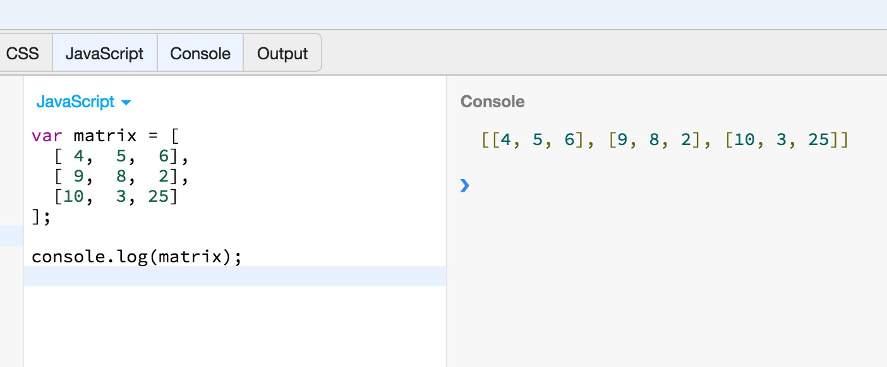

You can see that we created an array with 3 elements. Each element is another array with 3 elements too. 

## Reading and Writing Array Elements

The array elements are referenced using the `[]` operator. Inside the `[]` operator we need to have an expression that evaluates to a non-negative integer. This is because the
array elements are referenced by their position. The positioning is 0-based. Hence, the first element of the array is at position 0, the second element of the array is
at position 1 and so on.

An array can hold up to 2<sup>32</sup> elements. In other words, up to 4,294,967,296 elements. And since the positioning is 0-based, the index used to access an array may be one
value from 0 up to <code>2<sup>32</sup> - 1</code>, a.k.a. up to 4,294,967,295. 

Let's try some examples. Write the following JavaScript program on JS Bin:

``` javascript
var employees = [
  {firstName: "George", lastName:  "M"},
  {firstName: "Mary",   lastName:  "L"},
  {firstName: "John",   lastName:  "K"}
];

for (var i = 0; i < employees.length; i++) {
  console.log("Employee (" + i + "): " + employees[i].firstName);
}
```
If you run the above program, you will see this:

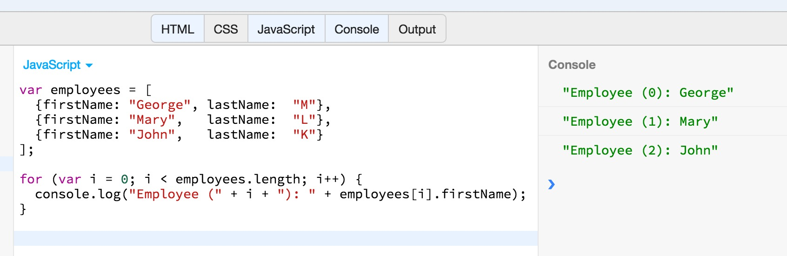

In the above example, we have an array of employees, i.e. array with 3 elements. The 3 elements are objects, created with object literals. All the objects have the same properties:
`firstName` and `lastName`. The program uses a `for` loop to iterate through all the elements of the array and print the first names of the employees.

See how the `employees[i]` is accessing the `i`th element of the array, which is an object. And then, with the dot notation, we are accessing the property `firstName`.
Note also that the first element of the array is accessed with `0` index and the last element with `employees.length - 1`. The `i` goes up to `employees.length - 1` (since the
repeat condition is `i < employees.length` and `i` is increased by `1` on every iteration - `i++`).

In the following example, we are updating the first name and last name of the 2nd employee.

``` javascript
var employees = [
  {firstName: "George", lastName:  "M"},
  {firstName: "Mary",   lastName:  "L"},
  {firstName: "John",   lastName:  "K"}
];

employees[1].firstName = "Tom";
employees[1].lastName  = "J";

console.log(employees);
```

If you run this program on JS Bin, you will get this:

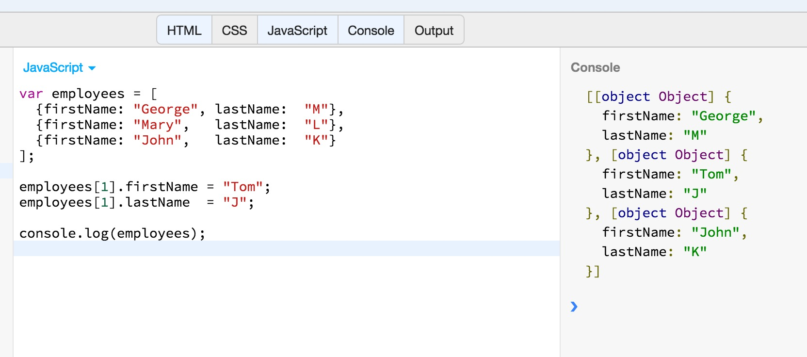

## Adding And Deleting Elements

We can add elements to an array, by just setting values to new indexes. Let's see the following example:

``` javascript
var products = [];
products[0] = "Apples";
console.log(products.length);

products[1] = "Oranges";
console.log(products.length);

products[2] = "Grapes";
console.log(products.length);
```

If you run the above program on JS Bin, you will see this:

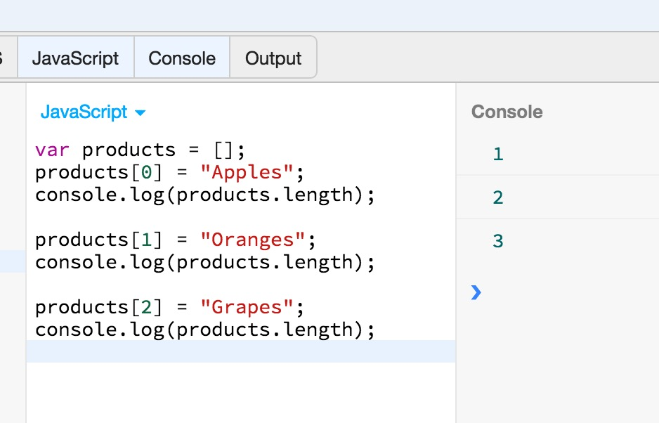

Sometimes, you do not know the length of the array and you want to add a new element at the end of it. Look at the following example:

``` javascript
var products = [];
products[products.length] = "Apples";
console.log(products.length);

products[products.length] = "Oranges";
console.log(products.length);

products[products.length] = "Grapes";
console.log(products.length);

console.log(products);
```

If you run the above program on JS Bin, you will get this:

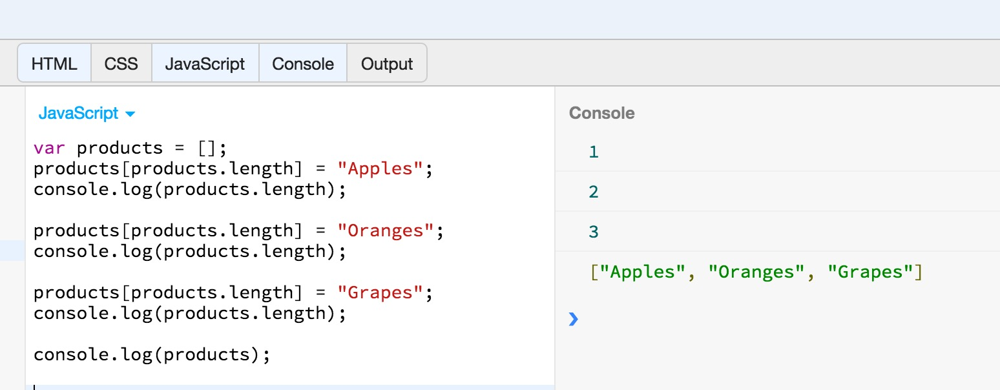

As you can see above, referencing the element position which is equal to the length of the array, we can add a new element at the end of the array. This is because the last element exists
at position `<array>.length - 1`, and a new element can be added after that, i.e. at position `<array>.length`. Then, the `length` is automatically updated to reflect the new
length of the array at hand.

### `push()`

Another alternative to add new elements to an array, is the use of method `push()`. The method `push()` takes as input arguments the elements to be added at the end of the array.

``` javascript
var products = [];
products.push("Apples");
console.log(products.length);
console.log(products);

products.push("Oranges", "Grapes");
console.log(products.length);
console.log(products);
```

If you run the above program on JS Bin, you will get this:

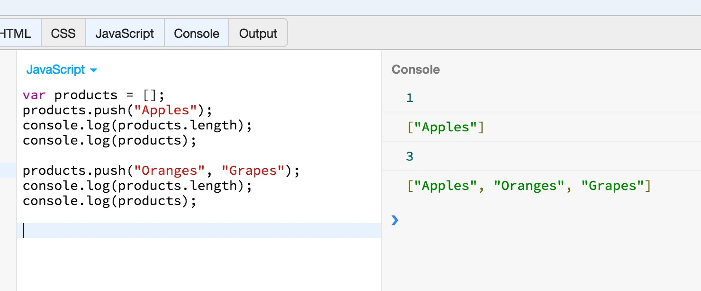

As you can see the `products.push("Oranges", "Grapes");` added 2 elements at the end of the array.

### `pop()`

The `pop()` method is used to remove the last element of an array. Also, it returns the element removed. Let's try that:

``` javascript
var products = [];
products.push("Apples");
console.log(products.length);
console.log(products);

products.push("Oranges", "Grapes");
console.log(products.length);
console.log(products);

var element = products.pop();
console.log(element);
console.log(products.length);
console.log(products);
```

If you run the above program on JS Bin, you will get this:

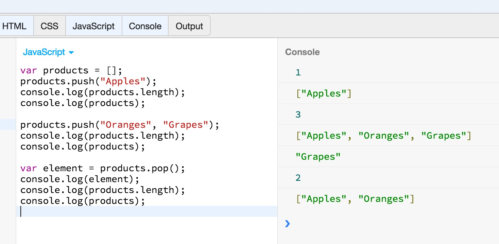

As you can see, the line `var element = products.pop();` removes the last element of the array and, also, since `pop()` returns the value of the element deleted, that last element value is
saved inside the variable `element`. Note also that the `length` property value is automatically updated.

### `shift()`

There is another way you can remove an element from an array. It is the `shift()` method. It works like `pop()` but it deletes the first element of the array.

``` javascript
var products = ["Apples", "Oranges", "Grapes"];
var element = products.shift();
console.log(element);
console.log(products.length);
console.log(products);
```

If you run the above program on JS Bin, you will get this:

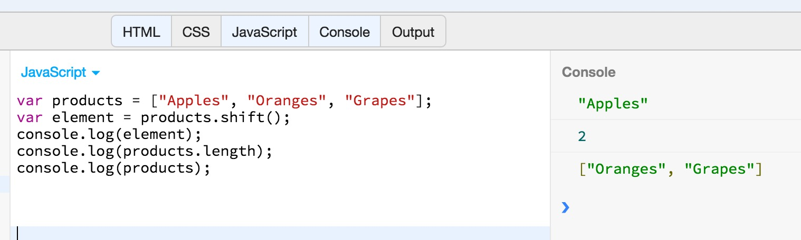

Pretty easy, isn't it?

### `splice()`

This is a more generic method that does both addition and deletion of elements from an array. Also, when it removes elements, it returns the elements removed.

It's syntax is as follows:

``` javascript
array.splice(index, how_many, item1, ... , itemX)
```

The parameters that can be sent to `splice()` are:

1. `index`. *Required.* The position of the array that the elements will be added to, or removed from. You can use a negative integer if you want to refer to elements at the end of the array.
2. `how_many`. *Required.* The number of items to be removed. If `0`, nothing will be removed.
3. `item1, ..., itemX`. *Optional.* The new items to be added to the array.
 
Let's see a first example.
 
``` javascript
var products = ["Apples", "Oranges", "Grapes"];
var element = products.splice(1, 1);
console.log(element);

console.log(products.length);
console.log(products);
```

If you run the above program on JS Bin, you will get this:

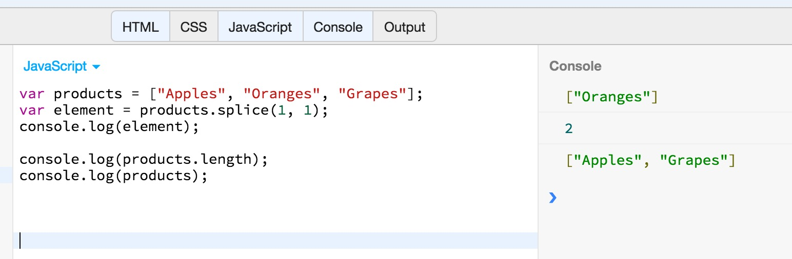

In the above example, we are using `splice()` to remove the 2nd element. That is why the first argument given is `1` and the second one is `1` too. Notice how the result of splice
is an array too. Hence, the `element`, when printed, it gives: `["Oranges"]`, an array with 1 element.

Let's see now a more complicated example:

``` javascript
var products = ["Apples", "Oranges", "Grapes"];
var elements = products.splice(1, 2, "Tomatoes", "Potatoes", "Cucumbers");
console.log(elements);

console.log(products.length);
console.log(products);
```

If you run the above program on JS Bin, you will get this:

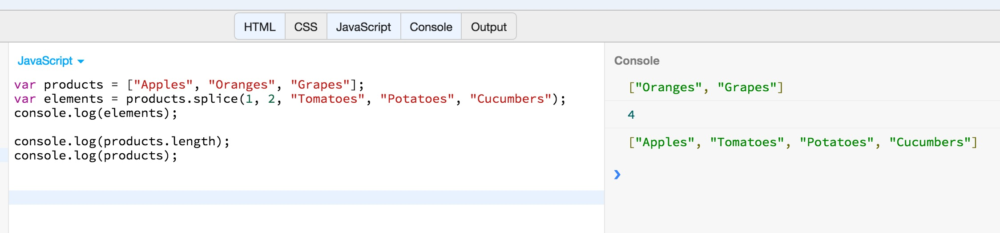

The previous example works on the 2nd position of the original array. It removes 2 items starting from position 1 and then adds 3 new items. See how `splice()` returns an 
array with the two elements removed.

Before closing with slice, try the following example:

``` javascript
var products = ["Apples", 
                "Oranges", 
                "Grapes",
                "Tomatoes"];
var elements = products.splice(1, 2, "Potatoes", "Cucumbers");
console.log(elements);

console.log(products.length);
console.log(products);
```

If you run the above program on JS Bin, you will see this:

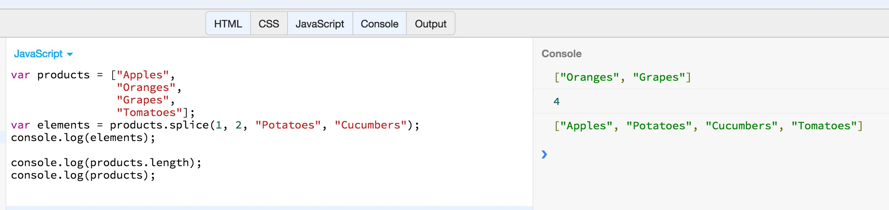

Notice how the two new items added, `"Potatoes", "Cucumbers"` are added at position 2, replacing `"Oranges"` and `"Grapes"`.

## Array Methods

We will now continue our introduction to arrays, by learning some of the most useful methods that can be invoked on an array object.

### `join()`

The `Array.join()` method converts all the elements of an array to strings and concatenates them, returning the resulting string.

Let's try some examples:

``` javascript
var products = ["Apples", 
                "Oranges", 
                "Grapes",
                "Tomatoes"];
console.log(products.join());
console.log(products.join("|"));
console.log(products.join(" and "));
```

If you run the above on JS Bin, you will get this:

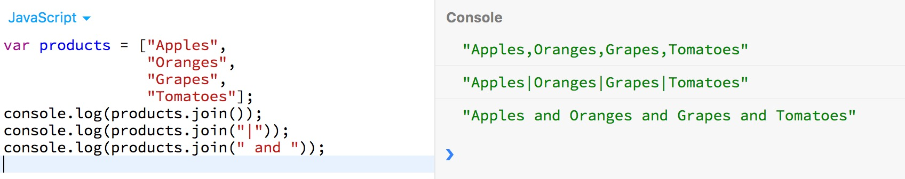

As you can see, the first join, `products.join()` joins the elements using the `,` separator. The second join, `products.join("|")` joins the elements using the `|` separator.
And, finally, the third join, `products.join(" and ")` joins the elements using the `" and "` string separator. The result of `join()`, in any case, is a new string.

### `reverse()`

The `Array.reverse()` method reverses the order of the elements of an array and returns the reversed array.

Let's try an example:

``` javascript
var products = ["Apples", 
                "Oranges", 
                "Grapes",
                "Tomatoes"];
console.log(products.reverse());
console.log(products);
```

If you run the above on JS Bin, you will see the following:

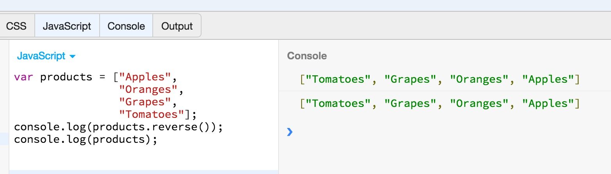

As you can see above, the `reverse()` method alters the original array. Does the job in place, as we say.

### `sort()`

The method sort is used to sort the elements of an array.

Let's try an example:

``` javascript
var products = ["Apples", 
                "Tomatoes", 
                "Grapes",
                "Oranges"];
console.log(products.sort());
console.log(products);
```

If you run the above program on JS Bin, you will get this:

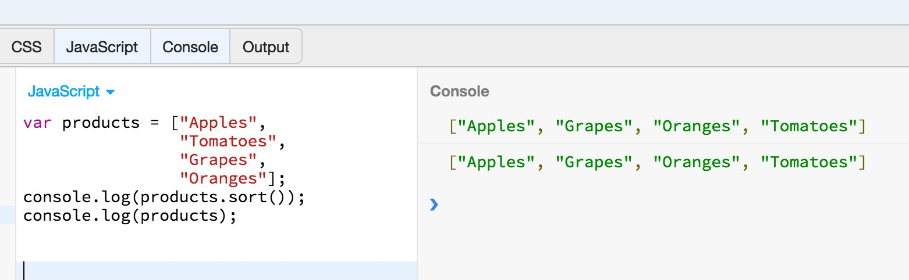

`sort()` always sorts in ascending alphabetical order. What if you want to sort the list in descending alphabetical order? In that case, you need to give an argument
as comparison function. The comparison function tells `sort()` the relative sorting order of two elements. Given an element `a` and its next element `b`, if the comparison
function returns something less than 0, a negative number, then `a` is considered to be first and `b` is considered to be second in ordering. If the comparison function
returns something greater than 0, a positive number, then `a` is considered to be after `b` in the sorting order. If the comparison function returns 0, then both elements
are considered to be on same sorting position.

Having said the above, try the following example:


``` javascript
var products = ["Apples", 
                "Tomatoes", 
                "Grapes",
                "Oranges"];

products.sort(function(a, b) {
  if (a < b) {
    return 1; 
  }
  else if (a > b) {
    return -1;
  }
  else return 0;
});

console.log(products);
```

This piece of code above, sorts the elements of the array `products`, using a comparison function. This comparison function compares an element `a` to its neighbouring element `b`.
Hence, `a` and `b` represent two adjacent elements in the array. The comparison logic is such that if the left element `a` is less than right element `b`, the function returns `1`
signifying that `a` should actually be considered greater than `b`. Also, if left element `a` is greater than right element `b`, the function returns `-1` signifying that `a` should
actually be considered less than `b`. These two branches of comparison logic, for the two adjacent elements, make sure that the array is sorted in descending order.

Try to run the above program on JS Bin and you will get this:

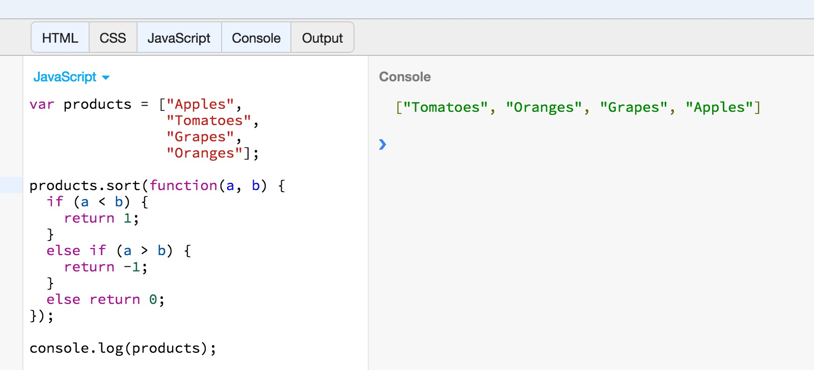

Of course, this can also be written using the ternary operator:

``` javascript
var products = ["Apples", 
                "Tomatoes", 
                "Grapes",
                "Oranges"];

products.sort(function(a, b) {
  return (a < b ? 1 : (a > b ? -1 : 0));
});

console.log(products);
```

If you run the above program on JS Bin, you will get the same result as before.

> *Note:* Do you see how convenient is to use unnamed functions? Since the comparison functions are used only once, there is no need to give them a name.

### `concat()`

The `Array.concat()` method creates and returns a new array that contains the elements of the original array on which `concat()` was invoked, 
followed by each of the arguments to `concat()`. If any of these arguments is itself an array, then it is the array elements that are concatenated, 
not the array itself. Note, however, that `concat()` does not recursively flatten arrays of arrays. 

Finally, `concat()` does not modify the array on which it is invoked. 

Let's try the following example:

``` javascript
var products = ["Apples", 
                "Tomatoes", 
                "Grapes",
                "Oranges"];

console.log(products.concat(["Endives", "Brocolli", "Celeries"]));

console.log(products);
```

If you run the above program on JS Bin, you will get this:

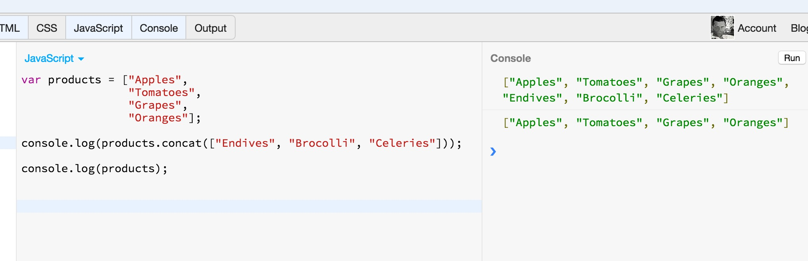

As you can see above, the `concat()` method does not modify the original array.

### `slice()`

The `Array.slice()` method returns a slice, or sub-array, of the specified array. Its two arguments specify the start and end of the slice to be returned. 
The returned array contains the element specified by the first argument and all subsequent elements up to, but not including, the element specified by the second argument. 
If only one argument is specified, the returned array contains all elements from the start position to the end of the array. If either argument is negative, 
it specifies an array element relative to the last element in the array. An argument of `-1`, for example, specifies the last element in the array, 
and an argument of `-3` specifies the third from last element of the array. Note that `slice()` does not modify the array on which it is invoked.

Let's try the following example:

``` javascript
var products = ["Apples", 
                "Tomatoes", 
                "Grapes",
                "Oranges"];

console.log(products.slice(1, -1));

console.log(products);
```

This program is using `slice()` to get the 2nd up to the last element of the array, without including the last element.

If you run the above program on JS Bin, you will get this:

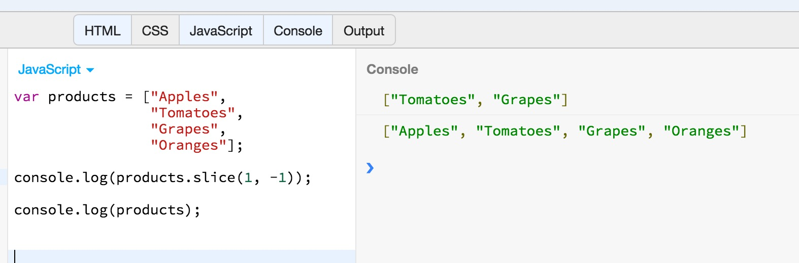

As you can see from the example above, the `slice()` method does not modify the original array.

### `unshift()` and `shift()`

These methods work like the `push()` and `pop()` which we have already seen. The `unshift()` adds an element at the beginning of the array. The `shift()` removes the
first element of the array. Both, they update the array in place and they update the length property accordingly.

``` javascript
var products = ["Apples", 
                "Tomatoes", 
                "Grapes",
                "Oranges"];

products.unshift("Celery");
console.log(products);

var element = products.shift();
console.log(element);
console.log(products);
```

The above program first adds the `"Celery"` element at the beginning of the array, using the `unshift()` method. Then removes the first element using the `shift()` method.

If you run the above program on JS Bin, you will get this:

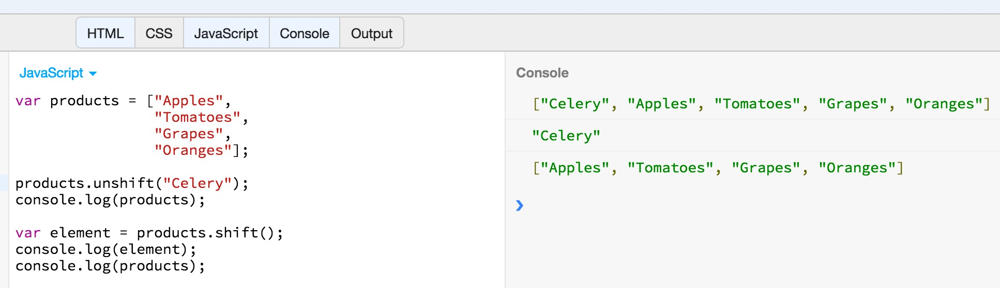

### `forEach()`

The `Array.forEach()` method can be used to carry out an action for each one of the elements of an array, iteratively. It takes as argument a function which can have 3 arguments.
The first argument is the value of the element at each iteration. The second argument is the position index of the element at hand. The third argument is a reference to the array
itself, and it is used when we want to alter the elements of the array.

Let's suppose that we want to sum the elements of an array of integers:

``` javascript
var salaries = [1000, 2000, 1500, 2500, 3500, 4000, 3800];
var sum = 0;
salaries.forEach(function(element, i, data){
  sum += element;  
});

console.log(sum);
```

If you run the above on JS Bin, you will see this:


As you can see, the function given to `forEach()` does a very simple increment of the `sum` variable, by the amount of the `element` at hand (`sum += element`). Since, this
function is called for each one of the elements of the array, at the end, the `sum` contains the sum of the elements of the array of integers.

Of course, `sum` can be calculated using a `for` loop:

``` javascript
var salaries = [1000, 2000, 1500, 2500, 3500, 4000, 3800];
var sum = 0;
for (var i = 0; i < salaries.length; i++) {
  sum += salaries[i];
}

console.log(sum);
```

Note that `for` version is considered to be faster. Also, `for` statement has the capability to prematurely end the loop using `break`, something that cannot be 
accomplished with `forEach()`.

Another example of `forEach()` converts the strings of an array to upper case:

``` javascript
var products = ["Apples", "Grapes", "Tomatoes", "Potatoes"];
products.forEach(function(element, i, array){
  array[i] = array[i].toUpperCase();
});

console.log(products);
```

If you run the above program on JS Bin, you will get this:

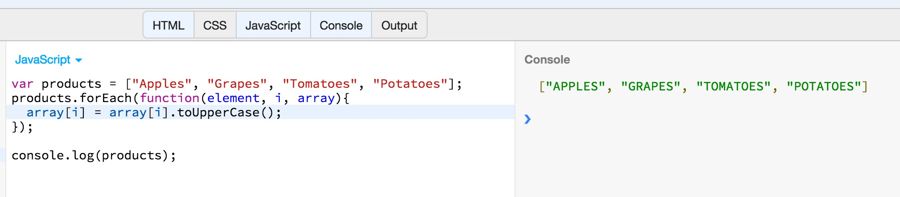

### `map()`

The `Array.map()` method is used to carry out an action on the elements of an array. It takes as input argument the conversion function. The conversion function needs to return the
element given converted. Note that the `map()` function does not convert the input elements in place. It returns a completely new array of elements.

Let's try again the example with converting all elements to upper case.

``` javascript
var products = ["Apples", "Grapes", "Tomatoes", "Potatoes"];

var upperCaseProducts = products.map(function(element) {
  return element.toUpperCase();
});

console.log(products);

console.log(upperCaseProducts);
```

If you run the above program on JS Bin, you will see this:

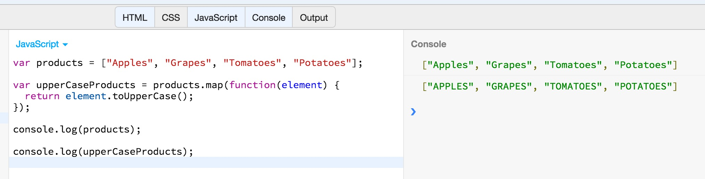

As you can see above, the `map()` uses a conversion function that takes as input an element of the array, converts it to upper case and returns it. `map()` conversion function
is applied on all elements of the array. Also, the `map()` does not modify the original array. It returns a brand new array.

### `filter()`

The `Array.filter()` method is used to create a sub-array from the given array. The sub-array contains all the elements for which the test function given to `filter()` returns `true`.

Let's try the following example, which selects the even numbers from an array with both odd and even numbers.

``` javascript
var arrayOfNumbers = [1, 2, 3, 4, 5, 6, 7, 8, 9, 10];

var evenNumbers = arrayOfNumbers.filter(function(element) {
  return element % 2 === 0;
});

console.log(arrayOfNumbers);
console.log(evenNumbers);
```

If you run the above on JS Bin, you will get this:

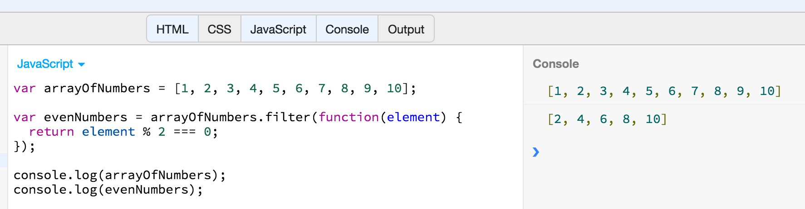

As you can see above, the array `evenNumbers` has been constructed by the application of `filter()` onto the original array `arrayOfNumbers`. Only the elements that were making
test function return `true` have been added to `evenNumbers`. 

### `every()`

The `Array.every()` method returns either `true` or `false`. It returns `true` when all elements of the array satisfy the test function that is given as input argument to `every()`.
Otherwise, it returns `false`.

Let's try that with two arrays, one with numbers and one with even numbers. The test function that we will give will test whether the given element is even number.

``` javascript
var arrayOfNumbers = [1, 2, 3, 4, 5, 6, 7, 8, 9, 10];

var evenNumbers = [2, 4, 6, 8, 10];

console.log(arrayOfNumbers.every(function(element) {
  return element % 2 === 0;  
}));

console.log(evenNumbers.every(function(element) {
  return element % 2 === 0;  
}));
```

If you run the above program on JS Bin, you will get this:

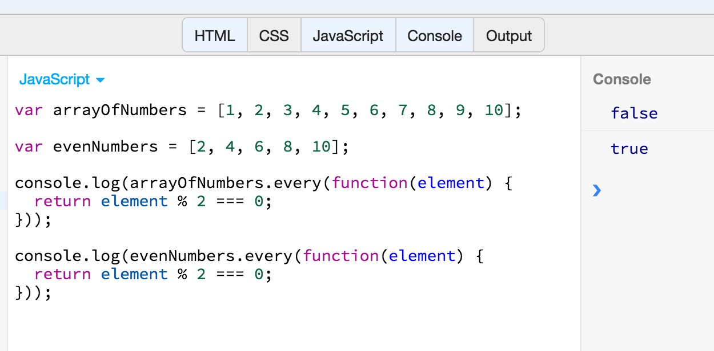

As you can see above, the program prints `false` for `arrayOfNumbers` and `true` for `evenNumbers`. This is because there are elements inside `arrayOfNumbers` that do not 
satisfy the test function. These elements make test function return `false`. On the other hand, all elements of `evenNumbers` satisfy the test function, i.e. they make it
return `true`.

BTW, there is a code repetition on the above piece of JavaScript code. This code repetition can be avoided by saving the function definition into a variable and then use that
variable as input argument to `every()`. Let's see that:

``` javascript
var arrayOfNumbers = [1, 2, 3, 4, 5, 6, 7, 8, 9, 10];

var evenNumbers = [2, 4, 6, 8, 10];

var isEvenNumber = function(element) {
  return element % 2 === 0;
};

console.log(arrayOfNumbers.every(isEvenNumber));

console.log(evenNumbers.every(isEvenNumber));
```

If you run the above on JS Bin, you will, again, get `false` and then `true`.

### `some()`

The `Array.some()` method is similar to `Array.every()` but does not require all elements to satisfy the test function. If at least one element satisfies the test function
then this method returns true.

Let's try the following example:

``` javascript
var numbers = [1, 2, 3, 5, 7, 9];

var isEvenNumber = function(element) {
  return element % 2 === 0;  
};

console.log(numbers.some(isEvenNumber));

console.log(numbers.every(isEvenNumber));
```

If you run the above program on JS Bin, you will get this:

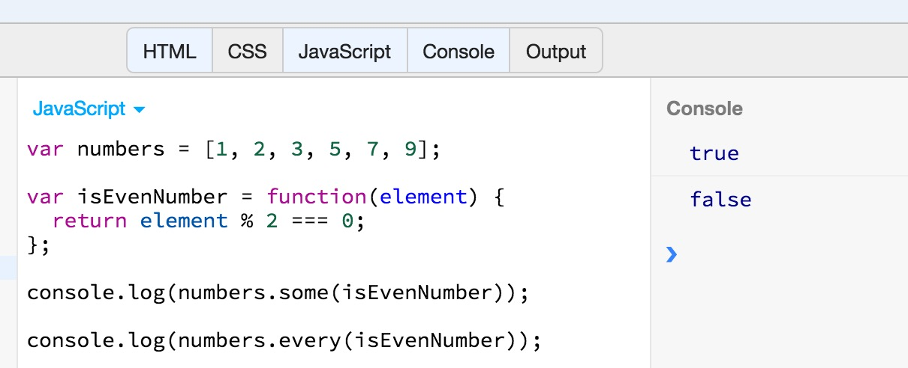

The above example depicts the difference between `every()` and `some()`. As you can see, the `some()` returns `true`, because there is one even number in the given array of numbers.
Whereas the `every()` returns `false`, because not all numbers are even.

### `reduce()`

The `Array.reduce()` method parses all the elements of an array and returns back one value only. That's why it is called `reduce`. Because it reduces many values (the array)
to a single value.

It is better explained with some examples:

``` javascript
var a = [100, 150, 200, 300, 350];
var sum = a.reduce(function(accumulator, element) {
  return accumulator + element;
}, 0);

console.log(sum);
```

The `reduce()` method above is called with 2 arguments:

1. The first argument to `reduce()` is the function that operates on an element. This takes two arguments too:
  1. An `accumulator` argument which is initialized with the value of the 2nd argument sent to `reduce()`
  method. In our example `accumulator` is initialized with `0`. At the end of each iteration of `reduce()`, 
  the `accumulator` holds the function returned value at the particular iteration.
  2. The second argument to the function is the element at hand. We said that `reduce()` works by parsing all the elements one-by-one.
  The `element` parameter holds the value of each element.
2. The second argument to `reduce()` is the starting value of the accumulator.  

In other words...

1. At the 1st iteration, function is called with `0` and `100`, adding them together, returning `100` and saving that to `accumulator`.
2. At the 2nd iteration, function is called with `100` and `150`, adding them together, returning `250` and saving that to `accumulator`.
3. At the 3rd iteration, function is called with `250` and `200`, adding them together, returning `450` and saving that to `accumulator`.
4. At the 4th iteration, function is called with `450` and `300`, adding them together, returning `750` and saving that to `accumulator`.
5. At the 5th iteration, function is called with `750` and `350`, adding them together, returning `1100` and saving that to `accumulator`.

> *Note:* You will often come across other names for the `reduce` feature in other languages, like `inject` and `fold`.

### `indexOf()` and `lastIndexOf()`

The `Array.indexOf()` searches an array for a matching element, which is given as input argument. It searches from start till the end. If the element is found, then
it returns its position. If the element is not found, then it returns `-1`. The `lastIndexOf()` searches from the end of the array.

Let's try an example:

``` javascript
var numbers = [1, 2, 3, 5, 7, 9];

var position = numbers.indexOf(3);

console.log(position);
```

If you run the above program on JS Bin, you will see the number `2` being printed. This is because the number 3 is at 3rd position in the array, which corresonds
to index 2 (since array positions are indexed starting from 0).

Let's expand that example:

``` javascript
var numbers = [1, 2, 3, 5, 7, 9, 7, 3, 10];

var position = numbers.indexOf(3);

console.log(position);

position = numbers.lastIndexOf(3);

console.log(position);

position = numbers.indexOf(11);

console.log(position);
```

If you run the above on JS Bin, you will get this:

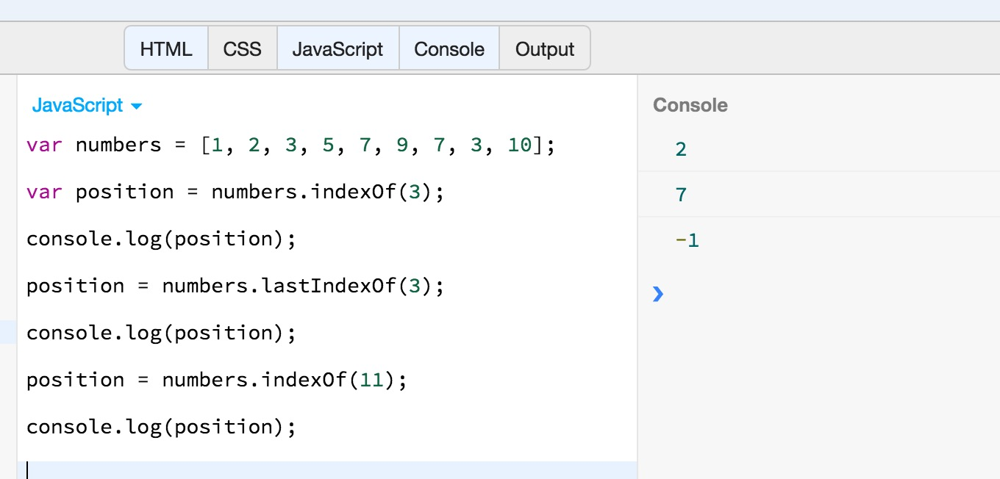

You can see in the above example, how `lastIndexOf()` returns the position of `3` that is closest to the end of the array. Also, you can see the returned position being `-1` for
elements (`11`) that do not exist in the array.

Please, note that the comparison to locate the element inside the array, is done using strict comparison (`===`) operator.

## Strings as Arrays

JavaScript strings can be treated like arrays up to an extend. For example, you can access individual characters of a string using the square brackets operator and the index of
the position that you want to access.

For example:

``` javascript
var greeting = "Hello World";

console.log(greeting[1]);
```

The above program prints out `e`. With the `greeting[1]`, we are accessing the 2nd character in the string given.

With strings, you can use the `indexOf()` method to get the position of a character inside a string:

For example:

``` javascript
var greeting = "Hello World";

console.log(greeting.indexOf("l"));
```

The above program will print `2`, which is the index of the character `l` inside the `greeting` string.


