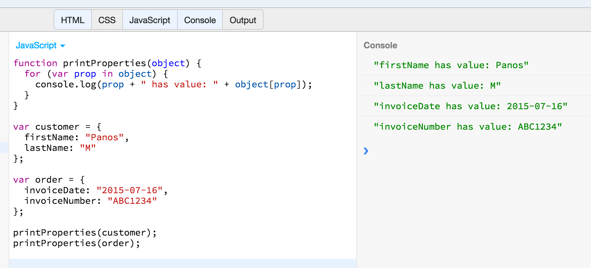
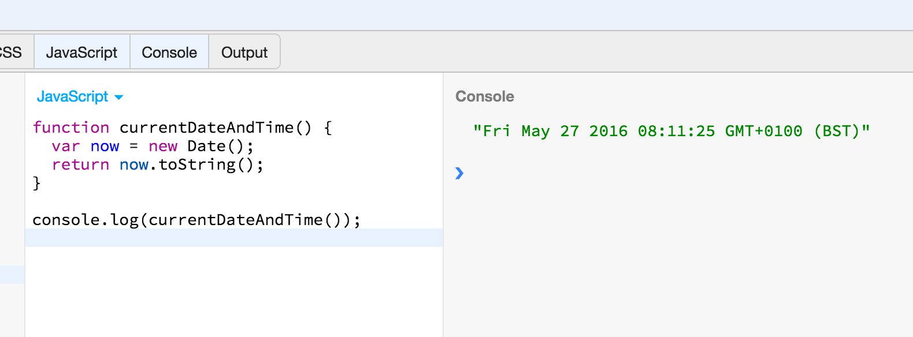
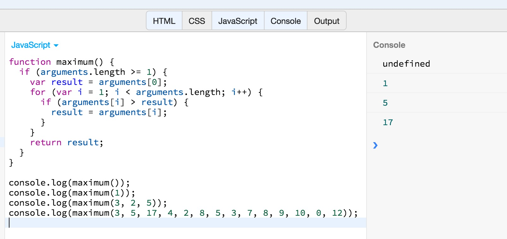
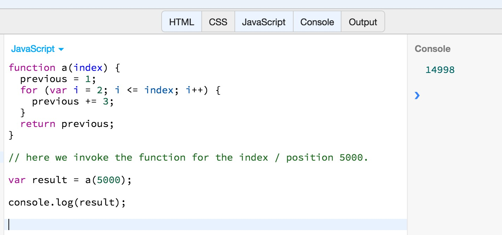
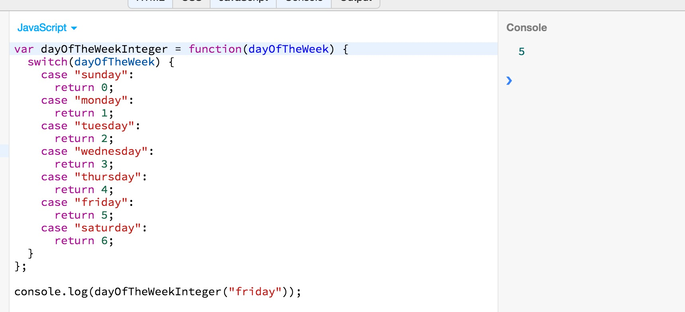
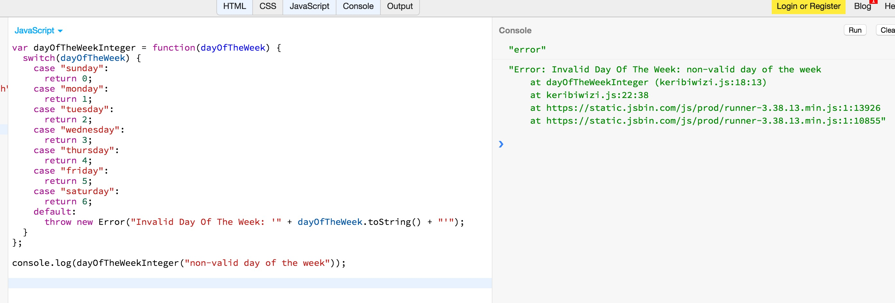
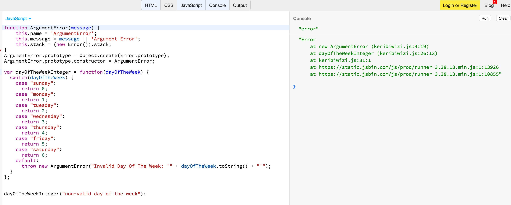

Functions are programming constructs that can group a set of programming instructions under a name.
Then, we can call the functions multiple times. Every time we call a function, the instructions that are part of the
function are executed. Functions may be parameterized. This means that, when defined, they include a list of
identifiers, which are called *parameters*, and which work like local variables, i.e. their scope is limited within
the function block definition. Also, the parameters are used when we invoke a function. For each one of the parameters,
we pass an actual value, which is called an argument.

## Defining Functions

Let's see in more detail how we can define a function. Look at the following example:

``` javascript
function printProperties(object) {
  for (var prop in object) {
    console.log(prop + " has value: " + object[prop]);
  }
}
```

This is a function definition. The function will have the name `printProperties`. When you name a function like that, you essentially
create a variable with name `printProperties` that you can later on use to invoke the function.

If you run the above program on JS Bin, you will see nothing happened. This is because the program only defines the function, but does
not call it, does not invoke it.

Let's expand the above program to also invoke the function.

``` javascript
function printProperties(object) {
  for (var prop in object) {
    console.log(prop + " has value: " + object[prop]);
  }
}

var customer = {
  firstName: "Panos",
  lastName: "M"
};

var order = {
  invoiceDate: "2015-07-16",
  invoiceNumber: "ABC1234"
};

printProperties(customer);
printProperties(order);
```

This program, besides defining the function `printProperties`, it also invokes it, twice. The invocations are the ones at the last 2 lines.
If you run the above program on JS Bin, you will get this:



The function takes one parameter. The name of the parameter is `object` and it is used as local variable inside the function body, in order to do the actual work.
On last two lines of the above program, we actually invoke the previously defined function. The invocation requires that we pass actual values on the parameters placeholders.
They are the arguments of invocation. The arguments on the above program are `customer`, on the first invocation and `order` on the second.

Note that functions do not have to have parameters. Look at the following example:

``` javascript
function currentDateAndTime() {
  var now = new Date();
  return now.toString();
}

console.log(currentDateAndTime());
```

If you run the above program on JS Bin, you will get this:



The above program defines the function `currentDateAndTime()`. This function is defined without parameters. Also, on last line, we call that function without arguments, obviously.
BTW, this program is calling two more functions that do not take arguments. The function `Date()` and the function `toString()`.

## Defining And Calling Function At the Same Time

There are cases in which you want to define a function and call it, immediately and once. In order to do that:

1. You define the function without any name. You do not need that.
2. You wrap the function definition inside parentheses.
3. Then you immediately use opening and closing parentheses, with potential arguments inside, if the function takes parameters.

Let's see an example:

``` javascript
var result = (function(){

  return "Hello World";

})();

console.log(result);
```

This is a very simple example. If you run this on JS Bin, you will see the string `"Hello World"` printed on console. This is because the `result` variable holds the
return value of the function that it is defined as `function() { return "Hello World"; }`. This function is wrapped into parentheses: **(**`function() { return "Hello World"; }`**)**
and then it is invoked:

`(function() { return "Hello World"; })`**()**.

Look at another example for a function that takes parameters:

``` javascript
var result = (function(x) {

  return x * 2;

})(4);

console.log(result);
```

If you run the above program on JS Bin, you will get the number `8`. This is because the function is invoked with argument `4` and then returns its double (`return x * 2;`).

1. First the function is defined: `function(x) { return x * 2; }`
2. Then the function is wrapped inside parentheses: **(**`function(x) { return x * 2; }`**)**
3. Then the function is invoked with argument `4`: `(function(x) { return x * 2; })`**(4)**
4. The result of invocation is assigned to variable `result`.

## The `return` statement

When a `return` statement is encountered within a function body, then JavaScript interpreter executes whatever statement follows `return` (up to `;`),
calculates the statement value, and then terminates the function block, passing to the calling piece of code (the code that actually invoked the function),
the value of the statement calculated.

If a function does not have a `return` statement, then all the statements inside the function body are executed one by one and what is being returned to the
calling code is `undefined`. `undefined` is also returned if function has `return` statement with no accompanying statement that would return a value.

Let's see the following example of code:

``` javascript
function doSomething() {
  for (var i = 0; i < 100000; i++) {
    if ( i === 10 ) {
      return i;
    }
  }
  return "Hello World";
}

var result = doSomething();

console.log(result);
```

If you run the above on JS Bin, you will get the number `10` printed on console. This is because the function `doSomething()` always terminates on line `return i` when
the `i` is equal to `10`.

## Nested Functions

In JavaScript, you can define a function inside another function. The good thing about this technique is that the inner function has access to the local variables of the
outer function.

Let's see an example:

``` javascript
function formula(a, b) {
  function power(x) {
    return Math.pow(a, x) + Math.pow(b, x);
  }
  return power(8) - power(2);
}

var result = formula(4, 2);
console.log(result);

// equals to :
//
// (4^8 + 2^8) - (4^2 + 2^2)
//
// Note: Where "^" we symbolize the raise in the power of
//       Hence, for example, 4^2 means 4 * 4.
```

If you run the above code on JS Bin, you will get the number `65772` printed on console. Note how the function `power` is defined inside the function `formula`. Note also, how
the same function `power`, is accessing the `a` and `b` parameter variables, which are, basically, local variables to the outer function `formula`.

> *Note:* the `Math.pow()` is a method on `Math` JavaScript library that takes two arguments. The result of the invocation is the first number argument raised on the power of the
second. You can learn more about the `Math` JavaScript library and its many more methods. Google for it.
> *Hint:* Play around with the above program. Change it, experiment. You need to understand what it is doing and how.

## Invoking a Function

We have created and run a lot of programs until now with function invocations. Let's see some more details about it.

Functions can be invoked in one of the following ways:

1. As functions.
2. As methods of an object.
3. As constructors.

> *Note:* There are some other methods to call a function, but we will not deal with them in this course.

### As a Function.

Not too much more to say here. We have already seen that many times. Here is one more example:

``` javascript
function multiplyByPi(a) {
  return a * Math.PI;
}

var result = multiplyByPi(5);
console.log(result);
```

The above program defines the function `multiplyByPi` and calls it as a regular function.

### As a Method of an Object

Assigning a function definition as a value of an object property, then that makes the function a method.
Then, calling the method on the particular object, constitutes the case in which the function is called as a method.
A very important difference here is that method body has access to the object itself, and hence to its properties, via
the keyword `this`. Hence, usually, the methods carry out actions and execute statements based on the values of the
object properties they are attached to.

Let's see an example:

``` javascript
var employee = {
  firstName: "John",
  lastName: "Wayne",
  name: function() {
    return this.firstName + " " + this.lastName;
  }
};

console.log(employee.name());
```

If you run the above program on JS Bin, you will get the string `"John Wayne"` printed on the console. The program
calls the method `#name()` on the object `employee`. The method body is implemented such that it concatenates the
values of the object two properties, `firstName` and `lastName`. In order to access these properties, method body
needs to use the `this` keyword.

If method does no use the `this` keyword, then will not be able to access the values of these two properties.

### Constructor Invocation

We may use a function in order to construct new objects. These functions are usually named with an uppercase first letter.
Let's see an example:

``` javascript
function Employee(firstName, lastName) {
  var o = {
    firstName: firstName,
    lastName:  lastName,
    name: function() {
      return this.firstName + " " + this.lastName;
    }
  };
  return o;
}

var employee = new Employee("John", "Wayne");

console.log(employee.name());
```

The above code is producing the same result like the previous one. It will print the string `"John Wayne"` on the console.
It declares a constructor function `Employee` and it invokes it with `new` keyword and arguments `"John"` and `"Wayne"`.
The constructor function body, declares the local object `o`, and initializes it with the correct properties, including the
method `name()`. Then it returns the object created. When we invoke the `new Employee("John", "Wayne");` we take back the
object created and we save it in the variable `employee`. Then, we call the method `name()` on that variable, which returns
`"John Wayne"`.

## Function Arguments and Parameters

JavaScript does not do any check when you invoke a function, in regards to the parameters vs the arguments used to invoke the function. For example, if a function
definition expects 3 arguments and one invokes the function with 2, this will not raise an error at the invocation point.

Let's see what is going with parameters and the actual arguments being used to invoke a function, in a little bit more detail.

### Optional Parameters

When a function is invoked with fewer arguments than declared parameters, the additional parameters are set to the `undefined` value.

Let's see an example:

``` javascript
function print(numberOfTimes, charToPrint) {
  if (charToPrint === undefined) {
    charToPrint = 'x';
  }
  var result = '';
  for (var i = 1; i <= numberOfTimes; i++) {
    result = result + charToPrint;
  }
  console.log(result);
}

print(3, '#');
print(3, '-');
print(3);
```

The above program is very simple. It defines the function `print`. This function prints the character given as second argument so many times as the first argument specifies.
So, for example, the `print(3, '#');` will print the character `#` 3 times. However, we have designed the function `print` to have its second parameter to be an optional
parameter. This means that the `print()` function can be invoked without given the second argument, but only the first. If the caller does not give the second argument,
then `print()` will use, by default, the character `x`. The piece of code inside the `print()` body that does this optional parameter handling is this:

``` javascript
if (charToPrint === undefined) {
  charToPrint = 'x';
}
```

It checks whether the second parameter, `charToPrint`, has been passed an argument or not. If it has not been passed, then its value is `undefined`. In that case, we
assign the value `x`. 

Note that, it's important that, when you define a function with optional parameters, to set the optional parameters as the last parameters of the function defintion.
In other words, when your function definition has both mandatory and optional parameters, you need to first list inside the parentheses the mandatory parameters and
then the optional ones. Otherwise, the developer that would like to call your function wouldn't have a way to ommit the optional parameters.

### Variable Length Arguments List

There are cases in which you want to define a function that could take an arbitrary number of arguments. In other words, the designer of the function does not really
know in advance how many arguments would be used at invocation time. 

For example, let's suppose that we want to define a function that calculates the maximum number among an arbitrary list of numbers given as input. Here are some examples
of invocations of such a function:

``` javascript
maximum(1);
maximum(3, 2, 5);
maximum(3, 5, 17, 4, 2, 8, 5, 3, 7, 8, 9, 10, 0, 12);
```

JavaScript is very helpful with such a problem to solve. Provides the function body with a reserved word representing an array-like object of the actual arguments
given. The object is `arguments`. It has the property `length` which returns the number of arguments given and responds to the square brackets operator `[]` that
would return the actual argument on specific position.

Let's design the `maximum()` function that would work as above:

``` javascript
function maximum() {
  if (arguments.length >= 1) {
    var result = arguments[0];
    for (var i = 1; i < arguments.length; i++) {
      if (arguments[i] > result) {
        result = arguments[i];
      }
    }
    return result;
  } 
}

console.log(maximum());
console.log(maximum(1));
console.log(maximum(3, 2, 5));
console.log(maximum(3, 5, 17, 4, 2, 8, 5, 3, 7, 8, 9, 10, 0, 12));
```

If you run the above on JS Bin, you will get this:



We have defined the function `maximum()` so that it's doing something useful only if it is given some arguments. That's why we have the

```
if (arguments.length >= 1) {

  .... something useful here ....
  
}
```

`if` condition block. It relies on `arguments.length` to decide whether to deal with finding the maximum number or not.

Note that when we call the `maximum()` without arguments, it returns `undefined`. As we have said, this is the default returned value when the function execution does not reach
a `return` statement that would return something else. On the other hand, when we call the `maximum()` function with one or more arguments, the function
returns the maximum number found, as stored in the `result` local variable.

Note that a function definition might have both some mandatory parameters alongside with some optional parameters and can also work with some extra arbitrary arguments.

## Using Objects As Arguments

Sometimes it makes our code easier to read if we define our function to take its parameters using objects. This is true, especially, when the number parameters becomes
big, greater than 2. 

In other words, if the function definition is like that:

``` javascript
function saveOrder(firstName, lastName, product, numberOfItems, amount, dateOfPurchase) {
 // ... function body code goes here ...
}
```
 
then on every point of code that we would like to invoke this function, we would have to remember to give the actual arguments in the correct order.
 
``` javascript
saveOrder("John", "Woo", "Chair", 3, 30.00, "2016-05-28");
```

which means, that we would have to go back to the definition to double check that we have passed the arguments in the correct order. Also, 
reading the `saveOrder("John", "Woo", "Chair", 3, 30.00, "2016-05-28");` statement, is not very clear the meaning of each argument. For example,
we do not know which is the first name and which is the last name, unless we go back to the function definition and study how the function has been
defined.

Wouldn't it be more clear and easy if we had to call that function using a method like this?

```
saveOrder({
  firstName: "John",
  lastName: "Woo",
  product: "Chair",
  numberOfItems: 3,
  amount: 30.00,
  dateOfPurchase: "2016-05-28"
});
```

And not only that, wouldn't it be easier if we didn't care about the order? In other words, wouldn't it be easier if the above `saveOrder` would had
the same result as the next one, in which we shuffled the order of properties?

```
saveOrder({
  numberOfItems: 3,
  lastName: "Woo",
  dateOfPurchase: "2016-05-28"
  product: "Chair",
  amount: 30.00,
  firstName: "John",
});
```
The answer is 'yes', of course. 

We are using an object to give the argument values we want. But, in order to be able to do that, the function definition needs to be able to accept object too.

``` javascript
function saveOrder(orderDetails) {
 // ... function body code goes here ...
 // With orderDetails.firstName
 //      orderDetails.lastName
 // ... e.t.c. we have access to the argument values.
}
```

Having the function definition accepting an object with properties corresponding to parameters makes sure that the invocation can be done using object too.

## Recursive Functions

Sometimes we find it quite intuitive to call a function from within its body itself. Let me bring an example, in order to make more clear what I mean.
Supposedly, that we want to know what is the integer number at position 5000 in the following arithmetic sequence:

```
1, 4, 7, 10, 13, 16, ... e.t.c. where a number is the sum of the previous number plus 3.
```

In other words, we want to write a JavaScript program that returns the number of this sequence at a given position. A function like this:

``` javascript
function a(index) {
  // .... implementation of function goes here ...
}

// here we invoke the function for the index / position 5000.

var result = a(5000);

console.log(result);
```

We know how the numbers of this sequence are being built. A number at position `i` is equal to the number at position `i-1` plus `3`. Definitely, an implementation
like this, would do the job:

``` javascript
function a(index) {
  previous = 1;
  for (var i = 2; i <= index; i++) {
    previous += 3;    
  }
  return previous;
}

// here we invoke the function for the index / position 5000.

var result = a(5000);

console.log(result);
```

If you run this program on JS Bin, you will get this:



The above implementation uses the `for` statement to iterate `index - 1` times and increment, each time, the previous number by 3. Works well and it is very fast.

However, you may be tempted to implement this function in more intuitive way. Like this:

``` javascript
function a(index) {
  if (index == 1)
    return 1;
  return a(index - 1) + 3;
}

// here we invoke the function for the index / position 5000.
var result = a(5000);

console.log(result);
```

This implementation, if one reads the code carefully, is more intuitive because it follows the definition of the arithmetic sequence itself. It says that if the position
you are asking is `1`, then the answer is `1`, but, for any other position, the answer is the answer for the previous position plus 3. Something like that:
 
```
a[i] = a[i - 1] + 3
``` 

As you can see above, in order to apply this kind of implementation, we need the function to call itself (`return a(index - 1) + 3;`). Hence, for the given
argument `5000`, the function is called `5000` times, going backwards until it reaches `1`. And the intermediary results are reserved and then flow goes
back again, adding `3` to each one of them until it calculates the final result.

Note that recursive functions may be easier to implement, but they consume more memory than the non-recursive versions of them. Also, they are a little bit
slower. However, they can be proven to be very handy to write code that is easy to read.

## Throwing Errors

There are cases in which a function may be called under conditions for which the function is not designed to work properly. For example, let's take the following
function:

``` javascript
var dayOfTheWeekInteger = function(dayOfTheWeek) {
  switch(dayOfTheWeek) {
    case "sunday":
      return 0;
    case "monday":
      return 1;
    case "tuesday":
      return 2;
    case "wednesday":
      return 3;
    case "thursday":
      return 4;
    case "friday":
      return 5;
    case "saturday":
      return 6;
  }
};
``` 

If one calls that function as:

``` javascript
console.log(dayOfTheWeekInteger("friday"));
```

The result would be `5`.



If you call the same function with a non-valid argument, it would return `undefined`. You only have to try that:

``` javascript
console.log(dayOfTheWeekInteger("non-valid day of the week"));
```

Many developers decide to throw an error and actually make the JavaScript break at run-time. They believe that some functions need to be designed like that so that they
would easier surface up bad usages of the function by the client code, the program that is calling the function.

Having said that, when a function encounters an invalid argument can do the following:

``` javascript
var dayOfTheWeekInteger = function(dayOfTheWeek) {
  switch(dayOfTheWeek) {
    case "sunday":
      return 0;
    case "monday":
      return 1;
    case "tuesday":
      return 2;
    case "wednesday":
      return 3;
    case "thursday":
      return 4;
    case "friday":
      return 5;
    case "saturday":
      return 6;
    default:
      throw new Error("Invalid Day Of The Week: '" + dayOfTheWeek.toString() + "'");
  }
};
```

The line that throws the error is:

``` javascript
      throw new Error("Invalid Day Of The Week: '" + dayOfTheWeek.toString() + "'");
```

It is the statement `throw` that is followed by the instantiation of an `Error` object, by the call to `new Error( .... )`.

The `Error()` is a constructor function and takes as argument the message to accompany the error.

Try to run the following code in JS Bin:

``` javascript
var dayOfTheWeekInteger = function(dayOfTheWeek) {
  switch(dayOfTheWeek) {
    case "sunday":
      return 0;
    case "monday":
      return 1;
    case "tuesday":
      return 2;
    case "wednesday":
      return 3;
    case "thursday":
      return 4;
    case "friday":
      return 5;
    case "saturday":
      return 6;
    default:
      throw new Error("Invalid Day Of The Week: '" + dayOfTheWeek.toString() + "'");
  }
};

console.log(dayOfTheWeekInteger("non-valid day of the week"));
```

What you will get is this:



## Catching Errors

The client code that is calling a function, and knows that this function might throw an error, usually, but not always, might want to handle the error thrown, instead of letting it
bubble up and displayed as error at users browser or application.

This is called *catching errors*. When we know that a function might throw an error and we want to catch it, we use a `try { } catch(ex) { }` block.

Inside the `try { }` part we call the function and inside the `catch(ex) { }` we handle the error.

Run the following code inside JS Bin:

``` javascript
var dayOfTheWeekInteger = function(dayOfTheWeek) {
  switch(dayOfTheWeek) {
    case "sunday":
      return 0;
    case "monday":
      return 1;
    case "tuesday":
      return 2;
    case "wednesday":
      return 3;
    case "thursday":
      return 4;
    case "friday":
      return 5;
    case "saturday":
      return 6;
    default:
      throw new Error("Invalid Day Of The Week: '" + dayOfTheWeek.toString() + "'");
  }
};

try {
  dayOfTheWeekInteger("non-valid day of the week");
}
catch(ex) {
  console.log("Something went wrong: " + ex.message);
}
```

You will NOT get an error. Instead, you will get the message `"Something went wrong: Invalid Day Of The Week: 'non-valid day of the week'"`. You do not get an error,
but you get the message that is printed by the statement:

``` javascript
  console.log("Something went wrong: " + ex.message);
```

The statement

``` javascript
catch(ex) {
  console.log("Something went wrong: " + ex.message);
}
```

catches the error that `dayOfTheWeekInteger("non-valid day of the week");` statement throws and saves its details inside `ex` local variable.
Then it calls `ex.message` to get the property with name `message` that contains that message that `dayOfTheWeekInteger` has assigned to the
`Error` instance, and just prints the message (prefixed with "Something went wrong") at the console.

Note that if you want to both catch/handle the error and then propagate that up in the calling stack, you can call `throw ex;`:

``` javascript
try {
  dayOfTheWeekInteger("non-valid day of the week");
}
catch(ex) {
  console.log("Something went wrong: " + ex.message);
  throw ex;
}
```

## Throwing Custom Errors

Finally, there may be cases that you would like to throw custom error types, instead of `Error`. Custom error types are good to bear better
the meaning of the error.

In order to throw a custom error, you first need to define it. This is a custom error definition, `ArgumentError`:

``` javascript
function ArgumentError(message) {
    this.name = 'ArgumentError';
    this.message = message || 'Argument Error';
    this.stack = (new Error()).stack;
}
ArgumentError.prototype = Object.create(Error.prototype);
ArgumentError.prototype.constructor = ArgumentError;
```

We have defined a constructor function. Inside the constructor function we define 3 properties for the constructed object.

* `name`. This should be the string representation of the constructor name.
* `message`. Assign the value passed to the constructor or a default value. For example "Argument Error".
* `stack`. This is standard.

Then we are saying that `ArgumentError` should be an object deriving from `Error`:

``` javascript
ArgumentError.prototype = Object.create(Error.prototype);
```

and that its constructor is the `ArgumentError` function:

``` javascript
ArgumentError.prototype.constructor = ArgumentError;
```

Let's incorporate that inside our example for `dayOfTheWeekInteger` function. Write the following in JS Bin:

``` javascript
function ArgumentError(message) {
    this.name = 'ArgumentError';
    this.message = message || 'Argument Error';
    this.stack = (new Error()).stack;
}
ArgumentError.prototype = Object.create(Error.prototype);
ArgumentError.prototype.constructor = ArgumentError;

var dayOfTheWeekInteger = function(dayOfTheWeek) {
  switch(dayOfTheWeek) {
    case "sunday":
      return 0;
    case "monday":
      return 1;
    case "tuesday":
      return 2;
    case "wednesday":
      return 3;
    case "thursday":
      return 4;
    case "friday":
      return 5;
    case "saturday":
      return 6;
    default:
      throw new ArgumentError("Invalid Day Of The Week: '" + dayOfTheWeek.toString() + "'");
  }
};


dayOfTheWeekInteger("non-valid day of the week");
```

If you run this, you will get:



As you can see, the error thrown is not an "Error", it is an "ArgumentError".
