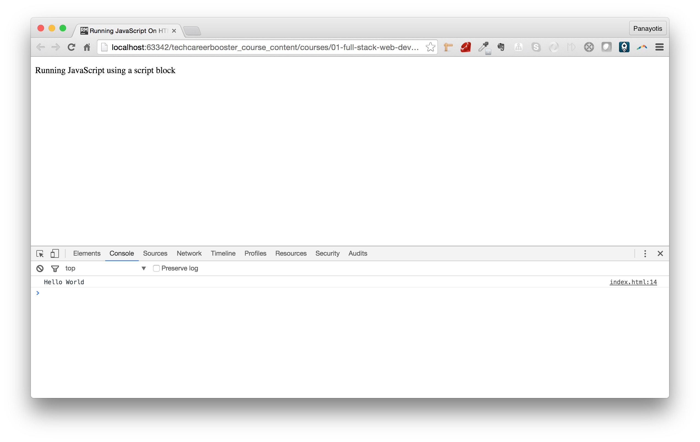
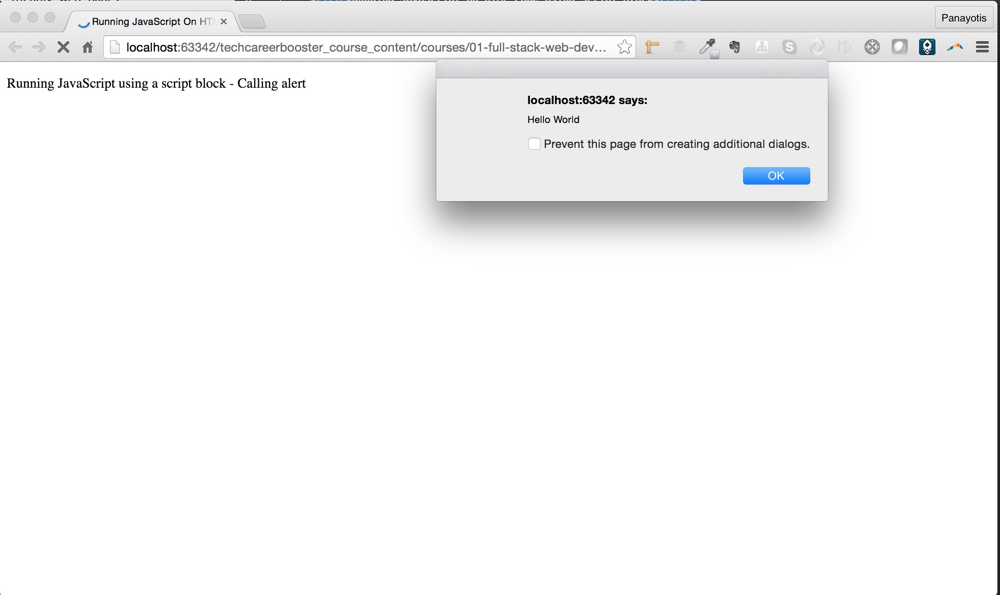
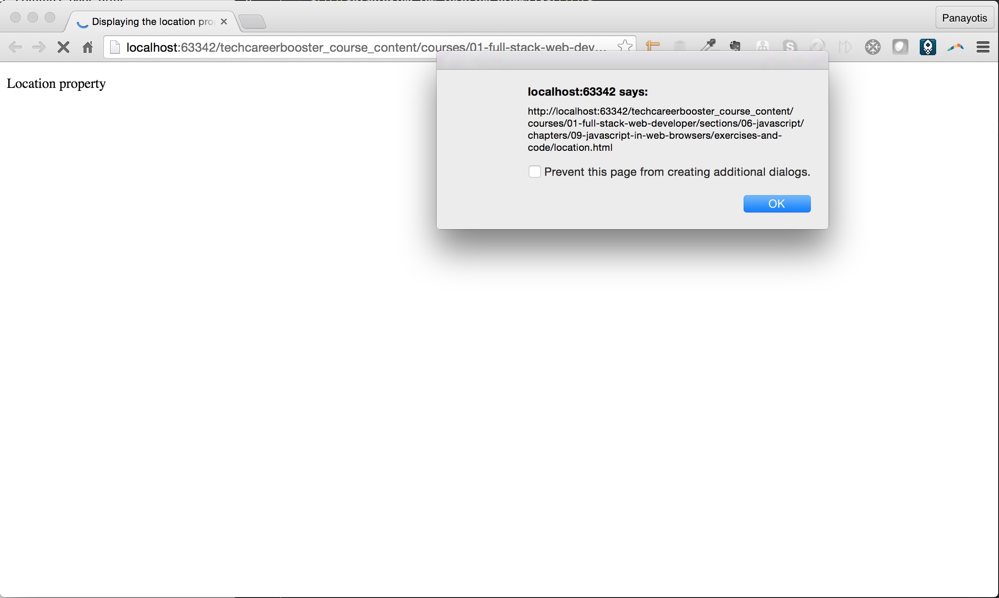
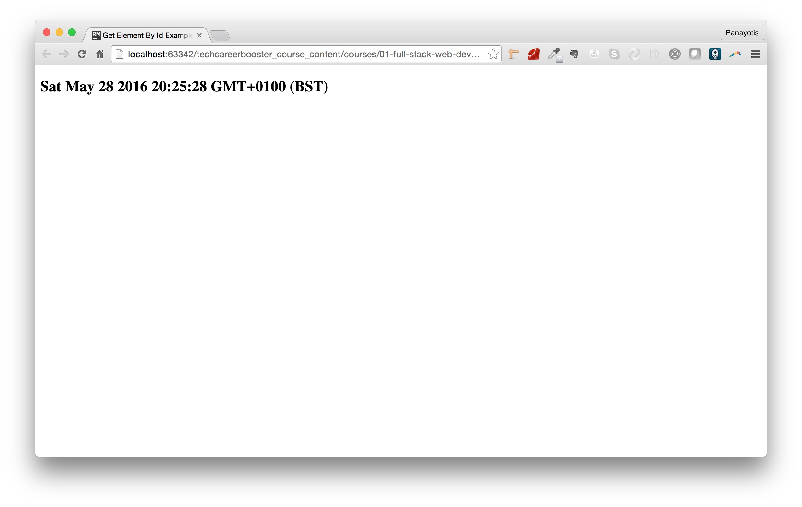
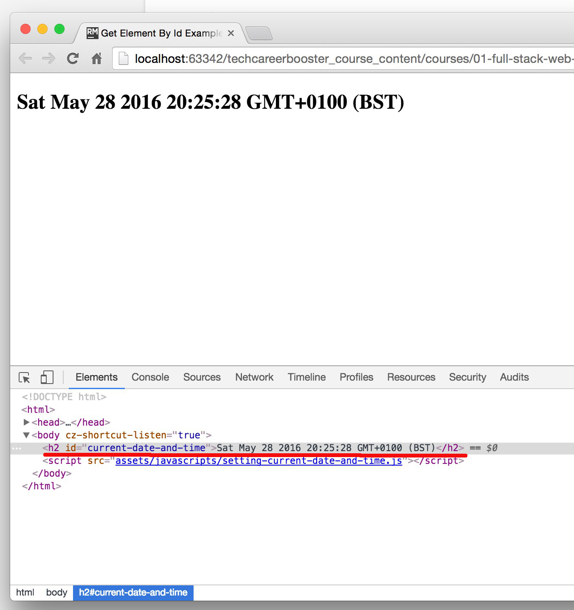

## Execute JavaScript on a Web Page

Let's see how we can execute some JavaScript code on a web page.

Write the following HTML page:

``` html
<!DOCTYPE html>
<html>
  <head>
    <meta charset="utf-8">
    <meta name="viewport" content="width=device-width, initial-scale=1.0">
    <title>Running JavaScript On HTML Page Using Script Block</title>
  </head>
  <body>
    <p>
      Running JavaScript using a script block
    </p>

    <script>
      console.log("Hello World");
    </script>
  </body>
</html>
```

Save the above content into a file `index.html` and load the page on your browser. Make sure that you have the Chrome developer tools open and the console tab enabled.
What you will see will be this:



As you can see, the message `"Hello World"` is displayed in the console area. This is thanks to the
 
```
<script>
  console.log("Hello World");
</script>
```

script block that is included inside the HTML page.

Generally, whatever appears inside a `<script>` element is considered to be JavaScript code to be executed by the browser.

Let's see another example:

``` html
<!DOCTYPE html>
<html>
  <head>
    <meta charset="utf-8">
    <meta name="viewport" content="width=device-width, initial-scale=1.0">
    <title>Running JavaScript On HTML Page Using Script Block</title>
  </head>
  <body>
    <p>
      Running JavaScript using a script block - Calling alert
    </p>

    <script>
      alert("Hello World");
    </script>
  </body>
</html>
```

If you save and load the above page on your browser, you will see this:




## Calling JavaScript From Files

Usually, we do not write the JavaScript inline with the HTML page source code. But, we prefer to have the JavaScript code written on separate JavaScript files, with filenames ending in `.js`.
An HTML page usually stores its JavaScript related code inside a sub-folder named `assets/javascripts`.

Let's write the previous `alert()` example using a separate JavaScript file.

This is going to be the HTML file:

``` html
<!DOCTYPE html>
<html>
  <head>
    <meta charset="utf-8">
    <meta name="viewport" content="width=device-width, initial-scale=1.0">
    <title>Running JavaScript On HTML Page Using Script Block</title>
  </head>
  <body>
    <p>
      Running JavaScript using a script block - Calling alert
    </p>

    <script src="assets/javascripts/alert.js"></script>
  </body>
</html>
```
and this is going to be the `assets/javascripts/alert.js` file:

``` javascript
alert("Hello World");
```

Save all files and load the HTML page on your browser. You will experience exactly the same behaviour like you did with the previous version, with the inline JavaScript code.

We will use this technique to store our JavaScript code from now on.

Let's proceed with more client-side JavaScript code and interaction with our web page and browser window.

## The Window Object

The `window` object is the main entry point for JavaScript code that will run in a browser. It refers to a browser window or frame.

### `location` property

The `location` property contains the URL of the page that we have visited. Also, it can be used to change the page displayed.

Write the following HTML page:

``` HTML
<!DOCTYPE html>
<html>
  <head>
    <meta charset="utf-8">
    <meta name="viewport" content="width=device-width, initial-scale=1.0">
    <title>Displaying the location property</title>
  </head>
  <body>
    <p>
      Location property
    </p>

    <script src="assets/javascripts/location.js"></script>
  </body>
</html>
```

and the accompanying `assets/javascripts/location.js` file:

``` javascript
alert(window.location);
```

save both and load the page. You will see something like this:
 


The `alert()` displays the value of the URL that exists on your browser, the WEB address of your page loaded.

But as we said, you can change the current page displayed by setting this property to another value. Write the following HTML page

``` html
<!DOCTYPE html>
<html>
  <head>
    <meta charset="utf-8">
    <meta name="viewport" content="width=device-width, initial-scale=1.0">
    <title>Setting the location property</title>
  </head>
  <body>
    <p>
      Setting Location property
    </p>

    <script src="assets/javascripts/setting-location.js"></script>
  </body>
</html>
```

and the corresponding `assets/javascripts/setting-location.js` file:

``` javascript
window.location = "https://www.google.com";
```

Then save all and load the page on your browser. Momentarily, you will see your page displayed, but after fractions of second, you will be looking at "https://www.google.com" 
and not your own page. This is done thanks to the `window.location = "https://www.google.com";` JavaScript statement inside the `assets/javascripts/setting-location.js` file.

> *Note:* `alert()` is a method called on `window`. Same goes for other methods, like `console()`, that are called on the global namespace. They are essentially being
called on the `window` object. You can try that by calling `window.alert("Hello World");` instead of `alert("Hello World");`. The result will be the same. Same goes for
the `location` property. If you just set `location = "https://www.google.com";` the result will be the same.

## `setTimeout()`

The `setTimeout()` method takes two arguments. 

1. A function to be executed after a specified number of milliseconds.
2. The number of milliseconds after which the function will be executed.

This is very useful because it allows us to delay the execution of a function as much as we want. 

Let's see the following example of setting the location property, but only after 2 seconds have elapsed. Change the file `assets/javascripts/setting-location.js` to
be:


``` javascript
setTimeout(function(){
  window.location = "https://www.google.com";
}, 2000);
```

Then load again the page that uses this file. You will see the Google page appearing, only after 2 seconds have elapsed.

> *Note:* If you call the `setTimeout()` function with a time of `0` ms, the function you specify is not invoked right away. 
Instead, it is placed on a queue to be invoked "as soon as possible", after any currently pending event handlers finish running.

## `document`

A very important global property when we are running JavaScript in browsers, is the `document` property. This is an object that represents
the state of the HTML content being displayed on the browser window.

We will see how we can use `document` property to manipulate parts of the content dynamically.

## `document.getElementById()`

The `document.getElementById()` is a very useful method that can return an object representation of an HTML element from the page that is loaded. It retrieves the
element using the id value of the element.

``` javascript
var element = document.getElementById("current-date-and-time");
```

Then we can call the property `.innerHTML`, for example, and set the HTML content of the element at hand.

``` javascript
element.innerHTML = new Date();
```

Let's see the whole program. Here is the HTML page:

``` html
<!DOCTYPE html>
<html>
  <head>
    <meta charset="utf-8">
    <meta name="viewport" content="width=device-width, initial-scale=1.0">
    <title>Get Element By Id Example</title>
  </head>
  <body>
    <h2 id="current-date-and-time">
    </h2>

    <script src="assets/javascripts/setting-current-date-and-time.js"></script>
  </body>
</html>
```

And the `assets/javascripts/setting-current-date-and-time.js` JavaScript file has the following content:

``` javascript
var element = document.getElementById('current-date-and-time');
element.innerHTML = new Date();
```

As you can see, initially, the element `h2` with id `current-date-and-time` does not have any content. But, when we load the page on the browser,
we will see this:



You can see the current date and time displayed as an `h2` header. This is because it has been added by the JavaScript code that we have written inside the
file `assets/javascripts/setting-current-date-and-time.js`. If you see the element on Chrome developer tools after the page has been loaded, you will see this:



But, note that, the source code of the page has not changed. In the source code of the page the `h2` element is empty.

## `setInterval()` and `clearInterval()`

Let's see another very useful `window` method, the `setInterval()`. This is similar to `setTimeout()`. But, instead of firing the function code once,
it fires it repeatedly and forever. The interval between the executions of the function is equal to the duration given as last argument to `setInterval()`.

Let's change the previous program to periodically update the current date and time, every 1 second.

The HTML page content does not change. You have to change the content of the file `assets/javascripts/setting-current-date-and-time.js`. It has to be like this:

``` javascript
setInterval(function() {
  var element = document.getElementById('current-date-and-time');
  element.innerHTML = new Date();
}, 1000);
```

If you now load the HTML page again, you will see the date and time string to being updated every 1 second. (`1000` milliseconds = `1` second).

<div id="media-title-video-updating-date-and-time-dynamically-with-set-interval.mp4">Date And Time Automatically Updated</div>
<a href="https://player.vimeo.com/video/194309687"></a>
           
Note that `setInterval();` returns an object that can be used later on to stop a repetition, using the `clearInterval()` function.

Let's modify the previous JavaScript content to stop the repetition of updating the date and time stamp, after 10 seconds, for example:

``` javascript
var timer = setInterval(function() {
  var element = document.getElementById('current-date-and-time');
  element.innerHTML = new Date();
}, 1000);

setTimeout(function() {
  clearInterval(timer);  
}, 10000);
```

As you can see above:

1. we save the returned value of the `setInterval()` call, into the variable `timer`. Then
2. we call the `setTimeout()` function to register a new timeout handling function, that will be executed 10 seconds later. Its responsibility is 
to clear the timer created by the previous `setInterval()`, a.k.a. the `timer` timer. The clear action is done with `clearInterval()` method.

Try to load you page again. You will see that after 10 repetitions, the date and time is no longer updated.

## Dialog Boxes

`window` object offers 3 methods that have to do with displaying messages to user or getting input from them. We have already seen `alert()`.
The other two methods are: `confirm()` and `prompt()`.

1. The `alert()` method displays a message to the user and user acknowledges and closes the dialog by clicking on the OK button.
2. The `confirm()` method displays a message and allows the user to click on either of two buttons: OK or CANCEL. In both cases the dialog closes,
but if the user closes the dialog with OK, then `true` is returned by `confirm()`. If user closes the dialog with CANCEL, then `false` is returned
by `confirm()`.
3. The `prompt()` displays a message, waits for the user to enter a string and then closes the dialog and returns string given.

Let's try to write a program that demonstrates the use of these dialog boxes:

The HTML page is going to be like that:

``` html
<!DOCTYPE html>
<html>
  <head>
    <meta charset="utf-8">
    <meta name="viewport" content="width=device-width, initial-scale=1.0">
    <title>Using Dialog Methods</title>
  </head>
  <body>
    <p>
      Using Dialog Methods
    </p>

    <script src="assets/javascripts/using-dialog-methods.js"></script>
  </body>
</html>
```

And the JavaScript code stored inside `assets/javascripts/using-dialog-methods.js` will be like that:

``` javascript
var name = prompt("What is your name?");
if (name !== "null") {
    var answer = confirm(name + ", do you want me to display a random number?");
    if (answer) {
        alert("This is a random number: " + Math.random());
    }
}
```

If you save the above and load the page on your browser you will experience something like this:

<div id="media-title-video-using-dialog-methods.mp4">Using Dialog Methods</div>
<a href="https://player.vimeo.com/video/194309773"></a>
           
If you study the above code you will understand the following:

1. The `var name = prompt("What is your name?");` displays a dialog to the user to ask his name. Whatever user gives, is stored in the variable `name`.
2. If the user gives something as a name (`name !== "null"`), then we display a new dialog box to user, with the question whether he wants to be presented
with a random number. On that new dialog box, user is allowed to select either `cancel` or `ok`. If he selects `ok`, `true` is saved on `answer` variable.
Otherwise, `false` is saved on `answer` variable.
3. According to `answer` value, we either display a third dialog or not.

## Opening and Closing Windows

You can open a new window (or tab, this is a browser configuration setting) using the `open()` method on the `window` object.

Let's try the following: The HTML page content:

``` javascript
<!DOCTYPE html>
<html>
  <head>
    <meta charset="utf-8">
    <meta name="viewport" content="width=device-width, initial-scale=1.0">
    <title>Opening Windows</title>
  </head>
  <body>
    <p>
      Open a blank window after 2 seconds.
    </p>

    <script src="assets/javascripts/opening-windows.js"></script>
  </body>
</html>
```

With the `assets/javascripts/opening-windows.js` content to be:

``` javascript
setTimeout(function() {
  var new_window =  window.open();
}, 2000);
```

If you load the above page on your browser, you will see your page being open, and after 2 seconds, a new window (or tab) appearing, having load a blank page
(or you default browser start page).

<div id="media-title-video-opening-a-blank-window.mp4">Opening a blank window</div>
<a href="https://player.vimeo.com/video/194306297"></a>

The `window.open()` without any arguments opens a window with a blank page loaded. But, you can give as first argument the URL to a web page that you would like 
being opened. Let's do that. We will change our `assets/javascripts/opening-windows.js` page to open "http://www.nationalgeographic.com" page.

``` javascript
setTimeout(function() {
  var new_window =  window.open("http://www.nationalgeographic.com");
}, 2000);
```

If you reload your page, you will see, after 2 seconds, the National Geographic page to be open on a new window/tab.

<div id="media-title-video-opening-new-window-with-specific-page.mp4">Opening a new window with a specific page loaded</div>
<a href="https://player.vimeo.com/video/194306809"></a>
           
The `window.open()` method returns a window handle that can be used, later on, to close the window. Let's try that. The following program opens a new window after 2 seconds
the page loads, and then, after 10 more seconds, it closes it. Let's change the `assets/javascripts/opening-windows.js` content as follows:

``` javascript
setTimeout(function() {
  var new_window =  window.open("http://www.nationalgeographic.com");

  setTimeout(function() {
    new_window.close();
  }, 10000);

}, 2000);
```

If you save the above JavaScript code and you reload the page, you will see something like this:

<div id="media-title-video-opening-and-closing-a-window.mp4">Opening and Closing a Window</div>
<a href="https://player.vimeo.com/video/194306543"></a>

The `open()` function, can take as a second argument a window name. This is something that can uniquely identify, programmatically, the window in a friendly way.
Note that this is not the window title. Also, it can take a 3rd argument which are options that have to do with how the window should be created.

Let's try another example. Update the file `assets/javascripts/opening-windows.js` with the following content:

``` javascript
setTimeout(function () {
    var new_window = window.open("http://www.nationalgeographic.com",
        "national geographic",
        {
            menubar: false,
            width: 640,
            height: 480,
            top: 250,
            left: 250
        });

}, 2000);
```

On the above content, we name the new window "national geographic". Also, we disable the menu bar and we set the size of the window and its position.

If you save the above file and load the page on your browser, you will see something like this:

<div id="media-title-video-opening-a-new-window-with-custom-size-and-position.mp4">Opening a new window with custom size and position</div>
<a href="https://player.vimeo.com/video/194306370"></a>

As you can see, the window now is open on a new window (rather than new tab). This is because we have specified its size and its position.

