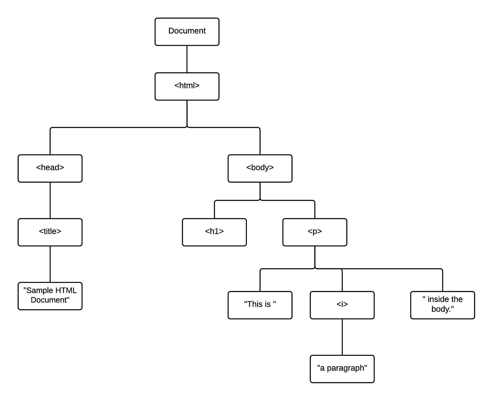
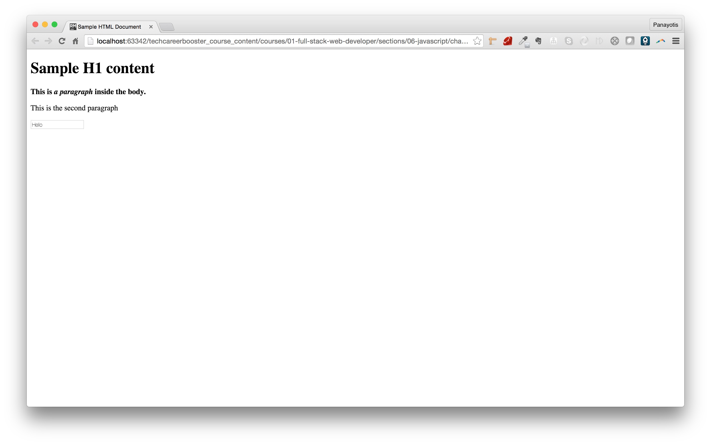
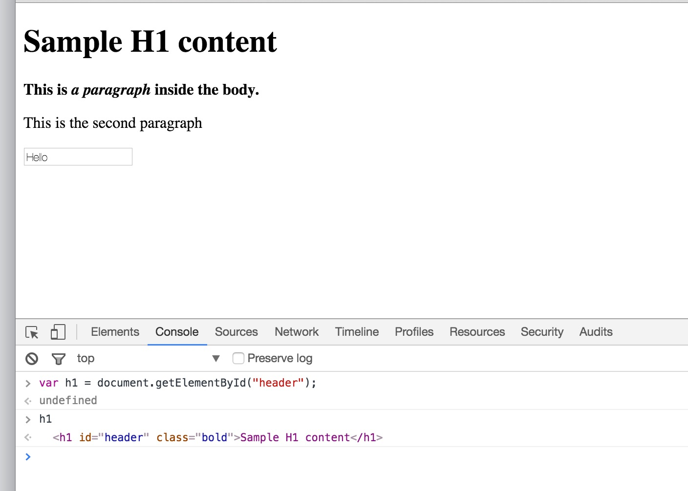
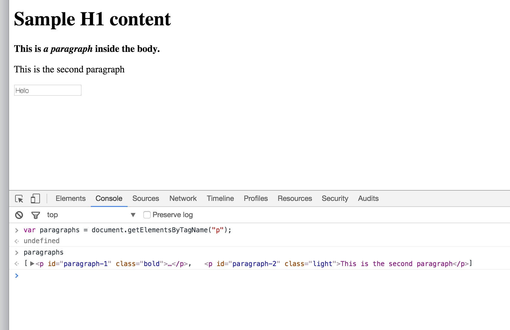
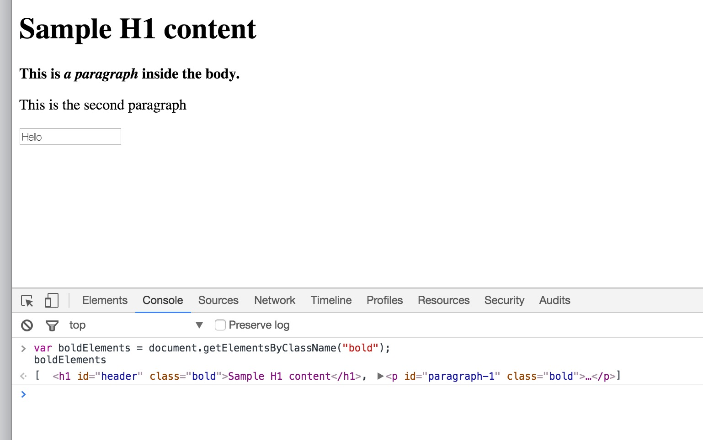
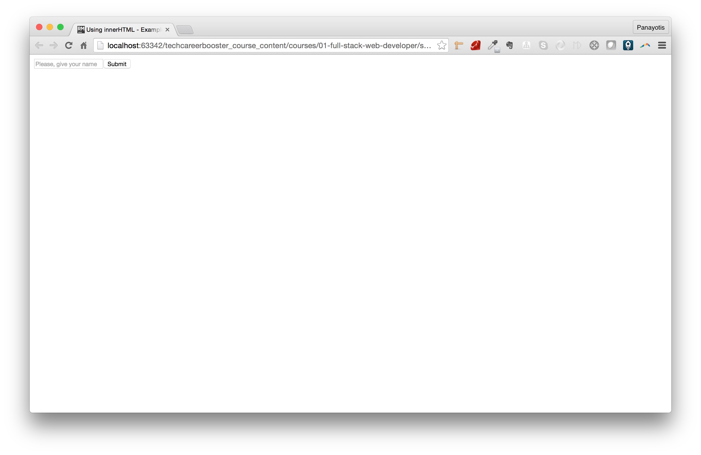

## DOM

The DOM (Document Object Model) is a JavaScript object that is used to represent an HTML document.

> *Note:* Actually, it is used to represent an XML document too. But, for the purpose of this course,
we will stay to its HTML document aspect.

It is the variable `document` that actually holds the whole HTML structure in DOM representation.

The DOM represents an HTML document in a similar way to the way the HTML document is structured.

Lets assume that we have the following HTML document:

```
<html>
  <head>
    <title>Sample HTML Document</title>
  </head>
  <body>
    <h1>Sample H1 content</h1>
    <p>This is <i>a paragraph</i> inside the body.</p>
  </body>
</html>
```

As you already know, the HTML document has a tree-like structure organization of its elements.
For example, everything belongs to the `<html>` element. So, the `<html>` element can be considered the
parent of all other elements. `<html>` element has 2 children. 1 `<head>` element and 1 `<body>` element.
And so on.

We can visualize the tree structure of the HTML content of the above document as follows:



## Selecting Elements of The DOM

Let's write the following HTML page.

``` html
<!DOCTYPE html>
<html>
  <head>
    <title>Sample HTML Document</title>
    <link href="assets/stylesheets/main.css" rel="stylesheet" type="text/css">
    <script src="assets/javascripts/main.js"></script>
  </head>
  <body>
    <h1 id="header" class="bold">Sample H1 content</h1>
    <p id="paragraph-1" class="bold">This is <i>a paragraph</i> inside the body.</p>

    <p id="paragraph-2" class="light">This is the second paragraph</p>

    <input type="text" value="Hello" class="light"/>
  </body>
</html>
```

with the `assets/stylesheets/main.css` being:

``` css
.bold {
    font-weight: bolder;
}

.light {
    font-weight: lighter;
}
```

> *Note:* Initially, the `assets/javascripts/main.js` file is empty.

If you save the above files and load the page on your browser, you will see this:



### Selecting Elements by Id

`document` offers a way for you to select an element by its id. It is the method `getElementById()` which takes as input the id of the element you want to select.

While you have the page loaded, open the Chrome developer tools, on tab Console, and give the following commands:

```
var h1 = document.getElementById("header");
h1
```



The JavaScript command `var h1 = document.getElementById("header");` locates the HTML element that has id `"header"` and returns that and saves it inside the variable `h1`.

### Selecting Elements by Tag

Another way to select elements from the DOM is by tag. For example, you can select all the paragraph elements. Try the following command
on Chrome developer tools console for the page already loaded:

``` javascript
var paragraphs = document.getElementsByTagName("p");
paragraphs
```
If you do that, you will get something like this:



As you can see above, the result is an Array of paragraphs. The `getElementsByTagName()` method, always returns an array, because the tag names are not unique within an HTML document.

### Selecting Elements by Class

Another way you can select elements is by a CSS class name. Let's try the following:

``` javascript
var boldElements = document.getElementsByClassName("bold");
boldElements
```

If you run the above on the console tab, you will get something like this:



Again, the result of `getElementsByClassName()` is an array, because there might be many elements in the HTML document having the same class.

### Selecting By any CSS Selector

Finally, we will see how we can select an element by any CSS selector. The method that we can use is `querySelectorAll()`. It takes as argument any CSS selector.

Let's run the following command on console:

``` javascript
var elementsWithSpecificValue = document.querySelectorAll("[value=Hello]");
elementsWithSpecificValue
```


As you can see above, the `querySelectorAll("[value=Hello]");` returns all the elements that have the attribute `value` with the value `"Hello"`. It returns an array with one
element, because it is only one element with that attribute and that value.

## Element Content As HTML

You can dynamically set the content of an HTML element using the `innerHTML` property. The `innerHTML` can be assigned any valid HTML content. It will be parsed and the
result will be presented by the browser.

Let's see the following example. Assume that we have following HTML page:

``` html
<!DOCTYPE html>
<html>
  <head>
    <title>Using innerHTML - Example</title>
    <link href="assets/stylesheets/main.css" rel="stylesheet" type="text/css">
  </head>

  <body>
    <form>
      <div id="form-input-container">

      </div>
    </form>

    <script src="assets/javascripts/using-inner-html.js"></script>
  </body>
</html>
```

with the accompanying `assets/javascripts/using-inner-html.js` file being:

``` javascript
var formInputContainer = document.getElementById('form-input-container');
formInputContainer.innerHTML = '<input type="text" name="name" placeholder="Please, give your name"/><button type="submit">Submit</button>';
```

If you load the above page on your browser, you will see this:



Although you can see the input and the button controls, these are not there in the source code of the HTML page. They are being added
dynamically, at the end of rendering the HTML page content, with the use of the JavaScript command:

```
formInputContainer.innerHTML = '<input type="text" name="name" placeholder="Please, give your name"/><button type="submit">Submit</button>';
```

A HTML string literal (`'<input type="text" name="name" placeholder="Please, give your name"/><button type="submit">Submit</button>'`) is assigned as value to the
property of the element `formInputContainer`. This element has been located with the help of the `getElementById()` method.


