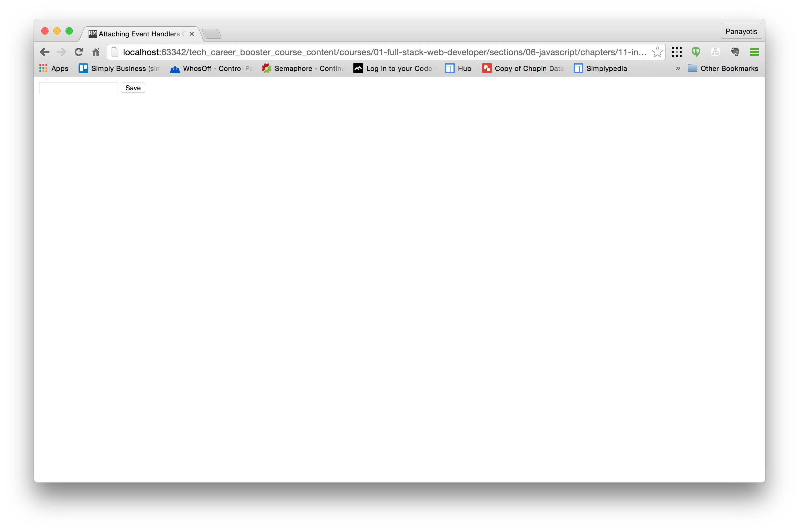
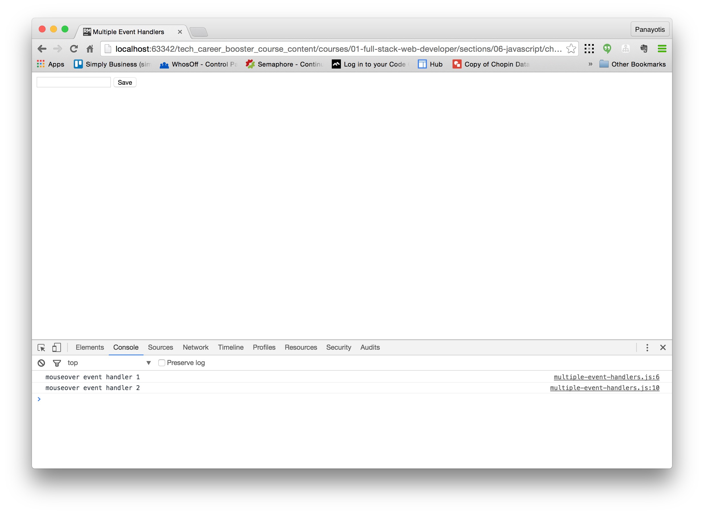

Initially, let's go through some definitions around events and event handling.

## Event-driven Programming

Client-side JavaScript programs use an asynchronous event-driven programming model. In this style of programming, the web browser generates an event
whenever something interesting happens to the document or browser or to some element or object associated with it.
For example, the web browser generates an event when it finishes loading a document, when the user moves the mouse over a hyperlink,
or when the user strikes a key on the keyboard. If a JavaScript application cares about a particular type of event, it can register one or
more functions to be invoked when events of that type occur. These functions are called event handlers.

## Event Type

The *event type* is a string that specifies the kind of event that occurred. The type "mousemove" for example, indicates that the user
has moved their mouse pointer. The type "keydown" means that a key on the keyboard has been pushed down. The event type is sometimes called
*event name*.

## Event Target

The *event target* is the object on which the event occurred or with which the event is associated. When we speak of an event,
we must specify both the type and the target. A load event on a Window, for example, or a click event on a `<button>` Element.
Window, Document, and Element objects are the most common event targets in client-side JavaScript applications, but some
events are triggered on other kinds of objects.

## Event Handler or Event Listener

The *event handler* or *event listener* is a function that handles or responds to an event. Applications register their event handler functions with the web browser,
specifying an event type and an event target. When an event of the specified type occurs on the specified target, the browser invokes the handler.
When event handlers are invoked for an object, we sometimes say that the browser has *fired*, *triggered*, or *dispatched* the event.
There are a number of ways to register event handlers.

## Event Object

An *event object* is an object that is associated with a particular event and contains details about that event. Event objects are passed as
an argument to the event handler function. All event objects have a *type* property that specifies the event type and a *target* property
that specifies the event target. Each event type defines a set of properties for its associated event object. The object associated with a mouse event, for example,
includes the coordinates of the mouse pointer. Or the object associated with a keyboard event contains details about the key that was pressed and the
modifier keys that were held down. Many event types define only a few standard properties — such as *type* and *target* — and do not carry much other useful information.
For those events it is the simple occurrence of the event, not the event details, that matter.

## Event Propagation

*Event propagation* is the process by which the browser decides which objects to trigger event handlers on. For events that are specific to a single object
(such as the load event on the Window object), no propagation is required. When certain kinds of events occur on document elements, however, they propagate
or “bubble” up the document tree. If the user moves the mouse over a hyperlink, the `mousemove` event is first fired on the `<a>` element that defines that link.
Then it is fired on the containing elements: perhaps a `<p>` element, a `<div>` element, and the Document object itself.

It is sometimes more convenient to register a single event handler on a Document or other container element than to register handlers on each individual element
you’re interested in. An event handler can stop the propagation of an event, so that it will not continue to bubble and will not trigger handlers on containing elements.


As you can see on the above example, when a `mouseover` event occurs on a link `<a>`, then this will be handled by any event handler registered for that event type
on that event target. If there is no event handler, or if there is but event handler lets the event bubble up, then event will bubble up to the parent element.
And so on. We will see and practice this event bubbling later in this chapter.

## Default Actions and Cancelling an Event

Some events have default actions associated with them. When a `click` event occurs on a hyperlink, for example, the default action is for the browser to
follow the link and load a new page. Event handlers can prevent this default action by returning an appropriate value, or invoking a method of the event object,
or by setting a property of the event object. This is sometimes called *canceling the event*.

Having done this introduction to core definitions, we now proceed in learning how to register and implement an event handler. Note that this chapter is only
an introduction to event handling with core JavaScript. In jQuery chapter, we will learn how to handle events using jQuery methods.

## Registering Event Handlers

There are basically two methods to register an event handler.

1. By setting the event function handler as a value for a property of the event target. The name of the property you set the value for starts with `on`
and is followed by the event name. For example, if you want to register an event handler for the `mouseover` event, you need to set the event handler
as value of the property `onmouseover`.
2. By calling the standard method `addEventListener()`.

### Setting an event handler as value of event handling property

Let's see the first method. Let's try the following example:

The HTML page:

``` html
<!DOCTYPE html>
<html>
    <head>
        <meta charset="utf-8">
        <meta name="viewport" content="width=device-width, initial-scale=1.0">
        <title>Attaching Event Handlers On Properties</title>
        <script src="assets/javascripts/main.js"></script>
    </head>
    <body>
        <form>
            <input type="text" name="firstName"/>
            <button type="submit" id="save-button">Save</button>
        </form>
    </body>
</html>
```

and the corresponding `assets/javascripts/main.js` with the following content:

``` javascript
window.onload = function() {

    var formButton = document.getElementById('save-button');

    formButton.onclick = function() {
        var answer = confirm('Are you sure that you want to save this?');
        if (answer) {
            formButton.innerHTML = "Saved";
            formButton.disabled = true;
        }
        return false; // Does let the event bubble up and does not let run the default handler.
    };

};
```

If you load the HTML page on your browser, you will see this:



You can see the input text and the button.

The JavaScript code in the `assets/javascript/main.js` file does the following:

1. Registers an event handler for the event `load` on event target `window`. This basically means that this handler is going to fire after the
page content has been loaded by the browser.
2. When the 'load' event handler fires, it tries to locate the form button with the following piece of code `var formButton = document.getElementById('save-button');`    
which is pretty straightforward, if one sees that the `<button>` element on the page has the id `save-button`.
3. Then it registers a handler on the `click` event for the button target. The handler asks the user whether he wants to save
the data or not. If the user answers "Yes/Ok", then we change the label of the button from "Save" to "Saved" and we disable
the button by setting its `disabled` property to `true`.
4. In any case (with answer "Yes" or with answer "No"), we return `false` from the `click` handler indicating to the browser that
it should not invoke the default action, and that we handled the event. In other words, the event does not need further handling.

If you load the page and click on the button, you will experience something like this:

<div id="media-title-video-attaching-events-on-event-handling-properties.mp4">Attaching Events on Event Handling Properties</div>
<a href="https://player.vimeo.com/video/194303882"></a>          
           
> **Important:** It is very important to code so that your event handler registers when the page has loaded. That's why, we
attach the event handler to button from inside another event handler that fires when the "load" event on "window" target takes
place. Otherwise, the element `save-button` might not have been loaded yet. Attaching the code on `load` event of `window`, you
make sure that the elements of your document exist at the time the code is executed.

### Using `addEventListener()`

The problem with the above technique to attach event handlers is that each target can only have at most one handler for the same event type.
If you want to have multiple event handlers for the same event type and target, you can use the `addEventListener()` method.

Let's try an example:

Assume the same HTML page as before, but we now link to file `assets/javascripts/multiple-event-handlers.js`:

``` javascript
window.onload = function () {

    var formButton = document.getElementById('save-button');

    formButton.addEventListener('mouseover', function () {
        console.log('mouseover event handler 1');
    });

    formButton.addEventListener('mouseover', function () {
        console.log('mouseover event handler 2');
    });

};
```

If you load the HTML page on your browser, and then you move your mouse over the button, you will see two messages printed on the console:



As you can see, the two event handlers are firing, each one printing their own message on the console. The two event handlers have been registered using the
`addEventListener()` method.

The advantage of this technique is that you can attach as many handlers as you like. You are not limited to just one.

Note that if you have both an event handler attached to an event property for a particular event target, and you have also added an event listener
for the particular event type and event target combination, then, browser is going to fire, first, the event handler on the event property and
then the event handler (or handlers) attached using the `addEventListener()` method.

## Event Propagation

When the target of an event is the `window` object, the browser responds to an event simply by invoking the appropriate handlers on that object. 
When the event target is a `document` or document element, however, the situation is more complicated.

After the event handlers registered on the target element are invoked, most events “bubble” up the DOM tree. The event handlers of the target’s parent are invoked. 
Then the handlers registered on the target’s grandparent are invoked. This continues up to the `document` object, and then beyond to the `window` object. 
Event bubbling provides an alternative to registering handlers on lots of individual document elements: instead you can register a single handler on a common 
ancestor element and handle events there. For example, you might register an `change` handler on a `form` element, instead of registering a `change` handler 
for every element in the form.

Most events that occur on document elements bubble. Notable exceptions are the `focus`, `blur`, and `scroll` events. The `load` event on document elements 
bubbles, but it stops bubbling at the `document` object and does not propagate on to the `window` object. The `load` event of the `window` object is 
triggered only when the entire document has been loaded.

Let's do an example in order to see how the bubbling works. Let's suppose that we have the following page:

``` html
<!DOCTYPE html>
<html>
  <head>
    <title>Bubble Demo</title>
    <script src="assets/javascripts/bubble.js"></script>
  </head>
  <body>
    <div>
      <form>
        <button type="submit">Do Something</button>
      </form>
    </div>
  </body>
</html>
```

It is a very simple page that is loading the JavaScript file `assets/javascripts/bubble.js`. It's content is a `div` that has a child a `form` element, which, in turn,
has as child a `button` element.

The content of the JavaScript file is the following:

``` JavaScript
window.onload = function() {
    var button = document.getElementsByTagName("button")[0];
    button.addEventListener('click', function() {
        alert('I am the button and I received a click event');
    });

    var form = document.getElementsByTagName("form")[0];
    form.addEventListener('click', function() {
        alert('I am the form and I received a click event');
    });

    var div = document.getElementsByTagName("div")[0];
    div.addEventListener('click', function() {
        alert('I am the div and I received a click event');
    });

    document.body.addEventListener('click', function() {
        alert('I am the body and I received a click event');
    });

    document.addEventListener('click', function() {
        alert('I am the document and I received a click event');
    });

    this.addEventListener('click', function() {
        alert('I am the window and I received a click event');
    });
};
```

It may look complex, but, if you read the code carefully, you will see:

1. We initially attach a handler on the `window` target for events of type `load`. So, we make sure that our function handler is being called when
all the elements of the HTML document have been loaded and are part of the DOM tree.
2. We are attaching an event handler for event `click` (which means clicking once the mouse button), onto the event target `button`. The handler is basically an alert.
The alert message only confirms that it is an alert triggered when the `button` attached `click`-handler has been fired.
3. We attach a similar `click` event handler to each one of the ancestors of the `button` element. Hence
    1. One handler for the `form` element.
    2. One handler for the `div` element.
    3. One handler for the `body` element. See here how we access `body` through `document`. 
    4. One handler for the `document` element.
    5. One handler for the `window` element. See how we are using `this` keyword to access the current target of the `load` event,
    and use it inside the function handler. We could equally have used `window.addEventListener(...` instead of `this.addEventListener(...`, but we
    did that with `this` to demonstrate the fact that `this`, inside an event handler function, references the actual target of the event.

So, how do we expect this page to behave, if we loaded it on our browser? If the user clicked the button, then we would expect an alert telling us that the
button has been clicked, but then all the rest of the event handlers attached to `button` ancestors, for the same event type, would fire too.

This is how it would work:

<div id="media-title-video-demo-of-event-bubbling.mp4">Demo of Event Bubbling</div>
<a href="https://player.vimeo.com/video/194304258"></a>
           

> *Try this one:* What would happen if you clicked on the document itself, instead of on the button? Try, in other words, to click on the blank white area of the
browser window. Does any event fire? How many?

## Stopping the Event Propagation

Now, let's assume the same example as before, but let's change the handler of the `div` element as follows:

```
// ... previous code remains as it was ...

    var div = document.getElementsByTagName("div")[0];
    div.addEventListener('click', function(event) {
        alert('I am the div and I received a click event');
        event.stopPropagation();
    });

// ... next code remains as it was ...
```

If you reload the page (in order for the update JavaScript code to be in effect), and then you click on the button, you will see the alerts going on up
the ancestor tree being fired, but only up to, and including, the `div` element. The `body`, `document` and `window` event handlers do not fire.


