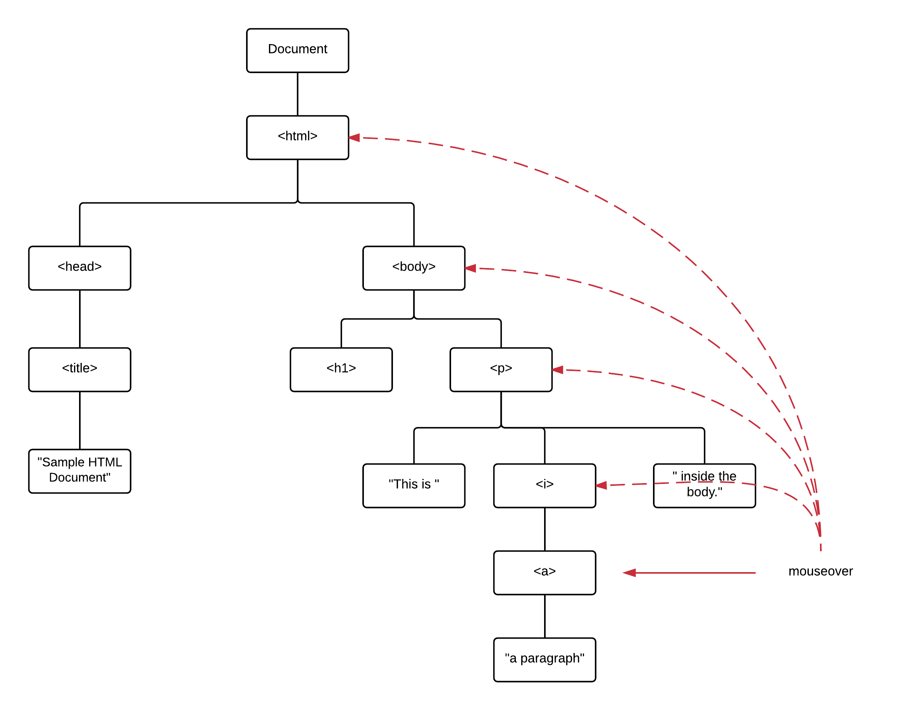

In this chapter, dynamics of our page are getting more interesting. We will teach
you how you can respond to various events. For example, how you can write JavaScript
code that will respond to user click events. 

Also, we are going to teach you how event propagate or bubble up:

How you can cancel an event and how you can handle it on multiple DOM levels.

You will create interesting applications that respond to mouse over or blur and focus events.

Applications like this:

How Application Responds to Various Events

           
