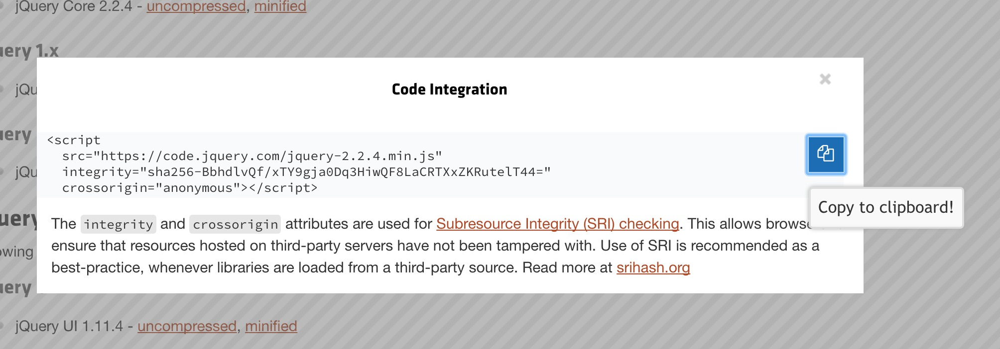
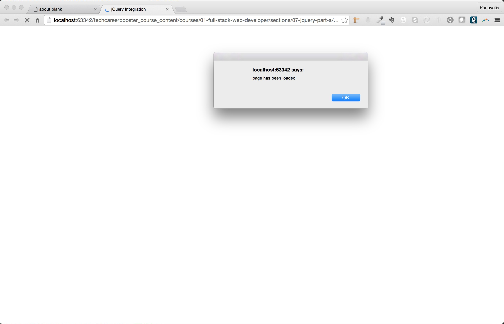
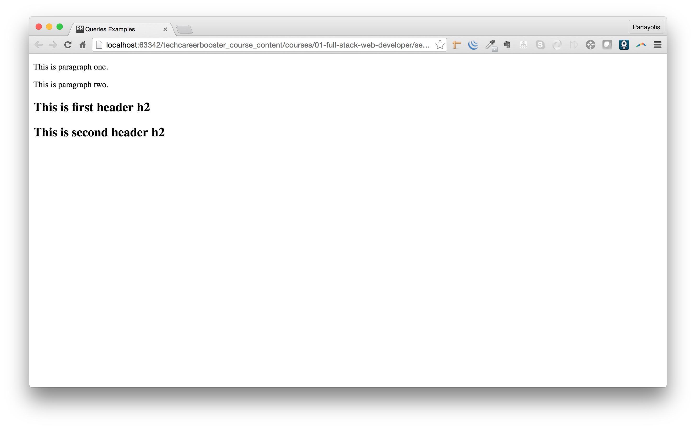
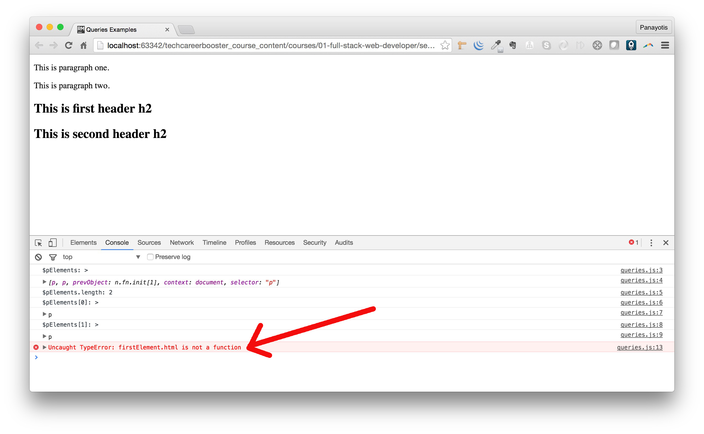
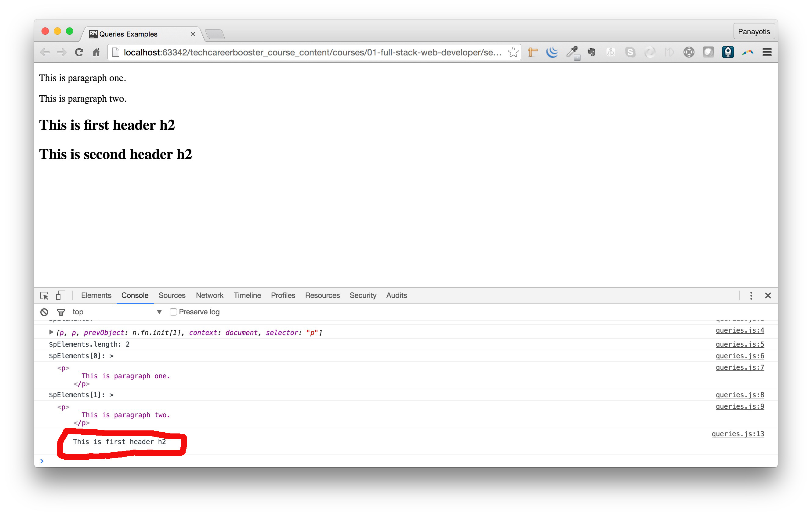
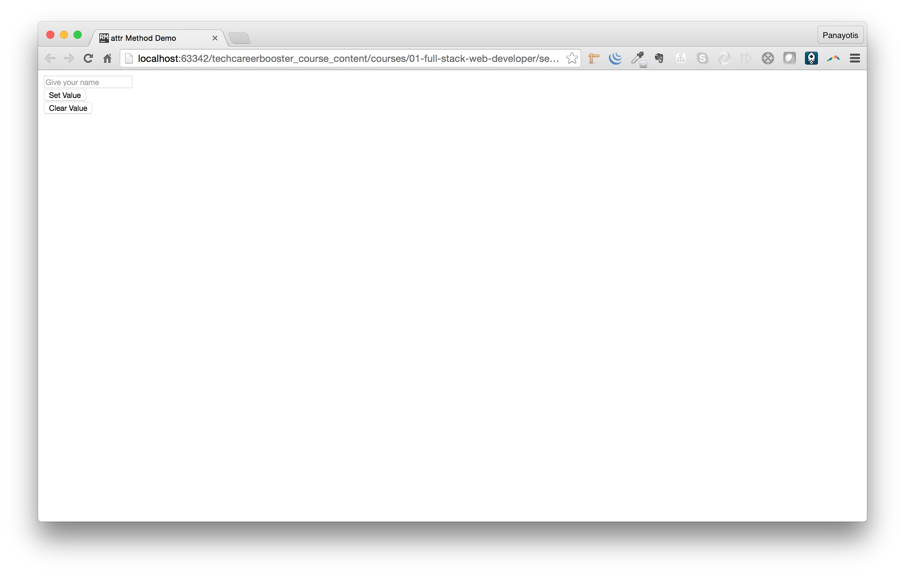
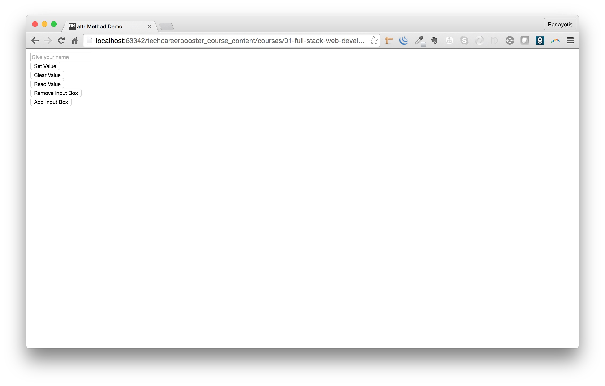
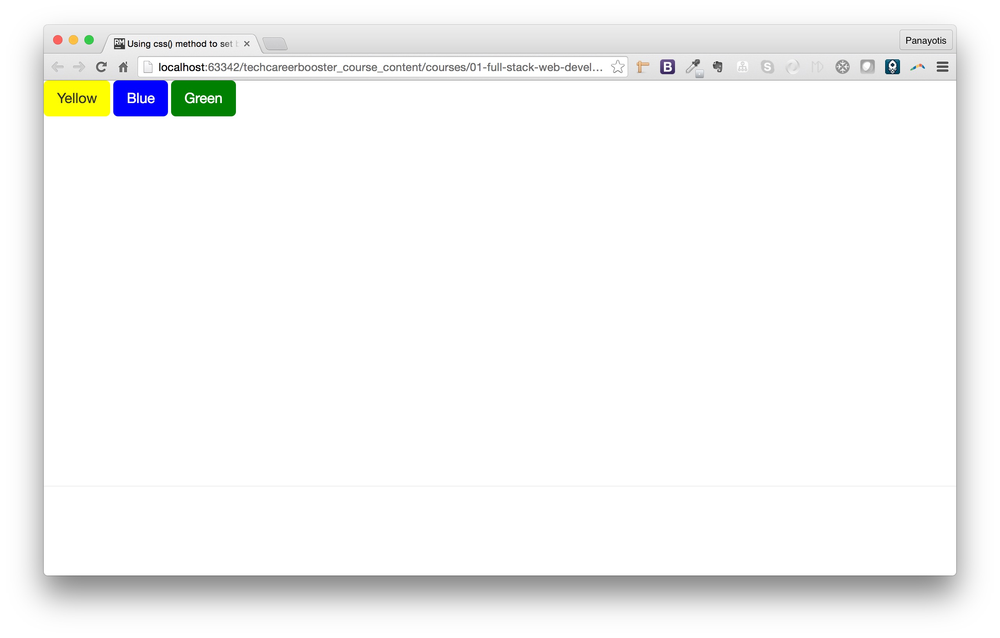
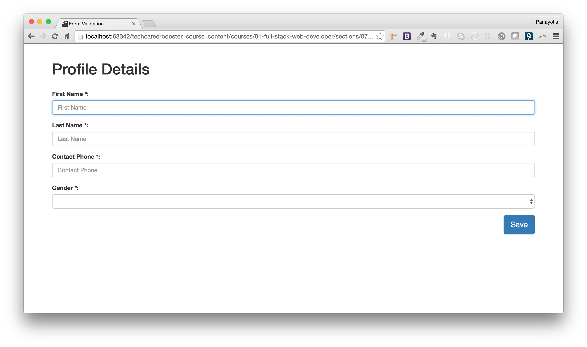
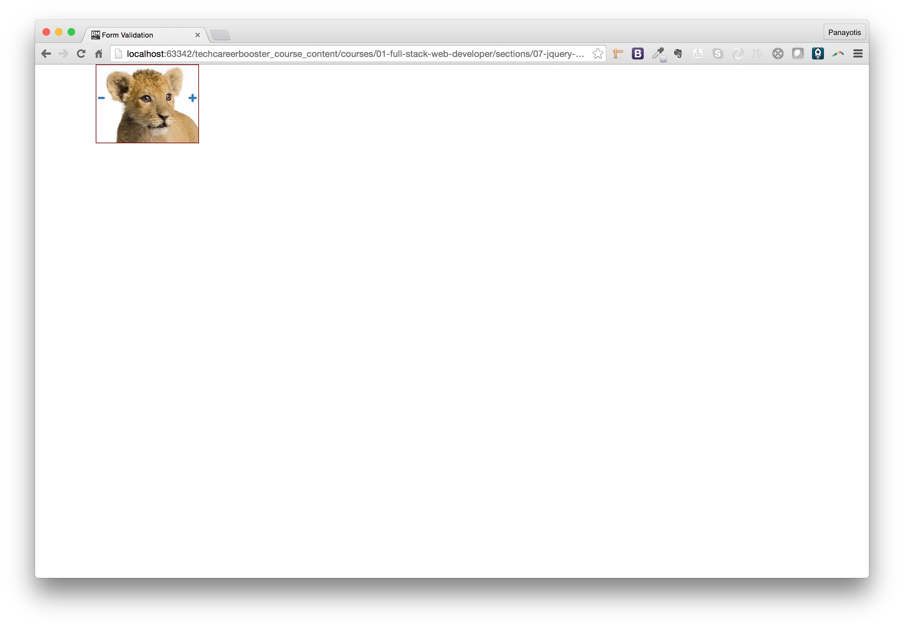

## Introduction

JavaScript has a very simple core API. On the other hand, the client-side API, the one used to write applications executed by the browser, is very
complicated, and the most important problem, is that there are a lot of incompatibilities between browser brands.

Hence, client-side JavaScript developers prefer to use a framework or JavaScript libraries that have been developed to
hide the browser incompatibilities and they offer enriched functionality.

Such a JavaScript library is [jQuery](https://jquery.com).

jQuery makes it easy to find the elements of a document that you care about and then manipulate those elements by adding content, 
editing HTML attributes and CSS properties, defining event handlers, and performing animations. 
It also has Ajax utilities for dynamically making HTTP requests and general-purpose utility functions for working with objects and arrays.

As its name implies, jQuery is based on queries. It allows you to define query criteria, using CSS selectors, that return a specific set
of HTML elements from your document. Then, on the selected HTML elements, you can call various methods in order to manipulate the
particular elements.

## Including jQuery to your HTML document

jQuery is a set of JavaScript functions. Like any JavaScript library, in order for you to use it, you have to include it inside your
HTML document. This is usually done at the `<head>` section of the document using the `<script>` element.

You can download jQuery locally at your machine and then include the local files. Or you can have the `<script>` element reference
the jQuery over the Internet, using a CDN (Content Delivery Network) reference.
 
[On this page here](http://jquery.com/download/#using-jquery-with-a-cdn), you can read how you can reference jQuery via a CDN. There, you
will read that you have to go here: [https://code.jquery.com/](https://code.jquery.com/) in order to get the URL for the jQuery version
that you are interested in.
  

  
We will pick up the following URL to reference jQuery:


It is jQuery version 2.X which is the most mature and widely used as of today. If you click on this link you will see this:



As you can read on the above modal, you need to copy the code that you are being presented with. Copy to your clipboard and than paste into
your HTML page. Here is how HTML page should be:

``` html
<!DOCTYPE html>
<html>
  <head>
    <meta charset="utf-8">
    <meta name="viewport" content="width=device-width, initial-scale=1.0">
    <title>jQuery Integration</title>
    <script src="https://code.jquery.com/jquery-2.2.4.min.js" 
            integrity="sha256-BbhdlvQf/xTY9gja0Dq3HiwQF8LaCRTXxZKRutelT44=" 
            crossorigin="anonymous"></script>
  </head>
  <body>

  </body>
</html>
```

And now, you are ready to use jQuery library methods and functions. Let's see how.

## `jQuery` and `$`

The jQuery library defines a single global function with name `jQuery`. Also, there is a shortcut name `$` that you can use 
instead.

## Selecting And Actioning on HTML Elements

Let's see how we can use the `$` function to select HTML elements on our HTML page and act upon them. Let's start with the following HTML
page content:

``` html
<!DOCTYPE html>
<html>
  <head>
    <meta charset="utf-8">
    <meta name="viewport" content="width=device-width, initial-scale=1.0">
    <title>jQuery Integration</title>
    <script src="https://code.jquery.com/jquery-2.2.4.min.js"
            integrity="sha256-BbhdlvQf/xTY9gja0Dq3HiwQF8LaCRTXxZKRutelT44="
            crossorigin="anonymous"></script>
    <script src="assets/javascripts/main.js"></script>
  </head>
  <body>

  </body>
</html>
```

As you can see above, we have included the `<script>` line that references our own JavaScript code, stored inside `assets/javascript/main.js` file.
This file is currently empty, but we will fill that in with JavaScript code later on. 

> **Important:** You need to first reference and load jQuery libraries and then your own custom JavaScript code that uses jQuery.

Now, inside `assets/javascripts/main.js` write the following JavaScript code:

``` javascript
$(document).ready(function() {
    alert('page has been loaded');    
});
```

This calls the function `$` giving as argument the global variable `document`, hence selecting the `document` to act upon. And then
registers a function handler for the event `ready`. Hence, inside the function handler we write the JavaScript code that we want to
be executed when the document will be ready, a.k.a. all the HTML page elements have been loaded by the browser.

If you save the above and you load the page on your browser, you will see this:



Let's see another example. We enhance our HTML page to have a form with a text input and a button. When the user clicks on the button, we will check the
content of the input box. If it is empty, we will display an alert to the user and we will not submit the form. If the input box value is not
blank, then we will let the form be submitted.

Here is the HTML code with the form:

``` html
<!DOCTYPE html>
<html>
  <head>
    <meta charset="utf-8">
    <meta name="viewport" content="width=device-width, initial-scale=1.0">
    <title>jQuery Integration</title>
    <script src="https://code.jquery.com/jquery-2.2.4.min.js"
            integrity="sha256-BbhdlvQf/xTY9gja0Dq3HiwQF8LaCRTXxZKRutelT44="
            crossorigin="anonymous"></script>
    <script src="assets/javascripts/main.js"></script>
  </head>
  <body>
    <form>
      <label for="first-name">First Name:</label><br/>
      <input type="text" name="first-name" id="first-name"/><br/>
      <button type="submit" id="submit-form-button">Save</button>
    </form>
  </body>
</html>
```

And here is the updated `assets/javascripts/main.js` file:

``` javascript
$(document).ready(function() {
    // Install a handler for the click event on the
    // submit form button.
    $('#submit-form-button').on('click', function(){
        // get access to the input control
        var $inputControl = $('#first-name');
        // get the value of the input control
        var value = $inputControl.val();
        if (value.trim() === "") {
            alert("You need to provide your first name");
            return false; // this "return false" here will prevent the default button "click" handler from being fired
        }
    });
});
```

If you save the above and load the page on your browser, you will experience this:

<div id="media-title-video-example-of-form-validation-with-jquery.mp4">jQuery Example of Form Validation</div>
<a href="https://player.vimeo.com/video/194304630"></a>
           
Here is the list of things you need to be aware of in regards to the jQuery code above:
           
1. Again, all the code is inside the function handler for `ready` on `document` target.
2. With `$('#submit-form-button')` we locate the button element on our form. The selection is done by id, but we can generally use
any selector that would select the element(s) we want.
2. The `$(....)` function call returns a jQuery object and hence we can call jQuery methods on it. Generally, all the jQuery API documentation
can be found [here](https://api.jquery.com/). 
3. On the jQuery object returned by `$('#submit-form-button')` we call the method `on(...)`. The documentation of this method can be found
[here](https://api.jquery.com/on/). You need to start reading the documentation little-by-little. The more you read jQuery documentation the
more you will become familiar with its structure and, after lots of practice, it will be easier for you to deal with it.
4. The `on(...)` method call that we use above, installs an event handler on the matching elements the `on(...)` is called on. In other words,
the `$('#submit-form-button')` returns a collection of matching elements (1 in our case) and the `on('click', function() { ... })` installs
an event handler for `click` event on all those matching elements. Hence, we basically install a `click` handler on the button of the form.
5. What does the `click` handler do?
    1. It locates the input control of the form. This is done with another call to `$(....)` that would take as input the CSS selector locating
    the input control box. It saves the result of this selection to the variable `$inputControl`. It is a common practice to name the variables
    that store jQuery objects with a name that starts with the character `$`. Hence, the developer knows that he can call jQuery methods on that
    particular variable. 
    2. It, then, takes the value of the input control by calling the method `val()` on the jQuery object `$inputControl`. The method `val()` is
    documented [here](https://api.jquery.com/val/). 
    3. The value is saved in the variable with name `value`.
    4. Then it calls the method `trim()` which is a core JavaScript string function. It removes any blanks left and right to the payload of the
    value.
    5. It compares the trimmed value against blank string. If the value is blank, it displays an alert message and returns false. The return of
    false is important, because it will prevent browser from calling the default functionality for form submit buttons, which is to submit the
    form.
    
## Queries and Query Results
    
We have done some selections, queries, in the previous examples. Let's see some more here.

Write the following HTML page:
    
``` html
<!DOCTYPE html>
<html>
  <head>
    <meta charset="utf-8">
    <meta name="viewport" content="width=device-width, initial-scale=1.0">
    <title>Queries Examples</title>
    <script src="https://code.jquery.com/jquery-2.2.4.min.js"
            integrity="sha256-BbhdlvQf/xTY9gja0Dq3HiwQF8LaCRTXxZKRutelT44="
            crossorigin="anonymous"></script>
    <script src="assets/javascripts/queries.js"></script>
  </head>
  <body>
    <p>
      This is paragraph one.
    </p>
    <p>
      This is paragraph two.
    </p>
    <h2>
      This is first header h2
    </h2>
    <h2>
      This is second header h2
    </h2>
  </body>
</html>
```

with initially empty `assets/javascripts/queries.js` file.

If you save the files and load the page on your browser, you will see this:



Now, let's write some JavaScript code that would demonstrate selecting elements with jQuery. Update your `assets/javascripts/queries.js` file as 
follows:

``` javascript
$(function() {
    var $pElements = $('p');
    console.log("$pElements: > ");
    console.log($pElements);
    console.log("$pElements.length: " + $pElements.length);
    console.log("$pElements[0]: > ");
    console.log($pElements[0]);
    console.log("$pElements[1]: > ");
    console.log($pElements[1]);
});
```

If you save the above files and load the page on your browser, you will see this: 

> *Note:* Make sure that when you load the page you have the developer tools open on the console tab.


Let me explain to you what we have done and what you see above.
    
1. The `$(function() {....});` is another way to attach a function handler to the `ready` event of the `document`. So, it is equivalent to

 ```
 $(document).ready(function() {....});
 ```
    
2. We select all the `p` elements with the CSS selector `p`. The jQuery call is `$('p')`. We save the selected or matched elements inside the
variable `$pElements`. 
3. The `$pElements` is a jQuery collection and responds to `length`. This prints the number of matched elements.
4. The `[index]` operator returns the matched element at `index` position. First one being at position `0`. Second one being at position `1` e.t.c.

**Important:** The result of `[index]` operator on a jQuery collection object is not a jQuery object and you can not call jQuery methods on it.
You need to wrap the result to a jQuery object by calling the `$(...)`. Let's continue the above example in order to see what I mean:

Let's add the following JavaScript lines inside the function handler:

``` javascript
var $h2Elements = $('h2');
var firstElement = $h2Elements[0];
console.log(firstElement.html());
```

so that the whole `assets/javascripts/queries.js` file to be:

``` javascript
$(function() {
    var $pElements = $('p');
    console.log("$pElements: > ");
    console.log($pElements);
    console.log("$pElements.length: " + $pElements.length);
    console.log("$pElements[0]: > ");
    console.log($pElements[0]);
    console.log("$pElements[1]: > ");
    console.log($pElements[1]);
    
    var $h2Elements = $('h2');
    var firstElement = $h2Elements[0];
    console.log(firstElement.html());
});
```

With the last 3 lines, 

1. we get the jQuery collection of the `h2` elements: `var $h2Elements = $('h2');`
2. then we get access to the first element of the collection: `var firstElement = $h2Elements[0]`;
3. then we try to get the h2 element HTML content by calling the jQuery method [.html()](https://api.jquery.com/html/).

If you save the above and reload the page on your browser (have the Console tab on developer tools open), you will see that an error
is printed in the console.



Although `$h2Elements` is a jQuery object (collection), the `$h2Elements[0]` is not. Hence, calling the method `.html()` on that fails with the error
that you see on the screenshot above. The `$h2Elements[0]` is a normal HTML DOM element. And you can not call jQuery methods on this. You can, however,
call the function `$(...)` giving as argument the DOM element and get back a jQuery object, on which you can call jQuery methods.

Let's correct the JavaScript content as follows:

``` javascript
$(function() {
    var $pElements = $('p');
    console.log("$pElements: > ");
    console.log($pElements);
    console.log("$pElements.length: " + $pElements.length);
    console.log("$pElements[0]: > ");
    console.log($pElements[0]);
    console.log("$pElements[1]: > ");
    console.log($pElements[1]);

    var $h2Elements = $('h2');
    var firstElement = $h2Elements[0];
    console.log($(firstElement).html());
});
```

Do you see the `$(firstElement).html()` ? This is it. Let's save the files and reload the page on your browser.



You will not see any errors. Instead, you will see the HTML content of the first `h2` element printed in the console.

## Getting and Setting HTML Attributes

The method `.attr()` is used to set a value for a particular attribute on an HTML element. Let's see that in action.

Assume that we have a new HTML page as follows:

``` html
<!DOCTYPE html>
<html>
  <head>
    <meta charset="utf-8">
    <meta name="viewport" content="width=device-width, initial-scale=1.0">
    <title>attr Method Demo</title>
    <script src="https://code.jquery.com/jquery-2.2.4.min.js"
            integrity="sha256-BbhdlvQf/xTY9gja0Dq3HiwQF8LaCRTXxZKRutelT44="
            crossorigin="anonymous"></script>
    <script src="assets/javascripts/attr.js"></script>
  </head>
  <body>
    <form>
      <input type="text" placeholder="Give your name" value="" id="name"/><br/>
      <button id="set-value">Set Value</button><br/>
      <button id="clear-value">Clear Value</button>
    </form>
  </body>
</html>
``` 

with the following JavaScript content inside `assets/javascripts/attr.js` file:

``` javascript
$(document).ready(function() {
    $('#set-value').on('click', function() {
        var $inputBox = $('#name');
        $inputBox.attr('value', 'George');
        return false;
    });
    $('#clear-value').on('click', function() {
        var $inputBox = $('#name');
        $inputBox.attr('value', '');
        return false;
    });
});
```

If you save the above and load the page on your browser, you will see this page:



This page works as follows. If one clicks on button `Set Value` it will display the name `George` in the input box. If one clicks on button
`Clear Value` it will set the value of input box to the blank string. Either is achieved by setting the HTML attribute `value` of the
input control.

The `$inputBox.attr('value', 'George');` calls the method [.attr()](https://api.jquery.com/attr/) on the jQuery referencing the input box and sets the value `George` to the
attribute with name `value`. 

The `$inputBox.attr('value', '');` calls the same method, but sets the value `''` to the attribute with name `value`. 

> *Note:* Again, the `$inputBox` is a jQuery collection of matching elements. What do they match to? They match to the selector that 
we have used here: `$('#name');`. Hence, they are all the elements that have id `name`. Usually, an HTML page has a single element matching
a particular id. In other words, the id is (should be) unique. This means that the collection `$inputBox` contains only one element, a.k.a its
`length` property should return `0`.

The `.attr()` method can also be used to read the value of an HTML attribute. You only have to call that with a single argument, the name of the
attribute the value of which you want to read from.

Let's do another example:

``` html
<!DOCTYPE html>
<html>
  <head>
    <meta charset="utf-8">
    <meta name="viewport" content="width=device-width, initial-scale=1.0">
    <title>attr Method Demo</title>
    <script src="https://code.jquery.com/jquery-2.2.4.min.js"
            integrity="sha256-BbhdlvQf/xTY9gja0Dq3HiwQF8LaCRTXxZKRutelT44="
            crossorigin="anonymous"></script>
    <script src="assets/javascripts/attr.js"></script>
  </head>
  <body>
    <form>
      <input type="text" placeholder="Give your name" value="" id="name"/><br/>
      <div id="value-container"></div>
      <button id="set-value">Set Value</button><br/>
      <button id="clear-value">Clear Value</button><br/>
      <button id="read-value">Read Value</button>
    </form>
  </body>
</html>
```

This page is almost the same as before. We have added a `div` element with empty HTML content and id `value-container`. We have also
added a new button with id `read-value`. We are going to attach a handler on that last button, that would copy the value of the
attribute `value` from the input box and would set it as an HTML content inside the `div` element. This is the new version of our JavaScript
code:

``` javascript
$(document).ready(function() {
    $('#set-value').on('click', function() {
        var $inputBox = $('#name');
        $inputBox.attr('value', 'George');
        return false;
    });
    $('#clear-value').on('click', function() {
        var $inputBox = $('#name');
        $inputBox.attr('value', '');
        var $valueContainer = $('#value-container');
        $valueContainer.html('');
        return false;
    });
    $('#read-value').on('click', function() {
        var $inputBox = $('#name');
        var value = $inputBox.attr('value');
        var $valueContainer = $('#value-container');
        $valueContainer.html(value);
        return false;
    })
});
```

We have updated the JavaScript handlers:

1. The `#clear-value` handler to clear the content of the div `#value-container`. 
2. The `#read-value` handler to take the value of the attribute with name `value` and set it as HTML content of the `#value-container`.

Note that the above JavaScript code has a lot of repetition. We can polish that and keep it a little bit DRY (Don't Repeat Yourself).

``` javascript
$(document).ready(function() {
    var $inputBox = $('#name');
    var $valueContainer = $('#value-container');

    $('#set-value').on('click', function() {
        $inputBox.attr('value', 'George');
        return false;
    });
    $('#clear-value').on('click', function() {
        $inputBox.attr('value', '');
        $valueContainer.html('');
        return false;
    });
    $('#read-value').on('click', function() {
        var value = $inputBox.attr('value');
        $valueContainer.html(value);
        return false;
    })
});
```

As you can see above, at the start of our handler function for `document` `ready`, we save two references. One for the input box and
one for the value container. Then we can reuse those inside the handlers for `click` events on the buttons.

## Removing And Adding Content

> **Important:** Although the above removes some repetition, it does have a caveat. When the function handlers for the click events on the
buttons are invoked, they assume that the `$inputBox` and `$valueContainer` they still point to the input box and div container. But, this
may not be true, if, before the handler code invocation, the input box or the value container is removed from the page.

We will further expand on the previous important note above, by giving an example. We will add one more button on our page that, on click,
will remove the input box. We will then click on that button, and we will see the input box removed. This will make the other buttons
(`Set Value`, `Clear Value`, `Read Value`) not work, obviously, in the absence of the input box. But, even if we add the input box
back (we do that with the introduction of one more button `Add Input Box`), these three buttons (`Set Value`, `Clear Value`, `Read Value`)
will still not be working. Because, their functionality was bound to the collection of elements saved in `$inputBox`, collection built
on previous instance of the button. 

This is easier explained with actual code and run, rather than words. Let's see that.

The new HTML page content, with the new buttons has as follows:

``` html
<!DOCTYPE html>
<html>
  <head>
    <meta charset="utf-8">
    <meta name="viewport" content="width=device-width, initial-scale=1.0">
    <title>attr Method Demo</title>
    <script src="https://code.jquery.com/jquery-2.2.4.min.js"
            integrity="sha256-BbhdlvQf/xTY9gja0Dq3HiwQF8LaCRTXxZKRutelT44="
            crossorigin="anonymous"></script>
    <script src="assets/javascripts/attr.js"></script>
  </head>
  <body>
    <form>
      <input type="text" placeholder="Give your name" value="" id="name"/><br/>
      <div id="value-container"></div>
      <button id="set-value">Set Value</button><br/>
      <button id="clear-value">Clear Value</button><br/>
      <button id="read-value">Read Value</button><br/>
      <button id="remove-input-box-button">Remove Input Box</button><br/>
      <button id="add-input-box-button">Add Input Box</button>
    </form>
  </body>
</html>
```

If you load the page on your browser, you will see this:




And we amend the `assets/javascripts/attr.js` file as follows:

``` javascript
$(document).ready(function() {
    var $inputBox = $('#name');
    var $valueContainer = $('#value-container');

    $('#set-value').on('click', function() {
        $inputBox.attr('value', 'George');
        return false;
    });
    $('#clear-value').on('click', function() {
        $inputBox.attr('value', '');
        $valueContainer.html('');
        return false;
    });
    $('#read-value').on('click', function() {
        var value = $inputBox.attr('value');
        $valueContainer.html(value);
        return false;
    });
    $('#remove-input-box-button').on('click', function() {
        $inputBox.remove();
        return false;
    });
    $('#add-input-box-button').on('click', function(){
        var $form = $('form');
        $form.prepend('<input type="text" id="name" placeholder="Give your name" value=""/>');
        return false;
    });
});
```

Basically, we have added the following two blocks of code:

``` javascript
$('#remove-input-box-button').on('click', function() {
    $inputBox.remove();
    return false;
});
$('#add-input-box-button').on('click', function(){
    var $form = $('form');
    $form.prepend('<input type="text" id="name" placeholder="Give your name" value=""/>');
    return false;
});
```

The first block of code uses the [.remove()](http://api.jquery.com/remove/) jQuery method. This removes the selected elements from the HTML document.
On our particular case, it will remove the input box, since it is called on `$inputBox`.

The second block of code uses the [.prepend()](http://api.jquery.com/prepend/) jQuery method. This method adds, dynamically, HTML content to the 
document, to your page. The HTML content is given as first argument and it is added as first child to the selected elements. Since we call
prepend as `$form.prepend(....)`, the content given as first argument will be added as first child of the `form` element. In other words,
this second block of code adds the input button back. The important detail here is that it adds it with the same id, `name`.

We will save all the above content and reload the page on our browser. 

1. We will use the first three buttons (`Set Value`, `Clear Value`, `Read Value`) that work with the input box and the div container.
2. Then we will remove the button by clicking on the `Remove Input Box` button.
3. Then we will use the first three buttons again and we will see that they will not be doing anything.
4. Then we will add the input box back again, by clicking the `Add Input Box` button.
5. Finally, we will use the first three buttons again, and we will still see that these buttons don't do anything. Again, that being
because their code refers to the old instance of the button, as it was captured in the variable `$inputBox`, and not to the new
button added dynamically by the `Add Input Box` handler.

Watch the video to see this page in action:

<div id="media-title-video-dynamically-removing-adding-button.mp4">Removing And Adding Content Dynamically</div>
<a href="https://player.vimeo.com/video/194304493"></a>

As you can see, the newly added content (the input box in our case) is not referred by jQuery collections that have been constructed
before their introduction. How can we fix that?

Obviously, the solution is to remove the collection references from the top of the `document` `ready` handler and put them back, again, inside
the button handlers:

``` javascript
$(document).ready(function() {
    $('#set-value').on('click', function() {
        var $inputBox = $('#name');
        $inputBox.attr('value', 'George');
        return false;
    });
    $('#clear-value').on('click', function() {
        var $inputBox = $('#name');
        $inputBox.attr('value', '');
        var $valueContainer = $('#value-container');
        $valueContainer.html('');
        return false;
    });
    $('#read-value').on('click', function() {
        var $inputBox = $('#name');
        var value = $inputBox.attr('value');
        var $valueContainer = $('#value-container');
        $valueContainer.html(value);
        return false;
    });
    $('#remove-input-box-button').on('click', function() {
        var $inputBox = $('#name');
        $inputBox.remove();
        return false;
    });
    $('#add-input-box-button').on('click', function(){
        var $form = $('form');
        $form.prepend('<input type="text" id="name" placeholder="Give your name" value=""/>');
        return false;
    });
});
```

If you save the above and try to work the page buttons, remove and add dynamically the input box, you will see that the three buttons
(`Set Value`, `Clear Value`, `Read Value`) work as expected, even after the input box is added back dynamically.

## Getting and Setting CSS Attributes

Earlier on, we have learnt about the `.attr()` method that can be used to get or set the value of an HTML element attribute. There is an
equivalent method, [.css()](http://api.jquery.com/css/) which can be used to get and set CSS properties for selected elements.

Let's do an example. Here is the HTML page:

``` html
<!DOCTYPE html>
<html>
  <head>
    <meta charset="utf-8">
    <meta name="viewport" content="width=device-width, initial-scale=1.0">
    <title>Using css() method to set background color</title>
    <!-- Bootstrap CSS files -->
    <link rel="stylesheet" href="https://maxcdn.bootstrapcdn.com/bootstrap/3.3.6/css/bootstrap.min.css"
          integrity="sha384-1q8mTJOASx8j1Au+a5WDVnPi2lkFfwwEAa8hDDdjZlpLegxhjVME1fgjWPGmkzs7" crossorigin="anonymous">
    <!-- Custom CSS -->
    <link rel="stylesheet" href="assets/stylesheets/main.css" type="text/css">

    <!-- jQuery -->
    <script src="https://code.jquery.com/jquery-2.2.4.min.js"
            integrity="sha256-BbhdlvQf/xTY9gja0Dq3HiwQF8LaCRTXxZKRutelT44="
            crossorigin="anonymous"></script>

    <!-- Custom JavaScript -->
    <script src="assets/javascripts/bg-color.js"></script>
  </head>
  <body>
    <div id="buttons-container">
      <button class="btn btn-lg bg-yellow" data-class="change-bg-color-button">Yellow</button>
      <button class="btn btn-lg bg-blue color-white" data-class="change-bg-color-button">Blue</button>
      <button class="btn btn-lg bg-green color-white" data-class="change-bg-color-button">Green</button>
    </div>

    <div id="color-container" class="page-header">
    </div>
  </body>
</html>
```

It references, besides Bootstrap and jQuery, a local CSS and a local JavaScript file. The local CSS file is:

``` css
* {
    box-sizing: border-box;
}

body, html {
    height: 100%;
}

#buttons-container {
    min-height: 30px;
}

#color-container {
    margin-top: 30px;
    margin-bottom: 30px;
    height: 70%;
}

.bg-yellow {
    background-color: Yellow;
}

.bg-blue {
    background-color: Blue;
}

.bg-green {
    background-color: Green;
}

.color-white {
    color: White;
}
```

Assume, initially, that the local JavaScript file (`assets/javascripts/bg-color.js`) is empty. If you save the files and load the page on your browser
you will see this:



What we want the page to do is the following. We want to click on any of the buttons and have the `div` with id `color-container` to be filled in
with the corresponding background color. Like that:

<div id="media-title-video-setting-background-color-with-css-method.mp4">App To Change Background Color</div>
<a href="https://player.vimeo.com/video/194307358"></a>

How would we implement such an application?

Reading the HTML code above, pay attention to the following:

1. We reference Bootstrap CSS. This will allow us to use the classes `btn` and `btn-lg`, as well as the class `page-header`.
2. We reference jQuery. This will allow us to build the dynamic behaviour of our page.
3. We have three buttons that they do not have their own id. But they have the same `data-class`. HTML element attributes that start 
with `data-` are usually used to declare custom HTML attributes (vs standard HTML attributes). We will use the value of `data-class` to
select all the `buttons` on this page in order to attach to all of them the same functionality: When a button is clicked, we will be
setting the background color of the `color-container` `div`. The bg color will be set to the value that is inside the HTML content
of the corresponding button.

Let's implement this using JavaScript. Put the following JavaScript content inside the `assets/javascripts/bg-color.js` file:

``` javascript
$(document).ready(function() {
    $("[data-class=change-bg-color-button]").on('click', function() {
        var color = $(this).html();
        var $colorContainer = $('#color-container');
        $colorContainer.css('background-color', color);
        return false;
    });
});
```

If you save the above and you reload the page on your browser, then you are ready to enjoy the dynamic behaviour of your page.
Every time you click on a button, the corresponding color is set as background color of the `div` below.

If you read the JavaScript code above carefully, you will see that it is all very easy and simple. 

1. We select all the buttons: `$("[data-class=change-bg-color-button]")`. We could have equally done `$('button')`, but for educational
reasons, we decided to use the technique to select based on the value of an attribute.
2. On the matched button elements, we attach an event handler for the `click` event. 
3. Inside the event handler, the `this` keyword points to the target of the event. The target of the event is one of the buttons. 
4. We wrap the target of the event, the button, into a jQuery object (`$(this)`) and then we call the method `.html()` on that 
in order to get the value of its HTML content. We save that into a variable `color`.
5. Then, we locate the `color-container` `div`(`var $colorContainer = $('#color-container');`) and
6. We set its `background-color` to have the value stored inside `color` variable. The setting is done with the help of the method `.css()`.
7. Finally, we return `false` to make sure that the default handler for the button is not triggered.

Easy, isn't it?

With `.css()` method you can set any CSS attribute that you can usually set via CSS properties. 

## Getting and Setting CSS Classes

We can definitely use the `.attr()` method to set a value for the `class` attribute of an HTML element. However, jQuery provides a series
of convenience method that deal with this very popular attribute:

1. [.addClass()](http://api.jquery.com/addClass/). It is used to add a class to an HTML element.
2. [.removeClass()](http://api.jquery.com/removeClass/). It is used to remove a class from an HTML element.
3. [.toggleClass()](http://api.jquery.com/toggleClass/). It is used to add a class that does not exist and remove a class that exists.
  
These methods are very useful. Adding and removing classes dynamically can change many aspects of the appearance of your HTML page at once.
    
Let's try an example. Here is the HTML page:
    
``` html
<!DOCTYPE html>
<html>
  <head>
    <meta charset="utf-8">
    <meta name="viewport" content="width=device-width, initial-scale=1.0">
    <title>Using css() method to set background color</title>
    <!-- Bootstrap CSS files -->
    <link rel="stylesheet" href="https://maxcdn.bootstrapcdn.com/bootstrap/3.3.6/css/bootstrap.min.css"
          integrity="sha384-1q8mTJOASx8j1Au+a5WDVnPi2lkFfwwEAa8hDDdjZlpLegxhjVME1fgjWPGmkzs7" crossorigin="anonymous">
    <!-- Custom CSS -->
    <link rel="stylesheet" href="assets/stylesheets/setting-class.css" type="text/css">

    <!-- jQuery -->
    <script src="https://code.jquery.com/jquery-2.2.4.min.js"
            integrity="sha256-BbhdlvQf/xTY9gja0Dq3HiwQF8LaCRTXxZKRutelT44="
            crossorigin="anonymous"></script>

    <!-- Custom JavaScript -->
    <script src="assets/javascripts/setting-class.js"></script>
  </head>
  <body>
    <div id="buttons-container">
      <button class="btn btn-lg">monospace</button>
      <button class="btn btn-lg">serif</button>
      <button class="btn btn-lg">sans-serif</button>
    </div>

    <div id="text-container" class="page-header text-center">
      I love JavaScript!
    </div>
  </body>
</html>
```

This HTML page is very simple. It has three buttons and a `div` with id `text-container` below them. We will make the three buttons apply the class with the
name equal to their HTML content, to the `div` with id `text-container`.

The `assets/javascripts/setting-class.js` file has the following, very simple, content:

``` javascript
$(document).ready(function() {
    $('button').on('click', function() {
        var $textContainer = $('#text-container');
        var classToApply = $(this).html();
        var classToRemove = $textContainer.attr('data-class-to-remove');
        if ( classToRemove !== '' && classToRemove !== undefined) {
            $textContainer.removeClass(classToRemove);
        }
        $textContainer.addClass(classToApply);
        $textContainer.attr('data-class-to-remove', classToApply);
        return false;
    });
});
```

On all the buttons (`$('button')`) it attaches the same `click` event handler. The event handler takes the HTML content of the clicked button
and saves it to the variable `classToApply`. Then, with the `$textContainer.addClass(classToApply);` will apply the class. Hence, the buttons
potentially will apply the classes `monospace`, `serif` and `sans-serif`. These classes are defined inside the `assets/stylesheets/setting-class.css`
file as follows:

``` css
* {
    box-sizing: border-box;
}

body, html {
    height: 100%;
}

#buttons-container {
    min-height: 30px;
}

#text-container {
    margin: 30px;
    height: 70%;
    padding: 30px;
}

.monospace {
    font-family: monospace;
    font-size: 32px;
    color: Blue;
    background-color: Gray;
}

.serif {
    font-family: "Times New Roman", serif;
    font-size: 38px;
    color: Green;
    background-color: Maroon;
}

.sans-serif {
    font-family: Verdana, Arial, sans-serif;
    font-size: 48px;
    color: White;
    background-color: DarkBlue;
}
```

There is an issue that we need to take care of. Before applying the class that corresponds to the button clicked, we need to remove any
previously applied class. In order to remove the previously applied class, whenever we apply a new class we attach its name to the
`data-class-to-remove` attribute. Hence, before applying the new class, we know which class we have to remove. The removal of the class
is done with `$textContainer.removeClass(classToRemove);`.

Let's see this page in action:

<div id="media-title-video-add-and-removing-classes.mp4">Adding and Removing Classes</div>
<a href="https://player.vimeo.com/video/194343141"></a>          

Applying and removing a class dynamically using jQuery is a very powerful tool that will definitely prove useful on the field.

## Getting and Setting HTML Form Values

Whenever you deal with form values, the [.val()](http://api.jquery.com/val/) method is used to read the values of the input controls of the form.

Let's create an HTML page that would ask the user to fill in their profile details. On submission of the form, we would check that all the values
have been provided. If mandatory values are missing, we will highlight the fields on error.

``` html
<!DOCTYPE html>
<html>
  <head>
    <meta charset="utf-8">
    <meta name="viewport" content="width=device-width, initial-scale=1.0">
    <title>Form Validation</title>

    <!-- Bootstrap CSS files -->
    <link rel="stylesheet" href="https://maxcdn.bootstrapcdn.com/bootstrap/3.3.6/css/bootstrap.min.css"
          integrity="sha384-1q8mTJOASx8j1Au+a5WDVnPi2lkFfwwEAa8hDDdjZlpLegxhjVME1fgjWPGmkzs7" crossorigin="anonymous">
    <!-- Custom CSS -->
    <link rel="stylesheet" href="assets/stylesheets/profile.css" type="text/css">

    <!-- jQuery -->
    <script src="https://code.jquery.com/jquery-2.2.4.min.js"
            integrity="sha256-BbhdlvQf/xTY9gja0Dq3HiwQF8LaCRTXxZKRutelT44="
            crossorigin="anonymous"></script>

    <!-- Custom JavaScript -->
    <script src="assets/javascripts/profile.js"></script>
  </head>

  <body>

    <div class="container">
      <h1 class="page-header">Profile Details</h1>

      <form id="profile-details-form">
        <div class="form-group">
          <label for="first-name">First Name *:</label>
          <input type="text" class="form-control mandatory" id="first-name" placeholder="First Name" autofocus="autofocus"/>
        </div>

        <div class="form-group">
          <label for="last-name">Last Name *:</label>
          <input type="text" class="form-control mandatory" id="last-name" placeholder="Last Name"/>
        </div>

        <div class="form-group">
          <label for="contact-phone">Contact Phone *:</label>
          <input type="text" class="form-control mandatory" id="contact-phone" placeholder="Contact Phone"/>
        </div>

        <div class="form-group">
          <label for="gender">Gender *:</label>
          <select id="gender" class="form-control mandatory">
            <option></option>
            <option value="male">Male</option>
            <option value="female">Female</option>
          </select>
        </div>

        <div class="text-right">
          <button type="submit" class="btn btn-primary btn-lg">Save</button>
        </div>
      </form>
    </div>
  </body>
</html>
```

This is an HTML page with a profile details form. It references Bootstrap and jQuery. Also it references two local files, the
CSS file `assets/stylesheets/profile.css` and the JavaScript file `assets/javascripts/profile.js`.

The CSS file is very simple:

``` css
* {
    box-sizing: border-box;
}

.has-error {
    border: 1px solid red;
}
```

It basically defines the class `has-error`. This class will dynamically be added to elements that are mandatory but the user has not 
provided any info.

If you save the above and load the page on your browser, you will see a form like this:



Let's see how we are going to implement the validation on the mandatory fields. As you can see from the HTML code above, we have added the class
`mandatory` to the fields in order to indicate that the user needs to key in some info before submitting the form. The form could equally had non mandatory
fields, case in which those fields wouldn't had that class added.

The JavaScript code that does the whole validation is the following. 

``` javascript
$(function(){
    $('#profile-details-form button[type=submit]').on('click', function() {
        var invalidForm = false;
        var $firstInvalidField = null;
        $('.mandatory').each(function() {
            var $input = $(this);
            var value = $input.val();
            if (value.trim() === '') {
                if (!$input.hasClass('has-error')) {
                    $input.addClass('has-error');
                }

                // We save the first invalid field, so that we can move the focus on it.
                if ($firstInvalidField === null) {
                    $firstInvalidField = $input;
                }

                // We flag the form as invalid, so that we do not submit it.
                invalidForm = true;
            }
            else {
                $input.removeClass('has-error');
            }
        });

        if (invalidForm) {
            alert('Please, fill in the mandatory form fields');
            
            // give the focus on the first invalid field
            if ($firstInvalidField !== null) {
                $firstInvalidField.focus();
            }
            return false; // do not submit the form, since we prevent default handler from running
        }
    });
});
```

If you save all the files and load the page on your browser, you will see an HTML form page behaving like this:

<div id="media-title-video-profile-details-page-with-validation.mp4">HTML Page With Form Validations</div>
<a href="https://player.vimeo.com/video/194307153"></a>

Let's give some more explanation on the JavaScript code above:

1.We install an event handler for the event `click` on the button of the form:
``` javascript
$('#profile-details-form button[type=submit]').on('click', function() { ... });
```

2.We use a variable named `invalidForm` to flag whether the form has validation errors or not. If it has, we will display an `alert()` and we will return
`false`. Returning `false` will prevent the button default handler from firing, hence, the form will not be submitted.

3.We also use another variable, named `$firstInvalidField`, that will be holding the first field that is not valid. Hence, we will know where to put 
the focus on after displaying the alert. 
``` javascript
if ($firstInvalidField !== null) {
  $firstInvalidField.focus();
}
```

4.We use the [.each()](http://api.jquery.com/each/) jQuery method that allows us to execute/call a function on each one of the matching elements.
``` javascript
$('.mandatory').each(function() { ... });
```
As you can see above, we select all the elements that have the class `mandatory` and we execute a function on each one of these elements.

5.The function that is executed for each one of the mandatory input fields

  5.1.saves a jQuery reference to the input control itself: `var $input = $(this);`.
  
  5.2.saves the value of the input control in the `value` variable: `var value = $input.val();`.
  
  5.3.if the value is blank, we basically flag the form as invalid (`invalidForm = true;`) and we add the class `has-error`. Note that the class is
added only if it is not present. This check is done with the method [.hasClass()](http://api.jquery.com/hasClass/). 

## Inserting and Replacing Elements

jQuery offers some methods that will allow you to add HTML content / elements dynamically. These are the ones most frequently used:

* [append()](http://api.jquery.com/append/): Insert content, specified by the parameter, as the last child of each element in the set of matched elements.
* [prepend()](http://api.jquery.com/prepend/): Insert content, specified by the parameter, as the first child of each element in the set of matched elements.
* [after()](http://api.jquery.com/after/): Insert content, specified by the parameter, after each element in the set of matched elements.  
* [before()](http://api.jquery.com/before/): Insert content, specified by the parameter, before each element in the set of matched elements.
* [replaceWith()](http://api.jquery.com/replaceWith/): Replace each element in the set of matched elements with the provided new content and return the set of elements that was removed.

We will use an example to demonstrate the use of these functions.

Let's start with the HTML content:

``` html
<!DOCTYPE html>
<html>
  <head>
    <meta charset="utf-8">
    <meta name="viewport" content="width=device-width, initial-scale=1.0">
    <title>Form Validation</title>

    <!-- Bootstrap CSS files -->
    <link rel="stylesheet" href="https://maxcdn.bootstrapcdn.com/bootstrap/3.3.6/css/bootstrap.min.css"
          integrity="sha384-1q8mTJOASx8j1Au+a5WDVnPi2lkFfwwEAa8hDDdjZlpLegxhjVME1fgjWPGmkzs7" crossorigin="anonymous">
    <!-- Custom CSS -->
    <link rel="stylesheet" href="assets/stylesheets/inserting-and-replacing.css" type="text/css">

    <!-- jQuery -->
    <script src="https://code.jquery.com/jquery-2.2.4.min.js"
            integrity="sha256-BbhdlvQf/xTY9gja0Dq3HiwQF8LaCRTXxZKRutelT44="
            crossorigin="anonymous"></script>

    <!-- Custom JavaScript -->
    <script src="assets/javascripts/inserting-and-replacing.js"></script>
  </head>

  <body>
    <div class="container">
      <div class="row">

        <div class="col-xs-2 image-container">
          

          <div class="add-right-link-container">
            <a href="#">
              <span class="glyphicon glyphicon-plus"></span>
            </a>
          </div>

          <div class="remove-left-link-container">
            <a href="#">
              <span class="glyphicon glyphicon-minus"></span>
            </a>
          </div>
        </div>

      </div>
    </div>
  </body>
</html>
```

The above page references Twitter Bootstrap, jQuery and some custom CSS and JavaScript files. The CSS has as follows:

``` css
* {
    box-sizing: border-box;
}

img {
    border: 1px solid maroon;
}

.image-container {
    position: relative;
}

.add-right-link-container {
    position: absolute;
    top: 35%;
    right: 17px;
}

.remove-left-link-container {
    position: absolute;
    top: 35%;
    left: 17px;
}
```

Before looking into the actual JavaScript code, let's save the HTML and CSS and load the page on your browser. You will see this:



It is very easy to build this page, as long as you have studied the HTML/CSS material on previous chapters.

What we want to do now is the following:

1. Whenever the user clicks on the plus link, on the right hand side of the lion image, a new lion should be added after the lion clicked.
2. Whenever the user clicks on the minus link, on the left hand side of the lion image, the lion should be removed.
3. The lion image that is added it is being faded in.
4. The lion image that is removed it is being faded out.

The above behaviour is depicted on the following video:

<div id="media-title-video-adding-removing-html-content-dynamically.mp4">How Final Page Will Behaving</div>
<a href="https://player.vimeo.com/video/194320601"></a>

How will we achieve this functionality? With the help of JavaScript of course. Let's start little by little.

``` javascript
$(document).ready(function(){
    $('.add-right-link-container a').on('click', function() {
        var $image_container = $(this).parents('.image-container');

        var image_container_content = $image_container[0].outerHTML;

        $image_container.after(image_container_content);
    });
});
```

Let's save the above content inside the `assets/javascripts/inserting-and-replacing.js` file. What does the above JavaScript do?

1. It attaches a click handler on all anchor `a` elements that are inside a `.add-right-link-container`. In other words on all the 
plus icons on the right hand side of all the small lion images.
2. The click handler will use the [.parents()](https://api.jquery.com/parents/) method to locate the parent of the link that matches the CSS selector `.image-container`.
We are doing that because we want to get all the HTML fragment that corresponds to the link clicked. We will take the HTML content
and we will replicate it as a new sibling next to the original one.
3. Having the image container div that contains the link clicked, we take its outer HTML using `...[0].outerHTML` property on the
HTML element itself. Note that `$image_container[0]` returns the DOM element representation of the first matching element, hence, the
DOM element object that corresponds to the image container div of the link clicked. 
4. We then use the [.after()](https://api.jquery.com/after/) method to append the content that constitutes the image container next
to the original image container (`$image_container.after(image_container_content);`).

If you save the above JavaScript content and you reload the page on your browser, you will see the page behaving like this: You will be
able to add only one image next to the existing one. Why is that?

This is because the click handler has been added to the existing `.add-right-link-container a` elements when the page was loaded. When we
click and add a new lion image, this new lion image was not there when the page was loaded for first time, and hence, no click handler
was attached to it.

How do we attach the click handler dynamically, to both existing elements and new ones? In order to achieve that, instead of attaching
the handler while on `$(document).ready(function() { ... });`, we attach the handler on `$(document)` like this:

``` javascript
$(document).on('click', '.add-right-link-container a', function() {
    var $image_container = $(this).parents('.image-container');

    var image_container_content = $image_container[0].outerHTML;

    $image_container.after(image_container_content);
});
```

Replace the content of the `assets/javascripts/inserting-and-replacing.js` file with the one above. This tells to jQuery to attach
the event handler for `click` event on all `.add-right-link-container a` elements, even if they are created dynamically after the
page has been loaded.

Having the new JavaScript content above, load the page again and try to add new lions. Does it work?

It does! As you can see, the small lion images are added after you click on any of the existing small lion images, both on the
existing small lion image and on the new ones added.

Now, we need to make the UI respond to the clicks on the minus icon. This will have to remove the corresponding image container. 
Let's amend the JavaScript file `assets/javascripts/inserting-and-replacing.js` as follows:
 
``` javascript
$(document).on('click', '.add-right-link-container a', function() {
    var $image_container = $(this).parents('.image-container');

    var image_container_content = $image_container[0].outerHTML;

    $image_container.after(image_container_content);
}).on('click', '.remove-left-link-container a', function() {
    var $image_container = $(this).parents('.image-container');
    $image_container.remove();
});
```

It's very simple. We have added a `click` handler for the `.remove-left-link-container a` anchors. Also, the handler is attached
so that it is triggered for all the elements, either the ones that exist on page load, or the ones that are created dynamically
after the page has been loaded.
 
What does it do? it just removes the container.
 
Save the above JavaScript file and reload the page on your browser. Then try to click on pluses and minuses. It should be adding and
removing the small lion images.

<div id="media-title-video-clicking-on-pluses-and-minuses.mp4">Clicking on Pluses and Minuses</div>
<a href="https://player.vimeo.com/video/194304145"></a>
          
What's left to be done? It is the fade in and fade out effects. Let's start with the fade out effect for the small lion images that we remove.

There is a method called [.fadeOut()](https://api.jquery.com/fadeOut/) that can be used here. What this method basically does, is to set the `style`
attribute to the value `display: none;` and, effectively, make the element invisible. Also, it does not do it immediately, when we call it.
It does it with a smoothing delay of 400 milliseconds. Let's change the click handler for the `.remove-left-link-container a` to actually
fade out the image container, instead of removing it.
 
Make sure that the file `assets/javascripts/inserting-and-replacing.js` has the following content:
 
``` javascript
$(document).on('click', '.add-right-link-container a', function() {
    var $image_container = $(this).parents('.image-container');

    var image_container_content = $image_container[0].outerHTML;

    $image_container.after(image_container_content);
}).on('click', '.remove-left-link-container a', function() {
    var $image_container = $(this).parents('.image-container');
    $image_container.fadeOut();
});
``` 

If you save the above content and reload the page on your browser, you will see that the click on a minus will fade out the lion image.
The problem, however, is that the actual image container is not removed any more. It is only faded out. See how we remove the lion
images, but the corresponding divs still remain as part of the HTML elements tree.

<div id="media-title-video-fading-out-doesnt-remove-the-element.mp4">Fading Out Does Not Remove The Element</div>
<a href="https://player.vimeo.com/video/194304744"></a>

How can we both fade out and remove the element? Somebody might say, let's write something like this:

```
$image_container.fadeOut().remove();
```

Although syntactically correct, it removes the element before letting the browser fade that out.

The solution is to call the `.remove()` method at the end of the fadding out process. This can be achieved if we pass as argument
to the `fadeOut()` method a function that will do the removal.

Make sure that the JavaScript file `assets/javascripts/inserting-and-replacing.js` has the following content:

``` javascript
$(document).on('click', '.add-right-link-container a', function() {
    var $image_container = $(this).parents('.image-container');

    var image_container_content = $image_container[0].outerHTML;

    $image_container.after(image_container_content);
}).on('click', '.remove-left-link-container a', function() {
    var $image_container = $(this).parents('.image-container');
    $image_container.fadeOut(function() {
        $(this).remove();
    });
});
```

As you can see, when we call the `fadeOut()` method we also pass a function that will call `$(this).remove()` and will remove the
image container.

Save the above and load the page on your browser again. Try adding and removing images. Have your developer tools open and see how the
elements are now been removed, at the end of the fading out process.

Another thing that is left to be done, is the fading in of the images that are being added. We need to add some piece of code inside the
handler that handles the additions. When a new image is added we need to set `display` property equal to `none`, making it invisible, and then
we need to call the [.fadeIn()]() method. This method will remove the `display:none;` property, slowly, finally making it visible.

Change the content of the `assets/javascripts/inserting-and-replacing.js` file as follows:

``` javascript
$(document).on('click', '.add-right-link-container a', function() {
    var $image_container = $(this).parents('.image-container');

    var image_container_content = $image_container[0].outerHTML;

    $image_container.after(image_container_content);

    var $last_image_container_added = $image_container.next(".image-container");
    
    $last_image_container_added.css('display', 'none').fadeIn();
}).on('click', '.remove-left-link-container a', function() {
    var $image_container = $(this).parents('.image-container');
    $image_container.fadeOut(function() {
        $(this).remove();
    });
});
```

We have added the two lines:

``` javascript
var $last_image_container_added = $image_container.next(".image-container");

$last_image_container_added.css('display', 'none').fadeIn();
```

On first line, having the `$image_container` that we clicked on, and having already added another container next to it (on the previous
lines), we now use the [.next()](https://api.jquery.com/next/) method to get its next, newly added, div element. 

On second line, we set the `display` property to `none` and then we call the [.fadeIn()](https://api.jquery.com/fadeIn/) method in order to remove it gracefully and
smoothly.

Save the above content and reload the page on your browser. You will see that the page now behaves as required.

## _strict_ mode

Before we close the jQuery chapter, we will now introduce you to the _strict_ mode. Strict mode is a mode that you can switch
your JavaScript interpreter to and make it be more rigorous and _strict_ with your code. It has been introduced in order
to protect you from mistakes that could go unnoticeable and make your life hard.

### Global variables

Let's see the following script:

``` JavaScript
'use strict';

message = 'Hello World';

console.log(message);
```

Try to run this in a JSFiddle. The strict mode does not allow you to create global variables accidentally. The above script
will throw the error:

`ReferenceError: assignment to undeclared variable message`.

But if you try the same script without _strict_ mode, you will not get the same error. I.e. the following script write 'Hello World' in the
console:

``` JavaScript
message = 'Hello World';

console.log(message);
```

### Function formal arguments with same names

Now let's try the following example:

``` JavaScript
function foo(a, b, b) {
  console.log(a, b, b);
}

foo(2, 3, 5);
```

If you try this script, you will get the following message printed in the console:

```2 5 5```

You can see that the function definition `foo` has two formal arguments with the same name. When we call it with `foo(2, 3, 5)`, 
then `b`, inside the function, takes the value `5` and not `3`.

If you try the same example in `strict` mode:

``` JavaScript
'use strict';

function foo(a, b, b) {
  console.log(a, b, b);
}

foo(2, 3, 5);
```

you will get the error: `SyntaxError: duplicate formal argument b`.

As you can see, strict mode requires formal arguments to be unique.

## Octal literals

Now let's try this script:

``` JavaScript
var number = 015;

if (number === 13) {
  console.log("number 015 is the octal representation of number 13");
}
```

The literal `015`, as you can see above, it represents an octal number. In fact, it is the octal representation
of the decimal number `13`. Run the above script and you will see the console message `number 015 is the octal representation of number 13` 
being printed.

However, a lot of novice developers don't know that a literal number starting with `0` is actually an octal number. For that
reason, the strict mode raises an error for such literals. Try this:

``` JavaScript
'use strict';

var number = 015;

if (number === 13) {
  console.log("number 015 is the octal representation of number 13");
}
```

If you run the above script, you will see the following error being raised:

``` JavaScript
SyntaxError: "0"-prefixed octal literals and octal escape sequences are deprecated; for octal literals use the "0o" prefix instead
```

If you want to use an octal literal while in strict mode, you will have to prefix the literal with `0o`:

``` JavaScript
'use strict';

var number = 0o15;

if (number === 13) {
  console.log("number 015 is the octal representation of number 13");
}
```

## Reserved words

The strict mode is preparing the way to ECMAScript 2015 (ES6). For that reason, when a script is running in strict mode,
then the following words cannot be used as variable names:

- implements
- interface
- let
- package
- private
- protected
- public
- static
- yield
- const

There are some other rules that _strict_ mode enforces. [You can read about them here](https://developer.mozilla.org/en-US/docs/Web/JavaScript/Reference/Strict_mode)

