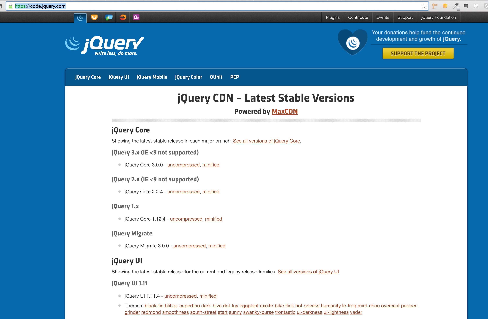

jQuery is one of the most popular JavaScript libraries used today. Its main purpose is to
make the front-end developers life much easier, by hiding the complexities related to
browser incompatibilities.

This chapter is an introduction to jQuery. However, you are going to learn lots of new and interesting stuff.
 
First we will learn how to download or reference jQuery.

You will then learn how to integrate that into your HTML page.

jQuery will give you lots of power to create dynamic HTML pages that offer rich functionality to end-user.

For example, you will be able to attach validations to an HTML form.

HTML Page With Form Validations

           
You will learn how to dynamically change the properties of the elements of your HTML document, like here:

App To Change Background Color

           
or like here:
           

Adding and Removing Classes

          

You will also learn how to add and remove elements dynamically like here:

Adding and Removing Elements Dynamically

          
Finally, you will be requested to create a UFO shooting game like this:
          

Task - Game: Shooting a UFO

          
