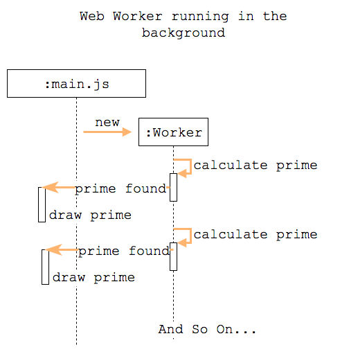
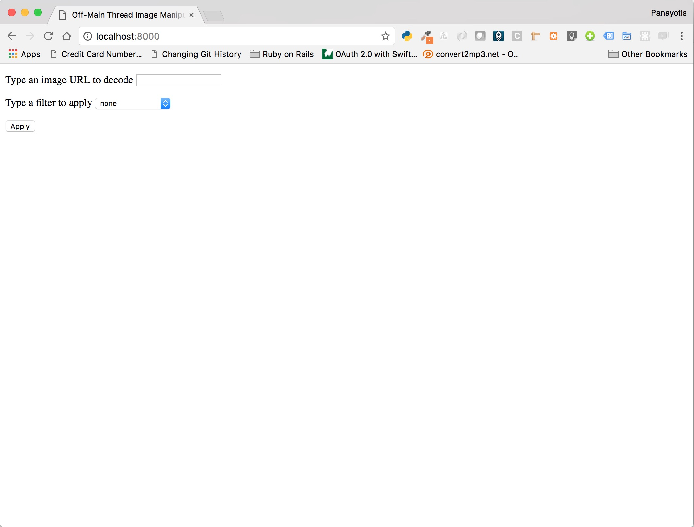
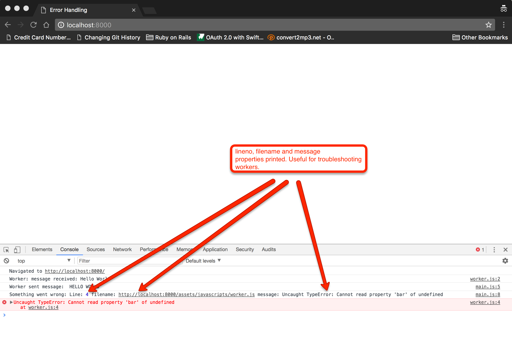

## Web Workers

Web Workers is an [HTML5 specification](https://html.spec.whatwg.org/multipage/workers.html) that allows JavaScript to execute
background tasks. These scripts are going to be executed independently from the UI handling JavaScript code.

Workers are supposed to be heavy-running tasks that require a lot of memory and CPU load. Hence, they are not meant to be 
spawned in slew numbers. 

### Prime Numbers Example

Let's create a worker that will help us calculate prime numbers. Here is the main HTML content:

``` HTML
 1. <html>
 2.   <head>
 3.     <meta charset="utf-8">
 4.     <meta name="viewport" content="width=device-width, initial-scale=1">
 5.     <title>Primer Numbers With Web Workers</title>
 6.     <script src="assets/javascripts/main.js"></script>
 7.   </head>
 8. 
 9.   <body>
10.     <h1>Prime Numbers with Web Workers</h1>
11.     <p>
12.       The highest prime number discovered so far is <span id="result"></span>
13.     </p>
14.   </body>
15. </html>
```

When you load this page (load it using a simple HTTP server, like `python -m SimpleHTTPServer`), it will start displaying 
the prime numbers. This is done with the help of two scripts:

1. The `assets/javascripts/main.js` script:

``` JavaScript
1. // assets/javascripts/main.js
2. //
3. window.onload = function() {
4.   var worker = new Worker('assets/javascripts/worker.js');
5.   worker.onmessage = function(event) => {
6.     document.getElementById('result').textContent = event.data;
7.   }
8. }
```

On line 4, we instantiate a new `Worker`. It needs to be given a script that will be the actual code that will be executed.
We will see that next. The `worker` holds a reference to the worker and we can register a message handler. This is what we 
do on line 5. We install a message handler and hence we give worker a way to send back messages to the main script of execution.
The message will arrive as `event.data`. 

2. The `assets/javascripts/worker.js` script:

``` JavaScript
 1. let n = 1;
 2. 
 3. while (true) {
 4.   n += 1;
 5.   let prime = true;
 6.   for (let i = 2; i <= Math.sqrt(n); i += 1) {
 7.     if (n % i === 0) {
 8.       prime = false
 9.     }
10.   }
11.   if (prime) {
12.     postMessage(n);
13.   }
14.   if (n > 1000000) {
15.     break;
16.   }
17. }
```

The worker will run a loop until `n` becomes larger than a big number (line 14). For each `n` it will run a heavy
unoptimized algorithm to find out whether the `n` is a prime number or not. If `n` is a prime number, it will call
`postMessage(n)` (line 12) and will pass the prime number back to the main script (which will then print that number).

The following picture explains what happens to the above program:



The Worker runs in its own thread. And it is using `postMessage()` to send a message back
to the main script every time it encounters a prime number. The main script does nothing
but taking the prime number and drawing it in the corresponding part of the HTML page.

### Off-Main Thread Image Manipulation

Let's write another example in which we use a worker to manipulate images out of the main thread of execution. This is a good use case for workers,
because manipulating images, usually, consumes a lot of resources and you wouldn't like to block the UI thread.

Here is the HTML part:

``` HTML
 1. <!DOCTYPE html>
 2. <html>
 3.   <head>
 4.     <meta charset="utf-8">
 5.     <meta name="viewport" content="width=device-width, initial-scale=1.0">
 6.     <title>Off-Main Thread Image Manipulation with Workers</title>
 7.     <script src="http://code.jquery.com/jquery-2.2.4.min.js"></script>
 8.     <script src="assets/javascripts/main.js"></script>
 9.   </head>
10.   <body>
11. 
12.     <p>
13.       <label>
14.         Type an image URL to decode
15.         <input type="url" id="image-url" list="image-list"/>
16.         <datalist id="image-list">
17.           <option value="http://localhost:8000/assets/images/lion.jpg"></option>
18.           <option value="https://html.spec.whatwg.org/images/drawImage.png"></option>
19.           <option value="https://html.spec.whatwg.org/images/robots.jpeg"></option>
20.           <option value="https://html.spec.whatwg.org/images/arcTo2.png"></option>
21.         </datalist>
22.       </label>
23.     </p>
24. 
25.     <p>
26.       <label>
27.         Type a filter to apply
28.         <select id="filter">
29.           <option value="none">none</option>
30.           <option value="grayscale">grayscale</option>
31.           <option value="brighten">brighten by 20%</option>
32.           <option value="darken">darken by 20%</option>
33.         </select>
34.       </label>
35.     </p>
36. 
37.     <p>
38.       <button id="apply-filter">Apply</button>
39.     </p>
40. 
41.     <canvas id="output">
42.     </canvas>
43. 
44.   </body>
45. </html>
```

As you can see, we are also referencing jQuery from a CDN source (line 7).

The HTML page is composed of four elements:

(1) An input field that the user gives a URL to an image.

(2) A data list that is there to help user give their image URL input. It has a list of URLs that the user can 
choose from. However, even if there is a list, the user can give on (1) any URL that they like. Note that there are four 
images referenced. One is local to the project and you can find it in the resources of the chapter. The others are references 
to external resources.

(3) A drop down with available filters to apply.

(4) A button to `Apply` the filter.

Here is a screenshot of the page as soon as it starts:



The idea behind this small project is that whenever the user clicks on `Apply`, the image specified
is drawn in the `canvas` area. Also, if the image is already displayed/drawn in the canvas, the
`Apply` button applies the filter selected.

Let's see the `main.js` script:

``` JavaScript
 1. (function($) {
 2.   $(document).ready(function() {
 3.     var img;           // Holds reference to "img" element created.
 4.     var imageData;     // The imageData loaded. The ImageData of the currently loaded Image.
 5.     var originalData;  // The originalData. The ImageData of the original image. Used to reset back to  original image, when user selects "none" for filter
 6.     var context;       // This will be the canvas context. The image is drawn within a canvas.
 7.     var canvas = $('#output')[0]; // This is the output canvas
 8. 
 9.     var worker = new Worker('assets/javascripts/worker.js')
10.     worker.onmessage = function(event) {
11.       // https://developer.mozilla.org/en-US/docs/Web/API/CanvasRenderingContext2D/putImageData
12.       // When we get the new image data from the Worker, we just paint the image.
13.       context.putImageData(event.data.imageData, 0, 0);
14.       imageData = event.data.imageData;
15.     }
16. 
17.     $('#apply-filter').on('click', function() {
18.       var src = $('#image-url').val();
19.       var $filter = $('#filter');
20. 
21.       if (img && img.src === src) {
22.         // Tell worker to do work.
23.         worker.postMessage({imageData: imageData, filter: $filter.val(), originalData: originalData});
24.       }
25.       else {
26.         // I create an image element inside canvas
27.         img = document.createElement('img');
28.         img.crossOrigin = 'Anonymous';
29.         img.src = src;
30. 
31.         $(img).on('load', function() {
32.           var imageElement = this;
33.           var width = imageElement.width;
34.           var height = imageElement.height;
35.           if (width === 0 || height === 0) {
36.             return;
37.           }
38. 
39.           // We draw the image on the canvas
40.           canvas.width = width;
41.           canvas.height = height;
42. 
43.           context = canvas.getContext('2d');
44.           context.drawImage(imageElement, 0, 0);
45. 
46.           originalData = context.getImageData(0, 0, width, height);
47. 
48.           // Tell worker to do work.
49.           worker.postMessage({imageData: originalData, filter: $filter.val(), originalData: originalData});
50.         });
51.       }
52. 
53.     });
54. 
55.   });
56. })(jQuery);
```
This is what this script does:

(1) On line 9, it creates the background Worker. The worker relies on script `worker.js` which we will see next.

(2) Then, on line 10, the main script installs a handler to deal with messages that will be coming from the worker back to the 
main script. Basically, the message will contain the new image data. Hence, the responsibility of the main script is to put 
that data on the canvas. This is done on line 13. Also, on line 14, we save the current set of data. We will need it to give it 
to the next `Apply`.

(3) Then we install a `click` handler for the `Apply` button. This has two branches. First one, deals with the `Apply` when there is 
already an image displayed. It just only asks the worker to calculate the new pixels and tells us when ready. Very simple. 
The second branch, is a little bit more complicated because it needs to create the `img` element (line 24), set its `src` attribute 
to the value that the user has specified in the input element (line 29) and also makes sure that the image can be loaded from 
third-party resources (by setting the `img.crossOrigin` to `Anonymous`). Then, this branch needs to  wait for the image to load before doing
further work. That is why it installs a `load` handler for the `img` element created (line 31). The `load` handler needs to take the 
dimensions of the image and adapt the dimensions of the `canvas` accordingly (lines 40 and 41). Then it draws the image on the canvas 
(line 43 and 44). Finally, it takes the pixels of the image (line 46) and asks worker to process it, according to the filter selected. 

Before we see how the `worker.js` script has been implemented to manipulate the data / pixels of the
image loaded, let's see the page in action:

<div id="media-title-video-JavaScript Worker - Manipulating Images">JavaScript Worker - Manipulating Images</div>
<a href="https://player.vimeo.com/video/254849956"></a>

Let's now see the `worker.js` script:

``` JavaScript
 1. // Worker
 2. //
 3. 
 4. // "filters" define a set of functions that
 5. // do work on image data. For example, the 'brighten' takes the pixels
 6. // and multiply their values by 1.2, so that the whole picture becomes
 7. // brighter.
 8. //
 9. var filters = {
10.   none: function(data, originalData) {
11.     for(var i = 0; i < data.length; i++)
12.       data[i] = originalData[i];
13.   },
14. 
15.   grayscale: function(data) {
16.     for(var i = 0; i < data.length; i++) {
17.       var r = data[i];
18.       var g = data[i + 1];
19.       var b = data[i + 2];
20. 
21.       // CIE luminance for the RGB
22.       // The human eye is bad at seeing red and blue, so we de-emphasize them.
23.       // An algorithm to turn to gray. See more here: http://www.tannerhelland.com/3643/grayscale-image-algorithm-vb6/
24.       data[i] = data[i + 1] = data[i + 2] = 0.2126 * r + 0.7152 * g + 0.0722 * b;
25.     }
26.   },
27. 
28.   brighten: function(data) {
29.     for(var i = 0; i < data.length; i++) {
30.       data[i] *= 1.2;
31.     }
32.   },
33. 
34.   darken: function(data) {
35.     for(var i = 0; i < data.length; i++) {
36.       data[i] /= 1.2;
37.     }
38.   }
39. 
40. }
41. 
42. // This is what the worker will do when it gets a message from Main script
43. //
44. self.onmessage = function(event) {
45.   var imageData = event.data.imageData;
46.   var filter = event.data.filter;
47.   var originalData = event.data.originalData;
48. 
49.   filters[filter](imageData.data, originalData.data);
50. 
51.   // after having filtered the image, it will send the data back to the main script
52.   self.postMessage({imageData: imageData});
53. }
```

On lines 44 to 53, the last ones, we specify what the worker will do when it receives a message from the main script. 
Basically, depending on the `filter` requested, worker calls the corresponding function from the function pool `filters`. 
For example, if the `filter` is `brighten`, then the `filters[brighten]()` function will be called.

The `filters` functions do nothing but changing the values of the pixels of the image at hand. Note that `originalData` 
is only important to the `none` function which resets the data to their original value.

The worker installs a message handler on line 44 and at the end of this handler it responds back to the main script by calling `postMessage()`. 
This is going to trigger the execution of the code on lines 10 to 15 from the `main.js` script.

## Features Available To Workers

You need to know that the following features are available to workers:

- The `navigator` object
- The `location` object
- `XMLHttpRequest` that would allow you Ajax requests.
- `setTimeout() / clearTimeout()` and `setInterval() / clearInterval()`.
- The _Application Cache_
- The `importScripts()` method that allows you to import external scripts.
- The ability to _spawn other web workers_.

However, the following features are not available:

- The DOM, because accessing the DOM is not thread-safe. This means that you cannot manipulate the DOM by adding / removing nodes, for example.
- The `window` object.
- The `document` object.
- The `parent` object.

## Handling Errors

It is important that you add error handling code when writing code with workers. This is very easy. All you have to do is to attach a 
handler on the `error` event on your worker.

Let's see an example:

``` html
 1. <!DOCTYPE html>
 2. <html>
 3.   <head>
 4.     <meta charset="utf-8">
 5.     <meta name="viewport" content="width=device-width, initial-scale=1.0">
 6.     <title>Error Handling</title>
 7.     <script src="assets/javascripts/main.js"></script>
 8.   </head>
 9.   <body>
10.   </body>
11. </html>
```

The above is a very simple web page that is using a worker. Load it using a simple HTTP server like `python -m SimpleHTTPSever`. 

The `main.js` script is the following:

``` JavaScript
 1. window.onload = function() {
 2. 
 3.   var worker = new Worker('assets/javascripts/worker.js');
 4.   worker.addEventListener('message', function(event) {
 5.     console.log("Worker sent message: ", event.data.message);
 6.   });
 7.   worker.addEventListener('error', function(event) {
 8.     console.log("Something went wrong: Line:", event.lineno, "filename:", event.filename, "message:", event.message);
 9.   });
10.   worker.postMessage({message: 'Hello World'});
11. };
```

> Note: We are using `addEVentListener()` to attach handlers in this example.

As earlier, we attach a handler for `message` event. This is the handler that will get a message from the worker. It will just print the message (line 5).

The new thing is the handler for the `error` event. This is the error handling function and this is the suggested way to handle errors related to workers. 
The `event` argument (line 7) has three very useful properties:

- `lineno`
- `filename`
- `message`

These can be used to troubleshoot errors related to your worker code.

Now see the actual `worker` script:

``` JavaScript
1. addEventListener('message', function(event) {
2.   console.log("Worker: message received:", event.data.message);
3.   postMessage({message: event.data.message.toUpperCase()});
4.   postMessage({message: event.data.foo.bar});
5. });
```

On line 4, we do an error, on purpose. If you load the page on your browser and watch the console logs you will see this:



You can see how we take advantage of the three error properties and print useful information in the console.

## Shared Workers

The specification talks about _shared workers_ too. We will not discuss them here.

## Closing Note

We have seen how workers can handle our heavy tasks in the background. This is not a feature that one employs very frequently, but
it is very good to know because it shows you how JavaScript is progressing into becoming a language to deal with things other than
only UI stuff on the browser.
