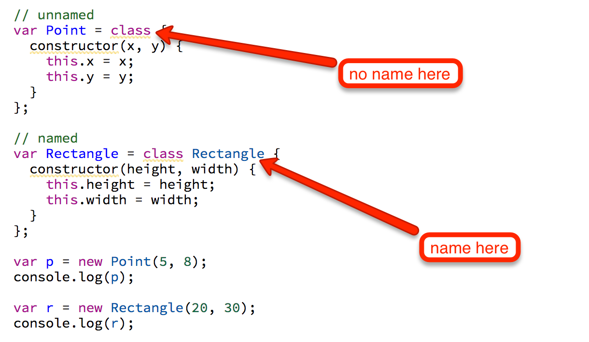
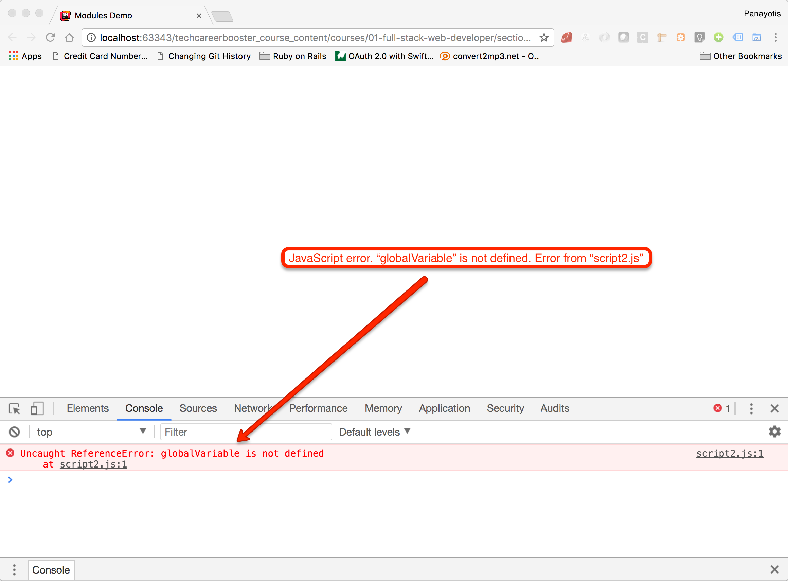
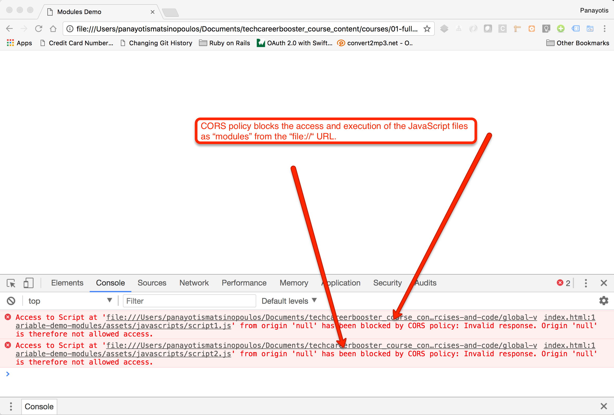
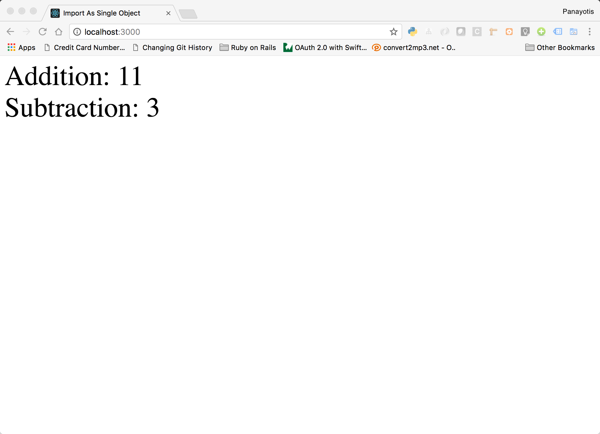

JavaScript is an implementation of the ECMAScript (ES) standard. In 2015, the ES2015 or ES6 was released which included a lot of
new features. Most of them are now supported by the modern browsers and runtime engines, like Node.js. The previous version of
JavaScript that we have learned so far, was ES5.

Let's see some of the most frequently used new features of ES6.

## `let` Statement

The `let` allows you to declare variables that are limited in scope to the block, statement, or expression on which it is used. 
This is unlike the `var` keyword, which defines a variable globally, or locally to an entire function regardless of block scope.

Let's see the difference with an example:

``` javascript
for(var i = 0; i < 5; i++) {
  console.log(i);
}
  
console.log("After for loop: ", i);
```

You can see that the variable `i` is declared at the `for` level. However, it is globally accessible, even after the scope of the loop.
If you run the above in a JSBin, you will get something like this:

``` javascript
0
1
2
3
4
After for loop: 5
```

Now, let's turn the `var` to `let`:

``` javascript
for(let i = 0; i < 5; i++) {
  console.log(i);
}
  
console.log("After for loop: ", i);
```

and try to run the program again. You will see that you get an error `"ReferenceError: i is not defined"`, which means that `i` is not
accessible outside of the scope of the `for` block.

So, variables declared with `let` are less susceptible to errors. 

## `const` Statement

The `const` declare references to values and the identifier cannot ever be reassigned another value. Hence, they take their
values at the initialization point:

``` javascript
const foo = 'bar';
```

The `foo` will always have the value `bar`. Also, its scope works like the scope of `let`. However, watch out for the trap.
Having a reference const, does not make the properties of the object pointed to by the reference being constant too.

For example, the program

``` JavaScript
const student = {
  firstName: 'John',
  lastName: 'Paul'
}

student.lastName = 'Woo';
console.log(student.lastName); // => 'Woo'
```

works perfectly fine and finally prints `Woo`, without a problem.

How can we make the properties of a constant object constants too? One way you can do that is with `Object.defineProperty()` method.
Try the following:
 
``` JavaScript
const student = {
  firstName: 'John'
}

Object.defineProperty(student, 'lastName', {value: "Paul", writeable: false});

student.lastName = 'Woo';
console.log(student.lastName); // => "Paul"
``` 

That made the property readonly. However, in ES6, you can just use a property definition method. Try this:

``` JavaScript
const student = {
  firstName: 'John',
  get lastName() {
    return 'Paul';
  }
}

student.lastName = 'Woo';
console.log(student.lastName); // => 'Paul'
```

The above makes sure that `lastName` remains `Paul` even if we try to change it to `Woo`. Also, if you try to print the
properties of `student` object, you will see that `lastName` is part of the properties:

``` JavaScript
const student = {
  firstName: 'John',
  get lastName() {
    return 'Paul';
  }
}

student.lastName = 'Woo';
console.log(student.lastName); // => 'Paul'

console.log(Object.getOwnPropertyNames(student));
``` 

## Exponentiation Operator

We know that `Math.pow()` is the most common way to calculate the power of a number. For example:

``` JavaScript
console.log(Math.pow(5, 2)); // => 25
```

The above prints the 2nd power of 5 (<code>5<sup>2</sup></code>). 

However, EcmaScript2016 introduced the *exponentiation operator*, a binary operator that does not oblige you to use
a method call to calculate the power of a number, like it happens in many other languages:

``` JavaScript
console.log( 5 ** 2 ); // => 25
```

The exponentiation operator is `**` and the above snippet will print `25`, like before.

Note that `**` operator has the highest priority among the binary operators.

``` JavaScript
console.log( 10 * 5 ** 5 ); // => 31250
``` 

The above prints `31250`, because it first calculates `5 ** 5` (gives `3125`), and then multiplies by `10`. 

## Template Strings

This is a new facility that allows us to create concatenated strings of dynamic content. Like the interpolated strings in Ruby.
Let's see an example:

``` javascript
var firstName = "John";
var lastName = "Travolta";
  
console.log(`${firstName} ${lastName}`);
```
If you run the above in JS Bin, you will get `"John Travolta"`. The interpolation happens with the help of backticks <code>&#96;</code> surrounding
the string construction expression, and the `${ }`, which encloses a JavaScript expression that evaluates to something that can be turned into
a string.

Also, the backticks can be used to create multiline strings:

``` javascript
var output = `This is a very long string that
spans multiple lines.`;
  
console.log(output);
```

## Arrows

Arrows are function shorthands that use the symbol sequence `=>`. They are not completely equivalent to the ES5 function expressions,
which are still here. For example, they do not have their own `this`, `arguments`, `super` or `new.target`. The arrow functions are
best suited for non-method functions and they cannot be used as constructors.

Below you can see an example of an arrow function:

``` javascript
(a) => a * a;
```  

This is equivalent to the ES5 version:

``` javascript
(function(a) {
    return a * a;
});
```

If you try the `(a) => a * a;` on a JSBin, you will not see anything happening. But you can try this:

``` javascript
var result = (a) => a * a;
console.log(result(2));
```

This will print `4` on the console window.

And another very frequently encountered example is the following. Instead of writing this:

``` javascript
var numbers = [1, 2, 3, 4];
var transformed = numbers.map(function(v, i) {
	return v * i;
});
```

You can write this:

``` javascript
var numbers = [1, 2, 3, 4];
var transformed = numbers.map((v, i) => v * i);
```

Do you see how we give the argument to the `map()` function call? We give an arrow function definition.

Note that if the function is defined as taking one argument, then you don't have to wrap it in rounded parenthesis. 

``` JavaScript
const doubleIt = a => a * 2;

console.log(doubleIt(5));
```

Note that if the function body spans multiple lines, rather than just a return statement like above, then you need
to be careful to enclose the body in curly braces and explicitly define the `return` statement (if it needs to return
something):

``` JavaScript
const complexFunction = (a, b, c) => {
  const aa = a * 2;
  const bb = b * 18;
  const cc = c + 10;
  return aa + bb + cc;
}
```

## Enhanced Object Literals

We have learned about object literals in the `Objects` chapter. ES6 has some new features that we can use with object literals:

1. prototype at construction
1. shorthand for `foo: foo` assignments
1. defining methods
1. making `super` calls
1. computing property names with expressions, i.e. dynamic property names

The following example demonstrates the use of each one of those:

``` javascript
 1. class Animal {
 2.   constructor(name) {
 3.     this.name = name;
 4.   }
 5.   
 6.   makeNoise() {
 7.     console.log("I am Animal " + this.name);
 8.   }
 9. }
10. 
11. var belt = "brown";
12. 
13. var dog = {
14.   __proto__: new Animal('peter'),
15.   
16.   makeNoise() {
17.     super.makeNoise();
18.     console.log("I am a dog!");
19.   },
20.   
21.   belt,
22.   
23.   [5 + 6]: 'hello'
24. };
25. 
26. 
27. console.log(dog.name);
28. dog.makeNoise();
29. console.log(dog.belt);
30. console.log(dog[11]);
```

On line 13, you can see the object `dog` being defined literally. And then on lines 27 till 30, we call various properties and methods on it. 

1. Line 14 is an example of the first feature, prototype at construction. On the example, we make the `dog` inherit from `Animal`.
1. Line 21 is an example of the second feature, shorthand for `foo: foo` assignments. In this particular case, with `belt` we basically say
`belt: belt`.
1. Line 16 is an example of a method definition.
1. Line 17 is an example of making a call to `super` in order to call the functionality inherited from the super class.
1. Line 23 is an example of dynamically computing the name of the property. The name of the property ends to be `11`.

## Destructuring Assignment

The destructuring assignment allows us to assign specific elements of an array or specific properties of an object.

### Array Destructuring

Let's see an example with array:

``` javascript
var [a, ,b] = [1, 2, 3];

console.log(a);
console.log(b);
```
The first line of the snippet above, tells that we are interested only on the first and third element of the array. Hence, if you
run the above, you will get this:

``` javascript
1
3
```

You can also have default values. Here is another example:

``` javascript
var [a, , b, c = 7] = [1, 2, 3];
  
console.log(a);
console.log(b);
console.log(c);
```

Now, the `c` is going to have the value `7`, because it is not assigned a value on line 1.

We can also assign the rest of an array to a variable. Look at this example:

``` javascript
var [a, ...b] = [1, 2, 3, 4, 5, 6];

console.log(a);
console.log(b);
```

If you run this in a JSBin, you will get the value `[2, 3, 4, 5, 6]` for the variable `b`.

### Object Destructuring

Except for array, destructuring works with objects too.

For example, we can quickly get into variables part of the object properties:

``` javascript
var order = {date: '2017-11-16', number: '123456', customer: 'John Woo'};
var {date, number} = order;
  
console.log(date);
console.log(number);
```

The second line is the new way one can get the values of the properties `date` and `number` from the object `order`.

## Object Rest/Spread Properties

ES6 allows us to use object _rest_ and _spread_ properties. Here is an example of using the _rest operator_:

``` JavaScript
1. const x = {a: 1, b: 2, c: 3, d: 4, e: 5};
2. const {a, b, ...rest} = x;
3. 
4. console.log("a = ", a); // => prints a = 1
5. console.log("b = ", b); // => prints b = 2
6. console.log("rest = ", rest); // => prints rest = {c: 3, d: 4, e: 5}
```

On line 2, we can get the `a` and `b` properties of `x` explicitly, and the rest of the properties of `x` are assigned to the
`rest` constant. We do that by using the `...` rest operator as prefix to the `rest` identifier. 

And here is a _spread_ operator example:

``` JavaScript
1. const a = 10;
2. const b = 8;
3. const x = {foo: 'bar', mary: 'woo'};
4. const y = {a, b, ...x};
5. 
6. console.log("y = ", y); // prints y = {a: 10, b: 8, foo: "bar", mary: "woo"}
```

On line 4, we use the properties of `x` with the _spread_ prefix. Hence, all of its own properties are being spread and given
to `y`, as extra properties, after, `a` and `b`.

## Function Parameter Default Values

It goes along with destructuring that we can now set easier the default values for the parameters of a function.

``` javascript
const sayHello = ({name = 'Stranger'} = {}) => {
  console.log(`Hello ${name}`);
}

sayHello();
sayHello({name: 'John'});
```

The `sayHello()` function above, can be called without any argument. The `Stranger` value will be used for the `name`.

## Object.assign()
 
The `Object.assign()` method is used to copy the values of all enumerable own properties of an object into another.
Actually, the source object can be many objects. Let's see an example:

``` JavaScript
let object1 = {first_name: 'John', last_name: 'Woo'};
let object2 = Object.assign({}, object1);
  
console.log(object2);
```

If you run that on a JSBin or a JSFiddle you will see that it prints `{first_name: "John", last_name: "Woo"}`. The `object2`
has the same own properties like the `object1`. Or, you can try another example that is using two source objects:

``` JavaScript
let object1 = {first_name: 'John', last_name: 'Woo'};
let object2 = {first_name: 'Maria', salary: 2000};
let object3 = Object.assign({}, object1, object2);

console.log(object3);
``` 

If you run the above, you will see that `object3` has the properties that both `object1` and `object2` have. Also, the
`object2#first_name` was finally applied on top of the `object1#first_name`, because it was applied last.
 
## Classes

We have already seen how we can define objects in the `Objects` chapter. With _Classes_, ES6 is trying to
make the syntax more familiar to those that they have been used in programming with more standard OOP tools.
They make the inheritance in JavaScript much more clear and simple, if compared to the prototypical inheritance
that one could use until ES5.

### Defining Classes

Classes are specialized functions, and as we do have function declarations and function expressions, we also have 
_class_declarations_ and the _class_expressions_.

#### Class Declarations

Here is an example of a class declaration, using the `class` keyword.

``` javascript
class Point {
  constructor(x, y) {
    this.x = x;
    this.y = y;
  }
}

var p = new P(5, 8);
console.log(p);
``` 

If you run this in your JSBin, you will get something like this:

``` javascript
[object Object] {
  x: 5,
  y: 8
}
```

#### Class Expressions

There is another way you can define a class, by using a class expression. Look at the following example:

``` javascript 
// unnamed
var Point = class {
   constructor(x, y) {
     this.x = x;
     this.y = y;
   }
};

// named
var Rectangle = class Rectangle {
   constructor(height, width) {
     this.height = height;
     this.width = width;
   }
};
 
var p = new Point(5, 8);
console.log(p);
 
var r = new Rectangle(20, 30);
console.log(r);
```

If you run the above in a JSBin, you will get something like this:

``` javascript
[object Object] {
  x: 5,
  y: 8
}

[object Object] {
  height: 20,
  width: 30
}
```

which is actually expected. In the following picture, you can see the difference in unnamed vs named case:



### constructors

Each class can have a special method called `constructor`. But there can only be one. The `constructor` is invoked when we call `new` to
instantiate an object.

### static methods

A class may have a static method. These are class-level methods and they do not require an instance in order to be called. Actually,
they cannot be called via an instance of a class. In order to declare a static method we use the keyword `static`.

``` javascript
class ConcatAndUpcase {
  static doIt(s1, s2) {
     return (s1 + s2).toUpperCase();
  }
}
  
console.log(ConcatAndUpcase.doIt("foo", "bar"));
```

In the above example, you can see how we call the method `doIt` on the last line. We have defined it as `static` inside the body of the `class`.
If you run this in a JSBin, you will get this `"FOOBAR"`.

### Extending a Class

We can extend a class definition and inherit stuff from the super class. We use the keyword `extends` in order to do that. Let's see an example:

``` javascript
 1. class Animal {
 2.   constructor(name) {
 3.     this.name = name;
 4.   }
 5.   run() {
 6.     console.log(`I am ${this.name} and I am running`);
 7.   }
 8. }
 9. 
10. class Dog extends Animal {
11.   bark() {
12.     console.log(`I am ${this.name} and I will bark and then run`);
13.     this.run();
14.   }
15. }
16. 
17. const animal = new Animal('Peter');
18. console.log("I will ask animal to run...");
19. animal.run();
20. 
21. const dog = new Dog('Wolf');
22. console.log("I will ask dog to run...");
23. dog.run();
24. console.log("I will ask dog to bark...");
25. dog.bark();
``` 

We have created the class `Animal` and then we have created the class `Dog` which inherits from `Animal`. You can also see that `Dog` instance
has access to the method `run()` which is defined in `Animal` class. 

If you run the above in a JSBin, you will get something like this:

``` javascript
I will ask animal to run...
I am Peter and I am running
I will ask dog to run...  
I am Wolf and I am running
I will ask dog to bark... 
I am Wolf and I will bark and then run
I am Wolf and I am running
```

### Accessor Properties

Classes allow you to prefix your functions with `get` or `set` and turn the function name into an accessor property identifier. Here is an example:

``` JavaScript
 1. class Animal {
 2.   constructor(color, name) {
 3.     this.color = color;
 4.     this.name = name;
 5.   }
 6.  
 7.   get fullDescription() {
 8.     return `${this.name} - ${this.color}`;
 9.   }
10.   
11.   set fullDescription(value) {
12.     [this.name, this.color] = value.split('-').map((element) => element.trim());
13.   }
14. }
15. const dog = new Animal('white', 'max');
16. 
17. console.log('dog name =', dog.name, 'dog color =', dog.color);
18. console.log('dog fullDescription =', dog.fullDescription);
19. 
20. dog.fullDescription = 'flox - brown';
21. console.log('dog name =', dog.name, 'dog color =', dog.color);
22. console.log('dog fullDescription =', dog.fullDescription);
```

The `fullDescription` can now be used to get and set the property `fullDescription`, like you do for the other properties
of the object, without using the `()` suffix. For example, on line 18, we use `dog.fullDescription` instead of `dog.fullDescription()`. 
And on line 20, we use `dog.fullDescription = 'flox - brown'` instead of `dog.fullDescription('flox - brown')`. 

### Mix-ins

We have seen how we can extend a base class and create a sub-class. The `extends` keyword allows us to inherit from only one class. That means that
only single-inheritance is allowed. But, we can use the technique of _mix-ins_ if we want to incorporate into a class pieces of 
code from different modules.

Here is an example:

``` javascript
 1. const calculatorMixin = Base => class extends Base {
 2.   calc() {
 3.     console.log("calc() in Base");
 4.   }
 5. };
 6. 
 7. const randomizerMixin = Base => class extends Base {
 8.   randomizer() {
 9.     console.log("randomizer() in Base");
10.   }
11. };
12. 
13. class Foo extends(calculatorMixin(randomizerMixin(class {}))) {
14.     bar() {
15.       console.log("bar() in Foo");
16.     }
17. }
18. 
19. var f = new Foo();
20. f.calc();
21. f.randomizer();
22. f.bar();
```

On lines 1 to 5 and 7 to 11, we define two mix-ins. The first one defines the method `calc()` and the second one defines the method
`randomizer()`. Then, we define a class, `Foo`, that extends from the mix-ins. We enlist the mix-ins one after the other in a
nested scheme, and the inner most definition is `class {}`.

Then on lines 20, 21 and 22 we call methods on a `Foo` instance. These methods come either from the `Foo` class itself or from
the mix-ins.

If you run the above in a JSBin, you will see this:

``` javascript 
calc() in Base
randomizer() in Base
bar() in Foo
```
 
## Sets and Maps

Before ES6, sets and maps were implemented using special techniques. For example:

``` javascript
let setOfColors = Object.create(null);

setOfColors.yellow = true;
setOfColors.red = true;

// checking for existence
if (setOfColors.brown) {
  console.log("Brown is there");
}
if (setOfColors.yellow) {
  console.log("Yellow is there");
}
if (setOfColors.red) {
  console.log("red is there");
}
```

The above example creates an object using `null` as prototype. Hence, no properties will be present except from the ones defined
for the particular `setOfColors` object. Then we define the properties `yellow` and `red`. On top of that, setting them to have
`true` value is a trick that allows us to check for the existence of a property.

Having done the above, we essentially mimic the `Set` type.

Similarly, in order to mimic a `Map` we did the same trick as for `Set`, but we stored any value for the property:

``` JavaScript
let mapOfCustomers = Object.create(null);

mapOfCustomers.peterWoo = {age: 65, height: 1.5};
mapOfCustomers.mariaFoo = {age: 30, height: 1.4};
  
console.log(mapOfCustomers.peterWoo.age);
console.log(mapOfCustomers.mariaFoo.height);
``` 

The `mapOfCustomers` works like a `Map` object. We can retrieve the value of a key like we do at the last two lines. 

Using the above technique to work with sets and maps has some disadvantages. For example, all the keys are converted to strings.
For example the `5` and the `"5"` will end up being the same property. That might not have been your intention.

``` JavaScript
let map = Object.create(null);

map[5] = 5 * 5;
  
if (map["5"] > 0) {
  console.log("Value of '5' is greater than 0");
}
```

The above will print the message `Value of '5' is greater than 0`, although they key you added to the map was the integer `5` and
not the string `"5"`.

### ES6 Sets

ES6 adds the `Set` type which is an ordered list of values without duplicates. The set is constructed with the `Set()` constructor.
Items are added to the set with the `add()` method. The `.size` property returns the number of elements in the set. Here is an 
example:

``` JavaScript
 1. let setOfColors = new Set();
 2.   
 3. // add two colors
 4. setOfColors.add("red");
 5. setOfColors.add("yellow");
 6.   
 7. console.log(setOfColors.size);
 8.   
 9. // add existing color, will not change size of set
10. setOfColors.add("yellow");
11.   
12. console.log(setOfColors.size); 
13. setOfColors.delete("yellow");
14.  
15. console.log(setOfColors.size);
```

The above is a very simple example of a set of colors. The `add()` method is used to add elements and the `delete()` method is
used to remove elements from the set.

Note that the `.has()` method can tell you whether an item is in the set or not:

``` JavaScript
let setOfColors = new Set();
  
// add two colors
setOfColors.add("red");
setOfColors.add("yellow");

console.log(setOfColors.has("yellow"));
console.log(setOfColors.has("blue"));
```

The above will print `true` and then `false`. 

The `clear()` method will remove all items from the set. And the `forEach()` method can be used to carry out an action on each
one of the elements of the set.

``` JavaScript
1. let setOfColors = new Set();
2.   
3. setOfColors.add("red");
4. setOfColors.add("yellow");
5. setOfColors.add("blue");
6.  
7. setOfColors.forEach(value => console.log(value.toUpperCase()));
```

A set can be easily converted to an array. Hence, you will be able to access it by index:

``` JavaScript
 1. let setOfColors = new Set();
 2.   
 3. setOfColors.add("red");
 4. setOfColors.add("yellow");
 5. setOfColors.add("blue");
 6.    
 7. let arrayOfColors = [...setOfColors];
 8. for(let i = 0; i < arrayOfColors.length; i++) {
 9.   console.log(arrayOfColors[i]);
10. }
```

On line 7 above, we convert the set to an array. We are using the _spread_ operator (`...`). 

### ES6 Maps

Maps are constructed with the `Map()` constructor. The `set()` method is used to save an element into the map. The `get()`
method is used to get the value of an element from the map. Here is an example:

``` JavaScript
let mapOfCustomers = new Map();
  
mapOfCustomers.set("peterWoo", {age: 65, height: 1.5});
mapOfCustomers.set("mariaFoo", {age: 55, height: 1.4});
  
console.log(mapOfCustomers.get("mariaFoo"));
``` 

Like set does, map has the method `has()` to tell whether a key exists in the map. Also, the `delete()` method removes a
key from the map, and the `clear()` method removes all the keys. Also, the `size` property returns the number of keys
in the map.
 
## Symbols

Symbols are a primitive type joining the existing primitive types: strings, numbers, booleans, null, and undefined.

### Creating a Symbol

You do that by using the global function `Symbol` like in this example here:

``` JavaScript
let firstName = Symbol("First name");
let person = {};

person[firstName] = "Panos";

console.log(person[firstName]);
``` 

See how we use the `Symbol` function to create a Symbol. Also, see how we use it to create a property for the object `person`.

Note that the argument to `Symbol()` function is optional. It is a description that is only used for debugging purposes. It is 
recommended that you always use one.

Symbols are used whenever you can use a computed property name. 

### Symbols Can Be Shared

It is very useful to keep track of the symbols that you create and JavaScript helps with that with a global symbol registry. But,
in order to have access to it, you will have to use the function `Symbol.for("<a string identifier for the symbol>")`. Let's see the
following example:

``` JavaScript
let firstName = Symbol.for("First Name");
let person = {}
  
person[firstName] = "Panos";
console.log(person[firstName]);
```

The `Symbol.for("First Name")` call is searching into the global symbol registry for a symbol that is identified by the given string, i.e.
by the string "First Name". If so, the method returns the existing symbol. If the symbol does not exist, the new symbol is 
created, it is registered in the global symbol registry and then it is returned.

The method that returns the key of a symbol, if given the symbol itself, it is the `keyFor()` method. There is an example that you 
can run in a JSBin:

``` JavaScript
let firstName = Symbol.for("First Name");
console.log(Symbol.keyFor(firstName));
```

If you run the above, you will get the string `"First Name"` as output, which is the key for the symbol `firstName`.

Note that the global symbol registry is one for the whole JavaScript application instance. So, don't make any assumptions about
keys presence. It may be a good idea if you used a namespacing technique to name the keys of the symbols you save in the
global registry. For example, instead of `let order = Symbol.for("Order");`, better do `let order = Symbol.for("mycompany.Order");`.

## Iterators, Generators and Iterables

### Iterators

Iterators are very popular in many programming languages. We have learnt about the Ruby `.each` method which can let you iterate
over the elements of an Array:

``` ruby
[1, 2, 3].each do |element|
  puts "element: #{element}"
end  
``` 

The iterators shift the programming paradigm from `for` loops that require a tracking position variable to a technique that
requires less typing and generates more clear code.

ES6 specifies the interface that an Iterator object should expose.

Let's see a JavaScript loop that iterates over the elements of an array, written in the traditional ES5 style:

``` JavaScript
const students = ['John', 'Mary', 'Paul', 'Andrew'];

for (let i = 0; i < students.length; i++) {
  console.log(`Student (${i}): ${students[i]}`);
}
```

Will now implement the above using iterators. Iterators are objects with specific interface designed for iteration. All iterators
need to have a `.next()` method that returns a _result_ object like this `{value: <the value fetched>, done: [true|false]}`. Hence,
the result tells us whether there are more values to return (`done` property) and the actual value returned (`value` property).
Note that when `done` is `false`, `value` does not contain the last item of the collection. It contains whatever we want the
iterator to return as a general-iterator-return value, or `undefined` if we have designed our iterator to return nothing.

Having said the above, the following code creates an iterator but using ES5 and not ES6:

``` JavaScript
function createIterator(collection) {
  return {
    index: 0,
    next: function() {
      return this.index >= collection.length ? 
              {value: undefined, done: true} : 
              {value: collection[this.index++], done: false};
    }
  }
}

var iterator = createIterator([1, 2, 3]);
var iterator2 = createIterator([5, 6, 7]);
console.log(iterator.next());
console.log(iterator2.next());
console.log(iterator.next());
console.log(iterator2.next());
console.log(iterator.next());
console.log(iterator2.next());
console.log(iterator.next());
console.log(iterator2.next());
```

As you can see, it is not very difficult to write an iterator that complies with the interface requirements of ES6. 

### Generators

However, ES6 allows us to use another tool, generators, in order to implement iterators easier.

A generator is a function that returns an iterator. The generator is indicated by the `*` following the `function` keyword. 

The following is a simple iterator created using a generator:

``` JavaScript
function *createIterator(collection) {
  yield 1;
  yield 2;
  yield 3;
}

const iterator = createIterator();

console.log(iterator.next());
console.log(iterator.next());
console.log(iterator.next());
console.log(iterator.next());
```

The `yield` keyword tells which value should be returned every time the `.next()` method is called on the iterator. The generator
should yield all the values in the order they should be returned by `.next()`.

Here is another example in which the generator takes as input a collection:

``` JavaScript
function *createIterator(collection) {
  for(let i = 0; i < collection.length; i++) {
    yield collection[i];
  }
}

const iterator = createIterator([1, 2, 3]);

console.log(iterator.next());
console.log(iterator.next());
console.log(iterator.next());
console.log(iterator.next());
```

As you can see above, the implementation of the iterator using a generator is much simpler.

> Note that `yield` can only be used inside of generators. Hence the following would return a syntax error:
> 
> ``` JavaScript
> function *createIterator(collection) {
>   collection.forEach((element) => yield element);
> }
>
> const iterator = createIterator([1, 2, 3]);
> ```

### Iterables

Iterables are closely related to iterators. An iterable is an object with a `Symbol.iterator` property. The well-known `Symbol.iterator` property
should reference a function that returns an iterator for the given object, something like the create iterators we saw earlier. Note that, in ES6,
all arrays, sets, maps and strings are iterables and they have a default iterator specified. For example:

``` JavaScript
1. const numbers = [1, 2, 3];
2. const iterator = numbers[Symbol.iterator]();
3. 
4. console.log(iterator.next()); // prints {value: 1, done: false}
5. console.log(iterator.next()); // prints {value: 2, done: false}
6. console.log(iterator.next()); // prints {value: 3, done: false}
7. console.log(iterator.next()); // prints {value: undefined, done: true}
```

The above demonstrates how, in ES6, the arrays have an iterator already defined in their `Symbol.iterator` property.

If a collection, like the arrays, has an iterator defined at the well-known property `Symbol.iterator`, then we can use the `for-of` statement
to loop over the elements of the collection. Look at the following example:

``` JavaScript
const students = ['John Woo', 'Mary Foo', 'Paul Papas', 'Peter Pan']

for(let student of students) {
  console.log(student)
}
```
This `for-of` loop works on iterables. It calls the `.next()` method on the iterator of the iterable and stores the `value` value
into the variable used for the iteration (`student` in our example above). The repetition continues until `done` returned by the
iterator is `true`.

If you run the above program, you will get the following in the console:

``` JavaScript
John Woo
Mary Foo
Paul Papas
Peter Pan
```

### Creating Iterables

Objects created by developers are not iterables by default. However, you can make them iterables, by setting their `Symbol.iterator`
property to be a Generator.

Let's see an example:

``` JavaScript
 1. let collection = {
 2. 	items: [1, 2, 3, 4, 5, 6, 7, 8, 9, 10, 11, 12],
 3.   *[Symbol.iterator]() {
 4.     for(let item of this.items) {
 5.       if(item % 2 === 0) {
 6.         yield item;
 7.       }
 8.     }
 9.   }
10. };
11. 
12. for(let x of collection) {
13.   console.log(x);
14. }
```

If you run the above, you will see even numbers between 1 and 12 to be printed in the console. The `Symbol.iterator` property
has been set up to be a Generator, that yields the even elements of the `items` array. Then on line 12, we can use the `for-of`
statement to print the even members of the collection.

> Note:  ES6 collections, like arrays, maps and sets, they come with some built-in iterators that are quite useful.
> 1. `entries()` - Returns an iterator whose values are key-value pairs.
> 2. `values()` - Returns an iterator whose values are the values of the collection.
> 3. `keys()` - Returns an iterator whose values are the keys contained in the collection.

## Modules

ES6 includes the features of modules which is another way of encapsulating code. Let's see in more detail what they are.

Modules are here to solve the problem of namespacing and global space pollution. Before ES6, all JavaScript code loaded 
by the browser was globally shared. When the applications started to grow, that was a problem of maintenance and debugging.

Modules are JavaScript files that are loaded in a different mode, a _module_ mode. This is different to the way JavaScript
loads the _scripts_, which is the _script_ mode. 

Hence, a JavaScript file can be loaded 

1. as a Module, or
1. as a Script

These are the main properties of loading a file as a module:

(1) The code of a module is executed in strict mode. So, you don't have to write `"use strict";` at the beginning of your file.

(2) Variables that are created at the top level of the file aren't added to the shared global scope. On the other hand, when
a script is executed in _script_ mode, any top level variables are global and they can be accessed from anywhere.

This global space pollution can be demonstrated with the following code:

1. The `index.hmtl` file. Create the HTML file with name `index.html` with the following content:

  ``` html
  <!DOCTYPE html>
  <html>
    <head>
      <title>Global variable demo</title>
      <script src="assets/javascripts/script1.js"></script>
      <script src="assets/javascripts/script2.js"></script>
    </head>
    <body>
  
    </body>
  
  </html>
  ```
2. The `assets/javascripts/script1.js` file. Create the JavaScript file `script1.js` inside the folder `assets/javascripts`.

 ``` JavaScript
 var globalVariable = "Hello World";
 ```
3. The `assets/javascripts/script2.js` file. Create the JavaScript file `script2.js` inside the folder `assets/javascripts'.

  ``` JavaScript
  alert(globalVariable);
  ```

Save all the files and load the `index.html` page on your browser. You will see something like this?


This proves that your `script2.js` has access to the variable declared inside the `script1.js`. This will not be true with the
modules and we are going to demonstrate that later on.

(3) The value of `this` at the top level is `undefined`.

With scripts the value of `this` is the object `Window`. On the other hand, the value of `this`, at the higher level, is
undefined inside modules.

(4) Modules must export anything that should be available to code outside of the module. 

Hence, if the module wants the variable `globalVariable` to be accessible from code outside of the module, it has to export
that variable. We will see examples a little bit later on.

(5) Modules may import bindings from other modules.

The exported stuff from a module can be imported into another using a specific statement.

### Example of Modules

Let's now see an example of using modules. Create a new page `index.html` with the following content:

``` html
<!DOCTYPE html>
<html lang="en">
  <head>
    <title>Modules Demo</title>
    <script type="module" src="assets/javascripts/script1.js"></script>
    <script type="module" src="assets/javascripts/script2.js"></script>
  </head>
  <body>

  </body>
</html>
```

This is the same file with the earlier `index.html`, but the scripts are loaded as modules. This is done with the attribute `type`
that has the value `module`, instead of `text/javascript`. The `type="module"` tells browser to load the scripts as modules.

Otherwise, keep the `scriptX.js` files as before:

The `assets/javascripts/script1.js` file. Create the JavaScript file `script1.js` inside the folder `assets/javascripts`.

``` JavaScript
var globalVariable = "Hello World";
```

The `assets/javascripts/script2.js` file. Create the JavaScript file `script2.js` inside the folder `assets/javascripts'.

``` JavaScript
alert(globalVariable);
```

And then try to load the `index.html` page in your browser. You will not see anything. Actually, if you have your developer tools
open, you will see a JavaScript error being logged:



As you can tell from the error, the variable `globalVariable` defined inside `script1.js` is not visible outside of it. `script2.js`
is trying to access the `globalVariable`, but it fails, because it is not in its scope.

That is the idea of the modules. It encapsulates the code without polluting the global namespace.

But, what if the `script1.js` wanted the variable `globalVariable` to be visible outside of it. It would have had to export it. Change the
`assets/javascripts/script1.js` file to be as follows:

``` JavaScript
export var globalVariable = "Hello World";
```

We have added only an `export` prefix. 

If you try to load the page `index.html` on your browser, once more, you will get the same error again. This is because it is not enough
for the `script1.js` to export something. The script that wants to use it, it needs to import it too. Go and change the `assets/javascripts/script2.js`
file according to this:

``` javascript
import { globalVariable } from './script1.js';

alert(globalVariable);
```

You can see that we are declaring an import. We specify which reference to import, the `globalVariable`, and then we tell where to import it
from.

However, if you try to load the page `index.html` on your browser, you will not succeed again. This is because your browser does not allow
to load modules from your local file system using the `file://` protocol. This is the error that you see:



One way you can bypass this obstacle is to start a local Web server at the root folder of your project. On Mac OS X, this is easily
done with the python simple HTTP Server. The following command will start a local Web server listening at port 3000:

``` bash
$ python -m SimpleHTTPServer 3000
Serving HTTP on 0.0.0.0 port 3000 ...
```

Now, try to visit the web page: [http://localhost:3000](http://localhost:3000). You will see the following logs in your terminal window:

``` bash
127.0.0.1 - - [24/Nov/2017 07:17:38] "GET / HTTP/1.1" 200 -
127.0.0.1 - - [24/Nov/2017 07:17:58] code 404, message File not found
127.0.0.1 - - [24/Nov/2017 07:17:58] "GET /robots.txt HTTP/1.1" 404 -
127.0.0.1 - - [24/Nov/2017 07:17:58] "GET /assets/javascripts/script1.js HTTP/1.1" 200 -
127.0.0.1 - - [24/Nov/2017 07:17:58] "GET /assets/javascripts/script2.js HTTP/1.1" 200 -
127.0.0.1 - - [24/Nov/2017 07:17:58] code 404, message File not found
127.0.0.1 - - [24/Nov/2017 07:17:58] "GET /robots.txt HTTP/1.1" 404 -

```

And the page will be loaded on your browser:


### Importing All As Single Object

Another importing technique which is very interesting, is the one that allows you to import all references of a module as a single object. Let's see
an example of that.

``` html
 1. <!DOCTYPE html>
 2. <html>
 3.   <head>
 4.     <meta charset="utf-8">
 5. 
 6.     <title>Import As Single Object</title>
 7.     
 8.     <link rel="stylesheet" href="assets/stylesheets/main.css"/>
 9. 
10.     <script type="module" src="assets/javascripts/my-math-library.js"></script>
11.     <script type="module" src="assets/javascripts/main.js"></script>
12.   </head>
13. 
14.   <body>
15. 
16.     <div>Addition: <span id="add"></span></div>
17.     <div>Subtraction: <span id="subtract"></span></div>
18. 
19.   </body>
20. </html>
```

The above page loads two scripts as modules. The first one, `my-math-library.js` defines and exports two functions:

``` javascript
1. function add(a, b) {
2.   return (a + b);
3. }
4. 
5. function subtract(a, b) {
6.   return (a - b);
7. }
8. 
9. export { add, subtract };
``` 

The export technique that we use here is a little bit different from the previous one. But it is equally valid. We
define the exports at the bottom of the module, with a separate `export` statement.

Then, the module `main.js` imports all the exported references as a single object called `MathsAgain`:

``` javascript
1. import * as MathsAgain from './my-math-library.js'
2. 
3. window.onload = function(){
4.   let element = document.getElementById('add');
5.   element.innerHTML = MathsAgain.add(5, 6).toString();
6. 
7.   element = document.getElementById('subtract');
8.   element.innerHTML = MathsAgain.subtract(11, 8).toString();
9. };
```

You can see the import statement on the first line. This is how we can tell that we want to import everything exported, and that we want
it imported as a single object.

Note that the `index.html` page of this example includes also a CSS file `assets/stylesheets/main.css`:

``` css
body {
  font-size: 3.0rem;
}
```

If you start your local HTTP Server for this new Web page and you visit the page [http://localhost:3000](http://localhost:3000)
you will see this:



### Default Exports

You can declare one of your exports as default export of the module. But you cannot declare more than one. Here is an example
of a module exporting a default and a non-default reference:

``` JavaScript
export let color = "red";

export default function(num1, num2) {
    return num1 + num2;
}
``` 

The above module exports `color` and a default function. In your importing module, you will use this to do the import:

``` JavaScript
import sum, { color } from './script.js';
```

The default import takes place thanks to the `import sum`, i.e. the reference outside of the curly braces. The curly braces
specify the non-default imports. Apparently, you can name the default export of a module with whatever name you like, when you
do the import.

### Loading Modules in Browsers

We have seen how the modules should be loaded in a browser page. For example:

``` JavaScript
<script type="module" src="./script1.js"></script>
```

It is the type with value `"module"` that makes the script load as a module. The difference to `type="text/javascript"` is that
module scripts are always loaded as if the `"defer"` attribute is specified. This means that the module file begins downloading as 
soon as the HTML parser encounters `<script type="module">` with an `src` attribute, but does not execute the content until after 
the HTML document has been completely parsed. Also, you need to take into account that modules are executed in the order they
appear in the HTML document.

Generally, you need to have in your mind that the sequence of browser actions with regards to modules is:

1. It first downloads and parses the modules, one by one, in the order they are defined.
1. Waits for the HTML document to be completely parsed
1. Then it executes the modules one by one in the order they are defined

However, you may want to specify the attribute `async` for a module, like you would do for a normal script. If you specify the
`async` attribute, then execution of the modules content will take place as soon as possible, but after having parsed all the
modules. Hence, although the downloading and parsing of the content of the modules is predetermined, the execution of them is
not.

### Loading Modules as Workers

We have seen how we can specify JavaScript Workers in the "JavaScript Workers" chapter. You can load Workers as modules
rather than as scripts using the following technique:

``` JavaScript
let worker = new Worker("script.js", {type: "module"});
```

The second argument given to the constructor, is an object that tells how the script should be loaded. When the `type` attribute
has the value `"module"`, then the Worker script is loaded as a module. The default value for the `type` attribute is `script`.

There are some differences when loading a Worker as a `module` vs the `script` mode.

1. Firstly, `script` Workers are limited to be loaded from the same origin as the Web page in which they are referenced. `module` Workers
have the same limitation, but somehow relaxed, since they allow the loading of files that they are served with the appropriate
Cross-Origin Resource Sharing (CORS) headers that allow access. 
2. Secondly, although `script` Workers are importing other scripts using `self.importScripts()`, `module` Workers cannot do that.
They have to use the `import` statements that we've learnt above.

## Promises

Promises are here to help JavaScript developers write cleaner code when they do asynchronous programming. We already had
the events and callbacks, but promises are very useful when the situation is getting complicated.

A promise is a placeholder for the result of an asynchronous request. Instead of subscribing to an event or sending a 
callback function, a function can return a promise, like in the following example:

``` JavaScript
let promise = doBulkWork();
```

Assume that we have a function `doBulkWork()` that returns a promise, this function returns control to the calling part of the
code, immediately, and does its work on the background, asynchronously. What it returns is a _promise_.

We use this promise in order to asynchronously find out about the success or failure of this long running process.

A promise has one of three states:

1. Pending
1. Fulfilled
1. Rejected

A promise is on state _pending_ as long as the function that returned that promise has not finished doing its work. If the
function finishes, then the promise goes to either _fulfilled_ or _rejected_ state. Goes to _fulfilled_ when everything goes
as planned/promised. Goes to _rejected_ if something goes wrong.

We can do things on either of the two final states, using the `.then()` method call on the promise. This method takes two
functions as arguments, like callbacks: 

1. A function that will be executed on promise fulfillment. The function takes one argument which is the object with data
that the success logic might find useful.
1. A function that will be executed on promise failure. The function takes again, necessary data to handle the failure.

Both arguments are optional, which means that we can handle either of the cases, or both.

Except from the `.then()` method, a promise also has a `.catch()` method which is called on failure. So, instead of 
using the second argument to `.then()` in order to handle failure, you can use the `.catch()` method instead.

### Create a Promise and use a Promise

In order to create a Promise, you need to do, more or less, the following:

(1) You need to call the constructor `Promise` and give it as argument a function
definition. This function definition takes two arguments. A function definition
reference for the _success_ and a function definition reference for the _failure_
of the promise fulfillment. 

This is a blueprint Promise:

``` JavaScript
const promise = new Promise((success, failure) => {

  .... the implementation of the promise goes here ...
  
});
```

(2) Usually, the Promises are used as the interface of a long-running job. Let's assume that
we have a function that implements a long-running job. This function should return a promise
constructed as above:

``` JavaScript
const longRunningJob = ((argsForLongRunningJob) => 
  new Promise((success, failure) => {
    
    .... the implementation of the promise goes here ....
    
  })
;
```

(3) The long-running job promise, will have to do the long-running job in the background and
make sure that it calls the function `success` on successful completion, or the function `failure`
on failing to complete successfully:

``` JavaScript
const longRunningJob = ((argsForLongRunningJob) => 
  new Promise((success, failure) => {
    
    .... the implementation of the promise goes here ....

    if (....state indicates successful completion ...) {
      success(data_to_send_out_on_success);
    }
    else {
      failure(data_to_send_out_on_failure);
    } 
    
  })
;
```

### Example of a Promise Implementation

That's it. Let's see an example. We will emulate a long-running job with the help of the `setTimeout()` function, 
which is helpful to execute a function in the future.

``` JavaScript
 1.  const longRunningJob = (secondsToSleep) => 
 2.    new Promise((success, failure) => {
 3.
 4.      console.log('Long Running Job starts ... ');
 5.      const timeOut = setTimeout(() => {
 6.   
 7.        console.log('....Finished doing work');
 8.      
 9.        clearTimeout(timeOut);
10.      
11.        if (secondsToSleep % 2 === 0) {
12.        	  success("Finished with even");
13.        }
14.        else {
15.          failure("Finished with failure");
16.        }
17.   
18.      }, secondsToSleep * 1000);	
19.
20.    })
21.  
22.  ;
```

This is a long-running job. It is invoked as follows:

``` JavaScript

longRunningJob(5);

```

And sleeps for `5` seconds and then it calls the function given to `setTimeout()`. That function will call either
`success` or `failure`, depending on what we have given as argument. And, when calling `success` (on even arguments to `longRunningJob`),
it passes some data (`Finished with even`). When calling `failure` (on odd arguments to `longRunningJob`), it
passes some other data (`Finished with failure`). 

If you build a JSBin, or a JSFiddle with the following piece of code ...

``` JavaScript
 1.  const longRunningJob = (secondsToSleep) => 
 2.    new Promise((success, failure) => {
 3.
 4.      console.log('Long Running Job starts ... ');
 5.      const timeOut = setTimeout(() => {
 6.   
 7.        console.log('....Finished doing work');
 8.      
 9.        clearTimeout(timeOut);
10.      
11.        if (secondsToSleep % 2 === 0) {
12.        	  success("Finished with even");
13.        }
14.        else {
15.          failure("Finished with failure");
16.        }
17.   
18.      }, secondsToSleep * 1000);	
19.
20.    })
21.  
22.  ;
23. 
24. longRunningJob(6);
```

... and then you run it, you will see in the console the following two messages:

``` bash
Long Running Job starts ... 
....Finished doing work
```

which are the output generated from the lines 4 and 7. There is going to be a delay of 6
seconds between the first and the last line output. This is because the last is executed
by the `setTimeout()` function handler.

Now, so far so good, but the piece of code that called `longRunningJob(6)` does not handle
the success or the failure of the process being executed. Since `longRunningJob()` returns
a `Promise`, we can call `.then()` and `.catch()` to deal with success and failure respectively:

``` JavaScript
...
24. longRunningJob(6)
25.   .then(dataOnSuccess => console.log("Job finished successfuly and the data is:", dataOnSuccess))
26.   .catch(dataOnFailure => console.log("Job finished with error and the data is:", dataOnFailure));
```

Lines 25 and 26 above add handlers for success and failure respectively. Now, if you run the same
JavaScript program again, but with the two lines in place, you will also get the following line at the
bottom:

``` bash
Job finished successfuly and the data is: Finished with even
```

If you run it with an odd argument:

``` bash
Job finished with error and the data is: Finished with failure
```

These demos show you how the caller of the promise can handle the success and failure, and how it can have
access to the data that are sent in each case.

By the way, instead of a call to `.catch()` you could have used the second argument to `.then()`:

``` JavaScript
...
24. longRunningJob(6)
25.   .then(dataOnSuccess => console.log("Job finished successfuly and the data is:", dataOnSuccess),
26.         dataOnFailure => console.log("Job finished with error and the data is:", dataOnFailure));
```

which is equivalent.

### Chaining Promises

Now let's see how we can chain promises. Each call to `.then()` or `.catch()` is actually returning another
promise. The second promise is resolved only if the previous one has been fulfilled or rejected.

Chaining is used to pass data from one promise to the next. When a success handler returns a value, this
becomes available to the next promise. 

See this example here:

``` JavaScript
 1. const longRunningJob = (secondsToSleep) =>
 2.   new Promise((success, failure) => {
 3. 
 4.     console.log('Long Running Job starts ... ');
 5.     const timeOut = setTimeout(() => {
 6. 
 7.       console.log('....Finished doing work');
 8. 
 9.       clearTimeout(timeOut);
10. 
11.       if (secondsToSleep % 2 === 0) {
12.         success(secondsToSleep * 2);
13.       } else {
14.         failure(secondsToSleep - 1);
15.       }
16. 
17.     }, secondsToSleep * 1000);
18. 
19.   })
20. 
21. ;
22. 
23. // ---- end of long running job definition -----
24. 
25. longRunningJob(6)
26.   .then(dataOnSuccess => dataOnSuccess * 2)
27.   .catch(dataOnFailure => console.log("Job finished with error and the data is:", dataOnFailure))
28.   .then(dataOnSuccess => console.log("2nd success handler", dataOnSuccess));
```

In this example, the success handler of the first promise (see line 26) is returning its argument multiplied
by `2`, i.e. `24` - since line 12 multiplies `6` already by `2`. 
Then the success handler of the third promise, the one returned by `.catch()`, it prints its argument,
which ends to be `24`. 

### Responding to Multiple Promises

We have learnt how to monitor the progress of a single promise, but, some times, we want to monitor the progress
of many promises at the same time. We might be interested in a series of promises and if all of them succeeds. Or
we might be interested in a series of promises and if any of them succeed.

#### All Succeed or Any Fails

The `Promise.all()` takes as argument a series of promises and it is resolved only if all of the promises are resolved,
i.e. only if all of the promises succeed or fail.

This is a rough piece of code that shows how `.all()` basically works:

``` JavaScript
1. const p1 = new Promise((success, failure) => { ... });
2. const p2 = new Promise((success, failure) => { ... });
3. const p3 = new Promise((success, failure) => { ... });
4. 
5. const promise = Promise.all(p1, p2, p3);
6. 
7. promise.then(dataForSuccess => { ... });
```

The success handler on `.then()`, is going to be called only after all 3 promises finish. And the `dataForSuccess` is
going to be an `Array`. The first element will have the success data of the first promise, the second element will have
the success data of the second promise and the third element is going to have the success data of the
third promise.

If a promise is rejected, then overall promise `promise` does not wait for the other promises to finish (although, they do
continue their execution until they finish) and immediately calls the failure handler given in the `.then()` or the function
given in `.catch()`. And in that case, the argument is the value that the failing promise pushed to the failure handler. It is
not an Array like in the success case.

#### Any Succeeds or Any Fails

The `Promise.race()` is used to set up a promise on an array of promises like we did with `Promise.all()`. The difference here
is that the overall promise is going to be resolved, with a failure or success, at the moment any of the promises 
fails or succeeds.

The success and failure handlers will have the value that the succeeding or failing promise has pushed forward.

## Promise Example: fetch()

The `fetch()` API is an alternative to jQuery `.ajax()` method. It follows the Promise interface and it has become very
popular in JavaScript. 

Here is an example that you can run in JSBin or JSFiddle:

``` JavaScript
 1. console.log('Requesting details of post with id 1...');
 2. 
 3. fetch('https://jsonplaceholder.typicode.com/posts/1')
 4.   .then((response) => {
 5.     console.log('...request finished');
 6.     if (response.ok) {
 7.       return response.json();
 8.     } else {
 9.       console.log('Something went wrong', response);
10.     }
11.   })
12.   .then((jsonObject) => {
13.     console.log(jsonObject);
14.     console.log("Post title: ", jsonObject.title);
15.   });
```

In order to use that, you will need to reference the `fetch()` resource. For example, by referencing any of the scripts
given [here](https://cdnjs.com/libraries/fetch). 

What does the above code do?

1. It calls the `fetch()` method passing a URL to fetch data from. (line 3)
1. It then calls `.then()` to handle the successful response. (line 4).
1. The successful fulfillment will have the `response` object holding all the
necessary information, whether HTTP Response code was in the success range (200 - 299) or not.
1. That is why, on line 6, we check if the response was `ok` with `if (response.ok) {`.
1. Then we just call method `.json()` in order to convert the data to a JavaScript object which we pass to the next 
promise handler.

Note that `fetch()` has some differences to the `.ajax()` call. For example, the success handler will be
called even if the response is 4XX or 5XX. Also, it does not send cookies, by default.

You can read more about `fetch()` [here](https://github.com/github/fetch).

## async/await

We are now going to see another tool that can help you write asynchronous code look like synchronous code. We are talking
about `async/await` constructs, which rely on Promises but they make using them easier.

Look at the following code:

``` JavaScript
const getJSON = () => {
   return new Promise((success, failure) => {
     success({foo: 'bar'});
   }); 
}

const makeRequest = () =>
  getJSON()
    .then(jsonObject => {
      console.log(jsonObject.foo);
      return "done";
    })
    
makeRequest().then(result => console.log(result));   
```

The above is an example of calling `getJSON()` method, which is supposed to be a long-running task that has a `Promise`
interface, using the `makeRequest` function.

If you run the above, you will see the words `bar` and `done` printed in the console.

However, things are much simpler with `async/await`:

``` JavaScript
const getJSON = () => {
   return new Promise((success, failure) => {
     success({foo: 'bar'});
   }); 
}

const makeRequest = async () => {
  const jsonObject = await getJSON();
  console.log(jsonObject.foo);
  return "done";
}

makeRequest().then(result => console.log(result));   
```

See how we call `getJSON()` with an `await` prefix. The `makeRequest` also is flagged as `async`. Whatever we have
inside the implementation of `makeRequest` it is supposed to be the success handler on calling `getJSON()`. Otherwise,
everything else is the same.

One might ask, where shall we have our promise failing handler? You only have to wrap the call to `try { } catch() { }` block:

``` JavaScript
 1. const getJSON = () => {
 2.   return new Promise((success, failure) => {
 3.     failure({message: 'something went wrong'})
 4.   })
 5. }
 6. 
 7. const makeRequest = async () => {
 8.   try {
 9.     const jsonObject = await getJSON();
10.     console.log(jsonObject.foo);
11.     return "done";
12.   }
13.   catch(error) {
14.     console.log(error.message);
15.     return "ERROR OCCURRED";
16.   }
17. }
18. 
19. makeRequest().then(success => console.log(success),
20.                    failure => console.log(failure));
```

In the example above, the promise fails (by calling `failure({message....)`). Then, we can see the message `something went wrong`
when running the above, proving that the `try { ... } catch() { ... }` works well to catch the promise failures. You can also
see the `ERROR OCCURED` which is printed thanks to the code on line 20. 

## Closing Note

That was an introduction to the new JS6 features. Not all of them are supported by all browsers, but if you work with [Babel](https://babeljs.io/),
then you will be able to use them without problem, because Babel makes sure to transpile your work to JS5. 

