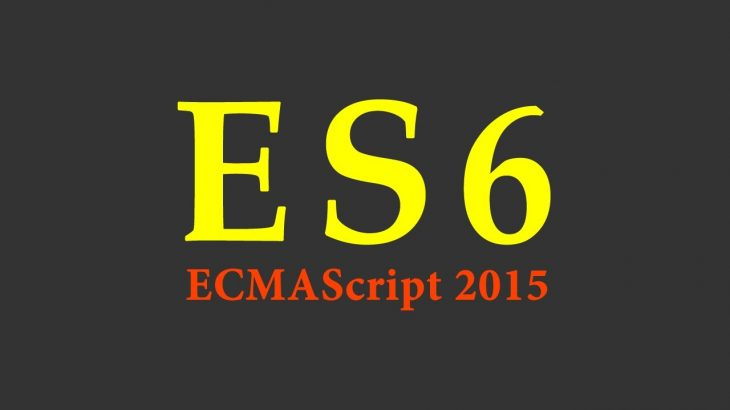

JavaScript is a programming language that is evolving very rapidly. It is trying to
become more classic in terms of Object-Oriented Programming but still keep its huge
power.

This chapter is a **difficult one**, especially because it has a lot of small
tasks that you have to accomplish at the end. 

But it is equally and **absolutely necessary** if you want to be up-to-date with the latest
JavaScript language improvements.

