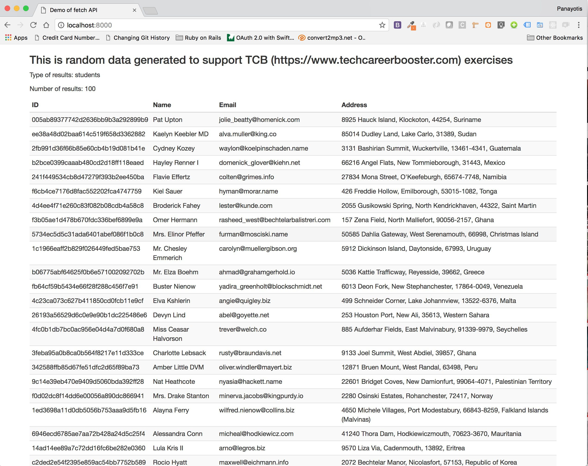

# Implement the following tasks

The following tasks differ in complexity. Some of them are simple, some of them require more effort from you. In any case,
it is very important for you to practice with these tasks, because they will increase your confidence and skills in ES6.

Note: All your code needs to be uploaded to your Github account.

## Task 1

Write a class called `Point`, which represents a point in two-dimensional space. A point has `x` and `y` properties, 
given as arguments to its constructor.

It also has a single method `plus`, which takes another point and returns the sum of the two points, that is, a new point whose `x` 
is the sum of the `x` properties of the two original points, and whose `y` is the sum of their `y` properties.

Example usage of these classes:

``` JavaScript
console.log(new Point(1, 2).plus(new Point(2, 1)));
```
which if run should print `Point{x: 3, y: 3}`.

## Task 2

(Continue work with http://marijnhaverbeke.nl/talks/es6_falsyvalues2015/exercises/#Speaker_upgrade)

Create a class `Speaker` that exposes the method `#speak()`. Each `Speaker` instance is initialized
with the `name` of the speaker it represents. The `#speak()` method takes an argument and writes to
the console the name of the speaker suffixed with the `#speak()` argument. Example call:

``` JavaScript
new Speaker('Bob').speak('come here!');
```

The above should log in the console the string `"Bob says: come here!"`

Moreover, implement the class `Shouter`, which should extend `Speaker`. Instances of class `Shouter`
should have a `#speak()` that prints its argument upcased.

Hence, 

``` JavaScript
new Shouter('Bob').speak('come here!');
```

should print the string `"Bob says: COME HERE!"` in the console.

## Task 3

Create a `Customer` with `firstName` and `lastName` attributes. Also, create accessor properties for the `fullName`
The `fullName` getter should return the `firstName` and `lastName` concatenated using a space in between them. The `fullName`
setter should take a string, e.g. `"John Woo"` and should set the `firstName` and `lastName` accordingly (e.t. `"John"` for
`firstName` and `"Woo"` for `lastName`).

## Task 4

Below, you can see a piece of JavaScript code.

``` JavaScript
const startNode = (type, value, options) => {
  return YOUR_CODE_HERE
}

console.log(startNode("Identifier", "foo", {
  sourceProperty: "src",
  sourceValue: "bar.js"
}))
// → {type: "Identifier",
//    value: "foo",
//    src: "bar.js"}
```

There is a placeholder `YOUR_CODE_HERE`. This is where you should write a piece of JavaScript code so that the `console.log(...)` 
call that ends this snippet, prints `{type: "Identifier", value: "foo", src: "bar.js"}`.

The idea is that you need to construct the third property of the object returned by `startNode()` so that it has the name given
in the `options` `sourceProperty` value, and value given in the `options` `sourceValue` value.

## Task 5

Amend the following script so that it gives a `get()` method to the `ids` object. This method should return the
next id and increment its next counter.

``` JavaScript
const ids = {
  next: 0,
}

console.log(ids.get()); // print 0
console.log(ids.get()); // print 1
console.log(ids.get()); // print 2
```

## Task 6

A typical mistake we make in JavaScript is depicted in the following piece of code: We create a number of functions in a loop, 
and refer to an outside variable from these functions. All of them will end up referring to the same variable, which ends up being 
incremented to 10. Thus, callbacks[2] does not log 2. It logs 10, as do all functions in the array.

``` JavaScript
1. var callbacks = [];
2. for (var i = 0; i < 10; i++) {
3.  callbacks.push(function() { console.log(i); })
4. }
5.
6. callbacks[2]();
```

If you run the above program in a JSBin or in a JSFiddle, you will see that it prints `10` and not `2` as one might have 
expected. This is because when we invoke `callbacks[2]` function, line 6, the variable `i` the function implementation 
uses, has already reached the value `10` and this is what is being actually used.

How can we solve this problem using ES6?

## Task 7

Look at the following program:

``` JavaScript
const account = {
  username: "martin",
  password: "xyz"
}

account.password = "secret";
console.log(account.password);
```

Is it wrong? Can we change the `password` value now that we have the `account` being `const`? If we can, what is the
alternative? How can we make `password` being constant?

## Task 8

Write an expression using higher-order array methods (say, `filter` and reduce) to compute the total value of the `machines` in the `inventory` array.

``` JavaScript
const inventory = [
  {type: "machine", value: 5000},
  {type: "machine", value: 650 },
  {type: "duck", value: 10},
  {type: "furniture", value: 1200},
  {type: "machine", value: 77}
];

const result = YOUR_CODE_GOES_HERE

console.log(result);
```

## Task 9

You need to implement a class that represents a sorted array, and it should be used more or less like this:

``` JavaScript
 1. const sortedArray = new SortedArray(A_COMPARISON_FUNCTION);
 2. 
 3. sortedArray.insert(5); 
 4. sortedArray.insert(2); 
 5. sortedArray.insert(6); 
 6. sortedArray.insert(10); 
 7. sortedArray.insert(1); 
 8. sortedArray.insert(4); 
 9. 
10. console.log("array: ", sortedArray.content);
```

As you can see on line 1, we instantiate the `SortedArray` class with a comparison function. The comparison function
should be used internally, by the `SortedArray` class, every time we call `insert()`. The insert will have to put
its argument in the correct position based on the comparison function. 

The comparison function should take two elements as input.

If you want the array to be sorted in ascending order, then, the comparison function should return a negative number if 
the first element is less than the second, a 0 if the two elements are equal and a positive number if the first element 
is greater than the second.

If you want the array to be sorted in descending order, the comparison function should return a positive number if the
first element is less than second, 0 if they are equal, and a negative number if the first element is greater than the
second element.

On line 10, we print the contents of the `.content`, which is the array the `SortedArray` object holds its state in. 
The string that line 10 prints depends on the comparison function given to `SortedArray` instantiation. If the
comparison function compares in ascending mode, then line 10 will print `[1, 2, 4, 5, 6, 10]`. If the comparison function
compares in descending mode, then the line 10 will print `[10, 6, 5, 4, 2, 1]`.

In order to solve this exercise, you might want to use the method `.findIndex()` which is described [here](https://developer.mozilla.org/en-US/docs/Web/JavaScript/Reference/Global_Objects/Array/findIndex).
It returns the first position of the first element that satisfies the condition encoded inside the function given as
argument to `.findIndex()`. 

Also, you may want to use the method `.splice()` which is described [here](https://developer.mozilla.org/en-US/docs/Web/JavaScript/Reference/Global_Objects/Array/splice).
It can be used to insert a new element into an array at a specified position.

## Task 10

Fill in the following piece of code:

``` JavaScript
const go = (YOUR_CODE_HERE) => {
  YOUR_CODE_HERE
  
  console.log("speed=", speed, "hyperdrive=", hyperdrive);
}

go(); // prints speed= 30 hyperdrive= 8
go({speed: 10, hyperdrive: 30}); // prints speed= 10 hyperdrive= 30
```

If you run this program, it should print

``` javascript
speed= 30 hyperdrive= 8
speed= 10 hyperdrive= 30
```

As you can understand, the argument to `go` is optional. Also, the default value for `speed` is `30` and for `hyperdrive` is `8`.

Use ES6 syntax to solve this problem.

## Task 11

How can you make `start` having as default value the last index of the array?

``` JavaScript
const lastIndexOf = (arr, elt, start) => {
  for(let i = start; i >= 0; i--) {
    if (arr[i] === elt)
      return i;
  }
  return -1;
}

console.log(lastIndexOf([1, 2, 1, 2, 5], 1)); // should print 2
console.log(lastIndexOf([1, 2, 1, 2, 5], 2)); // should print 3
console.log(lastIndexOf([1, 2, 1, 2, 5], 5)); // should print 4
```

Change the above piece of code so that `lastIndexOf()` works as expected. Currently, no matter what element we are searching for,
it always returns `-1`. In order to fix that, you need to provide a default value for the `start` argument. The default value
should be the last index of the array given as first argument.

## Task 12

The following piece of code includes a function `detectCollision()`, which returns the object that includes the point given.
 
```javascript
const detectCollision = (objects, point) => {
  for (let i = 0; i < objects.length; i++) {
    let object = objects[i]
    if (point.x >= object.x && point.x <= object.x + object.width &&
        point.y >= object.y && point.y <= object.y + object.height)
      return object
  }
}

const myObjects = [
  {x:  10, y: 20, width: 30, height: 30},
  {x: -40, y: 20, width: 30, height: 30},
  {x:   0, y:  0, width: 10, height:  5}
]

console.log(detectCollision(myObjects, {x: 4, y: 2}))
```

If you run it, you will get `{x: 0, y: 0, width: 10, height: 5}` in the console, because this is the object, the last one, that includes
the point `{x: 4, y: 2}`.

Can you use higher order functions in order to make this code cleaner? You might want to use the 
method [find](https://developer.mozilla.org/en-US/docs/Web/JavaScript/Reference/Global_Objects/Array/find) Array method,
which returns the first object that satisfies (returns `true`) the function given as argument to `find`.

## Task 13

Practice the spread operator by simplifying the following three functions. The `replace`, replaces parts of
an array (`array`) using elements of another `elements`. The function `copyReplace` does the same but does
not alter the original array. Last, the function `recordBirds` push an object into the array `birdsSeen`.
The object has two properties: a) `time` and b) and array of birds.

Note that the changes that you have to do are only inside the bodies of the functions, and possibly at the
arguments that they take and they are being called with.

Finally, you may find it good to read an extensive article on the `spread` and `rest` operators [here](https://dmitripavlutin.com/how-three-dots-changed-javascript/)

``` JavaScript
const replace = (array, from, to, elements) => {
  array.splice.apply(array, [from, to - from].concat(elements));
}

let testArray = [1, 2, 100, 100, 6];
replace(testArray, 2, 4, [3, 4, 5]);

console.log(testArray); // prints [1, 2, 3, 4, 5, 6]
 
const copyReplace = (array, from, to, elements) => {
  return array.slice(0, from).concat(elements).concat(array.slice(to));
} 

console.log(copyReplace([1, 2, 100, 200, 6], 2, 4, [3, 4, 5])); // prints [1, 2, 3, 4, 5, 6]

let birdsSeen = []
const recordBirds = (time) => {
  birdsSeen.push({time: time, birds: Array.prototype.slice.call(arguments, 1)});
}

recordBirds(new Date, "sparrow", "robin", "pterodactyl");
console.log(birdsSeen.length); // prints 1
console.log(birdsSeen[0].time); // prints the current date
console.log(birdsSeen[0].birds); // prints ["sparrow", "robin", "pterodactyl"]
```

## Task 14

This is an exersice for template strings, strings with interpolated values. Here is the code:

``` JavaScript

const teamName = "tooling"
const people = [{name: "Jennie", role: "senior"},
                {name: "Ronald", role: "junior"},
                {name: "Martin", role: "senior"},
                {name: "Anneli", role: "junior"}]
                
let role = "senior";                
let message = YOUR_CODE_HERE                

console.log(message);
```

Fill in the code so that it prints the following multiline message. Make sure that the string is built
using the data and hard coded values.

``` text
There are 4 people on the tooling team.
Their names are Jennie, Ronald, Martin, Anneli.
2 of them have a senior role.
```

## Task 15

You need to fill in the following JavaScript function, `connectedValue`. This sums up all the values of the nodes of
a graph that a given `node` is connected to, directly or indirectly. You need to find a way to traverse the graph starting from the given
`node`. Make sure that you don't end doing infinite circles. You need to use a `Set` to keep track of the nodes that you visit.

This is an example graph:

```
80 => 90 => 78 => 90
   => 30 => 20
   => 50 => 78
   => 80
100 => 90
    => 80   
```
For that graph, starting from node `80` the result should be `348` because we add the nodes: `80`, `90`, `30`, `50`, `78` and `20`.
 
``` JavaScript
// Generate a random graph
const graph = [];
const numberOfNodes = 5;
const numberOfEdges = 20;
const maxNodeValue = 1000;
for (let i = 0; i < numberOfNodes; i++) {
  const newNode = {value: Math.floor(Math.random() * (maxaNodeValue + 1)), edges: []};
  graph.push(newNode);
}
for (let i = 0; i < numberOfEdges; i++) {
  let from = graph[Math.floor(Math.random() * graph.length)];
  let to = graph[Math.floor(Math.random() * graph.length)];
  if (from.edges.indexOf(to) != -1)
    continue
  from.edges.push(to);  
}

const connectedValue = (node) => {
  YOUR_CODE_HERE
}

console.log(connectedValue(graph[0]));
```

## Task 16

Implement your version of the `Map` class. Call it `MyMap`. Here is the placeholder code:

``` JavaScript
class MyMap {

  // YOUR CODE HERE
  
}  

const customers = new MyMap();

class Customer {
  constructor(firstName, lastName, age) {
    this.firstName = firstName;
    this.lastName = lastName;
    this.age = age;
  }
  get fullName() {
    return `${this.firstName} ${this.lastName}`;
  }
}

let customer = new Customer('John', 'Smith', 36);
customers.set(customer.fullName, customer);

customer = new Customer('Mary', 'Poppins', 28);
customers.set(customer.fullName, customer);

console.log(customers.get('John Smith').age); // prints 36 
console.log(customers.size); // prints 2

customers.delete('John Smith')
console.log(customers.get('John Smith')) // prints undefined

customer = customers.get('Mary Poppins');
console.log(customer.fullName, customer.age); // prings 'Mary Poppins', 28

customers.clear(); 
console.log(customers.get('Mary Poppins')); // prints undefined
```

Your `MyMap` class needs to implement the following methods so that the above program runs successfully:

1. `#set(key, value)`
1. `#get(key)`
1. `#delete(key)`
1. `#get size()`
1. `#clear()`

These methods should do what their corresponding methods on actual [Map](https://developer.mozilla.org/en-US/docs/Web/JavaScript/Reference/Global_Objects/Map) do. 

Don't use the `Map` class internally. Use other structure. We don't care for performance. We just want you to implement the
methods.

## Task 17

You need to use the [fetch](https://developer.mozilla.org/en-US/docs/Web/API/Fetch_API/Using_Fetch) API in order to fetch data 
from [TCB Students Fake Data](http://fakedata.techcareerbooster.com/)

Implement a Web page that when loaded will display the random data as in the following screenshot:



Your page should be fetching the demo random data [from this end point](http://fakedata.techcareerbooster.com/api/exercises_and_code/students.json).

Note that all the data displayed on the page, including the top description, the type and number of results, should be dynamically filled in using the information returned by the end-point.

We have used Twitter Bootstrap to style the page. You may want to use that too.

## Task 18

Look at the following code. It is using the property `_content` relying on the `_` prefix to mark it as private.

``` JavaScript
class Queue {
  constructor() {
    this._content = []
  }
  put(elt) {
    return this._content.push(elt)
  }
  take() {
    return this._content.shift()
  }
}

let q = new Queue
q.put(1)
q.put(2)
console.log(q.take())
console.log(q.take())
```

Do you know how you can change the code to use a symbol instead of an underscored-named property? [You may want to read this](http://2ality.com/2016/01/private-data-classes.html) too in order 
to better understand how privacy can be achieved in JavaScript.

## Task 19

Make a class of `EvenNumbers`. It should be used like this:

``` JavaScript
const evenNumbers = new EvenNumbers([1, 2, 3, 4, 5, 6, 7, 8, 9, 10]);

for(let num of evenNumbers) {
  console.log(num);
}
```

The above prints the numbers 2 up to 10.

You need to make the class iterable.


