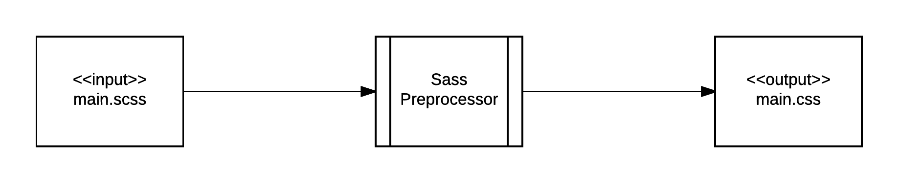
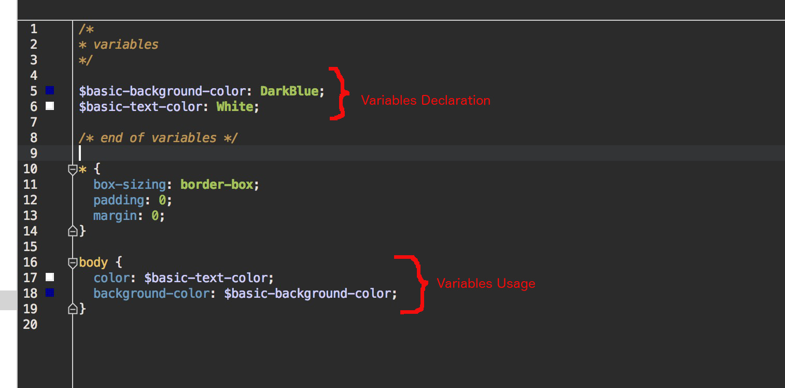

Sass (Syntactically Awesome StyleSheets) is a language that allows you to write stylesheet rules with many more tools 
and language constructs available to you than the ones with simple CSS.

Let's start our encounter with Sass by first installing it.

## Install

Sass, in the Mac world, is coming as a gem. You will learn about gems later on, when we will start the back-end developer sections.
Until then, you only have to know that a gem is a set of Ruby libraries/utilities.

Since Sass is coming packaged as a gem, it can be installed using the `gem install` command.

Open a terminal and type the following:

``` bash
gem install sass
```

If everything goes well, you will see something like the following:

```
Fetching: sass-3.4.22.gem (100%)
Successfully installed sass-3.4.22
Parsing documentation for sass-3.4.22
Installing ri documentation for sass-3.4.22
Done installing documentation for sass after 4 seconds
1 gem installed
```

> *Note:* If you get any error, try to install it using the `sudo gem install sass` command instead. You will need to be able to give
the password of the administrator user on your local machine.

You can check whether you have installed Sass successfully by running the following terminal command:

``` bash
sass -v
```

Do you get something like this?

``` bash
Sass 3.4.22 (Selective Steve)
```

If yes, then you are all setup to use Sass latest version.

## Sass is a preprocessor

Sass is a preprocessor that takes as input a Sass file and generates a CSS file. Hence, you do not write your stylesheet rules inside a CSS
file. You write it, inside a Sass file, instead.

> *Note:* We will use the SCSS version of Sass. For that reason, the filename extensions with our Sass rules will be `.scss` and not `.sass`.




### Example Invocation

Let's write our first Sass file:

``` scss
body {
    font-size: 32px;
}
```

Write the above content inside a file with name `assets/stylesheets/main.scss`.

Then invoke sass on your command line, as follows:

``` bash
sass assets/stylesheets/main.scss assets/stylesheets/main.css
```

This will take the input file `assets/stylesheets/main.scss` and generates the output file `assets/stylesheets/main.css`.

If you look at the contents of the generated file, you will see this:

``` css
body {
  font-size: 32px; }

/*# sourceMappingURL=main.css.map */
```

Well Done! You have written your first Sass file rules and you have generated your first Sass processed CSS file.

As you can see, the content of the generated output is pure CSS code. For that particular example, this is the same
as the input content. This is because our `main.scss` file didn't actually contain any Sass specific commands. This will change
as soon as we start inserting Sass commands inside our Sass file.

> *Note:* The generated *.map file is used for debugging purposes. It links the generated *.css file to the input *.scss file.
We will not spend time on that. If you want to read more about map files, [you can read this](http://thesassway.com/intermediate/using-source-maps-with-sass).

### Watching a file

While you can change the source file and then invoke the `sass` command line tool, every time you change the source file, in order
to get the new version of the generated output, there is a convenient way you can start `sass` that would make it `watch` the
particular input file. `Watching` means that `sass` will be notified whenever the input file is updated and will automatically generate the
new output file.

In order to do that, you need to start `sass` with the `--watch` option. Let's do that for our case. On your command line type the following:

``` bash
sass --watch assets/stylesheets/main.scss
```

You will see something like the following:

``` bash
>>> Sass is watching for changes. Press Ctrl-C to stop.
[Listen warning]:
  Listen will be polling for changes. Learn more at https://github.com/guard/listen#polling-fallback.
```

and `sass` will hold of your terminal control. Will be running forever until you close the terminal, or you kill the process, or just click on <kbd>Ctrl+C</kbd>.
While running will be watching for changes in the file `assets/stylesheets/main.scss`.

Let's do one change. Make the `assets/stylesheets/main.scss` content being like the following:

``` scss
body {
  font-size: 32px;
}

h1 {
  font-size: 56px; 
}
```

When you save your changes in `assets/stylesheets/main.scss` file, you will see the following being printed by the already running `sass` command:

``` bash
>>> Change detected to: assets/stylesheets/main.scss
      write assets/stylesheets/main.css
      write assets/stylesheets/main.css.map
```

It is clear from the message, that a new version of the file `assets/stylesheets/main.css` has been generated:

``` css
body {
  font-size: 32px; }

h1 {
  font-size: 56px; }

/*# sourceMappingURL=main.css.map */
```

### Watching a directory

Except from a particular file, you can also ask `sass` to watch a specific directory. Then, any changes to `*.scss` files inside this directory will be 
automatically detected and new `*.css` files will be generated.


Let's now see the basic elements of Sass language.

## Basic Elements of Sass Language

### Variables

This is a very powerful feature. Like the variables in programming languages, you can declare variables inside your Sass file. Any value that can be assigned
to a CSS property, can be stored inside a variable instead. Then the variable name can be used wherever one can use CSS property values. Note that variable names
need to start with the symbol `$`.

Let's change our `assets/stylesheets/main.scss` file to have the following content:

``` scss
/*
* variables
*/

$basic-background-color: DarkBlue;
$basic-text-color: White;

/* end of variables */

* {
  box-sizing: border-box;
  padding: 0;
  margin: 0;
}

body {
  color: $basic-text-color;
  background-color: $basic-background-color;
}
```



When you save the above file, you will see that running `sass` will generate a new `assets/stylesheets/main.css` file, with the following content:

``` css
/*
* variables
*/
/* end of variables */
* {
  box-sizing: border-box;
  padding: 0;
  margin: 0; }

body {
  color: White;
  background-color: DarkBlue; }

/*# sourceMappingURL=main.css.map */
```

As you can see the variable values have been used inside the CSS file whenever we had their references inside the Sass file. The variables themselves do not exist
anymore inside the CSS file.

Variables are widely used to store color values, font stack values and other frequently used values.

### Nesting

We have already learnt about the nesting nature of HTML documents. Also, we have learnt how one can define a CSS selector relying on the nesting relationship
of the HTML elements the selector needs to select. 

Let's take an example. If the HTML page has the fragment:

``` html
<ul>
    <li>Cheese</li>
    <li>Rice</li>
    <li>Coffee</li>
    <li>Milk</li>
    <li>Wine</li>
</ul>
```

then we can have a CSS rule like:

``` css
ul li {
    font-size: 8px;
}
```

If on top of that you had to specify some rules for the `ul` itself you would have to do it like that:

``` css
ul {
    margin-left: 10px;
}

ul li {
    font-size: 8px;
}
```

With Sass, it is very easy to write nested rules using a nesting syntax. So, the above example would have been written:

``` scss
ul {
  margin-left: 8px;
  
  li {
    font-size: 8px;  
  }
}
```

Hence, nesting is very useful for you to avoid CSS code duplication and to make your CSS rules easily and clearly mapped to
your HTML elements structure.

> **Important**: You shouldn't nest in too many levels. Sass code becomes unreadable and difficult to maintain.

Let's try an example with our `assets/stylesheets/main.scss` file:

``` scss
/*
* variables
*/

$basic-background-color: DarkBlue;
$basic-text-color: White;

/* end of variables */

* {
  box-sizing: border-box;
  padding: 0;
  margin: 0;
}

body {
  color: $basic-text-color;
  background-color: $basic-background-color;
}

div {
  margin-top: 20px;

  ul {
    margin-left: 10px;

    li {
      font-size: 8px;
    }
  }
}
```

We have added the `div { ... }` Sass rules. When you save the file with new content, and as long as you have the `sass` utility running and watching your `.scss` file
then you will see the new `assets/stylesheets/main.css` file being generated.

``` css
/*
* variables
*/
/* end of variables */
* {
  box-sizing: border-box;
  padding: 0;
  margin: 0; }

body {
  color: White;
  background-color: DarkBlue; }

div {
  margin-top: 20px; }
  div ul {
    margin-left: 10px; }
    div ul li {
      font-size: 8px; }

/*# sourceMappingURL=main.css.map */
```

Do you see how Sass compiler generated the CSS rules for `div`, `div ul` and `div ul li` elements?

### Referencing Parent Selector with `&`

Sometimes we want, inside a nested rule, to reference the selector of the nesting / parent rule. For example, when we want to specify the style of the `hover` 
state of an anchor. See this:

``` scss
div.left-column {
    a {
        color: Blue;
        &:hover {
            color: LightBlue;
        }
    }
}
```

If we add the above to our `assets/stylesheets/main.scss` file, the corresponding generated part of the `assets/stylesheets/main.css` file will be:

``` css
* {
  box-sizing: border-box;
  padding: 0;
  margin: 0; }

body {
  color: White;
  background-color: DarkBlue; }

div {
  margin-top: 20px; }
  div ul {
    margin-left: 10px; }
    div ul li {
      font-size: 8px; }

div.left-column a {
  color: Blue; }
  div.left-column a:hover {
    color: LightBlue; }
    
/*# sourceMappingURL=main.css.map */
```

### Namespaced properties

There are many CSS properties that are in "namespaces", like the `background-color`, `background-image` e.t.c. These background example properties
are in the `background` namespace. Sass allows us to avoid typing the namespace as a prefix on all the properties. This can be done with the 
nesting and the `:` suffix on the namespace. 

Write the following inside the `assets/stylesheets/main.scss`:

``` scss
.right-column {
    background: {
        color: #2b542c;
        image: url("../images/parthenon.jpg");
        repeat: no-repeat;
        attachment: fixed;
        position: left top;
        size: 100% 100%;
    }
}
```

and then see the generated file being this:

``` css
* {
  box-sizing: border-box;
  padding: 0;
  margin: 0; }

body {
  color: White;
  background-color: DarkBlue; }

div {
  margin-top: 20px; }
  div ul {
    margin-left: 10px; }
    div ul li {
      font-size: 8px; }

div.left-column a {
  color: Blue; }
  div.left-column a:hover {
    color: LightBlue; }

.right-column {
  background-color: #2b542c;
  background-image: url("../images/parthenon.jpg");
  background-repeat: no-repeat;
  background-attachment: fixed;
  background-position: left top;
  background-size: 100% 100%; }
  
/*# sourceMappingURL=main.css.map */  
```

Very well. The generated CSS file contains the `background-xxxx` properties as if we had them written ourselves, one-by-one. But they were 
generated automatically, because of the nesting inside `background:`.


### Partials and @import

It is a good practice to not use large source files. This is true for any programming language source files. Same is true for Sass files.
Usually, we organize the source Sass files into smaller units and we then combine their contents using the `@import` statement. The smaller
files are called partials and their filename needs to start with an underscore character `_`. Sass compiler knows very well that these
files are partials and does not try to convert them to CSS files.

Let's break our `assets/stylesheets/main.scss` file into 2 files. First file will be the `assets/stylesheets/_variables.scss` and will be
holding the variables that our main Sass file will be using. The second file will be the `assets/stylesheets/main.scss` and will be
importing the first one.

Hence, the `assets/stylesheets/_variables.scss` should be this:

``` scss
$basic-background-color: DarkBlue;
$basic-text-color: White;
```

and the `assets/stylesheets/main.scss` should be this:

``` scss
@import 'variables';

* {
  box-sizing: border-box;
  padding: 0;
  margin: 0;
}

body {
  color: $basic-text-color;
  background-color: $basic-background-color;
}

div {
  margin-top: 20px;

  ul {
    margin-left: 10px;

    li {
      font-size: 8px;
    }
  }
}
```

When you save the above files, the new `assets/stylesheets/main.css` file will be generated, which will not have any difference to the previous one. 

As you can see, the first line of our `main.scss` file contains the `@import "variables";` statement that imports the content of the corresponding file
and uses it as if it were inside the `main.scss` file from the beginning. 

> *Note*: that although we name the file `_variables.scss`, we do not specify the `_` neither the `.scss` in the `@import` statement.
 
> *Information*: `CSS` itself supports the `@import` command but it works quite differently. Browser, after fetching the main file, when it encounters
an `@import` statement, it does one more request to the server to fetch the content of the imported file. With Sass, the `@import` is used such
that the main file is prepared with all the necessary content. Hence, browser will only do 1 request to the server to just only bring the main file.

### Mixins

Sass Mixins are like JavaScript functions, for example. They allow you to group a set of CSS attribute values under a name and then use that name
inside CSS rules. This is very useful, when you have rules with vendor specific prefixes. It saves you from a lot of typing.
 
For example, let's assume that you want to set the `border-radius` to 60px for a set of divs (with class `big-radius`) and to 30px for another set
of divs (with class `small-radius`). What would you do with traditional CSS would have been this:

``` css
div.big-radius {
  -webkit-border-radius: 60px;
     -moz-border-radius: 60px;
      -ms-border-radius: 60px;
          border-radius: 60px;
}

div.small-radius {
  -webkit-border-radius: 20px;
     -moz-border-radius: 20px;
      -ms-border-radius: 20px;
          border-radius: 20px;
}
```

There is a lot of repetition on the above code. We can save ourselves from this unmaintainable and error-prone code using Sass and mixins. Like this:
 
``` scss
@mixin border-radius($radius) {
  -webkit-border-radius: $radius;
     -moz-border-radius: $radius;
      -ms-border-radius: $radius;
          border-radius: $radius;
}

div.big-radius { @include border-radius(60px); }
div.small-radius { @include border-radius(10px); }
```

What are we doing here? We group the `xxxx-border-radius` attribute value pairs inside a mixin with name `border-radius`. The mixin name can be anything that
we like. Also, we are saying that the mixin takes a parameter, like a local variable. 

Then, when we really need this mixin, we invoke its definition by using the keyword `@include`. All the attribute value pairs of the mixin are going to be applied
at the position we invoke the mixin with the `@include` statement.

Let's take this mixin and put it inside our `assets/stylesheets/main.scss` file:

``` scss
@import 'variables';

* {
  box-sizing: border-box;
  padding: 0;
  margin: 0;
}

body {
  color: $basic-text-color;
  background-color: $basic-background-color;
}

div {
  margin-top: 20px;

  ul {
    margin-left: 10px;

    li {
      font-size: 8px;
    }
  }
}

@mixin border-radius($radius) {
  -webkit-border-radius: $radius;
  -moz-border-radius: $radius;
  -ms-border-radius: $radius;
  border-radius: $radius;
}

div.big-radius { @include border-radius(60px); }
div.small-radius { @include border-radius(10px); }
```

When we save, a new CSS file will be generated. This will have the following content:

``` css
* {
  box-sizing: border-box;
  padding: 0;
  margin: 0; }

body {
  color: White;
  background-color: DarkBlue; }

div {
  margin-top: 20px; }
  div ul {
    margin-left: 10px; }
    div ul li {
      font-size: 8px; }

div.big-radius {
  -webkit-border-radius: 60px;
  -moz-border-radius: 60px;
  -ms-border-radius: 60px;
  border-radius: 60px; }

div.small-radius {
  -webkit-border-radius: 10px;
  -moz-border-radius: 10px;
  -ms-border-radius: 10px;
  border-radius: 10px; }

/*# sourceMappingURL=main.css.map */
```

Do you see how the `div.big-radius` and `div.small-radius` rules have been automatically generated? Pretty cool, isn't it? It saves us a lot of typing.

### Extend/Inheritance

Another very useful tool to reuse your CSS rules is the `@extend` functionality. It allows you to include a set of rules inside another set of rules.

Let's see an example. Suppose that we have the following HTML fragment:

``` html
<div>
  This is a success message
</div>

<div>
  This is an error message
</div>

<div>
  This is an information message
</div>
```

We want to style all these divs as follows:

1. All divs need to have the same font-size.
2. All divs need to have the same padding sizes.

However, the success message divs need to have:

1. background color LightBlue
2. text color Black

The error message divs need to have:

1. background color Red
2. text color White

The information message divs need to have:

1. background color DarkBlue
2. text color Yellow

How can we write that in CSS? We could write something like this

``` css
.message {
    font-size: 12px;
    padding: 10px 20px;
}

.success {
    background-color: LightBlue;
    color: Black;
}

.error {
    background-color: Red;
    color: White;
}

.information {
    background-color: DarkBlue;
    color: Yellow;
}
```

and then apply those classes to our divs accordingly:

``` html
<div class="message success">
  This is a success message
</div>

<div class="message error">
  This is an error message
</div>

<div class="message information">
  This is an information message
</div>
```

The problem with this is that we have to apply multiple classes on our divs. Two in this particular HTML fragment. In other cases we might have
required more. We can avoid that using Sass and `@extend` as follows:

``` scss
.message {
    font-size: 12px;
    padding: 10px 20px;
}

.success {
    @extend .message;
    background-color: LightBlue;
    color: Black;
}

.error {
    @extend .message;
    background-color: Red;
    color: White;
}

.information {
    @extend .message;
    background-color: DarkBlue;
    color: Yellow;
}
```

If we do that, then we only have to apply 1 class to our divs:

``` html
<div class="success">
  This is a success message
</div>

<div class="error">
  This is an error message
</div>

<div class="information">
  This is an information message
</div>
```
 
If we add the above Sass rules inside the `assets/stylesheets/main.scss` file, then a new CSS file will be generated:
 
``` css
* {
  box-sizing: border-box;
  padding: 0;
  margin: 0; }

body {
  color: White;
  background-color: DarkBlue; }

div {
  margin-top: 20px; }
  div ul {
    margin-left: 10px; }
    div ul li {
      font-size: 8px; }

div.big-radius {
  -webkit-border-radius: 60px;
  -moz-border-radius: 60px;
  -ms-border-radius: 60px;
  border-radius: 60px; }

div.small-radius {
  -webkit-border-radius: 10px;
  -moz-border-radius: 10px;
  -ms-border-radius: 10px;
  border-radius: 10px; }

.message, .success, .error, .information {
  font-size: 12px;
  padding: 10px 20px; }

.success {
  background-color: LightBlue;
  color: Black; }

.error {
  background-color: Red;
  color: White; }

.information {
  background-color: DarkBlue;
  color: Yellow; }

/*# sourceMappingURL=main.css.map */
```

According to the CSS rules that have been generated, you can safely use the `.success` class, for example, in order to apply:
  
``` css
font-size: 12px;
padding: 10px 20px;
background-color: LightBlue;
color: Black;
```

This is achieved thanks to `@extend` which allows you to reuse the attribute values of the `parent` CSS rule `.message`.

### Operators

Sometimes you may want to calculate widths or heights or other pixel dimensions, or percentages, dynamically, without specifying
a fixed value. This can be easily done with the use of Sass operators: `+`, `-`, `*`, `/`, `%`. 

Let's see the following example. Amend the `assets/stylesheets/_variables.scss` file so that it contains the following variables:

``` scss
$container-width: 100%;
$left-column-width: 30%;
$right-column-width: $container-width - $left-column-width;
```

And then use those variables to set widths inside your `assets/stylesheets/main.scss` file.

``` scss
/* ... previous code goes here ... */
container {
  width: $container-width;
}

.left-column {
  width: $left-column-width;
}

.right-column {
  width: $right-column-width;
}
```

If you generate the output `assets/stylesheets/main.css` file, this will contain:

``` css
.container {
  width: 100%; }

.left-column {
  width: 30%; }

.right-column {
  width: 70%; }
```

As you can see the `.right-column` `width` attribute has been calculated to `70%`. This is pretty cool. Because you can change the left column width, and, then,
the right column width, will be calculated automatically.

## SCSS vs SASS

Sass allows you to use two different syntax methods:

1. SCSS
2. SASS

SCSS syntax is very close to original CSS syntax. Whereas SASS is an indented one, which allows the user to avoid using semicolons and braces. In this chapter,
we taught you about Sass using the SCSS syntax. It would have been a big leap to go to SASS directly. But, now, as soon as you feel familiar with both
CSS and SCSS, you can start learning SASS too. It's not mandatory though.

You need to take into account too, that Ruby on Rails, the framework that we will be using for the back-end part of this course, is using SCSS.

If you want to read an article that compares SCSS vs SASS, [you can read this](http://thesassway.com/editorial/sass-vs-scss-which-syntax-is-better).
 
Also, if you want to see how SASS looks like, you can use the command line utility `sass-convert`. Try the following:

``` bash
sass-convert assets/stylesheets/main.scss assets/stylesheets/main.sass
sass-convert assets/stylesheets/_variables.scss assets/stylesheets/_variables.sass
```

Then study the content of the `*.sass` files.

## Interactive Shell

We have already learnt about the `sass` utility that can help you convert Sass files to CSS files. Also, we have learned that it
can be used to convert SCSS files to SASS files and vice versa.

Here, we learn about the interactive shell abilities of `sass`. Interactive shell will allow you to run the SaasScript, which basically is the part of Saas
that deals with variables and operators.

You can start the Sass interactive shell with:

``` bash
sass -i
```

This will give you a prompt to type in SaasScript commands.

``` bash
>> 
```

Type in, for example, `1px + 2px`. It will give you `3px`:

``` bash
>> 1px + 2px
3px
>>
```

Or create a variable:

``` bash
>> $site-color: White
#ffffff
>>>
```

Or another one:

``` bash
>> $div-width: 50px
50px
>>
```

and then reuse that in another expression:

``` bash
>> $div-width * 50 / 100
25px
>>
```

So, Sass interactive can be used as a handy tool to experiment with SaasScript, variables and expressions.


