RDBMS stands for Relational Database Management Systems. These are the systems that are responsible to manage the database
with our application data. Traditionally, all data management applications use an RDBMS. Although, latest years other types of
database systems have flourished that fall into the NoSQL category.

As the name implies, an RDBMS is a system that manages data in a relational way. Sometimes the `S` stands for `Server` instead
of `System`. In that case it refers to the executable process that runs in the background and takes care of our database
management.

## RDBMS Server

A server is a process. It runs on the background as a daemon. It makes sure that we can store our data safely on the hard disk.
 
One server can manage multiple databases at the same time.

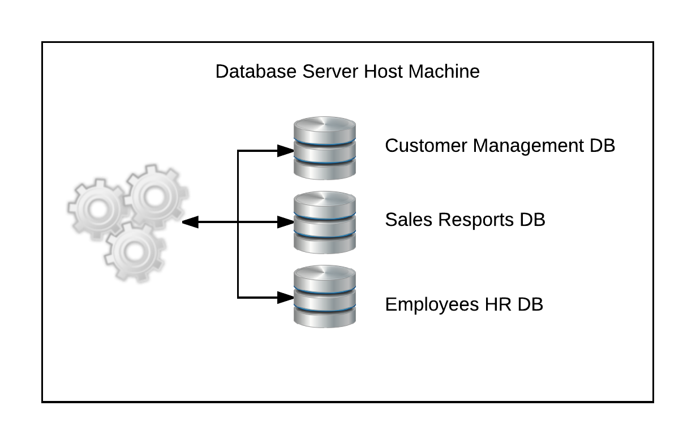

So, we do not have to have one server per database. It is becoming very cost-effective and it is efficient to have one server managing
many different databases at the same time.

Similarly, an RDBM Server can serve many different clients at the same time. 

The clients can be on the same client machine or on different client machines. They can even be on the same machine the RDBS server is running on.

In other words we may have multiple applications being served by the same server process.

Note that clients sending requests to an RDBM Server might be sending them over the Internet. They do not have to be on the same machine or same LAN
as the server process.

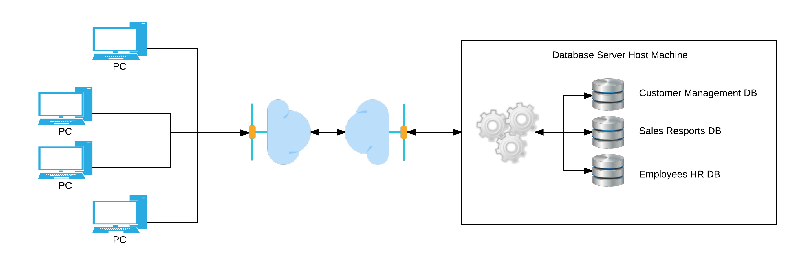

## Client - Server Model

An RDBMS is using the client - server model. In other words, RDBMS is a server process that responds to client requests. Whereas client is another process,
another program, that sends requests to the server.

## SQL

RDBMS client programs use SQL (Structured Query Language) to give instructions to server. 

SQL is basically divided into 2 categories:

* DDL - Data Definition Language. This is the set of SQL statements that describe to the server the structure of the data. How the data have to be.
* DML - Data Manipulation Language. This is the set of SQL statements that tell to the server what we want to do with the data. Basically, create, retrieve, update, delete commands.

## Data Modeling

Look at the following diagram. You need to understand that very well.

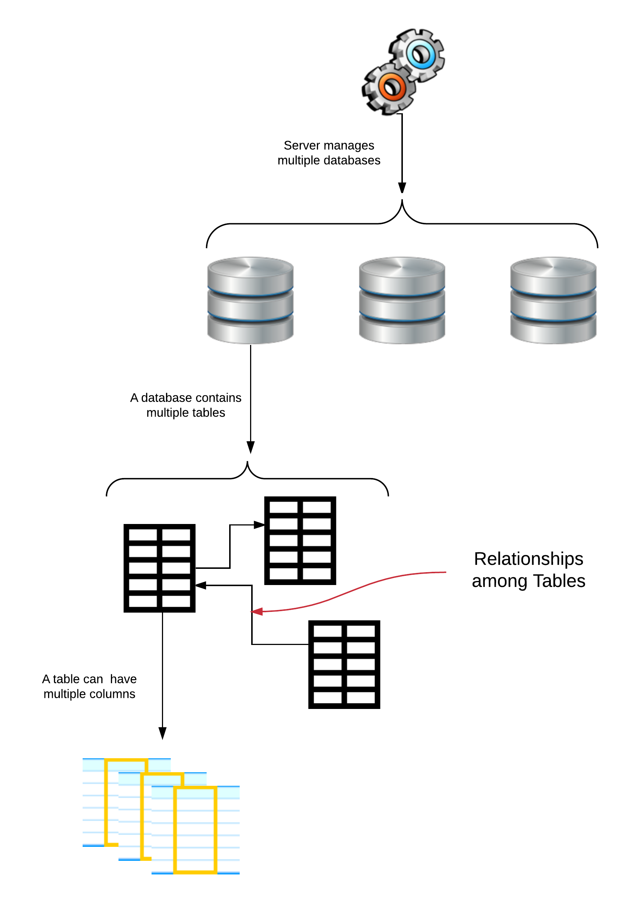

It basically says the following:

1. An RDBM server can manage multiple databases at the same time.
2. Each database contains one or more tables. A database with no tables is useless.
3. Each table contains one or more columns. A table without columns is useless too.
4. There are relationships between the tables of a database. That is why we call this system a Relational Database Management System.

Let's see an example of the above.

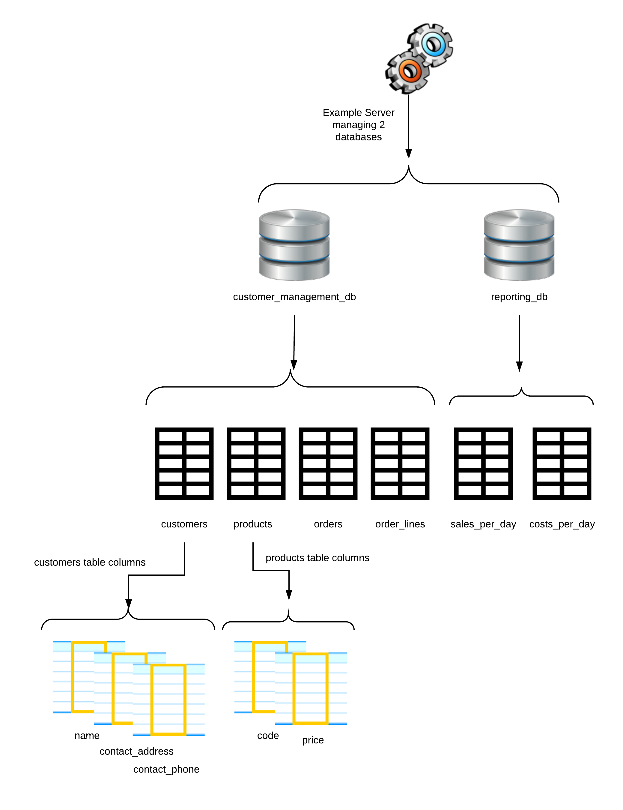

On the above example we have 1 RDMS managing 2 databases:

* `customer_management_db` and
* `reporting_db`

Each database has its own tables.

* `customer_management_db` has
    * `customers`
    * `products`
    * `orders`
    * `order_lines`
* `reporting_db` has
    * `sales_per_day`
    * `costs_per_day`
    
And each table has its own columns. For example:
    
* `customer` table has the columns:
    * `name`
    * `contact_address`
    * `contact_phone` and
* `products` table has the columns:
    * `code` and
    * `price`
    
Since each database has its own tables, that means that we can have the same name used by two different tables as long as 
those tables belong to different databases.

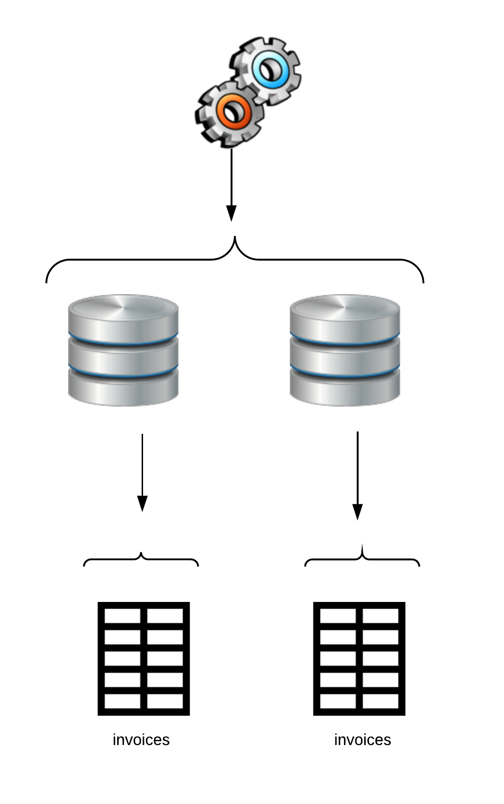

Same goes for the columns. You cannot have two columns with same name belonging to same table. But, you can have two columns with same name
belonging to different tables (even if those tables are in the same database).

## Like sheets on EXCEL or Google spreadsheets

One can find similarities between an EXCEL or Google spreadsheets document and an RDBMS database.

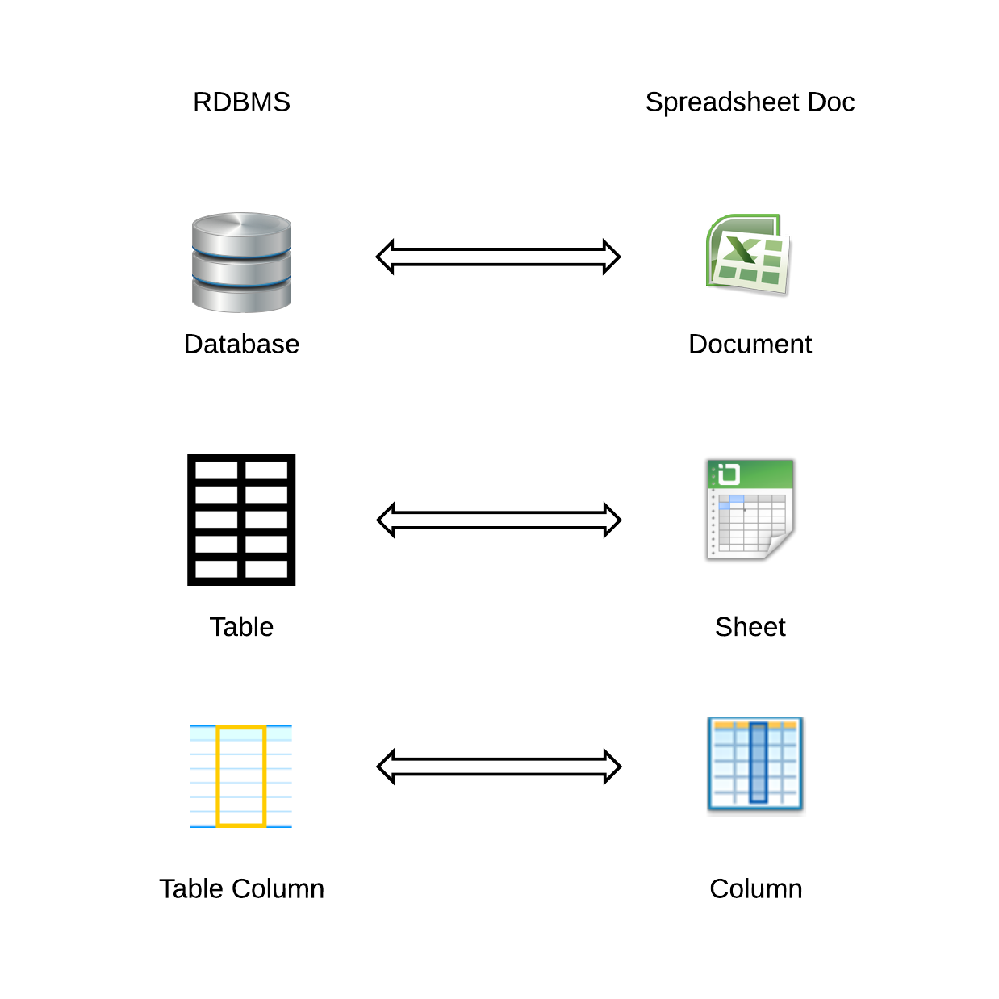

1. An EXCEL file or a Google spreadsheets document can be considered similar to a RDBMS database.
2. A sheet can be considered similar to a database table.
3. A sheet column can be considered similar to a database table column.

However, there are some important differences between a spreadsheet and an RDBMS.

1. Unlike EXCEL, an RDBMS column can only hold same type of data. For example, you cannot store in the column `name` of table `customers` the string `"Peter"` and
the integer `45`. 
1. Unlike EXCEL, a table in an RDBMS database can hold huge amounts of data. 
1. Unlike EXCEL, a table in an RDBMS database is related to another table. The RDBMS makes sure that business rules are enforced on these
relationships and make sure that we do not store invalid data into our tables. For example, you cannot have an entry in the table `orders` that
does not have corresponding entry in the table `customers`, or in other words, an entry in `orders` that does not belong to any `customer`.

## Tables and Business Entities

When we design our database we usually use 1 table to store data for 1 business entity. For example, we use a table with name `customers` to store
the occurrences, or the instances, of the business entity `Customer`. On another example, the table `products` is used to hold the instances of the
business entity `Product`. 

Since we usually have many occurrences, many instances of a business entity, each one with different characteristics and properties, we will create many
rows inside the table that is used to store instances of that business entity.

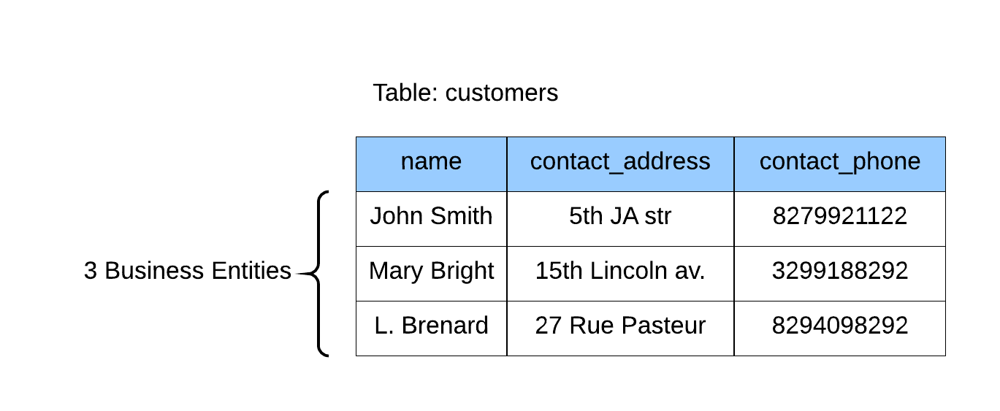

Above, you can see an example of a table `customers` storing 3 instances of the business entity `Customer`. 

Also, in order to represent the properties, attributes, characteristics of a business entity, we usually do that with corresponding columns. Hence, having identified that
a `Customer` has:

1. a Name
2. a Contact Address
3. a Contact Phone

we decide to create the corresponding columns on that table.

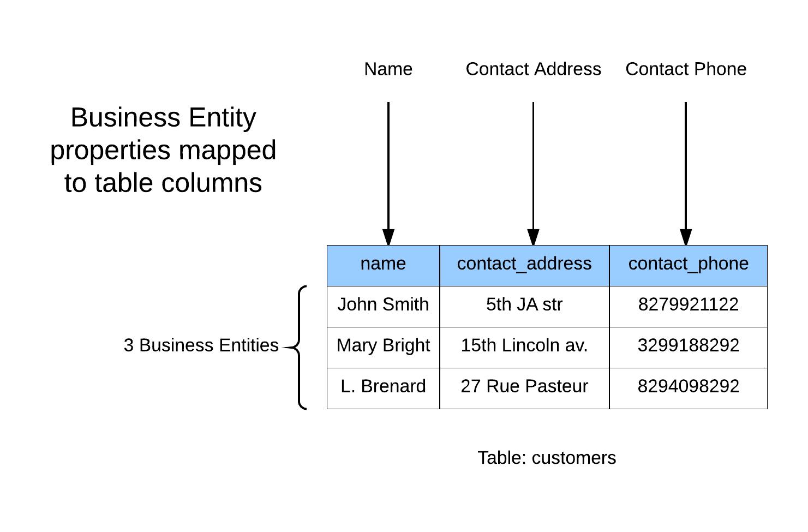

## Database Design

### Conceptual Model

If you are going to implement a data management application you will probably need to design the database. You have to identify your business entities and you
have to map them to tables. Having identified the business entities, then you have to identify the relationships between the business entities. Basically, there
can be the following relationships between business entities.

* one-to-one (1 - 1). One business entity is related to another one business entity.
* one-to-many (1 - n). One business entity is related to many other business entities.
* many-to-many (m - n). Many business entities are related to many other business entities. 

> *Information:* The type of the relationship between two entities is also called cardinality

Let's see the relationships with some examples:

The above example shows the relationship of a `Customer` to an `Order`. This is a one - to - many relationship. One `Customer` can
issue many `Order`s. 
 
This is also a one - to - one relationship. This is because one `Order` is always associated with one `Customer`.
 
Hence, you understand that, the relationship between two entities is not always one. It can be more than one. It depends on where
you start traversing the relationship from and where you end traversing the relationship to. Also, it depends on the actual
*verb* of the relationship:

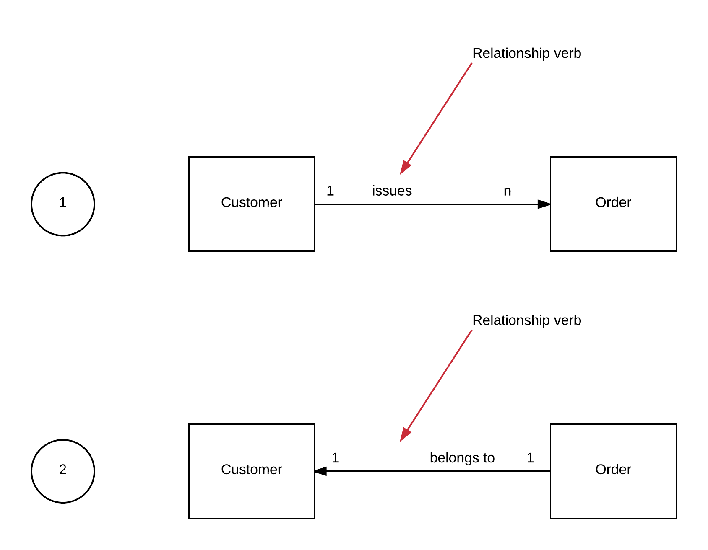

As you can see on the above diagram, we can view a relationship between two entities in many different ways. Depends on the verb
that we use and the direction that we follow.
 
1. Given a `Customer`, we can say that this `Customer` can issue many different `Order`s (one-to-many).
2. Given an `Order`, we can say that this `Order` belongs to a specific one `Customer` (one-to-one).

Let's see one more example with a many-to-many relationship:

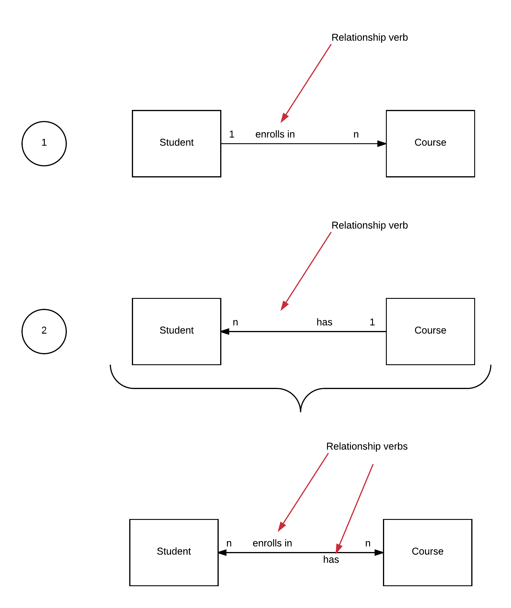

On the previous picture you can see the relationships between business entity `Student` and business entity `Course`. 

1. Given a specific `Student`, we can say that this `Student` can enroll in one or more, i.e. many, `Course`s (one-to-many), and
2. Given a specific `Course`, we can say that this `Course` can have one or more, i.e. many, `Student`s (one-to-many).
 
When two business entities are related with a one-to-many relationship, on both directions, then we say that they have 
a many-to-many relationship.

### Database Model

We have talked about the main types of relationships between business entities. The analysis and conceptual design is something
that you start with, but you finally have to design the actual database model using a specific RDBM system.

The actual database model might be a little bit different to the conceptual model. For example, the many-to-many relationships
are modeled with a table-in-the-middle:

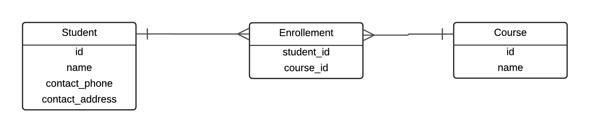

So, basically, the actual database design implementation uses two one-to-many relationships as depicted above. This is necessary in order
to allow the storage of information a many-to-many relationship.

We will see specific examples in the next chapters.

Other important feature of the actual database design is the *primary key (PK)*. The primary key needs to uniquely identify each row in a table.
For example, for the students table it can be a field named `id` that takes unique values. Same for the courses table.

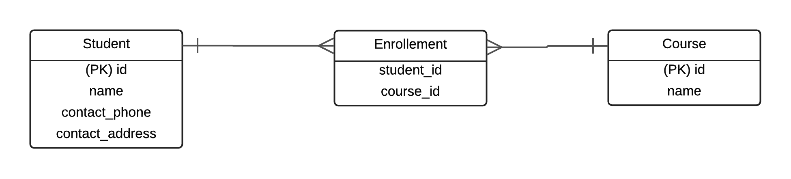

In other words, even if two students may have the same name and contact address and contact phone, they will never have the same id.
Hence, they will be different entries in our students table.

The fact that the two tables have a primary key makes it possible to refer from table with enrollments to specific students and courses.
We are referring to a student with a column named `student_id` and to the courses with the column `course_id`. Hence, any row in enrollments
table specifies a student and a course without any doubt, and hence, we know which students have enrolled in which courses.

The fact that enrollments table uses columns to uniquely identify entries in other tables (students and courses), makes these column
to be referred to as *foreign keys (FK)*.

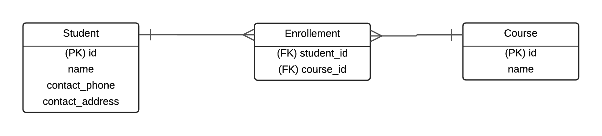

There are constructs and tools that we use to design a robust database model. Such as indexes and unique indexes. We will see all of that
in the next chapters.

## MySQL

In the next chapters we are going to do a lot of work with MySQL, one of the most popular relational database management systems. `mysql` is going to
be the client program that we are going to use to send requests to MySQL server.

> *Note:* You may hear MySQL being pronounced `mycql`. Same goes for SQL. You can hear it as `cql`. 

The example database that we will create, it will be a primitive electronic shop, with customers, orders and products.

