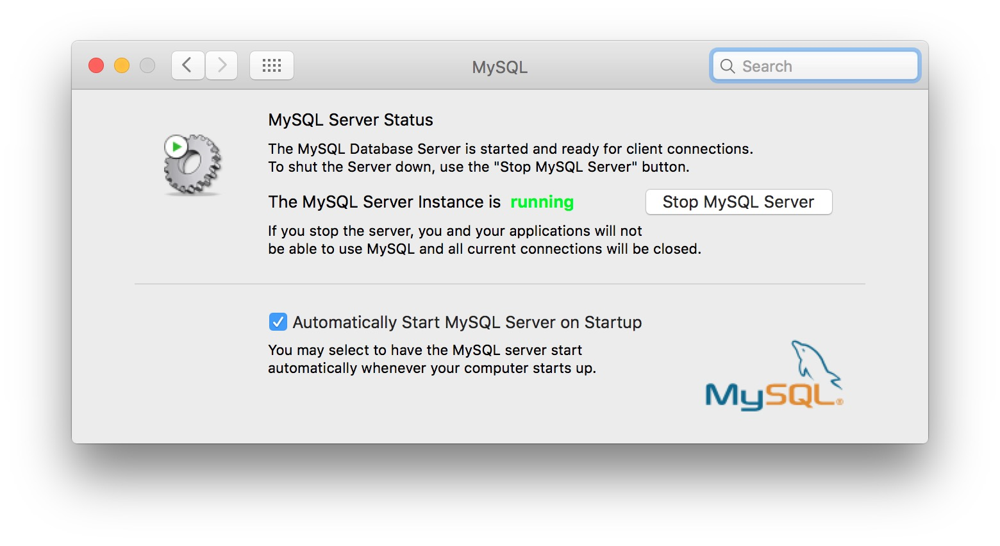
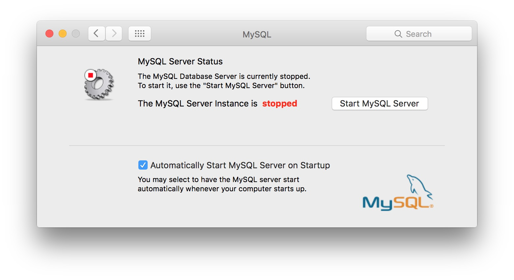
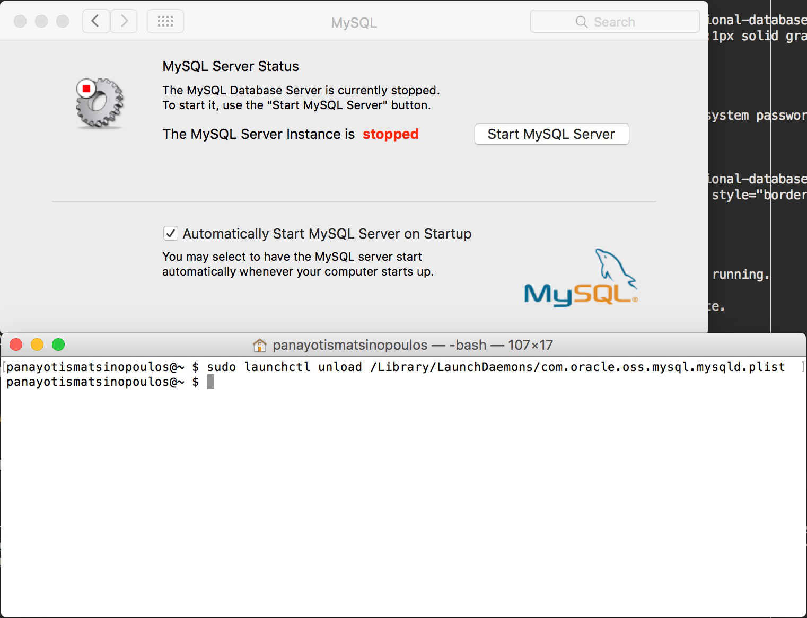
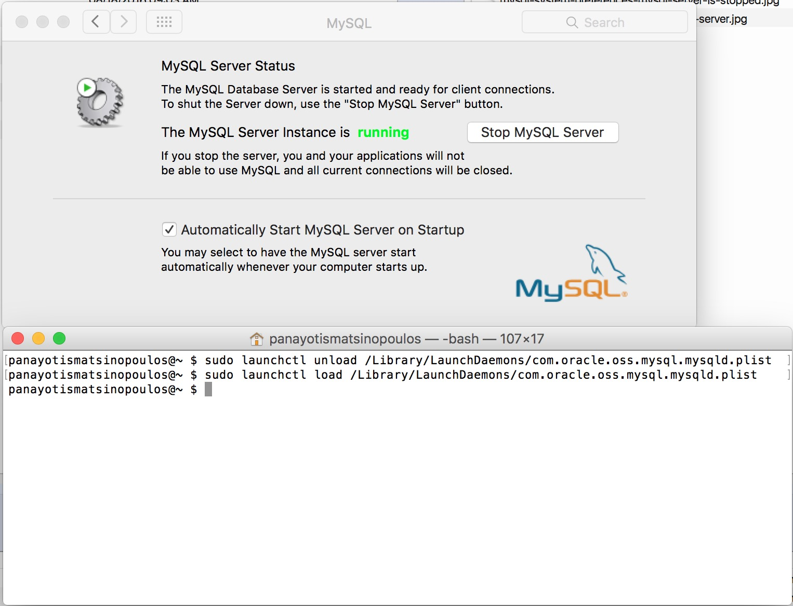

As we said in the previous chapter the RDBMS that we are going to use it's going to be MySQL.

## MySQL Installation

Installing MySQL on your machine might differ depending on the operating system. This course is for
Mac and Linux distributions.

This URL [here](https://dev.mysql.com/doc/refman/5.6/en/osx-installation-pkg.html) explains how to install MySQL on OS X. The download page is [here](https://dev.mysql.com/downloads/mysql/).

And this URL [here](https://wiki.debian.org/MySql) explains how to install MySQL Debian Linux distribution. The download page is [here](https://dev.mysql.com/downloads/mysql/).

Finally, this URL [here](https://www.digitalocean.com/community/tutorials/how-to-install-mysql-on-ubuntu-14-04) explains how to install MySQL on Ubuntu Linux distribution.
The download page is [here](https://dev.mysql.com/downloads/mysql/).

> *Note*: While installing MySQL on Mac, the installation process assigns a random password to `root` user. I personally logged in using `mysql` as `root` user with the command
`mysql -u root -p` giving that random password, and then issued the command `ALTER USER 'root'@'localhost' IDENTIFIED BY '';` to completely remove the `root` password. I find it
that it is not necessary to have a password for `root` user on my local development machine.

> *Note:* On Mac, after installation start the MySQL preferences and start MySQL server. Also make sure that you have the check to start MySQL server on machine start up. 
 
## Verifying MySQL Running as Server
  
Let's start a terminal.

<div id="media-title-video-start-terminal.mp4">How to Start a Terminal</div>
<a href="https://player.vimeo.com/video/194459941"></a>          
           
Using the terminal, we are going to check whether MySQL server is running or not. In order to do that, we type in the
following command.

``` bash
ps -ef | grep 'mysql'
```

When you run that, you will see an output similar to this:

``` bash
   74    96     1   0  9:08AM ??         0:00.44 /usr/local/mysql/bin/mysqld --user=_mysql --basedir=/usr/local/mysql --datadir=/usr/local/mysql/data --plugin-dir=/usr/local/mysql/lib/plugin --log-error=/usr/local/mysql/data/mysqld.local.err --pid-file=/usr/local/mysql/data/mysqld.local.pid
  501  1115   784   0  9:15AM ttys000    0:00.00 grep mysql
```
which means that the `ps -ef | grep 'mysql'` found 2 processes running (at the time the command was executed). The last one `grep mysql` refers to the command that we just typed
in. The other process running refers to MySQL and verifies that MySQL server is running properly on our machine.

> *Note:* The above output will differ on your machine. Depends on the operating system you are running in too.

In any case, what is important to note here is that the above output

1. Tells us which user is used to run MySQL server. On my case it is `_mysql`. See `--user=_mysql`.
2. Tells where the base directory is. On my case it is `/usr/local/mysql`. See `--basedir=/usr/local/mysql`.
3. Tells which directory holds the data, i.e. the different databases this server is managing. On my case it is `/usr/local/mysql/data`. See `--datadir=/usr/local/mysql/data`.
4. Tells which file hold possible errors logged. On my case it is `/usr/local/mysql/data/mysqld.local.err`. See `--log-error=/usr/local/mysql/data/mysqld.local.err`.
5. Tells which file holds the MySQL server process id. On my case it is `/usr/local/mysql/data/mysqld.local.pid`. See `--pid-file=/usr/local/mysql/data/mysqld.local.pid`. In fact,
if one issues the command `sudo cat /usr/local/mysql/data/mysqld.local.pid` will get the number corresponding to the process id of MySQL server process. It is `96` for my case.
Note that every time you stop and start the server again, a new server process is created with a new process id which is always recorded inside this file.

> *Note:* When we prefix the command with `sudo` we tell operating system that we want to run the command as system / administrator user. In that case we might
be asked to give the system/administrator password. Alternatively, you can issue the command `su root`. The `su` means `switch user` and allows you to become another
user. The `su root` command, then, allows you to become a `root` user. But, when you are root user you need to be very careful not to destroy any of your system files.

## Starting and Stopping MySQL server

On Mac, there are two ways you can start and stop MySQL Server.

(1) From MySQL System Preferences. Open System Preferences and then locate MySQL. You will see this:



Then you can click on `Stop MySQL Server` button to stop MySQL server from running. You will be asked for your system password. After you do that you will see this on preferences dialog.



Now, if you go to a terminal window and type in the command `ps -ef | grep 'mysql'` you will not see the server running.

Obviously, if you click on the button `Start MySQL Server`, then you will have MySQL server back on running state.

(2) Another way you can stop MySQL server is from the command line.

On Mac OSX El Capitan, this is done as follows:

``` bash
sudo launchctl unload /Library/LaunchDaemons/com.oracle.oss.mysql.mysqld.plist
```

This will stop the server. 



Similarly, the `load` version can be used to start MySQL server:

``` bash
sudo launchctl load /Library/LaunchDaemons/com.oracle.oss.mysql.mysqld.plist
```



> *Note:* Another command that you can use to stop MySQL server is the following:
``` bash
mysqladmin -u root shutdown
```

> *Hint:* You need to have the `bin` folder of your MySQL installation added in your `PATH` environment variable. Personally, I have my `.bash_profile` file
include the next three lines:
``` bash
alias mysql=/usr/local/mysql/bin/mysql
alias mysqladmin=/usr/local/mysql/bin/mysqladmin
export PATH=$PATH:/usr/local/mysql/bin
```
The last line sets the `/usr/local/mysql/bin` into the `PATH`.

> *Hint:* If you update the `.bash_profile` file, then you need to either call `source ~/.bash_profile` or restart your terminal.

## Communicating With MySQL Server

Now that we know that MySQL Server is running and we know how to stop and start it again, let's see that command line tool that
we will be using to connect to MySQL Server.

This is `mysql`.

On your terminal, type in the following command:

``` bash
mysql -u root -p
```

You will be asked to give the password of `root` user on your MySQL installation. On my installation there is no password. Hence on the
prompt `Enter password:` I just hit the key <kbd>Enter</kbd>. If your `root` server has a password, then you need to give it here. 

> *Hint:* If the `root` user does not have a password, you can start `mysql` with the command
``` bash
mysql -u root
```
and you will not be prompted for password.

What you will see is something like the following:

``` mysql
Welcome to the MySQL monitor.  Commands end with ; or \g.
Your MySQL connection id is 794
Server version: 5.7.14 MySQL Community Server (GPL)

Copyright (c) 2000, 2016, Oracle and/or its affiliates. All rights reserved.

Oracle is a registered trademark of Oracle Corporation and/or its
affiliates. Other names may be trademarks of their respective
owners.

Type 'help;' or '\h' for help. Type '\c' to clear the current input statement.

mysql> 
```

The `mysql>` is the `mysql` command line interface prompt. In other words, you have left the operating system terminal prompt
and you have started a new session with the MySQL server installed locally on your machine, which gives you a `mysql` specific
prompt to type in SQL commands.

`mysql` prompt allows you to enter SQL commands. This means that if you try to issue, for example, an operating system command,
it will fail.

``` bash
mysql> ls -l;
ERROR 1064 (42000): You have an error in your SQL syntax; check the manual that corresponds to your MySQL server version for the right syntax to use near 'ls -l' at line 1
```

If you want to exit `mysql` session and return back to your terminal prompt, you type in the `exit` command.

## MySQL Settings

When MySQL server starts has some default settings. However, we can override the default settings by specifying values inside a file named `my.cnf`.
On Mac, You can place that file in the following places:
  
``` bash
/etc/my.cnf 
/etc/mysql/my.cnf 
/usr/local/mysql/etc/my.cnf 
/usr/local/opt/etc
~/.my.cnf 
```  

Also, you can find a sample file here: `/usr/local/mysql/support-files/my-default.cnf`

Alternatively, you can edit the file `/Library/LaunchDaemons/com.oracle.oss.mysql.mysqld.plist` and set the start up options to your preferences.

One of the most important options is the `sql_mode`. You should turn strict mode on. This is done by setting `sql_mode` to include `STRICT_TRANS_TABLES`.
 
On my current installation, `STRICT_TRANS_TABLE` is on. I can verify that by executing the following query:
 
``` sql
mysql> show variables where variable_name = 'sql_mode';
+---------------+-------------------------------------------------------------------------------------------------------------------------------------------+
| Variable_name | Value                                                                                                                                     |
+---------------+-------------------------------------------------------------------------------------------------------------------------------------------+
| sql_mode      | ONLY_FULL_GROUP_BY,STRICT_TRANS_TABLES,NO_ZERO_IN_DATE,NO_ZERO_DATE,ERROR_FOR_DIVISION_BY_ZERO,NO_AUTO_CREATE_USER,NO_ENGINE_SUBSTITUTION |
+---------------+-------------------------------------------------------------------------------------------------------------------------------------------+
1 row in set (0.01 sec)
```
As you can see, `sql_mode` includes the value `STRICT_TRANS_TABLES`, which means that strict mode is on.

If this is not the case with your MySQL installation, make sure that you edit the `my.cnf` file and add something like this (in the `[msqld]` section):
```
sql_mode = 'ONLY_FULL_GROUP_BY,STRICT_TRANS_TABLES,NO_ZERO_IN_DATE,NO_ZERO_DATE,ERROR_FOR_DIVISION_BY_ZERO,NO_AUTO_CREATE_USER,NO_ENGINE_SUBSTITUTION'
```

Ask your mentor for advice if you cannot make it.

## Closing Notes

We have learned how to install, start and stop MySQL server. We have also learned how to start a new session with MySQL server
using `mysql` command line interface. In the next chapters we will be working very hard with `mysql`.

> *Information:* If you had problems installing, starting and stopping MySQL server on your machine, you may want to arrange
a pairing session with your mentor. He will help you setup your machine and MySQL.

> *Extra Video:* We have created a video that goes through the concepts of this chapter using a Debian (Linux) operating system. You may want to watch that too.

<div id="media-title-video-mysql-starting-stopping-connecting-to.mp4">MySQL Server on a Debian (Linux) machine</div>
<a href="https://player.vimeo.com/video/194457954"></a>          
