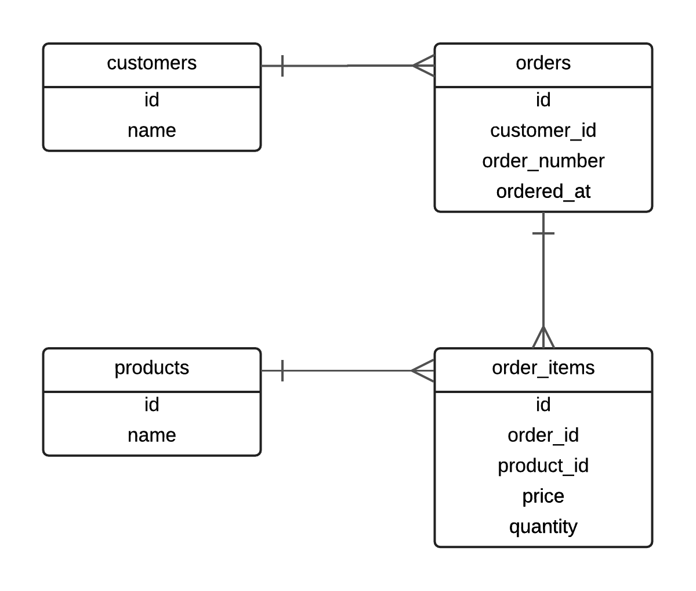
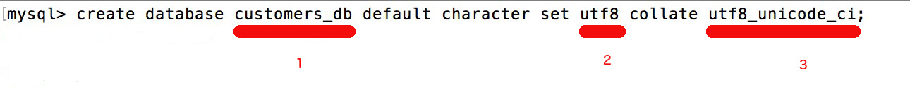
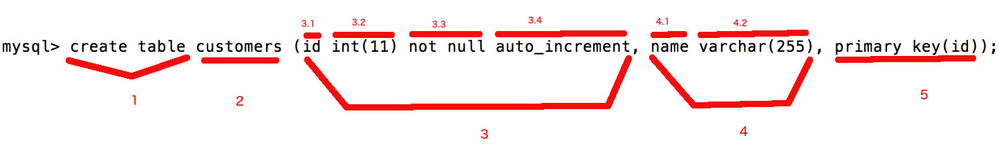

We now start to design the database for a primitive Customer Relationship Management System. Here is the picture of the
tables this database is going to have, alongside the relationships among them.



Let's recap what we see on the above Entity Relationship Diagram (ERD). Also, let's give some rules about the columns and their values
even if these are not obvious from the diagram:

1. We see 4 tables:
    1. customers
    2. orders
    3. products
    4. order_items
1. customers
    1. It has an `id`. This is also going to be the primary key of the table. I.e. all customers will have distinct, unique ids.
    1. It has a `name`. This is not unique. Two customers may have the same name. It is mandatory, i.e. we cannot have a customer
    without a `name`.
1. orders
    1. It has an `id`. This is going to be the primary key of the table. I.e. all orders will have distinct, unique ids.
    1. It has a column `customer_id`. This is going to be a reference to a corresponding row in `customers` table. It will
    indicate which customer this order belongs to. We call this a foreign key, because it corresponds to the primary key (`id`)
    of another table (`customers`). `customer_id` is mandatory, i.e. we cannot have an order without a reference to a customer.
    1. It has a column `order_number`. This is a string type column and it is mandatory. This should be unique, i.e. no
    two or more orders can have the same `order_number`.
    1. It has a column `ordered_at`. This is a timestamp and it is mandatory. It records when an order has been issued by the
    customer. If not given at order creation, it will take automatically the current date timestamp.
    1. There is a relationship between `customers` and `orders`. Having *one* customer, I can find *many* orders referencing that
    customer. So, the relationship is *one-to-many*. Also, having *one* order, I can find *one* customer the order belongs to.
1. products
    1. It has an `id`. This is going to be the primary key of the table. I.e. all products will have distinct, unique ids.
    1. It has a `name`. This is a string type column and it is mandatory. I.e. a product cannot exist without a `name`. Also,
    this is going to be unique. No two or more products can have the same `name`.
1. order_items
    1. It has an `id`. This is the primary key of the table. I.e. all order_items will have distinct, unique ids.
    1. It has a reference to the order the order item belongs to. This is the column `order_id`. This is a foreign key
    because it references the primary key (`id`) of another table (`orders`). The `order_id` is mandatory, i.e. we cannot
    have an order item without an order.
    1. There is a relationship between `orders` and `order_items`. Having *one* order at hand, I can find *many* order items
    referencing that order. So, the relationship of `orders` to `order_items` is *one-to-many*.
    1. It has a reference to the product the order item refers to. The reference is the column `product_id` and it is a
    foreign key because it references the primary key (`id`) of another table (`products`). This is mandatory, because
    we cannot have an order item without reference to a product.
    1. There is a relationship between `products` and `order_items`. Having *one* product at hand, I can find *many* order items
    referencing that product. So, the relationship of `products` to `order_items` is *one-to-many*.
    1. There is a business rule which says that we cannot have the same product twice in the same order. We are using the
    `quantity` field to allow for many instances of the same product to exist in the same order. The `quantity` is an integer
    type column. It is mandatory, with default value 1.
    1. Table `order_items` is there to help model the properties of the *many-to-many* relationship between `orders` and `products`. As
    we have said in the previous chapter, a *many-to-many* relationship is modeled using a table in the middle. In our case, this 
    table is `order_items`, and we end up having two *one-to-many* relationships (one order many order items, one product many order items).
    
As you can understand from the above list, there a lot of details surrounding the data model of this simple CRM. And we have not enlisted them all.
We will now proceed in the actual implementation of this database using MySQL Server.

## Create the database

We will start by creating the CRM database. 

Open a terminal window, and start `mysql` client, the command line interface to access MySQL server and issue commands.

``` bash
mysql -u root
```

> *Note:* If your `root` user has a password, you need to start `mysql` with the command
``` bash
mysql -u root -p
```
and give the password when prompt.

After connecting, you will see something like this:

``` bash
Welcome to the MySQL monitor.  Commands end with ; or \g.
Your MySQL connection id is 2
Server version: 5.7.14 MySQL Community Server (GPL)

Copyright (c) 2000, 2016, Oracle and/or its affiliates. All rights reserved.

Oracle is a registered trademark of Oracle Corporation and/or its
affiliates. Other names may be trademarks of their respective
owners.

Type 'help;' or '\h' for help. Type '\c' to clear the current input statement.

mysql> 
```

And you will be ready to issue MySQL commands.

As we have learnt in the previous chapter, MySQL can manage many databases. For that reason, there is always a way for us to see
how many and which databases our MySQL server is currently managing. 

Type the following command to find out the currently managed databases:

``` sql
mysql> show databases;
```
> *Note:* Commands on `mysql` prompt need to be terminated with `;` before hitting the <kbd>Enter</kbd> to send it out. 

You will get an output like this:

``` sql
+--------------------+
| Database           |
+--------------------+
| information_schema |
| mysql              |
| performance_schema |
| sys                |
+--------------------+
4 rows in set (0.01 sec)
```

The MySQL installation on my Mac has the above 4 databases installed by default. These are databases used by MySQL server itself.
Usually, client applications don't access these databases. We can definitely use them, but we need to be very careful with these
databases and the SQL commands that we issue against them, because if we do a mistake we might prevent MySQL server from 
working properly.

> *Note:* On your MySQL installation, the `performance_schema` and `sys` databases might be missing.

So, we are not going to work with these databases. We are going to design our own database. Let's call this database `customers_db`.
The command to create our own database with name `customers_db` is given below. Give that command on `mysql` prompt.

``` sql
mysql> create database customers_db default character set utf8 collate utf8_unicode_ci;
```

Let's analyze this command:



1. This is the name of the database. On our example, it is `customers_db`.
2. This is the default character set. On our example, it is `utf8`. This means that we will be able to store both latin and non-latin characters, such as Greek,
of French accented characters. This is very important because you might have customers whose language does not come from latin and they might
want to type their names in their own language.
3. This is the collation. On our example, it is `utf8_unicode_ci` where `ci` stands for case insensitive. This is very important too, because, usually, you want to make sure that
two strings that they only differ in their case, they are considered equal. Example: "John Smith" and "JOHN SMITH" should be considered the same.

So, type in the above command and hit <kbd>Enter</kbd> key on your keyboard. Don't forget to terminate the command with `;`.
This will send the command to MySQL server. MySQL server is going to execute this command and return back to us a response with the result of the execution.
This is going to be something like this:

``` sql
mysql> create database customers_db default character set utf8 collate utf8_unicode_ci;
Query OK, 1 row affected (0.01 sec)

mysql> 
```

The `Query OK, 1 row affected (0.01 sec)` means that everything went well and the database has been created. How can we verify that? With the command that
we learnt earlier, i.e. 

``` sql
mysql> show databases;
```

You will get something like this:

``` sql
+--------------------+
| Database           |
+--------------------+
| information_schema |
| customers_db       |
| mysql              |
| performance_schema |
| sys                |
+--------------------+
5 rows in set (0.00 sec)

mysql> 
```

Do you see the database `customers_db`? This is the new database that we have just created.

We will continue now working on this particular database.

## Select Database To Work With

In order to select the database you want to work with, you need to issue the command `use` as follows:

``` sql
mysql> use customers_db;
```

When you do that, you will see the response being `Database changed`. This makes you ready to start working with the `customers_db` database. Or, in other
words, the next commands that you will type, data definition or data manipulation commands, will be executed in the context of the `customers_db` database. 

## Creating Tables

As we have learnt in the introduction to RDBMSs, a database can have many tables. How can we get the list of tables of the current database? This is done
with the issue of the command `show tables;`. If you issue this command you will see this:

``` sql
mysql> show tables;
Empty set (0.00 sec)

mysql> 
```

Server tells you that `customers_db` does not have any table: `Empty set`. This is because `customers_db` is a database that we have just created and we have not
created any table yet.

> *Side Note:* When you hit <kbd>Ctrl+L</kbd> while on `mysql` prompt, it will clear the terminal and `mysql` prompt will appear at the top. This is quite
handy to clear the terminal window and proceed with new commands.

So, it is about time to design, to create our first database table. Below, we are giving you the command that would create the table `customers` inside the
`customers_db` database. But, before you issue the command, it's better to study the notes that follow:



(1) `create table` is how we start the command to create a table.

(2) Then we give the name of the table.

(3) Then inside parentheses, we give the definition of the first column of the table.

(4) The second column definition. It is separated from the first using a comma.

(5) We optionally specify other details about the table columns, such as which column is the primary key.

On the above example, we will create the table with name `customers`. This is going to have 2 columns. The column `id` and the
column `name`. 

The column `id` is specified as follows:

`id int(11) not null auto_increment`

So,

(3.1) is the name of the column.

(3.2) is the type of the column. Here we use the type `int(11)`. This means that the column is going to hold integer numbers, with display width 11. The display
width is not affecting the range of the integer numbers that this column can hold. The range of the numbers is minimum `-2,147,483,648` and maximum `2,147,483,647`.
You can read about all the MySQL data types [here](http://dev.mysql.com/doc/refman/5.7/en/data-types.html). 

(3.3) optionally, we can tell whether the column can take `null` values of not. `null` in SQL represents the `absence of value`. Can we have a customer without an
`id` value? No. In order to ask MySQL server to protect us from creating any customer without `id` value, we specify that the column needs to be `not null`.
If we wouldn't use this specification, the column would have been `nullable`.

(3.4) with `auto_increment` we ask MySQL to use a unique number for `id`s every time we create a new customer. This number is created automatically by MySQL
and assigned to each new row. It goes from `1` and it is incremented every time we insert a new customer. We don't have to worry about us assigning this number.

The column `name` is specified as follows:

`name varchar(255)`

So, 

(4.1) is the name of the column.

(4.2) is the type of the column. With `varchar` we specify that this column is going to hold any variable-length character sequence, i.e. a string. However, the
maximum length of the strings that can be stored there is 255.
 
Note that for `name` column we have not specified the property `not null`, which means that we will be able to create customer entries without `name` value. This
may sound like something we don't want. But this is how it is now. This create command given above, will create a table `customers` with column `name` being
nullable. We will change that later on.

Finally, after the `name` column specification, we use a `,` in order to start an extra specification that tells MySQL which is going to be the
primary key of the table. 

`primary key(id)`

This is pretty much straightforward. It tells MySQL that the primary key of the table `customers` is going to be column `id`.

Nice! After having studied all that notes above, let's issue the command on the `mysql` prompt:

``` sql
mysql> create table customers (id int(11) not null auto_increment, name varchar(255), primary key(id));
Query OK, 0 rows affected (0.02 sec)

mysql> 
```

You will get the `Query OK` response and your table would have been created.

How can you check that the table is there? It is the `show tables;` command, as we've learnt earlier:

``` sql
mysql> show tables;
+------------------------+
| Tables_in_customers_db |
+------------------------+
| customers              |
+------------------------+
1 row in set (0.00 sec)

mysql> 
```

As you can see from the result the table has been created inside the database. 

Can we check what is the structure of a table? Yes, we can do that with the `show create table` command. Issue the following:

``` sql
mysql> show create table customers;
+-----------+------------------------------------------------------------------------------------------------------------------------------------------------------------------------------------------------------------------+
| Table     | Create Table                                                                                                                                                                                                     |
+-----------+------------------------------------------------------------------------------------------------------------------------------------------------------------------------------------------------------------------+
| customers | CREATE TABLE `customers` (
  `id` int(11) NOT NULL AUTO_INCREMENT,
  `name` varchar(255) COLLATE utf8_unicode_ci DEFAULT NULL,
  PRIMARY KEY (`id`)
) ENGINE=InnoDB DEFAULT CHARSET=utf8 COLLATE=utf8_unicode_ci |
+-----------+------------------------------------------------------------------------------------------------------------------------------------------------------------------------------------------------------------------+
1 row in set (0.00 sec)

mysql> 
```

Perfect! MySQL server responds back and `mysql` server displays the structure of the table `customers`. It actually displays that using the
`CREATE TABLE` command. There are some extra bits of information, if compared to the original `create table` command that we used, but you do not
have to worry about that for now.

## Inserting Data Into a Table

Now that we have our table, we can insert data into it. The command to insert data into a table is the `insert into <table_name>` command. Let's do that
with the `customers` table. Issue the following command:

``` sql
mysql> insert into customers (name) values ('John Woo');
Query OK, 1 row affected (0.01 sec)

mysql> 
```


The `insert into customers` is used to insert rows inside the `customers` table. In order to succeed, we need to give the list of columns
we will provide values for (1) and the actual values (2). The list of columns is given inside a comma separated list enclosed in parentheses (1).
The list of values is given in another list (2), enclosed in parentheses too. The list of values needs to follow the `values` keyword (3).

## Selecting Rows from Table

How do we really see that the customer `John Woo` has been stored inside the table `customers`? In order to do that we use the `select` command. 
Try to give the following command:
 
``` sql
mysql> select * from customers;
```
 
This command will retrieve all the rows stored inside `customers` table and display them in a tabular format. You will see this:
 
``` sql
+----+----------+
| id | name     |
+----+----------+
|  1 | John Woo |
+----+----------+
1 row in set (0.00 sec)
```
 
It gives you the values of all the columns for each row in the `customers` table. Currently, we only have 1 customer stored. Its `id` is `1` and
has been assigned automatically by MySQL server (thanks to the `auto_increment` property of the `id` column). Its `name` is `'John Woo'` and has
been assigned when we issued the `insert into` statement earlier.

The output also reports how long it took server to process the query and send the result back to `mysql` client.

Nice! This proves that our insert statement worked as expected.

Let's create another customer. Issue the following command on `mysql` prompt:

``` sql
mysql> insert into customers (name) values ('John Papas');
```

This will create the customer with name `'John Papas'`. If we now issue the same `select` command we issued earlier we will get this:

``` sql
mysql> select * from customers;
+----+------------+
| id | name       |
+----+------------+
|  1 | John Woo   |
|  2 | John Papas |
+----+------------+
2 rows in set (0.00 sec)
```

As you can see, we now have 2 rows inside the `customers` table. The new customer, `'John Papas'`, has been created with an id of `2`, which is the
next increment of the previously inserted customer. 

What about the `*` symbol used in the `select` statement? Between `select` and `from` we need to tell MySQL which columns of the table we want
the result set to return back to us. With `*` we say that we want all the columns to be returned, a.k.a. `id` and `name` on our example.

If we want to include only the `name` in the result set, we need to explicitly specify that in our select command. Let's try that:

``` sql
mysql> select name from customers;
+------------+
| name       |
+------------+
| John Woo   |
| John Papas |
+------------+
2 rows in set (0.01 sec)
```

You now see that the result set includes only the values for the `name` column. This feature might be quite useful because the table might have 
many columns and displaying all of them might not be easily readable, especially if we are only interested in a sub-set of the whole column set.

Let's ask only for the id:

``` sql
mysql> select id from customers;
+----+
| id |
+----+
|  1 |
|  2 |
+----+
2 rows in set (0.00 sec)
```

As you can see, the result set now contains the values only for the `id` column.

If we want more than one column, explicitly defined, then we have to give their names in a comma separated list. For example, let's ask for the
`id` and `name` columns explicitly:

``` sql
mysql> select id, name from customers;
+----+------------+
| id | name       |
+----+------------+
|  1 | John Woo   |
|  2 | John Papas |
+----+------------+
2 rows in set (0.00 sec)
```

## Limiting the Rows Returned Using Criteria - where Clause

The previous select statements returned all the customers stored in our `customers` table. But this is not usually the case. Usually, the `customers`
table contains many rows and we are never interested in enlisting all of them. We usually want to retrieve a sub-set of the customers, those that 
satisfy specific criteria.

Let's suppose that we want to retrieve the customer that has the name `'John Papas'`. In order to do that, we have to use the `where` clause. The `where` clause
is given at the select statement after the name of the table which we retrieve data from. Try the following command:

``` sql
mysql> select * from customers where name = 'John Papas';
```

You will get this:

``` sql
+----+------------+
| id | name       |
+----+------------+
|  2 | John Papas |
+----+------------+
1 row in set (0.01 sec)
```

As you can see, the rows returned match the criteria that I have given: `name = 'John Papas'`. The criteria have been given after the `where` reserved word.

The criteria are usually composed of a column reference (`name` on our example), a comparison operator (`=` on our example) and a value (`'John Papas'` on our example).
The column reference, the operator and the value compose a condition. On this particular example we have used only 1 condition. But this is not always the case.
We might want to build more complex conditions, more complex criteria. This can be done by combining conditions with the use of boolean operators like `AND` and `OR`.
Also, parentheses can be used to group conditions together in order to change the priority of evaluation. Note that `AND` is evaluated before `OR`.

On the previous example we have used the operator `=`. But we can use also operators like `>`, `>=` (greater than or equal), 
`<`, `<=` (less than or equal), `<>` (different from). Another useful operator is `like` and we are going to talk about that later on.
We also have the unary operator `IS NULL`, which checks whether the column does not have value. And the negative form of it which is `IS NOT NULL`. 

So, if we want to get the customer with `id` equal `2`, we can do that as follows:

``` sql
mysql> select * from customers where id = 2;
+----+------------+
| id | name       |
+----+------------+
|  2 | John Papas |
+----+------------+
1 row in set (0.01 sec)

mysql> 
```

Whereas the following statement:

``` sql
mysql> select * from customers where id = 2 and name = 'John Woo';
```

is trying to retrieve all the customers that have `id` equal to `2` and `name` equal to `'John Papas'`. If you run that you will see that it will not return any row.
There is no customer row satisfying those criteria.

> *Hint:* While on `mysql` prompt, you can always hit the <kbd>Up Arrow</kbd> button and go through your previous commands. This is handy because it will allow you
to quickly issue a new command by only changing, a little bit, one of previous commands.

Now, let's change the previous command as follows: we will change the `and` operator to `or`.

``` sql
mysql> select * from customers where id = 2 or name = 'John Woo';
+----+------------+
| id | name       |
+----+------------+
|  1 | John Woo   |
|  2 | John Papas |
+----+------------+
2 rows in set (0.01 sec)
```

You can see that it returns now two matching rows. The first one matching to criterion `name = 'John Woo'` and the second one to
criterion `id = 2`. This is correct, because the `where` clause that we specified, instructs MySQL server to find all rows that
have `id` equal to `2` and all rows that have `name` equal to `'John Papas'`.

## Counting number of Entries

Some times we do not want to know the exact entries that a table contains, but only the number of the entries. In order to do that,
we use the `select count(*) from <table_name> where <where_clause>` statement.

For example:

``` sql
mysql> select count(*) from customers;
+----------+
| count(*) |
+----------+
|        2 |
+----------+
1 row in set (0.01 sec)
```

returns `2` telling us how many customers exist inside the `customers` table.

You can always use a `where` clause together with `count(*)`. In that case, the result will be the count of the rows that match
the `where` clause criteria.

For example:

``` sql
mysql> select count(*) from customers where name = 'John Papas';
+----------+
| count(*) |
+----------+
|        1 |
+----------+
1 row in set (0.00 sec)
```

would return `1`, because only 1 row / customer matches the criterion given, i.e. `name` being equal to `'John Papas'`.

`select count(*)` is very useful, especially when the result set is big. It does not bring data back to the client except from the counter.
So, it is one of the best ways to calculate the number of rows inside tables with many entries.

## Deleting Rows from Tables

We are now going to learn about the `delete` command. What if we wanted to delete the customer with name `'John Papas'`?

The command to delete this customer is:

``` sql
mysql> delete from customers where name = 'John Papas';
Query OK, 1 row affected (0.01 sec)

mysql> 
```

If you execute the above command you will see a `Query OK` and `1 row affected`. This confirms that the customer has been deleted. But we can still
try to find the customer and double check that this customer does not exist:

``` sql
mysql> select * from customers where name = 'John Papas';
Empty set (0.00 sec)
```

Or, you can list all of your customers (but only if they are few, otherwise it is useless) and visually inspect that the customer does not exist:

``` sql
mysql> select * from customers;
+----+----------+
| id | name     |
+----+----------+
|  1 | John Woo |
+----+----------+
1 row in set (0.00 sec)
```

Our `customers` table now has only 1 customer. The customer with `id` 2 has been deleted, because it had the name equal to `'John Papas'` which was the
name we used to delete: `delete from customers where name = 'John Papas';`.

The `delete` command is always followed by the pattern `from <table_name>`. This is because we need to tell MySQL which table we want to delete rows from.
Then, we can optionally specify a `where` clause, like we did in previous `select` statements. All the rows that match the `where` clause will be deleted.

> **IMPORTANT:** Do not use `delete` without a `where` clause that specifies exactly which rows you want to delete, **unless you know what you are doing**. 
If you do not use a `where` clause, the `delete` command will delete all entries in your table, without any warning.
 
> *Hint:* I usually write a `select count(*) from <table_name> where <clause that will be used to delete>` statement to count the number of rows that would
match the `where` clause to be used on next `delete` command. Hence, I know how many rows will be deleted before I actually delete them. Is that number the
expected one? If not, I revise my `where` clause. When I am happy with the `where` clause on the `select` statement, then I copy the `where` clause from 
the `select` statement to the `delete` statement. That makes sure that I am going to `delete` the rows that I want.

Let's suppose now that we insert a new customer into our database `customers` table. Give the following command:

``` sql
mysql> insert into customers (name) values ('Maria Foo');
Query OK, 1 row affected (0.00 sec)
```

You will get `Query OK`. Now, let's list all the customers again:

``` sql
mysql> select * from customers;
+----+-----------+
| id | name      |
+----+-----------+
|  1 | John Woo  |
|  3 | Maria Foo |
+----+-----------+
2 rows in set (0.00 sec)
```
 
We now see that we have a new customer. The new customer has the id `3`. This is because this is the first available / free id that can be used. The id `2` has been
used earlier for customer `John Papas` and MySQL never reuses ids. 
 
## Updating Rows on a Table

Let's say, now, that we want to change the value of an attribute for a specific customer. In order to do that we use the command `update`. If we want, for example,
to change the name of `Maria Foo` to `Maria Xoo`, then we give the following command:

``` sql
mysql> update customers set name = 'Maria Xoo' where id = 3;
Query OK, 1 row affected (0.01 sec)
Rows matched: 1  Changed: 1  Warnings: 0
```

MySQL reports back with a `Query OK` and, also, with the number of rows that matched the `where` clause criteria, and the number of rows that have actually been changed.

The structure of the `update` command is more or less as follows:


(1) After the `update` reserved word, we specify the name of the table that we want to update. Then we give the reserved word `set`.

(2) After the `set` word, we enlist in a comma separated list the columns and their new values: `<column> = <new_value>, <column> = <new_value> ...`

(3) Finally, we optionally specify a `where` clause to make sure that we update specific rows, unless we want to udpate all the rows in the table.

> **Important:** `update` command is equally dangerous like `delete` is. So, if you do not specify a `where` clause it will update all the rows in the table.
Make sure that you use it with the same caution like the `delete` command. 

Let's see the results of our update:

``` sql
mysql> select * from customers;
+----+-----------+
| id | name      |
+----+-----------+
|  1 | John Woo  |
|  3 | Maria Xoo |
+----+-----------+
2 rows in set (0.00 sec)
```

You can see that the customer with id 3 has a new name: `'Maria Xoo'`.

## `like` operator

We will close this first SQL encounter, learning about the `like` operator, which is very useful in `where` clauses. Let's take an example.

Assume that we know that the name of our customer ends with `Woo`, but we do not really remember the exact name. How can we search for customers
whose name ends with `Woo`. We will use the following statement:

``` sql
mysql> select * from customers where name like '%Woo';
+----+----------+
| id | name     |
+----+----------+
|  1 | John Woo |
+----+----------+
1 row in set (0.03 sec)
```
It will return 1 customer, the one whose name ends with `Woo`. The string format `'%Woo'` given to `like` tells MySQL server to match the column value
if it ends with `Woo`. The `%` means anything. Hence, the `%Woo` means anything to the left of `Woo`. 

Now, let's take another example. Assume that we know that the customer we are looking for has a name that starts with `Maria`. In that case, we want the
string to start with `Maria` and we don't care what follows. We are going to indicate that by positioning the `%` to the right of `Maria`. Like that:

``` sql
mysql> select * from customers where name like 'Maria%';
+----+-----------+
| id | name      |
+----+-----------+
|  3 | Maria Xoo |
+----+-----------+
1 row in set (0.00 sec)
```

Perfect! MySQL returned the single customer in our `customers` table that has name that starts with `Maria`. 

Finally, note that the anything symbol, i.e. the `%` can be positioned in any position inside your search key as long as it makes sense for your search.
For example, `'%opo%'` means any string that contains the sequence `opo` no matter what exists before or after it. Hence, it would equally match both `'Popolos'`
and `'opolos'` and `'fopo'` and any other string that contains the sequence `opo`. 

## Closing Note

We have learnt how to create a database and our first table, `customers`. We have also learnt the basic SQL commands like:

* insert
* select
* update
* delete

If you want to watch this chapter in a video lecture you can watch this video here. The lecture has been compiled behind a Linux / Debian operating system.
But all the concepts and hands on exercises presented there can be equally applied to any MySQL server.

<div id="media-title-video-basic-sql-commands.mp4">SQL Basic Commands - Video Lecture</div>
<a href="https://player.vimeo.com/video/194393410"></a>          
