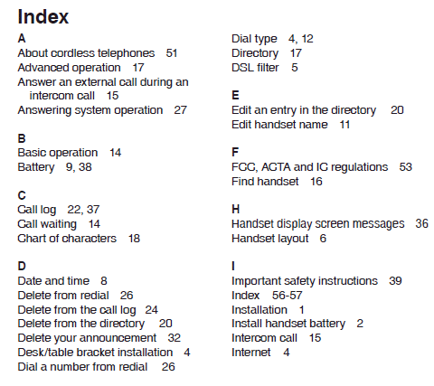

In the previous chapter we created the database `customers_db` and the table `customers`. Also, we have
learnt basic SQL commands, like, `insert`, `update`, `delete` and `select`.

Let's start our `mysql` client if it is not yet started.

``` bash
mysql -u root
```

You should see something like this, which makes sure that you are ready to type in MySQL commands.

``` sql
Welcome to the MySQL monitor.  Commands end with ; or \g.
Your MySQL connection id is 4
Server version: 5.7.14 MySQL Community Server (GPL)

Copyright (c) 2000, 2016, Oracle and/or its affiliates. All rights reserved.

Oracle is a registered trademark of Oracle Corporation and/or its
affiliates. Other names may be trademarks of their respective
owners.

Type 'help;' or '\h' for help. Type '\c' to clear the current input statement.

mysql> 
```

Let's switch to the `customers_db` with:

``` sql
mysql> use customers_db;
```

Next, let's list the tables this database has:

``` sql
mysql> show tables;
```

The result is:

``` sql
+------------------------+
| Tables_in_customers_db |
+------------------------+
| customers              |
+------------------------+
1 row in set (0.01 sec)
```

which contains the single table that we have in our db, the table `customers`.

Let's also see the structure of this table:

``` sql
mysql> show create table customers;
+-----------+-----------------------------------------------------------------------------------------------------------------------------------------------------------------------------------------------------------------------------------+
| Table     | Create Table                                                                                                                                                                                                                      |
+-----------+-----------------------------------------------------------------------------------------------------------------------------------------------------------------------------------------------------------------------------------+
| customers | CREATE TABLE `customers` (
  `id` int(11) NOT NULL AUTO_INCREMENT,
  `name` varchar(255) COLLATE utf8_unicode_ci DEFAULT NULL,
  PRIMARY KEY (`id`)
) ENGINE=InnoDB AUTO_INCREMENT=4 DEFAULT CHARSET=utf8 COLLATE=utf8_unicode_ci |
+-----------+-----------------------------------------------------------------------------------------------------------------------------------------------------------------------------------------------------------------------------------+
1 row in set (0.01 sec)
```

## Adding a New Column

Let's suppose now that we want to introduce the column with name `identity`. We assume that each customer has a unique 
identity number and we want to introduce this concept on our data model.
 
How are we going to add the column? Here it is how. We will execute the following `alter table` command:
 
``` sql
mysql> alter table customers add column (identity varchar(32) not null);
```

Before you actually execute that command, let's see the elements that are used to compose such a command.


(1) We add a new column to an existing table, by using the command `alter table`. Generally, `alter table` can be used to apply
various table alteration. One of these is the addition of a collumn. We will see some other cases later on.

(2) Then we give the name of the table that we want to alter.

(3) Then we add the `add column` reserved words since we want to add a new column.

(4) In order to add the new column we need to specify the properties of the new column. The specification is given inside 
parentheses `( ... )`. What we put inside is similar to what we put when we create a table and we specify its columns.

  - (4.1) First we give the name of the new column. It is `identity` on our case.
    
  - (4.2) Then we give the type of the column. We give the type `varchar` and we specify the number 32. This means that the column
    is going to hold strings with 32 characters maximum.
    
  - (4.3) With `not null` we specify that the column should always have a value. So, customers without an `identity` will not be
    accepted.
    
We are ready now to execute this command:

``` sql
mysql> alter table customers add column (identity varchar(32) not null);                                                                                                               
Query OK, 0 rows affected (0.13 sec)
Records: 0  Duplicates: 0  Warnings: 0

mysql> 
```

We got back `Query OK`. Was the column added? Let's check the structure of the table with `show create table` command:

``` sql
mysql> show create table customers;
+-----------+----------------------------------------------------------------------------------------------------------------------------------------------------------------------------------------------------------------------------------------------------------------------------------------------+
| Table     | Create Table                                                                                                                                                                                                                                                                                 |
+-----------+----------------------------------------------------------------------------------------------------------------------------------------------------------------------------------------------------------------------------------------------------------------------------------------------+
| customers | CREATE TABLE `customers` (
  `id` int(11) NOT NULL AUTO_INCREMENT,
  `name` varchar(255) COLLATE utf8_unicode_ci DEFAULT NULL,
  `identity` varchar(32) COLLATE utf8_unicode_ci NOT NULL,
  PRIMARY KEY (`id`)
) ENGINE=InnoDB AUTO_INCREMENT=4 DEFAULT CHARSET=utf8 COLLATE=utf8_unicode_ci |
+-----------+----------------------------------------------------------------------------------------------------------------------------------------------------------------------------------------------------------------------------------------------------------------------------------------------+
1 row in set (0.00 sec)

mysql> 
```
As you can see, the identity column has been added.

Let's see this column on our data too.

``` sql
mysql> select * from customers;
+----+-----------+----------+
| id | name      | identity |
+----+-----------+----------+
|  1 | John Woo  |          |
|  3 | Maria Xoo |          |
+----+-----------+----------+
2 rows in set (0.00 sec)
```

Because of the fact that the customers table already had some rows, before the addition of the new column, MySQL decided to assign a default value to existing
rows. Hence, our 2 customers have the same `identity` value `''`. 

Let's update the `identity` of our existing customers;

``` sql
mysql> update customers set identity = 'JW0001' where id = 1;
Query OK, 1 row affected (0.01 sec)
Rows matched: 1  Changed: 1  Warnings: 0

mysql> update customers set identity = 'ML0001' where id = 3;
Query OK, 1 row affected (0.00 sec)
Rows matched: 1  Changed: 1  Warnings: 0

mysql> 
```

We used 2 update commands. First to update the `identity` of the customer with `id` equal to `1`. Second, to update the `identity`
of the customer with `id` equal to `3`. Let's fetch the customers again in order to verify the updates:

``` sql
mysql> select * from customers;
+----+-----------+----------+
| id | name      | identity |
+----+-----------+----------+
|  1 | John Woo  | JW0001   |
|  3 | Maria Xoo | ML0001   |
+----+-----------+----------+
2 rows in set (0.00 sec)
```

As you can see both `identity` rows have been updated.

Obviously, you can retrieve the customers by `identity` now. For example:

``` sql
mysql> select * from customers where identity = 'JW0001';
+----+----------+----------+
| id | name     | identity |
+----+----------+----------+
|  1 | John Woo | JW0001   |
+----+----------+----------+
1 row in set (0.00 sec)
```

How can we search for a customer if we only remember that his identity starts with `'JW'`? Easy stuff. We are using `like`:

``` sql
mysql> select * from customers where identity like 'JW%';
+----+----------+----------+
| id | name     | identity |
+----+----------+----------+
|  1 | John Woo | JW0001   |
+----+----------+----------+
1 row in set (0.00 sec)
```

## Indexes

Searching for a particular customer inside a table that has 2 customers is very quick. As you can see, the response is returned
within `0.00 sec`. But, is that equally fast when table has 2 million customers? No way. When you issue the select statement

``` sql
mysql> select * from customers where identity = 'ML0001';
```

for example, then MySQL will scan the whole table, starting from the 1st row, and taking one by one all the rows, until it matches
the row with the required `identity` value. This is going to be very slow when table has a lot of rows. Actually, does not have
to have millions of rows. Even with some thousands of rows, such queries will experience delays in returning back the results. 

In order to speed up the response on such queries, we need to use *indexes*. Indexes is a tool that will help us search for specific data
into a table very quickly. The index is being used by MySQL at the background, in order to retrieve data quickly. 

Index is like the index one can find at the end of a book, with terms and pages the term can be found in, that helps reader quickly 
locate the page that references a term.


  
Whenever we insert a new row into an indexed table, this new row is automatically added to the index, i.e. the data this row contains are
being analyzed and added to the corresponding index. Then whenever we use a `where` clause that references an indexed column, then rows
matching the criteria given are quickly located.

### Creating an Index

Let's see an example. We want to create an index on the column `identity` of the table `customers`. The command is:

``` sql
mysql> create index customers_identity_idx on customers(identity);
```

Before we actually execute that, let's analyze its format:


(1) The create index command should start with `create index`.

(2) Then, we should give the name of the index. Each index needs to have a name and it can be anything. But, I am suggesting that
you follow a pattern when naming your indexes. I follow the pattern `<table_name>_<column>_idx`. In other words, I construct the
name of the index from the table name and the column names that are going to be indexed. Then I suffix with `_idx`. On our example
the name of the index I decide to use is `customers_identity_idx`. This is because the index is going to index the column `identity` 
of the table `customers`. 

(3) Then we specify the table that is going to be indexed.

(4) Finally, inside parentheses, we specify a comma separated list of the columns that are going to be indexed. On our example, we will
build an index on a single column, the `identity`. There might be cases in which you might want to build an index on multiple columns.
This is true when you query data using `where` clauses that reference more than 1 column. For example, if you find yourself executing
a query such as `select * from customers where name = 'John Smith' and identity = 'JS0001'` then you may want to have defined an
index on both columns (`create index customers_identity_idx on customers(name,identity);`)

Let's proceed with issuing the create index command:

``` sql
mysql> create index customers_identity_idx on customers(identity);
Query OK, 0 rows affected (0.12 sec)
Records: 0  Duplicates: 0  Warnings: 0
```

You will see `Query OK` meaning that the command has been successfully executed by MySQL server.

How can we verify that the index has indeed been created? We can issue the `show create table` command:

``` sql
+-----------+-------------------------------------------------------------------------------------------------------------------------------------------------------------------------------------------------------------------------------------------------------------------------------------------------------------------------------------------+
| Table     | Create Table                                                                                                                                                                                                                                                                                                                              |
+-----------+-------------------------------------------------------------------------------------------------------------------------------------------------------------------------------------------------------------------------------------------------------------------------------------------------------------------------------------------+
| customers | CREATE TABLE `customers` (
  `id` int(11) NOT NULL AUTO_INCREMENT,
  `name` varchar(255) COLLATE utf8_unicode_ci DEFAULT NULL,
  `identity` varchar(32) COLLATE utf8_unicode_ci NOT NULL,
  PRIMARY KEY (`id`),
  KEY `customers_identity_idx` (`identity`)
) ENGINE=InnoDB AUTO_INCREMENT=4 DEFAULT CHARSET=utf8 COLLATE=utf8_unicode_ci |
+-----------+-------------------------------------------------------------------------------------------------------------------------------------------------------------------------------------------------------------------------------------------------------------------------------------------------------------------------------------------+
1 row in set (0.01 sec)
```

The new entry here is the line:

``` sql
KEY `customers_identity_idx` (`identity`)
```

The `KEY` indicates the definition of an index. You can see the name of the index next to the `KEY` word: `customers_identity_idx`. Then, in parentheses, you can
see the columns that are indexed, i.e. `identity` on our example.

I guess that you have already identified the `KEY` word inside `PRIMARY KEY` specification too. Yes, you are right. `PRIMARY KEY` essentially defines an index.
But this index is a special index that makes the column specified to be unique too. Also, this makes sure that you cannot have NULL values on the primary key column. Also,
the primary key column is used to reference entries of the table from other tables, something that will be later explained when we will talk about foreign keys.

You need to know that you shouldn't add an index to a table if you do not really want it. The presence of an index on a column (or more) renders the DML commands
(insert, update, delete) a little bit slower. This is because except from the fact that the actual table content needs to be amended, it is also, now, necessary
to update the content of the corresponding indexes.

### Removing an index

How can we remove an index that we do not need anymore? We can use the `drop index` command as in the following example:

``` sql
mysql> drop index customers_identity_idx on customers;
```

But, before actually executing this command, let's see its constituent parts:


(1) The removal of an index can be accomplished with the command `drop index`.

(2) After `drop index` we need to give the name of the index.

(3) Then we need to specify the name of the table the index belongs to.

Let's execute the command:

``` sql
mysql> drop index customers_identity_idx on customers;
Query OK, 0 rows affected (0.02 sec)
Records: 0  Duplicates: 0  Warnings: 0

mysql> 
```

We can see `Query OK` which means that the command has been successfully executed by MySQL server. But how can we verify that the index does not exist anymore?
With the `show create table` command:

``` sql
mysql> show create table customers;
+-----------+----------------------------------------------------------------------------------------------------------------------------------------------------------------------------------------------------------------------------------------------------------------------------------------------+
| Table     | Create Table                                                                                                                                                                                                                                                                                 |
+-----------+----------------------------------------------------------------------------------------------------------------------------------------------------------------------------------------------------------------------------------------------------------------------------------------------+
| customers | CREATE TABLE `customers` (
  `id` int(11) NOT NULL AUTO_INCREMENT,
  `name` varchar(255) COLLATE utf8_unicode_ci DEFAULT NULL,
  `identity` varchar(32) COLLATE utf8_unicode_ci NOT NULL,
  PRIMARY KEY (`id`)
) ENGINE=InnoDB AUTO_INCREMENT=4 DEFAULT CHARSET=utf8 COLLATE=utf8_unicode_ci |
+-----------+----------------------------------------------------------------------------------------------------------------------------------------------------------------------------------------------------------------------------------------------------------------------------------------------+
1 row in set (0.00 sec)
```

As you can read above, only the primary key index exists. The key index on `identity` column is no longer there.

### Unique Indexes

Let's proceed now to another concept related to indexes.

First, let's see again the current customers:

``` sql
mysql> select * from customers;
+----+-----------+----------+
| id | name      | identity |
+----+-----------+----------+
|  1 | John Woo  | JW0001   |
|  3 | Maria Xoo | ML0001   |
+----+-----------+----------+
2 rows in set (0.00 sec)
```

Now, let's execute the following command. This will try to create a new customer `'John Boo'`, but with `identity` value equal to the
`identity` of an existing customer (that of `'John Woo'`).

``` mysql
mysql> insert into customers (name, identity) values ('John Boo', 'JW0001');
Query OK, 1 row affected (0.01 sec)
```

Here, we are doing a business error on purpose. We have inserted the new customer with the wrong identity, that of an existing customer.
But, alas! Query has been successfully executed and the new customer has been inserted without any warning or error:

``` sql
mysql> select * from customers;
+----+-----------+----------+
| id | name      | identity |
+----+-----------+----------+
|  1 | John Woo  | JW0001   |
|  3 | Maria Xoo | ML0001   |
|  4 | John Boo  | JW0001   |
+----+-----------+----------+
3 rows in set (0.00 sec)
```

That is not good. Can we do something that would prevent us from such errors in the future? We need to make sure that MySQL server does
not allow us to insert a new customer that has identity equal to the identity of another / existing customer. Or, in other words, the
`identity` column should be `unique`. 

The tool that we can use here is the `unique index`. The unique index is exactly like an index but does not allow the same value twice.

We will do that on our `customers` table. First, let's remove the *invalid* customer.

``` sql
mysql> delete from customers where id = 4;
```

And then select to see that we have deleted the invalid customer:

``` sql
mysql> select * from customers;
+----+-----------+----------+
| id | name      | identity |
+----+-----------+----------+
|  1 | John Woo  | JW0001   |
|  3 | Maria Xoo | ML0001   |
+----+-----------+----------+
2 rows in set (0.00 sec)
```

Let's create, now, a new index that is going to be unique index. The command is almost the same like the simple index case. 
Issue the following command:

``` sql
mysql> create unique index customers_identity_uidx on customers(identity);
Query OK, 0 rows affected (0.04 sec)
Records: 0  Duplicates: 0  Warnings: 0
```

The unique index is going to do 2 things at the same time. It's going to create an index on the `identity` column. And it will
prevent any customers having the same `identity` value.

See, also, how I suffix the name of the index with `_uidx`, in order to indicate that this is the name of a unique index.

We can verify that the unique index has been created using the `show create table` command:

``` sql
mysql> show create table customers;
+-----------+---------------------------------------------------------------------------------------------------------------------------------------------------------------------------------------------------------------------------------------------------------------------------------------------------------------------------------------------------+
| Table     | Create Table                                                                                                                                                                                                                                                                                                                                      |
+-----------+---------------------------------------------------------------------------------------------------------------------------------------------------------------------------------------------------------------------------------------------------------------------------------------------------------------------------------------------------+
| customers | CREATE TABLE `customers` (
  `id` int(11) NOT NULL AUTO_INCREMENT,
  `name` varchar(255) COLLATE utf8_unicode_ci DEFAULT NULL,
  `identity` varchar(32) COLLATE utf8_unicode_ci NOT NULL,
  PRIMARY KEY (`id`),
  UNIQUE KEY `customers_identity_uidx` (`identity`)
) ENGINE=InnoDB AUTO_INCREMENT=5 DEFAULT CHARSET=utf8 COLLATE=utf8_unicode_ci |
+-----------+---------------------------------------------------------------------------------------------------------------------------------------------------------------------------------------------------------------------------------------------------------------------------------------------------------------------------------------------------+
1 row in set (0.01 sec)
```

Do you see the 

```
UNIQUE KEY `customers_identity_uidx` (`identity`)
```

line? This is the proof that `customers` table now has a unique index on the `identity` column.

But, we can also try to insert a duplicate identity and see how MySQL now behaves:

``` sql
mysql> insert into customers (name, identity) values ('John Boo', 'JW0001');
ERROR 1062 (23000): Duplicate entry 'JW0001' for key 'customers_identity_uidx'
```

As you can see, an `ERROR` is returned by MySQL server. It clearly explains that you are trying to insert a duplicate entry for the unique
index `customers_identity_uidx`. This means also that the insertion was not carried out. (Try to list the customers to verify that).

Now, the database design is such that the database server is protecting us. There is no way we can insert two customers with the same
identity value.

## Closing Note

We would like to close this chapter by giving you a link to video / screencast with the chapter content. You may want to 
watch it as an alternative source of learning. 

<div id="media-title-video-task-adding-columns-and-indexes.mp4">Chapter Video / Screencast - Adding Columns and Indexes</div>
<a href="https://player.vimeo.com/video/194382047"></a>          
