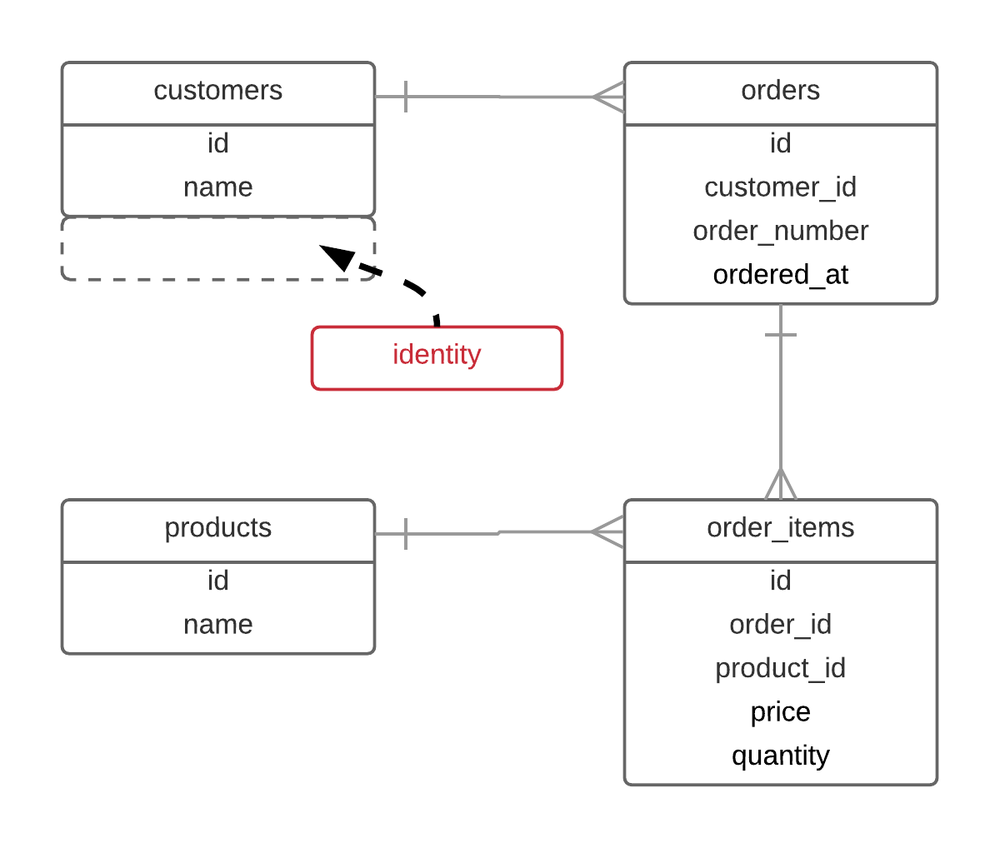
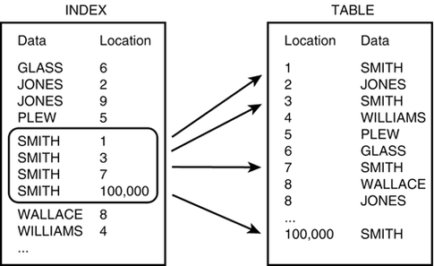
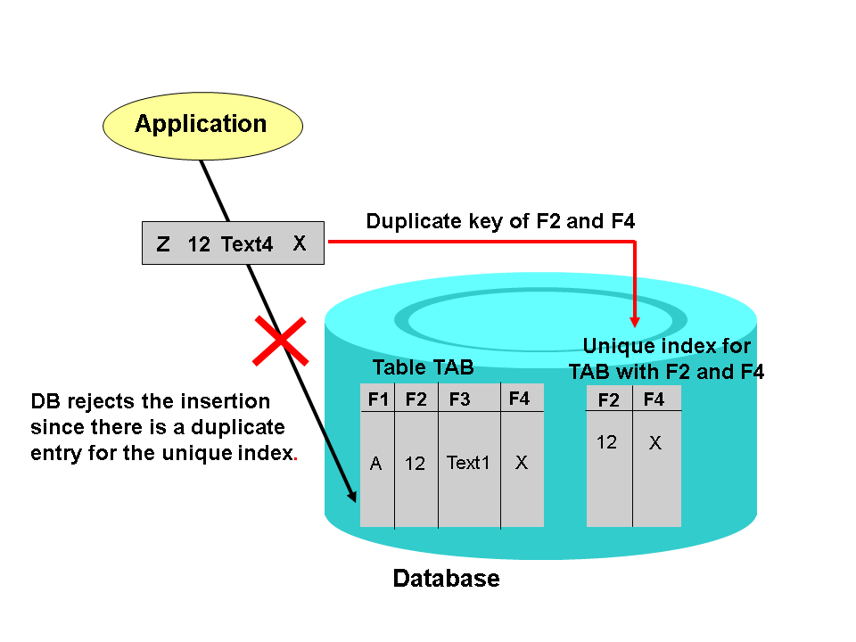

In this chapter you are going to learn how to add a new column to an existing table.

Then you are going to learn about indexes and how useful they are to MySQL good performance.

You will also learn how to remove an index.

Finally, the very important concept of uniqueness is going to be explained.

