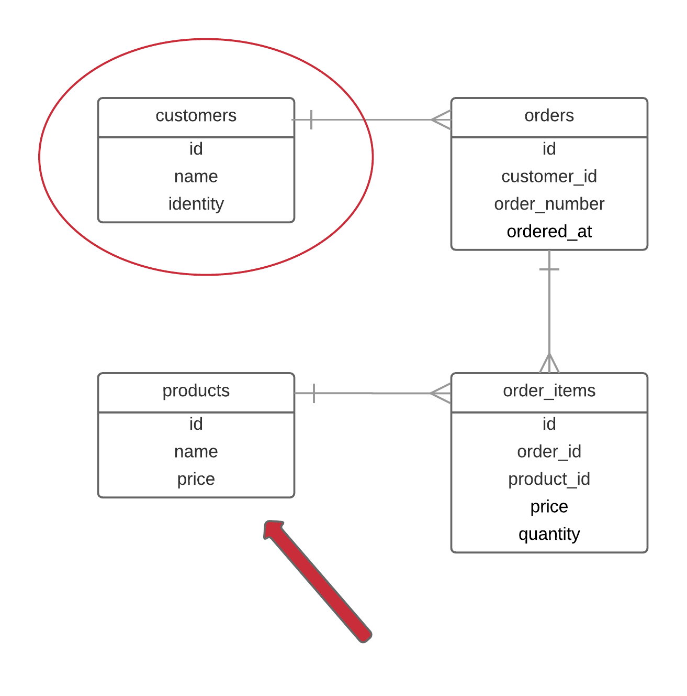
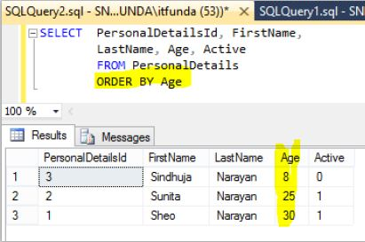
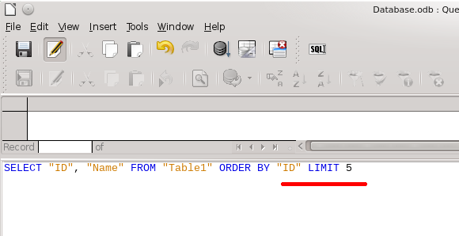

In this chapter, we are going to create a new table `products`, as we progress with the implementation of
our primitive customer relationship management system.

Besides that, you will learn how to sort records 

and how to limit the number of records returned.

