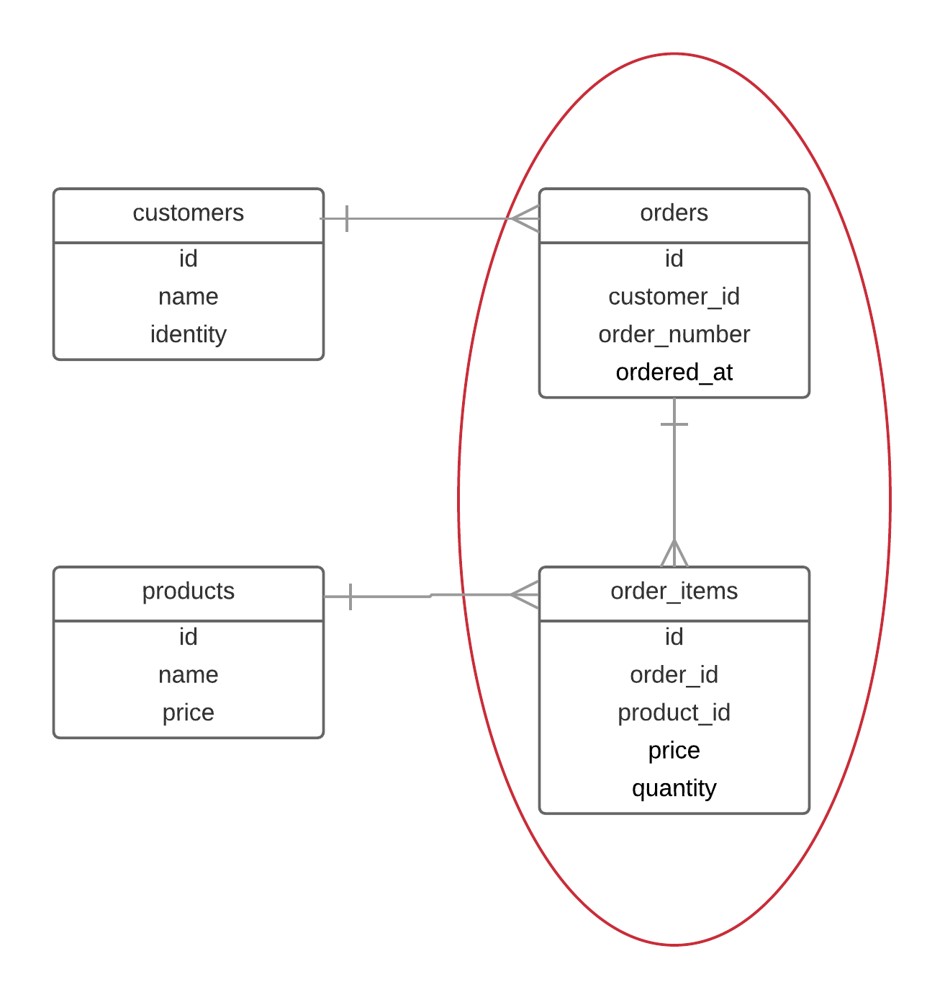
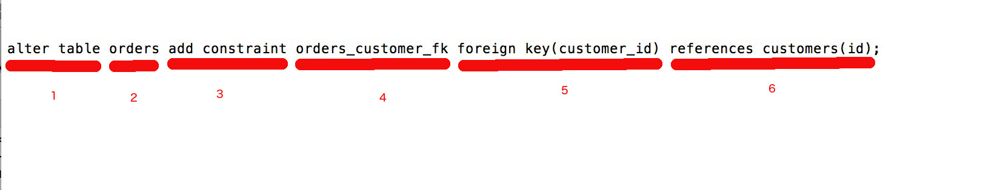
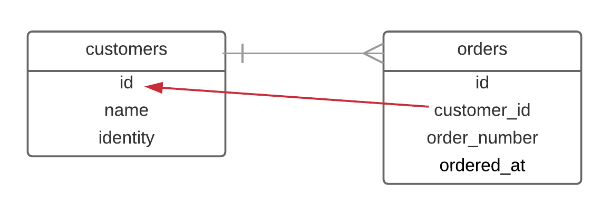
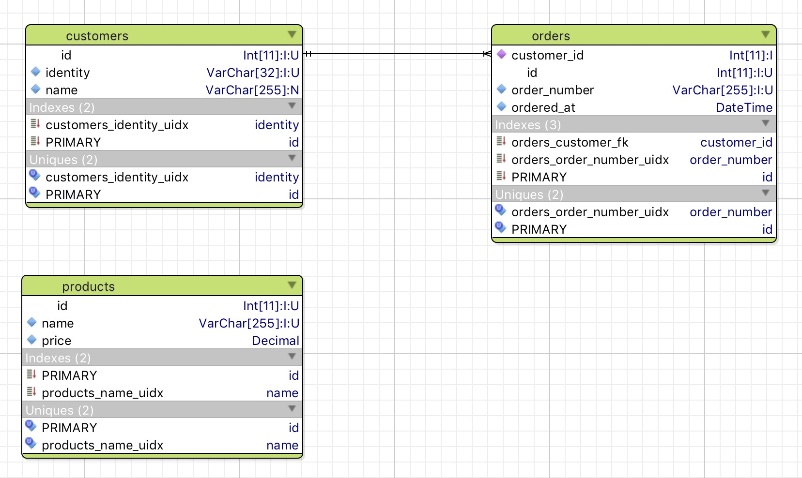
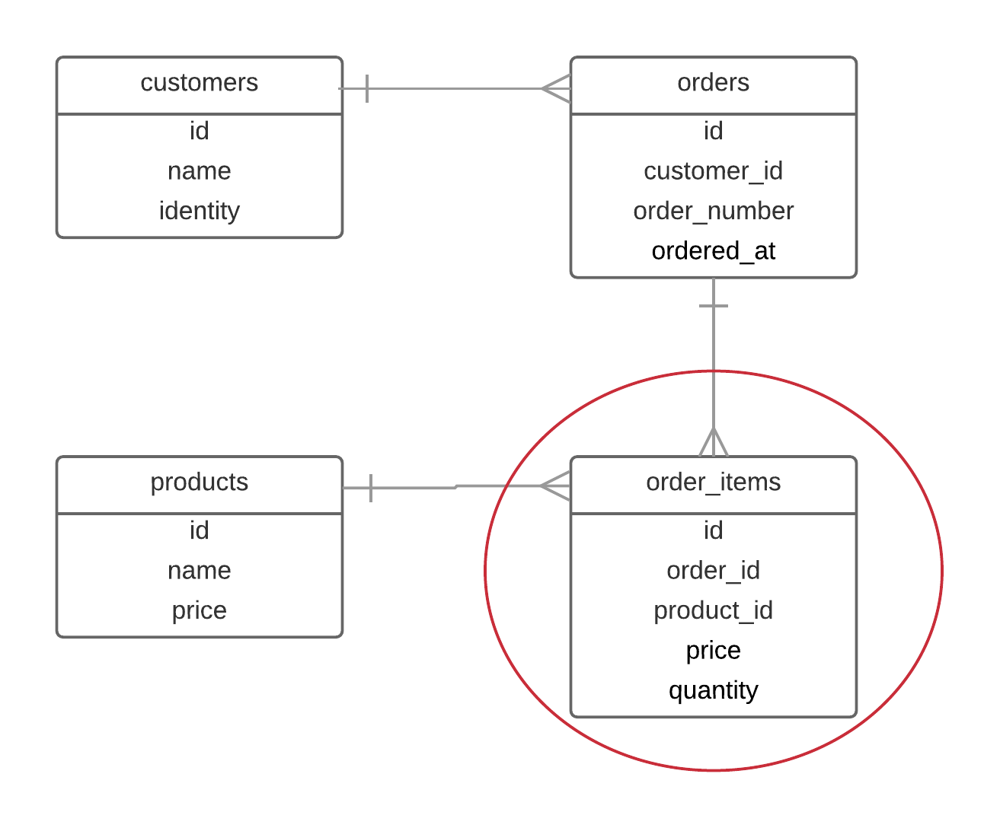
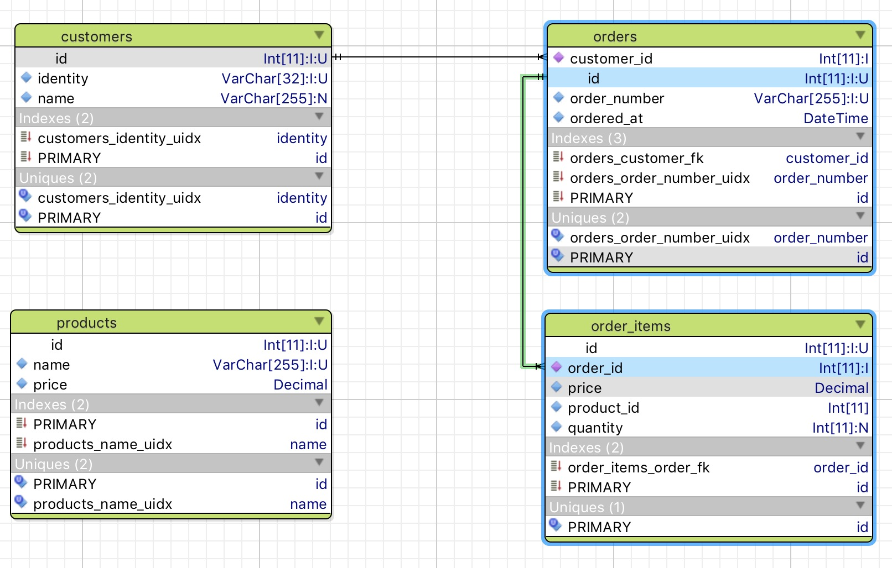
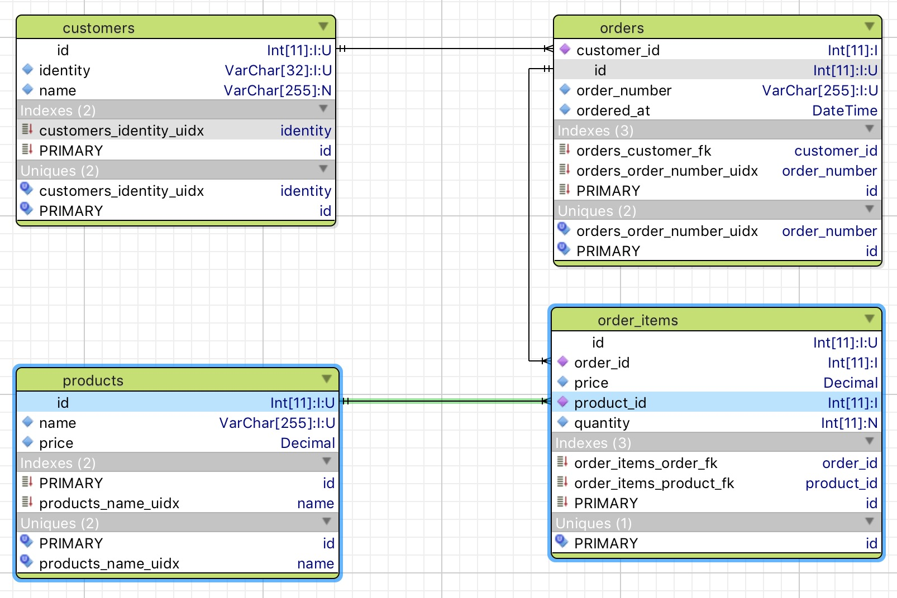
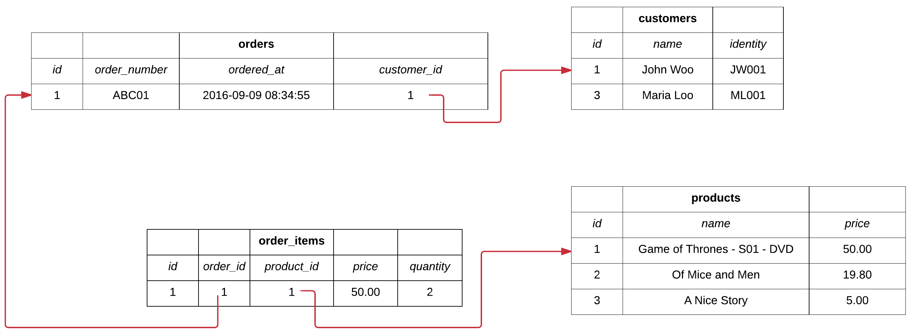

We continue the creation of our primitive customer relationship management system. We have already created the tables `customers`
and `products` and we are now ready to create 2 more tables, `orders` and `order_items`.



## Model Details

`orders` table is holding the header of the order. It has a reference to the owning customer, by the `customer_id` column. This is going to be a foreign key
as we call it. Given 1 order, we can locate the single 1 customer that the order belongs to. That is why the order-to-customer relationship is a 1-to-1 relationship.
On the other hand, given 1 specific customer, we can locate more than 1, many, orders that belong to the particular customer. Hence, the relationship
customer-to-orders is a 1-to-many relationship. 

Besides that, `orders` also has the `order_number`. This is going to be mandatory and it's going to have a string representation. For example `ORD123`. It is also
going to be unique. I.e. each order number will be unique within the table and not two or more orders will have the same order number. Also, it will
be used to quickly locate an order by order number. 

There is also another column called `ordered_at` that will be used to record the date and time an order has been placed. This is going to be mandatory too.

`order_items` table is holding the details of an order. Since each entry in this table belongs to an order, we need the `order_id` column to be a reference to the
owning order. This is another foreign key in our database. Also, given 1 order item we can locate the single 1 order the item belongs to, hence, the
order_item-to-order relationship is a 1-to-1 relationship. On the other hand, given 1 order we can locate more than 1, many, order items belonging to this
particular order. Hence, the order-to-order_items relationship is a 1-to-many relationship. 

Moreover, each order item needs to specify which product it is referring to. We see here the existence of another foreign key, the `product_id`. This is a
reference to the product that the order item refers to. Given 1 specific order item, then we can locate the single 1 product that this order item belongs to.
Hence, the relationship order_item-to-product is a 1-to-1 relationship. On the other hand, given a specific 1 product, we can locate many order items
referring to that particular product. Hence, the relationship product-to-order_items is a 1-to-many relationship.

`order_items` table also has a `price` column. This is going to be a number with 15 digits length and 2 decimal digits rounding. It is supposed to be holding
the price of the product sold at the moment the order item is created. This is going to be mandatory.

For educational reasons, we have decided to prevent the same product appearing in the same order more than once. For that reason, if an order were to include
the same product more than once, then there would be an order item referencing that particular product and having `quantity` equal to the number of instances
of the particular product being in the order. Having said that, how can we ask RDBMS help in implementing this constraint? Maybe a unique index? Is this were
to be on the table `order_items` on `product_id`? Would that be ok? No, because it wouldn't allow the same product to be sold on two different orders. So,
the uniqueness needs to be the combination of the `product_id` and `order_id`. We will see how we are going to create a unique index on that.
 
## Implementation

We will start with the `orders` table. We start `mysql`:

``` sql
$ mysql -u root
Welcome to the MySQL monitor.  Commands end with ; or \g.
Your MySQL connection id is 2
Server version: 5.7.14 MySQL Community Server (GPL)

Copyright (c) 2000, 2016, Oracle and/or its affiliates. All rights reserved.

Oracle is a registered trademark of Oracle Corporation and/or its
affiliates. Other names may be trademarks of their respective
owners.

Type 'help;' or '\h' for help. Type '\c' to clear the current input statement.

mysql> 
```

Then we switch to `customers_db`:

``` sql
mysql> use customers_db;
Reading table information for completion of table and column names
You can turn off this feature to get a quicker startup with -A

Database changed
```

And let's see the tables that our database has:

``` sql
mysql> show tables;
+------------------------+
| Tables_in_customers_db |
+------------------------+
| customers              |
| products               |
+------------------------+
2 rows in set (0.00 sec)
```

As you can see, we have the 2 tables, `customers` and `products`.

### Create `orders` table

Let's now create the `orders` table. The command to create this table is the following:

``` sql
create table orders (id int(11) not null auto_increment, order_number varchar(255) not null, ordered_at datetime not null, customer_id int(11) not null, primary key(id));
```

Before we actually execute this command, let me tell you that there is only 1 new thing for you here. It is the `datetime` type that is used for the `ordered_at` column.
This type is used to define columns that will be holding a date and time stamp.

Let's execute the command:

``` sql
mysql> create table orders (id int(11) not null auto_increment, order_number varchar(255) not null, ordered_at datetime not null, customer_id int(11) not null, primary key(id));
Query OK, 0 rows affected (0.04 sec)
```

We get back `Query OK` which means that the table has been created.

Let's see the list of tables:

``` sql
mysql> show tables;
+------------------------+
| Tables_in_customers_db |
+------------------------+
| customers              |
| orders                 |
| products               |
+------------------------+
3 rows in set (0.00 sec)
```

This means that the table `orders` has been created. And let's see the actual structure of the new table:

``` sql
mysql> show create table orders;
+--------+---------------------------------------------------------------------------------------------------------------------------------------------------------------------------------------------------------------------------------------------------------------------------------------+
| Table  | Create Table                                                                                                                                                                                                                                                                          |
+--------+---------------------------------------------------------------------------------------------------------------------------------------------------------------------------------------------------------------------------------------------------------------------------------------+
| orders | CREATE TABLE `orders` (
  `id` int(11) NOT NULL AUTO_INCREMENT,
  `order_number` varchar(255) COLLATE utf8_unicode_ci NOT NULL,
  `ordered_at` datetime NOT NULL,
  `customer_id` int(11) NOT NULL,
  PRIMARY KEY (`id`)
) ENGINE=InnoDB DEFAULT CHARSET=utf8 COLLATE=utf8_unicode_ci |
+--------+---------------------------------------------------------------------------------------------------------------------------------------------------------------------------------------------------------------------------------------------------------------------------------------+
1 row in set (0.00 sec)
```

This table is missing something that will physically connect it to the `customers` table. Currently, the fact that we have a column `customer_id` does not enforce any
rules, any constraints at the database level. In other words, MySQL does not really know that there is a relationship between the table `orders` and the table `customers`.
But, we are going to deal with that a little bit later.

## Inserting Orders

Let's see our customers:

``` sql
mysql> select * from customers;
+----+-----------+----------+
| id | name      | identity |
+----+-----------+----------+
|  1 | John Woo  | JW0001   |
|  3 | Maria Xoo | ML0001   |
+----+-----------+----------+
2 rows in set (0.01 sec)
```

Now, we are going to insert a new order in the `orders` table. We will use the following command:

``` sql
insert into orders (order_number, ordered_at, customer_id) values ('ABC001', current_timestamp, 1);
```

Before we actually execute this command, let see the new stuff here. It is the `current_timestamp`. This is used as a value for the `ordered_at` column. It will ask MySQL to
set the current date and time stamp. So, we do not have to specify any precise date and time ourselves. 

Also, see the number value `1` for the `customer_id`. This is the id of the customer this new order is going to be linked to. In other words, we want the new order created
to be owned by the customer with id `1`, which is the customer `John Woo`. 

As you can see, we are using the integer numbers, the ids, to reference a `customers` entry from an entry inside `orders` table. The integer values, the ids of the customers
are stored inside the column `customer_id` of the `orders` table. That is why, the type of the column `customer_id` is the same as the type of the column `id` on the `customers`
table (they are both `int(11)`).

Now, let's execute the command:

``` sql
mysql> insert into orders (order_number, ordered_at, customer_id) values ('ABC001', current_timestamp, 1);
Query OK, 1 row affected (0.00 sec)
```

As you can see, we got a `Query OK` back. Let's confirm the insertion of the new order:

``` sql
mysql> select * from orders;
+----+--------------+---------------------+-------------+
| id | order_number | ordered_at          | customer_id |
+----+--------------+---------------------+-------------+
|  1 | ABC001       | 2016-09-09 08:34:55 |           1 |
+----+--------------+---------------------+-------------+
1 row in set (0.00 sec)
```

The new order has been inserted. Its `id` is given automatically and it is `1`. Also, as you can see the `current_timestamp` has been automatically converted to the
current date and time value, thanks to MySQL doing the work for us.

> *Note:* The value for `ordered_at` at your order will be different, depending, of course, at the date and time you executed this command, your current date and time stamp,
in your time zone.

## Inserting Wrong Data

Now, let us try something else. Let us try the following command:

``` sql
insert into orders (order_number, ordered_at, customer_id) values ('ABC001', current_timestamp, 3);
```

Before we execute the command, let me underline the following. Here, we are trying to insert a new order with the same order number as the existing one.
This is a business mistake. There shouldn't be two or more orders with the same order number. In other words, the order number should be unique within the
whole orders table. 

But, even if this order is supposed to be invalid, let's try to do the insertion:

``` sql
mysql> insert into orders (order_number, ordered_at, customer_id) values ('ABC001', current_timestamp, 3);
Query OK, 1 row affected (0.00 sec)

mysql> select * from orders;
+----+--------------+---------------------+-------------+
| id | order_number | ordered_at          | customer_id |
+----+--------------+---------------------+-------------+
|  1 | ABC001       | 2016-09-09 08:34:55 |           1 |
|  2 | ABC001       | 2016-09-09 08:44:44 |           3 |
+----+--------------+---------------------+-------------+
2 rows in set (0.00 sec)
```

We get `Query OK` and if we see the list of the orders, we will see the new order inserted without a problem.

But, since this is not a valid business case, we will ask the help of the database to protect us from inserting such bad data.

## Unique order number

Let's first delete the wrong order, the order with id `2`.

``` sql
mysql> delete from orders where id = 2;
Query OK, 1 row affected (0.01 sec)

mysql> select * from orders;
+----+--------------+---------------------+-------------+
| id | order_number | ordered_at          | customer_id |
+----+--------------+---------------------+-------------+
|  1 | ABC001       | 2016-09-09 08:34:55 |           1 |
+----+--------------+---------------------+-------------+
1 row in set (0.00 sec)
```

We will now create a unique index on the `order_number` of the `orders` table. This will both make my search queries (ones using order number)
quick and will also protect me from inserting the same order number twice. 

This is the command that will create the unique index. Let's execute it:

``` sql
mysql> create unique index orders_order_number_uidx on orders(order_number);
Query OK, 0 rows affected (0.04 sec)
Records: 0  Duplicates: 0  Warnings: 0
```

This is not something new to you. Note the convention on the name of the index: `orders_order_number_uidx`. 

We got the `Query OK`. Let's examine the structure of the `orders` table to make sure that the index has been created:

``` sql
+--------+------------------------------------------------------------------------------------------------------------------------------------------------------------------------------------------------------------------------------------------------------------------------------------------------------------------------------------------------------------------+
| Table  | Create Table                                                                                                                                                                                                                                                                                                                                                     |
+--------+------------------------------------------------------------------------------------------------------------------------------------------------------------------------------------------------------------------------------------------------------------------------------------------------------------------------------------------------------------------+
| orders | CREATE TABLE `orders` (
  `id` int(11) NOT NULL AUTO_INCREMENT,
  `order_number` varchar(255) COLLATE utf8_unicode_ci NOT NULL,
  `ordered_at` datetime NOT NULL,
  `customer_id` int(11) NOT NULL,
  PRIMARY KEY (`id`),
  UNIQUE KEY `orders_order_number_uidx` (`order_number`)
) ENGINE=InnoDB AUTO_INCREMENT=3 DEFAULT CHARSET=utf8 COLLATE=utf8_unicode_ci |
+--------+------------------------------------------------------------------------------------------------------------------------------------------------------------------------------------------------------------------------------------------------------------------------------------------------------------------------------------------------------------------+
1 row in set (0.00 sec)
```

As you can see we now have the specification:

``` sql
UNIQUE KEY `orders_order_number_uidx` (`order_number`)
```

which denotes the presence of a unique index on the `order_number` column.

Now, let's try to insert the problematic order, the one that has same order number as the existing one:

``` sql
mysql> insert into orders (order_number, ordered_at, customer_id) values ('ABC001', current_timestamp, 3);
ERROR 1062 (23000): Duplicate entry 'ABC001' for key 'orders_order_number_uidx'
```

If you try to do that, you now get an `ERROR` with the description `Duplicate entry 'ABC001' for key 'orders_order_number_uidx'`, which is 
precisely the protection that we needed, protecting us from inserting different orders with same order number.

## Inserting Wrong Customer Id

Let's see our customers and our orders again:

``` sql
mysql> select * from customers;
+----+-----------+----------+
| id | name      | identity |
+----+-----------+----------+
|  1 | John Woo  | JW0001   |
|  3 | Maria Xoo | ML0001   |
+----+-----------+----------+
2 rows in set (0.00 sec)

mysql> select * from orders;
+----+--------------+---------------------+-------------+
| id | order_number | ordered_at          | customer_id |
+----+--------------+---------------------+-------------+
|  1 | ABC001       | 2016-09-09 08:34:55 |           1 |
+----+--------------+---------------------+-------------+
1 row in set (0.00 sec)
```

As you can see, the order with `id` `1` refers to the customer with id `1` via the `customer_id` column.

Now, I am going to try to insert a new order that references a non-existing customer. Try the following command:

``` sql
mysql> insert into orders (order_number, ordered_at, customer_id) values ('ABC002', current_timestamp, 4);
Query OK, 1 row affected (0.01 sec)

mysql> select * from orders;
+----+--------------+---------------------+-------------+
| id | order_number | ordered_at          | customer_id |
+----+--------------+---------------------+-------------+
|  1 | ABC001       | 2016-09-09 08:34:55 |           1 |
|  4 | ABC002       | 2016-09-09 08:55:20 |           4 |
+----+--------------+---------------------+-------------+
2 rows in set (0.00 sec)
```

Ooops! The order has been inserted without any problem (error or warning). That's not good. Orders that refer to non-existing customers are not good.
They are invalid data. This is where the statement *MySQL does not really know that there is a relationship between `orders` and `customers` table* applies.

We now really need to make this relationship explicit and make MySQL protect us from inserting such invalid data.

In order to make the relationship explicit, we need to create a database level constraint, which is called *foreign key constraint*.

Ok. Let's do that. But first, let's delete the bad order:

``` sql
mysql> delete from orders where id = 4;
Query OK, 1 row affected (0.00 sec)

mysql> select * from orders;
+----+--------------+---------------------+-------------+
| id | order_number | ordered_at          | customer_id |
+----+--------------+---------------------+-------------+
|  1 | ABC001       | 2016-09-09 08:34:55 |           1 |
+----+--------------+---------------------+-------------+
1 row in set (0.00 sec)
```

The command to create the foreign key constraint is the following:

``` sql
alter table orders add constraint orders_customer_fk foreign key(customer_id) references customers(id);
```

Before we actually execute that, let's study its constituent parts:



(1) The command that we use to create a foreign key constraint on an existing table is a version of the `alter table` command.

(2) Then we give the name of the table.

(3) Then we give `add constraint`. Remember that the last time we used the `alter table` command was to add a new column. In that case we used `add column`.

(4) We give the name of the constraint. This can be anything, but I am suggesting that you follow a convention. When it is a foreign key constraint<sup>*</sup>,
I follow the convention `<altered_table_name>_<foreign_table_name_in_singular_or_plural_form>_fk`. Hence, for our example, we use `orders_customer_fk`.

> <sup>*</sum> There may be other types of constraints, which are out of the scope of this course.

(5) We add `foreign key(<name_of_the_column_holding_the_reference/foreign_value_ids>)`. So, for our example, it is `foreign key(customer_id)`, because it is the
`customer_id` column that is going to hold the reference/foreign value identifiers. 

(6) We add `references <referenced_table_name>(<referenced_column_name>)`. For our example, the `referenced_table_name` needs to be `customers`, because this is the
table we are referencing with `customer_id` foreign key. And the `referenced_column_name` needs to be `id` because this is the referenced column of `customers` table
that will be referenced by the `customer_id` column.



Let's now execute the command:

``` sql
mysql> alter table orders add constraint orders_customer_fk foreign key(customer_id) references customers(id);
Query OK, 1 row affected (0.04 sec)
Records: 1 Duplicates: 0 Warnings: 0
```
As you can see, the command has been executed successfully. We can see the `Query OK`.

Let's see how this has affected the structure of the table `orders`:

``` sql
mysql> show create table orders;
+--------+-----------------------------------------------------------------------------------------------------------------------------------------------------------------------------------------------------------------------------------------------------------------------------------------------------------------------------------------------------------------------------------------------------------------------------------------------------------------------------------------------------------+
| Table  | Create Table                                                                                                                                                                                                                                                                                                                                                                                                                                                                                              |
+--------+-----------------------------------------------------------------------------------------------------------------------------------------------------------------------------------------------------------------------------------------------------------------------------------------------------------------------------------------------------------------------------------------------------------------------------------------------------------------------------------------------------------+
| orders | CREATE TABLE `orders` (
  `id` int(11) NOT NULL AUTO_INCREMENT,
  `order_number` varchar(255) COLLATE utf8_unicode_ci NOT NULL,
  `ordered_at` datetime NOT NULL,
  `customer_id` int(11) NOT NULL,
  PRIMARY KEY (`id`),
  UNIQUE KEY `orders_order_number_uidx` (`order_number`),
  KEY `orders_customer_fk` (`customer_id`),
  CONSTRAINT `orders_customer_fk` FOREIGN KEY (`customer_id`) REFERENCES `customers` (`id`)
) ENGINE=InnoDB AUTO_INCREMENT=5 DEFAULT CHARSET=utf8 COLLATE=utf8_unicode_ci |
+--------+-----------------------------------------------------------------------------------------------------------------------------------------------------------------------------------------------------------------------------------------------------------------------------------------------------------------------------------------------------------------------------------------------------------------------------------------------------------------------------------------------------------+
1 row in set (0.00 sec)
```

There are 2 new things in the structure of the table:

(1) a new index with name `orders_customer_fk` on the column `customer_id`:

``` sql
KEY `orders_customer_fk` (`customer_id`)
```

This is **automatically** added by MySQL every time we add a foreign key constraint. This is done in order to speed up the SQL queries that
combine information from the two tables, `orders` and `customers` based on the relationship built between `customer_id` of `orders` and `id` of
`customers`. We will come back to that later on, when we will talk about joins.

> **Important**: Not all RDBMS systems create this index automatically. MySQL does, but, for example PostgreSQL does not. We basically believe that this
index is necessary. So, if you work with an RDBMS that does not add this index automatically when you add the foreign key constraint, then go ahead
and add it yourself, with the use of the command `create index`.

> **Important**: If you first create the indexes necessary to support queries and unique constraints and then you create your foreign keys, MySQL might
decided that it is not necessary to create an extra index to pair the foreign key, if the creation of that extra index is redundant, i.e. when there is
already another index that could support the queries that join two tables using this foreign key constraint. 

and 

(2) a new constraint of type foreign key:

``` sql
CONSTRAINT `orders_customer_fk` FOREIGN KEY (`customer_id`) REFERENCES `customers` (`id`)
```
I guess this was expected, since it matches the command `alter table` that we issued. 

Nice. We now have a real relationship between the table `orders` and the table `customers`. This relationship is also reversed engineered
by tools that build ERD (Entity Relationship Diagrams) after reading the internals of the database schema.

One such tool is [Valentina Studio](http://valentina-db.com/en/valentina-studio-overview) which is free to install and works on many platforms. Here is
the diagram that Valentina has built for our `customers_db` database:



> <sup>*</sup> At the end of this chapter you will find a video explaining how one can create an ERD using Valentina Studio
 
## Try to Insert Bad Data Again

You remember that we have managed to create bad data (an order referencing a non-existing customer), and because of this, we have now created the
constraint, in order to ask MySQL to protect us from this wrong action.

We will now try to insert the bad data again and see how MySQL behaves.

Let's see our customers. 

``` sql
mysql> select * from customers;
+----+-----------+----------+
| id | name      | identity |
+----+-----------+----------+
|  1 | John Woo  | JW0001   |
|  3 | Maria Xoo | ML0001   |
+----+-----------+----------+
2 rows in set (0.00 sec)
```

Let's try to add a new order that refers to a non-existing customer with id `4`:

``` sql
mysql> insert into orders (order_number, ordered_at, customer_id) values ('ABC002', current_timestamp, 4);
ERROR 1452 (23000): Cannot add or update a child row: a foreign key constraint fails (`customers_db`.`orders`, CONSTRAINT `orders_customer_fk` FOREIGN KEY (`customer_id`) REFERENCES `customers` (`id`))
```

Great! This one now failed, with `ERROR 1452` and descriptive message clearly mentioning that the error is due to the fact that
a foreign key constraint rule fails. It also gives you the definition of the constraint that failed in order for you to clearly understand
what was the root cause of the problem.

This is the `R` part of the `RDBMS` in action. `Relational`. We can see how MySQL, our RDBMS, is using the relationships between the tables to 
keep our data valid.

Now the `orders` table is finally ready.

## Creating `order_items` table

`order_items` table is going to be holding the details of an order.



For that table and in order to enforce the referential integrity between the tables, we will need to create 2 foreign keys. One foreign key that would relate table `order_items` to
table `orders`. A second foreign key that would relate table `order_items` to table `products`. 

But first, let's create the table. We will add the foreign key constraints later on, with `alter table` commands.

``` sql
mysql> create table order_items (id int(11) not null auto_increment, order_id int(11) not null, product_id int(11) not null, price numeric(15, 2) not null, quantity int(11), primary key(id));
Query OK, 0 rows affected (0.02 sec)
```

The command returned `Query OK`. Let's keep some notes about the above command:

(1) It has an `id`, which is the primary key of the table, it is mandatory (`not null`) and it is automatically assigned, incrementally (`auto_increment`).

(2) The columns that are going to be used for referential integrity between table `order_items` and tables `orders` and `products` are `order_id` and `product_id` respectively.
The type for both of these columns is `int(11)` and matches the type of `id` column of the corresponding table. I.e. The `id` on `orders` and the `id` on `products` they both
have type `int(11)`. This is a pre-requisite in order to later build the foreign key constraints.

(3) Note that both `order_id` and `product_id` are mandatory (`not null`) because we cannot have an `order` entry without referencing an `order` and a `product`.
 
(4) `price` is mandatory.
 
(5) `quantity` is optional. But it may have been mandatory to improve the constraints on the design. For the time being, an `order` without a `quantity` will assume that
quantity is `1`.

Let's get the list of the tables:

``` sql
mysql> show tables;
+------------------------+
| Tables_in_customers_db |
+------------------------+
| customers              |
| order_items            |
| orders                 |
| products               |
+------------------------+
4 rows in set (0.01 sec)
```

You can see that `order_items` table is part of the list returned. 

And let's get the structure of the new `order_items` table:

``` sql
mysql> show create table order_items;
+-------------+---------------------------------------------------------------------------------------------------------------------------------------------------------------------------------------------------------------------------------------------------------------------------------------------+
| Table       | Create Table                                                                                                                                                                                                                                                                                |
+-------------+---------------------------------------------------------------------------------------------------------------------------------------------------------------------------------------------------------------------------------------------------------------------------------------------+
| order_items | CREATE TABLE `order_items` (
  `id` int(11) NOT NULL AUTO_INCREMENT,
  `order_id` int(11) NOT NULL,
  `product_id` int(11) NOT NULL,
  `price` decimal(15,2) NOT NULL,
  `quantity` int(11) DEFAULT NULL,
  PRIMARY KEY (`id`)
) ENGINE=InnoDB DEFAULT CHARSET=utf8 COLLATE=utf8_unicode_ci |
+-------------+---------------------------------------------------------------------------------------------------------------------------------------------------------------------------------------------------------------------------------------------------------------------------------------------+
1 row in set (0.00 sec)
```

There is nothing new here for you. 

## Referential Integrity between `orders` and `order_items`

Let's first connect the table `order_items` with the table `orders`. You must be in position to understand and execute the next order:

``` sql
mysql> alter table order_items add constraint order_items_order_fk foreign key(order_id) references orders(id);
Query OK, 0 rows affected (0.03 sec)
Records: 0  Duplicates: 0  Warnings: 0
```

We got `Query OK`. This creates the foreign key constraint `order_items_order_fk` and the index on the column `order_id`. The index will also have the same name.

Let's verify the new structure of the table:

``` sql
mysql> show create table order_items;
+-------------+---------------------------------------------------------------------------------------------------------------------------------------------------------------------------------------------------------------------------------------------------------------------------------------------------------------------------------------------------------------------------------------------------------------------------------+
| Table       | Create Table                                                                                                                                                                                                                                                                                                                                                                                                                    |
+-------------+---------------------------------------------------------------------------------------------------------------------------------------------------------------------------------------------------------------------------------------------------------------------------------------------------------------------------------------------------------------------------------------------------------------------------------+
| order_items | CREATE TABLE `order_items` (
  `id` int(11) NOT NULL AUTO_INCREMENT,
  `order_id` int(11) NOT NULL,
  `product_id` int(11) NOT NULL,
  `price` decimal(15,2) NOT NULL,
  `quantity` int(11) DEFAULT NULL,
  PRIMARY KEY (`id`),
  KEY `order_items_order_fk` (`order_id`),
  CONSTRAINT `order_items_order_fk` FOREIGN KEY (`order_id`) REFERENCES `orders` (`id`)
) ENGINE=InnoDB DEFAULT CHARSET=utf8 COLLATE=utf8_unicode_ci |
+-------------+---------------------------------------------------------------------------------------------------------------------------------------------------------------------------------------------------------------------------------------------------------------------------------------------------------------------------------------------------------------------------------------------------------------------------------+
1 row in set (0.00 sec)
```

As you can see, we have the 2 new definitions:

``` sql
KEY `order_items_order_fk` (`order_id`),
CONSTRAINT `order_items_order_fk` FOREIGN KEY (`order_id`) REFERENCES `orders` (`id`)
```

The first is for the new index, due to the fact that we have created the foreign key constraint. The second is for the foreign key constraint itself.

If you have downloaded the Valentina Studio or if you have other tool to automatically create the ERDs of a database schema, you will now see the relationship
appearing between the `order_items` and the `orders` tables:



This relationship secures the referential integrity between the `order_items` and `orders`. 

## Referential Integrity between `products` and `order_items`

Let's now connect the table `order_items` with the table `products`. You must be in position to understand and execute the next order:

``` sql
mysql> alter table order_items add constraint order_items_product_fk foreign key(product_id) references products(id);
Query OK, 0 rows affected (0.03 sec)
Records: 0  Duplicates: 0  Warnings: 0
```

We got `Query OK`. This creates the foreign key constraint `order_items_product_fk` and the index on the column `product_id`. The index will also have the same name.

Let's verify the new structure of the table:

``` sql
mysql> show create table order_items;
+-------------+-------------------------------------------------------------------------------------------------------------------------------------------------------------------------------------------------------------------------------------------------------------------------------------------------------------------------------------------------------------------------------------------------------------------------------------------------------------------------------------------------------------------------------------------------------------------------------+
| Table       | Create Table                                                                                                                                                                                                                                                                                                                                                                                                                                                                                                                                                                  |
+-------------+-------------------------------------------------------------------------------------------------------------------------------------------------------------------------------------------------------------------------------------------------------------------------------------------------------------------------------------------------------------------------------------------------------------------------------------------------------------------------------------------------------------------------------------------------------------------------------+
| order_items | CREATE TABLE `order_items` (
  `id` int(11) NOT NULL AUTO_INCREMENT,
  `order_id` int(11) NOT NULL,
  `product_id` int(11) NOT NULL,
  `price` decimal(15,2) NOT NULL,
  `quantity` int(11) DEFAULT NULL,
  PRIMARY KEY (`id`),
  KEY `order_items_order_fk` (`order_id`),
  KEY `order_items_product_fk` (`product_id`),
  CONSTRAINT `order_items_order_fk` FOREIGN KEY (`order_id`) REFERENCES `orders` (`id`),
  CONSTRAINT `order_items_product_fk` FOREIGN KEY (`product_id`) REFERENCES `products` (`id`)
) ENGINE=InnoDB DEFAULT CHARSET=utf8 COLLATE=utf8_unicode_ci |
+-------------+-------------------------------------------------------------------------------------------------------------------------------------------------------------------------------------------------------------------------------------------------------------------------------------------------------------------------------------------------------------------------------------------------------------------------------------------------------------------------------------------------------------------------------------------------------------------------------+
1 row in set (0.00 sec)
```

As you can see, we have the 2 new definitions:

``` sql
KEY `order_items_product_fk` (`product_id`),
CONSTRAINT `order_items_product_fk` FOREIGN KEY (`product_id`) REFERENCES `products` (`id`)
```

The first is for the new index, due to the fact that we have created the foreign key constraint. The second is for the foreign key constraint itself.

Valentina Studio diagram will show again the ERD and the new relationship between `order_items` and `products`:



This relationship secures the referential integrity between the `order_items` and `products`. 

## Inserting Data Into The Details

Let's see the data that we have in our orders:

``` sql
mysql> select * from orders;
+----+--------------+---------------------+-------------+
| id | order_number | ordered_at          | customer_id |
+----+--------------+---------------------+-------------+
|  1 | ABC001       | 2016-09-09 08:34:55 |           1 |
+----+--------------+---------------------+-------------+
1 row in set (0.00 sec)
```

Let's also see our products:

``` sql
mysql> select * from products;
+----+-----------------------------+-------+
| id | name                        | price |
+----+-----------------------------+-------+
|  1 | Game of Thrones - S01 - DVD | 50.00 |
|  2 | Of Mice and Men             | 19.80 |
|  3 | A Nice Story                |  5.00 |
+----+-----------------------------+-------+
3 rows in set (0.00 sec)
```

Let's now insert the details of the first order, the one with `id` `1`. We will sell 2 DVDs of the `Game of Thrones - S01 - DVD` product:

``` sql
mysql>  insert into order_items (order_id, product_id, price, quantity) values (1, 1, 50.00, 2);
Query OK, 1 row affected (0.00 sec)
```

We get back `Query OK`. The command is not new to you. You only have to make sure that you give the correct reference values. So, for the `order_id` we give the value `1`,
because we want the new details entry (the new entry in `order_items`) to be referring to the 1st order that has `id` `1`. We also set the `product_id` to have the
value `1`, because it is the product id `1` that corresponds to the product `Game of Thrones - S01 - DVD`. 

Let's now see the contents of the `order_items` table:

``` sql
mysql> select * from order_items;
+----+----------+------------+-------+----------+
| id | order_id | product_id | price | quantity |
+----+----------+------------+-------+----------+
|  1 |        1 |          1 | 50.00 |        2 |
+----+----------+------------+-------+----------+
1 row in set (0.00 sec)
```

The new order item has been created successfully. 

So, basically, we have created the following data relationships in our database.



## Unique Index On Multiple Columns

There is something left to be implemented with regards to our primitive customer relationship management system. This is the constraint:

*The same product cannot be added to the same order more than once*. 

This business rule assumes that if one wanted to add the same product twice in the same order, then he would have to set the quantity to 2.

How can we ask the help of MySQL to prevent user from inserting the same product more than once in the same order? 

This is very simple. Since all that we want is any combination between `order_id` and `product_id` to be unique, we only have to create a unique index that
encompasses both columns. Let's do that:

``` sql
mysql> create unique index order_items_order_product_uidx on order_items(order_id, product_id);
Query OK, 0 rows affected (0.04 sec)
Records: 0  Duplicates: 0  Warnings: 0
```

We got back `Query OK`. Watch out how we build the name of the index. It is a pattern that we follow, although we could name it anything that we liked.
Then watch out the `on order_items(order_id, product_id)` specification. This is the trick here. Our new index now combines 2 columns. So, the combined
value of them needs to be unique. Not either of them. Both of them.

Let's see the structure of our table:

``` sql
mysql> show create table order_items;
+-------------+------------------------------------------------------------------------------------------------------------------------------------------------------------------------------------------------------------------------------------------------------------------------------------------------------------------------------------------------------------------------------------------------------------------------------------------------------------------------------------------------------------------------------------------------------------------------------------------------------------------------------+
| Table       | Create Table                                                                                                                                                                                                                                                                                                                                                                                                                                                                                                                                                                                                                 |
+-------------+------------------------------------------------------------------------------------------------------------------------------------------------------------------------------------------------------------------------------------------------------------------------------------------------------------------------------------------------------------------------------------------------------------------------------------------------------------------------------------------------------------------------------------------------------------------------------------------------------------------------------+
| order_items | CREATE TABLE `order_items` (
  `id` int(11) NOT NULL AUTO_INCREMENT,
  `order_id` int(11) NOT NULL,
  `product_id` int(11) NOT NULL,
  `price` decimal(15,2) NOT NULL,
  `quantity` int(11) DEFAULT NULL,
  PRIMARY KEY (`id`),
  UNIQUE KEY `order_items_order_product_uidx` (`order_id`,`product_id`),
  KEY `order_items_product_fk` (`product_id`),
  CONSTRAINT `order_items_order_fk` FOREIGN KEY (`order_id`) REFERENCES `orders` (`id`),
  CONSTRAINT `order_items_product_fk` FOREIGN KEY (`product_id`) REFERENCES `products` (`id`)
) ENGINE=InnoDB AUTO_INCREMENT=2 DEFAULT CHARSET=utf8 COLLATE=utf8_unicode_ci |
+-------------+------------------------------------------------------------------------------------------------------------------------------------------------------------------------------------------------------------------------------------------------------------------------------------------------------------------------------------------------------------------------------------------------------------------------------------------------------------------------------------------------------------------------------------------------------------------------------------------------------------------------------+
1 row in set (0.00 sec)
```

As you can see, there is a new `KEY` specification, and in fact, a `UNIQUE KEY` one. This combines the columns `order_id` and `product_id`:

``` sql
UNIQUE KEY `order_items_order_product_uidx` (`order_id`,`product_id`)
```

Let's see how we can verify that our unique index works as expected. Let's try to insert another order item for the same order and same product.

First list the current order items:

``` sql
mysql> select * from order_items;
+----+----------+------------+-------+----------+
| id | order_id | product_id | price | quantity |
+----+----------+------------+-------+----------+
|  1 |        1 |          1 | 50.00 |        2 |
+----+----------+------------+-------+----------+
1 row in set (0.00 sec)
```

The next command will try to insert a new order item for the **same order** and the **same product**. We expect this to fail.

``` sql
mysql> insert into order_items (order_id, product_id, price, quantity) values (1, 1, 50.00, 3);
ERROR 1062 (23000): Duplicate entry '1-1' for key 'order_items_order_product_uidx'
```

and it does. The error mentions that the combination `1-1` violates the unique index `order_items_order_product_uidx`.

Perfect! The unique index does not allow us to insert an order item with same order and same product. 

On the other hand, let's try to insert an order item for same product but for different order. Let's see the orders first:

``` sql
+----+--------------+---------------------+-------------+
| id | order_number | ordered_at          | customer_id |
+----+--------------+---------------------+-------------+
|  1 | ABC001       | 2016-09-09 08:34:55 |           1 |
+----+--------------+---------------------+-------------+
1 row in set (0.00 sec)
```

Let's create another order:

``` sql
mysql> insert into orders (order_number, ordered_at, customer_id) values ('ABC002', current_timestamp, 1);
Query OK, 1 row affected (0.01 sec)

mysql> select * from orders;
+----+--------------+---------------------+-------------+
| id | order_number | ordered_at          | customer_id |
+----+--------------+---------------------+-------------+
|  1 | ABC001       | 2016-09-09 08:34:55 |           1 |
|  6 | ABC002       | 2016-09-10 16:10:43 |           1 |
+----+--------------+---------------------+-------------+
2 rows in set (0.00 sec)
```

Now we have 2 orders for the same customer, but they have different order number and ordered date and time stamp.

If we try to insert a new order item for this new order but for the old product with id `1`, this will not fail:

``` sql
mysql> insert into order_items (order_id, product_id, price, quantity) values (6, 1, 50.00, 5);
Query OK, 1 row affected (0.00 sec)
```
Nice! The unique index, although it does not let us add the same product to the same order, it does let us add the
same product to different order.

``` sql
mysql> select * from order_items;
+----+----------+------------+-------+----------+
| id | order_id | product_id | price | quantity |
+----+----------+------------+-------+----------+
|  1 |        1 |          1 | 50.00 |        2 |
|  3 |        6 |          1 | 50.00 |        5 |
+----+----------+------------+-------+----------+
2 rows in set (0.00 sec)
```

## Closing Note

## Video / Screencast with Content of Chapter

We would like to close this chapter by giving you a link to a video / screencast with the chapter content. You may want to 
watch it as an alternative source of learning. 

<div id="media-title-video-foreign-keys.mp4">Foreign Keys</div>
<a href="https://player.vimeo.com/video/194418743"></a>          

## Valentina Studio

This video shows how one can create a diagram of the tables and the relationships using Valentina Studio.

<div id="media-title-video-create-erd-with-valentina-studio.mp4">Chapter Video / Screencast - Create ERD using Valentina Studio</div>
<a href="https://player.vimeo.com/video/194417285"></a>          
