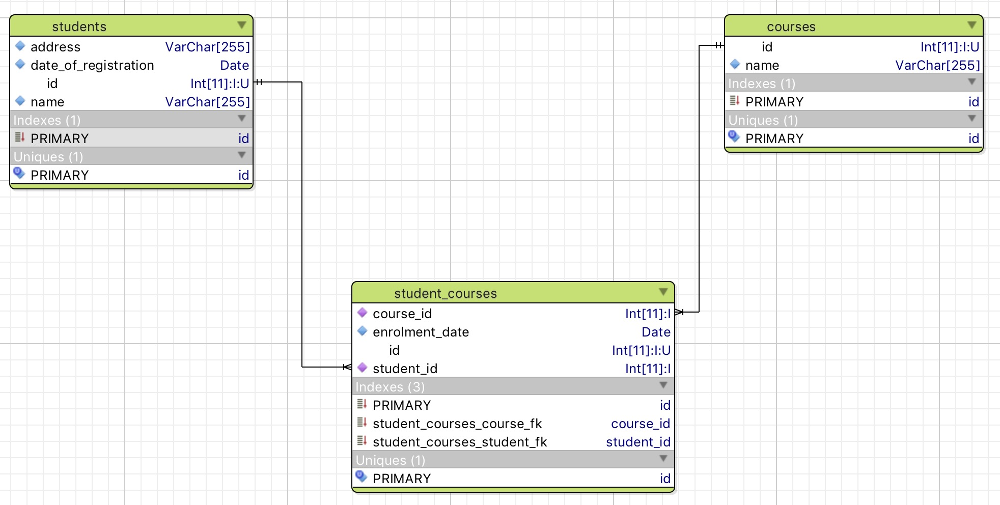

# Task B

Your student needs to create a students database following the next entity relationship diagram.



Some things that may not be obvious from the diagram are:

1. All tables `id` columns are mandatory and primary keys that take values automatically using increments.
2. Table `students`:
    1. `name` should be mandatory with maximum 255 characters. It should also be unique.
    1. `address` should be mandatory with maximum 255 characters. 
    1. `date_of_registration` should be mandatory. It should be of type `date` and not `datetime`.
3. Table `courses`:
    1. `name` should be mandatory with maximum 255 characters. It should also be unique.
4. Table `student_courses`:
    1. `student_id` should be mandatory. 
    1. `course_id` should be mandatory.
    1. `enrolment_date` should be mandatory. It should be of type `date` and not `datetime`.
    1. The same student should not be allowed to enrol on the same course more than once.
    
These are indicative SQL command that can be used to create the specified database schema:

``` sql
create database students_db default character set utf8 collate utf8_unicode_ci;
create table students (id int(11) not null auto_increment, name varchar(255) not null, address varchar(255) not null, date_of_registration date not null, primary key(id));
create table courses (id int(11) not null auto_increment, name varchar(255) not null, primary key(id));
create table student_courses (id int(11) not null auto_increment, student_id int(11) not null, course_id int(11) not null, enrolment_date date not null, primary key(id));
alter table student_courses add constraint student_courses_student_fk foreign key(student_id) references students(id);
alter table student_courses add constraint student_courses_course_fk foreign key(course_id) references courses(id);
```

**Important**: Your student needs to upload their work (all SQL statements) on their Github account. You need to review it online.
    

