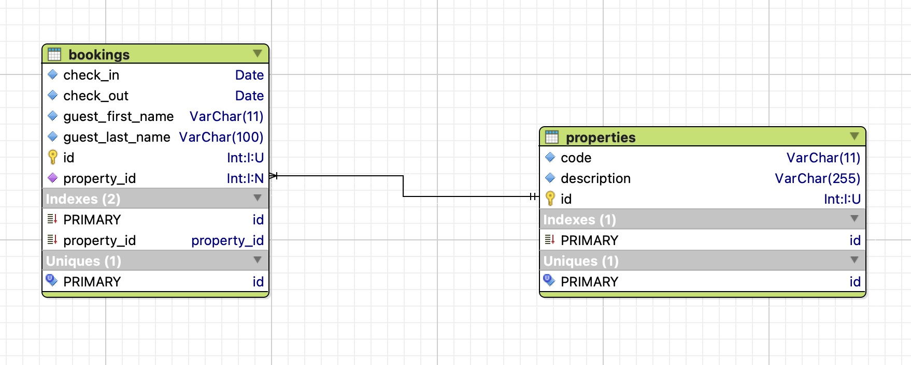



# Task B

Create a students database following the next entity relationship diagram.


Some things that may not be obvious from the diagram are:

1. All tables `id` columns are mandatory and primary keys that take values automatically using increments.
2. Table `students`:
    1. `name` should be mandatory with maximum 255 characters. It should also be unique.
    1. `address` should be mandatory with maximum 255 characters. 
    1. `date_of_registration` should be mandatory. It should be of type `date` and not `datetime`.
3. Table `courses`:
    1. `name` should be mandatory with maximum 255 characters. It should also be unique.
4. Table `student_courses`:
    1. `student_id` should be mandatory. 
    1. `course_id` should be mandatory.
    1. `enrolment_date` should be mandatory. It should be of type `date` and not `datetime`.
    1. The same student should not be allowed to enrol on the same course more than once.
    
    
# Task C

Create a bookings database following the next entity relationship diagram.



Some things that may not be obvious from the diagram are:

1. All tables `id` columns are mandatory and primary keys that take values automatically using increments.
2. All columns are required to have a value, i.e. not null.

Then create some properties and then some bookings on these properties.

```
(properties)
+----+-------+-------------------------+
| id | code  | description             |
+----+-------+-------------------------+
|  1 | PAR-1 | House in Paris Centre   |
|  2 | ATH-1 | Studio in Athens Centre |
+----+-------+-------------------------+
```

```
(bookings)
+----+------------------+-----------------+------------+------------+-------------+
| id | guest_first_name | guest_last_name | check_in   | check_out  | property_id |
+----+------------------+-----------------+------------+------------+-------------+
|  1 | Panos            | Matsos          | 2021-12-13 | 2021-12-15 |           1 |
|  2 | Peter            | Pan             | 2021-12-18 | 2021-12-21 |           1 |
|  3 | John             | Woo             | 2022-01-04 | 2022-01-18 |           2 |
+----+------------------+-----------------+------------+------------+-------------+
```

**Important**: Your code (all SQL statements) needs to be uploaded into a new project on your Github account. Invite your mentor to review your code online.
