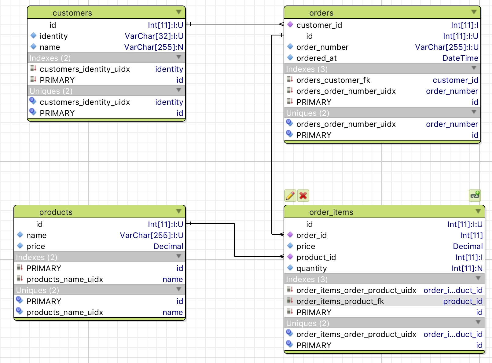
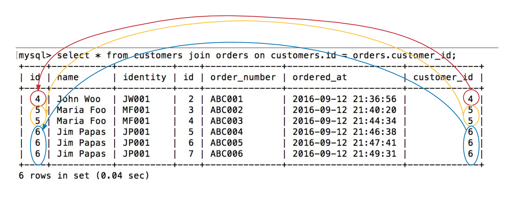
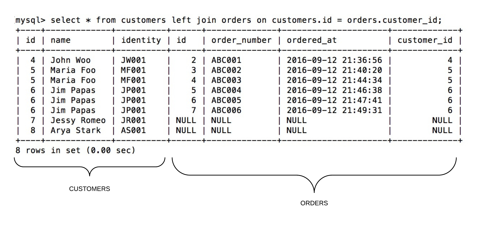
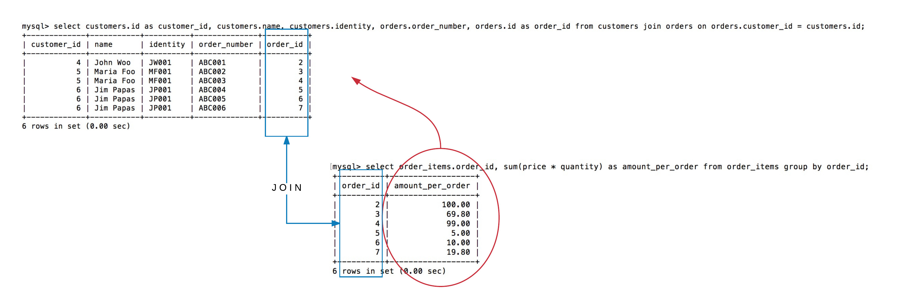
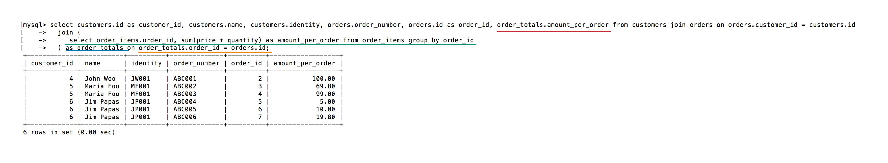

Let's start by opening a terminal window and connecting to MySQL server using `mysql`.

``` bash
$ mysql -u root
Welcome to the MySQL monitor.  Commands end with ; or \g.
Your MySQL connection id is 2
Server version: 5.7.14 MySQL Community Server (GPL)

Copyright (c) 2000, 2016, Oracle and/or its affiliates. All rights reserved.

Oracle is a registered trademark of Oracle Corporation and/or its
affiliates. Other names may be trademarks of their respective
owners.

Type 'help;' or '\h' for help. Type '\c' to clear the current input statement.

mysql> 
```

Let's switch to our database and list the tables that it contains:

``` sql
mysql> use customers_db;
Reading table information for completion of table and column names
You can turn off this feature to get a quicker startup with -A

Database changed
mysql> show tables;
+------------------------+
| Tables_in_customers_db |
+------------------------+
| customers              |
| order_items            |
| orders                 |
| products               |
+------------------------+
4 rows in set (0.00 sec)
```

## Review Database Schema

Let's review again the database schema of our `customers_db` database.



(1) `customers` table is linked to `orders` table. It is a 1-to-many relationship. The `customer_id` can be found inside the `orders` table. It is a foreign key to `customers` `id` column.
Hence, 1 customer can have many orders.

(2) `orders` table has 1-to-many relationship to `order_items`. The `order_items` are the details of an order. 
 
(3) `order_items` table holds the foreign key (column `order_id`) to `orders` `id` column. Hence, for every order item, we know which order it belongs to. Also, the order item holds the
foreign key (`product_id`) to the `products` `id` column. In other words, an order item always references a specific product.

## Retrieving Data

We are going to carry out lots of hands-on exercises on retrieving data stored inside our customers database. Doing that we will learn for `joins` and `sub-queries`. 

### Deleting Existing Data

Before we proceed, let's delete the existing data from our database. We will then insert data that will be useful for us to learn the new concepts.

The following commands will delete all the data except from the products. We will leave the products as they are:

``` sql
mysql> delete from order_items;
Query OK, 2 rows affected (0.01 sec)

mysql> delete from orders;
Query OK, 2 rows affected (0.00 sec)

mysql> delete from customers;
Query OK, 2 rows affected (0.00 sec)
```

All the above are `delete` statements that they do not have any where clause. Hence, they delete all the data from the tables that they are called on.

We are only left with the products data:

``` sql
mysql> select * from products;
+----+-----------------------------+-------+
| id | name                        | price |
+----+-----------------------------+-------+
|  1 | Game of Thrones - S01 - DVD | 50.00 |
|  2 | Of Mice and Men             | 19.80 |
|  3 | A Nice Story                |  5.00 |
+----+-----------------------------+-------+
3 rows in set (0.01 sec)
```

### Inserting Necessary Data

We are now going to execute the following commands to create the necessary data to support our query exercises:

First the customers:

``` sql
mysql> insert into customers (name, identity) values ('John Woo', 'JW001');
Query OK, 1 row affected (0.00 sec)

mysql> insert into customers (name, identity) values ('Maria Foo', 'MF001');
Query OK, 1 row affected (0.00 sec)

mysql> insert into customers (name, identity) values ('Jim Papas', 'JP001');
Query OK, 1 row affected (0.01 sec)

mysql> insert into customers (name, identity) values ('Jessy Romeo', 'JR001');
Query OK, 1 row affected (0.01 sec)

mysql> insert into customers (name, identity) values ('Arya Stark', 'AS001');
Query OK, 1 row affected (0.01 sec)
```

If we select the customers, we should see this:

``` sql
mysql> select * from customers;
+----+-------------+----------+
| id | name        | identity |
+----+-------------+----------+
|  4 | John Woo    | JW001    |
|  5 | Maria Foo   | MF001    |
|  6 | Jim Papas   | JP001    |
|  7 | Jessy Romeo | JR001    |
|  8 | Arya Stark  | AS001    |
+----+-------------+----------+
5 rows in set (0.00 sec)
```

Then create orders and order items:

*Insert 1 order, with 1 order item, for the 1st customer:*

``` sql
mysql> insert into orders (order_number, ordered_at, customer_id) values ('ABC001', current_timestamp, 4);
Query OK
mysql> select * from orders;
+----+--------------+---------------------+-------------+
| id | order_number | ordered_at          | customer_id |
+----+--------------+---------------------+-------------+
|  2 | ABC001       | 2016-09-12 21:36:56 |           4 |
+----+--------------+---------------------+-------------+
1 row in set (0.02 sec)
mysql> insert into order_items (order_id, product_id, price, quantity) values (2, 1, 50.00, 2);
Query OK
```

*Insert 1 order, with 2 order items, for the 2nd customer:*

``` sql
mysql> insert into orders (order_number, ordered_at, customer_id) values ('ABC002', current_timestamp, 5);
Query OK

mysql> select * from orders;
+----+--------------+---------------------+-------------+
| id | order_number | ordered_at          | customer_id |
+----+--------------+---------------------+-------------+
|  2 | ABC001       | 2016-09-12 21:36:56 |           4 |
|  3 | ABC002       | 2016-09-12 21:40:20 |           5 |
+----+--------------+---------------------+-------------+
2 rows in set (0.02 sec)

mysql> insert into order_items (order_id, product_id, price, quantity) values (3, 1, 50.00, 1);
Query OK, 1 row affected (0.00 sec)

mysql> insert into order_items (order_id, product_id, price, quantity) values (3, 2, 19.80, 1);
Query OK, 1 row affected (0.00 sec)
```

*We then create 1 more order, for the 2nd customers. Only 1 order item:*

``` sql
mysql> insert into orders (order_number, ordered_at, customer_id) values ('ABC003', current_timestamp, 5);
Query OK

mysql> select * from orders;
+----+--------------+---------------------+-------------+
| id | order_number | ordered_at          | customer_id |
+----+--------------+---------------------+-------------+
|  2 | ABC001       | 2016-09-12 21:36:56 |           4 |
|  3 | ABC002       | 2016-09-12 21:40:20 |           5 |
|  4 | ABC003       | 2016-09-12 21:44:34 |           5 |
+----+--------------+---------------------+-------------+
3 rows in set (0.02 sec)

mysql> insert into order_items (order_id, product_id, price, quantity) values (4, 2, 19.80, 5);
Query OK, 1 row affected (0.00 sec)
```

*Let’s go to the 3rd customer, 3 orders with 1 order item each:*

The 3rd customer has id 6

``` sql
mysql> insert into orders (order_number, ordered_at, customer_id) values ('ABC004', current_timestamp, 6);
Query OK

mysql> select * from orders;
+----+--------------+---------------------+-------------+
| id | order_number | ordered_at          | customer_id |
+----+--------------+---------------------+-------------+
|  2 | ABC001       | 2016-09-12 21:36:56 |           4 |
|  3 | ABC002       | 2016-09-12 21:40:20 |           5 |
|  4 | ABC003       | 2016-09-12 21:44:34 |           5 |
|  5 | ABC004       | 2016-09-12 21:46:38 |           6 |
+----+--------------+---------------------+-------------+
4 rows in set (0.02 sec)

mysql> insert into order_items (order_id, product_id, price, quantity) values (5, 3, 5.00, 1);
Query OK

mysql> insert into orders (order_number, ordered_at, customer_id) values ('ABC005', current_timestamp, 6);
Query OK

mysql> select * from orders;
+----+--------------+---------------------+-------------+
| id | order_number | ordered_at          | customer_id |
+----+--------------+---------------------+-------------+
|  2 | ABC001       | 2016-09-12 21:36:56 |           4 |
|  3 | ABC002       | 2016-09-12 21:40:20 |           5 |
|  4 | ABC003       | 2016-09-12 21:44:34 |           5 |
|  5 | ABC004       | 2016-09-12 21:46:38 |           6 |
|  6 | ABC005       | 2016-09-12 21:47:41 |           6 |
+----+--------------+---------------------+-------------+
5 rows in set (0.02 sec)

mysql> insert into order_items (order_id, product_id, price, quantity) values (6, 3, 5.00, 2);
Query OK

mysql> insert into orders (order_number, ordered_at, customer_id) values ('ABC006', current_timestamp, 6);
Query OK

mysql> select * from orders;
+----+--------------+---------------------+-------------+
| id | order_number | ordered_at          | customer_id |
+----+--------------+---------------------+-------------+
|  2 | ABC001       | 2016-09-12 21:36:56 |           4 |
|  3 | ABC002       | 2016-09-12 21:40:20 |           5 |
|  4 | ABC003       | 2016-09-12 21:44:34 |           5 |
|  5 | ABC004       | 2016-09-12 21:46:38 |           6 |
|  6 | ABC005       | 2016-09-12 21:47:41 |           6 |
|  7 | ABC006       | 2016-09-12 21:49:31 |           6 |
+----+--------------+---------------------+-------------+
6 rows in set (0.02 sec)

mysql> insert into order_items (order_id, product_id, price, quantity) values (7, 2, 19.80, 1);
Query OK
```

We will not enter any more data.

In the following picture you can see the relationship of the data that we currently have in our database. We will use these data
to carry out simple to complex queries:


As you can quickly see from the picture:

1. Only 3 customers have placed any order.
1. The 1st customer has placed 1 order, the 2nd customer has placed 2 orders and the 3rd customer has placed 3 orders.
1. Order with `id` equal to `3` has 2 order items. All the other orders have 1 order item each.

### Selecting All the Information - `join` or `inner join`

We are going to write a select that will display the information from all the tables combined. So, in one result set, we will
be able to see the the customers, with their corresponding orders, with their corresponding order details and corresponding products.

The `select` command that we will use to achieve that is not complex, but it is long, only because we want to combine the information
from many tables together. Combining information from two tables is done with the `join` technique, which relies on the existence
of the foreign keys between the tables.

#### Joining `customers` with `orders`

If we want to combine the information between `customers` and `orders` we start with `select * from customers join orders`. Telling
MySQL that we want to combine the information from `customers` table with the information from `orders` table. But this is not enough.
We need to tell MySQL which columns we want to use as common / referencing information. Note that we can use the `join` construct
to combine information from two tables without using the foreign key relationship that they may have. But this is uncommon. We usually specify that the foreign key
relationship is the one that should be used for the joining. Hence, `select * from customers join orders on customers.id = orders.customer_id` 
is the correct statement to join the information from `customers` table to `orders` table. 

Let's execute this statement:

``` sql
mysql> select * from customers join orders on customers.id = orders.customer_id;
+----+-----------+----------+----+--------------+---------------------+-------------+
| id | name      | identity | id | order_number | ordered_at          | customer_id |
+----+-----------+----------+----+--------------+---------------------+-------------+
|  4 | John Woo  | JW001    |  2 | ABC001       | 2016-09-12 21:36:56 |           4 |
|  5 | Maria Foo | MF001    |  3 | ABC002       | 2016-09-12 21:40:20 |           5 |
|  5 | Maria Foo | MF001    |  4 | ABC003       | 2016-09-12 21:44:34 |           5 |
|  6 | Jim Papas | JP001    |  5 | ABC004       | 2016-09-12 21:46:38 |           6 |
|  6 | Jim Papas | JP001    |  6 | ABC005       | 2016-09-12 21:47:41 |           6 |
|  6 | Jim Papas | JP001    |  7 | ABC006       | 2016-09-12 21:49:31 |           6 |
+----+-----------+----------+----+--------------+---------------------+-------------+
6 rows in set (0.04 sec)
```

As you can see, we now have the `customers` and the `orders` table rows combined. Each row from the `customers` table is being matched to a row 
from `orders` table using the combination logic `customers.id = orders.customer_id`. In other words, a given `customers` row is matched to the
`orders` row only if the column `customer_id` on the `orders` table has the same value as the `id` column of the given row in `customers` table.



The above picture shows how the values of the `id` column of the `customers` rows have been combined with the values of the `customer_id` column of the `orders` rows.

The output that we got from the above command repeats every customer information for each one of the orders that the customer has. That's why you see the
`Maria Foo` details appearing twice and the `Jim Papas` 3 times. This is because `Maria Foo` has 2 orders and `Jim Papas` has 3 orders.

Also, you do not see the customers that they have not placed any order yet. `Jessy Romeo` and `Arya Stark` have not placed any orders yet, so, they do not appear
in this result set. This is expected, because their ids, `7` and `8` respectively cannot be found in any `orders` row in the column `customer_id`.

#### Then join `order_items`

We can follow the same `join <join_with_table_name> on <join_from_table_name.column_name> = <join_with_table_name.column_name>` pattern to continue the 
previous `select` and bring more information in the same result set. The new table we will join with is `order_items`.

Let's try the following command:

``` sql
mysql> select * from customers join orders on customers.id = orders.customer_id join order_items on orders.id = order_items.order_id;
+----+-----------+----------+----+--------------+---------------------+-------------+----+----------+------------+-------+----------+
| id | name      | identity | id | order_number | ordered_at          | customer_id | id | order_id | product_id | price | quantity |
+----+-----------+----------+----+--------------+---------------------+-------------+----+----------+------------+-------+----------+
|  4 | John Woo  | JW001    |  2 | ABC001       | 2016-09-12 21:36:56 |           4 |  4 |        2 |          1 | 50.00 |        2 |
|  5 | Maria Foo | MF001    |  3 | ABC002       | 2016-09-12 21:40:20 |           5 |  5 |        3 |          1 | 50.00 |        1 |
|  5 | Maria Foo | MF001    |  3 | ABC002       | 2016-09-12 21:40:20 |           5 |  6 |        3 |          2 | 19.80 |        1 |
|  5 | Maria Foo | MF001    |  4 | ABC003       | 2016-09-12 21:44:34 |           5 |  7 |        4 |          2 | 19.80 |        5 |
|  6 | Jim Papas | JP001    |  5 | ABC004       | 2016-09-12 21:46:38 |           6 |  8 |        5 |          3 |  5.00 |        1 |
|  6 | Jim Papas | JP001    |  6 | ABC005       | 2016-09-12 21:47:41 |           6 |  9 |        6 |          3 |  5.00 |        2 |
|  6 | Jim Papas | JP001    |  7 | ABC006       | 2016-09-12 21:49:31 |           6 | 10 |        7 |          2 | 19.80 |        1 |
+----+-----------+----------+----+--------------+---------------------+-------------+----+----------+------------+-------+----------+
7 rows in set (0.01 sec)
```

The `join order_items on orders.id = order_items.order_id` is the new part that we have added at the end of the previous SQL statement.

Now the results brings back 7 rows. This is because we have 6 orders but the 2nd order, with id `3` has 2 order items. And this is the
reason you now see 3 rows in the result set with `Maria Foo`.

The join takes place between the foreign key `order_items.order_id` and the primary key of the referenced table `orders.id`. 
 
#### The `as` helper to rename columns
 
The result set has lots of columns and there is a small caveat, that there are columns with same name. Look at the result again, above.
It has 3 columns `id`. But of course, these are not the same columns. The first `id` belongs to the first table referenced in the 
SQL statement, i.e. the `customers`. The 2nd `id` column belongs to `orders` table and the 3rd `id` column belongs to the `order_items`.

If you want, you can set a label for a column using the `as` reserved word. In that case, the column header will not be the column
name itself, but it is going to be the label that you set after the `as` word. The disadvantage here is that you explicitly need
to specify the columns that you want the result set to include. Which is not, of course, something bad, because usually, none wants all the columns present.

Let's try this:

``` sql
mysql> select customers.id as customer_id, name, identity, orders.id as order_id, order_number, ordered_at, 
     > order_items.id as order_item_id, product_id, price, quantity from customers join orders on customers.id = orders.customer_id join order_items on orders.id = order_items.order_id;
+-------------+-----------+----------+----------+--------------+---------------------+---------------+------------+-------+----------+
| customer_id | name      | identity | order_id | order_number | ordered_at          | order_item_id | product_id | price | quantity |
+-------------+-----------+----------+----------+--------------+---------------------+---------------+------------+-------+----------+
|           4 | John Woo  | JW001    |        2 | ABC001       | 2016-09-12 21:36:56 |             4 |          1 | 50.00 |        2 |
|           5 | Maria Foo | MF001    |        3 | ABC002       | 2016-09-12 21:40:20 |             5 |          1 | 50.00 |        1 |
|           5 | Maria Foo | MF001    |        3 | ABC002       | 2016-09-12 21:40:20 |             6 |          2 | 19.80 |        1 |
|           5 | Maria Foo | MF001    |        4 | ABC003       | 2016-09-12 21:44:34 |             7 |          2 | 19.80 |        5 |
|           6 | Jim Papas | JP001    |        5 | ABC004       | 2016-09-12 21:46:38 |             8 |          3 |  5.00 |        1 |
|           6 | Jim Papas | JP001    |        6 | ABC005       | 2016-09-12 21:47:41 |             9 |          3 |  5.00 |        2 |
|           6 | Jim Papas | JP001    |        7 | ABC006       | 2016-09-12 21:49:31 |            10 |          2 | 19.80 |        1 |
+-------------+-----------+----------+----------+--------------+---------------------+---------------+------------+-------+----------+
7 rows in set (0.01 sec)
```

As you can see above, the select statement now explicitly mentions the columns that we want the result set to contain. And for the `id` columns we have
prefixed each `id` reference with the table name, e.g. `customers.id` and `orders.id`. Otherwise, select wouldn't know which `id` to select for the result set.
Also, we have used the `as` keyword to set labels to the columns to make sure we understand which table each `id` refers to.
 
This is a nice technique to get easier to read results. But, let's continue by bringing information from products too, inside the same result set.

#### Then join `products`

Let's join `products`. This is going to be done via the foreign key `order_items.product_id` and the primary key on products, the `products.id`.

Try the following command:

``` sql
mysql> select * from customers
    ->   join orders on customers.id = orders.customer_id
    ->   join order_items on orders.id = order_items.order_id
    ->   join products on products.id = order_items.product_id;
+----+-----------+----------+----+--------------+---------------------+-------------+----+----------+------------+-------+----------+----+-----------------------------+-------+
| id | name      | identity | id | order_number | ordered_at          | customer_id | id | order_id | product_id | price | quantity | id | name                        | price |
+----+-----------+----------+----+--------------+---------------------+-------------+----+----------+------------+-------+----------+----+-----------------------------+-------+
|  4 | John Woo  | JW001    |  2 | ABC001       | 2016-09-12 21:36:56 |           4 |  4 |        2 |          1 | 50.00 |        2 |  1 | Game of Thrones - S01 - DVD | 50.00 |
|  5 | Maria Foo | MF001    |  3 | ABC002       | 2016-09-12 21:40:20 |           5 |  5 |        3 |          1 | 50.00 |        1 |  1 | Game of Thrones - S01 - DVD | 50.00 |
|  5 | Maria Foo | MF001    |  3 | ABC002       | 2016-09-12 21:40:20 |           5 |  6 |        3 |          2 | 19.80 |        1 |  2 | Of Mice and Men             | 19.80 |
|  5 | Maria Foo | MF001    |  4 | ABC003       | 2016-09-12 21:44:34 |           5 |  7 |        4 |          2 | 19.80 |        5 |  2 | Of Mice and Men             | 19.80 |
|  6 | Jim Papas | JP001    |  5 | ABC004       | 2016-09-12 21:46:38 |           6 |  8 |        5 |          3 |  5.00 |        1 |  3 | A Nice Story                |  5.00 |
|  6 | Jim Papas | JP001    |  6 | ABC005       | 2016-09-12 21:47:41 |           6 |  9 |        6 |          3 |  5.00 |        2 |  3 | A Nice Story                |  5.00 |
|  6 | Jim Papas | JP001    |  7 | ABC006       | 2016-09-12 21:49:31 |           6 | 10 |        7 |          2 | 19.80 |        1 |  2 | Of Mice and Men             | 19.80 |
+----+-----------+----------+----+--------------+---------------------+-------------+----+----------+------------+-------+----------+----+-----------------------------+-------+
7 rows in set (0.01 sec)
```

> *Hint:* When you type in a long sql command, you can hit on <kbd>Enter</kbd> to break it in multiple lines in order for it to be easier to type and read.
The command is not sent to the server unless you type the last `;` and hit <kbd>Enter</kbd> exactly after that.

Nice, we now have all the information displayed in one table-result set. The join with the `product` table didn't increase the number of rows
in the result set, because each order items can reference only 1 product.

The above result set still has the problem that it displays all the columns. But they are grouped in the order they are referenced and joined in the
select statement.

### More Complex Queries

Let's start answering some more complex queries. 

#### How many customers do I have with orders?

Suppose that we had a lot of customers with lots of orders. But some of the customers are not really customers, they are leads, just
because they have never placed any order. So, we have customers that they have orders and customers that they don't have any order.

How can we count the customers that they have orders?

We have tried the following query earlier:

``` sql
mysql> select * from customers join orders on orders.customer_id = customers.id;
+----+-----------+----------+----+--------------+---------------------+-------------+
| id | name      | identity | id | order_number | ordered_at          | customer_id |
+----+-----------+----------+----+--------------+---------------------+-------------+
|  4 | John Woo  | JW001    |  2 | ABC001       | 2016-09-12 21:36:56 |           4 |
|  5 | Maria Foo | MF001    |  3 | ABC002       | 2016-09-12 21:40:20 |           5 |
|  5 | Maria Foo | MF001    |  4 | ABC003       | 2016-09-12 21:44:34 |           5 |
|  6 | Jim Papas | JP001    |  5 | ABC004       | 2016-09-12 21:46:38 |           6 |
|  6 | Jim Papas | JP001    |  6 | ABC005       | 2016-09-12 21:47:41 |           6 |
|  6 | Jim Papas | JP001    |  7 | ABC006       | 2016-09-12 21:49:31 |           6 |
+----+-----------+----------+----+--------------+---------------------+-------------+
6 rows in set (0.01 sec)
```

This will join the customers with the orders and will not include any customer that does not have an order. This is a start to answer our question,
but it is not the answer. It brings 6 rows. Hence, if we do:

``` sql
mysql> select count(*) from customers join orders on orders.customer_id = customers.id;
+----------+
| count(*) |
+----------+
|        6 |
+----------+
1 row in set (0.01 sec)
```

we will get `6` which is not the correct number of customers that they have placed at least 1 order. The correct number should be `3`. The 
above query repeats the same customer for every order that the customer has. That's why we do not get the correct result.

One correct SQL statement to count the customers that have placed an order is the following:

``` sql
mysql> select count(distinct customers.id) from customers join orders on orders.customer_id = customers.id;
+------------------------------+
| count(distinct customers.id) |
+------------------------------+
|                            3 |
+------------------------------+
1 row in set (0.00 sec)
```

So, instead of `count(*)` we tell MySQL that we want to count the distinct `customers.id` values. The `customers.id` values are 
`4, 5, 5, 6, 6, 6` and the distinct, unique set is `4, 5, 6`, which means that the count would return `3`, which is the correct, expected
result.

> *Hint:* Remember that you can alias a column header with a label on your own to make the header of the column read easier:
``` sql
mysql> select count(distinct customers.id) as number_of_customers_with_orders from customers join orders on orders.customer_id = customers.id;
+---------------------------------+
| number_of_customers_with_orders |
+---------------------------------+
|                               3 |
+---------------------------------+
1 row in set (0.00 sec)
```

Another, easier way to count the number of customers that they have placed orders, is to use only the `orders` customers and count the
distinct `orders.customer_id` values instead:

``` sql
mysql> select count(distinct orders.customer_id) from orders;
+------------------------------------+
| count(distinct orders.customer_id) |
+------------------------------------+
|                                  3 |
+------------------------------------+
1 row in set (0.00 sec)
```

Isn't it correct? It is. Since every customer that has placed an order appears inside the `orders` table, there is no reason to use the
`customers` table. The SQL statement above consumes less resources and it is faster than the count that uses both `customers` and `orders` table,
since it does not have to join any information from two different tables. Joins are costly. If you can avoid them, you have to do it.
 
#### How many leads do I have? - `left join`

Now, let's go to the opposite question. How many customers do we have that they have not placed any order? How many leads do we have?

This is more tricky and cannot be carried out only by the use of `orders` table. This is because in `orders` table we have only the customers that
they have placed an order. There are some other customers inside the `customers` table that they have not placed an order, and hence, their `customers.id` 
does not exist as a value inside the `orders.customer_id` column.

Before we actually give the query that does what we want, let's try the following query:

``` sql
mysql> select * from customers left join orders on customers.id = orders.customer_id;
+----+-------------+----------+------+--------------+---------------------+-------------+
| id | name        | identity | id   | order_number | ordered_at          | customer_id |
+----+-------------+----------+------+--------------+---------------------+-------------+
|  4 | John Woo    | JW001    |    2 | ABC001       | 2016-09-12 21:36:56 |           4 |
|  5 | Maria Foo   | MF001    |    3 | ABC002       | 2016-09-12 21:40:20 |           5 |
|  5 | Maria Foo   | MF001    |    4 | ABC003       | 2016-09-12 21:44:34 |           5 |
|  6 | Jim Papas   | JP001    |    5 | ABC004       | 2016-09-12 21:46:38 |           6 |
|  6 | Jim Papas   | JP001    |    6 | ABC005       | 2016-09-12 21:47:41 |           6 |
|  6 | Jim Papas   | JP001    |    7 | ABC006       | 2016-09-12 21:49:31 |           6 |
|  7 | Jessy Romeo | JR001    | NULL | NULL         | NULL                |        NULL |
|  8 | Arya Stark  | AS001    | NULL | NULL         | NULL                |        NULL |
+----+-------------+----------+------+--------------+---------------------+-------------+
8 rows in set (0.00 sec)
```

This is almost the same query like the one we issued earlier to get the customers with orders. The only difference is that the
`join` with `customers` is not simple `join`, but, instead, it is a `left join`. The `left join` actually tells MySQL to bring all the
`customers` even if they do not have corresponding entries inside the `orders` table. That's why you see the extra 2 rows, for the
customers `Jessy Romeo` and `Arya Stark`. You see one row for each one of these customers, which only has data for the `customers` part
of the result set, whereas it has `NULL` values for all the columns that belong to the `orders` part of the result set.



Having this information, we can now limit the result set to the customers that they do not have orders:

``` sql
mysql> select * from customers left join orders on customers.id = orders.customer_id where orders.id is NULL;
+----+-------------+----------+------+--------------+------------+-------------+
| id | name        | identity | id   | order_number | ordered_at | customer_id |
+----+-------------+----------+------+--------------+------------+-------------+
|  7 | Jessy Romeo | JR001    | NULL | NULL         | NULL       |        NULL |
|  8 | Arya Stark  | AS001    | NULL | NULL         | NULL       |        NULL |
+----+-------------+----------+------+--------------+------------+-------------+
2 rows in set (0.00 sec)
```
This query uses a `where` clause. You have already learnt about the `where` clauses. Here, we limit the results to those that they have
`orders.id` being `NULL`. Note that compare with `NULL` is done with the operator `is` (or `is not` for negation) and not with the
operator `=` (or `<>` for negation). This is done because `NULL` is not a value. It only means the `absence of a value`. 

Finally, since, we now know how to get the rows that include only the leads, the customers that they do not have orders, then we only have to count
them with `count(*)` to find out how many they are:

``` sql
mysql> select count(*) from customers left join orders on customers.id = orders.customer_id where orders.id is NULL;
+----------+
| count(*) |
+----------+
|        2 |
+----------+
1 row in set (0.00 sec)
```

#### How can we get the leads without displaying order columns?

But, how can we get the leads/customers that they do not have orders, without actually listing useless order columns?

In other words, can we get a result like this?

``` sql
+----+-------------+----------+
| id | name        | identity |
+----+-------------+----------+
|  7 | Jessy Romeo | JR001    |
|  8 | Arya Stark  | AS001    |
+----+-------------+----------+
2 rows in set (0.00 sec)
```

We can do that by limiting the result set to the columns of the `customers` table.
 
``` sql
mysql> select customers.* from customers left join orders on customers.id = orders.customer_id where orders.id is null;
+----+-------------+----------+
| id | name        | identity |
+----+-------------+----------+
|  7 | Jessy Romeo | JR001    |
|  8 | Arya Stark  | AS001    |
+----+-------------+----------+
2 rows in set (0.01 sec)
```

#### How can we get the total amount of each order?

This is going to be a little bit more difficult. Let's try to answer this question taking small steps.

If we list the `orders_items`, we will see that we have the `price` and the `quantity` columns.

``` sql
mysql> select * from order_items;
+----+----------+------------+-------+----------+
| id | order_id | product_id | price | quantity |
+----+----------+------------+-------+----------+
|  4 |        2 |          1 | 50.00 |        2 |
|  5 |        3 |          1 | 50.00 |        1 |
|  6 |        3 |          2 | 19.80 |        1 |
|  7 |        4 |          2 | 19.80 |        5 |
|  8 |        5 |          3 |  5.00 |        1 |
|  9 |        6 |          3 |  5.00 |        2 |
| 10 |        7 |          2 | 19.80 |        1 |
+----+----------+------------+-------+----------+
7 rows in set (0.00 sec)
```

One can say that the total amount of the first order with id `2` is 2 x 50.00 = 100.00. Whereas the total amount of the order with id `3` is
1 x 50.00 + 1 x 19.80 = 69.80. And the total amount of the order with id `4` is 5 x 19.80 = 99.00.

This means that the `order_items` table has all the necessary information to build a result set like the following:

``` sql
mysql> 
+----------+------------------+
| order_id | amount_per_order |
+----------+------------------+
|        2 |           100.00 |
|        3 |            69.80 |
|        4 |            99.00 |
|        5 |             5.00 |
|        6 |            10.00 |
|        7 |            19.80 |
+----------+------------------+
6 rows in set (0.01 sec)
```

How can we get there. Let's try the following first:

``` sql
mysql> select order_items.order_id, order_items.price * order_items.quantity as amount_per_order_item from order_items;
+----------+-----------------------+
| order_id | amount_per_order_item |
+----------+-----------------------+
|        2 |                100.00 |
|        3 |                 50.00 |
|        3 |                 19.80 |
|        4 |                 99.00 |
|        5 |                  5.00 |
|        6 |                 10.00 |
|        7 |                 19.80 |
+----------+-----------------------+
7 rows in set (0.00 sec)
```

The above result set does not differ much from the following:

``` sql
mysql> select * from order_items;
+----+----------+------------+-------+----------+
| id | order_id | product_id | price | quantity |
+----+----------+------------+-------+----------+
|  4 |        2 |          1 | 50.00 |        2 |
|  5 |        3 |          1 | 50.00 |        1 |
|  6 |        3 |          2 | 19.80 |        1 |
|  7 |        4 |          2 | 19.80 |        5 |
|  8 |        5 |          3 |  5.00 |        1 |
|  9 |        6 |          3 |  5.00 |        2 |
| 10 |        7 |          2 | 19.80 |        1 |
+----+----------+------------+-------+----------+
7 rows in set (0.00 sec)
```

except from the facts that
 
1. it does not display the column `id`.
2. it does not display the column `product_id`.
3. the two columns `price` and `quantity` have been multiplied, and they now give the `amount_per_order_item`.

As you can see, this one here: `...order_items.price * order_items.quantity as amount_per_order_item...` multiplies the values of the two columns and sets a label to the result.
Hence, the new, derived-value column, is displayed with the label `amount_per_order_item`.

Cool! Now, let's try another concept:

``` sql
mysql> select sum(price), sum(quantity) from order_items;
+------------+---------------+
| sum(price) | sum(quantity) |
+------------+---------------+
|     169.40 |            13 |
+------------+---------------+
1 row in set (0.01 sec)
```

As we can see the `sum()` function can be used on a column. Then SQL will sum the values of that column for all the rows that match the result set criteria.
`sum()` is an aggregate SQL function. We will learn more later on.

And what about this?

``` sql
mysql> select order_items.order_id, sum(price), sum(quantity) from order_items group by order_id;
+----------+------------+---------------+
| order_id | sum(price) | sum(quantity) |
+----------+------------+---------------+
|        2 |      50.00 |             2 |
|        3 |      69.80 |             2 |
|        4 |      19.80 |             5 |
|        5 |       5.00 |             1 |
|        6 |       5.00 |             2 |
|        7 |      19.80 |             1 |
+----------+------------+---------------+
6 rows in set (0.00 sec)
```

This is even better, because it applied the aggregate functions (the 2 `sum()` function calls) on all rows that match the criteria but, repeatedly and separately,
for each order_id. Double check the amounts. Do the order_id `2` prices sum up to `50.00`? Do the order_id `3` prices sum up to `69.80`? What about the sums on `quantity`
columns? Do they match?

It seems that we are getting closer and closer to our target. We are only left to combine the information from the 2 columns price and quantity, before summing up. 
The combination needs to be a multiplication.

``` sql
mysql> select order_items.order_id, sum(price * quantity) as amount_per_order from order_items group by order_id;
+----------+------------------+
| order_id | amount_per_order |
+----------+------------------+
|        2 |           100.00 |
|        3 |            69.80 |
|        4 |            99.00 |
|        5 |             5.00 |
|        6 |            10.00 |
|        7 |            19.80 |
+----------+------------------+
6 rows in set (0.00 sec)
```

Perfect! In other words, we display the sums of prices multiplied by quantities, but limiting the summation / aggregation to the 
matching order_ids. So, 1 summation/aggregation for each order_id. 

#### How can we see which customer has placed which order alongside the order totals?

We need to come back with a result such as the following:

``` sql
+-------------+-----------+----------+--------------+----------+------------------+
| customer_id | name      | identity | order_number | order_id | amount_per_order |
+-------------+-----------+----------+--------------+----------+------------------+
|           4 | John Woo  | JW001    | ABC001       |        2 |           100.00 |
|           5 | Maria Foo | MF001    | ABC002       |        3 |            69.80 |
|           5 | Maria Foo | MF001    | ABC003       |        4 |            99.00 |
|           6 | Jim Papas | JP001    | ABC004       |        5 |             5.00 |
|           6 | Jim Papas | JP001    | ABC005       |        6 |            10.00 |
|           6 | Jim Papas | JP001    | ABC006       |        7 |            19.80 |
+-------------+-----------+----------+--------------+----------+------------------+
6 rows in set (0.00 sec)
```

Let's take little steps at a time. We initially see that it contains information from the `customers` table:

``` sql
mysql> select customers.id as customer_id, customers.name, customers.identity from customers;
+-------------+-------------+----------+
| customer_id | name        | identity |
+-------------+-------------+----------+
|           4 | John Woo    | JW001    |
|           5 | Maria Foo   | MF001    |
|           6 | Jim Papas   | JP001    |
|           7 | Jessy Romeo | JR001    |
|           8 | Arya Stark  | AS001    |
+-------------+-------------+----------+
5 rows in set (0.00 sec)
```

We have used the verbose way to enlist the properties of the `customers` because we had to alias the `customers.id` to `customer_id`.

Then, desired result set references the order number and the order id. Cool. We can get them from `orders` table of course, by joining.

``` sql
mysql> select customers.id as customer_id, customers.name, customers.identity, orders.order_number, orders.id as order_id from customers join orders on orders.customer_id = customers.id;
+-------------+-----------+----------+--------------+----------+
| customer_id | name      | identity | order_number | order_id |
+-------------+-----------+----------+--------------+----------+
|           4 | John Woo  | JW001    | ABC001       |        2 |
|           5 | Maria Foo | MF001    | ABC002       |        3 |
|           5 | Maria Foo | MF001    | ABC003       |        4 |
|           6 | Jim Papas | JP001    | ABC004       |        5 |
|           6 | Jim Papas | JP001    | ABC005       |        6 |
|           6 | Jim Papas | JP001    | ABC006       |        7 |
+-------------+-----------+----------+--------------+----------+
6 rows in set (0.00 sec)
```

This is pretty much known to you. We joined with `orders` using the relationship of `customers` and `orders` and then we picked up the columns
of `orders` that we wanted, aliasing them to label names, `order_number` and `order_id`.
 
Hence, we are now missing the column `amount_per_order`. You only need to remember that we got this column, earlier, using the following query:

``` sql
mysql> select order_items.order_id, sum(price * quantity) as amount_per_order from order_items group by order_id;
+----------+------------------+
| order_id | amount_per_order |
+----------+------------------+
|        2 |           100.00 |
|        3 |            69.80 |
|        4 |            99.00 |
|        5 |             5.00 |
|        6 |            10.00 |
|        7 |            19.80 |
+----------+------------------+
6 rows in set (0.00 sec)
```

As you can see in the picture, our objective is to basically **join** information from 2 different queries:



We have the column that will join these 2 queries. It is the `order_id`. Hence, we only have to use a `join` statement. With the gotcha that we need to name
the query we join on.

``` sql
mysql> select customers.id as customer_id, customers.name, customers.identity, orders.order_number, orders.id as order_id, order_totals.amount_per_order from customers join orders on orders.customer_id = customers.id
    ->   join (
    ->      select order_items.order_id, sum(price * quantity) as amount_per_order from order_items group by order_id
    ->   ) as order_totals on order_totals.order_id = orders.id;
+-------------+-----------+----------+--------------+----------+------------------+
| customer_id | name      | identity | order_number | order_id | amount_per_order |
+-------------+-----------+----------+--------------+----------+------------------+
|           4 | John Woo  | JW001    | ABC001       |        2 |           100.00 |
|           5 | Maria Foo | MF001    | ABC002       |        3 |            69.80 |
|           5 | Maria Foo | MF001    | ABC003       |        4 |            99.00 |
|           6 | Jim Papas | JP001    | ABC004       |        5 |             5.00 |
|           6 | Jim Papas | JP001    | ABC005       |        6 |            10.00 |
|           6 | Jim Papas | JP001    | ABC006       |        7 |            19.80 |
+-------------+-----------+----------+--------------+----------+------------------+
6 rows in set (0.00 sec)
```



It is easy to combine the results of one query to another. You wrap the second one into parentheses and you give it a name. `order_totals` in our case. Then you can use that name to reference to the
columns of this query. Hence we use the `order_totals.order_id` to join the query result set with the table `orders` on the common column. And also, we use the `order_totals.amount_per_order` in the main
select statement to make sure that the amount per order is displayed in the final result set (see: `..., order_totals.amount_per_order from customers...`.

#### How can we get the customers alongside their total order amounts?

We now want to see how much money each customer has spend with us. Something like the following:

``` sql
+-------------+-----------+----------+----------------+
| customer_id | name      | identity | customer_total |
+-------------+-----------+----------+----------------+
|           4 | John Woo  | JW001    |         100.00 |
|           5 | Maria Foo | MF001    |         168.80 |
|           6 | Jim Papas | JP001    |          34.80 |
+-------------+-----------+----------+----------------+
3 rows in set (0.00 sec)
```

The above result set contains the total amount purchased by each customer, next to the customer details.

How are we going to get into that result?

First, we need to think about the fact that amounts are inside `order_items`. But, `order_items` do not link to `customers` directly. It is the `orders` table that bears
the `customers` information, i.e. the `customer_id`. The `orders.customer_id` could be used to link the amounts from order_items to customers. 

Hence, we need to start from `order_items`, that hold the amounts and then join with `orders` that hold the `customers` `customer_id` information. Let's do that:

``` sql
mysql> select * from order_items join orders on orders.id = order_items.order_id;
+----+----------+------------+-------+----------+----+--------------+---------------------+-------------+
| id | order_id | product_id | price | quantity | id | order_number | ordered_at          | customer_id |
+----+----------+------------+-------+----------+----+--------------+---------------------+-------------+
|  4 |        2 |          1 | 50.00 |        2 |  2 | ABC001       | 2016-09-12 21:36:56 |           4 |
|  5 |        3 |          1 | 50.00 |        1 |  3 | ABC002       | 2016-09-12 21:40:20 |           5 |
|  6 |        3 |          2 | 19.80 |        1 |  3 | ABC002       | 2016-09-12 21:40:20 |           5 |
|  7 |        4 |          2 | 19.80 |        5 |  4 | ABC003       | 2016-09-12 21:44:34 |           5 |
|  8 |        5 |          3 |  5.00 |        1 |  5 | ABC004       | 2016-09-12 21:46:38 |           6 |
|  9 |        6 |          3 |  5.00 |        2 |  6 | ABC005       | 2016-09-12 21:47:41 |           6 |
| 10 |        7 |          2 | 19.80 |        1 |  7 | ABC006       | 2016-09-12 21:49:31 |           6 |
+----+----------+------------+-------+----------+----+--------------+---------------------+-------------+
7 rows in set (0.00 sec)
```

Now, we have both `customer_id` and the attributes that contribute to the amounts, i.e. the `price` and the `quantity`, inside the same result set.

We can first use the `sum()` aggregate function like we used it earlier. We are going to get the sum of the multiplication of the `price` to `quantity`, but
grouped by `customer_id`.

``` sql
mysql> select customer_id, sum(price * quantity) as total_amount from order_items join orders on orders.id = order_items.order_id group by customer_id;
+-------------+--------------+
| customer_id | total_amount |
+-------------+--------------+
|           4 |       100.00 |
|           5 |       168.80 |
|           6 |        34.80 |
+-------------+--------------+
3 rows in set (0.00 sec)
```

Perfect, this result set holds the information that we want. The only caveat is that we see the customer ids and not the details of the customers.
But, now, we know how we can join information from the `customers` table:

``` sql
mysql> select customers.id as customer_id, name, identity, customer_totals.total_amount from customers
    -> join (
    ->   select customer_id, sum(price * quantity) as total_amount from order_items join orders on orders.id = order_items.order_id group by customer_id
    -> ) as customer_totals on customer_totals.customer_id = customers.id;
+-------------+-----------+----------+--------------+
| customer_id | name      | identity | total_amount |
+-------------+-----------+----------+--------------+
|           4 | John Woo  | JW001    |       100.00 |
|           5 | Maria Foo | MF001    |       168.80 |
|           6 | Jim Papas | JP001    |        34.80 |
+-------------+-----------+----------+--------------+
3 rows in set (0.00 sec)
```
This is the technique that we used in the previous query. We enclose the query `select customer_id, sum(price * quantity) as total_amount from order_items join orders on orders.id = order_items.order_id group by customer_id`
into parentheses and we give it a name: `customer_totals`. Then we use it as the destination of a join from the `customers` table. Since both `customers` table and the
query have columns that reference the same information, the customer id, we can use these columns (happen to have the same name `customer_id`) for the join.

#### How can we get the best customer?

Now that we have a way to get the customers alongside their total amount purchased from us, we can get the best customer. We only have to order the previous result set
and limit to just 1 row. Careful, the ordering needs to be in reverse order, so that the customer with the maximum total_amount to be at the top, and then selected by the limit.

``` sql
mysql> select customers.id as customer_id, name, identity, customer_totals.total_amount from customers
    -> join (
    ->   select customer_id, sum(price * quantity) as total_amount from order_items join orders on orders.id = order_items.order_id group by customer_id
    -> ) as customer_totals on customer_totals.customer_id = customers.id
    -> order by customer_totals.total_amount desc limit 1;
+-------------+-----------+----------+--------------+
| customer_id | name      | identity | total_amount |
+-------------+-----------+----------+--------------+
|           5 | Maria Foo | MF001    |       168.80 |
+-------------+-----------+----------+--------------+
1 row in set (0.02 sec)
```

As you can see, the best customer is `Maria Foo`, which has total amount `168.80`.

There is another version of the above query that would bring the same result:

``` sql
mysql> select customers.id as customer_id, name, identity, customer_totals.total_amount from customers
    -> join (
    ->   select customer_id, sum(price * quantity) as total_amount from order_items join orders on orders.id = order_items.order_id group by customer_id
    -> order by total_amount desc limit 1
    -> ) as customer_totals on customer_totals.customer_id = customers.id;
```

This is an improved version of the previous one, because it first limits the internal query results, the results of the query that sums the order items per customer,
and then joins with the customers. 

## Closing Note

We would like to close this chapter by giving you a link to a video / screencast with the chapter content. You may want to 
watch it as an alternative source of learning. However, please, note that there might be some differences to the queries executed during this video.
Nevertheless, the concepts are the same.

<div id="media-title-video-joins-left-joins-and-sub-queries.mp4">Chapter Video / Screencast - Left Joins and SubQueries</div>
<a href="https://player.vimeo.com/video/194437065"></a>          
