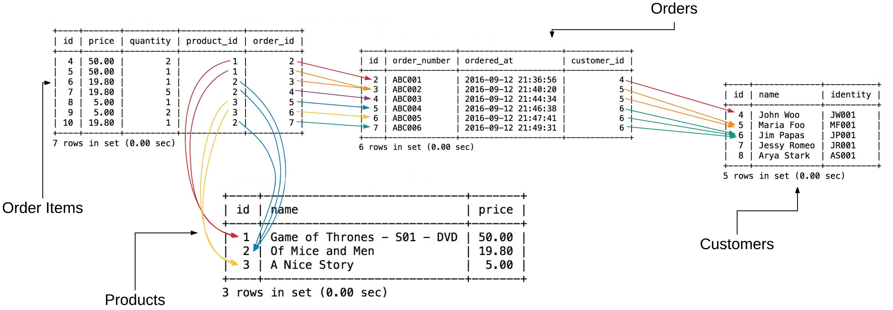
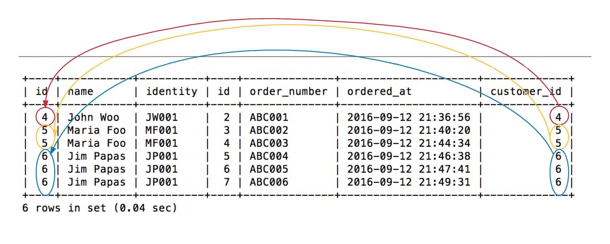
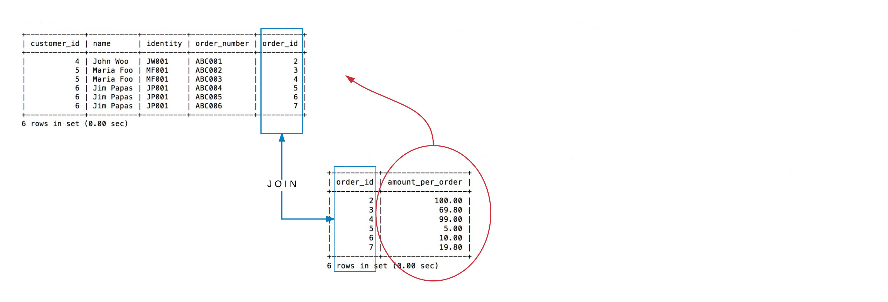
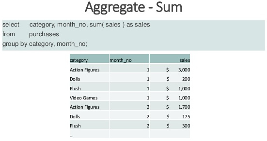

In previous chapters we have designed our primitive customer relationship management system. In this chapter
we are setting up our data as follows:

and we are trying to query and get useful information out of it.
 
We are going to learn how to combine data from two or more different tables:
 

Combining of information will not be restricted to information coming from tables only, but it will be done using sub-queries too:

We will also learn about the aggregate function `sum()` and how it can be used to get useful insights into out data.

