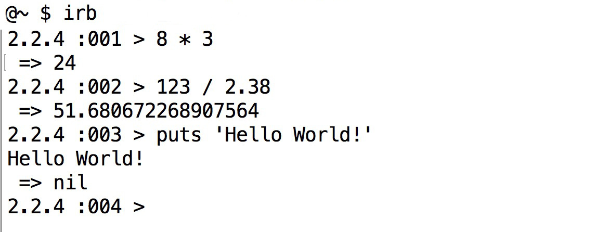
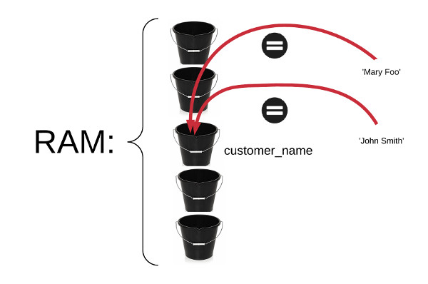

This chapter is about Interactive Ruby, the tool that will allow you to execute Ruby commands, one-by-one and 
get instant feedback.

We will then talk about variables.

Their naming convention:

And how we can write simple and complex formulas like this:

using the mathematics operators.
