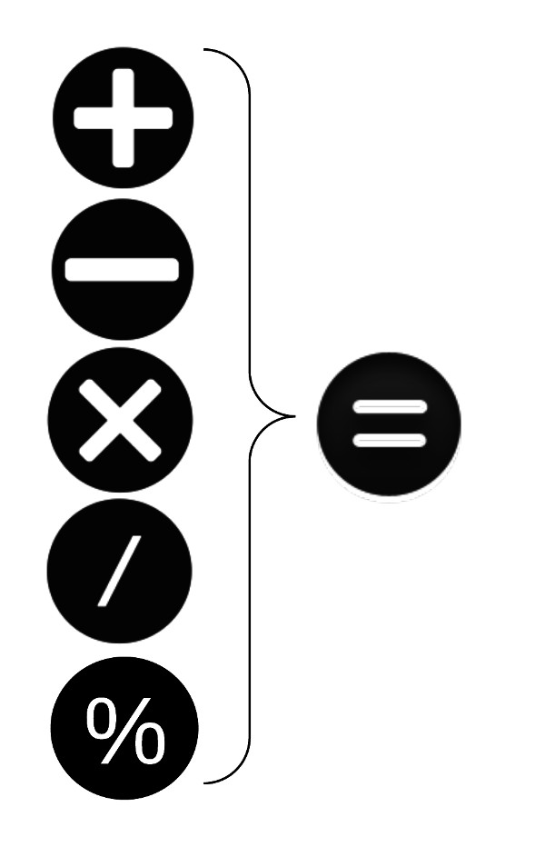
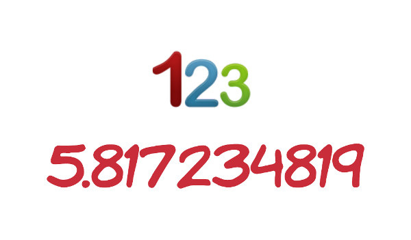

Ruby allows you to combine the assignment with mathematics operators. 

Also, you need to understand the differences between integers and decimals or float numbers.

Finally, after having learnt about variables, you need to understand what a constant is.

