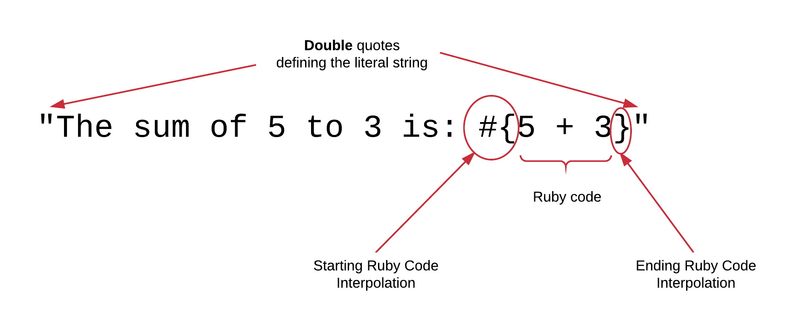
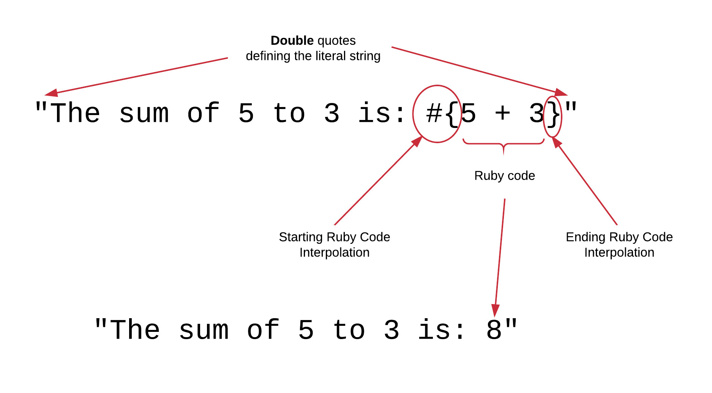

## Strings

Let's start our operating system terminal. From there, let's start the interactive Ruby console.

``` bash
$ irb
2.2.3 :001 > 
```

We are going to see what is a string and what actions we usually do with them.

A string is a sequence of characters. It can be literally given enclosing the characters inside single quotes. Try the following:

``` ruby
2.2.3 :001 > 'Hello World'
 => "Hello World" 
2.2.3 :002 > 
```

The above defines the string `'Hello World'`. The sequence of characters is enclosed in single quotes.

The strings can be assigned to variables, of course, like any other value of content. Try this:

``` irb
2.2.3 :002 > name = 'John'
 => "John" 
2.2.3 :003 > 
```

Now, the variable with name `name` is pointing to a memory bucket that holds the content `'John'`.

Another way you can literally define a string is by enclosing the sequence of characters inside double quotes.

Let's try that:

``` irb
2.2.3 :003 > last_name = "Smith"
 => "Smith" 
2.2.3 :004 > 
```

Now, the variable with name `last_name` holds another string, the string `"Smith"`. 

## String and Ruby Code Interpolation

Although you do have 2 options when defining a string literal, the single quotes or the double quotes, there is a 
difference between the 2. 

When you are using double quotes you can interpolate Ruby code as part of the character sequence. The interpolation is done by
enclosing the interpolated code inside 2 special character sequences. The first, opening character sequence is the `#{`. 
The second, enclosing character sequence is only the character `}`. 



Try the following on irb:

``` irb
2.2.3 :004 > "The sum of 5 to 3 is: #{5 + 3}"
 => "The sum of 5 to 3 is: 8" 
2.2.3 :005 > 
```

As you can see, the returned string is `"The sum of 5 to 3 is: 8"`. The Ruby code inside the `#{ ... }` block, has been evaluated, first,
and its result has been used to replace the actual Ruby code interpolation block inside the original string. The result was `8` and this is
what is used to actually deliver the final string.



What you can do with double quotes, the Ruby interpolation that we saw above, is not possible when you enclose the character sequence
into single quotes. Try this:

``` irb
2.2.3 :005 > 'The sum of 5 to 3 is: #{5 + 3}'
 => "The sum of 5 to 3 is: \#{5 + 3}" 
2.2.3 :006 > 
```

As you can see, the result is `"The sum of 5 to 3 is: \#{5 + 3}"`. The Ruby code was not evaluated. In fact, the `#` character was 
escaped too with `\` character. (We will talk about escaping later on).
 
Inside a single character sequence, you can have as many interpolated Ruby code blocks as you like. There is no restriction. And you 
can have any Ruby code inside the block. No restriction either. The Ruby blocks are evaluated first and their results replace the
actual blocks (after they are first converted to a string representation themselves).

Let's try this:

``` ruby
2.2.3 :006 > name = 'John'
 => "John" 
2.2.3 :007 > last_name = 'Smith'
 => "Smith" 
2.2.3 :008 > "Hello Mr. #{name} #{last_name}"
 => "Hello Mr. John Smith" 
2.2.3 :009 > 
```

On line `008` we are using 2 blocks of Ruby code. They are simple invocations to the contents of 2 variables. Not complex Ruby expression.
But, you can see how the result is being finally used to replace the blocks in the resulting string.

This tool is very useful when we build the content of a string dynamically, i.e. when the string content depends on the content of other
variables or on the calculaton of a complex Ruby code.

Generally, though, we would like to keep the blocks with as simple Ruby code as possible. This is a good practice in order to
ease readability of the string and the debugging of the application.

Try, for example, the following:

``` ruby
2.2.3 :009 > a = 2
 => 2 
2.2.3 :010 > x = 4
 => 4 
2.2.3 :011 > b = 1
 => 1 
2.2.3 :012 > c = 5
 => 5 
2.2.3 :013 > polynomial = a * x ** 2 + b * x + c
 => 41 
2.2.3 :014 > "The polynomial a * x^2 + b * x + c = #{polynomial}"
 => "The polynomial a * x^2 + b * x + c = 41" 
2.2.3 :015 > 
```
You can see, that on line `014` we have an interpolated block of Ruby code. It only invokes the content of the variable p. This is much easier to
read and debug than the following:

``` read
2.2.3 :015 > "The polynomial a * x^2 + b * x + c = #{a * x ** 2 + b * x + c}"
 => "The polynomial a * x^2 + b * x + c = 41" 
```

The interpolated string on line `015` becomes long and difficult to read. 

Another thing that you need to be aware of about interpolation is that it is almost similar to adding two strings together. Try this:

``` ruby
2.2.3 :016 > "Hello Mr. " + name + " " + last_name
 => "Hello Mr. John Smith" 
2.2.3 :017 > 
```
You can see that the line `016` gave the same result like the `"Hello Mr. #{name} #{last_name}"`. However, we do not prefer the `+` operator
to build strings. It is error prone, especially if either of the operands, left or right, of the `+` is nil.

``` ruby
2.2.3 :017 > " " + nil
TypeError: no implicit conversion of nil into String
        from (irb):17:in `+'
        ...
2.2.3 :018 > a = nil
 => nil 
2.2.3 :019 > "Hello " + a
TypeError: no implicit conversion of nil into String
        from (irb):19:in `+'
        ...
2.2.3 :020 > 
```

The interpolation is much more forgiving:

``` ruby
2.2.3 :020 > " #{nil}"
 => " " 
2.2.3 :021 > "Hello #{a}"
 => "Hello " 
2.2.3 :022 > 
```

You can see that the `nil` Ruby expression is automatically converted to an empty string. Does not give an error when used
in interpolation.

Generally, don't use the `+` operator to build up strings. Use interpolation. It is less error prone and easier to read.

Let's see another example of Ruby code interpolation. Try the following:

``` ruby
2.2.3 :023 > "Now the date and time is: #{Time.now}"
 => "Now the date and time is: 2016-10-08 22:04:10 +0300" 
2.2.3 :024 > 
```

The Ruby code inside the `#{..}` block is returning the current date and time: `2016-10-08 22:04:10 +0300`. This is what 
is replaced with. And the final string is: `"Now the date and time is: 2016-10-08 22:04:10 +0300"`.

## Other Differences between `"` and `'`.

The fact that you can use Ruby code inside double quoted strings, using the `#{ ... }` blocks, is one of the main differences
between single-quote enclosed strings and double-quote enclosed strings. There are some other differences too.

The single-quote enclosed strings are being used as they are. Verbatim. Nothing is replaced. On the other hand, inside
double quote enclosed strings we can use escape characters, i.e. characters that are represented with two (or more) sequence
of characters, prefixed with the backslash character `\`. 

For example, the new line character is represented with `\n`. Try the following command:

``` ruby
2.2.3 :025 > puts "This is a two lines string.\nThis is the second line."
This is a two lines string.
This is the second line.
 => nil 
2.2.3 :026 > 
```

The string `"This is a two lines string.\nThis is the second line."` is printed, indeed, in 2 lines. The `\n` character
denotes when the first line ends and the second one starts. Try the same with single quoted string:

``` ruby
2.2.3 :026 > puts 'This is a two lines string.\nThis is the second line'
This is a two lines string.\nThis is the second line
 => nil 
2.2.3 :027 > 
```

The `\n` character is not interpreted as new line character.

While you will be learning Ruby, you will encounter other cases in which you might want to escape a character in order
to actually use a special one. We will also see some cases in our Ruby lessons here.

## Including `"` inside a Double Quote String

How can we include a `"` character inside a double quote string? Try the following:

``` ruby
2.2.3 :027 > puts "Ruby allows to have Ruby code inside strings that are enclosed by the character \". Ruby code interpolated blocks are not take into account if string is enclosed in '."
Ruby allows to have Ruby code inside strings that are enclosed by the character ". Ruby code interpolated blocks are not take into account if string is enclosed in '.
 => nil 
2.2.3 :028 > 
```

When you enclose your string in double quotes, in order for you to include a double quote as part of the actual string payload, you need to 
escape it, i.e. you need to prefix it with the `\` character. If you don't do that, then Ruby will think that this double quote is the end of the
string literal and will raise an error.

## Including `'` inside a Single Quoted String

Similarly, you can escape a single quote if you want to include it inside a single quoted string.

``` ruby
2.2.3 :028 > puts 'This is a single quote: \'. This is a double quote: "'
This is a single quote: '. This is a double quote: "
 => nil 
2.2.3 :029 > 
```

In other words,
 
1. when you have a single-quoted string, you can include single quotes only if you escape them with `\`, but double quotes can be included without problem.
2. When you have a double-quoted string, you can include double quotes only if you escape them with `\`, but single quotes can be included without problem.

## Recommendation To Use Single Quotes

Since the functionality of the double quotes enclosed strings is a superset of those of single quotes enclosed strings, many 
prefer to be using double quotes when they are not really needed. Try this:

``` irb
2.2.3 :001 > customer = 'John Woo'
 => "John Woo" 
2.2.3 :002 > customer
 => "John Woo" 
2.2.3 :003 > customer = "John Woo"
 => "John Woo" 
2.2.3 :004 > customer
 => "John Woo" 
2.2.3 :005 > 
```

But `customer = 'John Woo'` and `customer = "John Woo"` have the same effect. They assign the content `"John Woo"` to the variable with
name `customer`. So, there is no difference, with regards to the result these two commands bring. However, we prefer that we use
the double quotes only if they are really needed. Otherwise, they incur a small performance penalty without reason. Ruby needs to 
scan the string for escape characters and Ruby code interpolated blocks. If the string is enclosed in single quotes, this scanning does
not take place. The literal string is used verbatim. 

Hence, in order to avoid this very small performance penalty that double quotes incur, when you do not need them, don't use them.

## Popular String Functions/Methods

Let's now see some popular string functions, which are actually called *methods* in object-oriented programming.

Let's start with a variable:

``` irb
2.2.3 :005 > customer = 'John Woo'
 => "John Woo" 
2.2.3 :006 > 
```

### `.length`

It returns the number of characters in the string. Try that:

``` irb
2.2.3 :006 > customer.length
 => 8 
2.2.3 :007 > 
```

The string `"John Woo"` has 8 characters. Note that all characters between the starting quote and the ending quote are being counted. Even
the blanks. 

> *Hint:* We can call these methods on literal string values too. Not only on variables. Try this: 
```
2.2.3 :007 > 'John Woo'.length
 => 8 
2.2.3 :008 > 
```

> *Hint:* In Ruby, everything is an Object and in order to call a method (i.e. a function definition attached to an
object class) we need to use a `.` after the object and then attach the name of the method, possibly passing some run-time
arguments too. We will talk about that in the object-oriented part of Ruby.

### `.reverse`

It reverses the order of the characters in a given string. Try that:

``` ruby
2.2.3 :008 > customer.reverse
 => "ooW nhoJ" 
2.2.3 :009 > 
```
### `.downcase`

It makes all characters in a string to be lower case.

``` ruby
2.2.3 :009 > customer.downcase
 => "john woo" 
2.2.3 :010 > 
```

### `.upcase`

It makes all characters in a string to be upper case.

``` ruby
2.2.3 :010 > customer.upcase
 => "JOHN WOO" 
2.2.3 :011 > 
```

### Changing the String Itself

The above methods, when called on a string variable, they do not actually change the variable content. As we say, they are
immutable methods. The actual, initial variable content is unchanged. It is only the result returned that is a version of the
original string compatible with the method that we have called. Try this:

``` irb
2.2.3 :011 > customer
 => "John Woo" 
2.2.3 :012 > customer.upcase
 => "JOHN WOO" 
2.2.3 :013 > customer
 => "John Woo" 
2.2.3 :014 > 
```

As it is proven by the above, the call on line `012` didn't change the actual content of the variable `customer`. I guess that
you know how to actually change the content of the variable. Don't you? You can use the assignment operator:

``` irb
2.2.3 :014 > customer = customer.upcase
 => "JOHN WOO" 
2.2.3 :015 > customer
 => "JOHN WOO" 
2.2.3 :016 > 
```
The above, assigns the new value back to the `customer` variable. Hence, the `customer` variable now has new content, which is
the result of the call of `.upcase` on line `014`.

Besides the technique of the assignment operator, most of the string methods have a version that is mutable, i.e. it changes
the content of the variable that they are called on. That version of the string method has the same name suffixed with the `!`
character, which we call `bang` character.

Let's try that:

``` ruby
2.2.3 :016 > customer = 'John Woo'
 => "John Woo" 
2.2.3 :017 > customer.upcase!
 => "JOHN WOO" 
2.2.3 :018 > customer
 => "JOHN WOO" 
2.2.3 :019 > 
```

On line `017` we have called `.upcase!` instead of `.upcase`. The `customer.upcase!` is equivalent to `customer = customer.upcase`.

Same goes for `.downcase!`, `.reverse!` and many other string methods.

### `.empty?`

Let's now check whether a string variable has an empty content, i.e. length of 0.

``` ruby
2.2.3 :019 > empty_string = ''
 => "" 
2.2.3 :020 > empty_string.empty?
 => true 
2.2.3 :021 > customer
 => "JOHN WOO" 
2.2.3 :022 > customer.empty?
 => false 
2.2.3 :023 > 
```

The `.empty?` returns `true` or `false`. If the string it is called on has length equal to 0, then it returns `true`. Else it returns `false`.

> *Information:* In Ruby, we prefer to name the methods that return either `true` or `false`, i.e. the boolean methods,
with a name that is suffixed with the character `?`.

## Initializing A String Variable

Suppose now that we want to initialize a string variable with 50 dashes for example. We can definitely do this:

``` ruby
2.2.3 :023 > my_string = '--------------------------------------------------'
 => "--------------------------------------------------" 
2.2.3 :024 > my_string.length
 => 50 
2.2.3 :025 > 
```
But this is very verbose. And it becomes impractical when the initial number of characters is very long.

What you can do is the following:

``` ruby
2.2.3 :025 > my_string = '-' * 50
 => "--------------------------------------------------" 
2.2.3 :026 > my_string.length
 => 50 
2.2.3 :027 > 
```

In other words, you can just give the character and then multiply that with the number of occurrences this needs to be
in the initial string content.

Note that initialization can be done with longer than 1 character strings. Look at the following example:

``` ruby
2.2.3 :027 > my_string = 'I love Ruby. ' * 20
 => "I love Ruby. I love Ruby. I love Ruby. I love Ruby. I love Ruby. I love Ruby. I love Ruby. I love Ruby. I love Ruby. I love Ruby. I love Ruby. I love Ruby. I love Ruby. I love Ruby. I love Ruby. I love Ruby. I love Ruby. I love Ruby. I love Ruby. I love Ruby. " 
2.2.3 :028 > 
```

On the above example, the variable `my_string` is initialized with the `'I love Ruby. '` string 20 times.

> *Hint:* Do you see that I have added the extra space at the initializing string literal?
 
## Other Useful String Functions

### Element Reference - `[index]`

You can access a particular element/character of a string using the `[]` method. Usually, we give the position of the
character in the string. Note that positions are 0-based numbered. The first is indexed by 0, the second is indexed by 1 e.t.c.
Try this:

``` ruby
2.2.3 :028 > customer = 'John Woo'
 => "John Woo" 
2.2.3 :029 > customer[0]
 => "J" 
2.2.3 :030 > customer[1]
 => "o" 
2.2.3 :031 > customer[-1]
 => "o" 
2.2.3 :032 > customer[-2]
 => "o" 
2.2.3 :033 > customer[-3]
 => "W" 
2.2.3 :034 > 
```

As you can see, if the integer number given is negative, then it returns the corresponding element indexing from the end of the
string towards the beginning. So, `0` is the first character, but `-1` is the last one, `-2` is the second-to-last e.t.c.

### Element Reference - `[index, length]`

The `[]` has another version too, in which we not only specify the `index` of the character that we want to retrieve, but also
the number of characters to retrieve. Try this:

``` ruby
2.2.3 :035 > customer
 => "John Woo" 
2.2.3 :036 > customer[3, 4]
 => "n Wo" 
2.2.3 :037 > 
```

As you can see, the `customer[3, 4]` returns the 4 characters starting from the character at index position `3`.

Another example, brings the last 3 characters of the string:

``` ruby
2.2.3 :040 > customer[-3, 3]
 => "Woo" 
2.2.3 :041 > 
```

So, the technique `[index, length]` is the one that we use to get a substring of a string.

### Element Reference - `[start_index..end_index]`

Another technique that you can use to get a substring of a string is the range technique. Specify the start and the end indexes,
separated by `..`, which is the range operator.

Example:

``` ruby
2.2.3 :041 > customer
 => "John Woo" 
2.2.3 :042 > customer[2..5]
 => "hn W" 
2.2.3 :043 > 
```

Of course, the range can be specified with negative integers. Only that those indexes are relative to the end of the string. Try this:

``` ruby
2.2.3 :044 > customer
 => "John Woo" 
2.2.3 :045 > customer[-5..-2]
 => "n Wo" 
2.2.3 :046 > 
```

## ASCII and non-ASCII Characters - Unicode & UTF

We will now talk a little bit about the ASCII and the non-ASCII characters. 

This discussion is also related to the actual number of bytes used to store the representation of a string into RAM. 

Usually, one character needs 1 byte of memory to be stored. Each character has a specific 8-bit (1-byte) representation when
stored in RAM. Since 1 byte can store values from 0 up to 2<sup>8</sup>-1, you understand that the maximum number of characters
that can be represented with 1 byte is 2<sup>8</sup>, i.e. 256 characters.

Let's take for example the Latin character `C`. Its representation in 1 byte value is the following:
``` ruby
0100 0011
```
This number equals to 67. (Use [this one here](http://www.binaryhexconverter.com/decimal-to-binary-converter) to verify or do the maths manually).

Look at the [ASCII Table here](http://www.ascii-code.com/). This page breaks the ASCII Table to more than 1 table for easier reading.
But, it lists all the characters from the position and value 0 up to the position and value 255. You will see that 
the value `67` (look at the first column `DEC`) corresponds to the character `C`. 

### ASCII and Extended ASCII

The characters with values from 0 up to 127, the fist 128 characters, are considered to be the standard ASCII characters.
You will find them with these values and these representations on all computer systems. In other words, the value `0100 0011` (or 67)
will always be the latin character `C`. 

The characters with values from 128 up to 255, the last 128 characters, differ from system to system and from current keyboard setting.
These are used to hold language specific characters and this part of the table is called *Extended ASCII* table.

On the [table that we link here](http://www.binaryhexconverter.com/decimal-to-binary-converter), the 128 characters are the ones
defined in the ISO 8859-1 (also called ISO Latin-1) standard. Let's take for example the position `201`. This is the character
&#201;.

### Unicode and UTF-8

After extending the initial 128 characters to 256, later on, we realized that 256 characters are still not enough to represent all the
possible characters for all the known languages. This is where we created the [Unicode standard](http://unicode.org/standard/standard.html).
The point here is that some of the characters require more than 1 byte to be represented. For example, this character &#1353; is the Armenian
Capital Letter Cha and its Unicode number is `U+0549`. This occupies 2 bytes in memory.

> *Information:* A very good [Unicode table reference can be found here](http://unicode-table.com/en/). If you click on a box, you will
get information about the Unicode number and the HTML Entity code too. 

Unicode assigns a code point to each one of the available characters that need to be represented. Currently more than 128 thousand characters.
But, the code points need an actual encoding to bits and bytes. 

#### UTF-8

1. Encodes with 1 byte all Standard ASCII characters. Hence it does not differ to ASCII for these characters.
2. Encodes with 2 bytes all language characters for Arabic, Hebrew, most European scripts (most notably excluding Georgian)
3. Encodes with 3 bytes the characters and symbols of the BMP ([Basic Multilingual Plane](https://en.wikipedia.org/wiki/Plane_%28Unicode%29#Basic_Multilingual_Plane))
4. Encodes with 4 bytes all unicode characters

There is another encoding scheme, UTF-16, but UTF-8 is ubiquitous in Web development and this is what Ruby supports too.
So, we will stick with that. All you have to know, for the time being, is that not all characters occupy 1 byte of memory.

Let's be a little bit more practical.

### `.chr` and `.chr(Encoding::UTF_8)`

The `.chr` method will take an integer and convert it to its equivalent ASCII character. Let's try that:

``` irb
2.2.3 :072 > 68.chr
 => "D" 
2.2.3 :073 > 
```
The ASCII table has the character `D` with value `68`. Hence, the `68.chr` converts it to the string `"D"`.

If you want to convert values from the extended ASCII table or higher, you need to tell the encoding to be UTF-8.

Try this:

``` irb
2.2.3 :074 > 200.chr(Encoding::UTF_8)
 => "È" 
2.2.3 :075 > 
```

As you can see, the value 200 of the extended ASCII table is converted to the character &#200;, with the help of
the `Encoding::UTF_8` argument to the `.chr()` method.

Now try the unicode decimal number that corresponds to the Armenian capital letter Cha (that we saw earlier):

``` ruby
2.2.3 :082 > 1353.chr(Encoding::UTF_8)
 => "Չ" 
2.2.3 :083 > 
```

You can see how nicely it is displayed as the returned value.

If you don't know the decimal number, you can use the unicode code point as follows:

``` ruby
2.2.3 :083 > "\u0549"
 => "Չ" 
2.2.3 :084 > 
```

The unicode code points are used inside double quote enclosed strings and are prefixed with the escaped `u` character (i.e. `\u`).

This is a longer word in Armenian and it means *Good Morning*:

``` ruby
2.2.3 :086 > "\u0532\u0561\u0580\u056b \u056c\u0578\u0582\u0575\u057d"
 => "Բարի լույս" 
2.2.3 :087 > 
```

[This is a nice site](https://www.branah.com/unicode-converter) that can convert any sequence of characters to their unicode code points string representation.

### `.ascii_only?` 

The `.ascii_only?` method tells you whether a string contains only ASCII characters or not. Returns `true` if it contains
only ASCII characters. It returns `false` if it does not.

Let's try this:

``` ruby
2.2.3 :052 > 'Peter'.ascii_only?
 => true 
2.2.3 :053 > 
```

Whereas if we try this:

``` irb
2.2.3 :068 > utf8_string = 200.chr(Encoding::UTF_8)
 => "È" 
2.2.3 :069 > utf8_string.ascii_only?
 => false 
2.2.3 :070 > 
```

The `200.chr(Encoding::UTF_8)` stores the &#200; character inside the variable `utf8_string`. If you ask for `.ascii_only?` it will return `false`,
because the character &#200; does not belong to ASCII 127 characters. It is an extended ASCII character.

Let's try also the Armenian *Good Morning* that we saw earlier:

``` irb
2.2.3 :088 > "Բարի լույս".ascii_only?
 => false 
2.2.3 :089 > 
```

### `.length` vs `.bytesize`

Now that we know that not all characters occupy 1 byte of memory space, we can understand the difference between `.length` and `.bytesize`.

Let's try the following example:

``` ruby
2.2.3 :001 > 'John Smith'.length
 => 10 
2.2.3 :002 > 'John Smith'.bytesize
 => 10 
2.2.3 :003 > "\u0532\u0561\u0580\u056b \u056c\u0578\u0582\u0575\u057d".length
 => 10 
2.2.3 :004 > "\u0532\u0561\u0580\u056b \u056c\u0578\u0582\u0575\u057d".bytesize
 => 19 
2.2.3 :005 > 
```

The `.bytesize` returns the number of bytes occupied by a string. This is equal to the `.length` result, i.e. the number
of characters, but only if the string contains characters in the ASCII 0 till 127 range. Other than that, the bytesize might
return a number bigger to 1 byte per character. Like in the example above for the Armenian word *Good Morning*.

### `.capitalize`

Returns a string on which the first letter is uppercase. Try that:

``` ruby
2.2.3 :008 > 'hello world!'.capitalize
 => "Hello world!" 
2.2.3 :009 > 
```

### `.codepoints`

This returns an array of the integer values that correspond to each character of a string. We will talk about arrays later on,
but this method is useful to be referenced here, since we have talked about the representation of characters as integers and bits.

Try this:

``` irb
2.2.3 :015 > 'John Smith'.codepoints
 => [74, 111, 104, 110, 32, 83, 109, 105, 116, 104] 
2.2.3 :016 > 74.chr
 => "J" 
2.2.3 :017 > 111.chr
 => "o" 
2.2.3 :018 > 104.chr
 => "h" 
2.2.3 :019 > 
```

As you can see, takes each one of the characters in the string and converts it to its equivalent integer. Let's try with the
Armenian *Good Morning* string:

``` ruby
2.2.3 :021 > "Բարի լույս".codepoints
 => [1330, 1377, 1408, 1387, 32, 1388, 1400, 1410, 1397, 1405] 
2.2.3 :022 > "\u0532\u0561\u0580\u056b \u056c\u0578\u0582\u0575\u057d".codepoints
 => [1330, 1377, 1408, 1387, 32, 1388, 1400, 1410, 1397, 1405] 
2.2.3 :023 > 
```
The example above shows the call to `.codepoints` both on the Armenian literal string and on the string with unicode representation
of characters.

### `.delete()`

Deletes the characters that are given as input argument. See this example:

``` ruby
2.2.3 :023 > ' John  S m ith '.delete(' ')
 => "JohnSmith" 
2.2.3 :024 > 'This is a nice World!'.delete('ao')
 => "This is  nice Wrld!" 
2.2.3 :025 > 
```

### `.end_with?()`

Returns `true` if your string ends with any of the suffixes given as arguments. Otherwise, it returns `false`. Try this one:

``` irb
2.2.3 :025 > 'John Smith'.end_with?('th')
 => true 
2.2.3 :026 > 'John Smith'.end_with?('th', 'ab')
 => true 
2.2.3 :027 > 'John Smith'.end_with?('ab')
 => false 
2.2.3 :028 > 
```

### `.include?()`

Returns `true` if your string contains the string given as input argument. Otherwise, it returns `false`. Example:

``` irb
2.2.3 :028 > 'John Smith'.include?('ohn')
 => true 
2.2.3 :029 > 'John Smith'.include?('Panos')
 => false 
2.2.3 :030 > 
```

### `.index()` 

This is very useful function and returns the position index of the argument given inside your string. 

``` ruby
2.2.3 :030 > 'John Smith'.index('ohn')
 => 1 
2.2.3 :031 > 'John Smith'.index('S')
 => 5 
2.2.3 :032 > 'John Smith'.index('Sith')
 => nil 
2.2.3 :033 > 
```

If the string given as argument does not exist inside your string, the method returns `nil`. 

### `.insert()`

Allows you to insert a string inside another. Try this:

``` ruby
2.2.3 :001 > a = 'World!'
 => "World!" 
2.2.3 :002 > a.insert(0, 'Hello ')
 => "Hello World!" 
2.2.3 :003 > a
 => "Hello World!" 
2.2.3 :004 > 
```

Command at line `002` inserted the string `'Hello '` at the index position `0` of the string stored in the variable `a`. 
As you can see, this is a mutable method. It modifies the destination string. 

Or Try this:

``` ruby
2.2.3 :004 > a = 'Heo'
 => "Heo" 
2.2.3 :005 > a.insert(2, 'll')
 => "Hello" 
2.2.3 :006 > 
```

It inserts the string `'ll'` at the index position `2`. The index position `2` at the initial value of `a`, is the last
letter `o`. So, `o` is shifted to the right and `ll` is added.

### `.ljust()`

It is used to left justify a string on a specific width of characters. For example, if you have a word with `'ball'` and
you wish to print it left justified on a width of 20 characters, you would do this:

``` ruby
2.2.3 :006 > 'ball'.ljust(20)
 => "ball                " 
2.2.3 :007 > 
```

This is a useful function because it will allow you to print words in columns of specific width: For example:

``` ruby
2.2.3 :007 > "#{'First Name'.ljust(20)}#{'Last Name'.ljust(20)}#{'Address'.ljust(20)}"
 => "First Name          Last Name           Address             " 
2.2.3 :008 > "#{'John'.ljust(20)}#{'Smith'.ljust(20)}#{'Oxford str'.ljust(20)}"
 => "John                Smith               Oxford str          " 
2.2.3 :009 > "#{'Mary'.ljust(20)}#{'Foo'.ljust(20)}#{"Regend's Park".ljust(20)}"
 => "Mary                Foo                 Regend's Park       " 
2.2.3 :010 > 
```

Or open a new file with name `customers.rb` and insert the following content:

``` ruby
puts "#{'First Name'.ljust(20)}#{'Last Name'.ljust(20)}#{'Address'.ljust(20)}"
puts "#{'John'.ljust(20)}#{'Smith'.ljust(20)}#{'Oxford str'.ljust(20)}"
puts "#{'Mary'.ljust(20)}#{'Foo'.ljust(20)}#{"Regend's Park".ljust(20)}"
```

Then run `ruby customers.rb` on your terminal. You will get a printed version of your customers, on a nice table, with
values left aligned on distinct columns.

``` bash
ruby customer.rb
First Name          Last Name           Address             
John                Smith               Oxford str          
Mary                Foo                 Regend's Park          
```

Note that `ljust()` method can take as a second, optional, argument, the padding character. Default is space, but it 
can be anything:

``` ruby
2.2.3 :002 > 'foo'.ljust(30, 's')
 => "foosssssssssssssssssssssssssss" 
2.2.3 :003 > 
```

### `.rjust()`

Works similar to `ljust()` but right justifies the string.

### `.strip()`

This method returns a copy of the original string with leading and trailing whitespace removed. Try this:

``` ruby
2.2.3 :006 > '     White spaces    will  be     removed     '.strip()
 => "White spaces    will  be     removed" 
2.2.3 :007 > 
```

As you can see, only the leading and trailing white spaces are removed.

### `.ord()`

It returns the integer ordinal of 1 character string.

``` ruby
2.2.3 :007 > 'a'.ord
 => 97 
2.2.3 :008 >
```

This corresponds to its ASCII integer position if the given character is an ASCII one. It also corresponds to the
non-ASCII position of the extended ASCII table. For example:

``` ruby
2.2.3 :009 > "È".ord
 => 200 
2.2.3 :010 > 
```

Also, it returns the unicode codepoint integer if the character is UTF-8 encoded:

``` ruby
2.2.3 :010 > "Չ".ord
 => 1353 
2.2.3 :011 > 
```

Remember that we saw earlier:

``` ruby
2.2.3 :082 > 1353.chr(Encoding::UTF_8)
 => "Չ" 
2.2.3 :083 > 
```

### `.start_with?()`

It returns `true` if the string starts with any of the prefixes given. Try this:

``` ruby
2.2.3 :011 > 'John Smith'.start_with?('J')
 => true 
2.2.3 :012 > 'John Smith'.start_with?('S')
 => false 
2.2.3 :013 > 'John Smith'.start_with?('S', 'Jo')
 => true 
2.2.3 :014 > 
```

The first command checks whether the string starts with `J`. It returns `true` because `'John Smith'` starts with `J`.
The second command checks whether the string starts with `S`. It returns `false`. The third command checks whether the string
starts with either `S` or `Jo`. It returns `true` because it starts with `Jo`.
 
### `.tr()`

It returns a string that has its characters replaced according to the arguments given to `tr`. 

Example:

``` ruby
2.2.3 :014 > 'Hallo Wbrld!'.tr('ab', 'eo')
 => "Hello World!" 
2.2.3 :015 > 
```

The command `014` above tells Ruby to replace any `a` with `e` and any `b` with `o`. So, the first letter of the first argument,
if found, it is replaced with the first letter of the second argument. The second letter of the second argument, if found, it is
replaced with the second letter of the second argument. And so on. 

If the second argument has length which is less than the first argument, then the last letter of the second argument is used instead:

``` ruby
2.2.3 :017 > 'Hallo Wbrlc!'.tr('abc!', 'eod')
 => "Hello Worldd" 
2.2.3 :018 > 
```

If the first argument has length which is less than the second argument, then the extra second argument characters will not be used.

``` ruby
2.2.3 :018 > 'Hallo Wbrlc!'.tr('ab', 'eod')
 => "Hello Worlc!" 
2.2.3 :019 > 
```

The `.tr()` method is very useful if one wants to replace one character with another.

## Closing Note

We are going to learn many more string functions as we go along on our Ruby journey. Meanwhile, you can have a look at the [String Reference](https://ruby-doc.org/core-2.3.1/String.html)
on the Ruby language pages.
 
If you want, you can also watch the following video that describes the content of this chapter using some hands-on exercises inside Linux/Debian environment.


<div id="media-title-video-tooltips-demo.mp4-Ruby: Text and Strings">Ruby: Text and Strings</div>
<a href="https://player.vimeo.com/video/194503465"></a>
