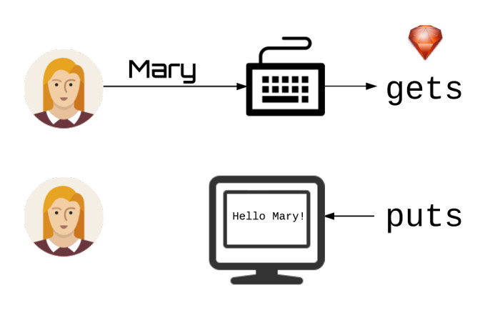

Ruby offers some very standard methods to get input from the user and send back output to them. This is what this
chapter is about. You will create a console program that will ask user some questions and, then, will print back
to user display some information.
