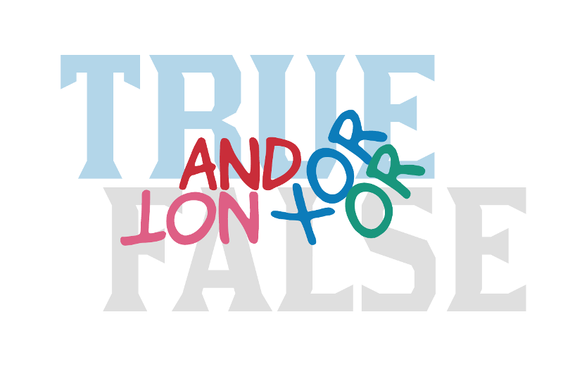

[George Boole](https://en.wikipedia.org/wiki/George_Boole) was the mathematician that set the foundation for the boolean logic. In this chapter
we learn about boolean operators and operands and how useful they are in order to represent that something is true or false. Ruby, as all programming
languages, has a robust set of boolean operators that will allow you to define any boolean expression that you may need. We are going to learn
how Ruby represents boolean operators and how you can construct Ruby boolean expressions.
