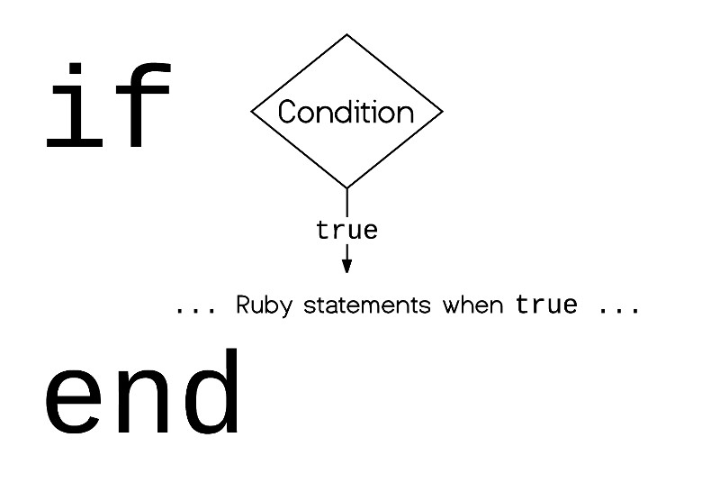
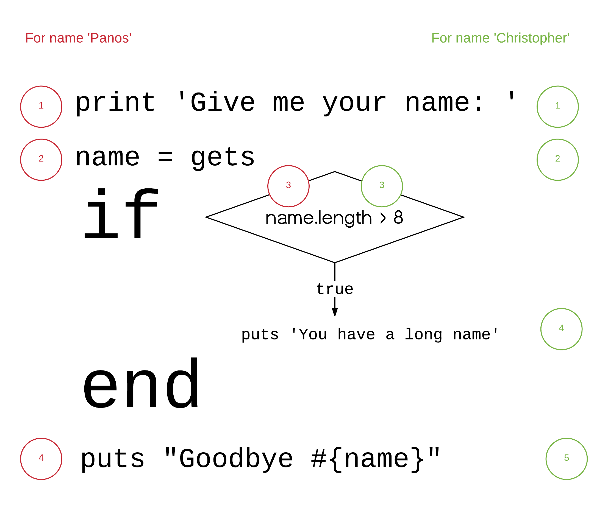
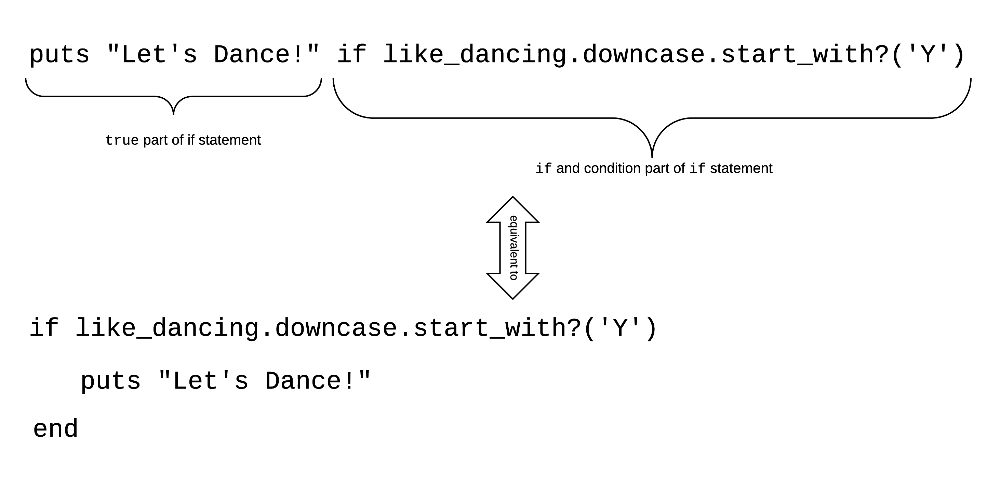
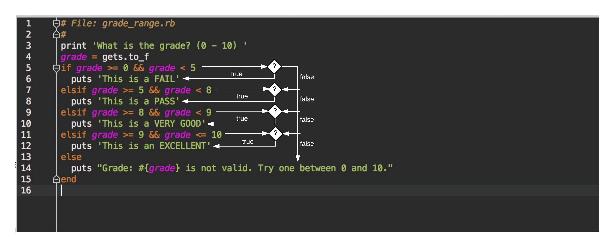
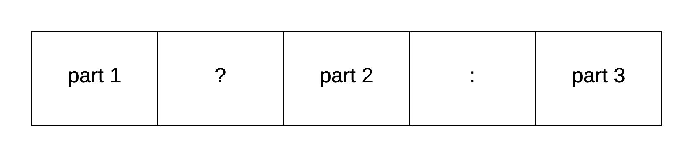
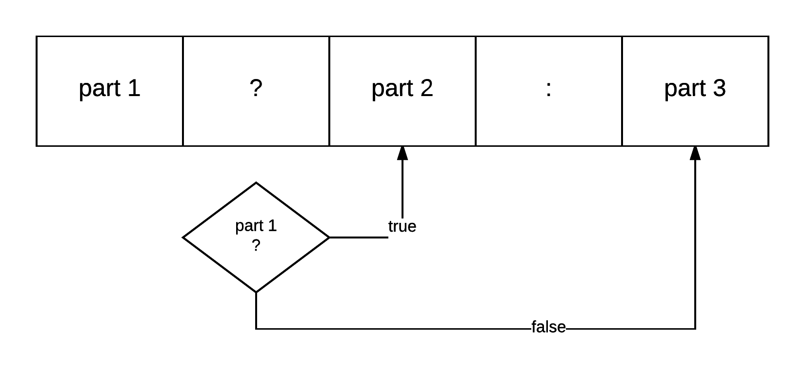
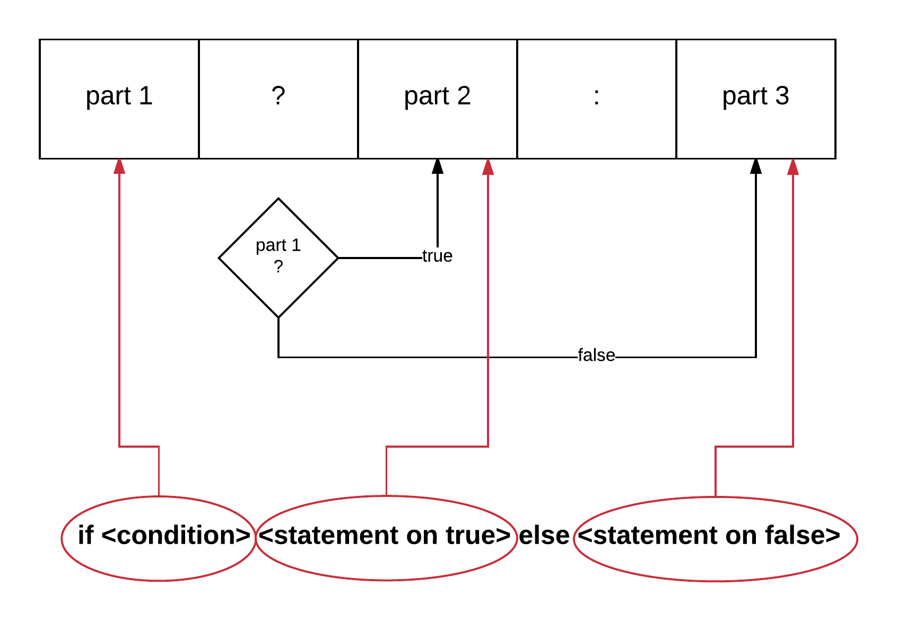

## Comparison and Logical Operators

Let's start on our operating system terminal. Invoke the `irb`, the Interactive Ruby Console.

``` bash
$ irb
2.2.3 :001 > 
```

On this Ruby shell, we are going to practice comparison and logical operators.

### `==` - equals to

The first operator that we are going to learn is the *equals* operator, which is symbolized with double equals symbol: `==`.
It is used to compare the left and right hand side of it. If they are equal, it returns `true`. If they are not equal
it returns `false`.

Try this:

``` ruby
2.2.3 :001 > 1 == 1
 => true 
2.2.3 :002 > 
```

The above returns `true` because the number `1` is equal to the number `1`. Obviously. 

Try this:

``` ruby
2.2.3 :002 > 1 == 2
 => false 
2.2.3 :003 > 
```

The above returns `false` because `1` is not equal to `2`. 

### `!=` - does not equal to

This operator `!=` compares the operands and returns `true` if the two operands are not equal. It returns `false`
when they are equal. So, it is the negation of the `==` operator.

Try this:

``` ruby
2.2.3 :003 > 1 != 2
 => true 
2.2.3 :004 > 
```

The above returns `true` because `1` is not equal to `2`.

Try this:

``` ruby
2.2.3 :004 > 1 != 1
 => false 
2.2.3 :005 > 
```

The above returns `false` because `1` is equal to `1`.

### `>` - greater than

This operator returns true if the left operand is greater than the right operand.

Try this:

``` ruby
2.2.3 :005 > 2 > 3
 => false 
2.2.3 :006 > 
```

Returns `false` because the `2` is not greater than `3`.

Try this:

``` ruby
2.2.3 :006 > 4 > 3
 => true 
2.2.3 :007 > 
```

The above returns `true` because `4` is greater than `3`.

### `<` - less than

This operator returns `true` when the left operand is less than the right operand.

Try this:

``` ruby
2.2.3 :007 > 2 < 3
 => true 
2.2.3 :008 > 
```

The above returns `true` because `2` is less than `3`.

Whereas:

``` ruby
2.2.3 :008 > 2 < 2
 => false 
2.2.3 :009 > 
```

returns `false`, because `2` is not less than itself.

### `>=` - greater than or equal to

This operator returns `true` when the left operand is greater than or equal to the right operand.

Try this:

``` ruby
2.2.3 :009 > 2 >= 2
 => true 
2.2.3 :010 > 
```

returns `true` because `2` is equal to `2`, and hence is also greater than or equal to `2`.

And this:

``` ruby
2.2.3 :010 > 2 >= 1
 => true 
2.2.3 :011 >
```

is also `true` because `2` is greater than `1`.

Where as:

``` ruby
2.2.3 :011 > 2 >= 3
 => false 
2.2.3 :012 > 
```

returns `false` because `2` is not greater than or equal to `3`. 

### `<=` - less than or equal to

This returns `true` if the left side operand is less than or equal to the right side operand.

Try this:

``` ruby
2.2.3 :012 > 4 <= 5
 => true 
2.2.3 :013 > 
```

It returns `true` because `4` is less than or equal to `5`.

## Program Control Flow

Let's now exit `irb` and go to your IDE environment, RubyMine. We will write some Ruby programs in order to understand
what programming constructs we have at our disposal in order to control the flow of a program.

### `if` statement

Let's create a new Ruby file inside RubyMine, with the name `control1.rb` and the following content:

``` ruby
 1. # File control1.rb
 2. #
 3. # Learn about if statement
 4. a = 2
 5. b = 3
 6. if a < b
 7.   puts 'a is less than b'
 8. else
 9.   puts 'a is not less than b'
10. end
```

> *Note:* The line numbers, of course, are not part of the program source code. Don't copy/paste as it is &#128512; you
need to type the program yourself. This is they way you should be practicing.

If you run the above program you will get this:

``` bash
$ ruby control1.rb
a is less than b
$
```

The new stuff for you is the `if` statement which starts on line 6 and ends on line 10. It is actually an `if...else...end` block.

This block has a block of Ruby statements that are executed when the condition is `true`, and another block of Ruby statements that
are executed when the condition is `false`.


The condition on our example is `a < b` and sits on the right of the `if` keyword. The result of its evaluation by the Ruby interpreter is `true`.
For that reason, the command `puts 'a is less than b'` is being executed.

### `else` is not mandatory

Please, not that `else` is not mandatory. We can write the `if` without an `else` block. In that case, if the condition is `false`, then
no Ruby statements are executed.



Let's try the following program (file `long_name.rb`):

``` ruby
1. # File: long_name.rb
2. #
3. print 'Give me your name: '
4. name = gets.chomp
5. if name.length > 8
6.   puts 'You have a long name'
7. end
8. puts "Goodbye #{name}!"
```
 
If you run the above program, it will prompt you to give a name. If the name has more than 8 characters, then it will print the
message `You have a long name`. If the name does not have more than 8 characters, i.e. it has less than or equal to 8, then
it will not print the message. Finally, the message `Goodbye`, together with the name given, will be printed at the end and regardless
of the length of the name.

This is an execution instance of this program, where we give as name the name `Panos`:

``` bash
$ ruby long_name.rb
Give me your name: Panos
Goodbye Panos!
$
```

And this is an execution instance of this program, where we give as name the name `Christopher`:

``` bash
$ ruby long_name.rb
Give me your name: Christopher
You have a long name
Goodbye Christopher!
$
```

As you can see, the message `You have a long name` has only been printed on the second run, where the name given was `Christopher`.



The above picture shows which commands are executed for each one of the running instances of this program.

### `if` Block Parts With Multiple Ruby Statements

It may not have been very clear, but the `if` block parts, the `true` part and the `else/false` part, they may contain more than 1 Ruby statement.
They are not limited to just 1. 

Let's write the following example of Ruby code inside the file `game_only_for_adults.rb`

``` ruby
 1. # File: game_only_for_adults.rb
 2. #
 3. print 'Give me your age: '
 4. age = gets.to_i
 5. if age < 18
 6.   puts 'Sorry, but you need to be an adult (>= 18)'
 7.   puts 'Goodbye!'
 8. else
 9.   print 'Nice! Now please give me your name: '
10.   name = gets.chomp
11.   puts "Welcome to this poker game #{name}"
12.   puts 'Hope you will enjoy that!'
13. end
```

As you can see the `if...else...end` statement has multiple Ruby statements, both inside the `if/true` block and inside the `else/false` block. This program
asks the age of the user and if the age is less than 18, then it just prints 2 messages and exits. If the age is greater than or equal to 18, the program
asks the name of the user and welcomes them to the poker game.

This is an execution instance in which the age of the caller is 17:

``` bash
$ ruby game_only_for_adults.rb
Give me your age: 17
Sorry, but you need to be an adult (>= 18)
Goodbye!
$
```

This is an execution instance in which the age of the caller is 18:

``` bash
$ ruby game_only_for_adults.rb
Give me your age: 18
Nice! Now please give me your name: Panos
Welcome to this poker game Panos
Hope you will enjoy that!
$
```

### `if` Blocks With 1 Statement And Not Else Block

Sometimes, when the `if` statement

1. does not include an `else` block AND
2. has only 1 Ruby statement on the `if/true` block

we prefer to write the Ruby statement and the `if` with the condition on the same line. One liner as we call them.

Let's write another program (inside the `dancing.rb` file):

``` ruby
1. # File: dancing.rb
2. #
3. print 'Do you like dancing? (y/n) '
4. like_dancing = gets.chomp
5. puts "Let's Dance!" if like_dancing.downcase.start_with?('y')
```

On line 5, the `puts "Let's Dance!"` statement is executed under the condition that the answer given by the user
starts with the letter 'Y' or the letter 'y'. This is because it is accompanied by the 
```
if like_dancing.downcase.start_with?('y')
```

`if` condition.



The one line if statements are a shorthand for the 3 lines version, as you can see on the above picture.

If you run the program above and you give `No` as an answer, you will see this:

``` bash
$ ruby dancing.rb
Do you like dancing? (y/n) no
$
```

Nothing is printed after the answer.

But, if you answer `Yes`, then you will see this:

``` bash
Do you like dancing? (y/n) Yes
Let's Dance!
```

The `Let's Dance!` is only printed because we have answered `Yes`, which makes the condition `like_dancing.downcase.start_with?('y')` to be `true`.

> *Note:* If the line of code that incorporates this one liner `if` technique ends to be too long, then, sometimes we prefer to 
use the 3-lines version instead, in order to improve readability of the code.

### `elsif` - else if

Sometimes, an `if` and an `else` block is not enough. We may want to have multiple levels of different conditions to be checked. Let's see the
following example. 

Write the Ruby program inside the file with name `grade_range.rb`.

``` ruby
 1. # File: grade_range.rb
 2. #
 3. print 'What is the grade? (0 - 10) '
 4. grade = gets.to_f
 5. if grade >= 0 && grade < 5
 6.   puts 'This is a FAIL'
 7. elsif grade >= 5 && grade < 8
 8.   puts 'This is a PASS'
 9. elsif grade >= 8 && grade < 9
10.   puts 'This is a VERY GOOD'
11. elsif grade >= 9 && grade <= 10
12.   puts 'This is an EXCELLENT'
13. else
14.   puts "Grade: #{grade} is not valid. Try one between 0 and 10."
15. end
```

This program prints a message according to the range of the grade given as input. We are using the `elsif` keyword to differentiate one
if condition from the other. The while `if ... elsif ... elsif ... else ... end` block can be really long. There is no restriction.
Make it as long as you want, but keep it as easy to read as possible.

Try to run the program giving different grades when asked. You will see how the message displayed depends on the value you give. 

This is an example run with grade given equal to `9`:

``` ruby
What is the grade? (0 - 10) 9
This is an EXCELLENT
```



Ruby parser parses the `if` and `elsif` conditions from top to bottom. The first that matches wins. Its block gets executed. The rest are ignored. If there is an `else`
block (like on our example - remember, it is optional), then the Ruby statements inside the `else` block are executed if none of the previous conditions
matched.

### `if !` statements - prefer `unless`

Let's now see another technique that is very popular in Ruby. We will learn it by trying another example:

``` ruby
 1. # File: play_football.rg
 2. #
 3. print 'Before we play football, can I have your age please? '
 4. age = gets.to_i
 5. 
 6. if !(age < 80)
 7.   puts "You are too old! But, let's try, you may be good!"
 8. end
 9. 
10. puts "Let's start"
```

There is an `if !(age < 80)` condition there, on line 6. This makes sure that the 

```
puts "You are too old! But, let's try, you may be good!"
```
is being executed if the age is not less than 80.

Try the program by giving age 60, for example:

``` bash
$ ruby play_football.rb
Before we play football, can I have your age please? 60
Let's start
$
```

As you can see, the message `You are too old! But, let's try, you may be good!` is not printed.

Try the program by giving age 85, for example:

``` ruby
$ ruby play_football.rb
Before we play football, can I have your age please? 85
You are too old! But, let's try, you may be good!
Let's start
$
```
As you can see, now that we gave age 85, it prints the message `You are too old! But, let's try, you may be good!`. This is because age is not less than 80,
i.e. the condition `!(age < 80)` is `true`.

> *Information:* Do you still remember that `!` is the NOT boolean operator and negates the boolean value of its operand? If `(age < 80)` is `false`,
then `!(age < 80)` is `true` and vice-versa.

In Ruby, however, we are positive people and we don't like to use `if !<condition>`. For that reason, we have invented the keyword `unless`. Hence,
the `if !<condition>` is equivalent to `unless <condition>`. Nevertheless, `if !` in English is read like `unless`, i.e. `if not`.

Replace line 6 on the previous program with the `unless` version. Like this:

``` ruby
 1. # File: play_football.rg
 2. #
 3. print 'Before we play football, can I have your age please? '
 4. age = gets.to_i
 5. 
 6. unless (age < 80)
 7.   puts "You are too old! But, let's try, you may be good!"
 8. end
 9. 
10. puts "Let's start"
```
If you try to run the program with the same example ages, you will get the same results:

``` bash
$ ruby play_football.rb 
Before we play football, can I have your age please? 60
Let's start
$ ruby play_football.rb 
Before we play football, can I have your age please? 85
You are too old! But, let's try, you may be good!
Let's start
```

Also, in Ruby we prefer not to use parentheses when we do not need them. Although we did need them when in `if !(a < 80)`, in order to enforce the
operator of the `!` (not) to be the whole condition `a < 80` and not just the `a`, however, we don't need them here `unless a < 80`, since we do not
want to enforce any priority in the evaluation of the expression.

> *Information*: According to the [Ruby operator precedence](https://ruby-doc.org/core-2.2.0/doc/syntax/precedence_rdoc.html), 
the `!` has higher priority than the `<`. Hence, if we don't use parentheses here: `if !(a < 80)` what is negated would have been the `a` and not
the `a < 80`. In other words, `if ! a < 80` is equivalent to `if (!a) < 80` and not equivalent to `if !(a < 80)`.

Hence, the correct, with regards to Ruby code styling too, version of the program is:

``` ruby
 1. # File: play_football.rg
 2. #
 3. print 'Before we play football, can I have your age please? '
 4. age = gets.to_i
 5. 
 6. unless age < 80
 7.   puts "You are too old! But, let's try, you may be good!"
 8. end
 9. 
10. puts "Let's start"
```

And of course, we can still use one liner:

``` ruby
1. # File: play_football.rg
2. #
3. print 'Before we play football, can I have your age please? '
4. age = gets.to_i
5. 
6. puts "You are too old! But, let's try, you may be good!" unless age < 80
7. 
8. puts "Let's start"
```

### `case...when...end` statement

This is another control flow statement in Ruby. Let's see in which cases this might be helpful. A `case` statement
allows you to do, more or less, an `if ... elsif ... elsif ... else ... end` block but in a more easy to read manner,
especially if the `elsif` cases are many.

Let's try with an example. We will implement the grade range example that we did earlier, using, this time, the `case` statement.

``` ruby
 1. # File: grade_range_case_version.rb
 2. #
 3. print 'What is the grade? (0 - 10) '
 4. grade = gets.to_f
 5. case
 6.   when grade >= 0 && grade <5
 7.     puts 'This is a FAIL'
 8.   when grade >= 5 && grade < 8
 9.     puts 'This is a PASS'
10.   when grade >= 8 && grade < 9
11.     puts 'This is a VERY GOOD'
12.   when grade >=9 && grade <= 10
13.     puts 'This is an EXCELLENT'
14.   else
15.     puts "Grade: #{grade} is not valid. Try one between 0 and 10."
16. end
```

As you can see above, the `case` version is a block that starts with the `case` keyword and ends with the `end` keyword,
like the `if` statements do.

Each condition branch is now defined using the `when` keyword, rather than the `elsif` keyword. After the `when` keyword,
we give the condition definition. If the condition is true, then the corresponding set of Ruby statements, belonging to the
matching `when` are being executed.

The first condition that is matched, checking from top to bottom, stops the Ruby interpreter from checking the rest of the
conditions. It executes the Ruby statements for the `when` block that matched and finishes with the `case` block.

### Ternary Operator

This is another control flow operator that is very popular in many languages. It has three parts, the first 
separated from the second using the `?` symbol and the second separated from the third using the `:` symbol.



The first part is a conditional expression. This means that when evaluated it returns either `true` or `false`. The second part
is a Ruby statement that is executed if the first part condition returns `true`. The third part is a Ruby statement that is
executed if the first part condition returns `false`.



In other words, the ternary operator is a disguised `if <condition> <statement on true> else <statement on false>`. 



Let's try the following program. Save it to the file `maximum_number.rb`:

``` ruby
1. # File: maximum_number.rb
2. #
3. a = 2
4. b = 3
5. maximum = a > b ? a : b
6. puts "Maximum is: #{maximum}"
```

You can see the statement `a > b ? a : b` the result of which is assigned to `maximum`. Line 5, above, is equivalent to:

``` ruby
if a > b
  maximum = a
else
  maximum = b
end
```

or to this:

``` ruby
maximum = if a > b
  a
else
  b
end
```

In any case, you can see that the ternary operator comes in handy and gives us the ability to write less lines of code.

However, you need to be careful and avoid having too complex expressions inside the ternary operator. If you end up writing
complex expressions, then you better fall back to the classic `if ... else ... end` version, in order to improve readability
of your code.

## True and False Revisited

Before we close this session, we would like to expand a little bit more about what is `true` and what is `false` in Ruby.

This is the rule:

1. Only `nil` and `false` are considered equivalent to `false`.
2. Anything that is neither `nil` nor `false` is considered to be equivalent to `true`.

In fact, `nil` is considered `falsy` because it is not actually equal to `false`, but, instead, when it is the result of
an evaluation and that is part of a condition, then that condition is considered to be `false`. 

Look at the following program (saved in file `nil_is_falsy.rb`):

``` ruby
 1. # File: nil is considered falsy
 2. #
 3. if nil
 4.   puts 'nil is truthy'
 5. else
 6.   puts 'nil is falsy'
 7. end
 8. 
 9. if nil == false
10.   puts 'nil is equal to false'
11. elsif nil == true
12.   puts 'nil is equal to true'
13. else
14.   puts 'nil is not equal to either false or true'
15. end
```

If you run the above program with `ruby nil_is_falsy.rb`, you will get the following:

``` bash
$ ruby nil_is_falsy.rb
nil is falsy
nil is not equal to either false or true
```

Which proves that although `nil` is not equal to `false` it is falsy. I.e. it behaves like `false` does when it is the
evaluation result of a condition. But again, `nil` is neither `false` nor `true`. 

Everything else is `truthy`, i.e. on conditions, everything else behaves like `true`. Look at the following example (file: `truthy_examples.rb`):

``` ruby
 1. # File: truthy_examples.rb
 2. #
 3. if 1
 4.   puts '1 is truthy'
 5. else
 6.   puts '1 is falsy'
 7. end
 8. 
 9. if 0
10.   puts '0 is truthy'
11. else
12.   puts '0 is falsy'
13. end
14. 
15. if '0'
16.   puts "'0' is truthy"
17. else
18.   puts "'0' is falsy"
19. end
20. 
21. if 'hello world'
22.   puts "'hello world' is truthy"
23. else
24.   puts "'hello world' is falsy"
25. end
```

If you run the above program you will get this:

``` bash
$ ruby truthy_examples.rb
1 is truthy
0 is truthy
'0' is truthy
'hello world' is truthy
$
```

As you can see, all these examples are `truthy` which means that they behave like `true` when they appear as condition results.

## Side Notes on Some Ruby Methods

In the example programs of this chapter we have used some Ruby methods that we may not have seen in the past:

* `String#chomp` method. This makes sure that the <kbd>Enter</kbd> character give by the user on the console, when prompt
to type in a string, it is removed, before the string given saved to the variable. If we don't do `.chomp`, then the actual
content saved at the variable will include the <kbd>Enter</kbd> character (`\r\n`) character too.
* `String#to_i` method. Takes the input given by the user and converts it to an integer. Hence `"1"` is converted to `1`.
This is necessary to be done in order to make sure that the variable holds an integer, which is different from a string.
* `String#to_f` method converts the given string to a float number.

## Closing Note

If you want, you can also watch the following video that describes the content of this chapter using some hands-on exercises inside Linux/Debian environment.

<div id="media-title-video-control-program-flow.mp4">Conditional And Logical Operators - Program Flow Control</div>
<a href="https://player.vimeo.com/video/194621663"></a>
