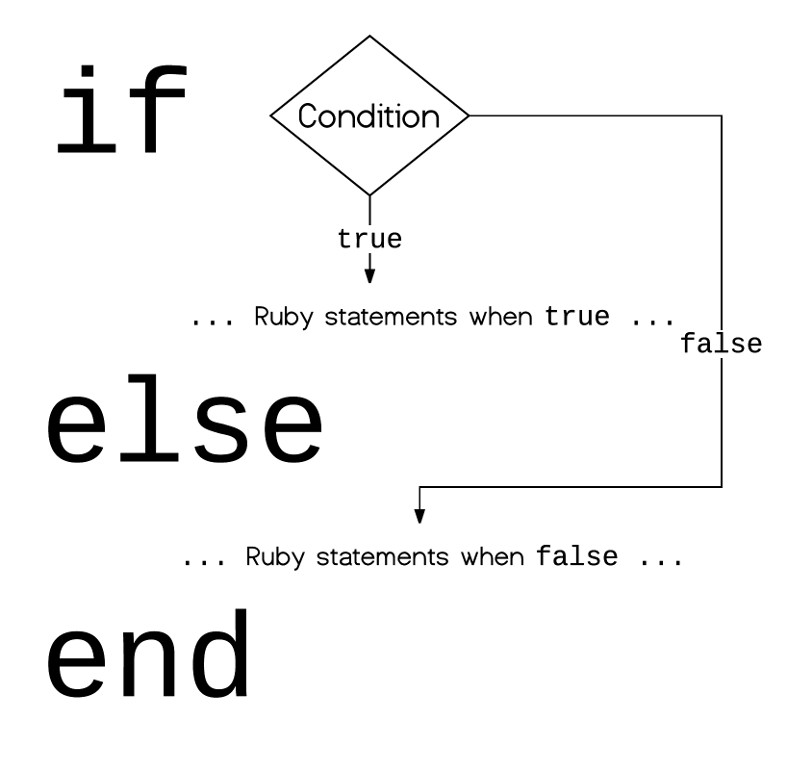

Executing statements one after the after, blindly and unconditionally, is not much fun. You want to 
make your programs more clever. To be able to handle complex conditions and take decisions accordingly.
This is what is this chapter about. It will teach you the basics of *branching* statements in Ruby.

This is the point where we start writing more complex Ruby programs.
