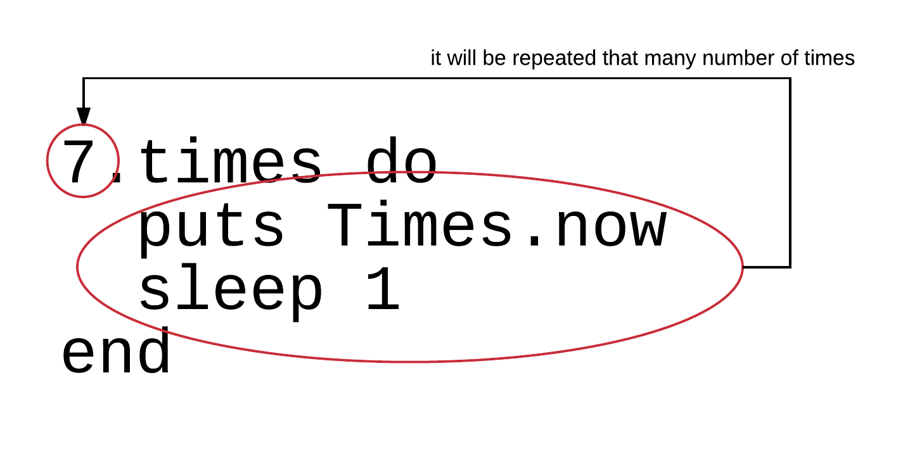
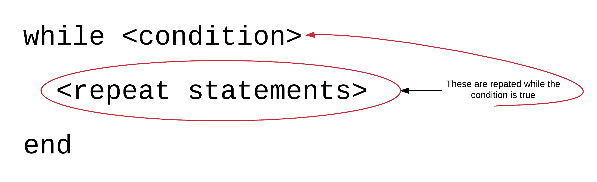
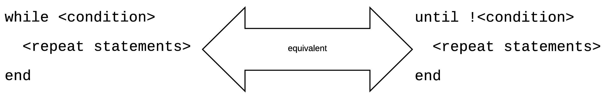

Let's start our IDE, RubyMine. We are going to write some programs that exercise the usage of 
various statements that help us carry out repetitive tasks.

Let's start:

## `.times`

The `.times` command allows us to execute a block of Ruby code a specific number of times. Let's see the following example.
Write that code inside the file `times-1.rb`.

``` ruby
1. # File: times-1.rb
2. #
3. 7.times do
4.  puts Time.now
5.  sleep 1
6. end
```

> *Note:* The line numbers are not part of the source code. They are here to help the explanation text that follows.


If you run the above program from your command line you will see this:

``` bash
$ ruby times-1.rb
2016-10-27 09:02:06 +0300
2016-10-27 09:02:07 +0300
2016-10-27 09:02:08 +0300
2016-10-27 09:02:09 +0300
2016-10-27 09:02:10 +0300
2016-10-27 09:02:11 +0300
2016-10-27 09:02:12 +0300
$
```

You can see that the current date and time stamp has been printed 7 times. Exactly equal to the number that has been used
as the receiver of the `.times` method. You can also see that we have used the command `sleep()` on line 5. This takes as
argument the number of seconds to sleep, i.e. do nothing, before proceeding with the execution of the next statement.

In other words, Ruby interpreter executes the two lines:
``` ruby
puts Time.now
sleep 1
```

7 times. This is a repetition construct. Whatever we wanted to be executed multiple times has been put inside a `do..end` block.



The `times` method is allowed to take as a blog argument the index of the iteration. You can call the index argument any name you like, but
we usually call it `i`. See the following code. Save it inside file `times-2.rb`.

``` ruby
1. # File: times-2.rb
2. #
3. 7.times do |i|
4.   puts "Iteration index: #{i}"
5.   puts Time.now
6.   sleep 1
7. end
```

Then run the Ruby file:

``` bash
$ ruby times-2.rb
Iteration index: 0
2016-10-27 09:18:01 +0300
Iteration index: 1
2016-10-27 09:18:02 +0300
Iteration index: 2
2016-10-27 09:18:03 +0300
Iteration index: 3
2016-10-27 09:18:04 +0300
Iteration index: 4
2016-10-27 09:18:05 +0300
Iteration index: 5
2016-10-27 09:18:06 +0300
Iteration index: 6
2016-10-27 09:18:07 +0300
```

As you can see for each one of the iterations you get the iteration index printed. The iteration index starts from `0` and ends to an integer
1 less than the number of repetitions. Hence, it is a 0-based indexing scheme that is used here.

Pay also attention on how we declare the `do..end` block local arguments. We do that with enlisting the arguments inside vertical bars (and not parenthesis).

## `.upto` and `.downto`

There are 2 other very convenient methods to construct a repetition loop.

Let's see the following example. Save the content to the file `upto.rb`.

``` ruby
1. # File: upto-downto-1.rb
2. #
3. 10.upto 20 do |i|
4.   puts "This is the iteration for number #{i}"
5. end
```

If you save the above and run it, you will get this:

``` bash
$ ruby upto.rb
This is the iteration for number 10
This is the iteration for number 11
This is the iteration for number 12
This is the iteration for number 13
This is the iteration for number 14
This is the iteration for number 15
This is the iteration for number 16
This is the iteration for number 17
This is the iteration for number 18
This is the iteration for number 19
This is the iteration for number 20
```

As you can see, the repetition is executed 11 times, starting from 10 and ending to 20. On each repetition, the actual number the repetition is executed
for is given to the `i` argument of the `do..end` repetition block. Also, on each repetition the increment from one number to the next is by 1.

The opposite can be done with `.downto` method. Let's see the following example (file: `downto.rb`):

``` ruby
1. # File: downto.rb
2. #
3. 20.downto 10 do |i|
4.   puts "This is the iteration for number #{i}"
5. end
```

If you run this, you will get something like the following:

``` bash
$ ruby downto.rb
This is the iteration for number 20
This is the iteration for number 19
This is the iteration for number 18
This is the iteration for number 17
This is the iteration for number 16
This is the iteration for number 15
This is the iteration for number 14
This is the iteration for number 13
This is the iteration for number 12
This is the iteration for number 11
This is the iteration for number 10
```

Again, the repetition block has been executed 11 times. This time starting from 20 and ending down to 10. One-by-one. The `i` holds, again, the
number that the repetition is repeated for.

## `.step`

This is a command similar to `.downto` and `.upto`. Let's see the following example (file: `step.rb`):

``` ruby
1. # File: step.rb
2. #
3. 10.step 20 do |i|
4.   puts "Index #{i}"
5. end
```

The above will repeat the `do..end` block 11 times. The 1st time, the `i` will be `10`, the 2nd time, it will be `11` and so on.
until `20` (including). So, this functions similar to `10.upto 20 do |i| ... end` block that we saw earlier.

If you run the above program, you will see this:

``` bash
$ ruby step.rb
Index 10
Index 11
Index 12
Index 13
Index 14
Index 15
Index 16
Index 17
Index 18
Index 19
Index 20
$
```

The advantage of `.step` is that you can define the step value, i.e. how one repetition number differs from the previous one. Let's see the
following example (file: `step-2.rb`):

``` ruby
1. # File: step-2.rb
2. #
3. 10.step 20, 2 do |i|
4.  puts "Index #{i}"
5. end
```

As you can see on line 3, the argument `2` defines the step value for the `.step` repetition.
 


If you run the above program, you will see this:

``` bash
$ ruby step-2.rb
Index 10
Index 12
Index 14
Index 16
Index 18
Index 20
$
```

As you can see, the repetition takes place for the numbers `10`, `12`, `14`, `16`, `18` and `20`. This is because the step value has been defined to be `2`.

The `.step` method can be used to do whatever the `.downto` method does, if we specify a negative step value. Look at the following example (file: `step-3.rb`).

``` ruby
1. # File: step-3.rb
2. #
3. 20.step 10, -1 do |i|
4.  puts "Index: #{i}"
5. end
```

Can you see that we have specified the step value to be `-1`? This means that the repetition will start from `20` and then will end up down to `10`, going
down one-by-one.

If you run the above program you will get this:

``` bash
$ ruby step-3.rb
Index: 20
Index: 19
Index: 18
Index: 17
Index: 16
Index: 15
Index: 14
Index: 13
Index: 12
Index: 11
Index: 10
$
```

And of course, you can specify a negative value different from `-1` too (file: `step-4.rb`):

``` ruby
1. # File: step-4.rb
2. #
3. 20.step 10, -2 do |i|
4.  puts "Index: #{i}"
5. end
```

If you run the above, which is using `-2` as the stepping value, you will get this:

``` bash
$ ruby step-4.rb
Index: 20
Index: 18
Index: 16
Index: 14
Index: 12
Index: 10
```

## `while`

Another looping construct is the `while` statement. Its syntax is depicted on the following diagram:



1. The condition after the `while` keyword is evaluated first. If it evaluates to `true` then
2. the statements included until the closing `end` are executed. Then, Ruby interpreters repeats step 1.
3. If the condition evaluates to `false`, the repetition ends.

Let's see some examples. Create the file `while-1.rb` with the following content:

``` ruby
1. # File: while-1.rb
2. #
3. i = 5
4. while i <= 10
5.   puts "This is the repetition for number: #{i}"
6.   i += 1
7. end
```

If you run this, you will get the following:

``` bash
$ ruby while-1.rb
This is the repetition for number: 5
This is the repetition for number: 6
This is the repetition for number: 7
This is the repetition for number: 8
This is the repetition for number: 9
This is the repetition for number: 10
End of loop. Now i is: 11
$
```

This is executed as follows.

1. On line 3, we are setting the initial value to variable `i`. The initial value being `5`.
2. Then, Ruby evaluates the condition after the `while` keyword. `i <= 10`. Since `i` has the value of `5` at that point,
then Ruby will go in and execute the statements that are inside the `while` block. 
3. First statement is the `puts` command that prints information about the iteration and the number at hand.
4. Then is the statement that increases the number from `5` to `6`. 
5. Then, Ruby evaluates the condition again. `6` still being less than or equal to `10`, it goes into the `while` block again.
6. This is repeated until at some point later, `i` is increased from `10` to `11`. In that case, when Ruby evaluates the
condition `i <= 10`, then this is not true any more. Hence, jumps over the `while` block statements and executes the
first statement exactly after the `end` closing keyword.

The last statement verifies that `i` has been increased up to a value which is greater than `10`, i.e. `11`. This made
the condition `i <= 10` to be `false` and the `while` loop to be terminated.

Note that when the while loop has a condition that is not `true` in the first place, then none of its repeat statements
are executed ever. Try this program stored inside file `while-2.rb`:

``` ruby
1. # File: while-2.rb
2. #
3. i = 11
4. while i <= 10
5.   puts "This is the repetition for number: #{i}"
6.   i += 1
7. end
8. 
9. puts "End of loop. Now i is: #{i}"
```

The only difference here is the start value of the `i` variable. It is now set on line 3 to the value `11`. If you run this
program, you will get, simply, that:

``` bash
$ ruby while-2.rb
End of loop. Now i is: 11
$
```

which proves that the `while` block statements were not executed. Not even once.

### Infinite Loops

One difference to the previous repetition statements that we learned, is that `while` needs to make sure it increments the
counter inside its repeat statements. Usually, the last statement is the one that increases the counter that controls
the condition of the repetition. If you forget to add that statement, then you will end creating an *infinite loop* that,
if started, will never end.

Try the following program at your command line (stored in file `infinite-loop-1.rb`):

**You will see that this program runs forever printing endlessly the message `This is the repetition for number: 5`. This
program will never end. You have to press the key combination: <kbd>Ctrl+C</kbd> in order to terminate the program.**

 
``` ruby
1. # File: infinite-loop-1.rb
2. #
3. i = 5
4. while i <= 10
5.  puts "This is the repetition for number: #{i}"
6. end
```

This is exactly the same program that we wrote for `while` loop at the start, but without the increment statement `i += 1`.
The missing increment statement results in `i` being always `5`, i.e. always less than or equal to `10`. The condition
`i <= 10` never becomes `false`. It is always `true`. Hence, the statements inside the `while` block are executed forever.

### `while` loops with non number evaluation condition

The condition that specifies whether the `while` statements will be executed or not, does not have to be only a number evaluation
condition, like `i <= 10` or similar. It can be any condition that evaluates to `true` or `false`.

Look at the following program. It will repetitively ask the user for a name until the user enters the name 'Lucky' or does not enter 
any name (stored in file `ask-name.rb`):

``` ruby
1. # File: ask-name.rb
2. #
3. name = 'foo'
4. while name != 'lucky' && !name.empty?
5.   print 'Give me a name. Give Lucky or nothing if you want to stop: '
6.   name = gets.chomp.downcase
7. end
```

If you run the above program, it will be repetitively asking the user to give a name until they either enter `Lucky` or nothing.

This is an example execution:

``` bash
$ ruby ask-name.rb
Give me a name. Give Lucky or nothing if you want to stop: Peter
Give me a name. Give Lucky or nothing if you want to stop: John
Give me a name. Give Lucky or nothing if you want to stop: Lucky
$
```

The statements implementing this logic are very easy. The repetition repeats while `name` is not equal to `lucky` and is not empty. Please,
note that `name` takes the value from `gets.chomp.downcase`, which allows the condition to check against 'lucky' without caring about 
the actual case used by the user. So, the condition makes sure the logic is case insensitive.

Also, the initial value of `name` is `foo` just to make sure that the repetition is executed at least once (since `foo` is
neither 'Lucky' nor empty).

## `until`

Similar to `while` we can use `until` instead. But the difference is that the repetition is executed *until* the condition
becomes true (or *while* the condition is false).

Let's see the previous example that we did with `while`, now implemented using `until`. Write the following program (stored in
file `until-1.rb`).

``` ruby
1. # File: until-1.rb
2. #
3. i = 5
4. until i > 10
5.   puts "This is the repetition for number: #{i}"
6.   i += 1
7. end
8. 
9. puts "End of loop. Now i is: #{i}"
```

This program behaves exactly like the `while-1.rb` program. Give it a run and you will verify that:

``` bash
$ ruby until-1.rb
This is the repetition for number: 5
This is the repetition for number: 6
This is the repetition for number: 7
This is the repetition for number: 8
This is the repetition for number: 9
This is the repetition for number: 10
End of loop. Now i is: 11
$
```

Implementation wise, the difference is on line 4. Instead of `while i <= 10`, we have `until i > 10`. So,
with `until` we are using the negative condition to the one we are using with `while`. Because, again, as we have told
earlier, the `until` repetition statements are executed **until** the condition is `true`, whereas the `while` repetition
statements are executed **while** the condition is `true`.
 
If we had `while i > 10` then, the `until`, would have been `until i <= 10`. 
 
 

And as the previous picture denotes the `while <condition>` is equivalent to `until !<condition>` since the `!` (not) operator
turns a `true` condition to `false` and a `false` condition to `true`.

## Break Loop Prematurely

Another useful loop-related tool is the `break` command. This allows us to break out of a repetition from the point the `break` is
called. The execution continues with the first command after the repetition block, irrespective of the repetition condition evaluation result.

Write the following program (stored inside `break-1.rb`):

``` ruby
 1. # File: break-1.rb
 2. #
 3. i = 5
 4. while i <= 10
 5.   puts "Iteration for number: #{i}"
 6.   i += 1
 7.   break
 8. end
 9. 
10. puts "After the iteration, i = #{i}"
```

On the above program, although loop condition is supposed to be setting up the loop to run for 6 times (`i` from 5 up to 10 including), it
is actually executed only once, because the line 7 introduces a `break` command that prematurely ends the repetition. Even if `i` 
is `6`, i.e. satisfies the condition (`i <= 10`), the repetition is not repeated for `6`. 

If you un the above program, you will get this:

``` bash
$ ruby break-1.rb
Iteration for number: 5
After the iteration, i = 6
$
```

Basically, the `break` command stops the execution of the statements inside the loop, i.e. skips the statements that follow, and, at the
same time, exists the loop.

## `next`

There is another command that one can use inside a repetition loop. This command is called `next` and will skip the following statements,
but, unlike `break`, it will proceed to the next iteration in the loop (if one, of course, remains to be executed).

Let's see the following example (stored inside `even-numbers-1.rb`):

``` ruby
1. # File: even-numbers-1.rb
2. #
3. 1.upto 50 do |i|
4.  next if i % 2 == 1
5.  puts "#{i} is even number"
6. end
```

If you run the above program, you will see this:

``` bash
$ ruby even-numbers-1.rb
2 is even number
4 is even number
6 is even number
8 is even number
10 is even number
12 is even number
14 is even number
16 is even number
18 is even number
20 is even number
22 is even number
24 is even number
26 is even number
28 is even number
30 is even number
32 is even number
34 is even number
36 is even number
38 is even number
40 is even number
42 is even number
44 is even number
46 is even number
48 is even number
50 is even number
$
```

The program starts from number `1` and walks the numbers until `50`, one-by-one. But on line 4, it jumps to the next number,
skipping the following `puts` command, if the number at hand is an odd number (i.e. the condition `i % 2 == 1` is `true`).
That's why you finally see the even numbers printed. Because the odd numbers are skipped.

## Magic Number Exercise

Let's do a little bit more complex exercise. We will write a small program that will be doing the following:

1. It will repeatedly ask user to type in a number.
2. If the number given is equal to the magic number then we will end the program by first congratulating the user.
3. If the number given is not equal to the magic number then we will ask the user to try another guess. But, before
asking them to try again, we will be giving them a hint. We would be telling them whether the magic number is
greater or less than to the number given by them. 

Save the source code inside the file `magic_number.rb`:

``` ruby
 1. # File: magic_number.rb
 2. #
 3. MAGIC_NUMBER = 5
 4. number_given = 0
 5. while number_given != MAGIC_NUMBER
 6.   print 'Can you guess the magic number? '
 7.   number_given = gets.to_i
 8.   if number_given < MAGIC_NUMBER
 9.     puts "You didn't find it. Magic Number is greater than #{number_given}."
10.   elsif
11.     puts "You didn't find it. Magic Number is less than #{number_given}"
12.   end
13. end
14. 
15. puts "Congratulations! You found it. Magic number is #{MAGIC_NUMBER}"
```

Below, you will find an example run of this program:

``` bash
$ ruby magic_number.rb
Can you guess the magic number? 8
You didn't find it. Magic Number is less than 8
Can you guess the magic number? 6
You didn't find it. Magic Number is less than 6
Can you guess the magic number? 3
You didn't find it. Magic Number is greater than 3.
Can you guess the magic number? 5
You didn't find it. Magic Number is less than 5
Congratulations! You found it. Magic number is 5
$
```

Some notes about this program.

1. We have chosen to represent the value of the magic number with a constant, `MAGIC_NUMBER`. This is because we believe
this is more representative as opposed to a variable. 
2. Every repetition includes:
    1. The retrieval of the number that the user gives. Stored inside the variable `number_given`.
    2. The evaluation whether the `number_given` is less than or greater than the `MAGIC_NUMBER`. We print
    a hint message accordingly.
3. At the end of each iteration, the condition `number_given != MAGIC_NUMBER` is being evaluated and we either
stop or repeat the loop.

## Closing Note

If you want, you can also watch the following video that describes the content of this chapter using some hands-on exercises inside Linux/Debian environment.

<div id="media-title-video-loops-in-ruby.mp4">Loop Constructs in Ruby</div>
<a href="https://player.vimeo.com/video/194630270"></a>
