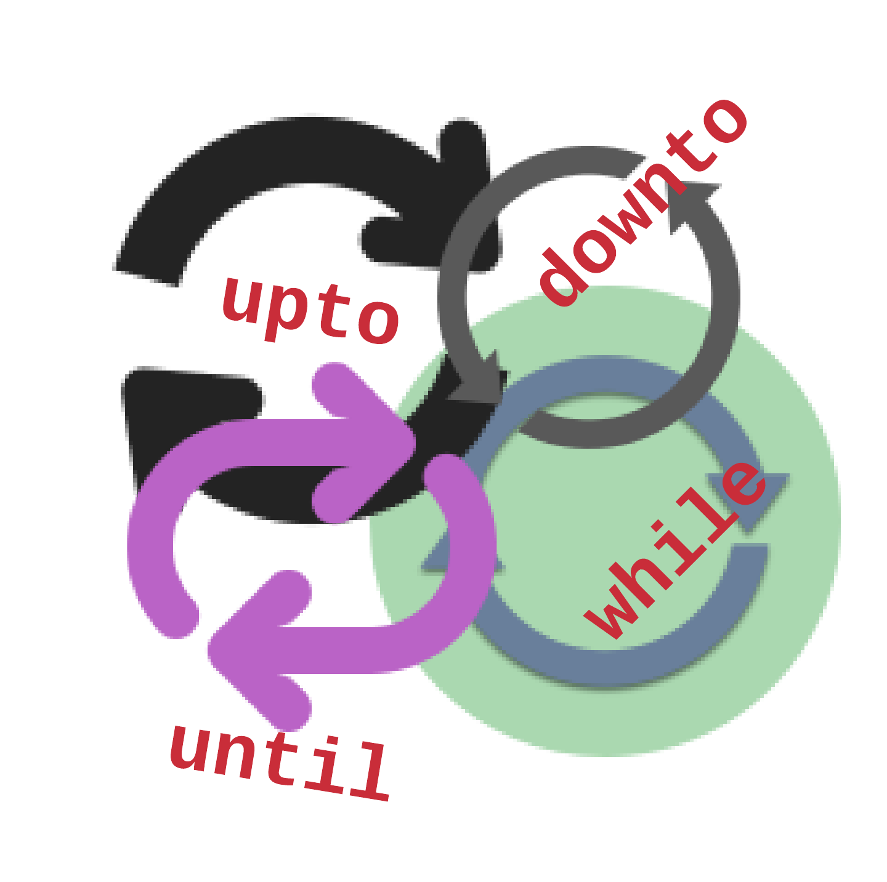

This chapter is about one of the most important capabilities of programming. The fact that programming allows us to ask
computer to repeat a task multiple times, fast and reliably. Isn't this what computers are invented for? To make our
life easier. Repeating a task, a set of Ruby statements, multiple times, serves this mission.
